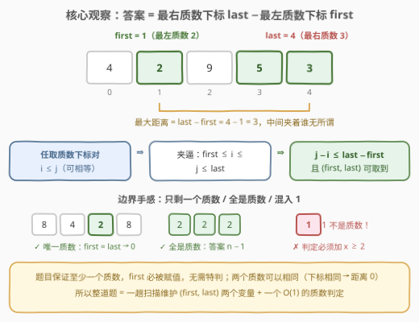
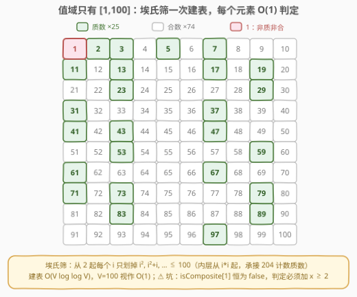
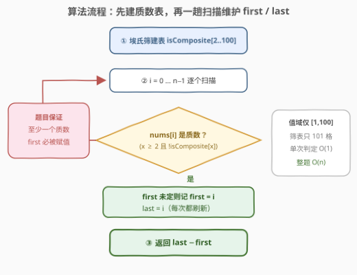
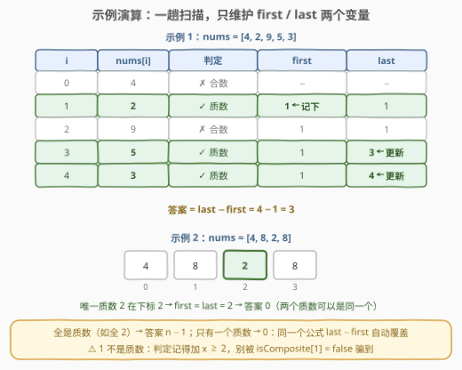

# LeetCode 质数的最大距离 题解

## 1. 题目概述

- **标题 / 题号**：质数的最大距离（#3115，medium）
- **链接**：https://leetcode.cn/problems/maximum-prime-difference/
- **难度**：中等
- **标签**：数组、数学、数论、素性测试

**题意**：给你一个整数数组 `nums`。

返回两个（**不一定不同**的）质数在 `nums` 中**下标**的**最大距离**。

**示例 1**：

```text
输入：nums = [4,2,9,5,3]
输出：3
解释：nums[1]、nums[3] 和 nums[4] 是质数。因此答案是 |4 - 1| = 3。
```

**示例 2**：

```text
输入：nums = [4,8,2,8]
输出：0
解释：nums[2] 是质数。因为只有一个质数，所以答案是 |2 - 2| = 0。
```

**约束**：

- $1 \le \text{nums.length} \le 3 \times 10^5$
- $1 \le \text{nums}[i] \le 100$
- 输入保证 `nums` 中**至少有一个质数**。

> ⚠️ 两个易读漏的点：一是两个质数**可以相同**（只剩一个质数时距离为 0，不是无解）；二是 $1 \le \text{nums}[i] \le 100$——值域极小，这是本题最大的礼物，质数判定可以做到 $O(1)$。

## 2. 解题思路

### 2.1 暴力思路

枚举所有下标对 $(i, j)$，两者都是质数时用 $|i - j|$ 更新答案。$n = 3 \times 10^5$ 时下标对约 $4.5 \times 10^{10}$ 个，必然超时。即便先一趟把质数下标抽成列表再两两枚举，最坏整个数组都是质数（如全 `2`），列表长度仍是 $n$，还是 $O(n^2)$。

瓶颈在「**成对枚举**」。突破口：距离只由**两端**决定——这是典型的「只关心最左最右」型问题。

### 2.2 核心观察：最左质数 × 最右质数，夹逼出最大距离



设 $\text{first}$ = **最左**质数下标，$\text{last}$ = **最右**质数下标，则：

$$\text{答案} = \text{last} - \text{first}$$

**夹逼论证**：任取一对质数下标 $i \le j$（允许相等），必有 $\text{first} \le i \le j \le \text{last}$，故 $j - i \le \text{last} - \text{first}$；而 $(\text{first}, \text{last})$ 本身就是一对合法选法（两个质数可以是同一个），上界恰好被取到。中间夹着什么元素完全无关。

于是整道题塌缩成两件小事：

1. **质数判定**：值域只有 $[1, 100]$，用**埃氏筛**建一张 101 格的布尔表，单次判定 $O(1)$，一共只有 25 个质数；



2. **一趟扫描**：`first` 只在第一次遇见质数时记录，`last` 每次遇见质数都刷新，最后相减。

> 💡 一句话：**建一张 1~100 的质数表，一趟扫描记下最左/最右质数下标，相减即答案**。

### 2.3 算法流程图



整体流程：

1. 埃氏筛预处理 `isComposite[2..100]`（外层只需到 $\sqrt{100} = 10$，内层从 $i^2$ 起划倍数，写法承接 [204. 计数质数](https://leetcode.cn/problems/count-primes/)）；
2. 扫描 $i = 0 \dots n-1$：若 $\text{nums}[i] \ge 2$ 且非合数——`first` 未定则记 `first = i`，`last = i`；
3. 返回 `last - first`。

题目保证至少一个质数，`first` 必被赋值，无需特判。

### 2.4 示例演算



以示例 1 `nums = [4,2,9,5,3]` 为例逐行演算（见上图主表）：

- **i = 1**（值 2，质数）：`first = 1`、`last = 1`——`first` 的唯一一次赋值；
- **i = 3**（值 5，质数）：`last = 3`；
- **i = 4**（值 3，质数）：`last = 4`——扫描结束；
- 答案 $= 4 - 1 = 3$ ✓

示例 2 `[4,8,2,8]` 中唯一质数 2 在下标 2：`first = last = 2`，答案 $0$——「两个质数可以相同」由同一公式自动覆盖。

## 3. 参考代码

### C++

```cpp
class Solution {
  public:
    int maximumPrimeDifference(vector<int>& nums) {
        constexpr int V = 100;
        bool isComposite[V + 1] = {};
        for (int i = 2; i * i <= V; ++i)            // 外层到 √100 = 10 即可
            if (!isComposite[i])
                for (int j = i * i; j <= V; j += i) // 从 i*i 起划倍数
                    isComposite[j] = true;

        int first = -1, last = -1;
        for (int i = 0; i < (int)nums.size(); ++i) {
            if (nums[i] >= 2 && !isComposite[nums[i]]) {  // x ≥ 2：把 1 挡在门外
                if (first == -1) first = i;
                last = i;
            }
        }
        return last - first;   // 题目保证至少一个质数，first 必被赋值
    }
};
```

### Python

```python
class Solution:
    def maximumPrimeDifference(self, nums: List[int]) -> int:
        V = 100
        is_composite = [False] * (V + 1)
        for i in range(2, int(V ** 0.5) + 1):       # 外层到 √100 = 10 即可
            if not is_composite[i]:
                for j in range(i * i, V + 1, i):    # 从 i*i 起划倍数
                    is_composite[j] = True

        first = last = -1
        for i, x in enumerate(nums):
            if x >= 2 and not is_composite[x]:      # x ≥ 2：把 1 挡在门外
                if first == -1:
                    first = i
                last = i
        return last - first
```

> 💡 实现细节：判定条件必须带 $x \ge 2$——埃氏筛只划「合数」，1 既非质数也非合数，`isComposite[1]` 恒为 `false`；漏掉这条，`nums` 里的 1 会顺着 `!isComposite[x]` 混进质数队伍，把 `first` 拉到最左的 1 上，直接算错。这是本题最经典的 WA 点。

## 4. 复杂度分析

| 维度 | 复杂度 | 说明 |
|------|--------|------|
| 时间复杂度 | $O(n + V\log\log V)$ | 建表 $O(V\log\log V)$（$V = 100$ 视作 $O(1)$），扫描一趟 $O(n)$，$n \le 3 \times 10^5$ |
| 空间复杂度 | $O(V)$ | 质数表仅 101 格，与 $n$ 无关，视作 $O(1)$ |

## 5. 扩展：试除法与更大的值域

**试除法版判素**（「素性测试」标签最朴素的实现）：值域 $\le 100$ 时试除到 $\sqrt{x} \le 10$ 步，总代价 $O(n\sqrt{V}) \approx 3 \times 10^6$ 次取模，同样轻松通过：

```cpp
bool isPrime(int x) {
    if (x < 2) return false;          // 1 在这里被正确挡下，天然无坑
    for (int d = 2; d * d <= x; ++d)
        if (x % d == 0) return false;
    return true;
}
```

两种写法按口味选：筛表「一次预处理、全局 $O(1)$ 查询」，试除「零预处理、随写随用」——后者连 $x < 2$ 的坑都天然挡住。

**若值域升到 $10^9$**：筛表空间直接爆炸，应改为对每个元素做 Miller-Rabin 确定性判素（64 位以内整数用固定底数数组即可），单次判定 $O(\log^3 v)$——这正是「素性测试」标签真正的用武之地。本题 $V = 100$ 用不上，但面试口头提一句是加分项。

## 6. 面试要点

1. **为什么答案就是 last − first？**

   - 夹逼论证：任意质数下标对 $i \le j$ 都满足 $\text{first} \le i \le j \le \text{last}$，故 $j - i \le \text{last} - \text{first}$；而 $(\text{first}, \text{last})$ 本身就是合法选法（两个质数允许相同），上界被取到，即最大距离。

2. **质数判定为什么用筛？试除法不行吗？**

   - 值域 $[1,100]$ 下两者都轻松通过：筛表一次建好、每次 $O(1)$ 查；试除单次至多 $\sqrt{100} = 10$ 步。真正的要点是**判定逻辑全局复用**——别把建表/判定塞进循环里重复做。

3. **isComposite[1] 恒为 false，为什么是个坑？**

   - 埃氏筛只标记合数，1 既非质数也非合数，从没被划过；判定若漏写 $x \ge 2$，1 会混进质数队伍把 `first` 拉错。改用试除法（`if (x < 2) return false;`）则天然无此坑。

4. **只剩一个质数 / 全是质数时，公式还成立吗？**

   - 成立：唯一质数时 $\text{first} = \text{last} \Rightarrow 0$；全是质数时 $\text{first} = 0, \text{last} = n-1 \Rightarrow n-1$。题目保证至少一个质数，`first` 必被赋值，无需任何特判。

5. **如果值域放大到 $10^9$、$n$ 到 $10^6$，方案怎么改？**

   - 筛表不可行，改试除 $O(\sqrt{v})$ 或 Miller-Rabin $O(\log^3 v)$ 逐个判定；若要批量判很多数，可只筛出 $[2, \sqrt{V}]$ 内的质数再用它们试除。「扫描维护 first/last」的部分不变。

## 同类练习题

| # | 题目 | 与本题的关联 |
|---|------|-------------|
| 204 | [计数质数](https://leetcode.cn/problems/count-primes/)（[题解](../0201-0300/204_计数质数.md)） | 埃氏筛母题，本题「外层到 $\sqrt{V}$、内层从 $i^2$ 起」的写法直接源自它 |
| 762 | [二进制表示中质数个计算置位位数](https://leetcode.cn/problems/prime-number-of-set-bits-in-binary-representation/) | 同样是小值域质数表 + 逐个判定，只是判定对象换成 popcount |
| 1175 | [质数排列](https://leetcode.cn/problems/prime-arrangements/) | 筛出 $[1,n]$ 内质数个数再乘排列数，筛表复用思想一致 |
| 2523 | [范围内最接近的两个质数](https://leetcode.cn/problems/closest-prime-numbers-in-range/) | 与本题镜像——那里求相邻质数**最小差**，这里求首尾质数**最大差**，一张筛表通吃 |
| 263 | [丑数](https://leetcode.cn/problems/ugly-number/)（[题解](../0201-0300/263_丑数.md)） | 判「只含特定质因子」的数论小品，与判素互为对照 |
