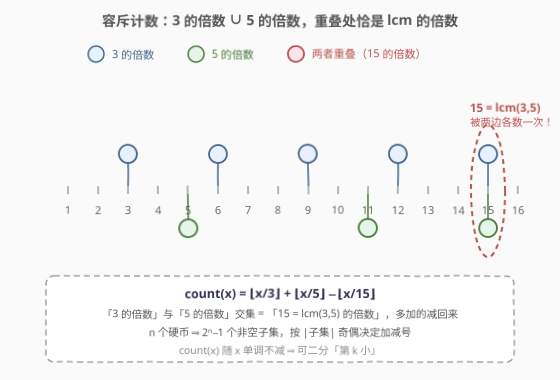
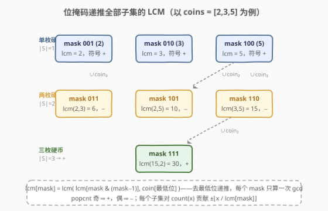
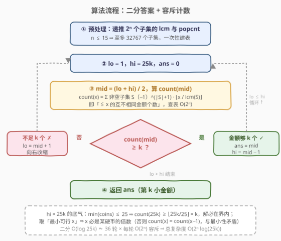

# 单面值组合的第 K 小金额

- **题目名称**：单面值组合的第 K 小金额
- **链接**：[3116. 单面值组合的第 K 小金额](https://leetcode.cn/problems/kth-smallest-amount-with-single-denomination-combination/)
- **难度**：困难
- **标签**：位运算、数组、数学、二分查找、组合数学、数论

## 1. 题目概述

给你一个整数数组 `coins` 表示**不同面额**的硬币，另给你一个整数 `k`。你有无限量的每种面额的硬币，但是你**不能组合使用不同面额**的硬币。

返回使用这些硬币能制造的**第 $k$ 小**金额。

即：每种面额 $c$ 能造出的金额是 $c, 2c, 3c, \dots$（$c$ 的正倍数），所有面额的倍数合并成一个集合（**去重**），求其中第 $k$ 小的数。

**示例 1**：

```text
输入：coins = [3,6,9], k = 3
输出：9
解释：3 的倍数：3, 6, 9, 12, 15, …；6 的倍数：6, 12, 18, …；9 的倍数：9, 18, 27, …
      合并去重后：3, 6, 9, 12, 15, …，第 3 小是 9。
```

**示例 2**：

```text
输入：coins = [5,2], k = 7
输出：12
解释：5 的倍数：5, 10, 15, 20, …；2 的倍数：2, 4, 6, 8, 10, 12, …
      合并去重后：2, 4, 5, 6, 8, 10, 12, 14, 15, …，第 7 小是 12。
```

**约束条件**：

- $1 \le \text{coins.length} \le 15$
- $1 \le \text{coins}[i] \le 25$
- $1 \le k \le 2 \times 10^9$
- `coins` 包含两两不同的整数。

> ⚠️ 两个易读漏的点：一是「不能组合使用不同面额」——金额集合是**各个面额各自倍数集合的并集**，不是经典零钱兑换的任意组合和，$3 + 5 = 8$ 这种混搭**不合法**；二是并集要**去重**（示例 1 中 $6 = 3 \times 2 = 6 \times 1$ 只算一个金额），这恰是本题要用容斥原理的原因。

---

## 2. 解题思路

### 2.1 暴力思路：小顶堆多路归并

把每个硬币的倍数序列看成一个有序链表，$n$ 个链表头放进小顶堆，弹 $k$ 次得到第 $k$ 小——正是 [264. 丑数 II](https://leetcode.cn/problems/ugly-number-ii/) 的多路归并套路。

但 $k \le 2 \times 10^9$，$O(k \log n)$ 要弹二十多亿次，直接爆炸。瓶颈在「**逐个生成**」：第 $k$ 小太远了。突破口是把问题换成**计数视角**——不问「第 $k$ 小是谁」，而问「$\le x$ 的金额有多少个」，一旦计数变快，就能二分答案。

### 2.2 核心观察：二分答案 + 容斥原理计数



**观察 1（单调性 ⇒ 可二分）**：设 $\text{count}(x) :=$ 不大于 $x$ 的互不相同金额个数，它关于 $x$ **单调不减**。于是「$\text{count}(x) \ge k$」呈**前缀假、后缀真**的二段性——**二分找最小的可行 $x$**，它就是第 $k$ 小金额（沿用 [875. 爱吃香蕉的珂珂](../0801-0900/875_爱吃香蕉的珂珂.md) 的二分答案模板）。

**观察 2（容斥公式）**：$\text{count}(x)$ 是 $n$ 个倍数集合大小的并集：

$$\text{count}(x) = \left| A_1 \cup A_2 \cup \dots \cup A_n \right|,\qquad A_i = \{c_i, 2c_i, 3c_i, \dots\}$$

单独数每个 $A_i$ 里 $\le x$ 的元素是 $\lfloor x / c_i \rfloor$，但重叠部分（如 $10$ 同属 $2$ 和 $5$ 的倍数）会被重复统计。按**容斥原理**：

$$\text{count}(x) = \sum_{\emptyset \ne S \subseteq \text{coins}} (-1)^{|S|+1} \left\lfloor \frac{x}{\operatorname{lcm}(S)} \right\rfloor$$

其中 $\operatorname{lcm}(S)$ 表示子集 $S$ 内所有硬币的最小公倍数——因为「同时是 $S$ 中每个硬币的倍数」$\iff$「是 $\operatorname{lcm}(S)$ 的倍数」。$|S|$ 奇数的子集取加号、偶数取减号，奇偶交替正是容斥的全部。

> 💡 以两枚硬币为例：$\text{count}(x) = \lfloor x/c_1 \rfloor + \lfloor x/c_2 \rfloor - \lfloor x/\operatorname{lcm}(c_1,c_2) \rfloor$ 就是两集合版 $|A \cup B| = |A| + |B| - |A \cap B|$，[878. 第 N 个神奇数字](../0801-0900/878_第N个神奇数字.md) 的解法原样搬来。本题只是把 $n$ 从 $2$ 推广到 $15$，需要**位掩码枚举**全部 $2^n - 1$ 个非空子集。

**观察 3（$n \le 15$ 是「枚举子集」的明示）**：硬币两两不同且至多 $15$ 个，$2^{15} - 1 = 32767$ 个子集——每轮计数枚举全部子集毫无压力。子集 LCM 用**位掩码递推**一次建表：

$$\operatorname{lcm}[\text{mask}] = \operatorname{lcm}\big(\operatorname{lcm}[\text{mask} \& (\text{mask}-1)],\ c_{\text{mask 最低位}}\big)$$

即「去掉最低位后的子集」的 LCM，与新拼进来的硬币再求一次 LCM，每个 mask 只算一次 gcd。



**三个工程细节**：

1. **二分上界取 $25k$**：$\min(\text{coins}) \le 25$，故 $\text{count}(25k) \ge \lfloor 25k / 25 \rfloor = k$，解必在 $[1, 25k]$ 内；$25 \times 2 \times 10^9 = 5 \times 10^{10}$，`long long` 稳稳装下。
2. **LCM 不会溢出**：硬币值 $\le 25$ 且两两不同，任意子集的 $\operatorname{lcm} \le \operatorname{lcm}(1,2,\dots,25) = 26\,771\,144\,400 \approx 2.7 \times 10^{10}$，远小于 `long long` 上界 $9.2 \times 10^{18}$（Python 大整数天然无忧）。
3. **答案必落在合法金额上**：$\text{count}$ 只在「某硬币的倍数」处 $+1$。二分取的是**最小**可行 $x$；若 $x$ 不是任何硬币的倍数，则 $\text{count}(x) = \text{count}(x-1) \ge k$，$x-1$ 也可行，与最小性矛盾——故返回值恰是第 $k$ 小金额本身，无需后处理。

### 2.3 算法流程图



整体流程：

1. 位掩码递推 $2^n$ 个子集的 $\operatorname{lcm}$ 与 popcount（建表一次，全程复用）；
2. 闭区间二分 $[1, 25k]$：取 $\text{mid}$，枚举全部非空子集算 $\text{count}(\text{mid})$；
3. $\text{count}(\text{mid}) \ge k$：记录答案并向左收缩（找最左）；否则向右收缩；
4. 区间为空时 `ans` 即第 $k$ 小金额。

### 2.4 示例演算

![示例演算：coins=[5,2], k=7](../images/p3116_example_walkthrough.svg)

以示例 2 `coins = [5,2], k = 7` 为例。非空子集共 $3$ 个：$\{2\}, \{5\}, \{2,5\}$，其中 $\operatorname{lcm}(2,5) = 10$，于是：

$$\text{count}(x) = \left\lfloor \frac{x}{2} \right\rfloor + \left\lfloor \frac{x}{5} \right\rfloor - \left\lfloor \frac{x}{10} \right\rfloor$$

- $\text{count}(11) = 5 + 2 - 1 = 6 < 7$；
- $\text{count}(12) = 6 + 2 - 1 = 7 \ge 7$，且 $12$ 是最小可行值；

二分从 $[1, 175]$ 出发 $7$ 轮收敛到 $12$（完整轨迹见上图右表），与金额序列 $2, 4, 5, 6, 8, 10, \mathbf{12}, 14, 15, \dots$ 中第 $7$ 位恰好吻合 ✓

再看示例 1 `coins = [3,6,9]`：子集 LCM 分别为 $3, 6, 9, 6, 9, 18, 18$，代入容斥：

$$\text{count}(x) = \left\lfloor \frac{x}{3} \right\rfloor + \left\lfloor \frac{x}{6} \right\rfloor + \left\lfloor \frac{x}{9} \right\rfloor - \left\lfloor \frac{x}{6} \right\rfloor - \left\lfloor \frac{x}{9} \right\rfloor - \left\lfloor \frac{x}{18} \right\rfloor + \left\lfloor \frac{x}{18} \right\rfloor = \left\lfloor \frac{x}{3} \right\rfloor$$

含 $6$、$9$ 的项**全部抵消**——它们的倍数本就包含在 $3$ 的倍数里。$\text{count}(9) = 3 \ge 3$、$\text{count}(8) = 2 < 3$，答案 $9$ ✓（这个「自动抵消」还藏着一个优化，见第 5 节）。

---

## 3. 参考代码

### C++

```cpp
class Solution {
  public:
    long long findKthSmallest(vector<int>& coins, int k) {
        int n = coins.size();
        vector<long long> lcms(1 << n);       // 每个子集的 LCM
        vector<int> popcnt(1 << n);           // 每个子集的大小
        lcms[0] = 1;
        for (int mask = 1; mask < (1 << n); ++mask) {
            int lb = __builtin_ctz(mask);     // mask 最低位对应的硬币
            int rest = mask & (mask - 1);     // 去掉最低位后的子集
            popcnt[mask] = popcnt[rest] + 1;
            lcms[mask] = lcm(lcms[rest], (long long)coins[lb]);
        }

        auto count = [&](long long x) {       // ≤ x 的互不相同金额个数
            long long c = 0;
            for (int mask = 1; mask < (1 << n); ++mask)
                c += (popcnt[mask] & 1 ? 1 : -1) * (x / lcms[mask]);
            return c;
        };

        long long lo = 1, hi = 25LL * k, ans = 0;
        while (lo <= hi) {
            long long mid = lo + (hi - lo) / 2;
            if (count(mid) >= k) { ans = mid; hi = mid - 1; }  // 找最左可行
            else lo = mid + 1;
        }
        return ans;
    }
};
```

### Python

```python
class Solution:
    def findKthSmallest(self, coins: List[int], k: int) -> int:
        n = len(coins)
        lcms = [1] * (1 << n)                # 每个子集的 LCM
        for mask in range(1, 1 << n):
            lb = (mask & -mask).bit_length() - 1   # 最低位对应的硬币下标
            lcms[mask] = math.lcm(lcms[mask & (mask - 1)], coins[lb])

        def count(x: int) -> int:            # ≤ x 的互不相同金额个数
            total = 0
            for mask in range(1, 1 << n):
                if bin(mask).count('1') & 1:
                    total += x // lcms[mask]
                else:
                    total -= x // lcms[mask]
            return total

        lo, hi, ans = 1, 25 * k, 0
        while lo <= hi:
            mid = (lo + hi) // 2
            if count(mid) >= k:
                ans, hi = mid, mid - 1       # 找最左可行
            else:
                lo = mid + 1
        return ans
```

> ⚠️ **两个易错点**：
> 1. **二分写「最小可行」而不是「最大可行」**：判断条件是 $\text{count}(\text{mid}) \ge k$，满足时向**左**收缩（`hi = mid − 1`）并记录 `ans`；写成向右收缩会把答案推到「第一个不满足的前一格」甚至错误端。
> 2. **C++ 全程用 `long long`**：上界 $25k \le 5 \times 10^{10}$、子集 LCM 可达 $2.7 \times 10^{10}$，`int` 必炸；Python 无此虑但 `25 * k` 别手滑写成 `25 + k`。

---

## 4. 复杂度分析

| 维度 | 复杂度 | 说明 |
|------|--------|------|
| 时间复杂度 | $O\!\left(2^n \cdot (\log C + \log(25k))\right)$ | 预处理每个 mask 一次 gcd $O(\log C)$（$C \le 25$）；二分 $\le \log_2(5 \times 10^{10}) \approx 36$ 轮，每轮枚举 $2^n - 1$ 个子集。$n = 15$ 时约 $3.3 \times 10^4 \times 36 \approx 1.2 \times 10^6$ 次整除运算，瞬间出结果 |
| 空间复杂度 | $O(2^n)$ | 存每个子集的 $\operatorname{lcm}$ 与 popcount，$n = 15$ 时两张表共约 $6.6 \times 10^4$ 个整数 |

---

## 5. 扩展：先删「被支配」硬币，再做容斥

示例 1 中 $6$ 和 $9$ 的容斥项全部抵消并非巧合——**若硬币 $c$ 是另一硬币 $d$ 的倍数，则 $c$ 的倍数集合 $\subseteq d$ 的倍数集合**，删掉 $c$ 完全不改变并集。预处理时两两检查一遍（$O(n^2)$），只保留「不被任何其它硬币整除」的本源硬币：

```cpp
vector<int> keep;
for (int i = 0; i < n; ++i) {
    bool dominated = false;
    for (int j = 0; j < n && !dominated; ++j)
        if (j != i && coins[i] % coins[j] == 0) dominated = true;
    if (!dominated) keep.push_back(coins[i]);
}
```

值域 $[1, 25]$ 中两两互不整除的反链至多 $13$ 个元素（$13 \sim 25$ 恰好互不整除），故删完后 $n \le 13$、子集数 $\le 8192$，再省一半。这份优化不改变最坏复杂度的量级，属于「免费的白捡加速」。

另一条路线是**不二分、直接堆生成**（2.1 的多路归并）：复杂度 $O(k \log n)$，只在 $k$ 很小时才有意义——本题 $k$ 高达 $2 \times 10^9$，正说明「**能闭式计数就别逐个生成**」这条取第 $k$ 小的黄金法则。

---

## 6. 面试要点

1. **为什么想到二分？二段性在哪？**

   - $k$ 达 $2 \times 10^9$，逐个生成不可行；转而定义 $\text{count}(x) =$「$\le x$ 的金额个数」，它单调不减，于是「$\text{count}(x) \ge k$」呈前假后真的二段性，二分最小可行 $x$ 即答案。

2. **容斥公式怎么现场推出来？**

   - 并集去重：单集合大小 $\lfloor x/c_i \rfloor$，两两交是 $\operatorname{lcm}(c_i, c_j)$ 的倍数、三三交是三个数的 lcm 的倍数……按 $|S|$ 奇偶加减交替，得 $\text{count}(x) = \sum_{S \ne \emptyset} (-1)^{|S|+1} \lfloor x / \operatorname{lcm}(S) \rfloor$。

3. **二分返回的 $x$ 凭什么恰是第 $k$ 小金额，而不是夹在中间的某个数？**

   - 取的是**最小**可行 $x$；$\text{count}$ 只在倍数处跳变，若 $x$ 非任何硬币的倍数则 $\text{count}(x) = \text{count}(x-1)$，$x-1$ 也可行，与最小性矛盾。

4. **上界和 LCM 的溢出怎么论证？**

   - $\min(\text{coins}) \le 25 \Rightarrow \text{count}(25k) \ge k$，上界 $25k \le 5 \times 10^{10}$；子集 LCM $\le \operatorname{lcm}(1..25) = 26\,771\,144\,400$，二者都在 `long long` 安全范围内。

5. **和 878 / 1201 是什么关系？**

   - 878（第 N 个神奇数字）是 $n = 2$ 特例、1201（丑数 III）是 $n = 3$ 特例，容斥手写一两项即可；本题推广到 $n \le 15$，必须位掩码递推 $2^n$ 个子集的 LCM——「$n \le 15/20$」这类约束就是出题人在暗示子集枚举。

---

## 7. 同类练习题

- [878. 第 N 个神奇数字](https://leetcode.cn/problems/nth-magical-number/)（[题解](../0801-0900/878_第N个神奇数字.md)）：本题 $n = 2$ 特例，「二分 + $\lfloor x/a \rfloor + \lfloor x/b \rfloor - \lfloor x/\operatorname{lcm} \rfloor$」同款配方
- [1201. 丑数 III](https://leetcode.cn/problems/ugly-number-iii/)：本题 $n = 3$ 特例，容斥多一个三元交项，思路完全平移
- [264. 丑数 II](https://leetcode.cn/problems/ugly-number-ii/)（[题解](../0201-0300/264_丑数II.md)）：多路归并逐个生成第 $k$ 小的代表作，对照体会「生成 vs 计数」两条路线的适用场景
- [313. 超级丑数](https://leetcode.cn/problems/super-ugly-number/)（[题解](../0301-0400/313_超级丑数.md)）：质因数乘积构成的集合无法容斥计数，只能堆生成——与本题「倍数并集可闭式计数」互为镜像约束
- [719. 找出第 K 小的数对距离](https://leetcode.cn/problems/find-k-th-smallest-pair-distance/)（[题解](../0701-0800/719_找出第K小的数对距离.md)）：二分答案 + 高效计数判定的通用模板，本题把「双指针计数」换成「容斥计数」
