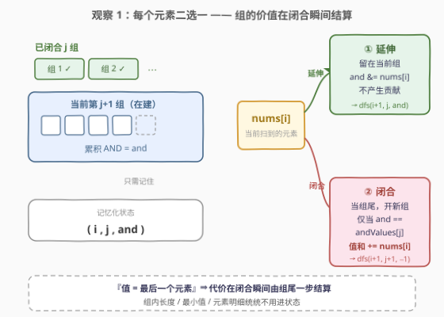
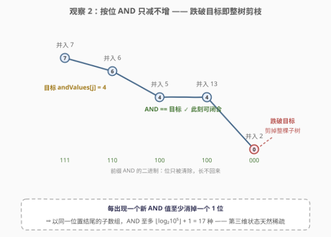
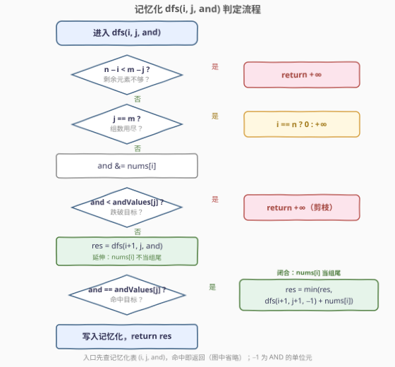
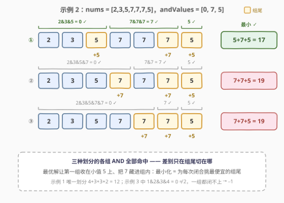

# LeetCode 划分数组得到最小的值之和 题解

## 1. 题目概述

- **标题 / 题号**：划分数组得到最小的值之和（#3117，hard）
- **链接**：https://leetcode.cn/problems/minimum-sum-of-values-by-dividing-array/
- **难度**：困难
- **标签**：位运算、数组、动态规划、记忆化搜索、单调队列

**题意**：给你两个数组 `nums` 和 `andValues`，长度分别为 $n$ 和 $m$。

**数组的「值」等于该数组的最后一个元素。**

你需要将 `nums` 划分为 $m$ 个**不相交的连续**子数组 $[l_1, r_1], [l_2, r_2], \dots, [l_m, r_m]$，第 $i$ 个子数组内所有元素的按位 AND 必须恰好等于 $\text{andValues}[i-1]$：

$$\text{nums}[l_i] \operatorname{AND} \text{nums}[l_i + 1] \operatorname{AND} \cdots \operatorname{AND} \text{nums}[r_i] = \text{andValues}[i - 1]$$

返回所有合法划分中**子数组值之和的最小值**；不存在合法划分则返回 $-1$。

**示例 1**：

```text
输入：nums = [1,4,3,3,2], andValues = [0,3,3,2]
输出：12
解释：唯一合法划分是 [1,4][3][3][2]：1&4=0，单元素组的 AND 就是它本身
      各组「值」（组尾元素）之和 = 4 + 3 + 3 + 2 = 12
```

**示例 2**：

```text
输入：nums = [2,3,5,7,7,7,5], andValues = [0,7,5]
输出：17
解释：三种合法划分的值和分别为 17、19、19，取最小值 17
```

**示例 3**：

```text
输入：nums = [1,2,3,4], andValues = [2]
输出：-1
解释：整个数组的 AND 为 0 ≠ 2，连「分成一组」都做不到
```

**约束**：

- $1 \le n = \text{nums.length} \le 10^4$
- $1 \le m = \text{andValues.length} \le \min(n, 10)$
- $1 \le \text{nums}[i] < 10^5$
- $0 \le \text{andValues}[j] < 10^5$

> ⚠️ 两个易读漏的点：一是「值 = **最后一个元素**」——不是组内最小值也不是最大值，是组尾元素，这个定义直接决定了 DP 的贡献方式；二是 $m$ 个子数组要**恰好铺满**整个 `nums`（不相交、连续、不重不漏），一个元素都不能剩。

## 2. 解题思路

### 2.1 暴力思路：枚举切点

把划分看成在 $n-1$ 个间隙里选 $m-1$ 个位置切刀，共 $\binom{n-1}{m-1}$ 种组合，最坏 $\binom{9999}{9} \approx 2.7 \times 10^{30}$ 种——天文数字，枚不完。

换个视角：从左到右逐个元素扫描，**每个元素只有两种角色**——留在当前组里，或者作为某个组的**组尾**。不同的切点组合常常殊途同归，走到「同一段后缀、同样多的已闭合组、同样的当前组 AND」——**重叠子问题**出现，这是记忆化搜索的信号。

### 2.2 核心观察：组尾结算 + AND 单调剪枝

**观察 1（贡献视角：组的代价在「闭合」瞬间由组尾结算）**

「值 = 最后一个元素」不是坑，是提示。从左往右扫，`nums[i]` 只有两个选择：

- **延伸**：留在当前组，更新当前组的累积 AND，**不产生任何贡献**；
- **闭合**：充当当前组的组尾，一次性贡献 `nums[i]`，开启下一组（仅当累积 AND 恰好命中目标时可选）。



于是「在哪里切刀」被改写成「每个位置二选一」，且做完决策后需要记住的信息只有三个：扫到哪了（$i$）、闭合了几组（$j$）、当前组累积 AND（$\text{and}$）——**状态 $(i, j, \text{and})$ 浮出水面**，组内其余信息（长度、元素明细、最小值……）一概不需要。

**观察 2（AND 单调不增 ⇒ 一刀剪掉整棵子树）**

按位 AND 是「做减法」的运算：往组里并入元素只会**清除**二进制位、绝不会把位**置回**。因此当前组的 AND 随延伸**单调不增**，带来两个红利：

1. **剪枝**：一旦 $\text{and} < \text{andValues}[j]$，之后无论并入多少元素都回不到目标，整棵子树直接判死；
2. **状态稀疏**：AND 呈「阶梯式」下降——每出现一个新值至少消掉一个 $1$ 位，所以**以固定下标结尾的子数组，AND 取值至多 $\lfloor \log_2 U \rfloor + 1 = 17$ 种**（$U = 10^5$）。这正是 [898. 子数组按位或操作](https://leetcode.cn/problems/bitwise-ors-of-subarrays/)（[题解](../0801-0900/898_子数组按位或操作.md)）的核心性质，OR 版对称成立。



**观察 3（$m \le \min(n, 10)$ 是复杂度的明示）**

状态 $(i, j, \text{and})$ 三维的量级：$i \le n = 10^4$、$j \le m \le 10$、$\text{and}$ 至多 $18$ 种取值（含单位元 $-1$），状态数上界约

$$n \cdot m \cdot (\log_2 U + 2) \approx 10^4 \times 10 \times 18 \approx 1.8 \times 10^6$$

每个状态 $O(1)$ 转移，Python 也轻松通过。约束里塞一个 $\min(n, 10)$，就是出题人在暗示「把 $m$ 乘进状态数也扛得住」——与 [3116. 单面值组合的第 K 小金额](../3101-3200/3116_单面值组合的第K小金额.md) 的「$n \le 15 \Rightarrow$ 位掩码枚举子集」异曲同工。

### 2.3 算法流程图



定义 `dfs(i, j, and)`：前 $j$ 组已闭合（前 $j$ 个目标已命中），当前第 $j+1$ 组已累积 AND 为 `and`（`-1` 表示空组，是 AND 的单位元），返回把 `nums[i:]` 分完的最小值和：

1. **可行性剪枝**：剩余元素 $n - i$ 少于剩余组数 $m - j$（每组至少一个元素）→ 返回 $+\infty$；
2. **终止**：$j = m$ 时，$i = n$ 返回 $0$（恰好分完），否则返回 $+\infty$；
3. 并入 `nums[i]`：`and &= nums[i]`；若 `and < andValues[j]` → 返回 $+\infty$（观察 2 剪枝）；
4. **延伸**：`dfs(i+1, j, and)`；
5. **闭合**（仅当 `and == andValues[j]`）：`dfs(i+1, j+1, -1) + nums[i]`；
6. 两者取最小，写入记忆化表后返回。

### 2.4 示例演算



以示例 2 为例，三种合法划分的结算对比：

| 划分 | 各组 AND | 各组值（组尾） | 值和 |
|------|----------|----------------|------|
| $[2,3,5]\,[7,7,7]\,[5]$ | $0,\ 7,\ 5$ | $5,\ 7,\ 5$ | $\mathbf{17}$ ✓ |
| $[2,3,5,7]\,[7,7]\,[5]$ | $0,\ 7,\ 5$ | $7,\ 7,\ 5$ | $19$ |
| $[2,3,5,7,7]\,[7]\,[5]$ | $0,\ 7,\ 5$ | $7,\ 7,\ 5$ | $19$ |

三种划分的各组 AND 全部命中（关键在第一组 $2\&3\&5 = 0$；$7$ 的低三位全是 $1$，$7\&7$ 恒为 $7$，怎么并都保持），差别只在**组尾切在哪**：最优解让第一组收在小值 $5$ 上、把大值 $7$ 藏进组内——「最小化」的本质就是**为每一次闭合挑选最便宜的组尾**。示例 1 只有唯一划分 $4+3+3+2=12$；示例 3 中 $1\&2\&3\&4 = 0 \ne 2$，第一组永远闭不上，返回 $-1$。

## 3. 参考代码

### C++

```cpp
class Solution {
  public:
    int minimumValueSum(vector<int>& nums, vector<int>& andValues) {
        int n = nums.size(), m = andValues.size();
        constexpr int INF = INT_MAX / 2;
        unordered_map<uint64_t, int> memo;

        // dfs(i, j, andVal)：前 j 组已闭合，当前组已累积 AND 为 andVal（-1 表空组）
        function<int(int, int, int)> dfs = [&](int i, int j, int andVal) -> int {
            if (n - i < m - j) return INF;               // 剩余元素不够每组一个
            if (j == m) return i == n ? 0 : INF;         // 组数用尽：必须恰好扫完
            uint64_t key = (uint64_t)i << 48 | (uint64_t)j << 32 | (uint32_t)andVal;
            auto it = memo.find(key);
            if (it != memo.end()) return it->second;
            andVal &= nums[i];
            int res = INF;
            if (andVal >= andValues[j]) {                // 一旦低于目标就永久无解
                res = dfs(i + 1, j, andVal);             // 延伸：nums[i] 不当组尾
                if (andVal == andValues[j]) {            // 闭合：nums[i] 当组尾
                    int sub = dfs(i + 1, j + 1, -1);     // -1 是 AND 的单位元
                    if (sub < INF) res = min(res, sub + nums[i]);
                }
            }
            memo[key] = res;
            return res;
        };

        int ans = dfs(0, 0, -1);
        return ans >= INF ? -1 : ans;
    }
};
```

### Python

```python
class Solution:
    def minimumValueSum(self, nums: List[int], andValues: List[int]) -> int:
        sys.setrecursionlimit(10 ** 5)      # 递归深度最深约 n + m ≈ 10^4
        n, m = len(nums), len(andValues)
        INF = float('inf')

        @cache
        def dfs(i: int, j: int, and_: int) -> int:
            if n - i < m - j:               # 剩余元素不够每组一个
                return INF
            if j == m:                      # 组数用尽：必须恰好扫完
                return 0 if i == n else INF
            and_ &= nums[i]
            if and_ < andValues[j]:         # AND 只减不增，剪掉整棵子树
                return INF
            res = dfs(i + 1, j, and_)       # 延伸：nums[i] 不当组尾，零贡献
            if and_ == andValues[j]:        # 闭合：nums[i] 当组尾，结算其值
                res = min(res, dfs(i + 1, j + 1, -1) + nums[i])
            return res

        ans = dfs(0, 0, -1)
        return -1 if ans == INF else ans
```

> ⚠️ **三个易错点**：
> 1. **递归深度**：`dfs` 每层只推进 $i$，深度最坏 $O(n) = 10^4$，Python 默认上限 1000 必爆 `RecursionError`，必须 `setrecursionlimit`；C++ 默认栈在 $10^4$ 深度下安全。
> 2. **`-1` 是 AND 的单位元**：补码下 $-1$ 全二进制位为 1，`-1 & x = x`，新组从这里起步；C++ 打包 key 时 `(uint32_t)andVal` 把 $-1$ 映成 $2^{32}-1$，与真实值域（$< 2^{17}$）无碰撞。
> 3. **INF 的传染**：C++ 在「闭合」分支先判 `sub < INF` 再加 `nums[i]`，避免 $+\infty$ 沿闭合链反复加 `nums[i]` 产生漂移，也让死状态存表值恒为 `INF`；Python 的 `float('inf')` 加整数仍是 `inf`，天然免疫。

## 4. 复杂度分析

| 维度 | 复杂度 | 说明 |
|------|--------|------|
| 时间复杂度 | $O(n \cdot m \cdot \log U)$ | 状态 $(i, j, \text{and})$ 中 `and` 是「以固定下标结尾的子数组 AND」，至多 $\lfloor \log_2 U \rfloor + 2 = 18$ 种取值；$n \le 10^4$、$m \le 10$，状态数上界 $\approx 1.8 \times 10^6$，每个状态 $O(1)$ 转移（哈希表查改） |
| 空间复杂度 | $O(n \cdot m \cdot \log U)$ | 记忆化哈希表存全部状态，另有递归栈 $O(n)$ |

（$U = 10^5$ 为 `nums` 值域上界。实际可达状态数远小于上界——剪枝会把 `and < 目标` 的分支整棵砍掉。）

## 5. 扩展：去掉递归与哈希——单调队列滑窗 DP

官方提示给出了另一条**甩掉第三维**的路线。定义

$$dp[j][i] = \text{前 } i \text{ 个元素分成前 } j \text{ 组的最小值和}$$

$$dp[j][i] = \text{nums}[i-1] + \min_{s \in [lo_i,\, hi_i]} \; dp[j-1][s]$$

其中 $[lo_i, hi_i]$ 是「以 `nums[i-1]` 结尾、AND 恰为 $\text{andValues}[j-1]$」的子数组的**起点区间**。两个关键性质都源自 AND 单调不增：

1. **起点集是连续区间**：固定结尾 $i-1$，起点越靠左元素越多、AND 越小，故「AND == 目标」的起点连成一段；
2. **区间随 $i$ 单调右移**：$i$ 右移一位，任何起点的 AND 只减不增，于是 $lo_i$、$hi_i$ 都只会右移——对起点 $s$ 求 $\min dp[j-1][s]$ 正是**滑动窗口最小值**，单调队列 $O(1)$ 摊还。

实现上借助观察 2 的「≤17 种」：逐个 $i$ 增量维护「以 $i-1$ 结尾的子数组 AND 值区间表」，从中二合一地读出窗口两端。已对拍验证的完整代码：

```python
from collections import deque

class Solution:
    def minimumValueSum(self, nums: List[int], andValues: List[int]) -> int:
        n, m = len(nums), len(andValues)
        INF = float('inf')
        dp = [0] + [INF] * n                  # 第 0 层：空前缀代价 0
        for j in range(m):
            target = andValues[j]
            ndp = [INF] * (n + 1)
            ands = []                         # (AND 值, 起点)，起点升序 ⇒ 值升序
            dq = deque()                      # 单调队列：存起点 s，对应 dp[s] 递增
            added = -1                        # 已入队的最大起点
            for i in range(1, n + 1):
                x = nums[i - 1]
                ands = [(v & x, lo) for v, lo in ands] + [(x, i - 1)]
                ands = [p for k, p in enumerate(ands) if k == 0 or ands[k - 1][0] != p[0]]
                lo_win = i                    # AND ≥ target 的最小起点（无则空窗口）
                for v, lo in ands:
                    if v >= target:
                        lo_win = lo
                        break
                hi_win = i - 1                # AND ≤ target 的最大起点
                for v, lo in ands:
                    if v > target:
                        hi_win = lo - 1
                        break
                while added < hi_win:         # 窗口右端右移，新起点入队
                    added += 1
                    while dq and dp[dq[-1]] >= dp[added]:
                        dq.pop()
                    dq.append(added)
                while dq and dq[0] < lo_win:  # 窗口左端右移，弹出过期起点
                    dq.popleft()
                if lo_win <= hi_win and dq:
                    ndp[i] = dp[dq[0]] + nums[i - 1]
            dp = ndp
        return -1 if dp[n] == INF else dp[n]
```

每层做 $O(n \cdot \log U)$ 的区间表维护，总复杂度仍是 $O(n \cdot m \cdot \log U)$，但无递归、无哈希、常数远小；若改用**稀疏表 $O(1)$ 区间 AND + 双指针**定位窗口（官方提示的 Segment Tree / Binary Search 路线），每层可严格做到 $O(n)$。本题约束下两条路线都绰绰有余——**记忆化版代码量只有一半、思路也更好讲，是面试首选**。

## 6. 面试要点

1. **「值 = 最后一个元素」对状态设计意味着什么？**

   - 组的代价在**闭合瞬间**由组尾结算，`+ nums[i]` 一步完成，状态无需记录组内最小值/最大值等任何信息。若把定义改成「组的最小值」，最小值就得进状态（或在转移时用 RMQ 查询），难度陡增——题目定义本身就是难度调节器。

2. **记忆化为什么不会爆炸？状态数怎么估？**

   - 第三维 `and` 是「以固定下标结尾的子数组 AND」：每出现一个新值至少消掉一个 1 位，至多 $\lfloor \log_2 U \rfloor + 1 = 17$ 种；再乘 $i \le n$、$j \le m \le 10$，上界约 $1.8 \times 10^6$。$m \le \min(n, 10)$ 的约束就是出题人给的复杂度暗示。

3. **`and < andValues[j]` 时剪枝为什么是对的？**

   - AND 并入元素只会清位不会置位，当前组 AND 单调不增；一旦低于目标，延伸多远都回不去，整棵子树无解。这个剪枝同时把记忆化表里的 `and` 值压在目标之上，天然缩小了第三维的实际取值。

4. **把 AND 换成 OR / XOR 还能这样做吗？**

   - OR 对称成立：单调**不减**，改剪「高于目标」即可，「至多 $\log U$ 种」照旧（898 就是 OR 版原型）；XOR 不单调、也无位值递减性质，剪枝与状态数上界双双失效，需要另起炉灶。

5. **递归深度和 C++ 实现细节有哪些坑？**

   - 深度 $O(n) = 10^4$：Python 必须 `setrecursionlimit`，C++ 默认栈安全；C++ 记忆化用 `unordered_map` 时要把三维状态**位移打包**成一个 64 位 key（`i<<48 | j<<32 | (uint32_t)andVal`），注意 $-1$ 转无符号后的编码不能与真实值域冲突。

## 同类练习题

| # | 题目 | 与本题的关联 |
|---|------|-------------|
| 898 | [子数组按位或操作](https://leetcode.cn/problems/bitwise-ors-of-subarrays/)（[题解](../0801-0900/898_子数组按位或操作.md)） | 「子数组按位值至多 $\log U$ 种」性质的原型题（OR 版），观察 2 的出处 |
| 2871 | [将数组分割成最多数目的子数组](https://leetcode.cn/problems/split-array-into-maximum-number-of-subarrays/)（[题解](../2801-2900/2871_将数组分割成最多数目的子数组.md)） | 同样是「AND 约束下分割数组」，反向问最少代价、贪心视角切分 |
| 410 | [分割数组的最大值](https://leetcode.cn/problems/split-array-largest-sum/)（[题解](../0401-0500/410_分割数组的最大值.md)） | 「分成 $m$ 段连续子数组」的祖师爷，分组型问题二分 / DP 双解模板 |
| 813 | [最大平均值和的分组](https://leetcode.cn/problems/largest-sum-of-averages/)（[题解](../0801-0900/813_最大平均值和的分组.md)） | 分组型 DP 入门，区间代价用前缀和 $O(1)$ 结算，对比本题「代价=组尾」的更简结算 |
| 2464 | [有效分割中的最少子数组数目](https://leetcode.cn/problems/minimum-subarrays-in-a-valid-split/) | 把 AND 换成 gcd 的条件分组——gcd 同样随元素增多单调不增，贪心切分 |
