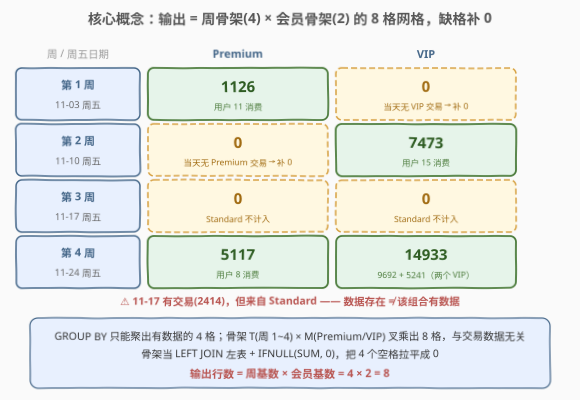
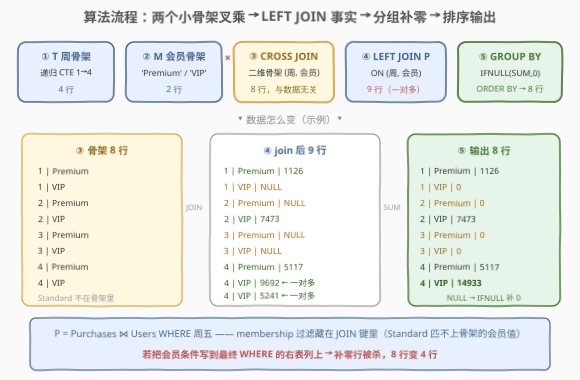
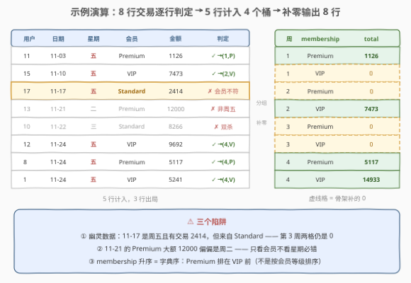

# 发生在周五的交易 III

- **题目名称**：发生在周五的交易 III
- **链接**：[3118. 发生在周五的交易 III 🔒](https://leetcode.cn/problems/friday-purchase-iii/)
- **难度**：中等
- **标签**：数据库、SQL、递归 CTE、维度骨架、笛卡尔积、LEFT JOIN 补零、日期函数、LeetCode 锁题

## 1. 题目概述

> ⚠️ 本题为 LeetCode 付费题（锁题），题意描述根据官方示例用例与外部资料重建，可能与官方题面有出入。

**表结构**：`Purchases`

| 列名 | 类型 |
|------|------|
| user_id | int |
| purchase_date | date |
| amount_spend | int |

- `(user_id, purchase_date, amount_spend)` 是这张表的主键（具有唯一值的列组合）。
- `purchase_date` 的范围从 2023-11-01 到 2023-11-30（含两端）。
- 每行包含用户 id、购买日期与消费金额。

**表结构**：`Users`

| 列名 | 类型 |
|------|------|
| user_id | int |
| membership | enum |

- `user_id` 是这张表的主键。
- `membership` 是 `('Standard', 'Premium', 'VIP')` 的枚举类型。
- 每行表示某个用户的会员类型。

**目标**：编写解决方案，计算 `Premium` 和 `VIP` 会员在 **2023 年 11 月每周的周五**的**总花费**。若某个周五没有 `Premium` 或 `VIP` 会员购买，按 `0` 处理。结果按 `week_of_month` **升序**排列，再按 `membership` **升序**排列。

**输出**：`week_of_month`、`membership`、`total_amount` 三列——**恒为 8 行**（4 周 × 2 种会员）。

**示例 1**：

```text
输入：
Purchases 表：
+---------+---------------+--------------+
| user_id | purchase_date | amount_spend |
+---------+---------------+--------------+
| 11      | 2023-11-03    | 1126         |
| 15      | 2023-11-10    | 7473         |
| 17      | 2023-11-17    | 2414         |
| 12      | 2023-11-24    | 9692         |
| 8       | 2023-11-24    | 5117         |
| 1       | 2023-11-24    | 5241         |
| 10      | 2023-11-22    | 8266         |
| 13      | 2023-11-21    | 12000        |
+---------+---------------+--------------+

Users 表：
+---------+------------+
| user_id | membership |
+---------+------------+
| 11      | Premium    |
| 15      | VIP        |
| 17      | Standard   |
| 12      | VIP        |
| 8       | Premium    |
| 1       | VIP        |
| 10      | Standard   |
| 13      | Premium    |
+---------+------------+

输出：
+---------------+------------+--------------+
| week_of_month | membership | total_amount |
+---------------+------------+--------------+
| 1             | Premium    | 1126         |
| 1             | VIP        | 0            |
| 2             | Premium    | 0            |
| 2             | VIP        | 7473         |
| 3             | Premium    | 0            |
| 3             | VIP        | 0            |
| 4             | Premium    | 5117         |
| 4             | VIP        | 14933        |
+---------------+------------+--------------+
```

**解释**：

- 第 1 周周五（2023-11-03）：Premium 用户 11 消费 1126；当天无 VIP 交易 → VIP 输出 0。
- 第 2 周周五（2023-11-10）：VIP 用户 15 消费 7473；当天无 Premium 交易 → Premium 输出 0。
- 第 3 周周五（2023-11-17）：只有 **Standard** 用户 17 消费 2414——Standard **不计入**，两格都输出 0。
- 第 4 周周五（2023-11-24）：Premium 用户 8 消费 5117；VIP 用户 12、1 共消费 $9692 + 5241 = 14933$。
- 11-21（周二）、11-22（周三）不是周五，整体滤除。

**约束条件**：

- `purchase_date` 为 `DATE` 类型，全部落在 2023-11-01 至 2023-11-30；
- `membership` 只有 `'Standard'`、`'Premium'`、`'VIP'` 三种取值；
- 输出列名为 `week_of_month`、`membership`、`total_amount`，排序规则 `week_of_month` 升序、`membership` 升序。

> 💡 **审题四个关键点**：① 只统计 **Premium / VIP**——Standard 会员是专门埋的干扰项；② 输出**恒为 8 行**——「周 × 会员」的二维组合必须全覆盖；③ `membership` 升序是**字典序** `Premium < VIP`，不是按等级让 VIP 在前；④ `week_of_month` 口径 = $\lceil \text{day}/7 \rceil$（1–7 日为第 1 周，承接 [2993](../2901-3000/2993_发生在周五的交易I.md) 的证明）。

---

## 2. 解题思路

### 2.1 暴力思路：JOIN + 过滤 + 直接 GROUP BY（只剩 4 行）

直觉写法：两表按 `user_id` 连上，筛出周五且会员为 Premium/VIP 的行，按周序和会员分组求和：

```sql
SELECT CEIL(DAYOFMONTH(purchase_date) / 7) AS week_of_month,
       membership,
       SUM(amount_spend)                 AS total_amount
FROM Purchases
JOIN Users USING (user_id)
WHERE DAYOFWEEK(purchase_date) = 6
  AND membership IN ('Premium', 'VIP')
GROUP BY week_of_month, membership
ORDER BY week_of_month, membership;
```

输出只有 **4 行**：

| 幸存组合 | total_amount | 对应缺失组合（应补 0） |
|----------|--------------|------------------------|
| (1, Premium) | 1126 | (1, VIP) |
| (2, VIP) | 7473 | (2, Premium) |
| (4, Premium) | 5117 | (3, Premium) |
| (4, VIP) | 14933 | (3, VIP) |

**聚合只会「折叠」已有行，不会「发明」不存在的行**——`GROUP BY` 只为幸存的数据组合建组。与 [2994](../2901-3000/2994_发生在周五的交易II.md) 的「整周缺失」相比，本题缺失的粒度更细：不是整个周五没有交易，而是**「周 × 会员」的二维组合**恰好没有数据。示例里 11-17 明明有一笔 Standard 交易，但 (3, Premium)、(3, VIP) 两格照样是空的——**「当天有数据」≠「该维度的组合有数据」**。

> ⚠️ 暴力法的本质问题：把「8 个输出格」当成了「4 个有数据的格」。要让 8 个格都在，行的来源就不能是事实表，而必须是一张与数据无关、天然齐全的**二维骨架**。

### 2.2 核心观察：二维骨架 = 周骨架 × 会员骨架，叉乘出 8 行



承接 2994 的「日历骨架」思想，只是骨架从一维升到二维——**需要补零的维度有几个，骨架就笛卡尔积几张小维表**：

**观察 1（周骨架 T）**：2023 年 11 月恰有 4 个周五（3 / 10 / 17 / 24），按 $\lceil \text{day}/7 \rceil$ 口径分属第 1~4 周。递归 CTE 从 1 数到 4 即得 4 行骨架：

```sql
WITH RECURSIVE T AS (
    SELECT 1 AS week_of_month
    UNION
    SELECT week_of_month + 1 FROM T WHERE week_of_month < 4
)
```

**观察 2（会员骨架 M）**：要统计的会员类型只有两种，`UNION` 出 2 行骨架。**Standard 不在骨架里**——它根本不配出现在输出中。

**观察 3（叉乘）**：`T CROSS JOIN M` 得到 $4 \times 2 = 8$ 行，**与交易数据完全无关**——哪怕 `Purchases` 是空表，这 8 行也原样存在。让它们当 `LEFT JOIN` 的**左表**，输出行数被锁死为 8。

**观察 4（事实表 P + 补零）**：`Purchases ⋈ Users` 后筛出周五的交易当右表，`LEFT JOIN` 匹配不上时 `amount_spend` 为 NULL，而 `SUM` 作用于全 NULL 组返回 **NULL 而非 0**，必须 `IFNULL(SUM(amount_spend), 0)` 兜底。

一个精妙的细节：**membership 过滤可以完全不写**。骨架的会员维只有 Premium / VIP，LEFT JOIN 用 `(week_of_month, membership)` 做 JOIN 键时，Standard 的周五交易（11-17 的 2414）**匹配不上任何骨架行**，天然被排除——过滤条件被「藏」进了 JOIN 键里（见 5.1 的深入讨论）。

### 2.3 算法流程图



**逻辑执行步骤**：

| 步骤 | SQL 片段 | 作用 | 示例数据流 |
|------|----------|------|-----------|
| ① | `T`（递归 CTE） | 生成周骨架 1~4 | 4 行 |
| ② | `M`（UNION） | 生成会员骨架 | 2 行：Premium、VIP |
| ③ | `T CROSS JOIN M` | 叉乘出二维骨架 | **8 行**，与数据无关 |
| ④ | `P`（Purchases ⋈ Users + 周五） | 筛出周五的事实行 | 5 行（含 Standard 的 2414） |
| ⑤ | 骨架 `LEFT JOIN P` | 按 (week, membership) 匹配 | **9 行**（(4, VIP) 匹中 2 行事实） |
| ⑥ | `GROUP BY + IFNULL(SUM, 0)` | 折叠聚合 + 补零 | 8 组 |
| ⑦ | `ORDER BY 1, 2` | 周序、会员字典序升序 | 8 行输出 |

> ⚠️ 注意 ⑤ 的一个隐藏细节：LEFT JOIN 是**一对多**的——骨架行 (4, VIP) 能匹配到两条事实（9692 与 5241），join 后的中间结果因此是 **9 行而不是 8 行**。这不影响正确性：⑥ 的 `GROUP BY` 会把这两行重新折叠进同一格求和。骨架决定「**至少**有哪些组」，不决定中间行数。

### 2.4 示例演算



把 8 行交易按日期排序，逐行过「周五 + 会员」两道闸：

| user_id | purchase_date | 星期 | membership | amount | 判定 | 去向 |
|---------|---------------|------|-----------|--------|------|------|
| 11 | 2023-11-03 | 周五 | Premium | 1126 | ✓ | 桶 (1, Premium) |
| 15 | 2023-11-10 | 周五 | VIP | 7473 | ✓ | 桶 (2, VIP) |
| 17 | 2023-11-17 | 周五 | **Standard** | 2414 | ✗ 会员不符 | **幽灵数据**，第 3 周两格仍为 0 |
| 13 | 2023-11-21 | 周二 | Premium | 12000 | ✗ 非周五 | 滤除 |
| 10 | 2023-11-22 | 周三 | Standard | 8266 | ✗ 双杀 | 滤除 |
| 12 | 2023-11-24 | 周五 | VIP | 9692 | ✓ | 桶 (4, VIP) |
| 8 | 2023-11-24 | 周五 | Premium | 5117 | ✓ | 桶 (4, Premium) |
| 1 | 2023-11-24 | 周五 | VIP | 5241 | ✓ | 桶 (4, VIP) |

**收尾聚合 + 补零**（骨架 8 格 → 有数据的 4 格填值，其余补 0）：

$$
(1,\text{Premium}){=}1126,\ (1,\text{VIP}){=}0,\ (2,\text{Premium}){=}0,\ (2,\text{VIP}){=}7473
$$
$$
(3,\text{Premium}){=}0,\ (3,\text{VIP}){=}0,\ (4,\text{Premium}){=}5117,\ (4,\text{VIP}){=}9692{+}5241{=}14933
$$

> 💡 干扰数据的设计感满满：**11-17 是「周五但有数据却不算」**的幽灵——忘了排除 Standard，第 3 周 Premium 就会错误地显示 2414；**11-21 的 Premium 大额 12000 偏偏是周二**——专钓「只看会员不看星期」的写法；11-22 则是「非周五 + Standard」的双保险。三个陷阱分别守住 WHERE 的两个条件和骨架的会员维。

---

## 3. 参考代码

### SQL（解法 A：周骨架递归 CTE，官方风格）

```sql
# Write your MySQL query statement below
WITH RECURSIVE
    T AS (
        SELECT 1 AS week_of_month
        UNION
        SELECT week_of_month + 1
        FROM T
        WHERE week_of_month < 4
    ),
    M AS (
        SELECT 'Premium' AS membership
        UNION
        SELECT 'VIP'
    ),
    P AS (
        SELECT CEIL(DAYOFMONTH(purchase_date) / 7) AS week_of_month,
               membership,
               amount_spend
        FROM Purchases
        JOIN Users USING (user_id)
        WHERE DAYOFWEEK(purchase_date) = 6          -- 周日=1, …, 周五=6
    )
SELECT week_of_month,
       membership,
       IFNULL(SUM(amount_spend), 0) AS total_amount
FROM T
CROSS JOIN M
LEFT JOIN P USING (week_of_month, membership)
GROUP BY 1, 2
ORDER BY 1, 2;
```

> 💡 **写法要点**：
> - **`T CROSS JOIN M`**：MySQL 里 `JOIN`、`CROSS JOIN`、`INNER JOIN` 语法等价，无 `ON` 子句时即为笛卡尔积；显式写 `CROSS JOIN` 是给读者看的自我注释；
> - **`P` 里只有周五条件，没有会员条件**——membership 过滤由 `USING (week_of_month, membership)` 的 JOIN 键隐式完成：Standard 行匹配不上骨架的任何会员值，自动出局；
> - **`USING` 多列**：`LEFT JOIN P USING (a, b)` 等价于 `ON T.a = P.a AND T.b = P.b`，且合并同名列，`GROUP BY 1, 2` / `ORDER BY 1, 2` 用输出列序号简写；
> - **`IFNULL` 包在 `SUM` 外面**：全 NULL 组的 `SUM` 返回 NULL，先兜底再聚合的位置写反了语义就变了（见 6.4）。

### SQL（解法 B：周五日期骨架，泛化到任意月份）

```sql
# Write your MySQL query statement below
WITH RECURSIVE
    Friday AS (
        SELECT DATE('2023-11-03') AS d              -- 11 月的第一个周五
        UNION ALL
        SELECT d + INTERVAL 7 DAY
        FROM Friday
        WHERE d + INTERVAL 7 DAY <= '2023-11-30'    -- 不越出 11 月
    ),
    M AS (
        SELECT 'Premium' AS membership
        UNION
        SELECT 'VIP'
    ),
    P AS (
        SELECT purchase_date, membership, amount_spend
        FROM Purchases
        JOIN Users USING (user_id)
        WHERE DAYOFWEEK(purchase_date) = 6
    )
SELECT CEIL(DAYOFMONTH(f.d) / 7)    AS week_of_month,
       m.membership,
       IFNULL(SUM(p.amount_spend), 0) AS total_amount
FROM Friday f
CROSS JOIN M m
LEFT JOIN P p
       ON p.purchase_date = f.d AND p.membership = m.membership
GROUP BY 1, 2
ORDER BY 1, 2;
```

> 💡 **解法 B 的取舍**：
> - 骨架不写死「4 周」，而是**从周五日期推导**——12 月这种有 5 个周五的月份自动长出第 5 行（解法 A 的 `WHERE week_of_month < 4` 会漏，见 5.2）；
> - JOIN 键退回到「日期 + 会员」两列，`week_of_month` 只需从骨架日期 `f.d` 算一次，不必在 `P` 里重复；
> - 代价：首日锚点 `2023-11-03` 仍是硬编码。彻底泛化可用公式 $d_1 + (6 - \text{DAYOFWEEK}(d_1) + 7) \bmod 7$ 从月初 $d_1$ 推出第一个周五。

### Python（pandas）

```python
import pandas as pd


def friday_purchases(purchases: pd.DataFrame, users: pd.DataFrame) -> pd.DataFrame:
    d = purchases.merge(users, on="user_id")
    d = d[d["purchase_date"].dt.dayofweek == 4]                        # 周五：Mon=0 … Fri=4
    d = d[d["membership"].isin(["Premium", "VIP"])]
    d = d.assign(week_of_month=(d["purchase_date"].dt.day + 6) // 7)  # ⌈day/7⌉

    g = d.groupby(["week_of_month", "membership"], as_index=False)["amount_spend"].sum()

    spine = pd.MultiIndex.from_product(                                # 4 × 2 = 8 行骨架
        [range(1, 5), ["Premium", "VIP"]], names=["week_of_month", "membership"]
    ).to_frame(index=False)
    out = (
        spine.merge(g, how="left", on=["week_of_month", "membership"])
        .fillna({"amount_spend": 0})
        .rename(columns={"amount_spend": "total_amount"})
    )
    return out.sort_values(["week_of_month", "membership"]).reset_index(drop=True)
```

> 💡 **pandas 对照**（付费题无官方函数签名，函数名按题名约定）：
> - `merge(users, on="user_id")` 对应 SQL 的 `Purchases ⋈ Users`；`dt.dayofweek == 4` 对应 `DAYOFWEEK() = 6`（两套编号不同）；
> - **`MultiIndex.from_product` 就是 CROSS JOIN**——把 `range(1, 5)` 与会员列表做笛卡尔积，一步造出 8 行骨架，与 SQL 的 `T CROSS JOIN M` 一一对应；
> - `spine.merge(g, how="left")` 对应「骨架 LEFT JOIN 事实」，`.fillna({"amount_spend": 0})` 对应 `IFNULL(SUM(...), 0)`；
> - 题目保证数据全在 2023 年 11 月，年月过滤省略（写上是廉价防御）。

---

## 4. 复杂度分析

设 $n$ 为 `Purchases` 行数，$u$ 为 `Users` 行数，$w = 4$ 为周骨架基数，$m = 2$ 为会员骨架基数。

| 维度 | 复杂度 | 说明 |
|------|--------|------|
| **时间复杂度** | $O(n + u + w m)$ | 哈希 JOIN 连接两表一趟 $O(n+u)$；骨架叉乘 $wm = 8$ 行常数级；LEFT JOIN + 分组聚合对 join 后的中间行（至多 $n + w m$ 行）线性扫描 |
| **空间复杂度** | $O(w m)$ | 骨架 8 行 + 分组结果至多 8 行，**与 $n$ 无关**——报表输出的形状由维度决定，不由数据量决定 |
| **对比暴力** | 同为 $O(n + u)$ | 2.1 的暴力版输不出缺失组合，差在**正确性**而非复杂度——这正是「骨架补零」类题目的考点 |

> ⚠️ ⑤ 的一对多匹配会让中间行数膨胀：骨架每行至多匹配「当天该会员的并发交易数」条事实。本题 `(user_id, purchase_date, amount_spend)` 为主键、一个月只有 4 个周五，膨胀上限极小；极端场景（骨架行匹配海量事实）应确保 JOIN 键上有索引，让匹配走哈希/索引而非嵌套循环。

---

## 5. 扩展

### 5.1 过滤放哪儿：WHERE、JOIN 键与「LEFT JOIN 降级」

「Premium / VIP」这个过滤条件有**三种放法**，两种对一种错：

| 放法 | 结果 | 原因 |
|------|------|------|
| `P` 内部 `WHERE membership IN ('Premium','VIP')` | ✓ 8 行 | 先过滤事实再连接，干净直接 |
| 什么都不放，靠 `USING (…, membership)` | ✓ 8 行 | Standard 匹配不上骨架的会员值，JOIN 键隐式过滤（解法 A 的写法） |
| 最终查询 `WHERE p.membership IN (…)` 等对**右表列**过滤 | ✗ **只剩 4 行** | 补零行上 `p.membership`、`p.amount_spend` 全为 NULL，`NULL IN (…)` 按 UNKNOWN（假）处理，补零行全被杀掉 |

第三种放法是 SQL 的经典陷阱：**对 LEFT JOIN 右表的列做 WHERE 过滤，等于亲手把 LEFT JOIN 降级成 INNER JOIN**。`WHERE` 作用于 join 之后的最终行，管杀不管埋；而 `ON` 只决定右表怎么匹配，不影响左表行的存留。所以右表的条件要么写进事实表 CTE（做法一），要么写进 `ON`/`USING` 连接条件——解法 A 的「JOIN 键过滤」正是把 `ON` 的这种语义用到了构造性用途上。顺带一提：`USING` 合并后的 `membership` 列取**左表**的值（补零行上是 'Premium'/'VIP' 而非 NULL），所以即便误写 `WHERE membership IN ('Premium','VIP')` 也只是冗余、不会杀行——但换成引用 `p.` 前缀的列立刻翻车，两个写法只差一个前缀，边界必须记牢。

### 5.2 泛化到任意月份：5 个周五的 12 月

解法 A 把「4 周」写死在 `WHERE week_of_month < 4`——对 2023 年 11 月恰好成立（周五是 3/10/17/24，$\lceil \text{day}/7 \rceil \le 4$）。换成 **2023 年 12 月**：周五是 1、8、15、22、**29**，而 $\lceil 29/7 \rceil = 5$——第 5 周的周五真实存在，骨架必须长到 5 行，输出变成 $5 \times 2 = 10$ 行。硬编码周数此时静默漏行，是典型 WA 源。

两种修法：

1. **日期骨架**（解法 B）：从第一个周五起步每次 `+ INTERVAL 7 DAY`，用 `<= '当月最后一天'`（或 `LAST_DAY(d)`）控制边界——周数由日期自然数出，12 月自动得到 5 行；
2. **首周五公式**：锚点也不用背——月初 $d_1$ 的第一个周五为

$$
d_1 + \bigl(6 - \text{DAYOFWEEK}(d_1) + 7\bigr) \bmod 7 \text{ 天}
$$

2023-11-01 是周三（`DAYOFWEEK` = 4）：偏移 $(6-4+7) \bmod 7 = 2$ → 11-03 ✓；2023-12-01 本身是周五：偏移 0 → 12-01 ✓。

### 5.3 报表补零的通用范式：维度骨架 × 事实表

把视角拉高：`GROUP BY week_of_month, membership` 就是在按**两个维度**分组，而完整报表要求**维度全组合 × 每格一个聚合值**。「骨架叉乘 + LEFT JOIN + IFNULL」是这个需求的通解，数仓里称为 **spine join**（脊表连接）：

- 一维补零（2994）：日历骨架 × 事实；
- 二维补零（本题）：周骨架 × 会员骨架 × 事实；
- N 维补零：再叉乘一张小维表即可——加「渠道」维度就 `CROSS JOIN` 渠道表，输出行数 = 各维度基数之积。

同模板的高频题是 [1280. 学生们参加各科测试的次数](https://leetcode.cn/problems/students-and-examinations/)：`Students CROSS JOIN Subjects` 当左表，LEFT JOIN 考试记录后 `COUNT` + 补零——把「周五 × 会员」换成「学生 × 科目」，骨架思想一字不差。日常工作中「日活按天补零」「留存矩阵」「每小时 UV」全是这一招：**驱动表永远是维度/日历，事实表只配当右表**。

---

## 6. 面试要点

1. **直接 GROUP BY 输出几行？缺的是哪些组合？**

   > 只输出 4 行：(1, Premium)、(2, VIP)、(4, Premium)、(4, VIP)。缺 (1, VIP)、(2, Premium)、(3, Premium)、(3, VIP) 四个组合。`GROUP BY` 只为**幸存的数据组合**建组，聚合不会发明行——且注意缺失粒度是「周 × 会员」的格子：11-17 当天明明有交易（Standard 的 2414），(3, ×) 两格依然全空。

2. **骨架为什么要叉乘？如果要连 Standard 一起统计，改哪里？**

   > 输出 = 周维度的全组合（4） × 会员维度的全组合（2） = 8 行，行数 = 各维度基数之积，与数据无关。要加 Standard：`M` 里再 `UNION` 一行 `'Standard'`，骨架变 12 行，其余代码一字不改——维表加值、逻辑不动，这正是骨架写法的可维护性。

3. **把 `membership IN ('Premium','VIP')` 写到最终查询的 WHERE 里会发生什么？**

   > 若该列最终取自右表 `P`，补零行上它是 NULL，`NULL IN (...)` 结果为 UNKNOWN（按假处理），8 行被砍回 4 行——**对 LEFT JOIN 右表列做 WHERE 过滤等价于把 LEFT JOIN 降级成 INNER JOIN**。正确位置：事实表 `P` 内部的 WHERE，或写进 `ON`/`USING` 的连接条件（解法 A 干脆用 JOIN 键隐式过滤，Standard 自然无匹配）。

4. **`IFNULL(SUM(x), 0)` 与 `SUM(IFNULL(x, 0))` 有什么区别？**

   > 前者先聚合后兜底：全 NULL 组的 `SUM` 返回 NULL，再换成 0，只做一次收尾判断。后者逐行改写再求和：NULL 行变 0 后参与求和，全 NULL 组结果也是 0——本题数值相同，但它多做了 $n$ 次逐行函数调用，且语义上是「改写事实」而非「兜底展示」。习惯上前者更直接，也是报表补零的惯用形。

5. **LEFT JOIN 之后中间结果是 8 行吗？GROUP BY 在其中扮演什么角色？**

   > 不是——(4, VIP) 骨架行匹配到 11-24 的两条 VIP 交易，一对多匹配让中间结果变成 **9 行**。骨架只保证「至少有哪些分组」（8 组），不锁定中间行数；`GROUP BY` 负责把一对多膨胀出的行重新折叠进各自格子求和（9692 + 5241 = 14933），输出回到 8 行。

> 💡 **一句话总结**：3118 = 2994 的日历骨架**再叉乘一张会员维表**——`T(周 1~4) CROSS JOIN M(Premium/VIP)` 造出与数据无关的 8 行骨架当左表，LEFT JOIN「周五 + 两表连接」的事实表，`IFNULL(SUM, 0)` 补零，按周序、会员字典序输出。最大的坑有三个：Standard 的幽灵交易（有数据 ≠ 有该组合的数据）、把会员过滤写进最终 WHERE 杀死补零行、以及硬编码「4 周」在五周五的月份静默漏行。

---

## 7. 同类练习题

- [2993. 发生在周五的交易 I](https://leetcode.cn/problems/friday-purchases-i/)（[题解](../2901-3000/2993_发生在周五的交易I.md)）：系列首作——只输出有交易的周五，直接 GROUP BY 即可，对照体会「聚合不发明行」的边界在哪
- [2994. 发生在周五的交易 II](https://leetcode.cn/problems/friday-purchases-ii/)（[题解](../2901-3000/2994_发生在周五的交易II.md)）：一维日历骨架补零的困难版——本题的「周骨架 × 会员骨架」正是它的二维升级，先做它再做本题事半功倍
- [1280. 学生们参加各科测试的次数](https://leetcode.cn/problems/students-and-examinations/)（[题解](../1201-1300/1280_学生们参加各科测试的次数.md)）：`Students CROSS JOIN Subjects` 骨架 + LEFT JOIN 计数 + 补零——同一模板的免费高频变体，最适合面试前手写一遍
- [1327. 列出指定时间段内所有的下单产品](https://leetcode.cn/problems/list-the-products-ordered-in-a-period/)（[题解](../1301-1400/1327_列出指定时间段内所有的下单产品.md)）：日期窗口过滤 + 分组聚合（无需补零）——练 5.1 讨论的「条件该放哪」的基本功
- [197. 上升的温度](https://leetcode.cn/problems/rising-temperature/)（[题解](../0101-0200/197_上升的温度.md)）：`DATEDIFF` 日期函数入门，热身「日期列当条件」的看家本领
