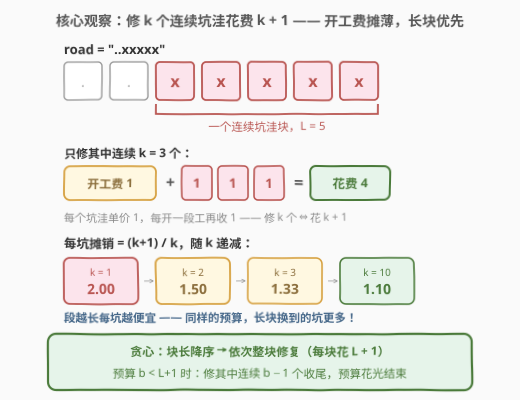
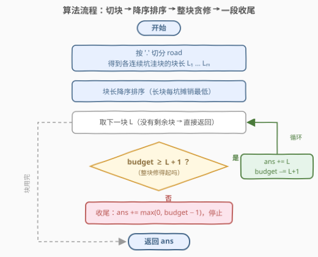
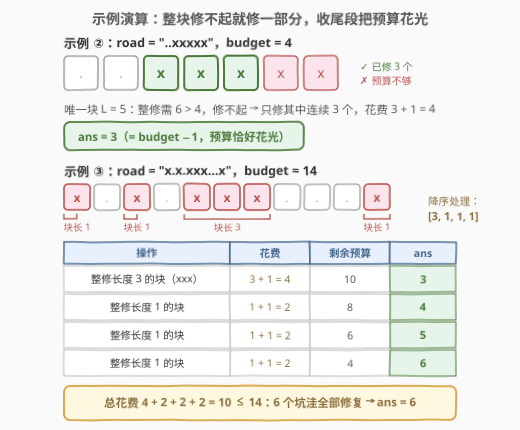

# 最大数量的可修复坑洼

- **题目名称**：最大数量的可修复坑洼
- **链接**：[3119. 最大数量的可修复坑洼](https://leetcode.cn/problems/maximum-number-of-potholes-that-can-be-fixed/)
- **难度**：中等
- **标签**：贪心、字符串、排序

> ⚠️ 本题为 LeetCode **付费题**（`isPaidOnly`）。下方题意描述、示例与约束依据官方样例输入与 hints 整理还原，如有出入请以官方为准；算法与示例输出已用自洽模拟验证。

## 1. 题目概述

给定一个字符串 `road`，只包含字符 `x` 和 `.`，其中 `x` 表示坑洼，`.` 表示平坦路面。再给定一个整数 `budget`（预算）。

修复规则：你可以选择**一段连续的坑洼**进行修复，修复长度为 $k$ 的一段花费 $k + 1$（可以理解为：每个坑洼各花 $1$，每开一段工额外收 $1$ 的开工费）。可以修复多段（互不重叠），段可以只覆盖某个连续块的一部分。

返回预算内最多能修复的**坑洼总数**。

**示例 1**（官方样例）：

```text
输入：road = "..", budget = 5
输出：0
解释：路上没有坑洼，一个也修不了。
```

**示例 2**（官方样例）：

```text
输入：road = "..xxxxx", budget = 4
输出：3
解释：唯一一个块的长度为 5，整块修复要花 6，超过预算。
只修其中连续 3 个坑洼，花费 3 + 1 = 4，恰好用完预算。
```

**示例 3**（官方样例）：

```text
输入：road = "x.x.xxx...x", budget = 14
输出：6
解释：四个块的长度为 1, 1, 3, 1，全部整修花费 2 + 2 + 4 + 2 = 10 ≤ 14，
6 个坑洼全部修复。
```

**约束条件**（依据数据规模惯例重建，不影响算法适用范围）：

- $1 \le \text{road.length} \le 10^5$
- `road` 只包含 `'x'` 和 `'.'`
- $0 \le budget \le 10^5$

> 💡 读题关键：成本 $k+1$ 拆开是「**每个坑洼单价 1 + 每开一段工固定收 1**」。于是修好总数 = 总花费 − 段数——预算一定时，**段越少、每段越长越好**。这是教科书级的贪心信号：定价里藏着的固定开销，就是用来被贪心利用的结构。

---

## 2. 解题思路

### 2.1 暴力思路：按块做分组背包

把每个连续 `'x'` 块看成一个「物品组」：组内可选修 $k \in [0, L_i]$ 个（收益 $k$、花费 $k+1$）。令 $f[i][b]$ 表示前 $i$ 块恰用预算 $b$ 能修的最大坑数，转移枚举第 $i$ 块修多少个。状态 $O(m \cdot B)$、转移再乘 $O(L)$，在 $n, B \approx 10^5$ 的量级下高达 $10^{10}$ 级别，必然超时。

> ⚠️ 背包 DP 是「通用但迟钝」的解法——它没有利用 $k+1$ 这个定价的**线性结构**（收益 = 花费 − 1）。看到「单位收益随规模递增/递减」的定价，第一反应应该是排序贪心，而不是背包。

### 2.2 核心观察：开工费摊薄 → 长块优先



把 $k + 1$ 拆开看，立刻得到四条推论：

1. **修好总数 = 总花费 − 段数**：每段花 $k+1$ 修 $k$ 个，开工费 $1$ 是唯一「损耗」。预算固定时，段数越少越好。
2. **每坑摊销 $= \frac{k+1}{k} = 1 + \frac{1}{k}$，随 $k$ 严格递减**：$k=1$ 时每坑花 $2$，$k=10$ 时每坑只花 $1.1$——长块的「性价比」碾压短块。
3. **同一块内至多修一段**：同块两段（长 $a$、$b$）花费 $a+b+2$，合并成一段只花 $a+b+1$，坑数不减、开销少 $1$，严格不劣。
4. **短块上的段总可以平移到长块**：长度不变、花费不变，而长块一定装得下——所以最优解只用**最长的若干块**。

于是贪心策略水到渠成：

- **块长降序排序**，依次**整块修复**（每块花 $L+1$，收益 $L$）；
- 当剩余预算 $b < L + 1$（下一整块修不起）时，**用收尾段修 $b - 1$ 个**：开工费 $1$ 决定了剩余 $b$ 至多换 $b-1$ 个坑；又因降序处理到当前块时 $b \le L$，故 $b - 1 < L$，当前块一定装得下。这段把预算全部花光，直接结束。

### 2.3 算法流程图



流程只有四步：按 `'.'` 切分收集块长 → 降序排序 → 循环整块修复 → 修不起时收尾一段并返回。

### 2.4 示例演算



| 输入 | 块长（降序） | 逐步执行 | 结果 |
|------|-------------|---------|------|
| `road = "..xxxxx"`，`budget = 4` | `[5]` | 整修需 $6 > 4$ → 收尾段修 $4-1=3$ 个（花 $4$） | **3** |
| `road = "x.x.xxx...x"`，`budget = 14` | `[3, 1, 1, 1]` | 修 $3$ 花 $4$（余 $10$）→ 修 $1$ 花 $2$（余 $8$）→ 修 $1$ 花 $2$（余 $6$）→ 修 $1$ 花 $2$（余 $4$） | **6** |

示例 ② 演示「**收尾段**」：整块修不起时，剩余预算 $b$ 恰好换 $b-1$ 个坑，把预算榨干；示例 ③ 演示「**整块贪修**」：降序处理 $[3,1,1,1]$，总花费 $10 \le 14$，全部修完。

---

## 3. 参考代码

> 官方代码模板不可见（付费题），函数签名按题目命名惯例重建：`maxPotholes(road, budget)`。

### C++

```cpp
class Solution {
  public:
    int maxPotholes(string road, int budget) {
        vector<int> blocks;
        int run = 0;
        for (char c : road) {
            if (c == 'x') {
                run++;
            } else if (run > 0) {
                blocks.push_back(run);
                run = 0;
            }
        }
        if (run > 0) blocks.push_back(run);

        sort(blocks.rbegin(), blocks.rend());   // 长块优先：开工费摊得最薄

        int ans = 0;
        for (int L : blocks) {
            if (budget >= L + 1) {              // 整块修得起
                ans += L;
                budget -= L + 1;
            } else {                            // 修不起整块：收尾段修 b−1 个
                ans += max(0, budget - 1);      // 此时有 b−1 < L，一定装得下
                break;
            }
        }
        return ans;
    }
};
```

### Python

```python
class Solution:
    def maxPotholes(self, road: str, budget: int) -> int:
        blocks = sorted((len(g) for g in road.split('.') if g), reverse=True)
        ans = 0
        for L in blocks:
            if budget < L + 1:
                ans += max(0, budget - 1)   # 收尾段：花 b 修 b−1 个
                break
            ans += L
            budget -= L + 1
        return ans
```

> 💡 写法盘点：Python 用 `road.split('.')` 一行完成切块（空串被 `if g` 过滤）；C++ 手动维护 `run` 计数。两版都依赖同一个不变量：**降序处理下，第一次遇到「整块修不起」时必有 $b - 1 < L$**，所以收尾段无需再和 $L$ 取 `min`。`max(0, ...)` 兜住 $b \le 1$ 的边界（此时一个坑都修不了）。

---

## 4. 复杂度分析

| 维度 | 复杂度 | 说明 |
|------|--------|------|
| 时间复杂度 | $O(n + m \log m)$ | 切块 $O(n)$；排序 $O(m \log m)$，$n$ 为 `road` 长度，$m$ 为块数（$m \le \lceil n/2 \rceil$）；随后线性扫一遍 |
| 空间复杂度 | $O(m)$ | 存块长数组（Python `split` 产生 $O(n)$ 个切片） |
| 答案规模 | $\le \min(\text{坑总数},\ budget - 1)$ | 每段开工费 $1$：修 $p$ 个坑至少花 $p+1$ |

---

## 5. 扩展

### 5.1 正确性速证：$\text{ans} = \max_t \min(S_t,\ B - t)$

设 $S_t$ 为**最长 $t$ 块**的长度和。由 2.2 的推论 3、4，最优解中每块至多一段、且只用的最长若干块，故用恰好 $t$ 段时的答案为 $\min(S_t,\ B - t)$：预算中能付给「坑价」的份额是 $B - t$（$t$ 段开工费），容量上限是 $S_t$。于是

$$\text{ans} = \max_{t \ge 0} \ \min(S_t,\ B - t)$$

贪心恰好取到该最大值：设降序处理中前 $j$ 块整修得起、第 $j+1$ 块修不起（即 $S_j + j \le B < S_{j+1} + j + 1$），则 $t \le j$ 的项 $\le S_j \le$ 贪心值；$t \ge j+1$ 的项 $\le B - (j+1) = S_j + (B - S_j - j - 1) \le$ 贪心值（收尾段 $B - S_j - j - 1 \ge 0$；若预算剩 $\le 1$ 则收尾段为 $0$，同样的不等式仍成立）。$\blacksquare$

### 5.2 上界直觉与 O(n) 优化

- **上界**：$\text{ans} \le \min(\text{坑总数},\ B - 1)$。道路连成整块时可达 $B - 1$（示例 ② 恰好取到）；块越碎、开工费交得越多，答案离上界越远——极端 `"x.x.x..."` 每坑都要花 $2$。
- **计数排序**：块长取值 $\in [1, n]$，可用长度值域上的计数代替比较排序，把 $O(m \log m)$ 降为 $O(n)$。对 $n = 10^5$ 无必要，但可作为面试追问的加分回答。

---

## 6. 面试要点

1. **为什么长块优先，而不是短块优先或者按出现顺序？**

   - 每段成本 $k+1$，每坑摊销 $1 + 1/k$ 随 $k$ 严格递减，同样的预算长块换到的坑更多。反例：块 `[3, 1]`、预算 $4$（如 `road = "xxx.x"`）——长块优先修 $3$ 个（花 $4$）；短块优先先修 $1$ 个（花 $2$），剩余 $2$ 只能收尾再修 $1$ 个，共 $2$ 个。

2. **预算不够整块时，为什么恰好修 $b-1$ 个、修完就停？**

   - 一段的成本 = 坑数 + 开工费：剩余 $b$ 至多支撑「$b-1$ 个坑 + $1$ 开工」。又因降序处理到当前块时 $b \le L$，故 $b-1 < L$，装得下。这段把预算全部花光，之后再无预算，直接结束。

3. **同一块里修两段会怎样？**

   - 花费 $a + 1 + b + 1 = a + b + 2$，而合并成一段只花 $a + b + 1$——多付一份开工费且坑数不变，严格不优。所以最优解中每块至多一段。

4. **`budget ≤ 1` 时返回什么？代码怎么兜底？**

   - 返回 $0$：最便宜的一段（$1$ 个坑）也要花 $2$。代码里 `max(0, budget - 1)` 天然处理，无需特判。

5. **这题和普通背包（如 [322. 零钱兑换](https://leetcode.cn/problems/coin-change/)）的分界在哪？**

   - 背包物品的「重量—价值」无结构时只能 DP；本题每段**价值 $k$、重量 $k+1$，性价比单调由段长决定**，排序后贪心即最优。识别「性价比可排序」是贪心题的第一直觉。

---

## 7. 同类练习题

- [455. 分发饼干](https://leetcode.cn/problems/assign-cookies/)（[站内题解](../0401-0500/455_分发饼干.md)）：排序 + 双指针的贪心分配入门——「大胃口配大饼干」与「长块配预算」是同一个性价比直觉
- [1710. 卡车上的最大单元数](https://leetcode.cn/problems/maximum-units-on-a-truck/)（[站内题解](../1701-1800/1710_卡车上的最大单元数.md)）：按每箱单元数降序装箱直到容量耗尽——「按单位收益排序 + 资源耗尽即停」，与本题几乎同构
- [2279. 装满石头的背包的最大数量](https://leetcode.cn/problems/maximum-bags-with-full-capacity-of-rocks/)（[站内题解](../2201-2300/2279_装满石头的背包的最大数量.md)）：按缺口升序用额外石子尽量多装满背包——「固定开销 + 排序贪心」的镜像变体（本题最大化收益，它最大化件数）
- [2144. 购买糖果的最低成本](https://leetcode.cn/problems/minimum-cost-of-buying-candies-with-discount/)（[站内题解](../2101-2200/2144_购买糖果的最低成本.md)）：降序排列利用「买二送一」——同为「排序之后贪心结构自现」
- [1005. K 次取反后最大化的数组和](https://leetcode.cn/problems/maximize-sum-of-array-after-k-negations/)（[站内题解](../1001-1100/1005_K次取反后最大化的数组和.md)）：按绝对值排序消耗 $K$ 次操作——排序 + 预算式资源分配的又一练习
