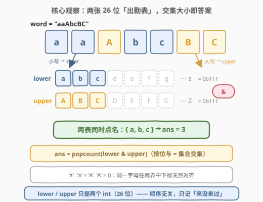
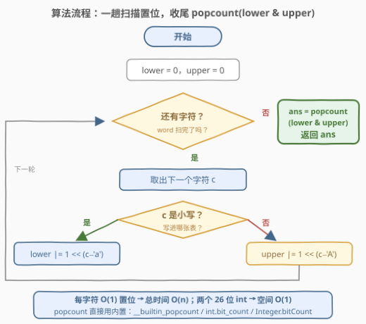
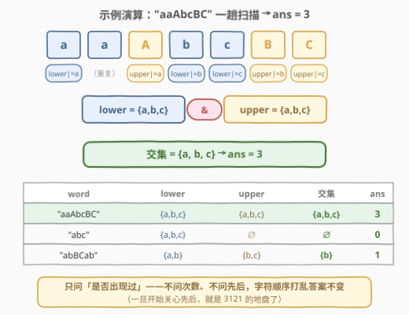

# LeetCode 统计特殊字母的数量 I 题解

## 1. 题目概述

- **标题 / 题号**：统计特殊字母的数量 I（#3120，easy）
- **链接**：https://leetcode.cn/problems/count-the-number-of-special-characters-i/
- **难度**：简单
- **标签**：哈希表、字符串、位运算

**题意**：给你一个字符串 `word`。如果 `word` 中同时存在某个字母的小写形式和大写形式，则称这个字母为 **特殊字母**。

返回 `word` 中 **特殊字母** 的数量。

**示例 1**：

```text
输入：word = "aaAbcBC"
输出：3
解释：word 中的特殊字母是 'a'、'b' 和 'c'。
```

**示例 2**：

```text
输入：word = "abc"
输出：0
解释：word 中不存在大小写形式同时出现的字母。
```

**示例 3**：

```text
输入：word = "abBCab"
输出：1
解释：word 中唯一的特殊字母是 'b'。
```

**约束**：

- $1 \le word.length \le 50$
- `word` 仅由小写和大写英文字母组成

> 💡 读题关键：统计的计数单位是「**字母**」（26 个候选），而不是「字符」（52 种形态）——同一个字母的大小写无论出现多少次、出现在哪，都只贡献一次。这是纯粹的**存在性**判定（来没来过），与次数、位置统统无关。$n \le 50$ 意味着连 $O(26n)$ 的暴力都绰绰有余，本题真正值得带走的是「键域小且连续 → 集合可压成位掩码」的直觉。

## 2. 解题思路

### 2.1 朴素思路：26 个字母逐个「点名」

最直白的暴力是先建集合，再对 26 个字母各问一遍：小写在不在？大写在不在？

```python
s = set(word)
return sum(c in s and c.upper() in s for c in string.ascii_lowercase)
```

一趟建 `set`（$O(n)$）加 26 次查询（$O(26)$），足够通过。但有两个可削减的点：

- `set` 存的是 **52 种字符形态**，而要回答的问题只有 **26 个字母**——两种形态共享同一个字母下标，信息天然可以「减半再配对」；
- 哈希表每个键要占一个桶、做一次散列，而键域只是 26 个连续整数，一个 `int` 的 26 个二进制位就够当整张表用。

> ⚠️ 另一种暴力——对每个字母在 `word` 里线性扫两遍（`c in word`）——是 $O(26n)$ 次字符比较，本题规模下无伤大雅；但思路若止步于此，就错过了这道题的练习点。

### 2.2 核心观察：两张 26 位「出勤表」，AND 后数 1



把「大小写是否出现过」拆成两张表：

- **lower 表**（26 位）：小写 `c` 出现 → 置第 $c - \text{'a'}$ 位；
- **upper 表**（26 位）：大写 `C` 出现 → 置第 $C - \text{'A'}$ 位。

由于 $\text{'a'} - \text{'a'} = \text{'A'} - \text{'A'} = 0$，**同一字母在两张表中的下标天然对齐**。于是：

$$\text{ans} = \operatorname{popcount}(\text{lower} \,\&\, \text{upper})$$

- 按位与 `&` 恰好是集合**交集**：只有两表都点过名的字母，对应位才是 1；
- `popcount`（数二进制 1 的个数）就是交集大小。

整个算法三步走：**一趟扫描置位 → 一次按位与 → 一次 popcount**。两张表各是一个 `int`，空间 $O(1)$，且完全不在乎字符的顺序与重复。

> 💡 大小写的位运算彩蛋：`'a'` = 97 与 `'A'` = 65 恰好相差 $32 = 1 \ll 5$（仅第 5 位不同）。于是 `c ^ 32` 大小写互转、`c | 32` 归一为小写、`c & ~32` 归一为大写；更进一步，`c & 31` 直接取出字母序号（`'a'` 与 `'A'` 都得 1），`(c >> 5) & 1` 区分形态（0 大写 / 1 小写）——连 if 分支都能省掉（见第 3 节写法盘点）。

### 2.3 算法流程图



流程只有三步：

1. `lower = upper = 0`；
2. 遍历 `word`：小写则 `lower |= 1 << (c - 'a')`，大写则 `upper |= 1 << (c - 'A')`；
3. 返回 `popcount(lower & upper)`。

### 2.4 示例演算



| 输入 | lower 表 | upper 表 | 交集 | 答案 |
|------|----------|----------|------|------|
| `"aaAbcBC"` | $\{a,b,c\}$ | $\{a,b,c\}$ | $\{a,b,c\}$ | **3** |
| `"abc"` | $\{a,b,c\}$ | $\varnothing$ | $\varnothing$ | **0** |
| `"abBCab"` | $\{a,b\}$ | $\{b,c\}$ | $\{b\}$ | **1** |

三个示例各踩一个点：示例 1 两表内容完全一致，交集满员；示例 2 上写着勤表**整张空**，交集必空；示例 3 是「部分交集」——`a` 只有小写、`c` 只有大写，双双出局，只剩 `b` 一根独苗。

## 3. 参考代码

### C++

```cpp
class Solution {
  public:
    int numberOfSpecialChars(string word) {
        int lower = 0, upper = 0;                    // 两张 26 位出勤表
        for (char c : word) {
            if (c >= 'a') lower |= 1 << (c - 'a');   // 小写：记到 lower
            else          upper |= 1 << (c - 'A');   // 大写：记到 upper
        }
        return __builtin_popcount(lower & upper);    // 两表同时点名的字母数
    }
};
```

### Python

```python
class Solution:
    def numberOfSpecialChars(self, word: str) -> int:
        lower = upper = 0
        for c in word:
            if c.islower():
                lower |= 1 << (ord(c) - ord('a'))
            else:
                upper |= 1 << (ord(c) - ord('A'))
        return (lower & upper).bit_count()
```

> 💡 写法盘点：
> - **判断大小写**：输入保证纯英文字母，`c >= 'a'` 足够（`'A'..'Z'` 全都小于 `'a'`）；更防御的写法是 `islower`。利用 2.2 的彩蛋还能写**无分支**版：`masks[c >> 5 & 1] |= 1 << ((c & 31) - 1);`（`masks[1]` 收小写、`masks[0]` 收大写）。
> - **popcount**：C++ 用 `__builtin_popcount`，Java 用 `Integer.bitCount`，Python 3.10+ 用 `int.bit_count()`（老版本 `bin(x).count('1')`），Go 用 `bits.OnesCount32`；手数则用 Brian Kernighan 技巧 `x &= x - 1` 每次消去最低位的 1（[191. 位 1 的个数](../0001-0100/191_位1的个数.md)的正主套路）。
> - **集合直译版**：`s = set(word); return sum(c in s and c.upper() in s for c in ascii_lowercase)`——语义最透明，面试可先给这版，再以「键域只有 26 个连续整数」为由升级到位掩码版，叙事更稳。

## 4. 复杂度分析

| 维度 | 复杂度 | 说明 |
|------|--------|------|
| 时间复杂度 | $O(n)$ | 每字符一次 $O(1)$ 置位；收尾一次按位与 + popcount（26 位，$O(1)$） |
| 空间复杂度 | $O(1)$ | 两个 26 位 `int` 即全部状态；`set` 版为 $O(52)$，亦是常数 |
| 答案规模 | $\le 26$ | 候选只有 26 个字母，任何整型都装得下 |

## 5. 扩展

### 5.1 集合 → 位掩码：键域连续时的通用压缩

本题本质是「**两个集合求交后数大小**」，而集合的键域恰好是 $[0, 26)$ 内的连续整数。凡是这种「键域小且连续」的存在性问题，哈希集合都可以换成位掩码：

| 操作 | 哈希集合 | 位掩码 |
|------|----------|--------|
| 插入 / 查存在 | 哈希一次 | `mask \|= 1 << k` / `mask >> k & 1` |
| 交集 | 逐键查询 / 归并 | 一条 `a & b` |
| 并集 / 差集 | 逐键合并 | `a \| b` / `a & ~b` |
| 判满 / 判空 | 比大小 | `mask == (1 << 26) - 1` / `mask == 0` |

同一味药还能治 [1832. 判断句子是否为全字母句](https://leetcode.cn/problems/check-if-the-sentence-is-pangram/)（单张表判 `== (1 << 26) - 1`）与 [1684. 统计一致字符串的数目](https://leetcode.cn/problems/count-the-number-of-consistent-strings/)（`word & ~allowed == 0` 判子集）。反过来，若键域是任意 Unicode 字符，位掩码立刻失效（位图位数爆炸），必须退回哈希——**压缩的前提是键域有界且小**，这一点值得在面试里主动说破。

### 5.2 大小写家族的「差 32」技巧

`'A'..'Z'`（65–90）与 `'a'..'z'`（97–122）整段相差 32，即仅第 5 位不同：

- `c ^ 32`：大小写互换（`'a' ↔ 'A'`）；
- `c | 32`：转小写；`c & ~32`：转大写；
- `c & 31`：统一取出字母序号 1–26；`(c >> 5) & 1`：形态位（0 大写 / 1 小写）。

[1544. 整理字符串](https://leetcode.cn/problems/make-the-string-great/) 里「相邻同字母异形态互消」正是用 `c ^ 32` 识别同字母；`tolower` / `toupper` 内部干的就是这几条位运算的事。

### 5.3 续作预告：3121 加了「顺序」约束

[3121. 统计特殊字母的数量 II](https://leetcode.cn/problems/count-the-number-of-special-characters-ii/) 在「双形态齐全」之上追加：**每个小写形式都要出现在第一个大写形式之前**（等价地说：某字母一旦出现过小写，之后就不能再冒出它的大写），且 $n$ 放大到 $2 \times 10^5$。此时「是否出现过」不够用了——必须**按字母记录顺序信息**：比如对每个字母记「小写首现位置」并维护「小写出现后是否又见大写」的违规标记，或跑一个 26 套的小状态机。出勤表升级为状态表，正是「集合语义 → 顺序语义」的经典一步。

## 6. 面试要点

1. **为什么用两个掩码而不是一个？**

   - 一个 26 位掩码只能表达 26 个键的存在性，而本题每个字母有**两种形态**、需分别判定存在，共 52 个独立事实；也可合用一个 `uint64_t`（低 26 位收小写、高 26 位收大写），本质仍是两张表。一个 52 键的 `set` 同样正确——位掩码只是键域连续时的常数优化，不是唯一解。

2. **`lower & upper` 这一步的集合语义是什么？**

   - 按位与 = 逐键 AND = **交集**；`popcount` = 交集基数。落到本题：两表都点名的字母，即双形态齐全的特殊字母。把位运算翻译成集合语言说出来，是这类题的加分叙事。

3. **C++ 里判断小写，`c >= 'a'` 和 `islower(c)` 哪个对？**

   - 都对，但前提不同。本题输入**保证**纯英文字母，`c >= 'a'` 安全（`'A'..'Z' < 'a'`）；若输入可能含其它字符，`c >= 'a'` 会误判（如 `'{' > 'a'`），应改用 `islower((unsigned char)c)`。说清适用边界比背「标准答案」更体现理解。

4. **不用内置函数，popcount 怎么手写？**

   - Brian Kernighan：`while (x) { x &= x - 1; cnt++; }`，每次消去最低位的 1，循环次数恰为 1 的个数；也可按字节查表（256 项预计算）。这也是 [191. 位 1 的个数](https://leetcode.cn/problems/number-of-1-bits/) 的正主套路。

5. **把字符集换成全部 Unicode，位掩码还能用吗？**

   - 不能——键域无界导致位图位数爆炸；位掩码是「键域有界且小」专属的压缩，此时应退回哈希集合。主动给出工具的适用边界，比解出本题本身更能体现工程判断力（见 5.1）。

## 同类练习题

| # | 题目 | 与本题的关联 |
|---|------|-------------|
| 3121 | [统计特殊字母的数量 II](https://leetcode.cn/problems/count-the-number-of-special-characters-ii/) | 本题直接续作——叠加「所有小写先于首个大写」的顺序约束，出勤表升级为按字母的状态记录 |
| 1832 | [判断句子是否为全字母句](https://leetcode.cn/problems/check-if-the-sentence-is-pangram/)（[站内题解](../1801-1900/1832_判断句子是否为全字母句.md)） | 单张 26 位出勤表判满，`mask == (1 << 26) - 1` 即全字母句 |
| 1684 | [统计一致字符串的数目](https://leetcode.cn/problems/count-the-number-of-consistent-strings/)（[站内题解](../1601-1700/1684_统计一致字符串的数目.md)） | `allowed` 压成掩码，逐词判定 `word & ~allowed == 0` 的子集关系 |
| 1544 | [整理字符串](https://leetcode.cn/problems/make-the-string-great/)（[站内题解](../1501-1600/1544_整理字符串.md)） | 用 `c ^ 32` 识别「同字母异形态」做相邻互消，「差 32」技巧的栈应用 |
| 1704 | [判断字符串的两半是否相似](https://leetcode.cn/problems/determine-if-string-halves-are-alike/)（[站内题解](../1701-1800/1704_判断字符串的两半是否相近.md)） | 形态归一（统一小写）后查元音集合再计数比较，归一化思想的近亲 |
