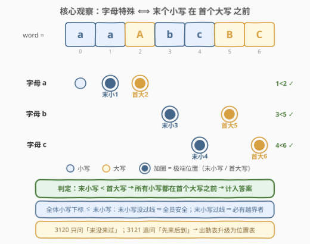
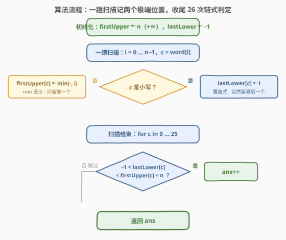
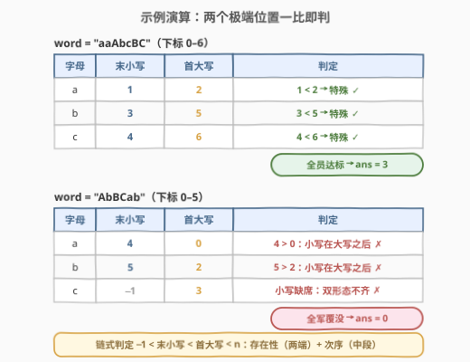

# LeetCode 统计特殊字母的数量 II 题解

## 1. 题目概述

- **标题 / 题号**：统计特殊字母的数量 II（#3121，medium）
- **链接**：https://leetcode.cn/problems/count-the-number-of-special-characters-ii/
- **难度**：中等
- **标签**：哈希表、字符串

**题意**：给你一个字符串 `word`。如果 `word` 中同时存在某个字母 `c` 的小写形式和大写形式，并且**每个**小写形式的 `c` 都出现在**第一个**大写形式的 `c` 之前，则称字母 `c` 是一个**特殊字母**。

返回 `word` 中**特殊字母**的数量。

**示例 1**：

```text
输入：word = "aaAbcBC"
输出：3
解释：特殊字母是 'a'、'b' 和 'c'。
```

**示例 2**：

```text
输入：word = "abc"
输出：0
解释：word 中不存在特殊字母。
```

**示例 3**：

```text
输入：word = "AbBCab"
输出：0
解释：word 中不存在特殊字母。
```

**约束**：

- $1 \le word.length \le 2 \times 10^5$
- `word` 仅由小写和大写英文字母组成

> 💡 读题关键：与 [3120. 统计特殊字母的数量 I](https://leetcode.cn/problems/count-the-number-of-special-characters-i/) 相比，本题在「双形态齐全」之上追加了一条**顺序约束**——所有小写都必须排在**第一个**大写之前。两个细节值得圈出来：其一，锚点是「第一个大写」，大写自己出现多少次无关紧要；其二，计数的单位仍是 26 个**字母**而非 52 个字符。$n$ 放大到 $2 \times 10^5$ 只是逼你放弃反复全串扫描，真正的考点是把「每个小写都要核对」这句直觉压缩成**一次比较**。

## 2. 解题思路

### 2.1 朴素思路：26 个字母逐个「查档案」

沿袭 3120 的「点名」框架，只是每个字母要查的档案变厚了：先找到首个大写的下标 $F$，再逐一核对**每个**小写的下标是否都小于 $F$。

```python
from string import ascii_lowercase

ans = 0
for ch in ascii_lowercase:
    U = ch.upper()
    if ch in word and U in word:                    # 双形态在场
        fu = word.index(U)                          # 首个大写下标
        if all(i < fu for i, c in enumerate(word) if c == ch):
            ans += 1                                # 每个小写都在其前
```

26 个字母各把全串扫上数遍，$O(26n)$ 次字符比较在 $n = 2 \times 10^5$ 时约千万级，能过但毫无体面。更值得在意的是思路层面的浪费：**「每个小写都小于 $F$」这句话看起来要枚举所有小写位置，实际上只有最靠右的那个小写有发言权**——只要它没越过 $F$，比它更靠左的同伴自然全体安全；反过来只要有任何一个小写越界，「最靠右」必然也在越界者之列。把「检查全体」换成「检查极端」，就是本题的全部优化空间。

### 2.2 核心观察：末个小写 vs 首个大写，两个极端位置定乾坤



对每个字母 `c` 只需维护两个下标：

- **`lastLower[c]`**：字母 `c` 的**最后一个小写**出现的下标（缺席记 $-1$）；
- **`firstUpper[c]`**：字母 `c` 的**第一个大写**出现的下标（缺席记 $+\infty$，实现里用 $n$ 顶替）。

判定条件收敛为一行链式不等式：

$$-1 \;<\; \text{lastLower}[c] \;<\; \text{firstUpper}[c] \;<\; n$$

三个片段各司其职：$-1 < \text{lastLower}$ 说的是**小写在场**；$\text{firstUpper} < n$ 说的是**大写在场**（缺席时它恰是哨兵 $n$）；夹在中间的 $\text{lastLower} < \text{firstUpper}$ 说的才是**次序**。

正确性两端各一句话：

- **充分性**：全体小写的下标都 $\le \text{lastLower}[c]$，若末小写都已排在首大写之前，则全体小写都在首个大写之前；
- **必要性**：若存在某个小写越界（下标 $\ge \text{firstUpper}[c]$），则 $\text{lastLower}[c] \ge$ 该下标 $\ge \text{firstUpper}[c]$，判定式必然不成立。

> 💡 这是「**用极端元素代表全体**」的经典手法：判定「全体满足某性质」时，往往只需盯住最可能违反性质的那一个元素（这里是最晚的小写与最早的大写）。它与 [3. 无重复字符的最长子串](../0001-0100/3_无重复字符的最长子串.md) 用「最近一次出现位置」收缩窗口、[387. 字符串中的第一个唯一字符](../0301-0400/387_字符串中的第一个唯一字符.md) 用「首现位置 + 计数」是同一族思想——**哈希表里存位置，而不只是存存在性**。

维护也极其省事：一趟扫描，遇到小写就**覆盖式**更新 `lastLower`（天然留下最后一个）；遇到大写只在**更早**时更新 `firstUpper`（`min` 语义，天然留下第一个）。3120 那两张位掩码「出勤表」在这里彻底失效——它们只记得「来没来过」，而本题追问「先来还是后到」，**存在性语义必须升级为位置（顺序）语义**。

### 2.3 算法流程图



流程分两幕：**第一幕一趟扫描**，按形态把下标分流进两张位置表（小写覆盖式、大写取 min）；**第二幕收尾判定**，对 26 个字母各做一次链式比较，通过则计数。

### 2.4 示例演算



| 输入 | a（末小 / 首大） | b（末小 / 首大） | c（末小 / 首大） | 答案 |
|------|------------------|------------------|------------------|------|
| `"aaAbcBC"` | 1 / 2 ✓ | 3 / 5 ✓ | 4 / 6 ✓ | **3** |
| `"abc"` | 0 / n ✗ | 1 / n ✗ | 2 / n ✗ | **0** |
| `"AbBCab"` | 4 / 0 ✗ | 5 / 2 ✗ | −1 / 3 ✗ | **0** |

（表中 `n` 是首大写的缺席哨兵，代表 $+\infty$）

三个示例各踩一个点：示例 1 三字母全员达标；示例 2 是「首大写缺席 → 链式判定第三段失败」的平凡情形；示例 3 `"AbBCab"` 才是官方给的「劝退」样例——三个字母演示了三种死法：`a`、`b` 的**末小写越过了首大写**（顺序违规），`c` 则**小写压根缺席**（双形态不齐）。注意 `a` 的死因正是顺序约束：`'A'` 在下标 0 首先登场，尾部那个 `'a'` 越过了首个大写，于是 $4 > 0$。

## 3. 参考代码

### C++

```cpp
class Solution {
  public:
    int numberOfSpecialChars(string word) {
        int n = word.size();
        vector<int> firstUpper(26, n);   // 首个大写下标，缺席记 n（视作 +∞）
        vector<int> lastLower(26, -1);   // 末个小写下标，缺席记 -1
        for (int i = 0; i < n; i++) {
            char c = word[i];
            if (c >= 'a') lastLower[c - 'a'] = i;          // 覆盖式：留最后一个
            else if (i < firstUpper[c - 'A'])              // min 语义：留第一个
                firstUpper[c - 'A'] = i;
        }
        int ans = 0;
        for (int c = 0; c < 26; c++)
            if (-1 < lastLower[c] && lastLower[c] < firstUpper[c] && firstUpper[c] < n)
                ans++;                                      // 在场 + 次序，一式搞定
        return ans;
    }
};
```

### Python

```python
class Solution:
    def numberOfSpecialChars(self, word: str) -> int:
        n = len(word)
        first_upper = [n] * 26    # 首个大写下标（缺席记 n，视作 +∞）
        last_lower = [-1] * 26    # 末个小写下标（缺席记 -1）
        for i, c in enumerate(word):
            if c.islower():
                last_lower[ord(c) - 97] = i                # 覆盖式：留最后一个
            elif i < first_upper[ord(c) - 65]:
                first_upper[ord(c) - 65] = i               # min 语义：留第一个
        return sum(-1 < last_lower[c] < first_upper[c] < n for c in range(26))
```

> 💡 写法盘点：
> - **链式比较**是本题最顺手的一行：`-1 < lastLower < firstUpper < n` 同时编码了「小写在场、大写在场、末小写在前」三个条件（C++ / Java 无链式比较，需拆成 `&&`）。
> - **哨兵取值有讲究**：`firstUpper` 用 $n$ 而非某个 magic 大数——天然大于一切合法下标，且缺席判定就是 `firstUpper < n`；`lastLower` 用 $-1$ 天然小于一切合法下标。⚠️ 只写 `lastLower < firstUpper` 一段是不够的：双缺席时 $-1 < n$ 恒真，从未露面的字母会被误判成特殊（见第 6 节）。
> - **大小写判断与槽位**：输入保证纯英文字母，`c >= 'a'` 与 `islower` 均可（`'A'..'Z'` 全小于 `'a'`）；还可用 3120 提过的 `(c & 31) - 1` 统一取出字母序号 0–25（`'a'` 与 `'A'` 同槽），省掉两套偏移——注意运算符优先级，`&` 比减法低，括号不能省。

## 4. 复杂度分析

| 维度 | 复杂度 | 说明 |
|------|--------|------|
| 时间复杂度 | $O(n)$ | 一趟扫描，每字符 $O(1)$ 更新；收尾 26 次常数级判定 |
| 空间复杂度 | $O(1)$ | 两张 26 槽位置表共 52 个整数，与 $n$ 无关 |
| 答案规模 | $\le 26$ | 候选只有 26 个字母，任何整型都装得下 |

## 5. 扩展

### 5.1 判定前移：违规标记版（边扫边判）

2.2 的版本把判定攒到收尾；也可以在扫描途中**就地抓违规**：某字母一旦见过大写，之后又冒出小写，当场记为违规——这正是顺序约束的逆否表述。

```python
class Solution:
    def numberOfSpecialChars(self, word: str) -> int:
        seen_lower = [False] * 26
        seen_upper = [False] * 26
        bad = [False] * 26
        for c in word:
            j = (ord(c) & 31) - 1              # 'a' 与 'A' 同槽，统一字母序号
            if c.islower():
                if seen_upper[j]:              # 首个大写之后又来小写 → 违规
                    bad[j] = True
                seen_lower[j] = True
            else:
                seen_upper[j] = True
        return sum(l and u and not b for l, u, b in zip(seen_lower, seen_upper, bad))
```

正确性一句话：`bad[c]` 被置位 $\iff$ 存在某个小写出现在某个大写之后 $\iff$ 存在小写不在首个大写之前。两版复杂度相同，前者像「先记账、收尾对账」，后者像「实时风控」——面试里先讲哪版都行，能互译才算真懂。

### 5.2 从 3120 到 3121：存在性 → 顺序性

| 维度 | 3120（前作） | 3121（本题） |
|------|--------------|--------------|
| 问题语义 | 双形态**来没来过** | 所有小写是否都在首个大写**之前** |
| 每字母状态 | 1 bit（两张 26 位出勤表） | 两个下标，或一个小状态机 |
| 合适载体 | 位掩码 `lower & upper` | 位置数组 / 违规标记 |
| 字符顺序 | 完全无关 | 唯一考点 |

「**集合语义 → 顺序语义**」的这次升级在字符串题里反复上演：387 用「首现位置 + 计数」判唯一，3 用「最近出现位置」收缩窗口，205 用「首现位置」核对双射。再往远处走一步：若约束继续加码（比如「删除至多 $k$ 个字符，使某字母成为特殊字母」这类「删 k 造达标」变体），两个极端位置就不够用了，得按字母维护**完整位置序列**再跑滑动窗口——[2831. 找出最长等值子数组](https://leetcode.cn/problems/find-the-longest-equal-subarray/) 正是「按值收集下标 + 窗口」的招牌（窗口内 $(\text{末下标} - \text{首下标}) - (\text{个数} - 1) \le k$），与本题「盯住极端位置」的思维一脉相承。

## 6. 面试要点

1. **为什么「末小写 < 首大写」一次比较就能代替「检查每个小写」？**

   - 极端元素代表全体：全体小写下标 $\le$ 末小写，末小写没过首大写这条线，全体都没过；反之只要有一个小写越界，作为最靠右者的末小写必然也越界。把「逐个核对」压成「比较极值」是本题唯一的核心优化，也解释了为什么空间只需要两张 26 槽位置表。

2. **直接沿用 3120 的位掩码为什么不行？**

   - 位掩码每个二进制位只承载 1 bit 的**存在性**信息（来过 / 没来过），而顺序约束需要「谁先谁后」的**位置**信息。本题必须让每个字母从 1 bit 升级到「两个下标」或「一个小状态机」。能主动说破工具的表达能力边界，比解出本题本身更有价值。

3. **哨兵 $-1$ / $n$ 的陷阱在哪里？**

   - 只写 `lastLower < firstUpper` 会漏判「双缺席」：从未露面的字母满足 $-1 < n$ 恒真。必须补上存在性两段：`-1 < lastLower` 且 `firstUpper < n`。Python 链式比较一行写完，C++ 需显式 `&&`。哨兵取 $n$ 的额外好处：天然大于一切合法下标，缺席判定即 `firstUpper < n`。

4. **`c >= 'a'` 判小写在什么前提下安全？**

   - 前提是输入保证纯 ASCII 英文字母（本题成立，`'A'..'Z'` 全小于 `'a'`）。若输入可能混入其它字符，`'{'`、`'~'` 等同样大于 `'a'`，会被误判成小写，应改用 `islower((unsigned char)c)`。与 3120 同款的边界讨论，面试常拿来追问。

5. **约束改成「每个大写都出现在第一个小写之前」呢？**

   - 对称换极端：维护**首个小写**与**末个大写**，判定 `lastUpper < firstLower`（同样要求双在场）。更大的启示是：拿到顺序约束，先找出「锚点极端」（第一个 / 最后一个），再决定记哪一头——极端位置永远是顺序类判定里信息密度最高的两个点。

## 同类练习题

| # | 题目 | 与本题的关联 |
|---|------|-------------|
| 3120 | [统计特殊字母的数量 I](https://leetcode.cn/problems/count-the-number-of-special-characters-i/)（[站内题解](../3101-3200/3120_统计特殊字母的数量I.md)） | 前作——只判双形态在场，两张 26 位出勤表 AND 后 popcount；本题是其顺序约束升级版 |
| 387 | [字符串中的第一个唯一字符](https://leetcode.cn/problems/first-unique-character-in-a-string/)（[站内题解](../0301-0400/387_字符串中的第一个唯一字符.md)） | 同样一趟扫描 + 26 槽位表，存的是「首现位置 + 出现次数」——存位置而非存存在性的近亲 |
| 1544 | [整理字符串](https://leetcode.cn/problems/make-the-string-great/)（[站内题解](../1501-1600/1544_整理字符串.md)） | `c ^ 32` 识别同字母异形态做相邻互消，大小写「差 32」家族的栈应用 |
| 205 | [同构字符串](https://leetcode.cn/problems/isomorphic-strings/)（[站内题解](../0201-0300/205_同构字符串.md)） | 双向映射靠「首现位置编码」全程核对——同为顺序敏感的哈希表应用 |
| 2831 | [找出最长等值子数组](https://leetcode.cn/problems/find-the-longest-equal-subarray/) | 按值收集完整下标序列再跑滑动窗口，「删 k 造连续」——顺序类约束继续加码后的形态（极端位置 → 位置序列） |
