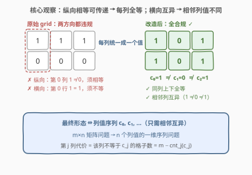
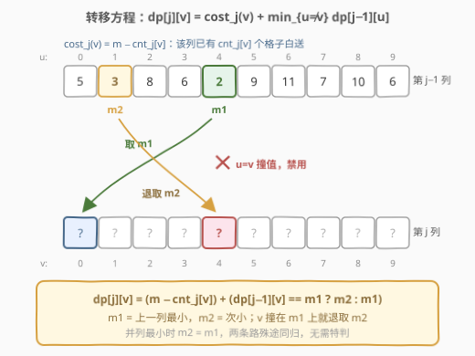
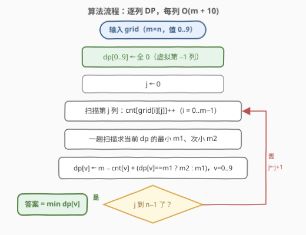
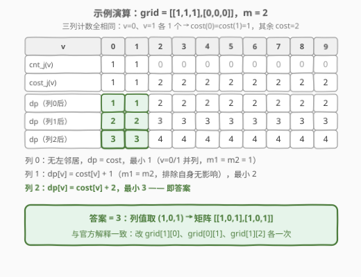

# LeetCode 使矩阵满足条件的最少操作次数 题解

## 1. 题目概述

- **标题 / 题号**：使矩阵满足条件的最少操作次数（#3122，medium）
- **链接**：https://leetcode.cn/problems/minimum-number-of-operations-to-satisfy-conditions/
- **难度**：中等
- **标签**：数组、动态规划、矩阵

**题意**：给你一个大小为 $m \times n$ 的二维矩阵 `grid`。每次**操作**中，你可以将**任一**格子的值修改为**任意**非负整数。完成所有操作后，你需要确保每个格子 `grid[i][j]` 的值满足：

- 如果下方相邻格子存在，它们的值**相等**：$grid[i][j] = grid[i+1][j]$；
- 如果右侧相邻格子存在，它们的值**不相等**：$grid[i][j] \ne grid[i][j+1]$。

返回需要的**最少**操作数目。

**示例 1**：

```text
输入：grid = [[1,0,2],[1,0,2]]
输出：0
解释：每列上下相等、相邻列互异，所有格子已满足要求
```

**示例 2**：

```text
输入：grid = [[1,1,1],[0,0,0]]
输出：3
解释：改成 [[1,0,1],[1,0,1]] —— grid[1][0]→1、grid[0][1]→0、grid[1][2]→1
```

**示例 3**：

```text
输入：grid = [[1],[2],[3]]
输出：2
解释：只有一列，2 次操作把所有格子变成 1
```

**约束**：

- $1 \le m, n \le 1000$
- $0 \le grid[i][j] \le 9$

> ⚠️ 两个易读漏的点：一是操作可以把格子改成**任意非负整数**，并不限于 $0 \sim 9$——不过第 5 节会证明只考虑 $0 \sim 9$ 就够；二是两条约束方向相反：纵向要求**相等**、横向要求**不等**，方向记反整题全错。

## 2. 解题思路

### 2.1 暴力思路：枚举每列的终值

纵向「相等」约束具有**传递性**：同一列自上而下两两相等，等价于整列取同一个值。于是最终矩阵的形态完全由**每列一个终值** $c_0, c_1, \dots, c_{n-1}$ 刻画，剩余的唯一约束是相邻列互异：$c_j \ne c_{j+1}$。

最直接的暴力：给每列枚举终值（哪怕只枚举 $0 \sim 9$），共 $10^n$ 种组合，$n \le 1000$ 时是天文数字。退一步用贪心——「每列独立挑最便宜的终值」——也不行：相邻两列各自的局部最优可能撞在同一个值上（比如都最便宜在 $v=0$），**相邻互异是列间的耦合约束，必须让 DP 记住「上一列取了什么」**。

### 2.2 核心观察：列内全等 + 列间互异 → 逐列 DP

**观察 1（最终形态 = 列值序列）**

纵向相等沿列传递、横向不等只在列间生效——$m \times n$ 的矩阵问题**坍缩**成 $n$ 个列值的一维序列问题：



**观察 2（列代价只由终值决定）**

把第 $j$ 列统一成终值 $v$ 的代价是

$$cost_j(v) = m - cnt_j(v)$$

其中 $cnt_j(v)$ 为第 $j$ 列中**原本就等于** $v$ 的格子数：这些格子免费保留，其余每个格子花恰好 1 次操作改成 $v$。代价只数个数、与位置无关。

**观察 3（候选值收缩到 $0 \sim 9$）**

操作虽可取任意非负整数，但交换论证（第 5 节）表明：任何最优解都可调整为**每列终值都落在 $0 \sim 9$** 且总代价不增。每列因此只有 10 个候选值。

**观察 4（min1/min2 排除自身）**

定义 $dp[j][v]$：前 $j+1$ 列全部合规、且第 $j$ 列终值为 $v$ 的最少操作数：

$$dp[j][v] = cost_j(v) + \min_{u \ne v} dp[j-1][u]$$

转移要取「上一列的最小值、但不许取自己」——逐对比较是 $O(10^2)$；更聪明的做法是一趟扫描维护上一行的**最小值 $m1$ 与次小值 $m2$**：若 $dp[j-1][v]$ 恰好顶在最小值上，就退而取 $m2$，否则直接取 $m1$。有并列最小时 $m2 = m1$，取哪个都对，无需特判：



这正是 [1289. 下降路径最小和 II](https://leetcode.cn/problems/minimum-falling-path-sum-ii/)（[题解](../1201-1300/1289_下降路径最小和II.md)）的招牌技巧——「转移禁取自身」的标配优化。

### 2.3 算法流程图



1. `dp[0..9] ← 0`：虚拟「第 $-1$ 列」，任何终值代价为 0，让第 0 列的转移自然退化成 $dp[v] = cost(v)$；
2. 逐列 $j = 0 \dots n-1$：
   - 扫描该列统计 `cnt[10]`，$O(m)$；
   - 一趟扫描求出当前 `dp` 的 $m1$、$m2$，$O(10)$；
   - 对 $v = 0 \dots 9$ 更新 $dp[v] = m - cnt[v] + (dp[v] == m1\ ?\ m2 : m1)$；
3. 答案为 $\min_v dp[v]$。

### 2.4 示例演算



以示例 2 `grid = [[1,1,1],[0,0,0]]`（$m=2$）演算：三列的计数完全相同——$v=0$、$v=1$ 各出现 1 次，故 $cost(0)=cost(1)=1$、其余 $cost=2$。

- **列 0**：无左邻居，$dp[v] = cost(v)$，最小 1（$v=0,1$ **并列**，$m1=m2=1$）；
- **列 1**：$dp[v] = cost(v) + 1$——并列让「排除自身」暂时失效，但 $m1=m2$ 取哪个都是 1，最小 2；
- **列 2**：$dp[v] = cost(v) + 2$，最小 3，落在 $v=0$ 或 $v=1$ 上。

答案 3，对应列值序列 $(1,0,1)$——正是官方解释的改造方案 `[[1,0,1],[1,0,1]]`。

## 3. 参考代码

### C++

```cpp
class Solution {
  public:
    int minimumOperations(vector<vector<int>>& grid) {
        int m = grid.size(), n = grid[0].size();
        vector<int> dp(10, 0);                      // 虚拟「第 -1 列」：任何终值代价 0
        for (int j = 0; j < n; j++) {
            int cnt[10] = {0};
            for (int i = 0; i < m; i++) cnt[grid[i][j]]++;   // 该列各值出现次数
            int m1 = INT_MAX, m2 = INT_MAX;         // 上一列 dp 的最小 / 次小
            for (int v = 0; v < 10; v++) {
                if (dp[v] < m1) { m2 = m1; m1 = dp[v]; }
                else if (dp[v] < m2) { m2 = dp[v]; }
            }
            for (int v = 0; v < 10; v++)            // 原地更新安全：每个 v 只读自己的旧值
                dp[v] = m - cnt[v] + (dp[v] == m1 ? m2 : m1);   // 排除自身的最小转移
        }
        return *min_element(dp.begin(), dp.end());
    }
};
```

### Python

```python
class Solution:
    def minimumOperations(self, grid: List[List[int]]) -> int:
        m, n = len(grid), len(grid[0])
        dp = [0] * 10                            # 虚拟「第 -1 列」：任何终值代价 0
        for j in range(n):
            cnt = [0] * 10
            for i in range(m):                   # 统计第 j 列各值出现次数
                cnt[grid[i][j]] += 1
            m1 = m2 = float('inf')               # 上一列 dp 的最小 / 次小
            for v in range(10):
                if dp[v] < m1:
                    m1, m2 = dp[v], m1
                elif dp[v] < m2:
                    m2 = dp[v]
            dp = [m - cnt[v] + (m2 if dp[v] == m1 else m1)
                  for v in range(10)]            # 排除自身的最小转移
        return min(dp)
```

> 💡 两个实现细节：
> 1. **`dp` 初始化为全 0 而非 INF**：虚拟「第 $-1$ 列」上任何终值代价为 0，第 0 列的转移自动退化为 $dp[v] = cost(v)$，省去对首列的特判（此时 $m1=m2=0$，「排除自身」取哪个都是 0）；
> 2. **C++ 原地更新是安全的**：$m1$、$m2$ 已提前算好，每个 $v$ 只读自己的旧 `dp[v]`；Python 列表推导式则天然生成新数组。

## 4. 复杂度分析

| 维度 | 复杂度 | 说明 |
|------|--------|------|
| 时间复杂度 | $O(mn + 10n)$ | 统计每列计数 $O(m)$，$n$ 列共 $O(mn)$；每列 DP 转移两趟 $O(10)$ 扫描，共 $O(10n)$。$m,n \le 1000$ 时约 $10^6$ 量级 |
| 空间复杂度 | $O(10)$ | `cnt`、`dp` 均只与值域大小 10 相关（不计输入矩阵本身） |

## 5. 扩展：候选值为什么只需 0..9？值域更大怎么办？

**交换论证**：设某最优解中第 $j$ 列终值 $v \notin \{0,\dots,9\}$——该列没有任何格子白送，代价恰为 $m$。取 $w \in \{0,\dots,9\} \setminus \{c_{j-1}, c_{j+1}\}$（相邻两列至多禁掉 2 个值，10 个候选至少剩 8 个），把第 $j$ 列改成 $w$：新代价 $m - cnt_j(w) \le m$ 不增，且 $w$ 与左右邻居都不同、其余列不受影响。逐列调整后得到一个**每列终值都在 $0 \sim 9$** 的解，代价不增——最优解必在其中。

若值域上界很大（如 $10^9$）：每列的「便宜候选」只剩该列**出现过的值**（代价 $< m$），再补上 3 个「新值」（代价恰为 $m$，用于与邻居错开——左右邻居至多禁 2 个，3 个新值总有 1 个可用）。对每列候选集照跑 min1/min2 逐列 DP，总复杂度 $O(\sum_j \text{col}_j\text{ 内不同值个数}) \le O(mn)$，套路完全不变。

## 6. 面试要点

1. **为什么最终每列必须全等？**

   纵向相等约束把同一列的格子两两相连，相等关系具传递性，整列必为同一个值；矩阵最终形态坍缩成列值序列，唯一剩余约束是相邻列互异。

2. **贪心（每列独立取最便宜）为什么错？**

   相邻互异是列间耦合约束：两列各自的局部最优可能撞在同一个值上；DP 必须把「上一列取了什么」编码进状态下标，才能在转移时排除撞值。

3. **为什么候选值只需 $0 \sim 9$？**

   非 $0 \sim 9$ 的终值代价必为 $m$；换成 $0 \sim 9$ 中任一与左右邻居不同的值（至少 8 个可选），代价 $m - cnt_j(w) \le m$ 不增——交换论证见第 5 节。

4. **min1/min2 技巧遇到并列最小怎么办？**

   若最小值有并列，次小 $m2 = m1$，「排除自身」后取到的仍是同一个值，结果不变——技巧对并列天然免疫，实现无需任何特判。

5. **$m = 1$（单行矩阵）时退化成什么？**

   纵向约束自动满足，只剩相邻格子互异——同一个 DP 原样适用：$dp[j][v] = cost_j(v) + \min_{u \ne v} dp[j-1][u]$，只是每列 `cnt` 非 0 即 1。

## 同类练习题

| # | 题目 | 与本题的关联 |
|---|------|-------------|
| 931 | [下降路径最小和](https://leetcode.cn/problems/minimum-falling-path-sum/)（[题解](../0901-1000/931_下降路径最小和.md)） | 逐列 DP 原型，从上一列任取一个值转移，无排除约束 |
| 1289 | [下降路径最小和 II](https://leetcode.cn/problems/minimum-falling-path-sum-ii/)（[题解](../1201-1300/1289_下降路径最小和II.md)） | 「转移不许取自身」+ min1/m2 技巧的出处，本题观察 4 的原型 |
| 1937 | [扣分后的最大得分](https://leetcode.cn/problems/maximum-number-of-points-with-cost/)（[题解](../1901-2000/1937_扣分后的最大得分.md)） | 列间转移进阶——排除自身再叠加距离费用，min1/m2 或左右两遍扫描 |
| 2684 | [矩阵中移动的最大次数](https://leetcode.cn/problems/maximum-number-of-moves-in-a-grid/)（[题解](../2601-2700/2684_矩阵中移动的最大次数.md)） | 列推进 DP 的最大化版本，三分支转移 |
| 2304 | [网格中的最小路径代价](https://leetcode.cn/problems/minimum-path-cost-in-a-grid/) | 行间转移代价查 moveCost 表的版本，同样可用 min1/m2 把 $O(\text{列数}^2)$ 转移压到线性 |
