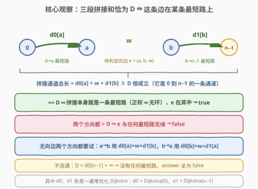
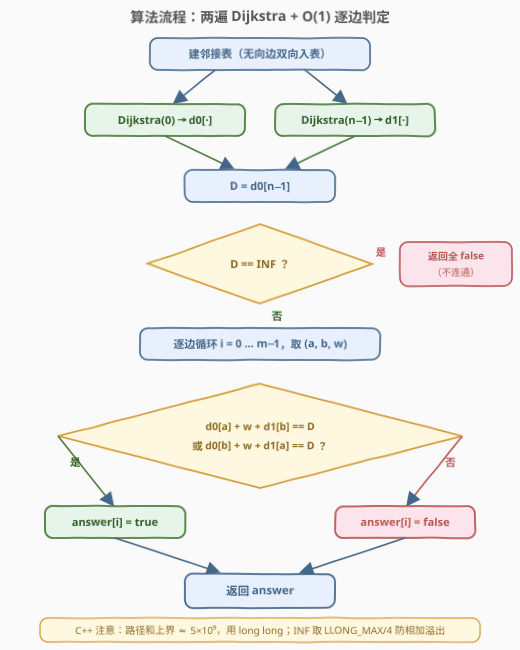
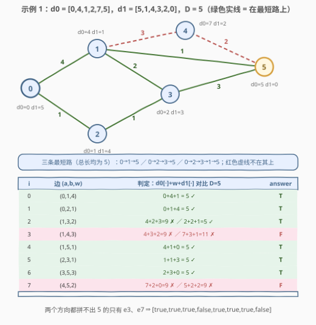

# LeetCode 最短路径中的边 题解

## 1. 题目概述

- **标题 / 题号**：最短路径中的边（#3123，hard）
- **链接**：https://leetcode.cn/problems/find-edges-in-shortest-paths/
- **难度**：困难
- **标签**：图、最短路、堆（优先队列）、深度优先搜索、广度优先搜索

**题意**：给你一个 $n$ 个节点的**无向带权图**，节点编号 $0$ 到 $n-1$，共有 $m$ 条边，`edges[i] = [a_i, b_i, w_i]` 表示 $a_i$ 与 $b_i$ 之间有一条权为 $w_i$ 的边。

对于节点 $0$ 为起点、节点 $n-1$ 为终点的**所有**最短路，你需要返回一个长度为 $m$ 的 **boolean** 数组 `answer`：若 `edges[i]` **至少**出现在其中一条最短路上，则 `answer[i]` 为 `true`，否则为 `false`。

**注意**：图可能不连通；图中没有重边。

**示例 1**：

```text
输入：n = 6, edges = [[0,1,4],[0,2,1],[1,3,2],[1,4,3],[1,5,1],[2,3,1],[3,5,3],[4,5,2]]
输出：[true,true,true,false,true,true,true,false]
解释：节点 0 出发到达节点 5 的所有最短路（总长均为 5）：
      0→1→5（4+1）、0→2→3→5（1+1+3）、0→2→3→1→5（1+1+2+1）
      边 [1,4,3] 与 [4,5,2] 不在任何一条最短路上。
```

**示例 2**：

```text
输入：n = 4, edges = [[2,0,1],[0,1,1],[0,3,4],[3,2,2]]
输出：[true,false,false,true]
解释：唯一的最短路是 0→2→3（1+2=3），只用到边 [2,0,1] 与 [3,2,2]。
```

**约束**：

- $2 \le n \le 5 \times 10^4$
- $m = \text{edges.length}$，$1 \le m \le \min(5 \times 10^4,\ n(n-1)/2)$
- $0 \le a_i, b_i < n$，$a_i \ne b_i$
- $1 \le w_i \le 10^5$

> ⚠️ 两个易漏点：一是最短路的**条数**可能是指数级的，「枚举所有最短路再逐条标记边」走不通；二是路径总长上界 $(n-1) \times w_{\max} \approx 5 \times 10^9$，超出 32 位整数范围，C++ 必须用 `long long`。另外图可能不连通——$0$ 到 $n-1$ 不通时不存在任何最短路，`answer` 应全为 `false`。

## 2. 解题思路

### 2.1 暴力思路

- **删边验证**：对每条边，暂时删掉它重跑一遍 Dijkstra，看 $0 \to n-1$ 的距离是否变大或变为不可达——$m$ 次完整最短路，$O(m \cdot (n+m)\log n) \approx 5 \times 10^9$ 次操作，必然超时。
- **枚举最短路**：从 $0$ 出发 DFS 收集所有总长为 $D$ 的路径——条数可达指数级（想象一张分层图，每层二选一都能拼出最短路），既存不下也数不完。

两条暴力路的共同盲区：它们都把「每条边」当成独立问题从头计算。而「$0$ 到图上每个点的距离」本是可以**一次预处理、处处查询**的全局信息——这正是下面解法的切入点。

### 2.2 核心观察：双向 Dijkstra + 三段拼接判定



设 $d_0[\cdot]$ 为从 $0$ 出发的单源最短路（一遍 Dijkstra），$d_1[\cdot]$ 为从 $n-1$ 出发的单源最短路（另一遍 Dijkstra），$D = d_0[n-1]$ 为全程最短距离。

**观察 1（任何经过 e 的路径都有三段下界）**：若边 $e=(a,b,w)$ 以 $a \to b$ 方向出现在某条 $0 \to n-1$ 的路径上，这条路径被 $e$ 切成三段：$0 \to a$ 的前段、边 $e$、$b \to n-1$ 的后段。前段长度 $\ge d_0[a]$，后段长度 $\ge d_1[b]$，于是

$$\text{路径总长} \ \ge\ d_0[a] + w + d_1[b]$$

反过来，把「$0 \to a$ 的最短路 + 边 $e$ + $b \to n-1$ 的最短路」首尾拼起来，得到一条 $0$ 到 $n-1$ 的**通道**（允许重复经过点的 walk），长度恰为 $d_0[a]+w+d_1[b]$，而任何通道的长度都 $\ge D$。所以 $d_0[a]+w+d_1[b] \ge D$ **恒成立**——这个和只可能「恰好等于 $D$」或「严格大于 $D$」。

**观察 2（判定公式）**：

$$e=(a,b,w)\ \text{以 } a\to b \text{ 方向出现在某条最短路上}\ \iff\ d_0[a]+w+d_1[b] = D$$

- **必要性**：那条最短路总长为 $D$，三段分别不小于 $d_0[a]$、$w$、$d_1[b]$，总和却不超过 $D$，只能三段全部取等。
- **充分性**：拼接通道总长恰为 $D$。若它重复经过某个点，就含一个权为正的环，删掉环会得到更短的通道，与 $D$ 最小矛盾——所以它**无环**，是一条简单路径，且总长 $=D$，货真价实是一条最短路，$e$ 正好在其中。

> 💡 **正权**在这里干了双份活：既保证 Dijkstra 本身的正确性，又保证「长度恰为 $D$ 的通道无环、从而是真最短路」。

**观察 3（无向边要正反各判一次）**：$e$ 也可能以 $b \to a$ 方向被经过，于是最终判定为

$$\text{answer}[i] = \big(d_0[a]+w+d_1[b] = D\big)\ \lor\ \big(d_0[b]+w+d_1[a] = D\big)$$

**观察 4（不连通与哨兵设计）**：若 $D = \infty$（$0$ 到 $n-1$ 不通），不存在任何最短路，全部 `false`，提前返回。无向图的连通性是对称的：一条边的两个端点要么都在 $0$ 的连通分量里（$d_0, d_1$ 都有限），要么都在别的分量里（都是 $\infty$）。实现上把 $\infty$ 取为 `LLONG_MAX/4`：即使 $\infty + w + \infty$ 也不溢出，且结果必然远大于 $D$，自动判 `false`，无需逐项特判。

一句话：**两遍 Dijkstra 把「这条边在不在最短路上」从一次全程计算压缩成一次 $O(1)$ 的加法比较**——与前缀和「一次预处理、区间 $O(1)$ 查询」是同一类「预处理换查询」思想。

### 2.3 算法流程图



整体流程：

1. 建邻接表，无向边双向入表；
2. 分别以 $0$ 和 $n-1$ 为源跑两遍堆优化 Dijkstra，得 $d_0$、$d_1$；
3. 取 $D = d_0[n-1]$，若 $D = \infty$ 直接返回全 `false`；
4. 逐边套用观察 3 的公式，$O(1)$ 定真假；
5. 返回 `answer`。

### 2.4 示例演算



以示例 1 为例：$d_0 = [0,4,1,2,7,5]$，$d_1 = [5,1,4,3,2,0]$，$D = 5$。看点有三：

- **e2 = [1,3,2]**：正向 $4+2+3=9$ 落空，反向 $2+2+1=5$ 命中——对应最短路 $0\to2\to3\to1\to5$，**反向判定不可省**；
- **e3 = [1,4,3] 与 e7 = [4,5,2]**：两个方向的最优拼接是 9 和 11，都拼不出 5——节点 4 距离两端太「亏」（$d_0[4]+d_1[4] = 9 > 5$），挂在它身上的边全军覆没；
- 其余 5 条边都能恰好拼出 5，与三条最短路覆盖的边集完全吻合。

示例 2 同法：$d_0 = [0,1,1,3]$，$d_1 = [3,4,2,0]$，$D=3$，仅 e0（$0+1+2=3$）与 e3（$1+2+0=3$）判真。

## 3. 参考代码

### C++

```cpp
class Solution {
  public:
    vector<bool> findAnswer(int n, vector<vector<int>>& edges) {
        int m = edges.size();
        vector<vector<pair<int, int>>> g(n);
        for (auto& e : edges) {              // 无向边双向入表
            g[e[0]].push_back({e[1], e[2]});
            g[e[1]].push_back({e[0], e[2]});
        }

        const long long INF = LLONG_MAX / 4; // 路径和上界 ~5e9，必须 64 位
        auto dijkstra = [&](int s) {
            vector<long long> dist(n, INF);
            priority_queue<pair<long long, int>,
                           vector<pair<long long, int>>, greater<>> pq;
            dist[s] = 0;
            pq.push({0, s});
            while (!pq.empty()) {
                auto [d, u] = pq.top();
                pq.pop();
                if (d > dist[u]) continue;   // 懒删除：过期记录
                for (auto [v, w] : g[u]) {
                    if (d + w < dist[v]) {
                        dist[v] = d + w;
                        pq.push({dist[v], v});
                    }
                }
            }
            return dist;
        };

        vector<long long> d0 = dijkstra(0);      // 0 出发
        vector<long long> d1 = dijkstra(n - 1);  // n-1 出发
        long long D = d0[n - 1];

        vector<bool> ans(m, false);
        if (D == INF) return ans;            // 不连通：无最短路，全 false
        for (int i = 0; i < m; i++) {
            int a = edges[i][0], b = edges[i][1];
            long long w = edges[i][2];
            ans[i] = d0[a] + w + d1[b] == D || d0[b] + w + d1[a] == D;
        }
        return ans;
    }
};
```

### Python

```python
class Solution:
    def findAnswer(self, n: int, edges: List[List[int]]) -> List[bool]:
        g = [[] for _ in range(n)]
        for u, v, w in edges:               # 无向边双向入表
            g[u].append((v, w))
            g[v].append((u, w))

        INF = float('inf')

        def dijkstra(s: int) -> List[int]:
            dist = [INF] * n
            dist[s] = 0
            pq = [(0, s)]                    # 小根堆：(距离, 节点)
            while pq:
                d, u = heapq.heappop(pq)
                if d > dist[u]:              # 懒删除：过期记录
                    continue
                for v, w in g[u]:
                    if d + w < dist[v]:
                        dist[v] = d + w
                        heapq.heappush(pq, (dist[v], v))
            return dist

        d0 = dijkstra(0)                     # 0 出发
        d1 = dijkstra(n - 1)                 # n-1 出发
        D = d0[n - 1]

        if D == INF:                         # 不连通：无最短路
            return [False] * len(edges)
        return [d0[a] + w + d1[b] == D or d0[b] + w + d1[a] == D
                for a, b, w in edges]
```

> 💡 实现细节：C++ 的 `INF` 取 `LLONG_MAX/4`，不可达端点参与相加不溢出且必 $\ne D$；堆中允许残留过期记录，弹出时用 `d > dist[u]` 跳过（懒删除）；Python 直接用 `float('inf')`，`inf` 参与比较天然为 `False`。

## 4. 复杂度分析

| 维度 | 复杂度 | 说明 |
|------|--------|------|
| 时间复杂度 | $O((n + m) \log n)$ | 两遍堆优化 Dijkstra 是主体；逐边判定仅 $O(m)$ 次加法与比较 |
| 空间复杂度 | $O(n + m)$ | 邻接表 $O(n+m)$，两个 `dist` 数组 $O(n)$，堆中至多 $O(m)$ 个记录 |

## 5. 扩展：最短路 DAG 反向标记法与相关变体

**只跑一遍 Dijkstra 行不行？** 行。跑出 $d_0$ 后，称满足 $d_0[u] + w = d_0[v]$ 的边 $(u,v,w)$ 为**紧边**（tight edge）——所有最短路恰好由紧边构成，它们组成一张按 $d_0$ 严格分层、无环的**最短路 DAG**。从 $n-1$ 出发沿紧边**逆向** DFS/BFS（从 $v$ 走回 $u$ 的条件即 $d_0[u]+w=d_0[v]$），沿途能走到的紧边就是答案。一遍 Dijkstra + 一遍 $O(n+m)$ 图遍历，与双 Dijkstra 等价；题目标签里的 DFS/BFS 即指此法。

**如果要问「边在多少条最短路上」／「是否在所有最短路上」**：在最短路 DAG 上按 $d_0$ 从小到大做计数 DP：$f_0[v]$ 为 $0\to v$ 的最短路条数、$f_1[v]$ 为 $v \to n-1$ 的条数，则经过边 $e=(a,b,w)$（$a\to b$ 方向）的最短路条数为 $f_0[a] \times f_1[b]$；它等于总条数 $f_0[n-1]$ 当且仅当 $e$ 在**每一条**最短路上（[1976. 到达目的地的方案数](https://leetcode.cn/problems/number-of-ways-to-arrive-at-destination/) 就是纯计数版）。

**高阶同类**：[2203. 包含要求路径的最小带权子图](https://leetcode.cn/problems/minimum-weighted-subgraph-with-the-required-paths/) 把「三段拼接」升级为「双源最短路之和最小化一个子图」，思想同源。

**如果边权为负（但无负环）**：Dijkstra 失效，$d_0, d_1$ 要改用 Bellman-Ford/SPFA 求；但判定公式依然成立——充分性证明中的「删环」在无负环时仍不增加长度（环权 $\ge 0$），通道依旧可提炼成长度 $\le D$ 的简单路径，结合 $\ge D$ 得 $=D$。

## 6. 面试要点

1. **为什么 $d_0[a]+w+d_1[b] = D$ 就等价于「边在某条最短路上」？**

   - 必要性：经过 $e$ 的最短路被切成三段，各段分别 $\ge d_0[a], w, d_1[b]$，总和却 $= D$，只能全部取等；充分性：三段拼成的通道总长恰为 $D$，正权保证它无环（有环则删环更短，矛盾），故它本身就是一条简单最短路。

2. **为什么不能只跑一遍 Dijkstra 然后记录路径？**

   - 最短路的**条数**可达指数级，显式存路径必然爆炸。一遍 Dijkstra 的正确替代是「紧边 DAG + 从终点反向标记」（见扩展 5）；双 Dijkstra 则把判定做成 $O(1)$ 公式，两者等价、复杂度同阶。

3. **无向边为什么两个方向都要判？**

   - $a\to b$ 方向对应「先到 $a$、过边、再从 $b$ 到终点」，$b\to a$ 对称。示例 1 的 e2 正向落空（$9$）、反向命中（$5$），漏判反向就漏掉 $0\to2\to3\to1\to5$ 这条最短路。

4. **不连通、INF 哨兵、整数溢出怎么处理？**

   - $D=\infty$ 时无最短路，直接全 `false`；无向图连通分量对称，一条边的两端要么都可算要么都 $\infty$；路径和上界约 $5\times10^9$ 超 `int`，C++ 用 `long long`，且 `INF` 取 `LLONG_MAX/4` 保证 $\infty+w+\infty$ 不溢出、结果必 $\ne D$。

5. **与暴力删边相比，本质优化在哪里？可否类比其他算法？**

   - 暴力把每条边当独立问题从头算最短路；本解法把「全局距离」抽象成可复用的预处理量 $d_0, d_1$，把单边验证降为 $O(1)$——与前缀和「一次预处理、区间查询 $O(1)$」是同一类「预处理换查询」的思想。

## 同类练习题

| # | 题目 | 与本题的关联 |
|---|------|-------------|
| 743 | [网络延迟时间](https://leetcode.cn/problems/network-delay-time/)（[题解](../0701-0800/743_网络延迟时间.md)） | 堆优化 Dijkstra 母题，先练熟单源最短路 |
| 1976 | [到达目的地的方案数](https://leetcode.cn/problems/number-of-ways-to-arrive-at-destination/)（[题解](../1901-2000/1976_到达目的地的方案数.md)） | 最短路 DAG 上的路径计数，扩展 5 计数变体的直接实现 |
| 2045 | [到达目的地的第二短时间](https://leetcode.cn/problems/second-minimum-time-to-reach-destination/)（[题解](../2001-2100/2045_到达目的地的第二短时间.md)） | 最短路家族变体，BFS 求严格次短 |
| 2203 | [包含要求路径的最小带权子图](https://leetcode.cn/problems/minimum-weighted-subgraph-with-the-required-paths/) | 双源 Dijkstra + 路径拼接思想的高阶应用 |
| 3112 | [访问消失节点的最少时间](https://leetcode.cn/problems/minimum-time-to-visit-disappearing-nodes/)（[题解](../3101-3200/3112_访问消失节点的最少时间.md)） | 同为「堆优化 Dijkstra + 松弛时附加判定」的图论近期题 |
