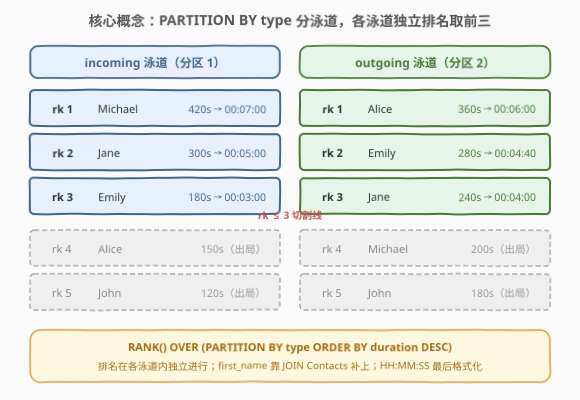
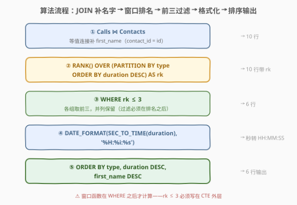
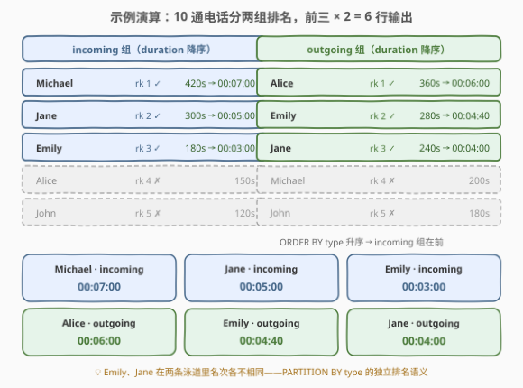
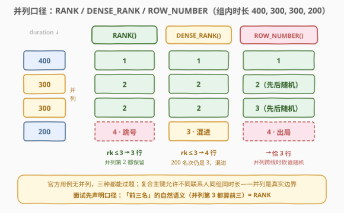

# LeetCode 查找最长的电话 题解

## 1. 题目概述

- **标题 / 题号**：查找最长的电话（#3124，medium）
- **链接**：https://leetcode.cn/problems/find-longest-calls/
- **难度**：中等
- **标签**：数据库、SQL、窗口函数、分组 Top-N、等值连接、时间格式化、LeetCode 锁题

> ⚠️ 本题为 LeetCode 付费题（锁题），题意描述根据官方示例用例与社区镜像还原，可能与官方题面有出入。

**表结构**：`Contacts`

| 列名 | 类型 |
|------|------|
| id | int |
| first_name | varchar |
| last_name | varchar |

- `id` 是这张表的主键（具有唯一值的列）。
- `Calls.contact_id` 外键引用本表的 `id`。
- 每行包含一位联系人的 `id`、`first_name`、`last_name`。

**表结构**：`Calls`

| 列名 | 类型 |
|------|------|
| contact_id | int |
| type | enum |
| duration | int |

- `(contact_id, type, duration)` 是这张表的主键（具有唯一值的列组合）。
- `type` 是 `('incoming', 'outgoing')` 的 ENUM（类别）类型。
- 每行包含一通电话的信息：`contact_id`、`type`、以秒为单位的 `duration`。

**目标**：编写解决方案，找出**三个最长的呼入（incoming）电话**和**三个最长的呼出（outgoing）电话**。返回 `first_name`、`type`、`duration_formatted` 三列，`duration` 必须格式化为 **HH:MM:SS**；结果按 `type`、`duration`、`first_name` 排序——题面字面写"降序"，但示例实际为 **type 升序 + duration、first_name 降序**（见下方解读）。

**示例 1**：

```text
输入：
Contacts 表：
+----+------------+-----------+
| id | first_name | last_name |
+----+------------+-----------+
| 1  | John       | Doe       |
| 2  | Jane       | Smith     |
| 3  | Alice      | Johnson   |
| 4  | Michael    | Brown     |
| 5  | Emily      | Davis     |
+----+------------+-----------+

Calls 表：
+------------+----------+----------+
| contact_id | type     | duration |
+------------+----------+----------+
| 1          | incoming | 120      |
| 1          | outgoing | 180      |
| 2          | incoming | 300      |
| 2          | outgoing | 240      |
| 3          | incoming | 150      |
| 3          | outgoing | 360      |
| 4          | incoming | 420      |
| 4          | outgoing | 200      |
| 5          | incoming | 180      |
| 5          | outgoing | 280      |
+------------+----------+----------+

输出：
+------------+----------+-------------------+
| first_name | type     | duration_formatted |
+------------+----------+-------------------+
| Michael    | incoming | 00:07:00          |
| Jane       | incoming | 00:05:00          |
| Emily      | incoming | 00:03:00          |
| Alice      | outgoing | 00:06:00          |
| Emily      | outgoing | 00:04:40          |
| Jane       | outgoing | 00:04:00          |
+------------+----------+-------------------+
```

**解释**：

- 呼入（incoming）按时长降序：Michael 420 > Jane 300 > Emily 180 > Alice 150 > John 120，前三名为 Michael、Jane、Emily；
- 呼出（outgoing）按时长降序：Alice 360 > Emily 280 > Jane 240 > Michael 200 > John 180，前三名为 Alice、Emily、Jane；
- `duration` 为秒：420 秒 = `00:07:00`，280 秒 = `00:04:40`；
- 输出 `incoming` 组在前（题面"降序"一词仅约束 `duration` 与 `first_name`，`type` 以示例为准取升序）。

**约束条件**（依据表定义重建）：

- `Contacts.id` 为主键，`Calls.(contact_id, type, duration)` 为复合主键——同一联系人同类型同时长不会重复出现，但**不同联系人可以有同类型同时长**（并列是真实边界）；
- `type` 只有 `'incoming'`、`'outgoing'` 两种取值；
- `duration` 为以秒计的非负整数；
- 输出列名为 `first_name`、`type`、`duration_formatted`。

> 💡 **审题四个关键点**：① 「每类各取前三」是标准的**分组 Top-N**——窗口函数 `PARTITION BY` 的主场；② `duration` 是**秒**，输出要 **HH:MM:SS**，格式化是必考的收尾动作；③ 复合主键允许并列时长，`RANK` / `DENSE_RANK` / `ROW_NUMBER` 的口径差异必须想清楚（见 5.1）；④ 排序方向**题面与示例打架**——判题以示例为准，`type` 升序在前、`duration` 与 `first_name` 降序。

## 2. 解题思路

### 2.1 暴力思路：UNION 两段各 LIMIT 3

直觉写法：`type` 只有两个取值，那就把每种类型硬编码一段「排序 + LIMIT 3」，再拼起来：

```sql
SELECT first_name, type,
       DATE_FORMAT(SEC_TO_TIME(duration), '%H:%i:%s') AS duration_formatted
FROM (
    (SELECT c2.first_name, c1.type, c1.duration
     FROM Calls c1 JOIN Contacts c2 ON c1.contact_id = c2.id
     WHERE c1.type = 'incoming'
     ORDER BY c1.duration DESC
     LIMIT 3)
    UNION ALL
    (SELECT c2.first_name, c1.type, c1.duration
     FROM Calls c1 JOIN Contacts c2 ON c1.contact_id = c2.id
     WHERE c1.type = 'outgoing'
     ORDER BY c1.duration DESC
     LIMIT 3)
) t
ORDER BY type, duration DESC, first_name DESC;
```

本题数据下它能得到正确答案，但有三处硬伤：

| 硬伤 | 说明 |
|------|------|
| **类别写死** | ENUM 将来加一个 `'missed'`，SQL 一行不改就静默漏掉一整类数据——枚举值是 DDL 里的元数据，不该散落在查询里 |
| **并列不稳定** | 并列第 3 时 `LIMIT 3` 砍谁取决于存储顺序，同一份数据可能输出不同结果 |
| **逻辑重复** | 同一段 JOIN + 排序复制两遍，改一处忘一处 |

> ⚠️ 暴力法的本质问题：把「分组」偷换成了「枚举」。分组 Top-N 的正确抽象是**在组内排名、再按名次过滤**——这正是窗口函数的设计初衷。

### 2.2 核心观察：分组 Top-N = JOIN + RANK() OVER (PARTITION BY type)



**观察 1（分组排名）**：「每个 type 各取前三」=`RANK() OVER (PARTITION BY type ORDER BY duration DESC)` 一次算完全部名次，再 `WHERE rk <= 3` 统一过滤。`PARTITION BY` 负责「各组各自排名」，`ORDER BY ... DESC` 负责「长电话优先」——**加多少种 type 都不动一行代码**，枚举值回归数据本身。

**观察 2（名字在另一张表）**：输出要 `first_name`，它只在 `Contacts` 里；`Calls.contact_id` 外键引用 `Contacts.id`，等值连接 `JOIN Contacts ON contact_id = id` 即可把名字带上。连接放进 CTE 里做一次，后面的排名、过滤都在「带名字的宽表」上进行。

**观察 3（秒 → HH:MM:SS）**：`SEC_TO_TIME(duration)` 把秒数转成 TIME 值，`DATE_FORMAT(..., '%H:%i:%s')` 按两位补零拼成 `HH:MM:SS`——420 秒一步得到 `00:07:00`。也可以用整除取模 + `LPAD` 手拼（见 5.2），本题数据规模下两者等价。

**观察 4（排序口径）**：题面说按 `type`、`duration`、`first_name`「降序」，但示例里 `incoming` 组排在 `outgoing` 前——字典序 `'incoming' < 'outgoing'`，真降序应 `outgoing` 在前，与示例矛盾。**判题以示例为准**：`ORDER BY type, duration DESC, first_name DESC`。顺带一提，MySQL 对 ENUM 列排序按**声明序号**（`incoming`=1 < `outgoing`=2），本题两种口径恰好一致，不必纠结。

### 2.3 算法流程图



**逻辑执行步骤**：

| 步骤 | SQL 片段 | 作用 | 示例数据流 |
|------|----------|------|-----------|
| ① | `Calls JOIN Contacts` | 等值连接补 `first_name` | 10 行 |
| ② | `RANK() OVER (PARTITION BY type ORDER BY duration DESC)` | 各组内按时长排名 | 10 行（两组各 1~5 名） |
| ③ | `WHERE rk <= 3` | 各组取前三（并列保留） | 6 行 |
| ④ | `DATE_FORMAT(SEC_TO_TIME(duration), '%H:%i:%s')` | 秒 → `HH:MM:SS` | 6 行 |
| ⑤ | `ORDER BY type, duration DESC, first_name DESC` | 组间按 type 升序、组内按时长降序 | 6 行输出 |

> ⚠️ 注意 ②③ 的分工：排名在**全部 10 行**上计算，过滤发生在排名**之后**——先过滤再排名会只剩每组的前三参与排名，名次全变成 1、2、3，等于白排。窗口函数的过滤必须用外层 `WHERE`（或 `QUALIFY`，MySQL 暂不支持），不能写在同一层。

### 2.4 示例演算



**incoming 组**（按 `duration` 降序）：

| first_name | duration(秒) | rk | 判定 | HH:MM:SS |
|-----------|-------------|----|------|----------|
| Michael | 420 | 1 | ✓ | 00:07:00 |
| Jane | 300 | 2 | ✓ | 00:05:00 |
| Emily | 180 | 3 | ✓ | 00:03:00 |
| Alice | 150 | 4 | ✗ | — |
| John | 120 | 5 | ✗ | — |

**outgoing 组**（按 `duration` 降序）：

| first_name | duration(秒) | rk | 判定 | HH:MM:SS |
|-----------|-------------|----|------|----------|
| Alice | 360 | 1 | ✓ | 00:06:00 |
| Emily | 280 | 2 | ✓ | 00:04:40 |
| Jane | 240 | 3 | ✓ | 00:04:00 |
| Michael | 200 | 4 | ✗ | — |
| John | 180 | 5 | ✗ | — |

**拼接输出**（`type` 升序 → incoming 组在前；组内 `duration` 降序）：Michael、Jane、Emily（incoming），接着 Alice、Emily、Jane（outgoing），共 6 行，与期望输出逐行一致。

> 💡 示例的检验价值：Emily 在两组里都挤进前三但名次不同（incoming 第 3 / outgoing 第 2），Jane 同理——**同一个人的两通电话在两个独立泳道里各自排名**，这正是 `PARTITION BY type` 语义的活教材。

## 3. 参考代码

### SQL（解法 A：等值连接 + 窗口函数，官方风格）

```sql
# Write your MySQL query statement below
WITH T AS (
    SELECT c2.first_name,
           c1.type,
           c1.duration,                                             -- 留给最终 ORDER BY 用
           RANK() OVER (PARTITION BY c1.type
                        ORDER BY c1.duration DESC) AS rk
    FROM Calls c1
    JOIN Contacts c2 ON c1.contact_id = c2.id                       -- 外键补名字
)
SELECT first_name,
       type,
       DATE_FORMAT(SEC_TO_TIME(duration), '%H:%i:%s') AS duration_formatted
FROM T
WHERE rk <= 3                                                       -- 各组前三，并列保留
ORDER BY type,                                                      -- 升序：incoming 在前（以示例为准）
         duration DESC,
         first_name DESC;
```

> 💡 **写法要点**：
> - **`duration` 故意留在 CTE 里**：最终 `ORDER BY duration DESC` 走数值排序，比按 `duration_formatted` 字符串排序更稳（补零定长的 `HH:MM:SS` 字符串序虽与数值序一致，但数值列意图更直白，也免去小时数超两位的极端争议）；
> - **`RANK` 而非 `ROW_NUMBER`**：并列第 3 时把并列行都保留，符合「前三名」的自然语义（口径讨论见 5.1）；
> - **过滤写在 CTE 外**：窗口函数在 `WHERE` 之后才计算，`rk <= 3` 必须放在外层查询。

### SQL（解法 B：相关子查询，MySQL 5.7 无窗口函数时的替身）

```sql
# Write your MySQL query statement below
SELECT c2.first_name,
       c1.type,
       DATE_FORMAT(SEC_TO_TIME(c1.duration), '%H:%i:%s') AS duration_formatted
FROM Calls c1
JOIN Contacts c2 ON c1.contact_id = c2.id
WHERE (SELECT COUNT(*)
       FROM Calls c3
       WHERE c3.type = c1.type
         AND c3.duration > c1.duration) < 3                          -- 比我长的不足 3 通 → 前三
ORDER BY c1.type, c1.duration DESC, c2.first_name DESC;
```

> 💡 **解法 B 的取舍**：「比我严格更长的电话不足 3 通」= `RANK() <= 3` 的集合论定义，语义与解法 A 完全一致；代价是相关子查询对每行扫一遍同组数据，无索引时 $O(n^2)$——`(type, duration)` 上建索引即可救回。老版本 MySQL 没有窗口函数，这是必会的替身写法。

### Python（pandas）

```python
import pandas as pd


def find_longest_calls(contacts: pd.DataFrame, calls: pd.DataFrame) -> pd.DataFrame:
    d = calls.merge(contacts, left_on="contact_id", right_on="id")   # 外键补名字
    d["rk"] = d.groupby("type")["duration"].rank(method="min", ascending=False)  # = RANK()
    d = d[d["rk"] <= 3].copy()

    d["duration_formatted"] = d["duration"].apply(                    # 秒 → HH:MM:SS
        lambda s: f"{s // 3600:02d}:{s % 3600 // 60:02d}:{s % 60:02d}"
    )
    return (
        d.sort_values(["type", "duration", "first_name"],
                      ascending=[True, False, False])                 # type 升序在前
        [["first_name", "type", "duration_formatted"]]
        .reset_index(drop=True)
    )
```

> 💡 **pandas 对照**（付费题无官方函数签名，函数名按题名约定）：
> - `groupby("type")["duration"].rank(method="min", ascending=False)` 精确对应 SQL 的 `RANK() OVER (PARTITION BY ... ORDER BY ... DESC)`——`method="min"` 即「并列取最小名次」，`method="dense"` 对应 `DENSE_RANK`，`method="first"` 对应 `ROW_NUMBER`；
> - 格式化不用 `pd.to_timedelta(...).dt.strftime("%H:%M:%S")`——`strftime` 的 `%H` 只认 00–23，超过 24 小时会丢掉天数，整除取模手拼才稳；
> - `.copy()` 防止对过滤后的视图赋值触发 `SettingWithCopyWarning`。

## 4. 复杂度分析

设 $n$ 为 `Calls` 行数，$m$ 为 `Contacts` 行数，$k = 2$ 为电话类型数。

| 维度 | 复杂度 | 说明 |
|------|--------|------|
| **时间复杂度（解法 A）** | $O(n \log n + m)$ | 哈希 JOIN 一趟 $O(n + m)$；窗口函数各组排序 $O(n \log n)$；过滤、格式化线性；结果至多约 $3k$ 行，末次排序 $O(1)$ |
| **空间复杂度（解法 A）** | $O(n + m)$ | JOIN 中间结果 + 窗口排名列 |
| **时间复杂度（解法 B）** | $O(n^2)$ | 相关子查询每行重扫同组；`(type, duration)` 建索引后降为 $O(n \log n)$ |
| **对比暴力** | 同阶但更稳 | 2.1 的 UNION 两段 LIMIT 也是两次排序 $O(n \log n)$——差在**可维护性与并列稳定性**，不在复杂度 |

> ⚠️ 分组 Top-N 的下界就是组内排序：想让「前三名」在并列时行为确定，就必须让同组元素可比，$O(n \log n)$ 逃不掉（除非 duration 值域极小可用计数）。

## 5. 扩展

### 5.1 并列的口径：RANK / DENSE_RANK / ROW_NUMBER



复合主键 `(contact_id, type, duration)` 只保证「同一联系人同类型同时长」不重复——**不同联系人完全可能在同一组里并列**。设某组时长为 `400, 300, 300, 200`：

| 函数 | 名次序列 | `<= 3` 过滤后 | 并列语义 |
|------|---------|--------------|----------|
| `RANK()` | 1, 2, 2, **4** | **3 行**（两个 300 都保留） | 并列占用名次、之后跳号——「并列第 2 都算前三」 |
| `DENSE_RANK()` | 1, 2, 2, **3** | **4 行**（200 也混进来） | 并列不占名次——「第 3 名之后还有第 3 名」 |
| `ROW_NUMBER()` | 1, 2, 3, 4 | **3 行**（两个 300 都保留，谁第 2 谁第 3 不确定） | 强制唯一——「恰好 3 通」；并列横跨切割线时砍谁随机 |

官方用例无并列，三种写法都能过题；但**面试里必须先声明口径**：「前三名」的自然语义（并列第 3 都算前三）对应 `RANK`，「恰好 3 行」对应 `ROW_NUMBER`。真正出现「砍谁不确定」要等并列**横跨第 3 名切割线**——例如时长 400, 300, 300, 300 取前三，`ROW_NUMBER` 必须随机砍掉一个 300，而 `RANK` 会把三个都留下（输出 4 行）。社区通行解取 `RANK`，本文从之。

### 5.2 秒 → HH:MM:SS 的三种写法

| 写法 | 代码 | 边界 |
|------|------|------|
| **TIME 函数派** | `DATE_FORMAT(SEC_TO_TIME(d), '%H:%i:%s')` | 最简洁；但 MySQL `TIME` 上限 `838:59:59`，越界会截断并告警（电话时长场景绰绰有余） |
| **算术手拼派** | `CONCAT(LPAD(d DIV 3600, 2, '0'), ':', LPAD(d % 3600 DIV 60, 2, '0'), ':', LPAD(d % 60, 2, '0'))` | 纯整除取模，任意时长都能拼；小时数超 99 时 `LPAD` 自然增长位数，不丢数据 |
| **MAKETIME 派** | `CAST(MAKETIME(d DIV 3600, d % 3600 DIV 60, d % 60) AS CHAR)` | 直接构造 TIME 再转字符串，可读性介于两者之间 |

> 💡 三派殊途同归，面试背熟一派、知道另外两派即可。顺带一提：`d % 3600 DIV 60` 和 `d DIV 60 % 60` 等价（分钟 = 总分钟数对 60 取余），别写成 `d % 60 DIV 60`——运算符优先级里 `DIV` 与 `%` 同级、从左到右结合，写错位置结果直接归零。

### 5.3 分组 Top-N 的武器谱

窗口函数之外，这个套路还有三件老兵器：

- **相关子查询**（解法 B）：`RANK <= N` 的集合论定义直译，5.7 及以下唯一正解，代价 $O(n^2)$；
- **用户变量**：`@rk := IF(@type = type AND @dur = duration, @rk, @rk + 1)` 手工模拟窗口，写法繁琐、可移植性差，了解即可；
- **pandas 捷径**：`d.groupby("type", group_keys=False).apply(lambda g: g.nlargest(3, "duration"))`——`nlargest` 默认保留并列（`keep="all"` 时），与 `RANK` 口径对齐。

日常业务里「每类销量 Top 3」「每个部门工资 Top 3」「每个用户最近 3 笔订单」全是同一模板：**`PARTITION BY` 定组、`ORDER BY` 定序、`WHERE rk <= N` 截断**。

## 6. 面试要点

1. **题面说按 `type`、`duration`、`first_name`「降序」，示例却 incoming 在前，到底怎么排？**

   > 以判题（示例）为准：`ORDER BY type, duration DESC, first_name DESC`。字典序 `'incoming' < 'outgoing'`，真按 type 降序应 outgoing 在前，与示例矛盾；且 MySQL 对 ENUM 列排序按**声明序号**（incoming=1 < outgoing=2），两种口径本题恰好一致。题面的 "descending" 只对 `duration`、`first_name` 生效——**题面与示例冲突时，永远拿示例对齐面试官**。

2. **`RANK`、`DENSE_RANK`、`ROW_NUMBER` 在本题分别输出几行？**

   > 无并列时三者都是每组恰好 3 行。并列时（如某组时长 400, 300, 300, 200）：`RANK` 过滤后 3 行（并列第 2 保留、200 名次跳到 4 出局）；`DENSE_RANK` 过滤后 4 行（200 名次仍是 3，混进前三）；`ROW_NUMBER` 恰 3 行（两个 300 都保留、谁第 2 谁第 3 不确定，并列横跨切割线时才会随机砍人）。复合主键允许不同联系人同组同时长，并列是真实边界，口径必须先说清。

3. **`DATE_FORMAT(SEC_TO_TIME(...))` 有什么坑？**

   > `SEC_TO_TIME` 返回 `TIME`，MySQL `TIME` 上限 `838:59:59`，越界截断并产生告警；对任意时长都稳的写法是整除取模 + `LPAD` 手拼。另外格式串是 `'%H:%i:%s'`——分钟是 `%i` 不是 `%m`（那是月份），秒用 `%s` 或 `%S`。

4. **为什么用 `JOIN` 而不是子查询取名字？外键在这里保证什么？**

   > `first_name` 只在 `Contacts`，等值连接是唯一途径；子查询逐行取名字是隐式相关子查询，优化器多半能改写成 JOIN，但语义上多一层间接。外键保证每个 `contact_id` 都能匹配到 `Contacts.id`——所以 `INNER JOIN` 不会丢行，`LEFT JOIN` 在这里只是防御性冗余。

5. **窗口函数的 `WHERE rk <= 3` 为什么必须写在 CTE 外面？**

   > SQL 的逻辑求值顺序是 `FROM → WHERE → GROUP BY → HAVING → SELECT(含窗口) → ORDER BY`，窗口函数在 `WHERE` **之后**才计算——同层引用 `rk` 会直接报「未知列」。所以要么套一层 CTE/派生表，要么用支持 `QUALIFY` 子句的方言（DuckDB、Snowflake 等）一步到位。

> 💡 **一句话总结**：`Calls JOIN Contacts` 补名字，`RANK() OVER (PARTITION BY type ORDER BY duration DESC)` 分泳道排名，`rk <= 3` 各取前三，`DATE_FORMAT(SEC_TO_TIME(...))` 秒转 `HH:MM:SS`，最后 `ORDER BY type, duration DESC, first_name DESC`——分组 Top-N 的完整模板，外加「题面与示例打架」「并列口径」两个必聊的边界话题。

## 同类练习题

| # | 题目 | 与本题的关联 |
|---|------|-------------|
| 185 | [部门工资前三高的所有员工](https://leetcode.cn/problems/department-top-three-salaries/)（[站内题解](../0101-0200/185_部门工资前三高的所有员工.md)） | 分组 Top-3 + `DENSE_RANK` 的免费招牌题——把 `type` 换成部门、`duration` 换成工资，模板一字不差 |
| 176 | [第二高的薪水](https://leetcode.cn/problems/second-highest-salary/)（[站内题解](../0101-0200/176_第二高的薪水.md)） | Top-N 的入门特例（N=2、只要一个值），体会 `LIMIT/OFFSET` 与窗口两条路的取舍 |
| 2984 | [找到每座城市的高峰通话小时](https://leetcode.cn/problems/find-peak-calling-hours-for-each-city/)（[站内题解](../2901-3000/2984_找到每座城市的高峰通话小时.md)） | 同为电话主题的分组内取最优——argmax 是 Top-N 的 N=1 特例，一家人 |
| 1699 | [两人之间的通话次数](https://leetcode.cn/problems/number-of-calls-between-two-persons/)（[站内题解](../1601-1700/1699_两人之间的通话次数.md)） | `Calls` 表连接与聚合入门，顺带练「无向通话边」的对称化处理 |
| 3166 | [计算停车费用与时长](https://leetcode.cn/problems/calculate-parking-fees-and-duration/) | 时长格式化的姊妹锁题——停车时长转 `HH:MM:SS` 与本题 5.2 的三种写法无缝衔接 |
