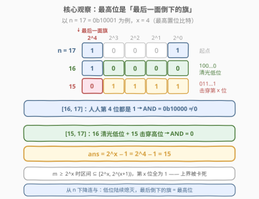
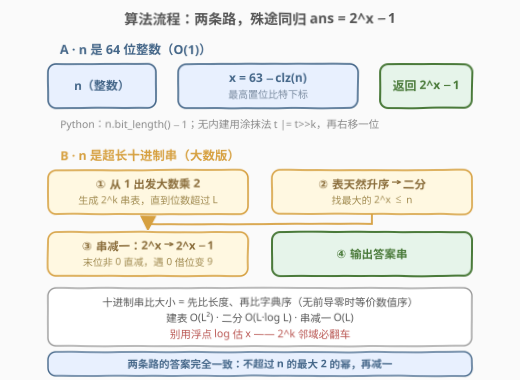
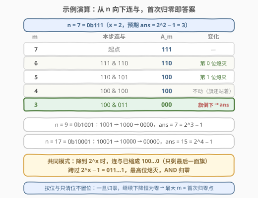

# LeetCode 使得按位与结果为 0 的最大数字 题解

## 1. 题目概述

- **标题 / 题号**：使得按位与结果为 0 的最大数字（#3125，medium）
- **链接**：https://leetcode.cn/problems/maximum-number-that-makes-result-of-bitwise-and-zero/
- **难度**：中等
- **标签**：贪心、字符串、排序、位运算

> ⚠️ 本题为 LeetCode 付费题，题意描述根据官方示例用例与 hints 重建，可能与官方题面有出入。

**题意**：给你一个正整数 `n`。从 `n` 开始**向下**做连续按位与：

$$A_m = n \,\&\, (n-1) \,\&\, (n-2) \,\&\, \cdots \,\&\, m$$

求使得 $A_m = 0$ 的**最大** $m$。换句话说：找一个最大的 $m \le n$，使得区间 $[m, n]$ 内**所有整数**按位与的结果为 $0$。

注意按位与只会「清位」不会「置位」：一旦 $A_m = 0$，继续下降 $A$ 恒为 $0$。所以「最大的 $m$」就是 $A_m$ **首次归零**的位置——本题要找的正是这临门一刀。

**示例 1**：

```text
输入：n = 7
输出：3
解释：7 & 6 = 6，6 & 5 = 4，4 & 4 = 4，4 & 3 = 0。
     连与第一次变成 0 是在 m = 3；任何 m ≥ 4 时结果非零。
```

**示例 2**：

```text
输入：n = 9
输出：7
解释：9 & 8 = 8，8 & 7 = 0，首次归零在 m = 7。
```

**示例 3**：

```text
输入：n = 17
输出：15
解释：17 & 16 = 16，16 & 15 = 0，首次归零在 m = 15。
```

**约束条件**（付费题，官方约束未知）：

- 官方标签含 **String / Sorting**，示例用例以字符串形式给出（`"7"`、`"9"`、`"17"`），推测 `n` 以**十进制字符串**给出且可能远超 64 位；下文第 3 节同时给出「64 位整数版」与「任意长度大数串版」两套实现，思路完全一致。
- 若 `n` 以普通整数给出（$1 \le n < 2^{63}$），见 3.1 的一行解；`n = 1` 时答案为 $0$（$0$ 与任何数按位与都是 $0$）。

> 💡 读题关键：这道题的「连续按位与」不是随便挑几个数与起来，而是**一段连续区间 $[m,n]$ 的全体 AND**。区间的 AND 有个著名性质——只保留所有数**公共的 1 位**。想让 AND 归零，就得让每一位都在区间里找到至少一个「受害者」（该位为 0 的数）。而最高位是最难「受害」的，它决定了答案的下限位置。

## 2. 解题思路

### 2.1 暴力思路：一路下降模拟

最直接的模拟：维护当前连与结果 `cur = n`，让 `m` 从 `n` 出发逐步减一，每步 `cur &= m`，第一次 `cur == 0` 时返回 `m`。

```python
def brute(n):
    cur = n
    m = n
    while cur:
        m -= 1
        cur &= m
    return m
```

- 单步 $O(1)$（`n` 装得下机器字时），总体 $O(n)$；
- 但答案 $2^x - 1$ 与 $n$ 之间可能隔得非常远——例如 $n = 2^{62} + 1$ 时答案 $2^{62} - 1$ 离 $n$ 有数十亿步，$O(n)$ 的模拟步数以 `n` 的**数值**计，天文数字的字符串 `n` 更是直接不可模拟；
- 暴力的价值在于揭示规律：观察 `cur` 的变化会发现，低位早早就熄灭了，**撑到最后的永远是最高位**——这正是通往正解的钥匙。

### 2.2 核心观察：最高位是「最后一面倒下的旗」



设 $x$ 为 $n$ 的**最高置位比特**下标，即 $2^x \le n < 2^{x+1}$。答案为：

$$\boxed{\text{ans} = 2^x - 1}$$

证明分「上界」与「达到上界」两半，这是最优化问题的标准叙事：

**引理 1（上界：$m \ge 2^x$ 时 AND 必不为 0）**
若 $m \ge 2^x$，则区间 $[m, n] \subseteq [2^x,\, 2^{x+1})$，其中**每个数**的第 $x$ 位都是 1，按位与后第 $x$ 位仍是 1，故 $A_m \ge 2^x \ne 0$。任何更大的 $m$ 都不合法，答案被卡死在 $m \le 2^x - 1$。

**引理 2（达到上界：$m = 2^x - 1$ 时 AND 恰为 0）**
当 $m = 2^x - 1$ 时，区间 $[2^x - 1,\, n]$ 同时包含两个「互补杀手」：

- $2^x = (100\cdots0)_2$：第 $x$ 位以下**全是 0**，一把清光所有低位；
- $2^x - 1 = (011\cdots1)_2$：第 $x$ 位（及更高位）**是 0**，击穿最后一面旗。

仅这两个数相与就已经是 $0$，整个区间的 AND 自然为 $0$。

> 💡 与官方 hint 的对照：hint 2 说「从 $n$ 向下连与，**最后**变 0 的置位就是最高位」——因为低位早在连与经过 $2^x$（即 $100\cdots0$）那一刻就被清光了；事实上降到 $m = 2^x$ 时，$A_m$ 已经**恰好等于** $2^x$（区间 $[2^x, n]$ 内人人都有第 $x$ 位，而 $2^x$ 自身只贡献第 $x$ 位），场上只剩最后一面旗。跨过 $m = 2^x - 1$（即 $011\cdots1$），这面旗才倒下，$A_m$ 直接从 $2^x$ 归零。所以**首次归零点恰为 $2^x - 1$**，即 hint 3 的结论。

于是问题从「模拟下降过程」坍缩成「求 $n$ 的最高置位比特」——一个 $O(1)$（整数）或 $O(L)$（$L$ 位十进制串）的查询。

### 2.3 算法流程图



**路线 A（`n` 为 64 位整数）**：直接调内建「数前导零」求出 $x$，再移位减一：

- C++：`x = 63 - __builtin_clzll(n)`，答案 `(1LL << x) - 1`；
- Python：`x = n.bit_length() - 1`，答案 `(1 << x) - 1`；
- 无内建时的手写技巧——**涂抹法（smearing）**：`t = n; t |= t>>1; t |= t>>2; t |= t>>4; t |= t>>8; t |= t>>16; t |= t>>32;` 得到 $2^{x+1} - 1$，再 `t >> 1` 即 $2^x - 1$。

**路线 B（`n` 为任意长度的十进制串，大数版）**：不能用浮点 `log`（精度不够也不可靠），改走**2 的幂次表**：

1. **建表**：从 `"1"` 出发反复「大数乘 2」生成 $2^0, 2^1, 2^2, \dots$ 的十进制串，直到位数超过 `n` 的位数 $L$ 为止（表长约为 $3.33L$）；
2. **查表**：表天然升序，在其中**二分**找最大的 $2^x \le n$。十进制串比大小的规则是「**先比长度，再按字典序**」——无前导零时位数大者数值必大，位数相同字典序与数值序一致（这正是官方 **Sorting** 标签的落点）；
3. **减一**：对 $2^x$ 的串做一次「串减一」（末位非 0 直接减，遇 0 借位变 9），得到 $2^x - 1$ 的串并输出。

### 2.4 示例演算



以 `n = 7` 为例（$x = 2$，预期答案 $2^2 - 1 = 3$）：

| $m$ | 本步连与 | $A_m$（二进制） | 变化 |
|-----|----------|-----------------|------|
| 7 | 起点 | $111$ | —— |
| 6 | $111 \& 110$ | $110$ | 第 0 位熄灭 |
| 5 | $110 \& 101$ | $100$ | 第 1 位熄灭 |
| 4 | $100 \& 100$ | $100$ | 不动（旗还站着） |
| 3 | $100 \& 011$ | $000$ | **最后一面旗（第 2 位）倒下** |

三个官方用例的共同模式：降到 $2^x$ 时 $A_m$ 已缩成 $100\cdots0$，再跨一步到 $2^x - 1$ 才归零：

- $n = 7 = (111)_2$：$111 \to 110 \to 100 \to 100 \to 000$，答案 $3 = 2^2 - 1$；
- $n = 9 = (1001)_2$：$1001 \to 1000 \to 0000$，答案 $7 = 2^3 - 1$；
- $n = 17 = (10001)_2$：$10001 \to 10000 \to 0000$，答案 $15 = 2^4 - 1$。

## 3. 参考代码

> ⚠️ 付费题拿不到官方函数签名，下文按重建题意给出：`n` 以十进制字符串传入时用大数版，以整数传入时用整数版，两版互为印证。

### C++

大数串版（任意长度十进制串，幂次表 + 二分 + 串减一）：

```cpp
class Solution {
  public:
    string maxNumber(string n) {
        // 1) 建表：pows[k] = 2^k 的十进制串（大数乘 2，从右往左翻倍进位）
        auto twice = [](const string& s) {
            string r;
            int carry = 0;
            for (int i = (int)s.size() - 1; i >= 0; --i) {
                int d = (s[i] - '0') * 2 + carry;
                r.push_back('0' + d % 10);
                carry = d / 10;
            }
            if (carry) r.push_back('0' + carry);
            reverse(r.begin(), r.end());
            return r;
        };
        vector<string> pows = {"1"};
        while (pows.back().size() <= n.size())          // 直到位数超过 n
            pows.push_back(twice(pows.back()));

        // 2) 二分找最大的 2^x <= n：先比长度，再比字典序
        auto lessEq = [](const string& a, const string& b) {
            return a.size() < b.size() ||
                   (a.size() == b.size() && a <= b);
        };
        int lo = 0, hi = (int)pows.size() - 1, x = 0;
        while (lo <= hi) {
            int mid = lo + (hi - lo) / 2;
            if (lessEq(pows[mid], n)) { x = mid; lo = mid + 1; }
            else                        hi = mid - 1;
        }

        // 3) 2^x - 1：串减一（末位非 0 直接减，遇 0 借位变 9）
        string s = pows[x];
        int i = (int)s.size() - 1;
        while (s[i] == '0') s[i--] = '9';
        s[i] -= 1;
        if (s.size() > 1 && s[0] == '0') s.erase(s.begin());   // 防御性去前导零
        return s;
    }
};
```

整数版（$1 \le n < 2^{63}$，一行位运算）：

```cpp
class Solution {
  public:
    long long maxNumber(long long n) {
        // 63 - 前导零个数 = 最高置位比特下标 x；1<<x 即不超过 n 的最大 2 的幂
        return (1LL << (63 - __builtin_clzll(n))) - 1;
    }
};
```

### Python

Python 的 `int` 是任意精度，串直接转整数后一步到位：

```python
class Solution:
    def maxNumber(self, n: str) -> str:
        x = int(n).bit_length() - 1        # 最高置位比特下标
        return str((1 << x) - 1)           # 2^x - 1

# 若 n 以整数给出：
#     return (1 << (n.bit_length() - 1)) - 1
```

> 💡 写法盘点：
> - **求最高位**：C++ `__builtin_clzll` / Java `Long.numberOfLeadingZeros` / Python `int.bit_length` / Go `bits.Len64`；无内建时用涂抹法 `t |= t>>k`（$k = 1,2,4,\dots$）后 `t >> 1`。
> - **纯串版（与 C++ 同构，不依赖大整数）**：`twice` 用「倒序逐位乘 2 进位」，查表用「长度优先 + 字典序」的二分，减一用「借位 9 循环」——三个零件都是[415. 字符串相加](https://leetcode.cn/problems/add-strings/)同款的手工竖式算术。
> - **浮点 `log` 的坑**：用 `log(n) / log(2)` 估 $x$ 会因精度误差在 $2^k$ 附近翻车（经典事故如 [69. x 的平方根](https://leetcode.cn/problems/sqrtx/)的牛顿法对照），大数场景请一律走整数算法。
> - **`n = 1` 边界**：$x = 0$，答案 $2^0 - 1 = 0$；整数版 `__builtin_clzll(1) = 63` 得 $x = 0$，无需特判。

## 4. 复杂度分析

设 `n` 为 $L$ 位十进制数（整数版视作 $L \le 19$ 的常数情形）：

| 维度 | 复杂度 | 说明 |
|------|--------|------|
| 时间（整数版） | $O(1)$ | 一次前导零计数 + 一次移位减一 |
| 时间（大数版） | $O(L^2)$ | 建表约 $3.33L$ 个幂、每个长度渐增至 $L$（$\sum k \approx 1.66L^2$ 位操作）；二分 $O(L \log L)$、串减一 $O(L)$，均被建表主导 |
| 空间（整数版） | $O(1)$ | 若干机器字 |
| 空间（大数版） | $O(L^2)$ | 幂次表共约 $1.66L^2$ 个数字符；若内存吃紧可改为「线性扫表只留上一个幂」，空间降到 $O(L)$，时间不变 |

## 5. 扩展

### 5.1 区间按位与的通用引理：AND = 公共二进制前缀

本题的两条引理其实是经典引理的特例：区间 $[l, r]$ 的全体按位与等于 $l$ 与 $r$ 的**公共二进制前缀**（从最高位起连续相同的位，其余位全为 0）。原因是：若 $l \ne r$，则两者从某一位起开始「分叉」，分叉位以下的取值在区间内必然两头都出现（相邻整数逐位翻转），该位必被清零。

- 本题引理 1：$l = 2^x$ 与 $r = n < 2^{x+1}$ 的公共前缀是 $100\cdots0$ → AND $= 2^x$；
- 本题引理 2：$l = 2^x - 1$（第 $x$ 位为 0）与 $r = n$（第 $x$ 位为 1）在最高位就分叉，公共前缀为空 → AND $= 0$。

这正是 [201. 数字范围按位与](https://leetcode.cn/problems/bitwise-and-of-numbers-range/)的正主套路（该题实现上常用「`r &= r-1` 逐步剥掉低位直到 $r \le l$」或「同步右移找公共前缀」）；本题相当于它的反问题——**给定右端点 $n$，求能让 AND 归零的最大左端点**。

### 5.2 大数版的其他路线

| 路线 | 思路 | 复杂度 |
|------|------|--------|
| 幂次表 + 二分（本文） | 生成 $2^k$ 的串表，按「长度 + 字典序」二分 | $O(L^2)$ 时间，可降到 $O(L)$ 空间 |
| 十进制转二进制 | 反复「除 2 取余」求出位长 $x+1$，再反向「乘 2」生成 $2^x$ | $O(L^2)$，三趟竖式，常数更大 |
| 浮点对数估算 + 修正 | $x \approx \lfloor L \log_2 10 \rfloor$ 再用串比较微调 | 快但极易翻车，不推荐 |

### 5.3 「最高位掩码」家族

$2^x - 1$（最高位以下全 1 的掩码）与 $2^{x+1} - 1$（位数内全 1 的掩码）是一对高频道具：前者是本题答案，也常用于「保留低位 / 抹掉高位」；后者见 [190. 颠倒二进制位](https://leetcode.cn/problems/reverse-bits/)与 [1009. 十进制整数的补码](https://leetcode.cn/problems/complement-of-base-10-integer/)的按位取反。配合 Brian Kernighan 技巧 `n \&= n - 1`（每次消去最低置位）还可得到一族「逐位熄灯」的写法——[191. 位 1 的个数](https://leetcode.cn/problems/number-of-1-bits/)与 [231. 2 的幂](https://leetcode.cn/problems/power-of-two/)是其正主题。

## 6. 面试要点

1. **为什么答案恰好是 $2^x - 1$？请给出完整的正确性论证。**

   - 「上界 + 达到上界」两半：任何 $m \ge 2^x$ 的区间 $[m, n]$ 都落在 $[2^x, 2^{x+1})$ 内，人人第 $x$ 位为 1，AND 非零（上界被卡死）；而 $m = 2^x - 1$ 时区间同时含 $100\cdots0$（清光低位）与 $011\cdots1$（击穿第 $x$ 位），AND 必为 0（达到上界）。两半合起来答案是唯一的 $2^x - 1$。

2. **从 $n$ 下降连与的过程中，$A_m$ 是怎么演化的？为什么说「最后倒下的是最高位」？**

   - 低位随下降陆续熄灭；降到 $m = 2^x$ 时 $A_m$ **恰等于** $2^x$——区间人人有第 $x$ 位，而 $2^x$ 只贡献第 $x$ 位。此后每一步都原地不动，直到跨过 $2^x - 1$（二进制 $011\cdots1$）才把最后一面旗打倒，$A_m$ 从 $2^x$ 直接归零。这也解释了为什么「首次归零点」不可能比 $2^x - 1$ 更大。

3. **`n` 以十进制字符串给出时，如何求最高置位比特？浮点对数行不行？**

   - 行不通：双精度 `log` 只有约 15–16 位有效数字，在 $2^k$ 邻域的舍入误差足以让 $x$ 差 1，且位数一多必然失真。稳妥做法是整数算法：幂次表二分（本文）或十进制转二进制取位长；比较十进制串务必「先比长度、再比字典序」——无前导零时两者合起来才等价于数值比较。

4. **整数版不用内建函数，一行位运算怎么手写？**

   - 涂抹法：`t = n; t |= t>>1; t |= t>>2; t |= t>>4; t |= t>>8; t |= t>>16; t |= t>>32;` 把最高位以下全部涂成 1（得 $2^{x+1}-1$），`t >> 1` 即 $2^x - 1$；或者循环 `p = 1; while (p << 1 <= n) p <<= 1; return p - 1;`。注意 `n = 1` 时答案为 0，两条路径都天然覆盖。

5. **本题与 [201. 数字范围按位与](https://leetcode.cn/problems/bitwise-and-of-numbers-range/)是什么关系？**

   - 201 题给区间 $[m, n]$ 问 AND（答案 = 公共二进制前缀），本题给右端点 $n$ 反求「能让 AND 为 0 的最大左端点」。用公共前缀引理看本题：左端点 $\ge 2^x$ 时与 $n$ 的公共前缀至少含第 $x$ 位（非零）；左端点 $= 2^x - 1$ 时最高位即分叉（零）。一正一反，同一引理的两种问法。

## 同类练习题

| # | 题目 | 与本题的关联 |
|---|------|-------------|
| 201 | [数字范围按位与](https://leetcode.cn/problems/bitwise-and-of-numbers-range/)（[站内题解](../0201-0300/201_数字范围按位与.md)） | 区间 AND = 公共二进制前缀的正主题，本题两条引理都可由它统一推出 |
| 231 | [2 的幂](https://leetcode.cn/problems/power-of-two/)（[站内题解](../0201-0300/231_2的幂.md)） | `n & (n-1)` 判 2 的幂——本题答案恰是「不超过 n 的最大 2 的幂」再减一 |
| 400 | [第 N 位数字](https://leetcode.cn/problems/nth-digit/)（[站内题解](../0301-0400/400_第N位数字.md)） | 同款「按数量级分层定位」思想——一个按二进制幂分层，一个按十进制位数分层 |
| 415 | [字符串相加](https://leetcode.cn/problems/add-strings/)（[站内题解](../0401-0500/415_字符串相加.md)） | 大数版的核心零件——串上竖式加法，与本题的串上乘 2 / 串减一同源 |
| 1009 | [十进制整数的补码](https://leetcode.cn/problems/complement-of-base-10-integer/) | 「最高位以下全 1 掩码」家族的另一种用法，与 $2^x - 1$ 道具直接挂钩 |
