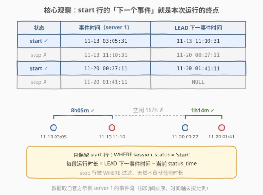
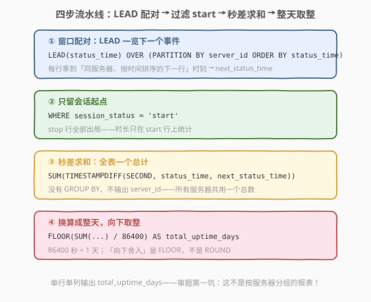
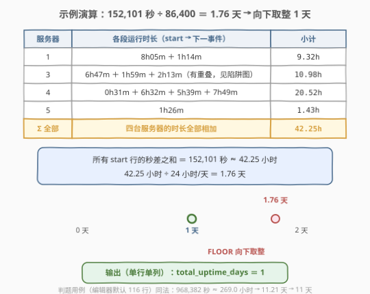
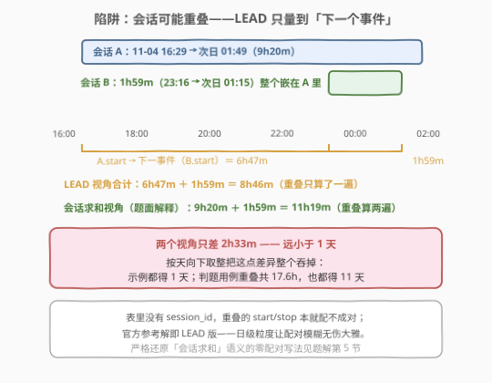

# LeetCode 服务器利用时间 题解

## 1. 题目概述

- **标题 / 题号**：服务器利用时间（#3126，medium）
- **链接**：https://leetcode.cn/problems/server-utilization-time/
- **难度**：中等
- **标签**：数据库、SQL、窗口函数、`LEAD`、`TIMESTAMPDIFF`、`FLOOR`、LeetCode 锁题

> ⚠️ 本题为 LeetCode 付费题（锁题），题意描述根据官方示例用例与外部资料重建，可能与官方题面有出入。（题面已与社区镜像 doocs/leetcode 的官方中文翻译交叉核对，示例输入输出与 LeetCode GraphQL 接口返回一致，出入风险较低。）

**表结构**：`Servers`

| 列名 | 类型 |
|------|------|
| server_id | int |
| status_time | datetime |
| session_status | enum |

- `(server_id, status_time, session_status)` 是这张表的主键（值互不相同的列组合）。
- `session_status` 是 `('start', 'stop')` 的 ENUM。
- 每行记录一个事件：服务器 `server_id` 在 `status_time` 时刻**启动**（start）或**停止**（stop）一段会话；同台服务器可以先后、甚至同时跑多段会话。

**目标**：编写一个解决方案，统计所有服务器**运行的总时间**（把每段 start→stop 会话的时长全部累加），输出应**向下舍入为最接近的整天数**，以**任意顺序**返回结果。

**输出格式**：单行单列 `total_uptime_days`——**所有服务器共用一个总计**，不按服务器分组！

**示例 1**：

```text
输入：Servers 表
+-----------+---------------------+----------------+
| server_id | status_time         | session_status |
+-----------+---------------------+----------------+
| 3         | 2023-11-04 16:29:47 | start          |
| 3         | 2023-11-05 01:49:47 | stop           |
| 3         | 2023-11-25 01:37:08 | start          |
| 3         | 2023-11-25 03:50:08 | stop           |
| 1         | 2023-11-13 03:05:31 | start          |
| 1         | 2023-11-13 11:10:31 | stop           |
| 4         | 2023-11-29 15:11:17 | start          |
| 4         | 2023-11-29 15:42:17 | stop           |
| 4         | 2023-11-20 00:31:44 | start          |
| 4         | 2023-11-20 07:03:44 | stop           |
| 1         | 2023-11-20 00:27:11 | start          |
| 1         | 2023-11-20 01:41:11 | stop           |
| 3         | 2023-11-04 23:16:48 | start          |
| 3         | 2023-11-05 01:15:48 | stop           |
| 4         | 2023-11-30 15:09:18 | start          |
| 4         | 2023-11-30 20:48:18 | stop           |
| 4         | 2023-11-25 21:09:06 | start          |
| 4         | 2023-11-26 04:58:06 | stop           |
| 5         | 2023-11-16 19:42:22 | start          |
| 5         | 2023-11-16 21:08:22 | stop           |
+-----------+---------------------+----------------+

输出：
+-------------------+
| total_uptime_days |
+-------------------+
| 1                 |
+-------------------+
```

**解释**（按题面口径，逐会话求和）：

- server 3：约 9.3h ＋ 2.2h ＋ 1.98h ≈ 13.48h（注意：第 1、3 两段会话在时间上**重叠**）；
- server 1：约 8h ＋ 1.23h ≈ 9.23h；
- server 4：约 0.52h ＋ 6.53h ＋ 5.65h ＋ 7.82h ≈ 20.52h；
- server 5：约 1.43h；
- 全部服务器累计约 44.5 小时，相当于 **1 整天**加零头——只保留整天，输出 **1**。

**约束条件**（依据公开接口与题意还原）：

- 每个会话恰有一个 start 和一个 stop；
- 同台服务器的不同会话在时间上**可能重叠**（并发会话），且表中**没有 session_id 列**；
- `status_time` 精确到秒；输出为单个整数天数（向下取整）。

> 💡 **审题关键**：① 输出是**一行一列**——没有 `GROUP BY server_id`，全部服务器共用一个总天数；② 「向下舍入到整天」是 `FLOOR`，不是 `ROUND`；③ 表里没有 `session_id`——会话配对只能靠时间顺序推断，重叠会话存在天然歧义（见 2.5 与第 5 节）。

## 2. 解题思路

> 💡 **三句话抓住全貌**：① **配对**——事件按时间排序后，`start` 行的「下一行」就是本次运行的终点，`LEAD` 一发入魂；② **过滤**——`WHERE session_status = 'start'`，只有起点行贡献时长；③ **换算**——秒差全表求和，除以 86400 后 `FLOOR` 到整天。

### 2.1 暴力思路：应用层配对 / SQL 自连接

最直觉的做法是把整张表 `SELECT *` 拉回应用层：按 `server_id` 分组、组内按 `status_time` 排序、把每个 start 和它后面的 stop 一一配对，逐段求时长再累加——聚合这门 SQL 的看家本领被整体外包，「配对」逻辑每个下游消费者都得重写一遍。

想在 SQL 里硬配对也行不通：表里**没有 session_id 列**，同台服务器的 start 与 stop 无法精确对应。按时间排序后 start/stop 本应交替出现，但同台服务器可以有**并发会话**（示例里 server 3 就有两段重叠会话），事件流会乱成 `start, start, stop, stop`——自连接两两组合是 $O(n^2)$，且重叠时根本分不清谁配谁。

> 💡 突破口恰恰是「按天取整」的粗粒度：**配对上远小于 24 小时的误差会被 `FLOOR` 整个吞掉**。我们不必精确配对，只需要「每个 start 到**下一个事件**的时间」——这正是 `LEAD` 的本职工作。

### 2.2 核心观察：LEAD 相邻配对



把每台服务器的事件按时间排好，三件事各就各位：

- **`LEAD(status_time) OVER (PARTITION BY server_id ORDER BY status_time)`**：让每一行「看到」**同服务器、按时间排序的下一行**的时刻。`PARTITION BY server_id` 防止不同服务器的事件串台，`ORDER BY status_time` 保证时间序；
- 会话不重叠时，start 行的下一行恰好是**本会话的 stop**——`next_status_time − status_time` 就是一次运行时长；
- **`WHERE session_status = 'start'`**：只留起点行。stop 行只是别人的终点，自己不贡献任何时长。

> ⚠️ 会话重叠时，start 行的下一行可能是**另一段会话的 start**，量出的时长与「会话真实时长」有出入。这个微妙之处在 2.5 展开——先记住结论：差异远小于一天，会被 `FLOOR` 吸收，不影响最终天数。

### 2.3 算法流程图



**完整步骤**：

1. **配对**：`LEAD(status_time) OVER (PARTITION BY server_id ORDER BY status_time)` 得到 `next_status_time`；
2. **过滤**：`WHERE session_status = 'start'`，只保留会话起点行；
3. **求秒**：`TIMESTAMPDIFF(SECOND, status_time, next_status_time)` 逐行算秒差；
4. **汇总**：`SUM(...)` 全表一个总计——**无 `GROUP BY`**，所有服务器共用一个数；
5. **换天**：`FLOOR(SUM(...) / 86400)` 向下取整到整天，别名 `total_uptime_days`。

### 2.4 示例演算



按 LEAD 口径逐台服务器累计（即参考代码实际算出的数）：

| 服务器 | 各段运行时长 | 小计 |
|--------|--------------|------|
| 1 | 8h05m ＋ 1h14m | 9.32h |
| 3 | 6h47m ＋ 1h59m ＋ 2h13m | 10.98h |
| 4 | 0h31m ＋ 6h32m ＋ 5h39m ＋ 7h49m | 20.52h |
| 5 | 1h26m | 1.43h |

合计 **152,101 秒 ≈ 42.25 小时**；42.25 ÷ 24 ＝ **1.76 天**；向下取整 → **1 天**，与预期输出一致。

> 💡 编辑器默认加载的 116 行判题用例同法可算：累计 968,382 秒 ≈ 269.0 小时 → 11.21 天 → `total_uptime_days = 11`。

### 2.5 陷阱：重叠会话与被 FLOOR 吸收的误差



示例里 server 3 的第 1、3 两段会话**时间上重叠**（后者 1h59m 整个嵌在前者 9h20m 里）。这时两种口径开始分岔：

- **题面解释**按「会话求和」：9h20m ＋ 1h59m ＝ 11h19m（重叠部分算两遍）；
- **官方参考解**（LEAD）量的是「start → 下一个事件」：6h47m ＋ 1h59m ＝ 8h46m（把 A.start 到 B.start 的空档当成了运行时间，重叠只计一遍）。

两个口径在 server 3 上差 2h33m，但**都远小于一天**——`FLOOR` 之后示例同样得 1 天；判题用例里全部重叠合计约 17.6 小时，同样被吞掉，两种口径都得 11 天。表里没有 `session_id`，重叠会话本就无法精确配对，官方干脆用**日级粒度**让这层模糊无伤大雅。想严格还原「会话求和」语义，见第 5 节的零配对恒等式。

## 3. 参考代码

### MySQL

```sql
# Write your MySQL query statement below
WITH T AS (
    SELECT
        session_status,
        status_time,
        LEAD(status_time) OVER (
            PARTITION BY server_id
            ORDER BY status_time
        ) AS next_status_time
    FROM Servers
)
SELECT FLOOR(SUM(TIMESTAMPDIFF(SECOND, status_time, next_status_time)) / 86400) AS total_uptime_days
FROM T
WHERE session_status = 'start';
```

> 💡 三处细节：① `TIMESTAMPDIFF(SECOND, 早, 晚)` 参数顺序是**早在前**；② 每台服务器最后一行的 `LEAD` 是 `NULL`，`TIMESTAMPDIFF` 结果随之为 `NULL`，`SUM` 自动忽略——末尾未闭合的 start 不会报错也不会贡献；③ `FLOOR` 对应「向下舍入」，换成 `ROUND` 在累计 ≥ 1.5 天时会四舍五入多算一天。

### Pandas

```python
import pandas as pd


def server_utilization_time(servers: pd.DataFrame) -> pd.DataFrame:
    servers = servers.sort_values(["server_id", "status_time"])
    servers["next_time"] = servers.groupby("server_id")["status_time"].shift(-1)
    starts = servers[servers["session_status"] == "start"]
    total_seconds = (starts["next_time"] - starts["status_time"]).dt.total_seconds().sum()
    return pd.DataFrame({"total_uptime_days": [int(total_seconds // 86400)]})
```

> 💡 与 SQL 同构：`groupby().shift(-1)` 即 `LEAD ... PARTITION BY`——但**必须先按时间排序**（表内行序是乱的，`shift` 只认位置）；`.dt.total_seconds().sum()` 对应 `SUM(TIMESTAMPDIFF(SECOND, ...))`；`//` 整除即 `FLOOR`。

## 4. 复杂度分析

| 维度 | 复杂度 | 说明 |
|------|--------|------|
| **时间复杂度** | $O(n \log n)$ | 窗口函数按 `(server_id, status_time)` 排序主导；过滤、秒差、求和均为线性 |
| **空间复杂度** | $O(n)$ | CTE 中 $n$ 行中间结果（含 `next_status_time` 列） |

## 5. 扩展：零配对恒等式——$\sum \text{stop} - \sum \text{start}$

「会话求和」其实有个漂亮的恒等式：每段会话贡献 $\text{stop} - \text{start}$，于是

$$
\text{总时长} \;=\; \sum_{\text{stop 事件}} t \;-\; \sum_{\text{start 事件}} t
$$

——与**怎么配对完全无关**！任何把 start 与 stop 一一配对的方案，总和都等于「所有 stop 时刻之和 − 所有 start 时刻之和」。据此可以零配对地严格还原题面解释的口径：

```sql
SELECT FLOOR(
    (SUM(CASE WHEN session_status = 'stop'  THEN UNIX_TIMESTAMP(status_time) ELSE 0 END)
   - SUM(CASE WHEN session_status = 'start' THEN UNIX_TIMESTAMP(status_time) ELSE 0 END)
    ) / 86400
) AS total_uptime_days
FROM Servers;
```

两个版本的关系（均按判题数据实算验证）：

| 写法 | 语义 | 官方示例 | 判题用例 |
|------|------|----------|----------|
| LEAD 版（官方参考解） | start → 下一个事件 | 152,101s → 1.76 天 → **1 天** | 968,382s → 11.21 天 → **11 天** |
| $\sum\text{stop} - \sum\text{start}$ 版 | 会话求和（题面解释口径） | 161,280s → 1.87 天 → **1 天** | 1,031,880s → 11.94 天 → **11 天** |

两版在现有数据上殊途同归（重叠总量不足一天，被 `FLOOR` 吸收）；只有当重叠累计 ≥ 24 小时才会分道扬镳。注意判题用例上「会话求和」口径已到 11.94 天——离 12 天只差 1 小时出头，但向下取整后与 LEAD 版仍是同一个答案。

若把语义进一步改成「服务器在任一时刻至多计一次」（并集口径），那就是纯粹的区间合并问题，套路参见 [2494. 合并在同一个大厅重叠的活动](../2401-2500/2494_合并在同一个大厅重叠的活动.md)。

## 6. 面试要点

1. **为什么不用 `GROUP BY server_id`？**

   题目求的是**全集群**运行总天数——一个数。分组聚合会把输出变成每台服务器一行，与「单行单列 `total_uptime_days`」的期望格式直接冲突。SQL 中不带 `GROUP BY` 的 `SUM` 就是全表聚合，天然产出单行；这也是本题审题的第一大坑。

2. **「向下舍入到整天」用 `FLOOR` 还是 `ROUND`？能用整数除法吗？**

   「向下」= `FLOOR`。MySQL 里 `/` 是真除法（得小数），`DIV` 才是整数除法——`FLOOR(SUM(...)/86400)` 与 `SUM(...) DIV 86400` 等价；而 `ROUND` 会四舍五入，累计 ≥ 1.5 天时就会多算一天。另一个隐蔽错误是 `TIMESTAMPDIFF(DAY, ...)` **逐段**取整再求和——每段各自丢零头，丢 $n$ 次，与「总和再取整」不等价。

3. **`TIMESTAMPDIFF` 和 `DATEDIFF` 有什么区别？**

   `TIMESTAMPDIFF(unit, a, b)` 按 unit **精确**计算时间差（参数顺序「早在前」，返回 b − a）；`DATEDIFF(a, b)` 只返回**日期部分**的天数差、忽略时分秒，且参数顺序相反。本题要秒级精度，必须 `TIMESTAMPDIFF(SECOND, ...)`，再统一除以 86400 换天。

4. **`LEAD` 产生的 `NULL` 会导致什么？**

   每台服务器**最后一行**的 `LEAD` 是 `NULL`；`TIMESTAMPDIFF(SECOND, x, NULL)` 返回 `NULL`，而 `SUM` 忽略 `NULL`——末尾未闭合的 start 行自动被跳过，不报错、不贡献。反过来用 `LAG` 配 `WHERE session_status='stop'` 也成立（每个 stop 回望上一个事件），两种写法等价。

5. **会话重叠时这套解法还算得准吗？**

   严格说 LEAD 量的是「到下一个事件的距离」，重叠时会与「会话求和」口径有出入（差值恰为重叠总时长）；题面口径可用恒等式 $\sum\text{stop} - \sum\text{start}$ 精确还原。两种口径在判题数据里差约 17.6 小时（< 1 天），被 `FLOOR` 吸收，答案同为 11 天。若要求「至多计一次」的并集口径，则升级为区间合并题（参考 [2494](../2401-2500/2494_合并在同一个大厅重叠的活动.md) 的前缀 MAX 划岛）。

> 💡 **一句话总结**：`LEAD` 配对 + `WHERE` 过滤 start + 秒差求和 + `FLOOR` 换整天。两个考点——**全表一个总计不分组**、**向下取整不是四舍五入**；一个彩蛋——重叠会话的配对歧义被日级粒度悄悄化解。

## 同类练习题

| # | 题目 | 与本题的关联 |
|---|------|-------------|
| 511 | [游戏玩法分析 I](https://leetcode.cn/problems/game-play-analysis-i/) | 单表 `GROUP BY` + `MIN` 取每位玩家最早登录时间，聚合入门 |
| 1890 | [2020 年最后一次登录](https://leetcode.cn/problems/the-latest-login-in-2020/) | `MAX` + 年份过滤，同为「登录/会话」域的轻量聚合 |
| 1141 | [查询近 30 天活跃用户数](https://leetcode.cn/problems/user-activity-for-the-past-30-days-i/) | `DATEDIFF` 日期运算 + 去重计数 |
| 3673 | [查找僵尸会话](https://leetcode.cn/problems/find-zombie-sessions/) | 会话时长计算 + 多条件过滤的新式综合题 |
| 2837 | [总旅行距离](https://leetcode.cn/problems/total-traveled-distance/) | `LEFT JOIN` + `SUM` 总量聚合（本库题解见[此处](../2801-2900/2837_总旅行距离.md)） |
