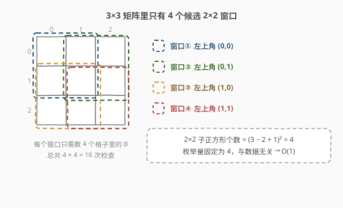
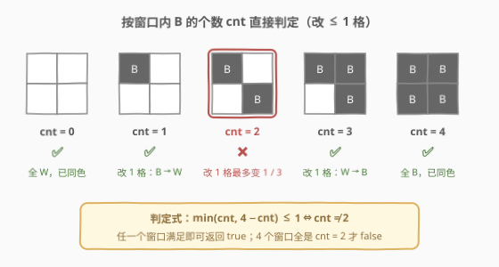
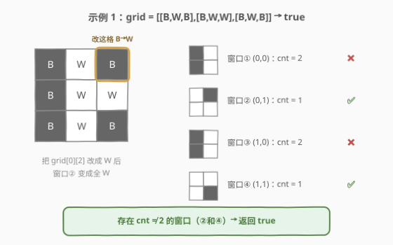

# 构造相同颜色的正方形

- **题目名称**：构造相同颜色的正方形
- **链接**：[3127. 构造相同颜色的正方形](https://leetcode.cn/problems/make-a-square-with-the-same-color/)
- **难度**：简单
- **标签**：数组，枚举，矩阵

## 1. 题目概述

给你一个二维 `3 x 3` 的矩阵 `grid`，每个格子要么是 `'B'`（黑色），要么是 `'W'`（白色）。

你的任务是改变**至多一个**格子的颜色，使得矩阵中存在一个 `2 x 2` 颜色完全相同的正方形。如果可以做到，返回 `true`，否则返回 `false`。

**示例 1**：

```text
输入：grid = [["B","W","B"],["B","W","W"],["B","W","B"]]
输出：true
解释：修改 grid[0][2] 的颜色（B → W），右下角方向的 2×2 窗口变成全 W。
```

**示例 2**：

```text
输入：grid = [["B","W","B"],["W","B","W"],["B","W","B"]]
输出：false
解释：棋盘格形态，每个 2×2 窗口恰好 2 黑 2 白，只改变一个格子无法满足要求。
```

**示例 3**：

```text
输入：grid = [["B","W","B"],["B","W","W"],["B","W","W"]]
输出：true
解释：grid 已经包含一个 2×2 颜色相同的正方形（右下角的全 W 窗口），一格都不用改。
```

**约束条件**：

- `grid.length == 3`
- `grid[i].length == 3`
- `grid[i][j]` 要么是 `'W'`，要么是 `'B'`

> 💡 读题关键：是「**至多**改一格」而非「恰好改一格」——已经存在同色 2×2 时直接返回 `true`（示例 3 就是专门考这个的）；「同色」可以是全 `B` 也可以是全 `W`，两个方向都要算。

---

## 2. 解题思路

### 2.1 暴力思路：枚举改哪一格，再全盘检查

枚举「不改」+「改 9 格中的某一格（两色选一）」共 $1 + 9 \times 2 = 19$ 种方案，每种方案扫一遍矩阵检查是否存在同色 2×2。$19 \times 4 \times 4$ 也就几百次操作，稳过。

但暴力把问题搞复杂了：改一格只影响包含它的那几个 2×2 窗口，**判定完全可以按窗口就地完成**，不需要真的去「改」。

### 2.2 核心观察：只有 4 个窗口，数 B 的个数即可判定



两个事实把问题压成纯枚举：

1. **窗口只有 4 个**：3×3 矩阵中 2×2 子正方形的左上角只能是 $(0,0),(0,1),(1,0),(1,1)$，共 $(3-2+1)^2 = 4$ 个，与数据无关。
2. **单窗口判定只看计数**：对一个 2×2 窗口，数其中 `'B'` 的个数 `cnt`（`'W'` 就是 $4 - cnt$）。把窗口变成同色需要改的格数是 $\min(cnt, 4 - cnt)$（少数派翻成多数派）。于是「改至多一格能救活这个窗口」当且仅当：

$$
\min(cnt, 4 - cnt) \le 1 \iff cnt \ne 2
$$

| `cnt`（B 的个数） | 形态 | 改 ≤ 1 格可行？ |
|---|---|---|
| 0 | 全 W | ✅ 已同色，改 0 格 |
| 1 | 1 B 3 W | ✅ 把唯一的 B 改成 W |
| 2 | 2 B 2 W | ❌ 改一格后 cnt 变 1 或 3，仍不同色 |
| 3 | 3 B 1 W | ✅ 把唯一的 W 改成 B |
| 4 | 全 B | ✅ 已同色，改 0 格 |



> ⚠️ `cnt = 2` 是唯一的失败形态：改一格最多让 `cnt` 变成 1 或 3，永远到不了 0 或 4。官方 hint 说的正是这一点。注意 `cnt = 2` 里「对角同色」和「邻边同色」没有区别——少数派有 2 格，改一格改不完。

所以答案就是：**4 个窗口里存在任意一个 `cnt ≠ 2` 即返回 `true`，否则 `false`**。

### 2.3 算法流程

1. 枚举 4 个窗口左上角 $(i, j) \in \{0,1\} \times \{0,1\}$；
2. 数窗口内 `'B'` 的个数 `cnt`；
3. 若 `cnt != 2`，立即返回 `true`（短路）；
4. 4 个窗口全部 `cnt == 2`，返回 `false`。

### 2.4 示例演算



以示例 1 `grid = [["B","W","B"],["B","W","W"],["B","W","B"]]` 为例：

| 窗口 | 内容 | `cnt` | 判定 |
|------|------|-------|------|
| ① (0,0) | B W / B W | 2 | ❌ 救不了 |
| ② (0,1) | W B / W W | 1 | ✅ 把 `grid[0][2]` 的 B 改成 W |
| ③ (1,0) | B W / B W | 2 | ❌ 救不了 |
| ④ (1,1) | W W / W B | 1 | ✅ 把 `grid[2][2]` 的 B 改成 W |

窗口② 和 ④ 都满足 `cnt ≠ 2`，返回 `true`——与官方解释「修改 `grid[0][2]`」一致（改④对应的 `grid[2][2]` 也行，答案不唯一）。

示例 2 的棋盘格 `B W B / W B W / B W B`：4 个窗口都是 2 B 2 W，全部 `cnt = 2`，返回 `false`。示例 3 右下角窗口全 W（`cnt = 0`），第一个分支就命中，返回 `true`。

---

## 3. 参考代码

### C++（枚举 4 窗口 + 计数判定）

```cpp
class Solution {
  public:
    bool canMakeSquare(vector<vector<char>>& grid) {
        for (int i = 0; i < 2; ++i) {
            for (int j = 0; j < 2; ++j) {
                int cnt = (grid[i][j] == 'B') + (grid[i][j + 1] == 'B')
                        + (grid[i + 1][j] == 'B') + (grid[i + 1][j + 1] == 'B');
                if (cnt != 2) return true;   // min(cnt, 4-cnt) <= 1
            }
        }
        return false;
    }
};
```

> 💡 布尔值参与算术求和是竞赛常见写法（`true` 即 1），注意 `==` 必须加括号——`+` 的优先级高于 `==`，漏了括号语义就全变了。

### Python（同款枚举）

```python
class Solution:
    def canMakeSquare(self, grid: List[List[str]]) -> bool:
        for i in range(2):
            for j in range(2):
                cnt = sum(grid[x][y] == 'B'
                          for x in (i, i + 1) for y in (j, j + 1))
                if cnt != 2:          # 少数派 <= 1 格，改得起
                    return True
        return False
```

---

## 4. 复杂度分析

| 维度 | 复杂度 | 说明 |
|------|--------|------|
| 时间复杂度 | $O(1)$ | 固定 4 个窗口 × 4 格 = 16 次检查，与输入内容无关 |
| 空间复杂度 | $O(1)$ | 只用到一个计数变量 |

> 💡 若矩阵泛化为 $n \times m$，窗口数为 $(n-1)(m-1)$，复杂度 $O(nm)$——仍是「枚举窗口 + 窗口内 $O(1)$ 判定」的同一副骨架。

---

## 5. 扩展：从「判定」到「最少改动次数」

把题面改成「返回让矩阵存在同色 2×2 的**最少**改格数」，同一副骨架只换聚合函数：

$$
\text{answer} = \min_{\text{4 个窗口}} \min(cnt, 4 - cnt)
$$

- 本题的 `true/false` 判定就是 `answer ≤ 1`；
- `answer = 0` ⇔ 已存在同色正方形（示例 3）；
- 棋盘格（示例 2）的 `answer = 2`，所以改一格不够。

再进一步，如果矩阵是 $n \times m$ 且要求**任意位置**的同色 2×2，「最少改动」版本仍是对全部 $(n-1)(m-1)$ 个窗口取 $\min(cnt, 4-cnt)$，$O(nm)$ 解决——局部计数、全局取极值，是这类「固定大小滑窗判定」题的通用手法。

---

## 6. 面试要点

1. **为什么 `cnt = 2` 时改一格一定不行？**

   - 改一格只能让 `cnt` 变化 ±1：2 → 1 或 3。同色要求 `cnt = 0` 或 4，一步到不了。等价地，少数派有 2 格而预算只有 1 格。

2. **为什么候选窗口只有 4 个？需要遍历整个矩阵吗？**

   - 2×2 正方形的左上角行、列都只能是 0 或 1，共 $(3-2+1)^2 = 4$ 个。不需要任何搜索，4 次定长枚举就穷尽了所有可能性。

3. **「已经存在同色正方形」需要特判吗？**

   - 不需要。已同色 ⇔ `cnt = 0` 或 4，天然落在 `cnt ≠ 2` 的分支里，改 0 格本来就满足「至多一格」。

4. **为什么不用真的去模拟「改颜色」？**

   - 改一格只影响含它的窗口，而判定每个窗口只需要它内部的颜色计数。直接对窗口计数是「离线判定」，避免了 19 种方案的枚举与矩阵拷贝，代码和思维都更短。

5. **如果颜色不止两种（比如 R/G/B）怎么办？**

   - 判定式从「数 B」升级为「数最多频色」：窗口内出现次数最多的颜色有 `mx` 个，则需要改 `4 − mx` 格，可行 ⇔ `4 − mx ≤ 1` ⇔ `mx ≥ 3`。两色版本只是 `mx = max(cnt, 4−cnt)` 的特例。

---

## 7. 同类练习题

- [840. 矩阵中的幻方](https://leetcode.cn/problems/magic-squares-in-grid/)：枚举所有 3×3 子矩阵逐个判定合法性，「固定大小窗口枚举 + 窗口内独立判定」的同款骨架
- [766. 托普利茨矩阵](https://leetcode.cn/problems/toeplitz-matrix/)：矩阵局部性质检查，每个元素只需和邻居比较，同样不需要全局搜索
- [1572. 矩阵对角线元素的和](https://leetcode.cn/problems/matrix-diagonal-sum/)：按位置规则枚举矩阵元素，下标边界处理练手题
- [2133. 检查是否每一行每一列都包含全部整数](https://leetcode.cn/problems/check-if-every-row-and-column-contains-all-numbers/)：矩阵逐行逐列计数判定，计数驱动的合法性检查
- [3128. 直角三角形](https://leetcode.cn/problems/right-triangles/)：同一场周赛的下一题，同样 3×3 起步的网格计数（行列 1 的个数组合计数）
