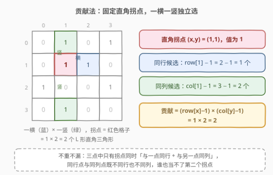
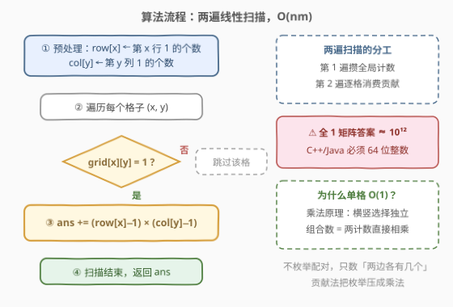
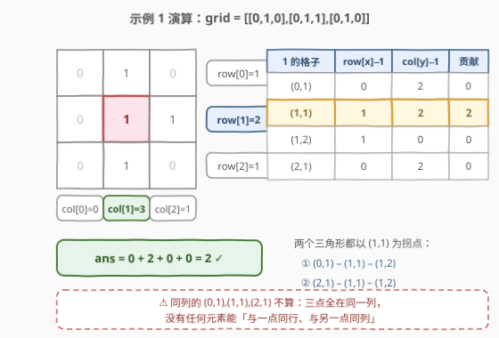

# LeetCode 直角三角形 题解

## 1. 题目概述

- **标题 / 题号**：直角三角形（#3128，medium）
- **链接**：https://leetcode.cn/problems/right-triangles/
- **难度**：中等
- **标签**：数组，数学，组合数学，计数

**题意**：给你一个二维 boolean 矩阵 `grid`。

如果 `grid` 的 3 个元素的集合中，一个元素与另一个元素在**同一行**，并且与第三个元素在**同一列**，则该集合是一个**直角三角形**。3 个元素**不必**彼此相邻。

请你返回使用 `grid` 中的 3 个元素可以构建的**直角三角形**数目，且满足 3 个元素值**都**为 1。

**示例 1**：

```text
输入：grid = [[0,1,0],[0,1,1],[0,1,0]]
输出：2
解释：有 2 个值为 1 的直角三角形：(0,1)-(1,1)-(1,2) 与 (1,1)-(1,2)-(2,1)，
     都以 (1,1) 为直角拐点。注意同一列的 (0,1),(1,1),(2,1) 不构成直角三角形
     ——3 个元素全在同一列，找不到「同行 + 同列」的拐点。
```

**示例 2**：

```text
输入：grid = [[1,0,0,0],[0,1,0,1],[1,0,0,0]]
输出：0
解释：每个 1 的两条腿总有一边「无人可选」——(0,0) 所在行只有它一个 1，
     (1,1)、(1,3) 所在列也只有它们自己，凑不出 L 形。
```

**示例 3**：

```text
输入：grid = [[1,0,1],[1,0,0],[1,0,0]]
输出：2
解释：两个三角形都以 (0,0) 为直角拐点：(0,0)-(0,2)-(1,0) 与 (0,0)-(0,2)-(2,0)。
```

**约束**：

- `1 <= grid.length <= 1000`
- `1 <= grid[i].length <= 1000`
- `0 <= grid[i][j] <= 1`

> 💡 读题关键：三点不必相邻，只要求值全为 1；「与一点同行 + 与另一点同列」的那个元素就是**直角拐点**。三点全同行或全同列都不算——没有任何元素能同时满足两个条件。

## 2. 解题思路

### 2.1 暴力思路：枚举配对，被数据规模卡死

最直接的想法是枚举：选一个值为 1 的格子 $(x,y)$ 当直角拐点，再枚举同行的另一个 1 和同列的第三个 1。设 1 的总数为 $k$（最多 $10^6$）：

- 枚举全部三元组：$\binom{k}{3} \approx 1.7 \times 10^{17}$，彻底爆炸；
- 枚举拐点 + 两侧配对：每个拐点要扫同行 $O(m)$ + 同列 $O(n)$，总量 $O(k \cdot (n+m)) \approx 2 \times 10^9$，同样超时。

瓶颈在哪？**我们在枚举「具体和谁配对」，但其实根本不关心人选——只关心两边各有几个候选**。

### 2.2 核心观察：贡献法——按直角拐点拆贡献



两个关键事实：

**事实一：直角拐点唯一，按拐点统计不重不漏。**

设三点 $A$（拐点）、$B$（与 $A$ 同行）、$C$（与 $A$ 同列）。若 $B$、$C$ 同行，则 $C$ 也在 $A$ 的行里，又要求 $C$ 与 $A$ 同列，只能 $C = A$，矛盾；同理 $B$、$C$ 不能同列。于是 $B$、$C$ 既不同行也不同列，**只有 $A$ 能同时「与一点同行、与另一点同列」**——每个合法三元组被且仅被它的拐点统计一次。

**事实二：两条腿的选择互相独立，乘法原理压成 $O(1)$。**

固定拐点 $(x,y)$（要求 $\text{grid}[x][y]=1$）后：

- 第二点从**同一行**的其它 1 中选，共 $\text{row}[x] - 1$ 个；
- 第三点从**同一列**的其它 1 中选，共 $\text{col}[y] - 1$ 个；
- 两个选择互不影响 → 该拐点贡献 $(\text{row}[x]-1) \times (\text{col}[y]-1)$ 个三角形。

$$
\text{answer} = \sum_{\substack{(x,y) \\ \text{grid}[x][y]=1}} (\text{row}[x]-1)\,(\text{col}[y]-1)
$$

> ⚠️ 两处细节：**减 1** 是把拐点自己从行/列候选中剔除（自己不能既当拐点又当腿）；**64 位**是防溢出——全 1 矩阵时答案达 $nm(n-1)(m-1) \approx 10^{12}$，32 位 `int` 必爆。官方 hint 给的正是这条贡献式。

### 2.3 算法流程



1. 第一遍扫描：统计每行 1 的个数 `row[x]`、每列 1 的个数 `col[y]`；
2. 第二遍扫描：遍历每个格子 $(x,y)$；
3. 若 `grid[x][y] == 1`，累加贡献 `(row[x] - 1) * (col[y] - 1)`；
4. 扫描结束返回 `ans`（64 位整数）。

### 2.4 示例演算



以示例 1 `grid = [[0,1,0],[0,1,1],[0,1,0]]` 为例。先数行和 $[1,2,1]$、列和 $[0,3,1]$，再逐格算贡献：

| 1 的格子 | $\text{row}[x]-1$ | $\text{col}[y]-1$ | 贡献 |
|---|---|---|---|
| (0,1) | $1-1=0$ | $3-1=2$ | $0 \times 2 = 0$ |
| **(1,1)** | $2-1=1$ | $3-1=2$ | $1 \times 2 = \mathbf{2}$ |
| (1,2) | $2-1=1$ | $1-1=0$ | $1 \times 0 = 0$ |
| (2,1) | $1-1=0$ | $3-1=2$ | $0 \times 2 = 0$ |

$\text{ans} = 0 + 2 + 0 + 0 = 2$ ✓。两个三角形都以 (1,1) 为拐点：$(0,1)\text{-}(1,1)\text{-}(1,2)$ 与 $(1,1)\text{-}(1,2)\text{-}(2,1)$，正是官方图示红框的两组；而同列的 $(0,1),(1,1),(2,1)$ 因三点全在同一列，一次都不会被数到。

示例 3 `[[1,0,1],[1,0,0],[1,0,0]]`：行和 $[2,1,1]$、列和 $[3,0,1]$，只有拐点 (0,0) 贡献 $(2-1)\times(3-1)=2$，其余全为 0，答案 2 ✓。

## 3. 参考代码

### C++（行列计数 + 逐格贡献）

```cpp
class Solution {
  public:
    long long numberOfRightTriangles(vector<vector<int>>& grid) {
        int n = grid.size(), m = grid[0].size();
        vector<long long> row(n), col(m);
        for (int i = 0; i < n; ++i)
            for (int j = 0; j < m; ++j)
                if (grid[i][j]) ++row[i], ++col[j];

        long long ans = 0;
        for (int i = 0; i < n; ++i)
            for (int j = 0; j < m; ++j)
                if (grid[i][j]) ans += (row[i] - 1) * (col[j] - 1);
        return ans;
    }
};
```

> 💡 `row`/`col` 声明为 `long long`：单个贡献最高约 $10^6$、总和约 $10^{12}$，若用 `int` 相乘会**先溢出再累加**，错得悄无声息。

### Python（zip 转置算列和）

```python
class Solution:
    def numberOfRightTriangles(self, grid: List[List[int]]) -> int:
        row = [sum(r) for r in grid]
        col = [sum(c) for c in zip(*grid)]

        return sum((row[i] - 1) * (col[j] - 1)
                   for i, r in enumerate(grid)
                   for j, v in enumerate(r) if v)
```

> 💡 `zip(*grid)` 一行完成矩阵转置，转置后逐行求和就是列和——比双重下标循环更「Python」。Python 整数天然大数，无溢出之忧。

## 4. 复杂度分析

| 维度 | 复杂度 | 说明 |
|------|--------|------|
| 时间复杂度 | $O(nm)$ | 两遍线性扫描：一遍攒行列计数，一遍逐格累加贡献 |
| 空间复杂度 | $O(n+m)$ | 行计数 `row[]` + 列计数 `col[]`，与格子总数无关 |

> 💡 复杂度的关键换来的是「组合数计算被乘法原理压成 $O(1)$」：把「枚举方案 $O(k \cdot (n+m))$」换成「枚举载体 $O(k)$ + 单点贡献 $O(1)$」，这正是贡献法压复杂度的通用姿势。

## 5. 扩展：省掉行数组的写法与对偶视角

**行和现场算，只留列和数组**：第二遍逐行扫描时，行内 1 的个数可以边扫边加，`row[]` 数组整个省掉，额外空间降到 $O(m)$：

```cpp
long long numberOfRightTriangles(vector<vector<int>>& grid) {
    int m = grid[0].size();
    vector<long long> col(m);
    for (auto& r : grid)
        for (int j = 0; j < m; ++j) col[j] += r[j];        // 只攒列和

    long long ans = 0;
    for (auto& r : grid) {
        long long cnt = accumulate(r.begin(), r.end(), 0LL);  // 行和现场算
        for (int j = 0; j < m; ++j)
            if (r[j]) ans += (cnt - 1) * (col[j] - 1);
    }
    return ans;
}
```

**对偶视角——按行重新分组**：把逐格贡献按行归并，也能写成

$$
\text{answer} = \sum_{x} (\text{row}[x]-1) \cdot \sum_{y:\,\text{grid}[x][y]=1} (\text{col}[y]-1)
$$

含义变成「第 $x$ 行的每个 1 先收拢同列候选数，再乘上行内自由度」——复杂度同为 $O(nm)$，本质只是换求和顺序，却展示了贡献法的灵活性：**载体选格子、选行、甚至选「同列点对」都可以，只要每个方案恰好被数一次**。

## 6. 面试要点

1. **为什么按直角拐点统计不会重复计数？**

   - 三点中，拐点 $A$ 与一点同行、与另一点同列；同行点 $B$ 与同列点 $C$ 既不同行也不同列（否则退化出 $B=A$ 或 $C=A$），无法互换角色。拐点唯一 ⇒ 每个三元组恰好被统计一次。

2. **公式里为什么要减 1？**

   - 拐点 $(x,y)$ 自己也是所在行、所在列里的一个 1。选「另一条腿」时必须排除自己，所以是 $\text{row}[x]-1$ 和 $\text{col}[y]-1$。

3. **答案为什么会溢出 32 位？上界怎么估？**

   - 全 1 矩阵时每个格子贡献 $(n-1)(m-1)$，共 $nm$ 个格子：$\text{ans} \le nm(n-1)(m-1) \approx 10^{12}$（$n=m=1000$），远超 `int32` 上限 $2.1 \times 10^9$。C++/Java 用 `long long`/`long`，Python 天然大数。

4. **贡献法和「枚举所有三角形再验证」差在哪？**

   - 枚举法以「方案」为载体，代价 $\binom{k}{3}$ 或 $k(n+m)$；贡献法以「载体元素」（这里是拐点）为对象，方案数由乘法原理分解成两个计数的乘积，单点 $O(1)$。本质是**换求和顺序**：先固定载体，再数它承载多少方案。

5. **三点全在同一行/列时为什么不贡献？需要特判吗？**

   - 不需要特判。贡献式枚举的是「拐点 + 横腿 + 竖腿」的 L 形：横腿与拐点不同列（排除自己后同行的 1 都在别的列）、竖腿与拐点不同行，所以数出来的三元组天然横跨 2 行 2 列；全同行/全同列的三点组在公式里根本不会被枚举到，贡献自然为 0。

## 同类练习题

| # | 题目 | 与本题的关联 |
|---|------|-------------|
| 2125 | [银行中的激光束数量](https://leetcode.cn/problems/number-of-laser-beams-in-a-bank/) | 同样「预处理每行 1 的个数再两两相乘求和」，把本题的行列换成相邻行，乘法原理计数近亲 |
| 1588 | [所有奇数长度子数组的和](https://leetcode.cn/problems/sum-of-all-odd-length-subarrays/) | 贡献法入门——不枚举子数组，按元素出现次数拆贡献 |
| 891 | [子序列宽度之和](https://leetcode.cn/problems/sum-of-subsequence-widths/) | 排序后按位置拆贡献（做最小/最大各多少次），贡献法 + 取模防溢出 |
| 1573 | [分割字符串的方案数](https://leetcode.cn/problems/number-of-ways-to-split-a-string/) | 按每类字符出现位置组合计数，乘法原理的又一变体 |
| 3127 | [构造相同颜色的正方形](https://leetcode.cn/problems/make-a-square-with-the-same-color/) | 同一场周赛（394）的上一题，网格上的小范围枚举判定 |
