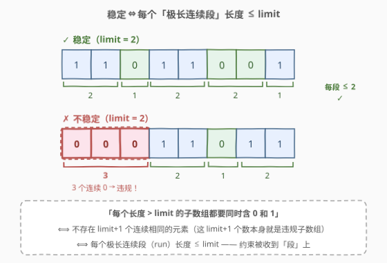
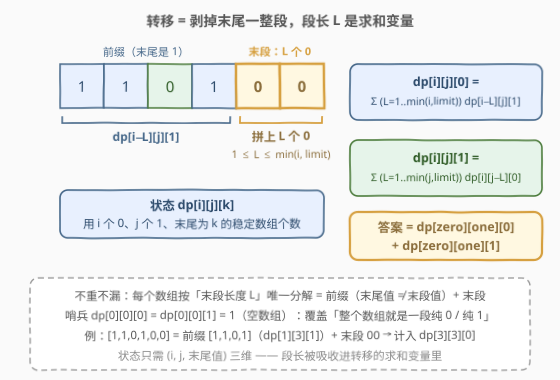
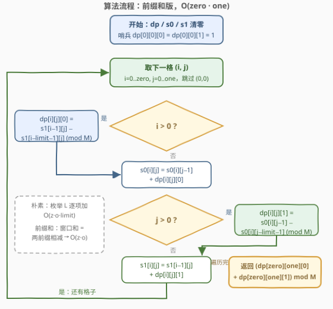
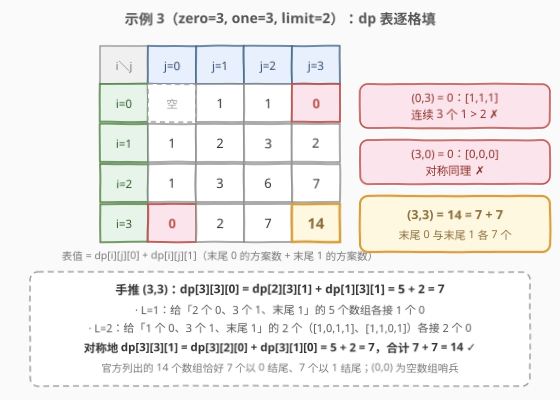

# LeetCode 找出所有稳定的二进制数组 I 题解

## 1. 题目概述

- **标题 / 题号**：找出所有稳定的二进制数组 I（#3129，medium）
- **链接**：https://leetcode.cn/problems/find-all-possible-stable-binary-arrays-i/
- **难度**：中等
- **标签**：动态规划，前缀和，计数

**题意**：给你 3 个正整数 `zero`、`one` 和 `limit`。

一个二进制数组 `arr` 如果满足以下条件，那么称它是 **稳定** 的：

- 0 在 `arr` 中出现次数 **恰好** 为 `zero`；
- 1 在 `arr` 中出现次数 **恰好** 为 `one`；
- `arr` 中每个长度超过 `limit` 的子数组都 **同时** 包含 0 和 1。

请你返回一个整数表示 **稳定** 二进制数组的 **总** 数目。由于答案可能很大，将它对 $10^9 + 7$ **取余**后返回。

**示例 1**：

```text
输入：zero = 1, one = 1, limit = 2
输出：2
解释：两个稳定的二进制数组为 [1,0] 和 [0,1]，都有一个 0 和一个 1，且没有子数组长度大于 2。
```

**示例 2**：

```text
输入：zero = 1, one = 2, limit = 1
输出：1
解释：唯一稳定的二进制数组是 [1,0,1]。
[1,1,0] 和 [0,1,1] 都有长度为 2 且元素全相同的子数组，所以不稳定。
```

**示例 3**：

```text
输入：zero = 3, one = 3, limit = 2
输出：14
解释：所有稳定数组包括 [0,0,1,0,1,1], [0,0,1,1,0,1], [0,1,0,0,1,1], [0,1,0,1,0,1], …,
     [1,1,0,0,1,0] 和 [1,1,0,1,0,0]，共 14 个。
```

**约束**：

- `1 <= zero, one, limit <= 200`

> 💡 读题关键：第三条约束说的是「任何长度为 $\text{limit}+1$ 及以上的窗口里必须两种值都有」。它等价于——**不存在 $\text{limit}+1$ 个连续相同的元素**，即每个「极长连续段」的长度都不超过 limit（见 2.2 的图）。

## 2. 解题思路

### 2.1 暴力思路：枚举摆放位置

zero + one 个位置里选 zero 个放 0，共 $\binom{zero+one}{zero}$ 种摆放；zero = one = 200 时约 $10^{119}$ 种，逐一验证完全不可行。

瓶颈在哪？一个摆放是否合法，只取决于**连续段的结构**——每段多长、0 段与 1 段如何交替。既然结构决定一切，就不该枚举具体摆放，而应**按结构直接计数**。

### 2.2 核心观察：连续段视角 + 按「末尾段」转移的计数 DP



**第一步：等价改写约束**。「每个长度超过 limit 的子数组都同时含 0 和 1」⟺「不存在 limit+1 个连续相同的元素」⟺「每个极长连续段（run）长度 $\le \text{limit}$」。于是合法数组 = 若干段 0 和段 1 交替排列、每段不超过 limit、0 的总数恰为 zero、1 的总数恰为 one。

**第二步：设计状态**。逐段拼数组，只需记住「已经用了多少个 0、多少个 1、当前末尾是 0 还是 1」：

$$dp[i][j][k] = \text{恰好用 } i \text{ 个 0、} j \text{ 个 1、末尾为 } k \text{ 的稳定数组个数}$$

**第三步：转移——「剥掉末尾一整段」**。



末尾为 0 的数组，最后一定以一段长为 $L$ 的连续 0 收尾（$1 \le L \le \min(i, \text{limit})$）；把这段剥掉，剩下的前缀要么为空、要么以 1 结尾：

$$dp[i][j][0] = \sum_{L=1}^{\min(i,\,\text{limit})} dp[i-L][j][1], \qquad dp[i][j][1] = \sum_{L=1}^{\min(j,\,\text{limit})} dp[i][j-L][0]$$

**哨兵**：$dp[0][0][0] = dp[0][0][1] = 1$（空数组）。它让「前缀为空」的转移有落脚点——比如整个数组就是开头一段纯 0（$i \le \text{limit}$）时，$dp[i][0][0]$ 由 $dp[0][0][1]$ 转移而来。由于约束 $zero, one \ge 1$，哨兵只作为转移源出现，永远不会成为答案状态，不会多算。

**不重不漏**：每个数组按「末段长度 $L$」的分解是唯一的（末段就是最后一个极长段），因此每个数组在转移式中恰好被累加一次。

答案：

$$\text{ans} = \big(dp[zero][one][0] + dp[zero][one][1]\big) \bmod (10^9+7)$$

### 2.3 算法流程：前缀和把「段长求和」压成 O(1)

按上式直接三重循环（枚举 $i$、$j$、$L$）是 $O(zero \cdot one \cdot limit) \approx 8 \times 10^6$，本题（limit ≤ 200）已经能过；但注意转移求和恰好是**固定列 $j$（或行 $i$）上、长度不超过 limit 的滑动窗口求和**——用前缀和「两数相减」即可 O(1) 完成，总复杂度降到 $O(zero \cdot one)$，这也是通过孪生题 3130（limit ≤ 1000）的钥匙：

$$s_1[i][j] = \sum_{t \le i} dp[t][j][1] \;\Rightarrow\; dp[i][j][0] = s_1[i-1][j] - s_1[i-\text{limit}-1][j]$$

$$s_0[i][j] = \sum_{t \le j} dp[i][t][0] \;\Rightarrow\; dp[i][j][1] = s_0[i][j-1] - s_0[i][j-\text{limit}-1]$$

（下标越界时取 0。）



1. 初始化：`dp`、`s0`、`s1` 清零，哨兵 `dp[0][0][0] = dp[0][0][1] = 1`；
2. 双层循环 `i = 0..zero`、`j = 0..one`（跳过 `(0,0)`）；
3. 若 `i > 0`：`dp[i][j][0] = s1[i-1][j] − s1[i-limit-1][j]`（模意义下）；
4. 更新行前缀和 `s0[i][j] = s0[i][j-1] + dp[i][j][0]`；
5. 若 `j > 0`：`dp[i][j][1] = s0[i][j-1] − s0[i][j-limit-1]`；
6. 更新列前缀和 `s1[i][j] = s1[i-1][j] + dp[i][j][1]`；
7. 返回 `(dp[zero][one][0] + dp[zero][one][1]) mod 1e9+7`。

> ⚠️ 取模后相减可能为负：C++ 要先 `+MOD` 再取模；Python 的 `%` 天然返回非负值。

### 2.4 示例演算



以示例 3（zero=3, one=3, limit=2）为例，表值为 $dp[i][j][0] + dp[i][j][1]$：

| i \ j | 0 | 1 | 2 | 3 |
|---|---|---|---|---|
| 0 | 空（哨兵） | 1 | 1 | 0 |
| 1 | 1 | 2 | 3 | 2 |
| 2 | 1 | 3 | 6 | 7 |
| 3 | 0 | 2 | 7 | **14** |

- $(0,3) = 0$：$[1,1,1]$ 连续 3 个 1 超过 limit=2；$(3,0)$ 对称同理；
- $(1,1) = 2$：$[0,1]$、$[1,0]$；
- 手推 $(3,3)$：$dp[3][3][0] = dp[2][3][1] + dp[1][3][1] = 5 + 2 = 7$——给「2 个 0、3 个 1、末尾 1」的 5 个数组各接 1 个 0（$L=1$），再给「1 个 0、3 个 1、末尾 1」的 2 个数组（$[1,0,1,1]$、$[1,1,0,1]$）各接 2 个 0（$L=2$）；对称地 $dp[3][3][1] = 7$。$7 + 7 = 14$ ✓——官方列出的 14 个数组恰好 7 个以 0 结尾、7 个以 1 结尾。

## 3. 参考代码

### C++（前缀和优化，O(zero·one)）

```cpp
class Solution {
  public:
    int numberOfStableArrays(int zero, int one, int limit) {
        constexpr long long MOD = 1'000'000'007;
        // dp[i][j][k]：恰好用 i 个 0、j 个 1、末尾为 k 的稳定数组个数
        vector<vector<array<long long, 2>>> dp(
            zero + 1, vector<array<long long, 2>>(one + 1, {0, 0}));
        // s1[i][j] = Σ_{t≤i} dp[t][j][1]（沿 i 方向的前缀和，服务 dp[..][0]）
        // s0[i][j] = Σ_{t≤j} dp[i][t][0]（沿 j 方向的前缀和，服务 dp[..][1]）
        vector<vector<long long>> s1(zero + 1, vector<long long>(one + 1, 0));
        vector<vector<long long>> s0(zero + 1, vector<long long>(one + 1, 0));

        dp[0][0] = {1, 1};  // 哨兵：空数组
        s0[0][0] = s1[0][0] = 1;
        for (int i = 0; i <= zero; ++i)
            for (int j = 0; j <= one; ++j) {
                if (i == 0 && j == 0) continue;
                if (i > 0) {  // 末尾拼一段长 L ∈ [1, min(i,limit)] 的 0：窗口 [i-limit, i-1]
                    long long lo = i - limit - 1 >= 0 ? s1[i - limit - 1][j] : 0;
                    dp[i][j][0] = ((s1[i - 1][j] - lo) % MOD + MOD) % MOD;
                }
                s0[i][j] = ((j > 0 ? s0[i][j - 1] : 0) + dp[i][j][0]) % MOD;
                if (j > 0) {  // 末尾拼一段长 L ∈ [1, min(j,limit)] 的 1：窗口 [j-limit, j-1]
                    long long lo = j - limit - 1 >= 0 ? s0[i][j - limit - 1] : 0;
                    dp[i][j][1] = ((s0[i][j - 1] - lo) % MOD + MOD) % MOD;
                }
                s1[i][j] = ((i > 0 ? s1[i - 1][j] : 0) + dp[i][j][1]) % MOD;
            }
        return (dp[zero][one][0] + dp[zero][one][1]) % MOD;
    }
};
```

> 💡 两处易错：下标 `i-limit-1`、`j-limit-1` 越界时要取 0（窗口触到边界）；模意义下前缀和相减可能为负，先 `+MOD` 再取模。

### Python

```python
class Solution:
    def numberOfStableArrays(self, zero: int, one: int, limit: int) -> int:
        MOD = 1_000_000_007
        # dp[i][j][k]：恰好用 i 个 0、j 个 1、末尾为 k 的稳定数组个数
        dp = [[[0, 0] for _ in range(one + 1)] for _ in range(zero + 1)]
        # s1 沿 i 攒 dp[t][j][1]，s0 沿 j 攒 dp[i][t][0]
        s1 = [[0] * (one + 1) for _ in range(zero + 1)]
        s0 = [[0] * (one + 1) for _ in range(zero + 1)]

        dp[0][0] = [1, 1]  # 哨兵：空数组
        s0[0][0] = s1[0][0] = 1
        for i in range(zero + 1):
            for j in range(one + 1):
                if i == 0 and j == 0:
                    continue
                if i:  # 末尾拼 L 个 0（1 ≤ L ≤ min(i, limit)）
                    lo = s1[i - limit - 1][j] if i - limit - 1 >= 0 else 0
                    dp[i][j][0] = (s1[i - 1][j] - lo) % MOD
                s0[i][j] = ((s0[i][j - 1] if j else 0) + dp[i][j][0]) % MOD
                if j:  # 末尾拼 L 个 1（1 ≤ L ≤ min(j, limit)）
                    lo = s0[i][j - limit - 1] if j - limit - 1 >= 0 else 0
                    dp[i][j][1] = (s0[i][j - 1] - lo) % MOD
                s1[i][j] = ((s1[i - 1][j] if i else 0) + dp[i][j][1]) % MOD
        return (dp[zero][one][0] + dp[zero][one][1]) % MOD
```

> 💡 Python 的 `%` 对负数也返回非负结果，相减后直接取模即可，不需要 `+MOD` 补偿。

## 4. 复杂度分析

| 维度 | 复杂度 | 说明 |
|------|--------|------|
| 时间复杂度 | $O(zero \cdot one)$ | 每格 $(i,j)$ 做 O(1) 次窗口和（两个前缀和查询相减） |
| 空间复杂度 | $O(zero \cdot one)$ | dp 表与两个前缀和数组 s0、s1 |

> 💡 若不做前缀和优化，朴素枚举段长 $L$ 是 $O(zero \cdot one \cdot limit) \approx 8 \times 10^6$，本题也能过——但面对 3130 的千级规模（$10^9$）就必须优化了。「先写对、再压复杂度」是计数 DP 的标准路径。

## 5. 扩展：孪生题 3130 与实现变体

**孪生题 3130（找出所有稳定的二进制数组 II）**：题面完全相同，约束放大为 $1 \le zero, one, limit \le 1000$。朴素三重循环 $O(zero \cdot one \cdot limit) = 10^9$ 必然超时，本文的前缀和写法 $O(zero \cdot one) = 10^6$ 直接通过——**同一份代码可交两题**。

**好写好记的朴素版**（只适合 3129）：不维护前缀和，直接枚举段长：

```cpp
for (int i = 0; i <= zero; ++i)
    for (int j = 0; j <= one; ++j) {
        if (i == 0 && j == 0) continue;
        for (int L = 1; L <= min(i, limit); ++L)          // 末段是 L 个 0
            dp[i][j][0] = (dp[i][j][0] + dp[i - L][j][1]) % MOD;
        for (int L = 1; L <= min(j, limit); ++L)          // 末段是 L 个 1
            dp[i][j][1] = (dp[i][j][1] + dp[i][j - L][0]) % MOD;
    }
```

**空间优化**：`dp[i][j][0]` 依赖列方向的历史（`s1[i-limit-1][j]`），不能简单压成一行；但可以只保留最近 `limit+1` 行的 `dp[·][·][1]`，或改用等价递推 $dp[i][j][0] = dp[i-1][j][0] + dp[i-1][j][1] - dp[i-\text{limit}-1][j][1]$ 配合环形数组。千级规模下 $O(zero \cdot one)$ 内存（约 $2 \times 10^6$ 个 int ≈ 8 MB）完全可接受，面试口头说明即可。

## 6. 面试要点

1. **「每个长度超过 limit 的子数组都同时含 0 和 1」如何等价转化？**

   - ⟺ 不存在 limit+1 个连续相同的元素 ⟺ 每个极长连续段 ≤ limit。若有 limit+1 个连续相同元素，它们自己就构成只含一种值的违规子数组；反之若所有段 ≤ limit，任何长度 > limit 的子数组必跨过至少一个段边界，从而含两种值。

2. **为什么状态不需要记录「末尾连续段已经堆了多长」？**

   - 转移按「整段」拼接：段长 L 是转移式里的求和变量，不是状态维度。若改成逐元素拼接（每次只追加 1 个），才需要第四维记录当前末段长度（官方 hint 的 `dp[a][b][c][d]` 即此思路，状态更多但单个转移更简单）。

3. **哨兵 dp[0][0][0] = dp[0][0][1] = 1 是干嘛的？会不会把答案算多？**

   - 表示空数组，让「前缀为空」的转移有落脚点，覆盖整个数组只有一段纯 0 或纯 1 的情形。由于约束 zero、one ≥ 1，答案取的是 dp[zero][one][·]，哨兵只作为转移源出现、不会被重复计入。

4. **前缀和优化是怎么想到的？实现时最容易错什么？**

   - 转移是对固定列（或行）上长度 ≤ limit 的滑动窗口求和 → 窗口和 = 两个前缀和之减。易错点：一是窗口左端越界（`i-limit-1 < 0` 时取 0）；二是模意义下相减为负（C++ 先 +MOD 再取模，Python 无此烦恼）。

5. **与 3130 的关系是什么？**

   - 同一题面、约束放大 5 倍；朴素 $O(z \cdot o \cdot limit) \approx 10^9$ 超时，前缀和 $O(z \cdot o)$ 轻松通过。先写出正确的朴素 DP，再识别「滑动窗口求和」这一模式做优化，是计数 DP 的通用套路。

## 同类练习题

| # | 题目 | 与本题的关联 |
|---|------|-------------|
| 3130 | [找出所有稳定的二进制数组 II](https://leetcode.cn/problems/find-all-possible-stable-binary-arrays-ii/) | 孪生题，约束放大到 1000，前缀和优化从「可选」变「必选」 |
| 790 | [多米诺和托米诺平铺](https://leetcode.cn/problems/domino-and-tromino-tiling/) | 按「末尾状态」设计计数 DP + 取模的经典 |
| 940 | [不同的子序列 II](https://leetcode.cn/problems/distinct-subsequences-ii/) | 状态 =「以哪个字符结尾」，与本题「末尾是 0/1」同款思路 |
| 935 | [骑士拨号器](https://leetcode.cn/problems/knight-dialer/) | 计数型 DP + $10^9+7$ 取模的入门样板 |
| 974 | [和可被 K 整除的子数组](https://leetcode.cn/problems/subarray-sums-divisible-by-k/) | 前缀和把「区间计数」化成「两点之差」的另一种形态 |
