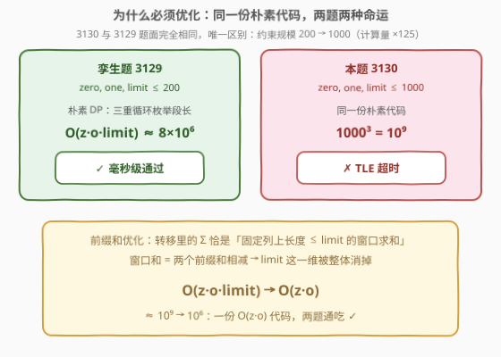
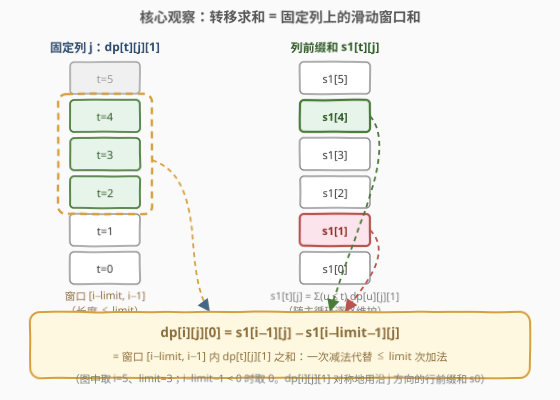
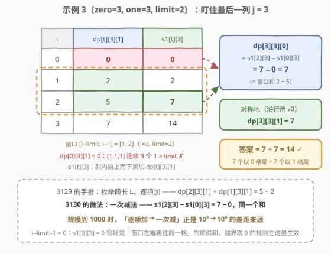

# LeetCode 找出所有稳定的二进制数组 II 题解

## 1. 题目概述

- **标题 / 题号**：找出所有稳定的二进制数组 II（#3130，hard）
- **链接**：https://leetcode.cn/problems/find-all-possible-stable-binary-arrays-ii/
- **难度**：困难
- **标签**：动态规划，前缀和，计数

**题意**：给你 3 个正整数 `zero`、`one` 和 `limit`。

一个二进制数组 `arr` 如果满足以下条件，那么称它是 **稳定** 的：

- 0 在 `arr` 中出现次数 **恰好** 为 `zero`；
- 1 在 `arr` 中出现次数 **恰好** 为 `one`；
- `arr` 中每个长度超过 `limit` 的子数组都 **同时** 包含 0 和 1。

请你返回一个整数表示 **稳定** 二进制数组的 **总** 数目。由于答案可能很大，将它对 $10^9 + 7$ **取余**后返回。

**示例 1**：

```text
输入：zero = 1, one = 1, limit = 2
输出：2
解释：两个稳定的二进制数组为 [1,0] 和 [0,1]，都有一个 0 和一个 1，且没有子数组长度大于 2。
```

**示例 2**：

```text
输入：zero = 1, one = 2, limit = 1
输出：1
解释：唯一稳定的二进制数组是 [1,0,1]。
[1,1,0] 和 [0,1,1] 都有长度为 2 且元素全相同的子数组，所以不稳定。
```

**示例 3**：

```text
输入：zero = 3, one = 3, limit = 2
输出：14
解释：所有稳定数组包括 [0,0,1,0,1,1], [0,0,1,1,0,1], [0,1,0,0,1,1], [0,1,0,1,0,1], …,
     [1,1,0,0,1,0] 和 [1,1,0,1,0,0]，共 14 个。
```

**约束**：

- `1 <= zero, one, limit <= 1000`

> 💡 读题关键：本题与 [3129. 找出所有稳定的二进制数组 I](https://leetcode.cn/problems/find-all-possible-stable-binary-arrays-i/) **题面完全相同**，唯一区别是约束从 200 放大到 1000。第三条约束等价于「不存在 limit+1 个连续相同的元素」，即**每个极长连续段长度 $\le \text{limit}$**（推导见 3129 题解）。规模放大让朴素 $O(zero \cdot one \cdot limit)$ 从「能过」变成「必超时」——**前缀和优化是本题的必经之路**。

## 2. 解题思路

### 2.1 暴力思路：朴素计数 DP 及其极限

沿用 3129 的推导：合法数组 = 若干段 0 和段 1 交替、每段不超过 limit、0 与 1 的总数恰好用完。设计状态：

$$dp[i][j][k] = \text{恰好用 } i \text{ 个 0、} j \text{ 个 1、末尾为 } k \text{ 的稳定数组个数}$$

转移按「**剥掉末尾一整段**」：末尾为 0 的数组以一段长 $L$ 的连续 0 收尾（$1 \le L \le \min(i, \text{limit})$），剥掉后剩下的前缀以 1 结尾（或为空，由哨兵 $dp[0][0][0] = dp[0][0][1] = 1$ 兜底）：

$$dp[i][j][0] = \sum_{L=1}^{\min(i,\,\text{limit})} dp[i-L][j][1], \qquad dp[i][j][1] = \sum_{L=1}^{\min(j,\,\text{limit})} dp[i][j-L][0]$$

（完整推导与不重不漏论证见 3129 题解，此处不重复。）

直接枚举段长 $L$ 是三重循环 $O(zero \cdot one \cdot limit)$——**同样的代码，两题两种命运**：

| 规模 | 计算量 | 命运 |
|------|--------|------|
| 3129（$\le 200$） | $200^3 \approx 8 \times 10^6$ | ✓ 毫秒级通过 |
| 3130（$\le 1000$） | $1000^3 = 10^9$ | ✗ TLE（C++ 数秒，Python 更久） |



瓶颈的本质：**内层循环是对固定列（或固定行）上、长度不超过 limit 的一段连续下标求和**——这正是「滑动窗口和」的标准形态，有现成的加速手段。

### 2.2 核心观察：窗口和 = 两个前缀和之差



定义两个方向的**前缀和**（随主循环逐格同步维护，每格 O(1)）：

$$s_1[i][j] = \sum_{t \le i} dp[t][j][1] \;(\text{沿 } i \text{ 方向})， \qquad s_0[i][j] = \sum_{t \le j} dp[i][t][0] \;(\text{沿 } j \text{ 方向})$$

于是两段转移求和都坍缩成**一次减法**：

$$dp[i][j][0] = s_1[i-1][j] - s_1[i-\text{limit}-1][j], \qquad dp[i][j][1] = s_0[i][j-1] - s_0[i][j-\text{limit}-1]$$

（下标 $< 0$ 时该项取 0。）内层 limit 维被整体消掉，每格转移 O(1)，总复杂度 $O(zero \cdot one) \approx 10^6$。

> ⚠️ 两个易错点：一是**窗口左端越界**（$i-\text{limit}-1 < 0$ 时取 0）；二是**模意义下前缀和相减可能为负**——C++ 要先 `+MOD` 再取模，Python 的 `%` 天然返回非负值。

> 💡 **维护顺序为何天然正确**：$dp[i][j][0]$ 读的是「上一行及更早」的 $s_1$（早已算好）；$dp[i][j][1]$ 读的是「本行左侧」的 $s_0$（本格第②步刚更新）。按 ①→②→③→④ 的流水线走，「先查后更」，读写永远错开。

### 2.3 算法流程


1. 初始化：`dp`、`s0`、`s1` 清零，哨兵 `dp[0][0][0] = dp[0][0][1] = 1`（空数组），`s0[0][0] = s1[0][0] = 1`；
2. 双层循环 `i = 0..zero`、`j = 0..one`（跳过 `(0,0)`），每格依次：
3. **①** 若 `i > 0`：`dp[i][j][0] = s1[i−1][j] − s1[i−limit−1][j]`（模意义下）；
4. **②** 更新行前缀和 `s0[i][j] = s0[i][j−1] + dp[i][j][0]`；
5. **③** 若 `j > 0`：`dp[i][j][1] = s0[i][j−1] − s0[i][j−limit−1]`；
6. **④** 更新列前缀和 `s1[i][j] = s1[i−1][j] + dp[i][j][1]`；
7. 遍历完返回 `(dp[zero][one][0] + dp[zero][one][1]) mod 1e9+7`。

### 2.4 示例演算



以示例 3（zero=3, one=3, limit=2）盯住最后一列 $j=3$：「$t$ 个 0、3 个 1、末尾 1」的 $dp[t][3][1]$ 依次为 $0, 2, 5, 7$（$t=0$ 时 $[1,1,1]$ 连续 3 个 1 超限故为 0），列前缀和 $s_1[t][3] = 0, 2, 7, 14$。于是：

$$dp[3][3][0] = s_1[2][3] - s_1[3-2-1][3] = 7 - 0 = 7$$

——正是窗口 $[1,2]$ 上的 $dp[1][3][1] + dp[2][3][1] = 2 + 5$。3129 的手推是「枚举 $L$ 逐项加 $5+2$」，前缀和用**一次减法 $7-0$** 得到同一个和；对称地 $dp[3][3][1] = 7$，答案 $7 + 7 = 14$ ✓。

规模放大到 1000 时，正是这一步「逐项加 → 一次减」的替换，把总计算量从 $10^9$ 压到 $10^6$。

## 3. 参考代码

### C++（前缀和优化，O(zero·one)，同一份代码可直接交 3129）

```cpp
class Solution {
  public:
    int numberOfStableArrays(int zero, int one, int limit) {
        constexpr int MOD = 1'000'000'007;
        // dp[i][j][k]：恰好用 i 个 0、j 个 1、末尾为 k 的稳定数组个数
        vector<vector<array<int, 2>>> dp(
            zero + 1, vector<array<int, 2>>(one + 1, {0, 0}));
        // s1 沿 i 攒 dp[t][j][1]，服务 dp[..][0]；s0 沿 j 攒 dp[i][t][0]，服务 dp[..][1]
        vector<vector<int>> s1(zero + 1, vector<int>(one + 1, 0));
        vector<vector<int>> s0(zero + 1, vector<int>(one + 1, 0));

        dp[0][0] = {1, 1};  // 哨兵：空数组
        s0[0][0] = s1[0][0] = 1;
        for (int i = 0; i <= zero; ++i)
            for (int j = 0; j <= one; ++j) {
                if (i == 0 && j == 0) continue;
                if (i > 0) {  // 末段是 L ∈ [1, min(i,limit)] 个 0：窗口 [i-limit, i-1] 上 dp[t][j][1] 之和
                    int lo = i - limit - 1 >= 0 ? s1[i - limit - 1][j] : 0;
                    dp[i][j][0] = (s1[i - 1][j] - lo + MOD) % MOD;
                }
                s0[i][j] = ((j > 0 ? s0[i][j - 1] : 0) + dp[i][j][0]) % MOD;
                if (j > 0) {  // 末段是 L ∈ [1, min(j,limit)] 个 1：窗口 [j-limit, j-1] 上 dp[i][t][0] 之和
                    int lo = j - limit - 1 >= 0 ? s0[i][j - limit - 1] : 0;
                    dp[i][j][1] = (s0[i][j - 1] - lo + MOD) % MOD;
                }
                s1[i][j] = ((i > 0 ? s1[i - 1][j] : 0) + dp[i][j][1]) % MOD;
            }
        return (dp[zero][one][0] + dp[zero][one][1]) % MOD;
    }
};
```

> 💡 取模后每格值 $< 10^9 + 7 < 2^{31}$，dp / s0 / s1 都能用 `int` 存（共约 16 MB）；两个 `< MOD` 的数相减再 `+MOD` 落在 `(0, 2×MOD)` 内，不会溢出。

### Python

```python
class Solution:
    def numberOfStableArrays(self, zero: int, one: int, limit: int) -> int:
        MOD = 1_000_000_007
        # dp[i][j][k]：恰好用 i 个 0、j 个 1、末尾为 k 的稳定数组个数
        dp = [[[0, 0] for _ in range(one + 1)] for _ in range(zero + 1)]
        s1 = [[0] * (one + 1) for _ in range(zero + 1)]  # 沿 i 攒 dp[t][j][1]
        s0 = [[0] * (one + 1) for _ in range(zero + 1)]  # 沿 j 攒 dp[i][t][0]

        dp[0][0] = [1, 1]  # 哨兵：空数组
        s0[0][0] = s1[0][0] = 1
        for i in range(zero + 1):
            for j in range(one + 1):
                if i == 0 and j == 0:
                    continue
                if i:  # 末段拼 L 个 0（1 ≤ L ≤ min(i, limit)）
                    lo = s1[i - limit - 1][j] if i - limit - 1 >= 0 else 0
                    dp[i][j][0] = (s1[i - 1][j] - lo) % MOD
                s0[i][j] = ((s0[i][j - 1] if j else 0) + dp[i][j][0]) % MOD
                if j:  # 末段拼 L 个 1（1 ≤ L ≤ min(j, limit)）
                    lo = s0[i][j - limit - 1] if j - limit - 1 >= 0 else 0
                    dp[i][j][1] = (s0[i][j - 1] - lo) % MOD
                s1[i][j] = ((s1[i - 1][j] if i else 0) + dp[i][j][1]) % MOD
        return (dp[zero][one][0] + dp[zero][one][1]) % MOD
```

> 💡 Python 的 `%` 对负数也返回非负结果，相减后直接取模即可。实测 `(1000, 1000, 1000)` 约 1 秒得到答案 `72475738`。

## 4. 复杂度分析

| 维度 | 复杂度 | 说明 |
|------|--------|------|
| 时间复杂度 | $O(zero \cdot one)$ | 每格 $(i,j)$ 做两次「前缀和相减」的 O(1) 转移，共约 $10^6$ 格 |
| 空间复杂度 | $O(zero \cdot one)$ | dp 表与两个前缀和数组 s0、s1（int 存储约 16 MB） |

> 💡 从 $O(z \cdot o \cdot limit)$ 到 $O(z \cdot o)$ 的本质：内层求和的**求和区间随下标平移**（窗口滑动），相邻窗口只差「进一项、出一项」，所以区间和能被两个前缀和之差 O(1) 表达。**「先写对朴素 DP，再识别窗口和模式做优化」**是计数 DP 的通用套路——3129 正是本题的「写对」阶段。

## 5. 扩展：三个进阶话题

**① 相邻窗口差分：少维护一张表。** 窗口 $[i-\text{limit}, i-1]$ 与上一格的窗口 $[i-1-\text{limit}, i-2]$ 只差「进一个、出一个」，两式相减可把前缀和表彻底消掉，得到**只用 dp 自身的递推**：

$$dp[i][j][0] = dp[i-1][j][0] + dp[i-1][j][1] - dp[i-\text{limit}-1][j][1] \quad (i \ge 2)$$

边界要小心：$i = 1$ 时直接取 $dp[1][j][0] = dp[0][j][1]$；减数下标 $\ge 0$ 时才取（哨兵 $dp[0][0][\cdot]$ 会合法地作为减数出现），$< 0$ 取 0。$j$ 方向对称。它与前缀和版完全等价（把「两个前缀相减」再用一次「相邻相减」展开而已），少一张表但边界更琐碎。

**② 空间压缩。** $s_0$ 是**行内**前缀和，压成一维数组（每行复用）即可；$s_1$ 是**列向**前缀和，理论只需保留最近 $\text{limit}+1$ 行（环形缓冲）。但本题 limit 本身可达 1000，最坏退化为全表——千级规模 16 MB 完全可接受，面试口头说明即可。

**③ 组合数学：容斥直接算封闭形式。** 换个视角：合法数组 = $a$ 个 0 段与 $b$ 个 1 段交替（$|a-b| \le 1$，$a, b \ge 1$），每段长 $\in [1, \text{limit}]$。记 $g(n,k)$ 为「把 $n$ 拆成 $k$ 个 $\in [1, \text{limit}]$ 的有序段」的方案数，容斥给出：

$$g(n,k) = \sum_{j \ge 0} (-1)^j \binom{k}{j} \binom{n - j \cdot \text{limit} - 1}{k - 1}$$

答案 $= \sum_{|a - b| \le 1} c(a,b) \cdot g(zero, a) \cdot g(one, b)$，其中 $c(a,b) = 2$（$a = b$，两种开头）或 $1$（$|a-b| = 1$）。预处理阶乘后空间仅 $O(zero + one)$、无需 dp 大表；枚举段数对共 $O(\min(zero, one))$ 组、总计算量与 DP 同阶。它更多是「换视角」的价值——可用于交叉验证答案，也展示计数问题的另一条路。

## 6. 面试要点

1. **本题与 3129 的区别是什么？为什么必须换解法？**

   - 题面完全相同，约束 $200 \to 1000$，计算量 $\times 125$（$8\times10^6 \to 10^9$）：朴素三重循环超时，前缀和版 $O(z \cdot o)$ 两题通吃。回答时先讲朴素 DP（展示能写对），再主动指出瓶颈是窗口求和并给出优化——这是完整的「先写对再优化」叙事。

2. **前缀和优化是怎么识别出来的？什么场景适用？**

   - 转移式中出现「对一段**下标连续、长度固定**的区间求和」且区间随外层下标**平移**（滑动窗口），区间和就能写成两个前缀和之差。本题内层枚举段长 $L$，求和区间 $[i-\text{limit}, i-1]$ 随 $i$ 平移，恰好命中该模式。

3. **取模后相减为什么可能出负数？怎么处理？**

   - 各前缀和分别取过模，大小关系不再保持，「小减大」可能为负。C++ 写 `(a - b % MOD + MOD) % MOD`；Python 的 `%` 天然返回非负值可直接减。另外窗口左端 $i-\text{limit}-1 < 0$ 时该项取 0。

4. **每格 ①②③④ 的执行顺序为什么重要？**

   - ① 读「上一行及更早」的 $s_1$（早已就绪）；② 把 $dp[i][j][0]$ 计入行前缀 $s_0$，为 ③ 备好窗口右端；③ 读「本行左侧」的 $s_0$；④ 把 $dp[i][j][1]$ 计入列前缀 $s_1$，为下一行的 ① 备好。「先查后更」保证任何 dp 值都不会通过前缀和混进自己的转移（自引用）。

5. **还有别的做法或进一步优化吗？**

   - 相邻窗口差分递推可省掉一张前缀和表（$dp[i][j][0] = dp[i-1][j][0] + dp[i-1][j][1] - dp[i-\text{limit}-1][j][1]$，注意 $i=1$ 与下标越界两个边界）；组合数学容斥（按段数拆分 + 有界合拆计数）可做到 $O(z+o)$ 空间无大表；空间上 $s_0$ 可压一维、$s_1$ 可用环形缓冲只留 $\text{limit}+1$ 行，但 limit 大时收益有限。

## 同类练习题

| # | 题目 | 与本题的关联 |
|---|------|-------------|
| 3129 | [找出所有稳定的二进制数组 I](https://leetcode.cn/problems/find-all-possible-stable-binary-arrays-i/) | 孪生题（本题缩小版），朴素 $O(z \cdot o \cdot limit)$ 也能过，适合先写对再优化 |
| 2466 | [统计构造好字符串的方案数](https://leetcode.cn/problems/count-ways-to-build-good-strings/) | 「追加 0 / 追加 1」构造串上的计数 + 取模，与本题同族的线性计数 DP |
| 790 | [多米诺和托米诺平铺](https://leetcode.cn/problems/domino-and-tromino-tiling/) | 按「末尾状态」设计计数 DP + 取模的经典 |
| 2222 | [选择建筑的方案数](https://leetcode.cn/problems/number-of-ways-to-select-buildings/) | 二进制串上按「前缀统计」计数，前缀和思想的另一种形态 |
| 940 | [不同的子序列 II](https://leetcode.cn/problems/distinct-subsequences-ii/) | 状态 =「以哪个字符结尾」，与本题「末尾是 0/1」同款思路 |
