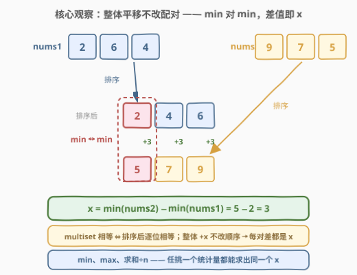
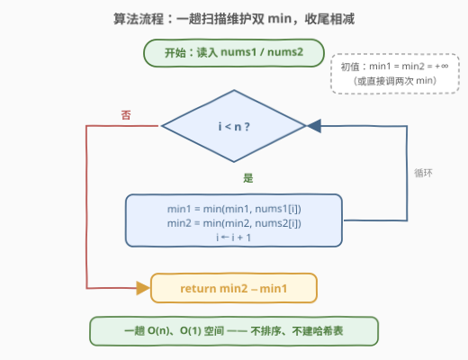
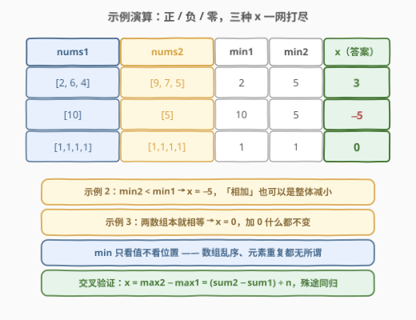

# 找出与数组相加的整数 I

- **题目名称**：找出与数组相加的整数 I
- **链接**：[3131. 找出与数组相加的整数 I](https://leetcode.cn/problems/find-the-integer-added-to-array-i/)
- **难度**：简单
- **标签**：数组、排序、数学

## 1. 题目概述

给你两个长度相等的数组 `nums1` 和 `nums2`。

将 `nums1` 中**每个**元素都与整数 `x` 相加（若 `x` 为负数，则表现为元素值的减少）。相加之后，`nums1` 与 `nums2` **相等**——当两个数组中包含相同的整数，并且这些整数出现的频次相同时，两个数组相等（与顺序无关）。

返回整数 `x`。

**示例 1**：

```text
输入：nums1 = [2,6,4], nums2 = [9,7,5]
输出：3
解释：与 3 相加后，nums1 和 nums2 相等。
```

**示例 2**：

```text
输入：nums1 = [10], nums2 = [5]
输出：-5
解释：与 -5 相加后，nums1 和 nums2 相等。
```

**示例 3**：

```text
输入：nums1 = [1,1,1,1], nums2 = [1,1,1,1]
输出：0
解释：与 0 相加后，nums1 和 nums2 相等。
```

**约束条件**：

- $1 \le n \le 100$，$n$ 为数组长度（两数组等长）
- $0 \le \text{nums}_1[i], \text{nums}_2[i] \le 1000$
- 测试用例保证存在这样的整数 $x$

> 💡 读题关键有三处：其一，「相等」是 **multiset 相等**（元素 + 频次相同，顺序无关），所以别按下标硬对；其二，加的是**同一个** $x$，这是「整体平移」而非各自变换；其三，$x$ 是**唯一**的——$\min(\text{nums}_1) + x = \min(\text{nums}_2)$ 只有一个解。$n \le 100$ 意味着排序、哈希、枚举值域全都稳过，本题真正想练的是「平移不变性 → 统计量配对」这一步观察。

---

## 2. 解题思路

### 2.1 朴素思路：排序后逐位对齐

最贴合直觉的做法：把两个数组**各自排序**，则合法的 $x$ 必然满足

$$\text{sorted}(\text{nums}_2)[k] - \text{sorted}(\text{nums}_1)[k] = x, \quad \forall\, k$$

排序后逐位相减，每一位的差都应该相同，任取一位即得答案。$O(n \log n)$，代码十行以内。

更「憨」的暴力是枚举值域：$x \in [-1000, 1000]$ 共 2001 个候选，对每个候选用计数数组逐桶检查 $\text{multiset}(\text{nums}_1 + x)$ 与 $\text{nums}_2$ 是否相等（每个候选 $O(V)$，总量 $O(V^2)$ 约 $10^6$）——照样秒过，只是把「必须逐位检查」当成了默认前提，而这恰恰是可以砍掉的。

> ⚠️ 枚举值域的默认前提是「不知道 $x$ 长什么样，只能挨个试」。但排序版已经透露了天机：**所有位置上的差都是同一个 $x$**。既然看任意一位都行，那看**最小的一位**就够了。

### 2.2 核心观察：平移不改排序配对 —— min 对 min



三条事实串成一条链：

1. **multiset 相等 ⇔ 排序后逐位相等**——顺序信息本来就不重要，排序后两个数组必须逐位对上；
2. **全体元素加同一个 $x$ 是「整体平移」**，不改变任意两个元素之间的大小关系 ⇒ 排序后 $\text{nums}_1$ 的第 $k$ 小与 $\text{nums}_2$ 的第 $k$ 小配对，且每一对的差都等于 $x$；
3. 取 $k = 1$（最小值）：$\min(\text{nums}_1) + x = \min(\text{nums}_2)$，即

$$x = \min(\text{nums}_2) - \min(\text{nums}_1)$$

如概念图所示：$\text{sorted}(\text{nums}_1) = [2,4,6]$ 与 $\text{sorted}(\text{nums}_2) = [5,7,9]$ 三对配对的差全是 $3$——**随便挑一对**都能得到答案，min 只是其中最省事的一对：一趟扫描、无需排序、无需额外空间。顺带地，这条链也证明了 $x$ 的唯一性。

> 💡 **求和视角**：每个元素的差都是 $x$，把这 $n$ 个差加起来：$\sum \text{nums}_2 - \sum \text{nums}_1 = n \cdot x$，于是 $x = (\sum \text{nums}_2 - \sum \text{nums}_1) / n$。min 版与 sum 版是同一个观察的两个投影——「用**全局统计量**替代逐位比较」。

### 2.3 算法流程图



流程只有三步：

1. 初始化 `min1 = min2 = +∞`；
2. 一趟循环 `i = 0 … n−1`：`min1 = min(min1, nums1[i])`，`min2 = min(min2, nums2[i])`；
3. 返回 `min2 - min1`。

不排序、不建哈希、不开计数数组——两个标量走天下。

### 2.4 示例演算



| 示例 | $\min(\text{nums}_1)$ | $\min(\text{nums}_2)$ | $x = \min_2 - \min_1$ | 踩点 |
|------|:---:|:---:|:---:|------|
| 1：`[2,6,4]` / `[9,7,5]` | 2 | 5 | **3** | 正数：整体抬高 |
| 2：`[10]` / `[5]` | 10 | 5 | **−5** | 负数：整体压低 |
| 3：`[1,1,1,1]` / `[1,1,1,1]` | 1 | 1 | **0** | 零：本就相等 |

三个示例恰好踩满 $x$ 的三种符号：谁的最小值更小，$x$ 就往哪边偏；两数组本就相等时 $x = 0$。全程不需要关心数组内部的顺序与重复。

---

## 3. 参考代码

### C++

```cpp
class Solution {
  public:
    int addedInteger(vector<int>& nums1, vector<int>& nums2) {
        int min1 = *min_element(nums1.begin(), nums1.end());
        int min2 = *min_element(nums2.begin(), nums2.end());
        return min2 - min1;   // min 对 min，差值即 x
    }
};
```

### Python

```python
class Solution:
    def addedInteger(self, nums1: List[int], nums2: List[int]) -> int:
        return min(nums2) - min(nums1)
```

> 💡 写法盘点：
> - **一趟双 min**：按流程图手写一个循环同时维护 `min1`、`min2`，只扫一遍；直接调两次 `min_element` / `min` 扫两遍，同为 $O(n)$，胜在代码更短。
> - **排序版**：`sorted(nums2)[0] - sorted(nums1)[0]`，$O(n \log n)$。看似多此一举，但如果题目改成「**不保证存在合法 $x$**」，排序后逐位核对差值是否恒等是最顺手的验证方式（见面试要点 2）。
> - **求和版**：`(sum(nums2) - sum(nums1)) // n`——题目保证解存在时必被 $n$ 整除；若不保证，整除截断可能把「无解」伪装成「有解」，慎用。

---

## 4. 复杂度分析

| 维度 | 复杂度 | 说明 |
|------|--------|------|
| 时间复杂度 | $O(n)$ | 两趟（或合并为一趟）扫描求两个最小值 |
| 空间复杂度 | $O(1)$ | 仅两个标量；排序版为 $O(n \log n)$ 时间 + 视排序实现的空间 |
| 值域规模 | $x \in [-1000, 1000]$ | 由 $0 \le \text{nums}[i] \le 1000$ 直接夹出，`int` 绰绰有余 |

---

## 5. 扩展：从「一个统计量」到「删元素再配对」

### 5.1 min / max / Σ：任挑一个平移不变量

整体平移 $x$ 会同步平移**所有**顺序统计量：第 $k$ 小、中位数、max 全部 $+x$。因此

$$x = \min_2 - \min_1 = \max_2 - \max_1 = \text{median}_2 - \text{median}_1 = \frac{\sum_2 - \sum_1}{n}$$

四条公式殊途同归。面试时主动把这层「任挑一个」的泛化说出来，传达的信号是：你看穿的不是「求个 min」，而是**平移不变量**这个不变量本身。工程上挑 min（或 max）最稳：一趟、无除法、无溢出话题。

### 5.2 续作预告：3132 加了「删两个元素」

[3132. 找出与数组相加的整数 II](https://leetcode.cn/problems/find-the-integer-added-to-array-ii/) 中 `nums1` 比 `nums2` 恰好多 **2** 个元素：先从 `nums1` 中移除两个元素，其余元素再加 $x$，使两数组相等，返回**最小**的可行 $x$。此时 $x$ 不再唯一（删法不同、配对不同，$x$ 就不同），min 对 min 的配对思想仍在，但「谁被删了」成了新的未知量。突破口还是排序配对：设排序后 `nums1` 中**保留下来的最小元素**为 $\text{nums}_1[j]$，则比它小的 $j$ 个元素必然全被删除，故 $j \le 2$——只需枚举 $j \in \{0, 1, 2\}$ 得到候选 $x = \text{nums}_2[0] - \text{nums}_1[j]$，再用**双指针贪心**逐位核对（遇到不匹配的 `nums1` 元素就视为删除，至多跳过 2 个），在合法候选中取最小。从「一趟统计」到「枚举删法 + 双指针验证」，配对思想完成了一次自然升级。

---

## 6. 面试要点

1. **为什么 min 对 min 就能得到 x？请给出完整论证。**

   三步：multiset 相等 ⇔ 排序后逐位相等；全体加同一 $x$ 不改变大小顺序 ⇒ 第 $k$ 小配第 $k$ 小、差恒为 $x$；取 $k=1$ 得 $x = \min(\text{nums}_2) - \min(\text{nums}_1)$。顺带证明了 $x$ 的唯一性。

2. **若题目不保证存在合法 x，你的代码还正确吗？**

   不正确——min 公式只给出「唯一候选」，无解时会输出一个假 $x$。需补验证：排序后逐位差全等于候选 $x$（或用值域计数数组平移比对）。这也是「先找不变量、再补验证」的完整闭环。

3. **min 版和 sum 版各有什么坑？**

   min 版无整除、无溢出问题，最稳；sum 版 $(\sum_2 - \sum_1) / n$ 在解存在时必被 $n$ 整除，但无解场景下截断除法可能产出假答案，且大 $n$ 大值域时 C++ 要留意 32 位溢出（本题 $100 \times 1000$ 无虞）。

4. **复杂度能低于 O(n) 吗？**

   不能。任何一个未读的元素都可能是最小值，故至少要读完整个数组，确定性算法的下界是 $\Omega(n)$——min 版已经最优。

5. **看到 multiset 相等，第一反应应该是什么？**

   「排序对齐」或「计数比对」二选一：前者利用顺序结构（本题），后者利用值域有界（如 [1460. 通过翻转子数组使两个数组相等](https://leetcode.cn/problems/make-two-arrays-equal-by-reversing-subarrays/)）。本题因「整体平移」这个附加条件，连排序都不必——直接用平移不变量（min / Σ）一步到位。**先找不变量，再选数据结构。**

---

## 7. 同类练习题

- [3132. 找出与数组相加的整数 II](https://leetcode.cn/problems/find-the-integer-added-to-array-ii/)：直接续作——删两个元素再配对，枚举删法 + 双指针验证求最小 $x$（见 5.2）
- [1460. 通过翻转子数组使两个数组相等](https://leetcode.cn/problems/make-two-arrays-equal-by-reversing-subarrays/)（[站内题解](../1401-1500/1460_通过翻转子数组使两个数组相等.md)）：反转不改变元素组成，本质是 multiset 相等判定，本题「相等」定义的姊妹题
- [2037. 使每位学生都有座位的最少移动次数](https://leetcode.cn/problems/minimum-number-of-moves-to-seat-everyone/)（[站内题解](../2001-2100/2037_使每位学生都有座位的最少移动次数.md)）：排序后一一配对求最小总代价，「排序对齐」的同款直觉
- [645. 错误的集合](https://leetcode.cn/problems/set-mismatch/)（[站内题解](../0601-0700/645_错误的集合.md)）：multiset 对比定位「多出的」与「缺失的」，配对思想的计数版近亲
