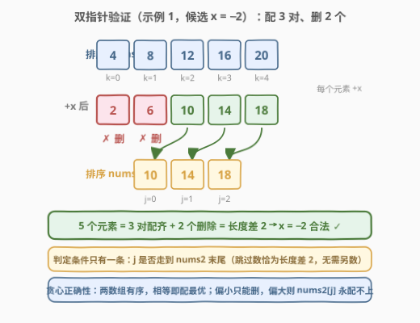
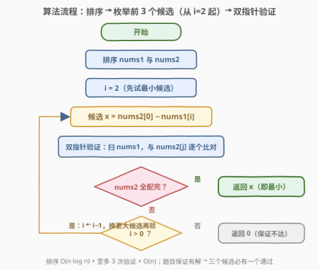
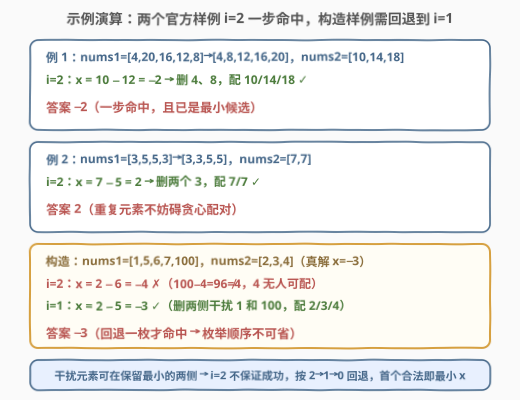

# LeetCode 找出与数组相加的整数 II 题解

## 1. 题目概述

- **标题 / 题号**：找出与数组相加的整数 II（#3132，medium）
- **链接**：https://leetcode.cn/problems/find-the-integer-added-to-array-ii/
- **难度**：中等
- **标签**：数组、排序、双指针、枚举

**题意**：给你两个整数数组 `nums1` 和 `nums2`，其中 `nums1` 比 `nums2` 恰好多 **2** 个元素。

从 `nums1` 中**移除两个元素**，并且所有其他元素都与变量 `x` 所表示的整数相加（若 `x` 为负数，则表现为元素值的减少）。执行上述操作后，`nums1` 和 `nums2` **相等**——当两个数组中包含相同的整数，并且这些整数出现的频次相同时，两个数组相等（与顺序无关）。

返回能够实现数组相等的**最小**整数 $x$。

**示例 1**：

```text
输入：nums1 = [4,20,16,12,8], nums2 = [14,18,10]
输出：-2
解释：移除 nums1 中下标为 [0,4] 的两个元素，其余元素与 -2 相加后，nums1 变为 [18,14,10]，与 nums2 相等。
```

**示例 2**：

```text
输入：nums1 = [3,5,5,3], nums2 = [7,7]
输出：2
解释：移除 nums1 中下标为 [0,3] 的两个元素，其余元素与 2 相加后，nums1 变为 [7,7]，与 nums2 相等。
```

**约束**：

- $3 \le \text{nums}_1.\text{length} \le 200$
- $\text{nums}_2.\text{length} = \text{nums}_1.\text{length} - 2$
- $0 \le \text{nums}_1[i], \text{nums}_2[i] \le 1000$
- 测试用例保证存在这样的整数 $x$

> 💡 与前作 [3131. 找出与数组相加的整数 I](../3101-3200/3131_找出与数组相加的整数I.md) 的差异只有一处：`nums1` 多出 2 个「干扰元素」。前作里 $x = \min(\text{nums}_2) - \min(\text{nums}_1)$ 唯一确定；本题中**不同的删法 → 不同的配对 → 不同的 $x$**，$x$ 不再唯一，题目要的是其中的**最小值**。「谁被删了」成了新的未知量——这正是本题从中等难度里拿到送分位的关键突破口。

## 2. 解题思路

### 2.1 暴力思路：枚举删法 / 枚举值域

$n \le 200$，暴力有两层：

- **枚举删法**：$\binom{n}{2} \approx 2 \times 10^4$ 种「删两个下标」的组合，每种把剩余元素排序后与 `nums2` 逐位比对，$O(n)$ 一次 → 总量约 $4 \times 10^6$，能过。但要正确处理下标组合与排序细节，代码量不小。
- **枚举值域**：$x \in [-1000, 1000]$ 共 2001 个候选，每个候选用计数数组检查 $\text{multiset}(\text{nums}_1 + x)$ 减去两个元素能否等于 $\text{nums}_2$……「减去两个元素」这一步本身就又回到枚举删法，绕了一圈。

两条暴力路的共同盲区是：**把「删两个元素」当成了必须显式处理的自由度**。而排序配对的结构会告诉我们，这 2 个删除带来的自由度其实小得可怜——候选 $x$ 至多 3 个。

### 2.2 核心观察：保留最小元素只可能在排序后前 3 个 —— 候选只有 3 个

![核心观察：nums2[0] 只可能配排序后 nums1 的前 3 个](../images/p3132_remove_enum_concept.svg)

沿用 3131 的配对链：**multiset 相等 ⇔ 排序后逐位相等**，且全体 $+x$ 是整体平移不改变大小顺序。设两个数组都排好序，在某个合法方案里：

1. $\text{nums}_2[0]$ 是 `nums2` 的最小值，它配对的一定是 **`nums1` 保留下来的元素中的最小值**（更小的都被删了）；
2. 设这个「保留最小」在排序后 `nums1` 中的下标为 $j$，那么下标 $< j$ 的元素**必须全部被删除**——它们比它小，却在 `nums2` 里没有任何更小的元素可配；
3. 只允许删 2 个 ⇒ $j \le 2$。

于是合法的 $x$ 只能是：

$$x_j = \text{nums}_2[0] - \text{nums}_1[j], \quad j \in \{0, 1, 2\}$$

从 $\binom{n}{2}$ 种删法坍缩成 **3 个候选**。再进一步：$\text{nums}_2[0]$ 固定，$\text{nums}_1[j]$ 越大 $x$ 越小，**求最小 $x$ 就从 $j = 2$ 开始试**，第一个能通过验证的候选直接返回——甚至不需要把三个都验完。

> ⚠️ 注意 $j=2$ 不保证成功：干扰元素可能出现在「保留最小」的**两侧**（如构造样例 `[1,5,6,7,100]` 删 `1` 和 `100`），此时保留最小落在 $j=1$ 甚至 $j=0$。所以枚举方向是 $2 \to 1 \to 0$ 的**回退链**，不能只验 $j=2$ 了事。

### 2.3 验证器：双指针贪心配对，O(n) 判定一个候选



给定候选 $x$，如何判定「删掉两个元素后其余元素 $+x$ 等于 `nums2`」？两个数组都已排序，双指针 $k$ 扫 `nums1`、$j$ 扫 `nums2`：

- 若 $\text{nums}_1[k] + x = \text{nums}_2[j]$：配对成功，$k{+}{+},\ j{+}{+}$；
- 否则 $\text{nums}_1[k]$ 无法配当前及之后的任何元素，**视为删除**，$k{+}{+}$。

判定条件只有一条：**$j$ 是否走完 `nums2`**。因为两数组长度恰差 2，$j$ 走完时被跳过的元素恰好就是被删的 2 个，无需显式计数。这个贪心的正确性由有序性背书：

- $\text{nums}_1[k] + x < \text{nums}_2[j]$：当前元素偏小，后面目标只增不减，它只能被删；
- $\text{nums}_1[k] + x > \text{nums}_2[j]$：后面元素只会更大，$\text{nums}_2[j]$ **永远配不上**，$j$ 卡死，最终走不完 → 该 $x$ 非法；
- 相等即配：交换论证下「能配就配」永不劣于把它留给后面。

### 2.4 算法流程图



### 2.5 示例演算



| 样例 | 排序后 | $j=2$ 候选 | 结果 | 答案 |
|------|--------|:---:|------|:---:|
| 例 1：`[4,20,16,12,8]` / `[14,18,10]` | `[4,8,12,16,20]` / `[10,14,18]` | $10-12=-2$ | 删 4、8，配齐 3 对 ✓ | **−2** |
| 例 2：`[3,5,5,3]` / `[7,7]` | `[3,3,5,5]` / `[7,7]` | $7-5=2$ | 删两个 3，配齐 2 对 ✓ | **2** |
| 构造：`[1,5,6,7,100]` / `[2,3,4]` | 同序 | $2-6=-4$ | $100-4=96 \ne 4$，`4` 无人可配 ✗ | **−3**（回退 $j=1$：$2-5=-3$，删 1、100 ✓） |

前两个官方样例都在 $j=2$ 一步命中——这正是很多题解「看似只需试一个候选」的错觉来源；构造样例里干扰元素 `1` 和 `100` 一左一右夹住真解，逼出 $2 \to 1 \to 0$ 的完整回退链，也解释了为什么验证器必须独立于候选枚举存在。

## 3. 参考代码

### C++

```cpp
class Solution {
  public:
    int minimumAddedInteger(vector<int>& nums1, vector<int>& nums2) {
        sort(nums1.begin(), nums1.end());
        sort(nums2.begin(), nums2.end());
        // j 越大 nums1[j] 越大 -> x 越小，从 j=2 开始试最小候选
        for (int j = 2; j >= 0; j--) {
            int x = nums2[0] - nums1[j];
            if (check(nums1, nums2, x)) return x;
        }
        return 0;  // 题目保证有解，不会到达
    }

  private:
    // 双指针验证：nums1 中跳过的元素即视为被删除
    bool check(vector<int>& a, vector<int>& b, int x) {
        int j = 0;
        for (int v : a) {
            if (j < (int)b.size() && v + x == b[j]) j++;
        }
        return j == (int)b.size();
    }
};
```

### Python

```python
class Solution:
    def minimumAddedInteger(self, nums1: List[int], nums2: List[int]) -> int:
        nums1.sort()
        nums2.sort()

        def check(x: int) -> bool:
            j = 0
            for v in nums1:
                if j < len(nums2) and v + x == nums2[j]:
                    j += 1
            return j == len(nums2)

        for j in (2, 1, 0):  # 从最小候选开始试
            x = nums2[0] - nums1[j]
            if check(x):
                return x
        return 0  # 题目保证有解，不会到达
```

> 💡 写法盘点：
> - **验证器免计数**：`check` 里没有显式维护「删除个数 ≤ 2」——两数组长度恰差 2，`j` 走完时跳过数自动等于 2。若把题目泛化为「删 k 个」，则需补一个 `skip` 计数并要求 `skip == k`（见第 5 节）。
> - **枚举顺序即答案序**：从 $j=2$ 往回试，首个合法候选就是最小 $x$，无需 `min()` 收集。若改成 $j=0 \to 2$，则必须三个全验完再取最小——正确但多做两次验证。
> - **一步命中错觉**：两个官方样例都 $j=2$ 命中，容易误以为「试一个就够」。构造样例 `[1,5,6,7,100]` 专治这个错觉。

## 4. 复杂度分析

| 维度 | 复杂度 | 说明 |
|------|--------|------|
| 时间复杂度 | $O(n \log n)$ | 排序主导；随后至多 3 次验证，每次双指针 $O(n)$ |
| 空间复杂度 | $O(1)$ | 原地排序 + 常数个指针（不计排序递归栈） |
| 候选规模 | 恰 3 个 | 由「保留最小下标 $j \le 2$」夹出，与 $n$ 无关 |

## 5. 扩展：泛化到「删 k 个元素」

把「删 2 个」泛化为「删 k 个」（$n_1 = n_2 + k$），本题的框架逐条升级：

1. **候选枚举**：保留最小的下标 $j \le k$，候选变为 $k + 1$ 个：$x_j = \text{nums}_2[0] - \text{nums}_1[j]$，$j = k, k-1, \dots, 0$；
2. **验证器**：双指针跳过数必须 `skip == k`（长度差不再是 2，免计数技巧失效，需显式维护）；
3. **复杂度**：$O(n \log n + k \cdot n)$，当 $k \ll n$ 时依旧近线性。

这个泛化说明本题真正的骨架是「**自由度压缩 + 独立验证器**」：删除带来的组合爆炸，被「保留最小必在前 k+1 个」这条结构性观察压成常数；而每个候选的合法性判定交给一个 $O(n)$ 的贪心子程序。两件套分离，各自都简单，合起来就是这类「带删除的配对」题的通用模板。

## 6. 面试要点

1. **为什么候选 x 只有 3 个？请完整论证。**

   排序后 `nums2[0]` 配对的是「保留元素的最小值」；设其在 `nums1` 排序后的下标为 $j$，则下标 $< j$ 的元素都比它小、必须全删，而只允许删 2 个 ⇒ $j \le 2$ ⇒ $x = \text{nums}_2[0] - \text{nums}_1[j]$ 至多 3 个取值。

2. **为什么从 j=2 开始试就能直接返回，不用取 min？**

   $x = \text{nums}_2[0] - \text{nums}_1[j]$，$\text{nums}_2[0]$ 固定，$\text{nums}_1[j]$ 随 $j$ 增大而增大 ⇒ $x$ 随 $j$ 增大而减小。按 $j = 2 \to 1 \to 0$ 的顺序验证，首个合法候选即最小 $x$。前提是题目保证有解——否则必须三个全验完（或验完仍无解时报无解）。

3. **双指针验证里，为什么不用显式维护「至多删 2 个」？**

   两数组长度恰差 2，`j` 走到 `nums2` 末尾时，`nums1` 中恰好有 2 个元素被跳过（即被删），长度守恒自动保证删除数正确。泛化到删 $k$ 个时长差守恒同样成立，但若验证中途想**提前终止**（跳过数超限即失败），显式计数能省掉无效扫描。

4. **验证器的贪心为什么正确？遇到相等元素一定要配吗？**

   两数组均有序。$\text{nums}_1[k] + x > \text{nums}_2[j]$ 时后者永配不上（后续候选只增不减）；$<$ 时当前元素只能删；相等时配对由交换论证保证不劣——把它留给后面只会让前面的目标更难配上。重复元素（如例 2 的 `[7,7]`）在此框架下无需任何特判。

5. **本题和 3131 的递进关系是什么？**

   3131 是 $k=0$ 的退化版：无删除 ⇒ $x$ 唯一，一个统计量（min）秒杀。3132 引入 $k=2$ 的删除自由度，$x$ 出现多解，「min 对 min」升级为「枚举保留最小 + 双指针验证」。两题合看是一条完整的难度阶梯：**不变量 → 不变量被自由度破坏 → 压缩自由度恢复不变量**。

## 同类练习题

| # | 题目 | 与本题的关联 |
|---|------|-------------|
| 3131 | [找出与数组相加的整数 I](https://leetcode.cn/problems/find-the-integer-added-to-array-i/)（[站内题解](../3101-3200/3131_找出与数组相加的整数I.md)） | 前作，无删除版「min 对 min」一步求 $x$，本题的退化基线 |
| 1460 | [通过翻转子数组使两个数组相等](https://leetcode.cn/problems/make-two-arrays-equal-by-reversing-subarrays/)（[站内题解](../1401-1500/1460_通过翻转子数组使两个数组相等.md)） | multiset 相等判定（计数版），本题「相等」定义的姊妹题 |
| 2037 | [使每位学生都有座位的最少移动次数](https://leetcode.cn/problems/minimum-number-of-moves-to-seat-everyone/)（[站内题解](../2001-2100/2037_使每位学生都有座位的最少移动次数.md)） | 排序后一一配对，「排序对齐」同款直觉 |
| 719 | [找出第 K 小的数对距离](https://leetcode.cn/problems/find-k-th-smallest-pair-distance/) | 排序 + 双指针计数验证候选，「枚举候选 + 独立验证器」范式的二分变体 |
