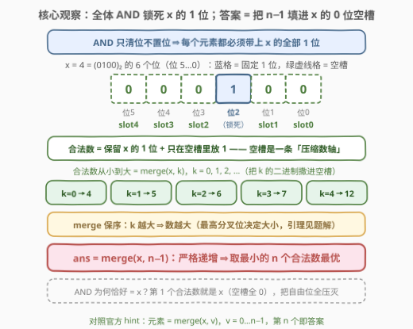
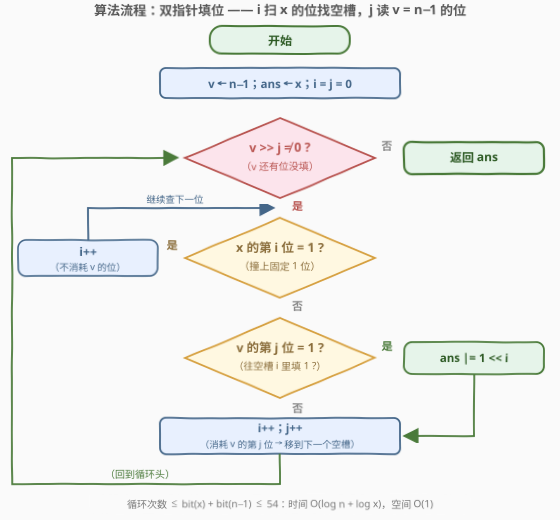
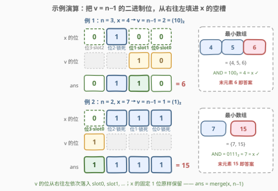

# LeetCode 数组最后一个元素的最小值 题解

## 1. 题目概述

- **标题 / 题号**：数组最后一个元素的最小值（#3133，medium）
- **链接**：https://leetcode.cn/problems/minimum-array-end/
- **难度**：中等
- **标签**：位运算

**题意**：给你两个整数 `n` 和 `x`。你需要构造一个长度为 `n` 的**正整数**数组 `nums`，满足：

- 对所有 $0 \le i \lt n-1$，都有 `nums[i+1]` **大于** `nums[i]`（严格递增）；
- 数组 `nums` 中所有元素的按位 `AND` 运算结果为 `x`。

返回 `nums[n - 1]` 可能的**最小**值。

**示例 1**：

```text
输入：n = 3, x = 4
输出：6
解释：数组 nums 可以是 [4, 5, 6]，最后一个元素为 6。
```

**示例 2**：

```text
输入：n = 2, x = 7
输出：15
解释：数组 nums 可以是 [7, 15]，最后一个元素为 15。
```

**约束**：

- $1 \le n, x \le 10^8$

> 💡 读题关键：把三个条件拆开看「谁在起作用」——**全体 AND = x** 锁死了每个元素的位模式（哪些位必须有 1）；**严格递增** 等价于元素**互不相同**，它决定了「末元素至少是第 $n$ 个不同的合法数」；**求最小** 则提示我们直接从合法数里从小到大挑。另外 $n, x \le 10^8$ 却要返回 `long long`，暗示答案远超 `int` 范围——$O(\text{答案})$ 的暴力必然超时，得想 $O(\log)$ 级的构造。

## 2. 解题思路

### 2.1 暴力思路：从 x 起逐个筛选「合法数」

称 $y$ 为**合法数**，若 $y \,\&\, x = x$（即 $y$ 的 1 位包含 $x$ 的全部 1 位，下称「$x$ 的位超集」）。由 2.2 的第一步可知数组每个元素都必须是合法数，于是最直接的模拟：

```python
def brute(n, x):
    cnt, y = 0, x
    while True:
        if y & x == x:      # y 是 x 的位超集
            cnt += 1
            if cnt == n:
                return y
        y += 1
```

- 正确性显然（就是取第 $n$ 小的合法数），但答案最坏约 $1.6 \times 10^{12}$（见 2.2 的溢出估计），按每秒 $10^8$ 步要跑四个多小时，不可行；
- 暴力的价值有二：一是把问题**翻译**成「求 $x$ 的位超集中第 $n$ 小的数」；二是小范围内可与正解**对拍**（$x \le 40$、$n \le 7$ 全部一致）。

> ⚠️ 暴力的默认前提是「合法数只能一个一个数」。但合法数的结构高度规整——它就是「$x$ 固定 + 空槽自由」，这把尺子可以**直接跳到第 $n$ 个刻度**。

### 2.2 核心观察：把 n−1 填进 x 的 0 位空槽



**第一步（元素的位模式被锁死）**：按位 AND 只会**清位**不会**置位**。若某元素在位 $b$ 上是 0，而 $x$ 的第 $b$ 位是 1，则全体 AND 在第 $b$ 位必为 0，与 AND $= x$ 矛盾。因此

$$\text{每个元素都是 } x \text{ 的位超集（合法数）}$$

反过来，$x$ 为 0 的位（下称**空槽**）上元素可以自由取 1，只要全体中**至少一个**元素在该位为 0 即可——这个条件几乎不构成约束（见第四步）。

**第二步（合法数 = 固定位 + 空槽自由摆放）**：把 $x$ 的空槽从右往左编号 $\text{slot}_0 \lt \text{slot}_1 \lt \text{slot}_2 \lt \cdots$。一个数是合法数 $\iff$ 它在 $x$ 的每个 1 位上取 1，且空槽上的取值任意——**合法数与「空槽子集」一一对应**，空槽构成一条「压缩数轴」。

**第三步（merge 与保序引理）**：定义 $\mathrm{merge}(x, k)$：把 $k$ 的第 $j$ 个二进制位填进 $\text{slot}_j$（其余照抄 $x$）。则合法数全体恰为 $\{\mathrm{merge}(x,k) : k \ge 0\}$，且 **merge 严格递增**：

> 证明：设 $k_1 \lt k_2$，取两者**最高的不同位** $j$（$k_2$ 在该位为 1，$k_1$ 为 0，更高位相同）。于是 $\mathrm{merge}(x,k_1)$ 与 $\mathrm{merge}(x,k_2)$ 在**高于** $\text{slot}_j$ 的所有位置上取值相同（固定 1 位相同、更高空槽填入的位也相同），而在 $\text{slot}_j$ 上前者为 0、后者为 1，故 $\mathrm{merge}(x,k_1) \lt \mathrm{merge}(x,k_2)$。∎

**第四步（下界 + 达到）**：

- **下界**：严格递增 $\Rightarrow$ $n$ 个元素是 $n$ 个**互不相同**的合法数 $\Rightarrow$ 末元素 $\ge$ 第 $n$ 小的合法数 $= \mathrm{merge}(x, n-1)$；
- **达到**：直接取前 $n$ 小的合法数 $\{\mathrm{merge}(x, 0), \dots, \mathrm{merge}(x, n-1)\}$，严格递增由保序引理保证；AND 方面，$\mathrm{merge}(x, 0) = x$ 本身排第一，它把**所有空槽都压成 0**，于是全体 AND $= x$，**恰好不多不少**。

$$\boxed{\text{ans} = \mathrm{merge}(x,\, n-1)}$$

这正是官方 hint 的结论：每个元素 = $x$ 与 $v$ 的「合并」，$v = 0, 1, \dots, n-1$，最后一个元素即答案。

> ⚠️ **溢出估计（面试高频追问）**：$n, x \le 10^8 \lt 2^{27}$。最坏情形 $x$ 取交错位型（如 $(0101\cdots01)_2$，14 个 1 位、值约 $8.9 \times 10^7$），低位 27 格里只剩 13 个空槽，$n-1$ 的 27 个二进制位要一路铺到第 40 格：**答案 $< 2^{41} \approx 2.2 \times 10^{12}$**——32 位 `int` 必然溢出，C++ 必须用 `long long`（函数返回类型就是提示），Python 天然大数无此烦恼。

### 2.3 算法流程图



实现用**双指针填位**：$i$ 从低位往高位扫 $x$ 的位（找空槽），$j$ 从低位往高位读 $v = n-1$ 的位（取填料）：

- 撞上 $x$ 的固定 1 位：$i$ 前进一位**但不消耗** $v$ 的位（固定位不参与填充）；
- 遇到空槽：把 $v$ 的第 $j$ 位填进去（为 1 则 `ans |= 1 << i`），随后 $i, j$ 同时前进；
- 直到 $v$ 的位全部消耗完（`v >> j == 0`），返回 `ans`。

循环次数 $\le \mathrm{bit}(x) + \mathrm{bit}(n-1) \le 27 + 27 = 54$，常数级。

### 2.4 示例演算



**例 1**（$n=3, x=4=(0100)_2$）：空槽为 $\text{slot}_0 = b_0$、$\text{slot}_1 = b_1$、$\text{slot}_2 = b_3, \dots$；$v = n-1 = 2 = (10)_2$：

| $k$ | $k$ 二进制 | 填法（$\text{slot}_1 \gets$ 第 1 位，$\text{slot}_0 \gets$ 第 0 位） | $\mathrm{merge}(x,k)$ |
|-----|-----------|------------------------------------------------|----------------------|
| 0 | $00$ | $b_1{=}0,\ b_0{=}0 \to 0100$ | $4$ |
| 1 | $01$ | $b_1{=}0,\ b_0{=}1 \to 0101$ | $5$ |
| 2 | $10$ | $b_1{=}1,\ b_0{=}0 \to 0110$ | $\mathbf{6}$ ← 答案 |
| 3 | $11$ | $b_1{=}1,\ b_0{=}1 \to 0111$ | $7$ |

$n = 3$ → 取 $k = n - 1 = 2$ 行：数组 $\{4, 5, 6\}$，末元素 $6$ ✓（$4 \,\&\, 5 \,\&\, 6 = 100_2 = 4$）。

**例 2**（$n=2, x=7=(0111)_2$）：低位三位**全部锁死**，第一个空槽是 $b_3$；$v = 1 = (1)_2$ → $\text{slot}_0(b_3) \gets 1$，得 $(1111)_2 = 15$；数组 $\{7, 15\}$ ✓。

## 3. 参考代码

### C++

```cpp
class Solution {
  public:
    long long minEnd(int n, int x) {
        long long xx = x;            // 固定 1 位模板（务必提升为 64 位）
        long long v = n - 1;         // 要填进空槽的数
        long long ans = x;           // 从 x 出发，空槽默认 0
        int i = 0, j = 0;            // i 扫 x 的位，j 读 v 的位
        while (v >> j) {             // v 还有位没填
            if (xx >> i & 1) {       // 撞上 x 的固定 1 位
                i++;                 //   跳过，不消耗 v 的位
                continue;
            }
            if (v >> j & 1)          // 空槽：填入 v 的第 j 位
                ans |= 1LL << i;
            i++, j++;                // 消耗 v 的第 j 位，移到下一空槽
        }
        return ans;
    }
};
```

### Python

```python
class Solution:
    def minEnd(self, n: int, x: int) -> int:
        v = n - 1                     # 要填进空槽的数
        ans = x                       # 从 x 出发，空槽默认 0
        i = j = 0                     # i 扫 x 的位，j 读 v 的位
        while v >> j:                 # v 还有位没填
            if x >> i & 1:            # 撞上固定 1 位：跳过，不消耗 v
                i += 1
                continue
            if v >> j & 1:            # 空槽：填入 v 的第 j 位
                ans |= 1 << i
            i, j = i + 1, j + 1       # 消耗一位，移到下一空槽
        return ans
```

> 💡 写法盘点：
> - **原地紧凑版**（扫固定 63 位，省掉 `continue` 分支）：`for i in range(63): if x >> i & 1 == 0: x |= (n & 1) << i; n >>= 1`（先把 `n` 减一）。在 $x$ 为 0 的位上置 1 不会影响后续对**更高位**的判断，安全；63 个位置里至少 $63 - 27 = 36$ 个空槽，装得下 $n-1$ 的 27 个位。
> - **固定位跳过、空槽消耗**是唯一的状态转移规则，两个版本只是「是否提前退出」的差别；务必注意 `i++` 与 `j++` **不总是一起走**——这是本题代码最容易写错的地方。
> - **不要用 `int`**：答案 $< 2^{41}$，C++/Java 必须全程 `long long`/`long`；且 `x` 形参是 `int`，循环里 `i` 会走到 $\ge 32$，此时 `x >> i` 是**未定义行为**（实测答案会莫名变大），必须先 `long long xx = x` 再移位。

## 4. 复杂度分析

| 维度 | 复杂度 | 说明 |
|------|--------|------|
| 时间 | $O(\log n + \log x)$ | $i$ 的推进次数 = 跳过的固定 1 位数 + 消耗的 $v$ 位数 $\le \mathrm{bit}(x) + \mathrm{bit}(n-1) \le 54$，常数级 |
| 空间 | $O(1)$ | 只用常数个整型变量 |
| 溢出 | 答案 $< 2^{41}$ | $n, x \le 10^8 \lt 2^{27}$；最坏交错位型 $x$ 下答案约 $1.6 \times 10^{12}$，`long long` 安全、`int` 必爆 |

## 5. 扩展

### 5.1 反问题：由末元素反推 n 的上界（extract 操作）

merge 有个天然的逆操作 **extract**：给定合法数 $y$（$y \,\&\, x = x$），把 $y$ 的空槽位从右往左重组成二进制数。由保序引理立刻得到：

$$\#\{\text{合法数} \le y\} = \mathrm{extract}(y) + 1$$

于是「已知 $x$ 与某个候选末元素 $\text{last}$，最长能构造多长的数组」一步可答：$n_{\max} = \mathrm{extract}(\text{last}) + 1$。这也提供了另一种解法视角——**二分答案** $M$，用 extract 计算 $\le M$ 的合法数个数，找第一个 $\ge n$ 的 $M$——不过直接构造 $O(54)$ 显然更快，二者互为印证（$\mathrm{extract}(\mathrm{merge}(x,k)) = k$ 可作对拍断言）。

### 5.2 约束的「含金量」：递增 vs 互异 vs 重复

- 把「严格递增」放宽为「**互不相同**」：答案不变——互异的 $n$ 个合法数末元素仍 $\ge$ 第 $n$ 小，前 $n$ 小仍可取（保序引理保证互异）；
- 放宽为「**允许重复**」：答案直接跌到 $x$——$n$ 个 $x$ 排成一列，AND $= x$，末元素 $= x$；
- 可见真正把答案撑大的是「互异」而非「递增」，而 AND 约束只负责**筛选合法数集合**。分清每条约束「贡献了什么」，是这类构造题快速破题的关键。

## 6. 面试要点

1. **为什么每个元素都必须是 $x$ 的位超集？**

   - 按位 AND 只清位不置位：若某元素在 $x$ 的某个 1 位上取 0，全体 AND 在该位必为 0，与 AND $= x$ 矛盾。所以「全体 AND $= x$」 $\Rightarrow$ 「人人包含 $x$ 的 1 位」；反向的「不多不少」由第一个元素 $x$ 本身兜底（见下一问）。

2. **取前 $n$ 小的合法数，AND 为什么恰好等于 $x$，而不是多出几个 1？**

   - 第 $1$ 小的合法数就是 $\mathrm{merge}(x, 0) = x$，它所有空槽全为 0；任何位与上 0 都归 0，因此自由位被 $x$ 全部压灭，全体 AND $= x$ **恰好成立**。

3. **merge 为什么保序？请给出论证。**

   - 取 $k_1 \lt k_2$ 的**最高分叉位** $j$：更高位两者相同 $\Rightarrow$ 映射后高于 $\text{slot}_j$ 的所有位置（固定 1 位与更高空槽）完全相同；$\text{slot}_j$ 上 $\mathrm{merge}(x,k_2)$ 为 1、$\mathrm{merge}(x,k_1)$ 为 0 $\Rightarrow$ 大小立判。关键句是「**更高的空槽填法相同**」。

4. **答案会不会溢出？怎么估计上界？**

   - $n, x \lt 2^{27}$；最坏 $x$ 交错摆 14 个 1 位时，低 27 格仅剩 13 个空槽，$n-1$ 的 27 位要铺到第 40 格，答案 $< 2^{41} \approx 2.2 \times 10^{12}$。`int` 必爆、`long long` 安全；返回类型 `long long` 本身就是提示。

5. **如果允许数组元素重复，答案会变成多少？这说明什么？**

   - 变成 $x$（$n$ 个 $x$ 即可）。说明「严格递增」的实质作用是**互异**——把末元素从「随便挑」逼到「至少第 $n$ 小」；而 AND 约束只决定合法数集合的形状。两条约束各司其职，拆开分析就不会混淆。

## 同类练习题

| # | 题目 | 与本题的关联 |
|---|------|-------------|
| 201 | [数字范围按位与](https://leetcode.cn/problems/bitwise-and-of-numbers-range/)（[站内题解](../0201-0300/201_数字范围按位与.md)） | 区间 AND = 公共二进制前缀——AND 语义家族之「给区间求 AND」，本题是「给 AND 反推第 n 小构造」 |
| 3125 | [使得按位与结果为 0 的最大数字](https://leetcode.cn/problems/maximum-number-that-makes-result-of-bitwise-and-zero/)（[站内题解](../3101-3200/3125_使得按位与结果为0的最大数字.md)） | 邻题——AND 约束下的极端端点反推，「上界 + 达到上界」同款论证 |
| 2275 | [按位与结果大于零的最长组合](https://leetcode.cn/problems/largest-combination-with-bitwise-and-greater-than-zero/) | AND > 0 $\iff$ 存在某位在所有数中全为 1——按位统计视角看 AND 约束 |
| 2419 | [按位与最大的最长子数组](https://leetcode.cn/problems/longest-subarray-with-maximum-bitwise-and/) | 子数组 AND 只减不增的单调性——与本题「AND 只清位不置位」同一性质的应用 |
| 3116 | [单面值组合的第 K 小金额](https://leetcode.cn/problems/kth-smallest-amount-with-single-denomination-combination/)（[站内题解](../3101-3200/3116_单面值组合的第K小金额.md)） | 同为「第 k 小」型问题，对照「值域上数合法数（二分）」与「直接构造第 k 个」两条路线 |
