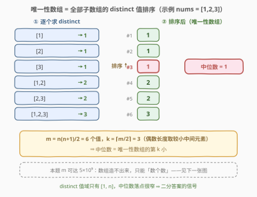
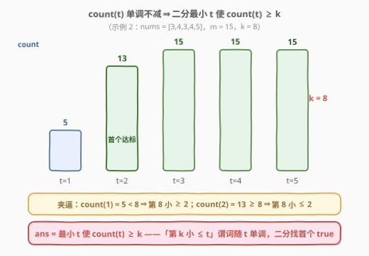
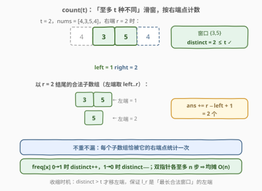

# 找出唯一性数组的中位数

- **题目名称**：找出唯一性数组的中位数
- **链接**：[3134. 找出唯一性数组的中位数](https://leetcode.cn/problems/find-the-median-of-the-uniqueness-array/)
- **难度**：困难
- **标签**：数组，哈希表，二分查找，滑动窗口

## 1. 题目概述

给你一个整数数组 `nums`。数组 `nums` 的**唯一性数组**是一个按元素**从小到大排序**的数组，包含 `nums` 的所有**非空子数组**中不同元素的个数。

换句话说，这是由所有 $0 \le i \le j \lt \text{nums.length}$ 的 $\mathrm{distinct}(\text{nums}[i..j])$ 组成的递增数组。

返回 `nums` 唯一性数组的**中位数**。

**注意**，数组的中位数定义为有序数组的中间元素。如果有两个中间元素，则取值较小的那个。

**示例 1**：

```text
输入：nums = [1,2,3]
输出：1
解释：唯一性数组为 [distinct([1]), distinct([2]), distinct([3]), distinct([1,2]), distinct([2,3]), distinct([1,2,3])] = [1,1,1,2,2,3]，中位数为 1。
```

**示例 2**：

```text
输入：nums = [3,4,3,4,5]
输出：2
解释：唯一性数组为 [1,1,1,1,1,2,2,2,2,2,2,2,3,3,3]，中位数为 2。
```

**示例 3**：

```text
输入：nums = [4,3,5,4]
输出：2
解释：唯一性数组为 [1,1,1,1,2,2,2,3,3,3]，中位数为 2。
```

**约束条件**：

- $1 \le \text{nums.length} \le 10^5$
- $1 \le \text{nums}[i] \le 10^5$

> 💡 读题关键：唯一性数组**无需也无法显式构造**——它有 $\frac{n(n+1)}{2} \approx 5 \times 10^9$ 个元素（$n = 10^5$ 时），既存不下也排不动。而中位数本质是「第 $k$ 小」问题，第 $k$ 小只需**计数**不需排序；候选值域只有 $[1, n]$（distinct 最小 1、最大 $n$），配合计数的单调性，正是**二分答案**的标准信号。

---

## 2. 解题思路

### 2.1 暴力思路：枚举所有子数组

以每个 $i$ 为左端点向右扩张 $j$，用集合增量维护 $\mathrm{distinct}(\text{nums}[i..j])$，把所有值收进数组，排序后取中间：

```python
def brute(nums):
    vals = []
    for i in range(len(nums)):
        seen = set()
        for j in range(i, len(nums)):
            seen.add(nums[j])          # distinct 随右端扩张只增不减
            vals.append(len(seen))
    vals.sort()
    return vals[(len(vals) + 1) // 2 - 1]
```

- 时间 $O(n^2 \log n^2)$、空间 $O(n^2)$：$n = 10^5$ 时要生成约 $5 \times 10^9$ 个值，**生成、存储、排序三重爆炸**，数据范围直接否决；
- 暴力的价值：确认了 distinct 的两个关键性质——**右端扩张时只增不减**（滑窗可行性）、**值域只有 $[1, n]$**（二分可行性），并给正解提供小规模对拍基准。

> ⚠️ 别急着优化「排序」——瓶颈在「生成 $O(n^2)$ 个值」本身。凡是「把所有答案列出来再挑」的思路在此数据范围下都无药可救，必须**只数个数、不造数组**。

### 2.2 核心观察：中位数 → 第 k 小 → 二分答案

**第一步：中位数 = 第 $k = \lceil m/2 \rceil$ 小**。



设 $m = \frac{n(n+1)}{2}$ 为子数组（即唯一性数组元素）总数。长度为**偶数**时取**较小**的中间元素，即第 $m/2$ 个；为奇数时取第 $\frac{m+1}{2}$ 个——两者统一为（1-indexed）

$$k = \left\lceil \frac{m}{2} \right\rceil$$

（如 $m = 6$ 时 $k = 3$，$m = 15$ 时 $k = 8$）。于是问题转化为：**求唯一性数组中第 $k$ 小的值**。

**第二步：计数函数 $\mathrm{count}(t)$ 单调 → 二分**。定义

$$\mathrm{count}(t) = \#\{\,\text{子数组} : \mathrm{distinct} \le t\,\}$$

即「不同元素个数**至多** $t$」的子数组数目。$t$ 越大约束越松、合法集合单调扩大，故 $\mathrm{count}(t)$ 关于 $t$ **单调不减**。又「第 $k$ 小的值 $\le t$」$\iff$「至少 $k$ 个值 $\le t$」$\iff$ $\mathrm{count}(t) \ge k$，于是二分找**最小**的 $t$ 使 $\mathrm{count}(t) \ge k$ 即为答案：

$$\boxed{\ \text{ans} = \min\{\, t : \mathrm{count}(t) \ge k \,\}\ }$$



> 💡 正确性夹逼：设 $t^\ast$ 为该最小值。$\mathrm{count}(t^\ast) \ge k$ 说明第 $k$ 小 $\le t^\ast$；而 $\mathrm{count}(t^\ast - 1) \lt k$（$t^\ast = 1$ 时由所有值 $\ge 1$ 天然成立）说明第 $k$ 小 $\gt t^\ast - 1$ 即 $\ge t^\ast$。两边夹住第 $k$ 小 $= t^\ast$。这正是「二分答案 = 在单调谓词上找第一个 true」的通用范式。

### 2.3 算法流程：滑窗 O(n) 计算 count(t)



$\mathrm{count}(t)$ 的计算是经典的「**至多 $t$ 种不同**」滑窗：右端 $r$ 每前进一格，若窗口内不同元素个数超过 $t$，就收缩左端 $l$ 直到重新合法；此刻**以 $r$ 结尾**的合法子数组恰有 $r - l + 1$ 个（左端取 $l, l+1, \dots, r$ 都行），累加即可：

$$\mathrm{count}(t) = \sum_{r=0}^{n-1} \left( r - l_r + 1 \right)$$

其中 $l_r$ 是使 $\mathrm{distinct}(\text{nums}[l..r]) \le t$ 的最小左端。两点保证：

- **不重不漏**：每个子数组只被它的**右端点**统计一次；
- **均摊 $O(n)$**：$l$ 与 $r$ 各自单调前进，全程各走至多 $n$ 步；`distinct` 的增减由频率表 $O(1)$ 维护（`freq[x]` 从 0 变 1 时加一、从 1 变 0 时减一）。

外层二分值域、内层滑窗计数，整体流程：

```text
m ← n(n+1)/2,  k ← ⌈m/2⌉
lo ← 1, hi ← n                        # 答案值域 [1, n]
while lo < hi:
    mid ← (lo + hi) / 2
    if count(mid) ≥ k:  hi ← mid      # 第 k 小 ≤ mid，收缩右界
    else:                lo ← mid + 1 # 第 k 小 > mid，抬升左界
return lo
```

### 2.4 示例演算

![示例演算：nums = [4,3,5,4]](../images/p3134_example_walkthrough.svg)

以 $\text{nums} = [4,3,5,4]$（示例 3）为例：$n = 4$，$m = 10$，$k = \lceil 10/2 \rceil = 5$。

**二分过程**（值域 $[1, 4]$）：

| 轮次 | lo | hi | mid | count(mid) | 判定 | 动作 |
|------|----|----|-----|-----------|------|------|
| 1 | 1 | 4 | 2 | 7 | $\ge k = 5$ ✓ | hi ← 2 |
| 2 | 1 | 2 | 1 | 4 | $\lt k = 5$ ✗ | lo ← 2 |
| — | 2 | 2 | — | — | lo = hi | 返回 **2** |

**count(2) 的滑窗过程**（$t = 2$）：

| $r$ | 收缩后窗口 | distinct | 收缩动作 | 累加 $r-l+1$ | ans |
|-----|-----------|----------|---------|-------------|-----|
| 0 | [4] | 1 | — | +1 | 1 |
| 1 | [4,3] | 2 | — | +2 | 3 |
| 2 | [3,5] | 2 | 移出 4 | +2 | 5 |
| 3 | [5,4] | 2 | 移出 3 | +2 | 7 |

$\mathrm{count}(2) = 7 \ge 5$，而 $\mathrm{count}(1) = 4 \lt 5$，夹得第 5 小 $= 2$——与唯一性数组 $[1,1,1,1,2,2,2,3,3,3]$ 的第 5 个元素吻合 ✓。

---

## 3. 参考代码

### C++

```cpp
class Solution {
  public:
    int medianOfUniquenessArray(vector<int>& nums) {
        int n = nums.size();
        long long m = 1LL * n * (n + 1) / 2;     // 子数组总数 ≈ 5e9，必须 long long
        long long k = (m + 1) / 2;               // 中位数 = 第 k 小（偶数取较小者）

        int lo = 1, hi = n;                      // 答案值域 [1, n]
        while (lo < hi) {
            int mid = lo + (hi - lo) / 2;
            if (countAtMost(nums, mid) >= k)     // 第 k 小 ≤ mid
                hi = mid;
            else
                lo = mid + 1;
        }
        return lo;
    }

  private:
    // 不同元素个数 ≤ t 的子数组数目：「至多 t 种」滑窗，均摊 O(n)
    long long countAtMost(vector<int>& nums, int t) {
        vector<int> freq(100001, 0);             // 值域 1..1e5，数组比哈希表快
        long long ans = 0;
        int left = 0, distinct = 0;
        for (int right = 0; right < (int)nums.size(); right++) {
            if (freq[nums[right]]++ == 0) distinct++;
            while (distinct > t) {               // 种类超限：收缩左端
                if (--freq[nums[left]] == 0) distinct--;
                left++;
            }
            ans += right - left + 1;             // 以 right 结尾的合法子数组个数
        }
        return ans;
    }
};
```

### Python

```python
class Solution:
    def medianOfUniquenessArray(self, nums: List[int]) -> int:
        n = len(nums)
        m = n * (n + 1) // 2                # 子数组总数（约 5e9）
        k = (m + 1) // 2                    # 中位数 = 第 k 小（偶数取较小者）

        def count_at_most(t: int) -> int:
            """不同元素个数 ≤ t 的子数组数目：至多 t 种滑窗"""
            freq = defaultdict(int)
            ans, left, distinct = 0, 0, 0
            for right, x in enumerate(nums):
                if freq[x] == 0:
                    distinct += 1
                freq[x] += 1
                while distinct > t:         # 种类超限：收缩左端
                    y = nums[left]
                    freq[y] -= 1
                    if freq[y] == 0:
                        distinct -= 1
                    left += 1
                ans += right - left + 1     # 以 right 结尾的合法子数组
            return ans

        lo, hi = 1, n                       # 答案值域 [1, n]
        while lo < hi:
            mid = (lo + hi) // 2
            if count_at_most(mid) >= k:
                hi = mid
            else:
                lo = mid + 1
        return lo
```

> 💡 写法盘点：
> - **二分上界用 $n$ 即可**：$t = n$ 时窗口永不收缩，$\mathrm{count}(n) = m \ge k$ 恒成立，谓词必有 true，不会二分落空；更讲究可收紧到 $\mathrm{distinct}(\text{nums})$（数组中不同元素总数），省几次无效判定。
> - **频率表用数组不用哈希表**：值域 $1 \le \text{nums}[i] \le 10^5$，`vector<int> freq(100001)` 比 `unordered_map` 快数倍；每轮二分重建的 $O(10^5)$ 开销（共约 17 轮）远小于滑窗本身。
> - **`long long` 不能省**：$m$ 最大约 $5 \times 10^9$，`ans` 同量级，均超出 `int` 上限（约 $2.1 \times 10^9$）；`k` 的比较也须 64 位。Python 天然大数无此虑。

---

## 4. 复杂度分析

| 维度 | 复杂度 | 说明 |
|------|--------|------|
| 时间 | $O(n \log n)$ | 二分 $O(\log n)$ 轮（值域 $[1, n]$），每轮滑窗均摊 $O(n)$ |
| 空间 | $O(C)$ | 频率表按值域 $C = 10^5$ 开；哈希表版为 $O(\mathrm{distinct})$ |
| 溢出 | $m \le \frac{10^5 \times (10^5+1)}{2} \approx 5 \times 10^9$ | 子数组计数与 $k$ 均超 `int`，C++/Java 全程 64 位 |

---

## 5. 扩展：exactly 与 atMost 的换算

本题只用到「**至多** $t$ 种」的计数 $\mathrm{count}(t)$。若进一步问「**恰好** $t$ 种不同」的子数组个数，标准技巧是容斥相减：

$$\mathrm{exactly}(t) = \mathrm{atMost}(t) - \mathrm{atMost}(t-1)$$

（1248「优美子数组」的 $\text{exactly}(k) = \text{atMost}(k) - \text{atMost}(k-1)$ 同款）。顺带一提，唯一性数组每个值 $v$ 的出现次数就是 $\mathrm{exactly}(v)$——本题若把「中位数」改成「众数」「平均值」等需要完整分布的统计量，就必须逐 $t$ 算 $\mathrm{exactly}$（值域 $[1, n]$ 共 $n$ 轮滑窗，$O(n^2)$）；而「第 $k$ 小/分位数」类只需二分 $\lceil \log n \rceil$ 轮，这也是**分位数问题偏爱二分答案**的原因。

---

## 6. 面试要点

1. **中位数为什么是第 $\lceil m/2 \rceil$ 小？**

   - 长度 $m$ 为奇数时中间元素即第 $\frac{m+1}{2}$ 个；为偶数时题目规定取**较小**的中间元素，即第 $\frac{m}{2}$ 个。两式统一为 $k = \lceil m/2 \rceil$（1-indexed），如 $m=6 \to k=3$、$m=15 \to k=8$。

2. **count(t) 为什么单调？为什么「最小 t 使 count(t) ≥ k」恰是第 k 小？**

   - $t$ 增大时约束「$\mathrm{distinct} \le t$」变松，合法子数组集合只扩不缩，故 $\mathrm{count}$ 单调不减——这是二分的前提。设 $t^\ast$ 为最小满足者：$\mathrm{count}(t^\ast) \ge k$ 给出第 $k$ 小 $\le t^\ast$；$\mathrm{count}(t^\ast-1) \lt k$ 给出第 $k$ 小 $\ge t^\ast$；夹逼即第 $k$ 小 $= t^\ast$。

3. **滑窗计数为什么是 $O(n)$？「ans += right − left + 1」的依据？**

   - $l$、$r$ 都只前进不后退，各至多 $n$ 步，均摊 $O(n)$。固定右端 $r$ 时，合法左端恰是 $l_r, l_r+1, \dots, r$（左端越小窗口越长、distinct 只会更多；$l_r$ 是最长合法窗口的左端），共 $r - l_r + 1$ 个子数组，全部以 $r$ 结尾、按右端点分组天然不重不漏。

4. **为什么不能用快速选择（quickselect）或优先队列？**

   - 它们都需要**随机访问或显式持有**全部 $m \approx 5 \times 10^9$ 个值，存储先爆。本题的值是「子数组的函数」而非独立输入，只能靠**计数函数 + 单调性**隐式二分定位——这正是二分答案与 quickselect 的分水岭：前者只需 $O(1)$ 空间的判定器，后者要摸到每个元素。

5. **有哪些实现细节容易翻车？**

   - 三处：① $m$、$k$、`ans` 累加值都超 `int`，C++ 必须 `long long`；② 二分区间开 `[1, n]$ 而非 `[0, n]$（distinct 至少为 1）；③ 收缩循环 `while distinct > t` 里，`freq` 减到 0 才令 `distinct--`，写成「先减 distinct 再判断」会错。

---

## 7. 同类练习题

- [719. 找出第 K 小的数对距离](https://leetcode.cn/problems/find-k-th-smallest-pair-distance/)（[站内题解](../0701-0800/719_找出第K小的数对距离.md)）：二分答案 + 双指针计数——「第 k 小 ⇔ 最小 t 使 count(t) ≥ k」同款模板
- [713. 乘积小于 K 的子数组](https://leetcode.cn/problems/subarray-product-less-than-k/)（[站内题解](../0701-0800/713_乘积小于K的子数组.md)）：滑动窗口「以 right 结尾计数 right−left+1」的母题
- [2762. 不间断子数组](https://leetcode.cn/problems/continuous-subarrays/)（[站内题解](../2701-2800/2762_不间段子数组.md)）：窗口内 max−min≤limit 的「至多型」滑窗，收缩条件从「种类数」换成「极差」
- [378. 有序矩阵中第 K 小的元素](https://leetcode.cn/problems/kth-smallest-element-in-a-sorted-matrix/)（[站内题解](../0301-0400/378_有序矩阵中第K小的元素.md)）：二分值域 + 「≤ mid 计数 ≥ k」判定，二分答案的纯值域版
- [2560. 打家劫舍 IV](https://leetcode.cn/problems/house-robber-iv/)：二分答案 + O(n) 贪心验证——判定器从滑窗换成贪心的同类变形
