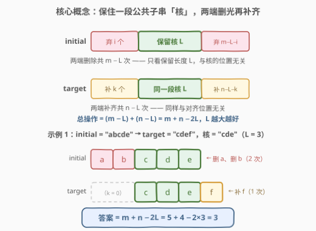
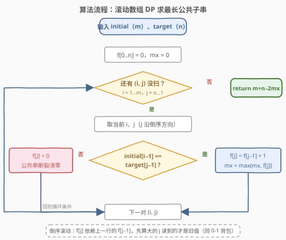
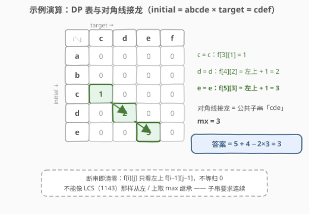

# LeetCode 通过添加或删除结尾字符来同化字符串 题解

## 1. 题目概述

- **标题 / 题号**：通过添加或删除结尾字符来同化字符串（#3135，medium）
- **链接**：https://leetcode.cn/problems/equalize-strings-by-adding-or-removing-characters-at-ends/
- **难度**：中等
- **标签**：字符串、动态规划、二分查找、滑动窗口、哈希函数

> ⚠️ 本题为 LeetCode 付费题（`isPaidOnly: true`），官方题面在 GraphQL 接口中返回 `null`。以下题意描述根据官方示例用例（`jsonExampleTestcases`）重建，并已与社区镜像 doocs/leetcode 的官方中文翻译交叉核对，示例输入输出与接口返回一致，出入风险较低。

**题意**：给定两个字符串 `initial` 和 `target`（均只含小写英文字母），要求通过若干次操作把 `initial` 变成 `target`。每次操作只能是以下四种之一：

- 在 `initial` 的**开头**添加一个字符；
- 在 `initial` 的**结尾**添加一个字符；
- 删除 `initial` 的**第一个**字符；
- 删除 `initial` 的**最后一个**字符。

返回把 `initial` 变成 `target` 所需的**最小**操作次数。

**示例 1**：

```text
输入：initial = "abcde", target = "cdef"
输出：3
解释：从 initial 的开头删除 'a' 和 'b'，再在结尾添加 'f'。
```

**示例 2**：

```text
输入：initial = "axxy", target = "yabx"
输出：6
解释：开头添 'y' → "yaxxy"；结尾删三次 → "ya"；结尾添 'b'、'x' → "yabx"。
```

**示例 3**：

```text
输入：initial = "xyz", target = "xyz"
输出：0
解释：两串已经相等，无需任何操作。
```

**约束**：

- $1 \le \text{initial.length}, \text{target.length} \le 1000$
- `initial` 和 `target` 只包含小写英文字母

> 💡 读题关键：操作**只发生在两端**——中间的字符一个都动不了。这决定了最终「幸存」的原始字符必然是 `initial` 的一段**连续子串**，而不是任意的子序列。这是本题与编辑距离（72）分道扬镳的地方。

## 2. 解题思路

### 2.1 暴力思路

第一反应也许是 BFS：把每个中间字符串当状态，四种操作各引一条边，从 `initial` 搜到 `target`。但「添加」会让状态空间无界膨胀（长度可以一直加下去），每个状态还是一个 26 进制的字符串，朴素搜索必须配精细剪枝，最坏近似指数级，不可行。

换一个视角的朴素做法：**枚举保留哪一段**。既然只能动两端，不如枚举 `initial` 的每个子串 $O(m^2)$ 个、逐字符检查它是否出现在 `target` 中，取最长的公共子串长度 $L$。三重循环（子串起点对 + 逐位延伸）共 $O(m\,n \cdot \min(m,n))$ 级别，$m = n = 1000$ 时约 $10^9$，必然超时。但它给出了正确的骨架——**问题归结为求两个字符串的最长公共子串**，剩下的就是把这个经典问题做快。

### 2.2 核心观察：保核删边，答案 = m + n − 2 × 最长公共子串



把任意操作序列的最终效果摊开：删除只发生在两端，所以**幸存的原始字符一定是 `initial` 的一段连续区间** `initial[i..j]`，记长度 $L$。任何时刻字符串都形如「前端添加 + 幸存窗口 + 后端添加」，结束时便有

$$\text{（前端添加）} + \text{initial}[i..j] + \text{（后端添加）} = \text{target}$$

添加的字符任意可选，所以该方案可行当且仅当 `initial[i..j]` **也是 `target` 的子串**。再看代价，有两个与位置无关的计数：

- **删除数只看长度**：无论核 `initial[i..j]` 在哪里，两端删光都是 $m - L$ 次；
- **添加数只看长度**：无论核对齐到 `target` 的哪个位置，两端补齐都是 $n - L$ 次。

于是固定 $L$ 的最小代价恰为 $(m - L) + (n - L)$。它同时是**下界**：没被保住的 $m - L$ 个原始字符，每个都要一次删除才能消失（一次操作恰好删一个字符）；`target` 中未被核覆盖的 $n - L$ 个字符，每个都要一次添加才能出现。要让总代价最小，就要让 $L$ 最大——即 `initial` 与 `target` 的**最长公共子串**长度 $\text{mx}$：

$$\text{答案} = m + n - 2 \times \text{mx}$$

> 💡 位置无关性是本题最漂亮的性质：不需要关心核在两串中如何对齐，只需要关心核**能有多长**。示例 2 官方给出的 6 步（先添 'y' 再删三个）与「保留 'a'、两端补齐」是同一代价的两种走法，殊途同归——都满足 $4 + 4 - 2 \times 1 = 6$。

### 2.3 算法流程：最长公共子串的滚动数组 DP



经典最长公共子串 DP（与 718 最长重复子数组同款）。定义 $f[i][j]$ 为**以 `initial[i-1]` 和 `target[j-1]` 结尾**的最长公共子串长度：

$$
f[i][j] = \begin{cases}
f[i-1][j-1] + 1, & \text{initial}[i-1] = \text{target}[j-1], \\
0, & \text{otherwise}.
\end{cases}
$$

全程维护 $\text{mx} = \max f[i][j]$，最终返回 $m + n - 2\,\text{mx}$。转移只依赖**左上角**一格，可以把二维表压成一维数组滚动：$f[j]$ 依赖的是**上一行**的 $f[j-1]$，所以内层 $j$ 必须**倒序**遍历，保证「读旧写新」——与 0-1 背包的内层倒序同一个原理。

### 2.4 示例演算



以 `initial = "abcde"`、`target = "cdef"` 为例填 DP 表：

- `'a'`、`'b'` 与 `cdef` 无一相等，前两行全 0；
- $f[3][1] = 1$：c = c，从 $f[2][0] = 0$ 起接龙；
- $f[4][2] = f[3][1] + 1 = 2$：d = d，接龙；
- $f[5][3] = f[4][2] + 1 = 3$：e = e，接龙——对角线 $1 \to 2 \to 3$ 恰好对应公共子串 `"cde"`。

$\text{mx} = 3$，答案 $= 5 + 4 - 2 \times 3 = 3$：删掉 `a`、`b`，再在结尾补一个 `f`，与示例 1 的官方解释完全一致。

## 3. 参考代码

### C++（滚动数组 DP）

```cpp
class Solution {
  public:
    int minOperations(string initial, string target) {
        int m = initial.size(), n = target.size();
        vector<int> f(n + 1, 0);            // f[j]：以 target[j-1] 结尾的最长公共子串
        int mx = 0;
        for (int i = 1; i <= m; ++i) {
            for (int j = n; j >= 1; --j) {  // 倒序滚动：f[j] 依赖上一行的 f[j-1]
                if (initial[i - 1] == target[j - 1]) {
                    f[j] = f[j - 1] + 1;
                    mx = max(mx, f[j]);
                } else {
                    f[j] = 0;               // 公共串断裂，清零重来
                }
            }
        }
        return m + n - 2 * mx;
    }
};
```

### Python（同款滚动 DP）

```python
class Solution:
    def minOperations(self, initial: str, target: str) -> int:
        m, n = len(initial), len(target)
        f = [0] * (n + 1)
        mx = 0
        for a in initial:
            for j in range(n, 0, -1):       # 倒序滚动，读旧写新
                if a == target[j - 1]:
                    f[j] = f[j - 1] + 1
                    mx = max(mx, f[j])
                else:
                    f[j] = 0                # 断裂清零
        return m + n - 2 * mx
```

## 4. 复杂度分析

| 维度 | 复杂度 | 说明 |
|------|--------|------|
| 时间复杂度 | $O(m \times n)$ | 双重循环逐格填表，每格 $O(1)$ 转移 |
| 空间复杂度 | $O(n)$ | 一维滚动数组：转移只依赖左上角，可压掉 $m$ 维 |

> 💡 $m, n \le 1000$ 时填表约 $10^6$ 格，非常宽裕；朴素三重循环的 $10^9$ 则会超时——一维之差，正是 DP 的意义所在。

## 5. 扩展：二分答案 + 滚动哈希，$O((m+n)\log\min(m,n))$

「长度为 $L$ 的公共子串存在」具有**单调性**——把长度 $L$ 的公共子串砍掉末尾一个字符，就得到长度 $L-1$ 的公共子串。于是可以**二分**最长长度 $L$，判定用 **Rabin-Karp 滚动哈希**：

1. 固定 $L$，把 `initial` 的所有长度为 $L$ 的窗口哈希值滚动计算并存入集合，$O(m)$；
2. 再滑过 `target` 的每个长度为 $L$ 的窗口，命中集合即存在公共子串，$O(n)$。

单次判定 $O(m+n)$，总复杂度 $O((m+n)\log\min(m,n))$。这正是官方标签里「二分查找 + 哈希函数 + 滑动窗口」的来历，也是 1044 最长重复子串的标准解法。本题 $m, n \le 1000$ 用不上它，但若规模放大到 $10^5$ 级别就必须换它（再往上还有后缀自动机 $O(m+n)$ 的线性做法）。

```python
class Solution:
    def minOperations(self, initial: str, target: str) -> int:
        m, n = len(initial), len(target)
        MOD, B = (1 << 61) - 1, 131      # 大模数，本题窗口数下碰撞概率约 1e-12

        def has_common(L: int) -> bool:
            if L == 0:
                return True
            pw = pow(B, L - 1, MOD)      # B^(L-1)：滑出窗口那个字符的权重
            seen, cur = set(), 0
            for i, c in enumerate(initial):
                if i >= L:
                    cur = (cur - (ord(initial[i - L]) - 96) * pw) % MOD
                cur = (cur * B + ord(c) - 96) % MOD
                if i >= L - 1:
                    seen.add(cur)
            cur = 0
            for i, c in enumerate(target):
                if i >= L:
                    cur = (cur - (ord(target[i - L]) - 96) * pw) % MOD
                cur = (cur * B + ord(c) - 96) % MOD
                if i >= L - 1 and cur in seen:
                    return True
            return False

        lo, hi = 0, min(m, n)
        while lo < hi:                    # 求最大的可行 L
            mid = (lo + hi + 1) // 2
            if has_common(mid):
                lo = mid
            else:
                hi = mid - 1
        return m + n - 2 * lo
```

> 💡 哈希碰撞：本题窗口总数不超过 2000，单模 $2^{61}-1$ 的碰撞概率约 $10^{-12}$，可放心使用；追求绝对稳妥可用双哈希，或像 1044 那样哈希值存「下标列表」、命中后逐字符比对原文。

## 6. 面试要点

1. **为什么答案是 $m + n - 2 \times \text{mx}$，而不是编辑距离那种 DP？**

   操作被限制在两端：中间的字符动不了 ⇒ 幸存字符必是一段连续子串 ⇒ 问题归约为最长公共**子串**而非子序列。删除数 $m - L$、添加数 $n - L$ 都只依赖保留长度 $L$，与核的位置无关，答案就是两串长度之和减去两倍最长公共子串长度。

2. **为什么 $f[i][j]$ 不等时要清零，而不能像 1143 最长公共子序列那样从左 / 上继承？**

   子串要求**连续**：以 `initial[i-1]`、`target[j-1]` 结尾的公共子串一旦在当前位置断裂，之前的积累无法延伸到「以 i、j 结尾」的状态，只能归零。LCS 求子序列，允许跳过字符，所以能从 $f[i-1][j]$、$f[i][j-1]$ 取 max 继承。一念之差，转移方程完全不同。

3. **滚动数组为什么内层要倒序？**

   $f[i][j]$ 只依赖上一行的 $f[i-1][j-1]$。压成一维后，若 $j$ 正序遍历，算 $f[j]$ 时 $f[j-1]$ 已被本行新值覆盖；倒序则保证读到的还是上一行旧值——与 0-1 背包内层倒序同一个原理，反过来 518 零钱兑换 II 求组合数就要正序。

4. **如何证明 $m + n - 2L$ 是下界？**

   两个独立的计数论证：未被保留的 $m - L$ 个原始字符，每个都要一次删除操作才能消失（一次操作恰好删一个字符，无法批量）；`target` 中未被核覆盖的 $n - L$ 个字符，每个都要一次添加操作才能出现。两者相加即 $m + n - 2L$，而「保核」构造恰好逐项达到该下界。

5. **数据规模放大到 $10^5$ 怎么办？**

   换二分答案 + 滚动哈希：单调性来自「长为 $L$ 的公共子串存在 ⇒ 其前缀给出长 $L-1$ 的」，判定时把一串的全部窗口哈希入集合、另一串滑动查询，单次 $O(m+n)$。再追求线性可上后缀自动机 / 后缀数组。

## 同类练习题

| # | 题目 | 与本题的关联 |
|---|------|-------------|
| 718 | [最长重复子数组](https://leetcode.cn/problems/maximum-length-of-repeated-subarray/) | 同款「最长公共子串」DP，只是把字符串换成数组（本仓库已有题解） |
| 583 | [两个字符串的删除操作](https://leetcode.cn/problems/delete-operation-for-two-strings/) | 公式同款 $m + n - 2L$，但 $L$ 是最长公共**子序列**——对照体会「操作受限 ⇒ 子串」（本仓库已有题解） |
| 1143 | [最长公共子序列](https://leetcode.cn/problems/longest-common-subsequence/) | 子序列版转移（从左 / 上取 max），与本题的清零转移互为镜像（本仓库已有题解） |
| 72 | [编辑距离](https://leetcode.cn/problems/edit-distance/) | 无位置限制的三种编辑，对照本题看「只能动两端」把问题简化成了什么（本仓库已有题解） |
| 1044 | [最长重复子串](https://leetcode.cn/problems/longest-duplicate-substring/) | 二分 + 滚动哈希求「最长重复」的标准题，即扩展篇的完整版（本仓库已有题解） |
