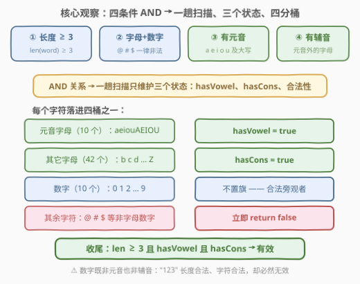
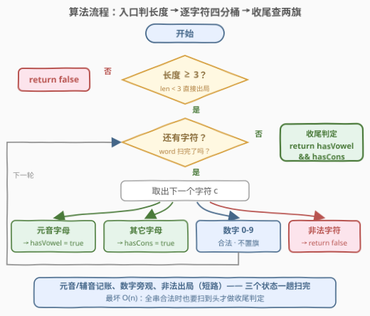
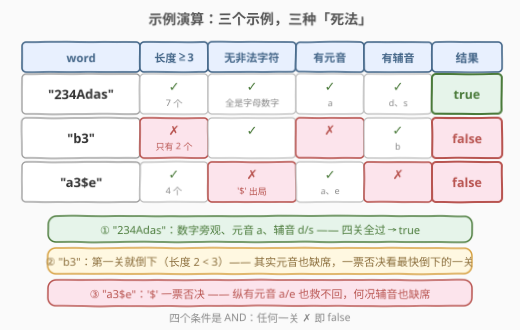

# LeetCode 有效单词 题解

## 1. 题目概述

- **标题 / 题号**：有效单词（#3136，easy）
- **链接**：https://leetcode.cn/problems/valid-word/
- **难度**：简单
- **标签**：字符串

**有效单词** 需要满足以下几个条件：

- **至少** 包含 3 个字符。
- 由数字 0-9 和英文大小写字母组成。（不必包含所有这类字符。）
- **至少** 包含一个 **元音字母**。
- **至少** 包含一个 **辅音字母**。

给你一个字符串 `word`。如果 `word` 是一个有效单词，则返回 `true`，否则返回 `false`。

**注意**：

- `'a'`、`'e'`、`'i'`、`'o'`、`'u'` 及其大写形式都属于 **元音字母**。
- 英文中的 **辅音字母** 是指那些除元音字母之外的字母。

**示例 1**：

```text
输入：word = "234Adas"
输出：true
解释：这个单词满足所有条件。
```

**示例 2**：

```text
输入：word = "b3"
输出：false
解释：这个单词的长度少于 3 且没有包含元音字母。
```

**示例 3**：

```text
输入：word = "a3$e"
输出：false
解释：这个单词包含了 '$' 字符且没有包含辅音字母。
```

**约束**：

- $1 \le word.length \le 20$
- `word` 由英文大小写字母、数字、`'@'`、`'#'` 和 `'$'` 组成

> 💡 读题关键：四个条件是 **AND 关系**，一票否决。两处易错点：① 条件②说「由字母和数字组成」，意味着 `'@' '#' '$'` 一旦出现直接无效；② 元音/辅音的主语都是 **字母**——数字既不是元音也不是辅音，`"123"` 长度达标、字符合法，却因为元音辅音双双缺席而无效。$n \le 20$ 怎么写都能过，本题真正值得带走的是把一组校验规则折叠成 **一趟扫描的微型状态机**。

## 2. 解题思路

### 2.1 朴素思路：四趟扫描逐条点名

条件列表天然对应四条独立检查，各扫一遍字符串：

```python
if len(word) < 3: return False                                  # 条件①
if not all(c.isalnum() for c in word): return False             # 条件②
if not any(c in "aeiouAEIOU" for c in word): return False       # 条件③
if not any(c.isalpha() and c not in "aeiouAEIOU"
           for c in word): return False                         # 条件④
return True
```

正确，但最多扫四遍、元音表查了两遍。$n \le 20$ 下无伤大雅；不过每个字符的「身份判定」本是同一次分类（是不是字母？是不是元音？），四趟的信息完全可以合并成 **一趟**。

> ⚠️ Python 的 `str.isalnum()` 会对 Unicode 字母/数字（如 `'é'`、`'②'`）也返回 `True`，本题靠输入约束兜底；若换到无约束场景，应显式写 `('a' <= c <= 'z') or ('A' <= c <= 'Z') or ('0' <= c <= '9')`。

### 2.2 核心观察：一趟扫描 + 三个状态



四个条件看着多，可折叠的信息只有三类：

- **长度**：入口一次判定（$O(1)$），不值得进循环；
- **合法性**：见到第一个非法字符即可 `return false`（短路出局）；
- **元音/辅音存在性**：两个布尔 `hasVowel` / `hasCons`，见过即置位，永不复位。

于是每个字符只需落进 **四个桶** 之一：元音字母 → `hasVowel = true`；其它字母 → `hasCons = true`；数字 → 合法但两旗皆不置；其余（`@ # $` 等）→ 立即出局。扫描结束后 `return hasVowel && hasCons`。

$$\text{valid} \iff \underbrace{|\text{word}| \ge 3}_{\text{入口判定}} \;\land\; \underbrace{\neg\,\text{非法字符}}_{\text{短路出局}} \;\land\; \underbrace{\text{hasVowel} \land \text{hasCons}}_{\text{收尾判定}}$$

> 💡 这就是一台只有 3 比特状态（`hasVowel`、`hasCons`、`bad`）的微型 DFA：每读一个字符转移一次，到达串尾看终态。同一范式放大到 9 状态，就是 [65. 有效数字](../0001-0100/65_有效数字.md) 的正主 DFA 题。

### 2.3 算法流程图



流程三段式：

1. **入口**：`len(word) < 3` 直接 `false`；
2. **循环**：逐字符分四桶——非法即 `return false`，元音/辅音置旗，数字跳过；
3. **收尾**：`return hasVowel && hasCons`。

### 2.4 示例演算



| 输入 | 长度 ≥ 3 | 无非法字符 | 有元音 | 有辅音 | 结果 |
|------|----------|------------|--------|--------|------|
| `"234Adas"` | ✓（7） | ✓ | ✓（`a`） | ✓（`d`、`s`） | **true** |
| `"b3"` | ✗（2） | ✓ | ✗ | ✓（`b`） | **false** |
| `"a3$e"` | ✓（4） | ✗（`$`） | ✓（`a`、`e`） | ✗ | **false** |

三个示例恰好三种死法：示例 1 四关全过；示例 2 倒在第一关（长度不足，顺带元音也缺席）；示例 3 倒在合法性这一关——`'$'` 一票否决，纵然元音齐全也无济于事，何况辅音也缺席。

## 3. 参考代码

### C++

```cpp
class Solution {
  public:
    bool isValid(string word) {
        if (word.size() < 3) return false;            // 条件①：长度前置，零成本
        bool hasVowel = false, hasCons = false;
        for (char ch : word) {
            unsigned char c = ch;
            if (!isalnum(c)) return false;            // 条件②：@ # $ 一票否决
            if (isalpha(c)) {                         // 条件③④：只有字母才有元/辅身份
                if (strchr("aeiouAEIOU", c)) hasVowel = true;
                else                        hasCons  = true;
            }
        }
        return hasVowel && hasCons;
    }
};
```

### Python

```python
class Solution:
    def isValid(self, word: str) -> bool:
        if len(word) < 3:
            return False
        has_vowel = has_cons = False
        for c in word:
            if not c.isalnum():          # '@' '#' '$' 一票否决
                return False
            if c.isalpha():              # 数字合法，但不参与元音/辅音计数
                if c in "aeiouAEIOU":
                    has_vowel = True
                else:
                    has_cons = True
        return has_vowel and has_cons
```

> 💡 写法盘点：
> - **元音判定**：字符串 `in` / `strchr` 最直白；追求极致可用位技巧——同一字母大小写满足 `c & 31` 同值，五个元音恰好落在第 1、5、9、15、21 位，`0x208222 >> (c & 31) & 1` 一条表达式判元音（承接 [3120. 统计特殊字母的数量 I](../3101-3200/3120_统计特殊字母的数量I.md) 的「大小写差 32」彩蛋）。
> - **C++ 细节**：`isalnum` / `isalpha` 的入参必须能转成 `unsigned char`（`char` 可能带符号，传负值是未定义行为），习惯性 cast 一下最稳。
> - **正则一行流**：`re.fullmatch(r"[a-zA-Z0-9]{3,}", word)` 一发同时干掉条件①②，再补两个 `any` 查元音/辅音——适合当 sanity check，不建议作主答案。

## 4. 复杂度分析

| 维度 | 复杂度 | 说明 |
|------|--------|------|
| 时间复杂度 | $O(n)$ | 一趟扫描，每字符 $O(1)$ 分类（元音查 10 字符表，常数） |
| 空间复杂度 | $O(1)$ | 两个布尔变量即全部状态；元音表为常量 |
| 短路收益 | 最坏 $O(n)$ | 非法字符即刻返回；全串合法时仍需扫到头才收尾判定 |

## 5. 扩展

### 5.1 「密码强度校验」骨架：规则表驱动

本题就是面试高频题「**密码合法性校验**」的最小骨架：长度下限 + 字符集白名单 + 若干「必备类别」（此处是元音/辅音，现实里是大写/小写/数字/符号）。规则再增多时，逐条 `if` 会失控，更工程化的写法是 **规则表驱动**：

```python
rules = [
    lambda w: len(w) >= 3,
    lambda w: all(c.isalnum() for c in w),
    lambda w: any(c in "aeiouAEIOU" for c in w),
    lambda w: any(c.isalpha() and c not in "aeiouAEIOU" for c in w),
]
return all(r(word) for r in rules)
```

新增规则只加一行——判定语义（可组合的谓词列表）与执行流程（`all` 天然短路）解耦，这也是本题四条件 AND 结构的工程化延伸。

### 5.2 元音判定的位运算：0x208222

承接 3120 的「大小写差 32」：`c & 31` 对同一字母的大小写取同一个值（`'a'` 与 `'A'` 都得 1）。五个元音按字母序恰好落在第 1、5、9、15、21 位：

$$\text{vowelMask} = 2^1 + 2^5 + 2^9 + 2^{15} + 2^{21} = \text{0x208222}$$

对字母 `c`，`0x208222 >> (c & 31) & 1` 为 1 当且仅当 `c` 是元音——查表换成一次移位，连字符串都不用建。适用前提照旧是「键域有界且小」。

### 5.3 真正的 Boss：420 强密码检验器（困难）

[420. 强密码检验器](https://leetcode.cn/problems/strong-password-checker/) 把同类规则（长度 6–20、大写/小写/数字各至少一个、无三连相同字符）从 **判定** 升级为 **最优化**：至少要几步修改（删/插/替换各算一步）才能合规？需要分类讨论 + 贪心，难度陡增。先握紧 3136 这副判定骨架，再去啃 420 会顺很多。

## 6. 面试要点

1. **为什么数字不能当辅音？**

   - 元音/辅音的定义主语都是 **字母**：数字合法存在，但不参与两个类别。若把数字当辅音，`"123"` 会被误判为有效（长度达标、无非法字符、有"辅音"）——这是本题最阴的坑，示例 2 的 `"b3"` 正是在暗示这一点。

2. **四个条件的检查顺序重要吗？**

   - 逻辑上 AND 可交换；工程上讲究「**便宜的先判、能短路的先判**」：长度是 $O(1)$ 前置；非法字符判到即刻 `return false`，省掉剩余扫描。即便不短路，正确性也不受影响——顺序是性能优化而非正确性依赖，说清这层更显功力。

3. **`isalnum()` 在 C++ 和 Python 里各有什么坑？**

   - C++：入参须转 `unsigned char`，直接传可能为负的 `char` 是未定义行为。Python：`str.isalnum()` 放行 Unicode 字母/数字（`'é'`、`'②'` 均返回 `True`），本题靠输入约束兜底，通用场景应显式写区间比较。

4. **这题和 DFA（确定有限自动机）有什么关系？**

   - `(hasVowel, hasCons, bad)` 三比特就是状态集合，每读一个字符做一次转移，串尾看终态——它是 [65. 有效数字](https://leetcode.cn/problems/valid-number/) 那 9 状态 DFA 的极简版。会做 3136 不难，能主动点破「这是状态机范式」才是加分项。

5. **如果字符流式到达（只能过一遍、不能回看），做法要变吗？**

   - 完全不变：本来就是单趟扫描 + $O(1)$ 状态，天然流式友好。这正是状态机写法优于「四趟扫描」写法的地方——后者每条规则各扫一遍，流式场景直接破产。

## 同类练习题

| # | 题目 | 与本题的关联 |
|---|------|-------------|
| 125 | [验证回文串](https://leetcode.cn/problems/valid-palindrome/) | 同款「先分类过滤字符（isalnum）、再上判定」的骨架，过滤后接双指针 |
| 500 | [键盘行](https://leetcode.cn/problems/keyboard-row/) | 把字符按预定义集合分类（三行键盘各自成桶），查表分类思想同源 |
| 917 | [仅仅反转字母](https://leetcode.cn/problems/reverse-only-letters/)（[站内题解](../0901-1000/917_仅仅反转字母.md)） | `isalpha` 分类 + 双指针，只翻转「字母桶」里的字符 |
| 1704 | [判断字符串的两半是否相似](https://leetcode.cn/problems/determine-if-string-halves-are-alike/)（[站内题解](../1701-1800/1704_判断字符串的两半是否相近.md)） | 同一张 10 字符元音表，数两半的元音个数再比较 |
| 420 | [强密码检验器](https://leetcode.cn/problems/strong-password-checker/) | 本题的困难完全体——同类规则从「判定」升级为「最少修改步数」 |
