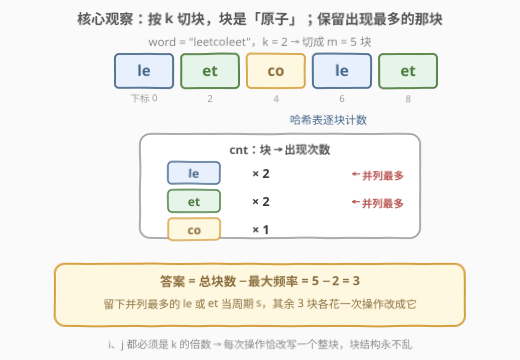
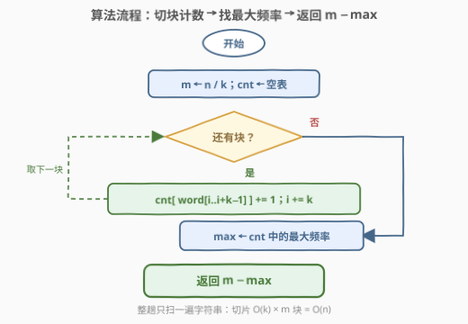
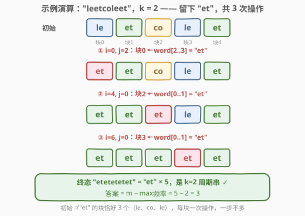

# K 周期字符串需要的最少操作次数

- **题目名称**：K 周期字符串需要的最少操作次数
- **链接**：[3137. K 周期字符串需要的最少操作次数](https://leetcode.cn/problems/minimum-number-of-operations-to-make-word-k-periodic/)
- **难度**：中等
- **标签**：哈希表，字符串，计数

## 1. 题目概述

给你一个长度为 $n$ 的字符串 `word` 和一个整数 $k$，其中 $k$ 是 $n$ 的因数。

在一次操作中，你可以选择任意两个下标 $i$ 和 $j$（$0 \le i, j \lt n$），**这两个下标都可以被 $k$ 整除**，然后用从 $j$ 开始的长度为 $k$ 的子串替换从 $i$ 开始的长度为 $k$ 的子串，即将 `word[i..i+k-1]` 替换为 `word[j..j+k-1]`。

返回使 `word` 成为 **K 周期字符串** 所需的**最少**操作次数。

如果存在某个长度为 $k$ 的字符串 $s$，使得 `word` 可以表示为任意次数连接 $s$，则称 `word` 是 **K 周期字符串**。例如 `word == "ababab"` 就是 $s = \text{"ab"}$ 时的 2 周期字符串。

**示例 1**：

```text
输入：word = "leetcodeleet", k = 4
输出：1
解释：选择 i = 4 和 j = 0，操作后 word 变为 "leetleetleet"。
```

**示例 2**：

```text
输入：word = "leetcoleet", k = 2
输出：3
解释：依次执行 (i=0,j=2)、(i=4,j=0)、(i=6,j=0)：
      "leetcoleet" → "etetcoleet" → "etetetleet" → "etetetetet"。
```

**约束条件**：

- $1 \le n = \text{word.length} \le 10^5$
- $1 \le k \le \text{word.length}$，且 $k$ 能整除 $n$
- `word` 仅由小写英文字母组成

> 💡 读题关键：三个条件各管一件事——**「i、j 都是 k 的倍数」** 保证了替换永远对齐块边界，`word` 的 k 分块结构是**不变式**（操作只是整块搬运内容，块的槽位永远在 $0, k, 2k, \dots$）；**「替换长度恰为 k」** 意味着一次操作恰改写**一个**块；**「终态 = 某个 s 重复 m 次」** 则把问题化归为「$m$ 个块里最少要改掉几个」。三件事叠加，答案呼之欲出。

---

## 2. 解题思路

### 2.1 暴力思路：枚举周期候选，逐块比较

记 $m = n / k$ 为块数。终态必形如 $s^m$（$s$ 重复 $m$ 次）。一个自然的暴力是**枚举周期候选 $s$，数一遍有多少块不等于 $s$**，取最小值。

候选 $s$ 似乎可以是任意小写字母串，但其实**只需枚举现有的块**：若 $s$ 不在初始块中，则 $m$ 个块全是「坏块」，代价 $m$；而取任何一个现有块，代价至多 $m - 1$（它自己那块免费）。所以全新字符串永远不优。

```python
def brute(word, k):
    n, m = len(word), len(word) // k
    blocks = [word[i:i + k] for i in range(0, n, k)]
    return min(sum(b != s for b in blocks) for s in blocks)
```

- 正确性没问题（枚举覆盖了最优 $s$），但每对块比较要 $O(k)$，总计 $O(m^2 k) = O(n \cdot m)$：$n = 10^5$、$k = 1$ 时 $m = 10^5$，约 $10^{10}$ 次字符比较，超时；
- 暴力的价值在于把问题**翻译**清楚了：答案 = $\min_s \, (\text{不等于 } s \text{ 的块数})$。剩下的事只是把「逐个比较」换成「哈希归桶」。

> ⚠️ 更朴素的 BFS/模拟（对每个可达字符串状态搜最短路）完全不可行——状态空间是 $26^{n}$ 级别。本题的突破口不在搜索，而在**计数**。

### 2.2 核心观察：分块计数，保留最大频率的块



**观察一（块结构不变式）**：$i, j$ 都是 $k$ 的倍数，替换又恰好长 $k$，所以每次操作只是**把某个槽位的内容整体换成另一个槽位的当前内容**。$m$ 个块槽位（下标 $0, k, 2k, \dots$）自始至终不动，动的是槽里的字符串。

**观察二（一次操作 = 恰好改写一个块）**：设最终周期为 $s$。一个初始内容 $\ne s$ 的块（「坏块」）若从不被操作改写，它的值永远不会变；而一次操作只碰一个块。于是

$$\text{操作数} \;\ge\; \#\{\text{初始内容} \ne s \text{ 的块}\} \;=\; m - \mathrm{cnt}[s]$$

**观察三（最优 $s$ = 出现次数最多的块）**：上式对任意 $s$ 成立，而 $\mathrm{cnt}[s] \le \max_t \mathrm{cnt}[t]$，故操作数 $\ge m - \max_t \mathrm{cnt}[t]$。又因为 $m \ge 1$ 时最大频率 $\ge 1$，最优 $s$ 必然取自现有块（2.1 已说明全新串不优）。

**达到下界（构造）**：取 $s^*$ 为最大频率的块，固定它的**第一个出现位置** $p$ 作「母版」，全程不改它；对每个内容 $\ne s^*$ 的块，执行一次操作 $(i = \text{该块起点},\ j = p)$ 直接抄成 $s^*$。每步 $i, j$ 都是 $k$ 的倍数，合法；恰好 $m - \max \mathrm{cnt}$ 步完成。

$$\boxed{\text{ans} = \frac{n}{k} - \max_t \mathrm{cnt}[t]}$$

> 💡 **交换论证口味**：等价地说，「保留谁」是一场选举——留 $s$ 的代价是 $m - \mathrm{cnt}[s]$，票数（出现次数）最高的候选人兼职成本最低。哈希表就是开票器。

### 2.3 算法流程图



一遍扫描：$i$ 从 $0$ 步进 $k$，取块 `word[i..i+k-1]` 计入哈希表并顺手维护最大频率 `best`；扫描结束返回 `m - best`。全程只碰每个字符一次（切片 + 哈希各一遍）。

### 2.4 示例演算



**例 1**（`word = "leetcodeleet"`, $k=4$）：块为 `leet` / `code` / `leet`，计数 `leet×2, code×1`，答案 $= 3 - 2 = 1$：执行 $(i=4, j=0)$ 把 `code` 抄成 `leet` ✓。

**例 2**（`word = "leetcoleet"`, $k=2$）：块为 `le` / `et` / `co` / `le` / `et`，计数 `le×2, et×2, co×1`，$m = 5$、最大频率 $2$，答案 $= 5 - 2 = 3$。`le` 与 `et` 并列最多，留谁都行——图中选择留 `et`（示例 2 的官方操作序列即此方案：注意 $j=2$ 指向下标 2 开始的子串 `word[2..3]`，正是块 1 的 `"et"`）。

---

## 3. 参考代码

### C++

```cpp
class Solution {
  public:
    int minimumOperationsToMakeKPeriodic(string word, int k) {
        int n = word.size(), m = n / k;
        unordered_map<string, int> cnt;
        int best = 0;                       // 最大频率，顺手维护
        for (int i = 0; i < n; i += k) {
            best = max(best, ++cnt[word.substr(i, k)]);
        }
        return m - best;
    }
};
```

### Python

```python
from collections import Counter

class Solution:
    def minimumOperationsToMakeKPeriodic(self, word: str, k: int) -> int:
        m = len(word) // k
        cnt = Counter(word[i:i + k] for i in range(0, len(word), k))
        return m - max(cnt.values())
```

> 💡 写法盘点：
> - `++cnt[...]` 返回自增后的值，配合 `max` 把「计数 + 求最大」合并成一次遍历，免掉对哈希表的二次扫描；
> - `k = n`（单块）时 `m = 1`、`best = 1`，答案自然为 0，**无需特判**；全部块相同时 `best = m`，答案同样为 0；
> - C++ 的 `substr` 每块拷贝 $O(k)$ 个字符，总计 $O(n)$，已经达标；追求常数可换 `string_view` 作键（见扩展 5.1）。

---

## 4. 复杂度分析

| 维度 | 复杂度 | 说明 |
|------|--------|------|
| 时间 | $O(n)$ | $m = n/k$ 个块，每块切片 $O(k)$ + 哈希插入 $O(k)$（哈希需读完整字符串），总计 $O(mk) = O(n)$ |
| 空间 | $O(n)$ | 哈希表最多存 $m$ 个互不相同的块，键的总字符数 $\le n$ |
| 正确性 | 下界 + 构造 | 下界：每个坏块至少被一次操作改写，一次操作只碰一个块；构造：母版块不动，每个坏块恰好一次 |

---

## 5. 扩展

### 5.1 C++ 零拷贝：string_view 作键

`unordered_map<string, int>` 每次插入都要把块拷进键里；用 `string_view` 直接视图到 `word` 上，插入与比较都免拷贝：

```cpp
class Solution {
  public:
    int minimumOperationsToMakeKPeriodic(string word, int k) {
        int n = word.size(), m = n / k, best = 0;
        unordered_map<string_view, int> cnt;      // 视图零拷贝
        string_view w = word;
        for (int i = 0; i < n; i += k)
            best = max(best, ++cnt[w.substr(i, k)]);
        return m - best;
    }
};
```

注意 `string_view` 是**非拥有**视图，其指向的 `word` 在哈希表整个生命周期内不可被修改——本题只读不写，安全。若改成 Python，则无此烦恼（切片本身就生成新串，`Counter` 一行了事）。

### 5.2 约束的「含金量」：如果放宽会怎样

- **允许替换成任意长度 k 的字符串**（不限于复制现有块）：答案不变——代价 $= m - \mathrm{cnt}[s]$，全新 $s$ 的 $\mathrm{cnt} = 0$，代价 $m$，永远打不过最大频率 $\ge 1$ 的现有块；
- **允许 $i, j$ 取任意下标**（不必是 $k$ 的倍数）：替换会跨块边界，把两个相邻块搅成「混血」，块结构不变式被打破，问题立刻从「开票计数」恶化为复杂的构造问题。本题的限制条件看似啰嗦，实则是**把题眼护送给你**——读题时识别「哪条约束在守护不变式」是关键功力。

### 5.3 一行解的来历

Python 的核心逻辑可以压成一行：

```python
return len(word) // k - max(Counter(word[i:i + k] for i in range(0, len(word), k)).values())
```

注意切片必须写 `word[i:i+k]`，不能「优化」成 `word[i::k]`——后者是**从 i 起每隔 k 取一个字符**，语义完全不同。一行的代价是可读性，面试中先写清楚、再口头给出紧凑版更稳。

---

## 6. 面试要点

1. **为什么最优周期 $s$ 一定取自现有的块？**

   - 代价 $= m - \mathrm{cnt}[s]$。任何现有块的出现次数 $\ge 1$，故取最大频率块代价 $\le m - 1$；而全新字符串出现次数为 0、代价为 $m$。 $m \ge 1$ 时 $m - \max \mathrm{cnt} \le m - 1 \lt m$，全新串必不优。

2. **下界论证怎么讲才严谨？**

   - 两个事实：①一次操作**恰好改写一个**块（长度 $k$ + 对齐边界保证）；②块的值只有被操作改写才会变化。于是每个「初始 $\ne s$、终态 $= s$」的坏块至少消耗一次针对它的操作，操作总数 $\ge$ 坏块数 $= m - \mathrm{cnt}[s] \ge m - \max\mathrm{cnt}$。

3. **构造方案里，为什么不用担心「源块被覆盖」？**

   - 固定最大频率块的**第一个出现位置**作母版，全程不改它，每次操作都从这里抄。只要母版不动，$m - \max\mathrm{cnt}$ 个坏块各抄一次即全部到位，操作顺序也无关紧要。

4. **复杂度为什么是 $O(n)$ 而不是 $O(n \log n)$ 或更差？**

   - 哈希表单次插入摊还 $O(k)$（字符串哈希本身要读 $k$ 个字符），$m$ 块共 $O(mk) = O(n)$；求最大值再花 $O(m) \le O(n)$。排序去重的话会多一个 $\log$ 因子，纯哈希计数是最优工具。

5. **$k = n$、全部块相同这些边界要特判吗？**

   - 都不用。$k = n$ 时 $m = 1$、`best = 1`，答案 0；全部相同则 `best = m`，答案 0。公式 $m - \max\mathrm{cnt}$ 天然覆盖，特判反而容易画蛇添足。

---

## 7. 同类练习题

- [459. 重复的子字符串](https://leetcode.cn/problems/repeated-substring-pattern/)：判定版——word 本身是否周期串（KMP 最小周期 / 倍增法），与本题「构造最少代价版」互为镜像
- [3005. 最大频率元素计数](https://leetcode.cn/problems/count-elements-with-maximum-frequency/)（[站内题解](../3001-3100/3005_最大频率元素计数.md)）：同款「哈希计数 + 最大频率」骨架，把字符串块换成数组元素
- [3085. 成为K特殊字符串需要删除的最少字符数](https://leetcode.cn/problems/minimum-deletions-to-make-string-k-special/)（[站内题解](../3001-3100/3085_成为K特殊字符串需要删除的最少字符数.md)）：频率统计 + 最少操作的另一变体（枚举保留的频率窗口做决策）
- [686. 重复叠加字符串匹配](https://leetcode.cn/problems/repeated-string-match/)：周期串家族——问 $b$ 要叠加几次 $a$ 才包含 $b$，从「消耗周期」的方向运用同一结构
- [3031. 将单词恢复初始状态所需的最短时间 II](https://leetcode.cn/problems/minimum-time-to-revert-word-to-initial-state-ii/)（[站内题解](../3001-3100/3031_将单词恢复初始状态所需的最短时间II.md)）：同为「按 k 步操作字符串 + 前后缀/周期结构判定」，对照哈希计数与 Z 函数两种工具选型
