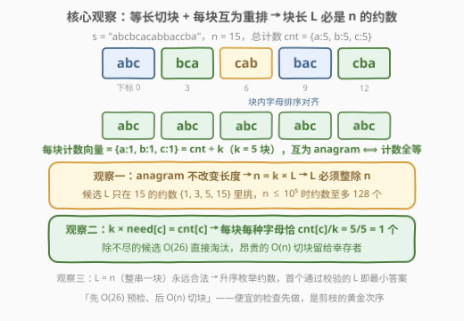
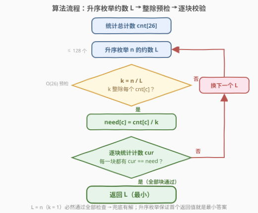
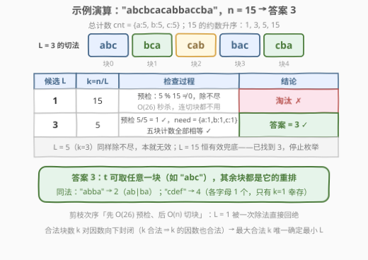

# LeetCode 同位字符串连接的最小长度 题解

## 1. 题目概述

- **标题 / 题号**：同位字符串连接的最小长度（#3138，medium）
- **链接**：https://leetcode.cn/problems/minimum-length-of-anagram-concatenation/
- **难度**：中等
- **标签**：哈希表，字符串，计数

**题意**：给你一个字符串 `s`，它由某个字符串 `t` 和**若干** `t` 的**同位字符串**连接而成。

请你返回字符串 `t` 的**最小**可能长度。

**同位字符串**（anagram，即字母异位词）指的是重新排列一个字符串的字母得到的另外一个字符串。例如 `"aab"`、`"aba"` 和 `"baa"` 是 `"aab"` 的同位字符串。注意：重排不改变长度，也不改变字母多重集。

**示例 1**：

```text
输入：s = "abba"
输出：2
解释：一个可能的字符串 t 为 "ba"（"ab" + "ba"，两段互为重排）。
```

**示例 2**：

```text
输入：s = "cdef"
输出：4
解释：一个可能的字符串 t 为 "cdef"，注意 t 可能等于 s。
```

**示例 3**：

```text
输入：s = "abcbcacabbaccba"
输出：3
```

**约束**：

- $1 \le \text{s.length} \le 10^5$
- `s` 只包含小写英文字母

> 💡 读题关键：把「t 和若干 t 的同位字符串连接」翻译成结构语言——`s` 一定被切成了**若干等长的块**，且**每块互为 anagram**（每块的字母多重集相同）。要求的不过是**最小块长**。两条不变式（等长、同多重集）就是全部题眼。

## 2. 解题思路

### 2.1 暴力思路：枚举块长，逐块数字母

最直接的暴力：**枚举块长 $L = 1 \dots n$**，对每个 $L$ 把 `s` 切成块（切不出整数块即失败），统计每块的 26 维计数向量，检查是否全部相同：

```python
def brute(s):
    n = len(s)
    for L in range(1, n + 1):
        blocks = [s[i:i + L] for i in range(0, n, L)]
        if any(len(b) != L for b in blocks):      # 有零头，L 不合法
            continue
        cnts = [Counter(b) for b in blocks]
        if all(c == cnts[0] for c in cnts]:       # 每块多重集相同
            return L
```

- 正确性没问题，但几乎每个 $L$ 都要至少扫掉前几块才能判定失败，单次 $O(n)$，总计 $O(n^2)$：$n = 10^5$ 时约 $10^{10}$ 次字符操作，**超时**；
- 暴力的价值在于把判定条件写清楚了：「**每块等长 + 计数向量全等**」。剩下的事是让绝大多数候选 $L$ **死得更快**——能不扫字符串就不扫。

> ⚠️ 更蛮力的做法是直接枚举 $t$ 的内容（$26^L$ 种），完全不可行。突破口不在「生成」，而在「**剪枝 + 计数**」。

### 2.2 核心观察：答案必是 n 的约数 + 计数整除预检 + 逐块校验



**观察一（块长必整除 $n$）**：anagram 不改变长度，`s` 的每一段长度都是 $|t| = L$，$k$ 段拼起来 $n = k \times L$。所以 $L$ 只能取 $n$ 的**约数**——候选从 $10^5$ 个锐减到 $\tau(n) \le 128$ 个（$n \le 10^5$ 时取到最大值的毒瘤是 $83\,160$）。单此一条，复杂度就降为 $O(n \cdot \tau(n))$，已经过关。

**观察二（anagram ⟺ 计数向量相同）**：互为重排 ⟺ 字母多重集相同 ⟺ 26 维计数向量相同（242 的经典等价）。于是「每块都是 $t$ 的重排」可以**纯计数**判定，块的内部顺序无关紧要。

**观察三（计数均分 → 整数性预检）**：设各块共同的计数向量为 $\mathrm{need}$，则 $k$ 块加起来恰是总计数：

$$k \cdot \mathrm{need}[c] = \mathrm{cnt}[c] \quad\Longrightarrow\quad \mathrm{need}[c] = \mathrm{cnt}[c] / k \ \text{必须整除}$$

这给出一个 $O(26)$ 的**必要条件**：$k$ 必须整除**每个** $\mathrm{cnt}[c]$（等价于整除它们的 gcd）。不满足的直接淘汰，**连 `s` 都不用碰**；满足时目标 $\mathrm{need}$ 也被唯一确定，逐块校验有了明确参照物。

$$\boxed{\text{ans} = \min\Big\{\, L : L \mid n,\ \ \mathrm{count}\big(s[jL..(j{+}1)L)\big) = \mathrm{cnt}/k \ \ \forall j \,\Big\}}$$

> 💡 **兜底与枚举顺序**：$L = n$（$k = 1$，整串一块）永远合法，候选集非空；从小到大枚举约数，**首个通过校验的 $L$ 即最小答案**。实战里「先 $O(26)$ 预检、后 $O(n)$ 切块」的次序很关键——如 `"cdef"` 四种字母各 1 个，除 $k=1$ 外全部除不尽，一次切块扫描都不用做。

### 2.3 算法流程图



一遍统计总计数，然后升序枚举 $n$ 的约数 $L$：先用 $k = n/L$ 做整除预检构造 $\mathrm{need}$，再逐块数一遍与 $\mathrm{need}$ 比较；任一环节失败就换下一个约数，全部通过立即返回。$L = n$ 必然通过所有检查，循环保证终止。

### 2.4 示例演算



**例 3**（`s = "abcbcacabbaccba"`，$n = 15$，$\mathrm{cnt} = \{a{:}5, b{:}5, c{:}5\}$），15 的约数升序 $\{1, 3, 5, 15\}$：

- $L = 1$：$k = 15$，预检 $5 \bmod 15 \ne 0$，除不尽 → 淘汰（一次切块都没做）；
- $L = 3$：$k = 5$，预检 $5/5 = 1$ ✓，$\mathrm{need} = \{a{:}1, b{:}1, c{:}1\}$；切块 `abc | bca | cab | bac | cba`，五块计数全等 ✓ → **答案 3**（$t$ 可取任意一块，如 `"abc"`）。

顺带一提：$L = 5$（$k = 3$）同样除不尽 5，本就无效；$L = 15$（$k = 1$）整串一块恒有效——它是**兜底**，不是答案。

**例 1**（`"abba"`，$n=4$，$\mathrm{cnt}=\{a{:}2,b{:}2\}$）：$L=1$：$k=4$，$2 \bmod 4 \ne 0$ ✗；$L=2$：$k=2$，$\mathrm{need}=\{a{:}1,b{:}1\}$，块 `ab | ba` ✓ → 2。

**例 2**（`"cdef"`，$n=4$，四种字母各 1 个）：$L=1,2$ 都除不尽 ✗；$L=4$：$k=1$ ✓ → 4。只有 $k=1$ 幸存——$t$ 只能是 `s` 自己。

## 3. 参考代码

### C++

```cpp
class Solution {
  public:
    int minAnagramLength(string s) {
        int n = s.size();
        array<int, 26> cnt{};
        for (char c : s) cnt[c - 'a']++;

        for (int L = 1; L <= n; ++L) {
            if (n % L) continue;                     // 观察一：块长必是 n 的约数
            int k = n / L;                           // 块数
            array<int, 26> need{};
            bool ok = true;
            for (int c = 0; c < 26; ++c) {           // 观察三：整数性预检
                if (cnt[c] % k) { ok = false; break; }
                need[c] = cnt[c] / k;
            }
            if (!ok) continue;
            for (int i = 0; i < n && ok; i += L) {   // 观察二：逐块计数校验
                array<int, 26> cur{};
                for (int j = i; j < i + L; ++j) cur[s[j] - 'a']++;
                if (cur != need) ok = false;         // 首个坏块即淘汰，早退
            }
            if (ok) return L;                        // 升序枚举，首个即最小
        }
        return n;                                    // L = n 兜底，不可达
    }
};
```

### Python

```python
from collections import Counter

class Solution:
    def minAnagramLength(self, s: str) -> int:
        n = len(s)
        cnt = Counter(s)
        for L in range(1, n + 1):
            if n % L:
                continue                              # 观察一：块长必是 n 的约数
            k = n // L
            if any(v % k for v in cnt.values()):      # 观察三：整数性预检
                continue
            need = {c: v // k for c, v in cnt.items()}
            if all(Counter(s[i:i + L]) == need        # 观察二：逐块计数校验
                   for i in range(0, n, L)):
                return L
        return n
```

> 💡 写法盘点：
> - `all(...)` 传的是生成器，惰性求值天然**早退**——首个坏块出现后不再继续切块；
> - `Counter(block) == need` 直接比较字典：`v % k == 0` 且 `v ≥ 1` 保证 `need` 的值全为正、键恰是 `s` 中出现过的字母，两侧键集对得上，比较语义安全（Python 3.10 前后行为一致）；
> - $k = 1$ 时 `need = cnt`、单块即整串，$L = n$ 自然兜底，**无需特判**；`s` 全同字符时 $L = 1$ 在第一轮就命中，也无需特判。

## 4. 复杂度分析

| 维度 | 复杂度 | 说明 |
|------|--------|------|
| 时间 | $O(n \cdot \tau(n) + 26 \cdot \sigma(n))$ | 候选只有 $\tau(n) \le 128$ 个约数；每个候选预检 $O(26)$、逐块校验 $O(n + 26k)$（$k = n/L$ 为块数，逐块比较 $O(26)$）；$\sigma(n) = \sum_{L \mid n} n/L \lt 4.2n$。$n = 10^5$ 时最坏约 $2 \times 10^7$ 次基本操作，轻松通过 |
| 空间 | $O(26)$ | 三个 26 维计数数组：总计数 `cnt`、目标 `need`、当前块 `cur` |
| 正确性 | 必要剪枝 + 充分校验 | $L \mid n$ 与 $k \mid \mathrm{cnt}[c]$ 是任何合法 $t$ 的必要条件（不会漏解）；「每块计数 = need」充分保证互为 anagram；$L = n$ 恒合法保证有解 |

## 5. 扩展

### 5.1 候选再剪枝：块数 k 必须整除 gcd(cnt)

「$k$ 整除每个 $\mathrm{cnt}[c]$」等价于 $k \mid g$，其中 $g = \gcd_c \mathrm{cnt}[c]$。而 $g$ 整除每个计数，自然整除它们的和 $n$——所以 **$g$ 的约数自动都是 $n$ 的约数**，合法块数全部藏在 $g$ 的约数里。把枚举对象从「$n$ 的约数 $L$（升序）」换成「$g$ 的约数 $k$（降序）」，首个通过校验的 $k$ 即最大块数，答案 $= n/k$：

```python
from math import gcd, isqrt
from functools import reduce
from collections import Counter

class Solution:
    def minAnagramLength(self, s: str) -> int:
        n = len(s)
        cnt = Counter(s)
        g = reduce(gcd, cnt.values())              # 合法块数 k 必须整除 g（且 g | n）
        ks = sorted({d for i in range(1, isqrt(g) + 1)
                       for d in (i, g // i) if g % i == 0}, reverse=True)
        for k in ks:                               # k 从大到小 → L 从小到大
            L = n // k
            need = {c: v // k for c, v in cnt.items()}
            if all(Counter(s[i:i + L]) == need for i in range(0, n, L)):
                return L
        return n
```

合法块数还有一个漂亮的**结构性质**：对因数**向下封闭**——若 $k$ 合法且 $k' \mid k$，把每 $k/k'$ 个相邻块合并成大块，各块计数同乘 $k/k'$ 仍全等，故 $k'$ 也合法。因此「最大合法 $k$」存在且唯一确定答案。实战收益：字符集只有 26 种，$g$ 的约数通常远少于 $n$ 的约数；如 `"cdef"` 的 $g = 1$，只剩 $k = 1$ 一个候选，答案秒出。

### 5.2 姊妹题对照：459 重复的子字符串

把「同位重排」收紧为「完全相同」，本题退化为判定 $s = t^k$（$k > 1$）是否存在——即 459。459 有基于 KMP 失配数组的 $O(n)$ 解法：最小周期 $p = n - \pi[n-1]$，$s$ 是重复串 $\iff p \mid n$ 且 $p < n$。本题为什么用不了同款姿势？失配数组的传递性建立在**逐字符相等**之上，而重排把位置信息完全打乱——`"abba"` 的精确周期是 4，anagram 周期却是 2（`ab | ba`），失配结构对「计数同构」视而不见。于是趁手的兵器从字符串周期结构换成了 26 维计数向量：**条件一放松，工具就得换**，这正是字符串题的工具箱思维。

## 6. 面试要点

1. **为什么答案 $L$ 一定整除 $n$？**

   - anagram 不改变长度：`s` 的每一段都长 $|t| = L$，$k$ 段拼起来 $n = kL$。候选集从 $[1, n]$ 缩到 $n$ 的约数（$\le 128$ 个），这是复杂度从 $O(n^2)$ 降到可用的第一步。

2. **「每块都是 t 的同位字符串」如何等价成可判定的条件？**

   - 互为 anagram ⟺ 26 维计数向量相同；再由「$k$ 块计数之和 = 总计数」得每块向量唯一确定为 $\mathrm{cnt}/k$。判定 = 逐块数一遍与 $\mathrm{need}$ 比较，无需关心块内顺序，更无需枚举 $t$ 的内容。

3. **整数性预检（k 整除每个 cnt[c]）为什么值得单独做？会不会误杀？**

   - 它是必要条件：$\mathrm{need}[c] = \mathrm{cnt}[c]/k$ 必须是非负整数。绝不误杀——这是任何合法方案都满足的等式约束；预检只花 $O(26)$，却让多数候选免掉 $O(n)$ 的切块扫描（`"cdef"` 类输入连一次扫描都不用）。

4. **最坏时间复杂度怎么估？$n = 10^5$ 会不会超？**

   - 每个约数一次 $O(n + 26k)$ 校验，总计 $O(n\,\tau(n) + 26\,\sigma(n))$；$n \le 10^5$ 时 $\tau(n) \le 128$、$\sigma(n) \lt 4.2n$，最坏约 $2 \times 10^7$ 次基本操作。要点是会用 $\tau/\sigma$ 的量级说话，而不是含糊地报一个 $O(n\sqrt n)$。

5. **为什么从小到大枚举？循环一定终止吗？**

   - 要的是最小 $L$，升序首个命中即答案。$L = n$（$k=1$，整串一块）永远合法——`need = cnt`、单块自相等——循环最迟在 $L = n$ 处返回，代码末尾的 `return n` 只是形式上的保险。

## 同类练习题

| # | 题目 | 与本题的关联 |
|---|------|-------------|
| 242 | [有效的字母异位词](https://leetcode.cn/problems/valid-anagram/)（[站内题解](../0201-0300/242_有效的字母异位词.md)） | 本题逐块校验的原子操作——26 维计数向量判定两串互为重排 |
| 438 | [找到字符串中所有字母异位词](https://leetcode.cn/problems/find-all-anagrams-in-a-string/)（[站内题解](../0401-0500/438_找到字符串中所有字母异位词.md)） | 定长窗口 + 计数比较的滑窗写法，可把本题的逐块统计改造成增量维护 |
| 459 | [重复的子字符串](https://leetcode.cn/problems/repeated-substring-pattern/)（[站内题解](../0401-0500/459_重复的子字符串.md)） | 把「同位重排」收紧为「完全相同」的姊妹题，KMP 失配数组 $O(n)$ 判定，与本题的对照见 5.2 |
| 567 | [字符串的排列](https://leetcode.cn/problems/permutation-in-string/)（[站内题解](../0501-0600/567_字符串的排列.md)） | 定长子串是否为某串的排列（anagram），同款计数滑窗 |
| 3137 | [K 周期字符串需要的最少操作次数](https://leetcode.cn/problems/minimum-number-of-operations-to-make-word-k-periodic/)（[站内题解](../3101-3200/3137_K周期字符串需要的最少操作次数.md)） | 同款「等长分块 + 哈希计数」骨架——那边问最少改几块，这边问块最短能多短 |
