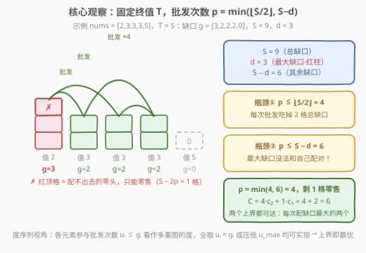
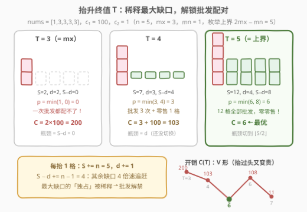
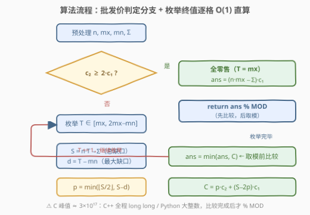
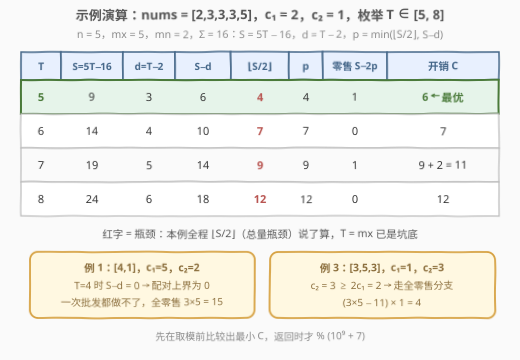

# LeetCode 使数组中所有元素相等的最小开销 题解

## 1. 题目概述

- **标题 / 题号**：使数组中所有元素相等的最小开销（#3139，hard）
- **链接**：https://leetcode.cn/problems/minimum-cost-to-equalize-array/
- **难度**：困难
- **标签**：贪心，数组，枚举

**题意**：给你一个整数数组 `nums` 和两个整数 `cost1`、`cost2`。你可以执行以下**任一**操作**任意**次：

- 选择一个下标 $i$，将 $nums[i]$ **增加** $1$，开销为 $c_1$（**零售**：花一份钱买一个 +1）；
- 选择两个**不同**下标 $i \ne j$，将 $nums[i]$ 和 $nums[j]$ **都增加** $1$，开销为 $c_2$（**批发**：花一份钱买两个 +1）。

目标是使数组中所有元素**相等**，返回**最小开销**对 $10^9 + 7$ 取模的结果。

**示例 1**：

```text
输入：nums = [4,1], cost1 = 5, cost2 = 2
输出：15
解释：只能把 1 单独加三次（两个元素一起加不改变差距），总开销 3 × 5 = 15。
```

**示例 2**：

```text
输入：nums = [2,3,3,3,5], cost1 = 2, cost2 = 1
输出：6
解释：批发 4 次 + 零售 1 次：4 × 1 + 1 × 2 = 6。
```

**示例 3**：

```text
输入：nums = [3,5,3], cost1 = 1, cost2 = 3
输出：4
解释：c₂ = 3 ≥ 2c₁ = 2，批发不划算，全部零售：(3×5−11) × 1 = 4。
```

**约束**：

- $1 \le \text{nums.length} \le 10^5$
- $1 \le \text{nums}[i] \le 10^6$
- $1 \le \text{cost1}, \text{cost2} \le 10^6$

> 💡 读题三个关键：① 操作**只能加不能减**，终值 $T \ge \max(\text{nums})$；② 操作 2 是「一次买两个 +1」的批发价，但**必须落在两个不同元素上**；③ 答案要取模，但**最小化的比较必须发生在取模之前**（模完大小关系就乱了）。

## 2. 解题思路

### 2.1 暴力思路：枚举终值 + 逐对模拟

最直白的做法：枚举终值 $T$（从 $mx$ 到某个上界），再用**优先队列模拟**填缺口——每次弹出缺口最大的两个元素做一次操作 2，只剩一个非零缺口时改用操作 1。单轮模拟 $O(n \log n)$，乘上值域 $10^6$ 个候选 $T$，总量 $10^{11}$ 级别，**超时**；至于对数组状态做 BFS，状态空间是天文数字，更不可行。

暴力的价值在于把问题**定型**：一旦 $T$ 固定，每个元素的缺口 $g_i = T - \text{nums}[i]$ 就完全确定，剩下的是一个纯组合问题——「给定缺口，批发最多能用几次」。这个问题如果能 $O(1)$ 回答，枚举就能降为 $O(1)$ 每格。

> ⚠️ 真正的坑藏在别处：$T = mx$ 未必最优（见 2.2 观察四），所以不能只算一个 $T$ 就收工。

### 2.2 核心观察：批发价判定 + 配对双瓶颈 + 抬目标解锁



记 $n$ 为数组长度，$mx$、$mn$ 为最大/最小值，$\Sigma$ 为元素和，$c_1, c_2$ 为零售/批发单价。

**观察一（终值下界）**：操作只能加不能减，故终值 $T \ge mx$，且每个元素的缺口 $g_i = T - \text{nums}[i] \ge 0$。

**观察二（批发不划算就全零售）**：若 $c_2 \ge 2 c_1$，任何一次批发都可替换成两次零售而不更贵，于是全部零售、终值取 $T = mx$（再抬只会多买）：

$$\text{ans} = (n \cdot mx - \Sigma) \cdot c_1$$

示例 3 走的就是这条路（$3 \ge 2$，答案 4）。

**观察三（配对双瓶颈）**：固定 $T$，记**总缺口** $S = \sum g_i = nT - \Sigma$，**最大缺口** $d = \max g_i = T - mn$。一次批发消耗**两个不同元素**的各 1 格缺口，设批发次数为 $p$：

- 每次批发消耗 2 格总缺口 $\Rightarrow p \le \lfloor S/2 \rfloor$；
- 最大缺口那个元素**没法和自己配对**，每次批发至少落在 1 个非最大缺口元素上 $\Rightarrow p \le S - d$。

两个上界**都可以取到**：把「元素 $i$ 参与批发的次数 $u_i \le g_i$」看成允许重边、不许自环的**多重图度序列**——度序列可实现 $\iff$ 总度为偶数且最大度 $\le$ 其余度之和。全取 $u_i = g_i$ 时条件即 $d \le S - d$；不成立时把 $u_{\max}$ 压到 $S - d$，总度 $2(S-d)$，恰好合法。两种取法的总度分别是 $S$ 与 $2(S-d)$，除 2 取整即得：

$$\boxed{\;p = \min\Big(\Big\lfloor \frac{S}{2} \Big\rfloor,\ S - d\Big),\qquad C(T) = p\,c_2 + (S - 2p)\,c_1\;}$$

其中 $S - 2p$ 是配不出去的零头，只能零售。（直观贪心：每次挑当前缺口**最大的两个**元素配对，同样能达到 $p$ 次。）

**观察四（抬升目标解锁批发）**：$T = mx$ 未必最优！每抬 1 格：$S \mathrel{+}= n$，$d \mathrel{+}= 1$，于是 $S - d \mathrel{+}= n - 1$——**其余缺口以 $n-1$ 每格的速度稀释最大缺口的「独占」**。当 $d$ 是瓶颈且 $c_2 \ll c_1$ 时，抬 $T$ 反而更省。



那么枚举到多高为止？**上界是 $2mx - mn$**，证明分三段：

- **瓶颈切换点**：$d \le S - d \iff (n-2)T \ge \Sigma - 2mn$（$n > 2$）。代入 $\Sigma \le (n-1)mx + mn$ 验算：$T = 2mx - mn$ 时左边减右边 $\ge (n-3)(mx - mn) \ge 0$，即**切换点必 $\le 2mx - mn$**；且切换后差距每格再扩大 $n-2$，瓶颈永远是 $\lfloor S/2 \rfloor$。
- **切换前**（$d$ 瓶颈段）：$p = S - d$，$C(T) = (S-d)c_2 + (2d-S)c_1$ 是 $T$ 的**线性函数**，斜率 $(n-1)c_2 - (n-2)c_1$——最值只会落在段端点。
- **切换后**（总量瓶颈段）：$T$ 每加 2，$S$ 增 $2n$、$p$ 增 $n$，$C(T+2) - C(T) = n c_2 > 0$——隔步严格递增，只需再看切换点后 1 格；若切换点恰落在右端点 $2mx - mn$，代回可得 $S = 4(mx - mn)$ 为偶数、已全部配对，再抬必更贵。

$n = 2$ 时两个缺口同步增长、差距恒为 $mx - mn$ 只能零售抹平，$T = mx$ 最优（落在枚举区间左端）；$n = 1$ 天然相等，枚举区间退化为单点、答案 0。综上，**枚举 $T \in [mx,\ 2mx - mn]$ 必含全局最优**。

### 2.3 算法流程图



一次线性扫描拿到 $n, mx, mn, \Sigma$；先判批发价：$c_2 \ge 2c_1$ 直接全零售返回。否则逐格枚举 $T$，每格用三条公式（$S$、$d$、$p$）$O(1)$ 算出开销，维护未取模的最小值，循环结束再取模返回。

### 2.4 示例演算



**例 2**（`nums = [2,3,3,3,5]`，$c_1 = 2$，$c_2 = 1$；$n = 5$，$mx = 5$，$mn = 2$，$\Sigma = 16$，枚举区间 $[5, 8]$）：

| $T$ | $S = 5T - 16$ | $d = T - 2$ | $S - d$ | $\lfloor S/2 \rfloor$ | $p$ | 零售 $S - 2p$ | $C(T)$ |
|-----|------------|------------|---------|-----------------|-----|------------|--------|
| **5** | 9 | 3 | 6 | **4** | 4 | 1 | $4 \times 1 + 1 \times 2 = \mathbf{6}$ |
| 6 | 14 | 4 | 10 | **7** | 7 | 0 | 7 |
| 7 | 19 | 5 | 14 | **9** | 9 | 1 | $9 + 2 = 11$ |
| 8 | 24 | 6 | 18 | **12** | 12 | 0 | 12 |

全程 $\lfloor S/2 \rfloor \le S - d$（总量瓶颈），$T = mx$ 就是坑底，答案 **6**。

**例 1**（`[4,1]`）：$T = 4$ 时缺口 $[0, 3]$，$S - d = 0$——配对上界为 0，一次批发都做不了，只能零售 $3 \times 5 = 15$。**例 3**（`[3,5,3]`）：$c_2 \ge 2c_1$，走全零售分支得 4。

## 3. 参考代码

### C++

```cpp
class Solution {
  public:
    int minCostToEqualize(vector<int>& nums, int cost1, int cost2) {
        const long long MOD = 1'000'000'007;
        const long long n = nums.size();
        const long long mx = *max_element(nums.begin(), nums.end());
        const long long mn = *min_element(nums.begin(), nums.end());
        const long long total = accumulate(nums.begin(), nums.end(), 0LL);
        const long long c1 = cost1, c2 = cost2;

        if (c2 >= 2 * c1)                                // 观察二：批发不划算，全部零售
            return (n * mx - total) * c1 % MOD;

        long long ans = LLONG_MAX;
        for (long long T = mx; T <= 2 * mx - mn; ++T) {  // 观察四：枚举终值
            long long S = n * T - total;                 // 总缺口
            long long d = T - mn;                        // 最大缺口
            long long p = min(S / 2, S - d);             // 观察三：批发次数
            ans = min(ans, p * c2 + (S - 2 * p) * c1);   // 取模之前比较！
        }
        return ans % MOD;
    }
};
```

### Python

```python
class Solution:
    def minCostToEqualize(self, nums: List[int], cost1: int, cost2: int) -> int:
        MOD = 10 ** 9 + 7
        n = len(nums)
        mx, mn, total = max(nums), min(nums), sum(nums)

        if cost2 >= 2 * cost1:                           # 观察二：批发不划算，全部零售
            return (n * mx - total) * cost1 % MOD

        ans = inf
        for T in range(mx, 2 * mx - mn + 1):             # 观察四：枚举终值
            S = n * T - total                            # 总缺口
            d = T - mn                                   # 最大缺口
            p = min(S // 2, S - d)                       # 观察三：批发次数
            ans = min(ans, p * cost2 + (S - 2 * p) * cost1)  # 取模之前比较！
        return ans % MOD
```

> 💡 写法盘点：
> - **无特判**：$n = 1$ 时区间退化为单点 $T = mx$、$S = 0$、答案 0；$n = 2$ 时公式自然给出 $(mx - mn)c_1$——都被统一框架覆盖；
> - **溢出**：$S \le n \cdot 2mx \approx 2 \times 10^{11}$，$C$ 峰值约 $3 \times 10^{17}$，`long long`（上限 $9.2 \times 10^{18}$）全程安全，`int` 必炸；
> - Python 大整数天然无溢出，`min` 在取模前比较即可。

## 4. 复杂度分析

| 维度 | 复杂度 | 说明 |
|------|--------|------|
| 时间 | $O(n + (mx - mn))$ | 预处理一次线性扫描；枚举至多 $mx - mn + 1 \le 10^6 + 1$ 个终值，每格三条公式 $O(1)$ 直算，总计远低于 $3 \times 10^6$ 次基本运算 |
| 空间 | $O(1)$ | 只维护 $n, mx, mn, \Sigma, S, d, p$ 等标量 |
| 正确性 | 上界可达 + 区间覆盖 | $p$ 的双上界 $\min(\lfloor S/2 \rfloor,\ S - d)$ 均可达（度序列论证）；瓶颈切换点 $\le 2mx - mn$ 且两段各自单调 ⟹ 枚举区间必含全局最优 |

## 5. 扩展

### 5.1 O(n) 闭式：只查常数个候选终值

枚举版每格 $O(1)$ 已经过关，但 2.2 的分段单调性其实给出了 $O(n)$ 版本：$d$ 瓶颈段是线性函数（斜率 $(n-1)c_2 - (n-2)c_1$），总量瓶颈段隔 2 步递增，所以全局最优只可能在 $\{mx,\ T^* - 1,\ T^*,\ T^* + 1\}$ 里，其中切换点

$$T^* = \max\Big(mx,\ \Big\lceil \tfrac{\Sigma - 2mn}{n - 2} \Big\rceil\Big) \qquad (n > 2)$$

```python
def solve_O_n(nums, c1, c2):
    n = len(nums); mx, mn = max(nums), min(nums); total = sum(nums)
    if c2 >= 2 * c1 or n <= 2:
        return (n * mx - total) * c1
    Ts = max(mx, -(-(total - 2 * mn) // (n - 2)))        # 瓶颈切换点
    def C(T):
        S = n * T - total; d = T - mn
        p = min(S // 2, S - d)
        return p * c2 + (S - 2 * p) * c1
    return min(C(T) for T in {mx} | {t for t in (Ts - 1, Ts, Ts + 1)
                                    if mx <= t <= 2 * mx - mn})
```

四格里取最小（$T^* - 1$ 是 $d$ 瓶颈段斜率为负时的右端点，$T^*, T^*+1$ 覆盖总量段的两种奇偶）。面试里先写枚举版说清正确性，再补这句「其实只需查 4 个点」，是很好的加分项。

### 5.2 模运算的两个坑

- **先取模再比 min 是错的**：例如 $C_1 = 10^9 + 6$ 与 $C_2 = 10^9 + 8$，取模后变成 $10^9 + 6$ 与 $1$，大小关系彻底失真。必须在**取模前**用完整数值比较（C++ 用 `long long`，Python 用大整数），只在**返回前**取一次模。
- **中途乘法溢出**：$S$ 本身可达 $2 \times 10^{11}$，与 $c_1 \le 10^6$ 相乘约 $2 \times 10^{17}$，超过 32 位整型 4 个数量级——这道题几乎是专为「忘了 `long long`」设计的陷阱。

## 6. 面试要点

1. **为什么终值 $T \ge mx$？枚举上界 $2mx - mn$ 怎么来的？**

   - 操作只能加不能减，故 $T \ge mx$。切换点 $(n-2)T \ge \Sigma - 2mn$ 代入 $\Sigma \le (n-1)mx + mn$ 可证 $\le 2mx - mn$；切换前 $C(T)$ 线性、切换后每抬 2 格增 $n c_2$，最值必在 $\{mx, T^*-1, T^*, T^*+1\}$，全部落在 $[mx, 2mx - mn]$ 内。

2. **固定 $T$ 后批发次数为什么是 $\min(\lfloor S/2 \rfloor, S - d)$？两个上界为什么可达？**

   - 上界一：每次批发吃 2 格总缺口；上界二：最大缺口元素无法和自己配，每次批发至少占用 1 格「其余缺口」。可达性：把各元素参与批发次数看作允许重边的度序列，全取 $u_i = g_i$（总度 $S$）或把 $u_{\max}$ 压到 $S - d$（总度 $2(S-d)$），均满足「最大度 ≤ 其余度之和」的可实现条件。

3. **$T = mx$ 什么时候不是最优？**

   - $d$ 是瓶颈（$d > S - d$，即最小值远远落后于大部队）且 $c_2 \ll c_1$ 时。典型例子 `[1,3,3,3,3]`、$c_1 = 100$、$c_2 = 1$：$T = 3$ 时 $S - d = 0$ 配不了对，开销 200；抬到 $T = 5$ 瓶颈切到 $\lfloor S/2 \rfloor$，全部批发，开销 6。每抬 1 格 $S - d$ 增 $n-1$ 而 $d$ 只增 1，「独裁」被稀释。

4. **$c_2 \ge 2c_1$ 为什么单独处理？边界 $c_2 = 2c_1$ 呢？**

   - 替换论证：一次批发 ⟶ 两次零售，花费不增，所以批发一次都不用，$T = mx$ 全零售。$c_2 = 2c_1$ 时两种策略等价，走哪个分支答案都相同。

5. **取模和溢出分别要注意什么？**

   - 比较最小值必须在取模前（模后大小关系失真）；C++ 全程 `long long`（峰值约 $3 \times 10^{17}$），只在最后返回时取模一次。

## 同类练习题

| # | 题目 | 与本题的关联 |
|---|------|-------------|
| 453 | [最小操作次数使数组元素相等](https://leetcode.cn/problems/minimum-moves-to-equal-array-elements/)（[站内题解](../0401-0500/453_最小操作次数使数组元素相等.md)） | 「$n-1$ 个元素 +1 ⟺ 选中元素 −1」的等价转化，本题退化为单一零售价时的亲戚 |
| 462 | [最小操作次数使数组元素相等 II](https://leetcode.cn/problems/minimum-moves-to-equal-array-elements-ii/)（[站内题解](../0401-0500/462_最小操作次数使数组元素相等II.md)） | ±1 都允许时中位数是最优目标——对照本题「只能加」逼出的 $T \ge mx$ 与抬升目标 |
| 2226 | [每个小孩最多能分到多少糖果](https://leetcode.cn/problems/maximum-candies-allocated-to-k-children/)（[站内题解](../2201-2300/2226_每个小孩最多能分到多少糖果.md)） | 同款「猜目标值 + $O(n)$ 验证」骨架，那边验证函数单调可二分，这边开销 $C(T)$ 是 V 形只能扫描或上闭式 |
| 2064 | [分配给商店的最多商品的最小值](https://leetcode.cn/problems/minimized-maximum-of-products-distributed-to-any-store/)（[站内题解](../2001-2100/2064_分配给商店的最多商品的最小值.md)） | 二分目标值 + 贪心验证的又一实例，与本题共同练熟「枚举目标的正确姿势」 |
