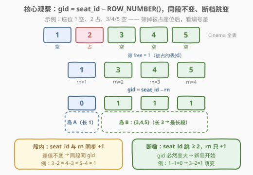
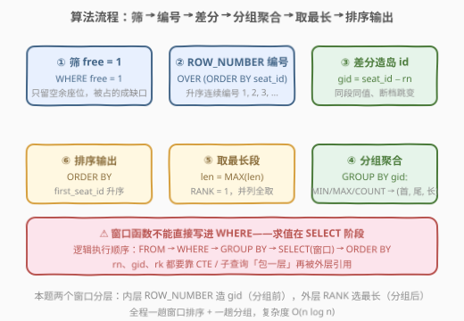
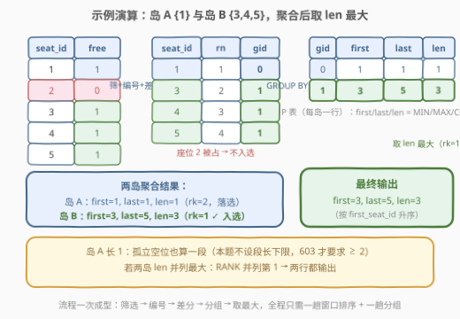

# LeetCode 连续空余座位 II 题解

## 1. 题目概述

- **标题 / 题号**：连续空余座位 II（#3140，medium）
- **链接**：https://leetcode.cn/problems/consecutive-available-seats-ii/
- **难度**：中等
- **标签**：数据库、SQL、Gaps and Islands、窗口函数、`ROW_NUMBER`、连续性问题

> ⚠️ 本题为 LeetCode 付费题（Plus 会员专享），题意描述根据官方示例用例与外部资料重建，可能与官方题面有出入。

**题意**：给定 `Cinema` 表，每行记录一个座位的占用情况：座位号 `seat_id` 与空闲标志 `free`（`1` 表示空余，`0` 表示被占）。编写 SQL 查询，找出影厅里**最长的连续空余座位段**，输出该段的首座位号 `first_seat_id`、尾座位号 `last_seat_id` 与段长 `consecutive_seats_len`，按 `first_seat_id` **升序**返回。

**表结构**：

```text
Table: Cinema
+-------------+------+
| Column Name | Type |
+-------------+------+
| seat_id     | int  |  ← 自增列
| free        | bool |  ← 1=空余，0=占用
+-------------+------+
```

**示例 1**：

```text
输入：
Cinema 表:
+---------+------+
| seat_id | free |
+---------+------+
| 1       | 1    |
| 2       | 0    |
| 3       | 1    |
| 4       | 1    |
| 5       | 1    |
+---------+------+

输出：
+-----------------+----------------+-----------------------+
| first_seat_id   | last_seat_id   | consecutive_seats_len |
+-----------------+----------------+-----------------------+
| 3               | 5              | 3                     |
+-----------------+----------------+-----------------------+
```

**解释**：

- 座位 1 空余但孤立（相邻的座位 2 被占）→ 长度 1 的段
- 座位 3、4、5 连续空余 → 长度 3 的段，是最长段 → 输出 `(3, 5, 3)`

**约束与注意**：

- `seat_id` 是自增列，座位号互不相同
- "连续"指 `seat_id` 相邻（差 1）
- 长度为 1 的孤立空余座位也算一个"连续段"（与 603 要求"至少 2 个"不同）
- 若存在多条**并列最长**的连续段，全部输出，按 `first_seat_id` 升序

> 💡 本题是 [603. 连续空余座位](../0601-0700/603_连续空余座位.md) 的进阶版：603 只要**局部判定**——某个空余座位旁边还有没有空余座位（`LAG/LEAD` 或自连接一步到位）；本题要**全局聚合**——把每一段完整圈出来、比较段长再取最大，邻居视角不够用了，需要经典的 **Gaps and Islands（缺口与孤岛）** 分组技巧。

## 2. 解题思路

### 2.1 暴力思路：游标扫段 / 自连接枚举定长

过程式直觉是按 `seat_id` 排序后拿游标扫一遍，维护"当前段的起点与长度"，段断开时与全局最大值比较——一趟 $O(n)$，但纯 SQL 没有循环。若沿用 603 的自连接思路也不行：JOIN 只能表达"相邻两行都空余"这种**定长**局部关系，而"最长段"长度不定——要么按段长 $L$ 从大到小枚举、每种 $L$ 做 $L$ 份自连接，要么退化成 $O(n^2)$ 的传递闭包。

> ⚠️ 瓶颈本质：603 的"邻居视角"（每行只看左右一格）是**局部判定**；"最长段"是**全局属性**——必须把散落的行**归拢成段**再比较。SQL 里"归拢"的标准动作是 `GROUP BY`，于是问题转化为：**能不能给每个空余座位算出一个"所属段编号"？**

### 2.2 核心观察：差分守恒——gid = seat_id − ROW_NUMBER()



先把被占座位筛掉（`WHERE free = 1`），剩下的空余座位按 `seat_id` 升序排好、从 1 开始编号 $\mathrm{rn}$（`ROW_NUMBER()`）。定义：

$$\mathrm{gid} = \text{seat\_id} - \mathrm{rn}$$

**不变式**：同一段内 `seat_id` 每前进 1、`rn` 也恰好前进 1，差值恒定；断档处 `seat_id` 跳跃 $\ge 2$ 而 `rn` 仍只 +1，差值必然增大。以上面的示例演算：空余座位 $\{1, 3, 4, 5\}$，$\mathrm{rn} = 1, 2, 3, 4$，于是 $\mathrm{gid} = 0, 1, 1, 1$——座位 1 自成一段（岛 A），座位 3、4、5 同段（岛 B）。

这就是经典的 **Gaps and Islands** 技巧。拿到 `gid` 后一切水到渠成：

$$\text{GROUP BY gid} \;\Rightarrow\; \text{MIN} = \text{首座位},\quad \text{MAX} = \text{尾座位},\quad \text{COUNT} = \text{段长}$$

最后在段级结果上取 `COUNT(*)` 最大的组（并列全取），按 `first_seat_id` 升序输出。

> 💡 **为什么必须先筛再编号**？"连续段"只由空余座位构成；被占座位正是"缺口"。若不筛直接对全表编号，自增的 `seat_id` 与连续行号处处同步 +1，`seat_id − rn` 恒为常数，完全失效——**筛掉被占座位这一步，才在编号序列里制造出"断档"**，使后续空余段整体落入新的 gid。

### 2.3 算法流程图



**逻辑执行步骤**：

| 步骤 | 表达式 | 作用 |
|------|--------|------|
| ① 筛选 | `WHERE free = 1` | 只留空余座位，被占座位成为"缺口" |
| ② 编号 | `ROW_NUMBER() OVER (ORDER BY seat_id)` | 升序连续编号 1, 2, 3, … |
| ③ 差分 | `gid = seat_id − rn` | 同段同 gid、断档跳变 → 岛 id |
| ④ 聚合 | `GROUP BY gid` + `MIN/MAX/COUNT` | 每岛一行 `(first, last, len)` |
| ⑤ 取最长 | `rk = 1` 或 `len = MAX(len)` | 并列最长全保留 |
| ⑥ 排序 | `ORDER BY first_seat_id` | 按题目要求升序输出 |

> ⚠️ 窗口函数在 SELECT 阶段求值，**不能直接写进 WHERE / GROUP BY**——所以 `rn`、`gid`、`rk` 都要靠 CTE/子查询"包一层"给外层引用。②③ 一层、④⑤ 一层，正好两个 CTE 递进。

### 2.4 示例演算



对示例数据逐行计算：

| seat_id | free | 入选（free=1） | rn | gid = seat_id − rn | 所属岛 |
|---------|------|----------------|----|--------------------|--------|
| 1 | 1 | ✓ | 1 | **0** | 岛 A：{1} |
| 2 | 0 | ✗（被占） | – | – | –（缺口） |
| 3 | 1 | ✓ | 2 | **1** | 岛 B：{3,4,5} |
| 4 | 1 | ✓ | 3 | **1** | 岛 B |
| 5 | 1 | ✓ | 4 | **1** | 岛 B |

按 `gid` 聚合：

| gid（岛） | first_seat_id | last_seat_id | consecutive_seats_len | rk |
|-----------|---------------|--------------|----------------------|----|
| 0（岛 A） | 1 | 1 | 1 | 2 |
| 1（岛 B） | 3 | 5 | **3** | **1** ✓ |

仅岛 B 的 `rk = 1` → 输出 `(3, 5, 3)`，与示例一致。

> 💡 **别漏了岛 A**：长度 1 的孤立空位也是一段。若把 603 的"段长 ≥ 2"习惯带进来随手加 `HAVING COUNT(*) >= 2`，当**全场没有相邻空位**时（每个空位都是孤岛、最长段 len = 1）会错误地返回空结果——本题不设段长下限。

## 3. 参考代码

### SQL（解法 A：差分造岛 + RANK 窗口，推荐）

```sql
# Write your MySQL query statement below
WITH
    T AS (
        SELECT
            seat_id,
            seat_id - ROW_NUMBER() OVER (ORDER BY seat_id) AS gid
        FROM Cinema
        WHERE free = 1
    ),
    P AS (
        SELECT
            MIN(seat_id) AS first_seat_id,
            MAX(seat_id) AS last_seat_id,
            COUNT(*)     AS consecutive_seats_len,
            RANK() OVER (ORDER BY COUNT(*) DESC) AS rk
        FROM T
        GROUP BY gid
    )
SELECT first_seat_id, last_seat_id, consecutive_seats_len
FROM P
WHERE rk = 1
ORDER BY first_seat_id;
```

> 💡 **写法要点**：
> - `seat_id - ROW_NUMBER() OVER (ORDER BY seat_id)` 一个减号完成"造岛"——同段差恒定、断档差跳变，是 Gaps and Islands 的最短写法。
> - `RANK() OVER (ORDER BY COUNT(*) DESC)` 与 `GROUP BY` 同层：窗口在聚合**之后**求值，按段长降序排名，段长并列时并列第 1。
> - `WHERE rk = 1` 保留所有并列最长段；`ORDER BY first_seat_id` 满足输出排序要求。

### SQL（解法 B：子查询对齐 MAX，不依赖聚合层窗口）

```sql
WITH
    T AS (
        SELECT
            seat_id,
            seat_id - ROW_NUMBER() OVER (ORDER BY seat_id) AS gid
        FROM Cinema
        WHERE free = 1
    ),
    P AS (
        SELECT
            MIN(seat_id) AS first_seat_id,
            MAX(seat_id) AS last_seat_id,
            COUNT(*)     AS consecutive_seats_len
        FROM T
        GROUP BY gid
    )
SELECT first_seat_id, last_seat_id, consecutive_seats_len
FROM P
WHERE consecutive_seats_len = (SELECT MAX(consecutive_seats_len) FROM P)
ORDER BY first_seat_id;
```

> 💡 **写法要点**：
> - "聚合 + 窗口同层"（解法 A 的 `RANK() OVER (ORDER BY COUNT(*))`）是较新语法，解法 B 用 `= (SELECT MAX(...))` 对齐最大值，在老版本 MySQL 或其它数据库上更通用。
> - CTE `P` 被引用了两次（外层查询 + 子查询），MySQL 8 允许同一 CTE 多次引用。
> - 也可在同一层用 `MAX(consecutive_seats_len) OVER ()` 全局窗口对齐（见 5.1），三种写法语义等价。

### Python（pandas）

```python
import pandas as pd


def consecutive_available_seats_ii(cinema: pd.DataFrame) -> pd.DataFrame:
    free = (
        cinema.loc[cinema["free"] == 1, ["seat_id"]]
        .sort_values("seat_id")
        .reset_index(drop=True)
    )
    free["gid"] = free["seat_id"] - (free.index + 1)
    islands = (
        free.groupby("gid")["seat_id"]
        .agg(first_seat_id="min", last_seat_id="max", consecutive_seats_len="count")
        .reset_index(drop=True)
    )
    return islands[
        islands["consecutive_seats_len"] == islands["consecutive_seats_len"].max()
    ].reset_index(drop=True)
```

> 💡 **pandas 对照**：
> - `reset_index(drop=True)` 之后 `index + 1` 就是 `ROW_NUMBER()`——从 1 开始的连续编号，与 SQL 窗口一一对应。
> - `free["seat_id"] - (free.index + 1)` 即差分 gid；`groupby("gid")` + 命名聚合一步得到每岛的 `(first, last, len)`。
> - 对齐最大值用布尔掩码 `== max()`，天然保留并列行；无空余座位时返回空表，无需特判。

## 4. 复杂度分析

| 维度 | 复杂度 | 说明 |
|------|--------|------|
| **时间（SQL）** | $O(n \log n)$ | $n$ = `Cinema` 行数。窗口排序 $O(n \log n)$ 主导；分组聚合 $O(n)$；段级结果（段数 $k \le n$）上的 RANK / MAX 再花 $O(k \log k)$ |
| **空间（SQL）** | $O(n)$ | 两个 CTE 物化 + 分组哈希/排序缓冲；`seat_id` 有索引时可借索引序省一次排序 |
| **pandas 版** | $O(n \log n)$ | `sort_values` 主导；`groupby.agg` 与布尔掩码比较均为线性扫描 |

> - 比较的基准是全表行数 $n$（含被占座位）；筛后参与编号的行数 $n' \le n$。
> - 相比 603 的"局部判定"（一趟排序 $O(n \log n)$ 但只做邻居比较），本题多出一次分组聚合，复杂度量级不变、常数略增。

## 5. 扩展

### 5.1 并列最长：三种"对齐最大值"的写法

若数据允许并列（如 `Cinema` 的 `free` 为 `1,0,1,1,0,0,1,1`，岛 $\{3,4\}$ 与 $\{7,8\}$ 同为最长段 len=2，两行都要输出），除了解法 A 的 RANK 与解法 B 的子查询，还有全局窗口版：

```sql
SELECT first_seat_id, last_seat_id, consecutive_seats_len
FROM (
    SELECT first_seat_id, last_seat_id, consecutive_seats_len,
           MAX(consecutive_seats_len) OVER () AS mx
    FROM P
) q
WHERE consecutive_seats_len = mx
ORDER BY first_seat_id;
```

三种写法都保留**所有**并列行；唯独 `LIMIT 1` 不行——它只留一行，并列时必然漏解。

### 5.2 与 603 的对照：局部判定 vs 全局聚合

| 维度 | 603 连续空余座位 | 3140 连续空余座位 II |
|------|-----------------|----------------------|
| 所求 | 所有段长 $\ge 2$ 段内的**每个座位** | **最长**段（含并列）的区间摘要 |
| 段长下限 | 2（孤立空位不算"连续"） | 1（孤立空位也是一段） |
| 输出 | `seat_id` 多行 | `(first_seat_id, last_seat_id, consecutive_seats_len)` |
| 范式 | 局部判定：`LAG/LEAD` 邻居比较 / 自连接 | 岛屿分组：差分 gid + `GROUP BY` + 取全局最大 |

> 💡 判别口径：**问"每个元素满不满足局部条件"用 LAG/LEAD；问"段/区间的整体属性（最长、最短、按段统计）"用岛屿分组**。本题问的是段的长度——整体属性，岛屿法是唯一正解。

### 5.3 gid 技巧的变体与推广

- **反向编号**：`ROW_NUMBER() OVER (ORDER BY seat_id DESC)` 配 `gid = rn + seat_id` 同样守恒（岛内两量一增一减恰好抵消），效果对称等价。
- **断点前缀和法**：`CASE WHEN seat_id = LAG(seat_id) OVER (ORDER BY seat_id) + 1 THEN 0 ELSE 1 END` 标记新岛起点，再 `SUM(...) OVER (...)` 累加成岛 id（[603 题解](../0601-0700/603_连续空余座位.md)解法 C 的写法）——不依赖数值键做减法，日期、字符串键也能用。
- **多维连续**：连续登录类题（如 1454 活跃用户）先 `PARTITION BY user_id` 再做 `date − DENSE_RANK()`，把"每个用户各自连续"折叠成组——差分法 + 分区内编号的标准组合。

## 6. 面试要点

**Q1：为什么 `seat_id − ROW_NUMBER()` 能标识连续段？**

> 差分不变式：同一连续段内 `seat_id` 每加 1，行号 `rn` 也恰好加 1，差值恒定；断档处 `seat_id` 跳跃 $\ge 2$ 而行号仍只加 1，差值增大，且由于两个量都单调不减，差值一旦增大就不会回落。于是"同值 $\iff$ 同段"，`gid` 是天然的分组键。该技巧社区称 **Gaps and Islands**（tabibito-san，旅人法）。

**Q2：内层编号为什么选 ROW_NUMBER？RANK / DENSE_RANK 行不行？**

> 本题 `ORDER BY seat_id` 无并列（seat_id 唯一），三种编号结果相同都能 AC。但差分法成立的前提是**编号严格连续 +1**——若排序键有重复值（如按值排序、按用户分区），RANK 会跳号、DENSE_RANK 会挤号，守恒式被破坏；ROW_NUMBER 永远连续递增，是唯一稳妥选择。注意外层"取最长"恰好相反要用 **RANK**：并列第一都要保留，ROW_NUMBER 会把并列任意拆散。

**Q3：窗口函数为什么不能直接写进 WHERE？**

> SQL 逻辑执行顺序是 `FROM → WHERE → GROUP BY → HAVING → SELECT（窗口在此求值）→ ORDER BY → LIMIT`。WHERE 阶段窗口值尚不存在，所以 `rn/gid` 必须包一层 CTE/子查询；同理"聚合之后再开窗"（`RANK() OVER (ORDER BY COUNT(*))`）发生在 GROUP BY 之后的 SELECT 阶段，引用它又要再包一层——这正是本题两个 CTE 的由来。

**Q4：本题与 603 的本质差异是什么？**

> 603 是局部判定（我空余 + 任一邻居空余，LAG/LEAD 一步出结果，段长下限 2）；本题是全局聚合（把每段圈出来聚出 MIN/MAX/COUNT，再取全局最大，段长下限 1——全场无相邻空位时最长段就是 len=1 的孤岛）。"最长"是段的整体属性，任何定长的邻居判定都替代不了分组聚合。

**Q5：并列最长怎么保证不漏？`ORDER BY len DESC LIMIT 1` 行不行？**

> 不行——LIMIT 1 只留一行，并列时漏解。正确姿势是"对齐最大值"：`WHERE len = (SELECT MAX(len) ...)`、`RANK() OVER (ORDER BY len DESC) = 1` 或 `MAX(len) OVER ()` 全局窗口，三者都天然保留全部并列行，再按 `first_seat_id` 升序输出。排序键恰好无并列时 LIMIT 只是碰巧对，防御性写法应默认并列存在。

> 💡 **一句话总结**：3140 是 **Gaps and Islands 的模板题**——`gid = seat_id − ROW_NUMBER()` 一个减号把"连续段"折叠成"组"，`GROUP BY` 聚出（首、尾、长），对齐 `MAX` 取最长。记住口诀"**同段同 gid，断档必跳变**"。

## 同类练习题

| # | 题目 | 与本题的关联 |
|---|------|-------------|
| 603 | [连续空余座位](../0601-0700/603_连续空余座位.md) | 本题前传——段长 $\ge 2$ 的局部判定（自连接 / LAG/LEAD），对照体会"邻居判定"与"整段聚合"的分水岭 |
| 1285 | [找到连续区间的开始和结束数字](https://leetcode.cn/problems/find-the-start-and-end-number-of-continuous-ranges/) | 差分 gid 法的裸模板——输出每个连续区间的 start/end，不带"取最长"过滤 |
| 1225 | [报告系统状态的连续日期](https://leetcode.cn/problems/report-contiguous-dates/) | Gaps and Islands 的困难综合版——状态相同时段先合并成区间，再按区间长度分类统计 |
| 1454 | [活跃用户](https://leetcode.cn/problems/active-users/) | 先按用户 `PARTITION BY` 再做日期差分岛屿，判断"连续活跃 ≥ 5 天"，gid 技巧的分组嵌套版 |
| 180 | [连续出现的数字](../0101-0200/180_连续出现的数字.md) | `LAG` 定长窗口判"连续三行同值"，与岛屿分组对照的另一条连续性求解路线 |
