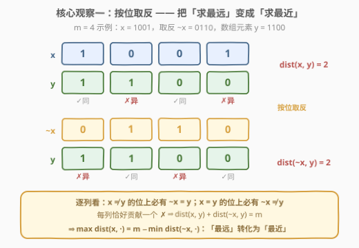
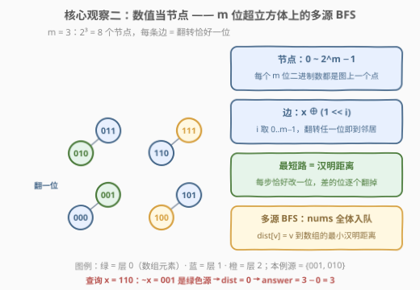
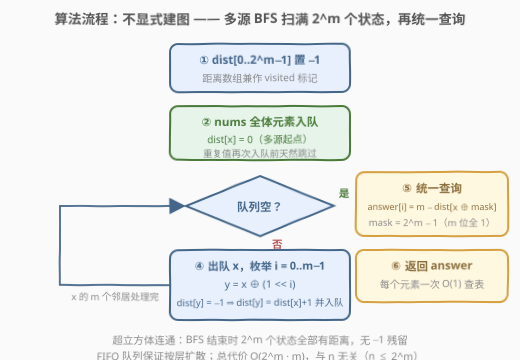
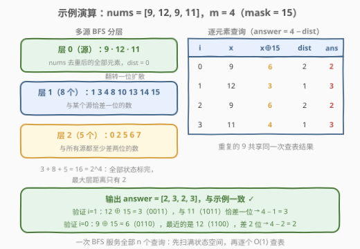

# LeetCode 最大汉明距离 题解

## 1. 题目概述

- **标题 / 题号**：最大汉明距离（#3141，hard）
- **链接**：https://leetcode.cn/problems/maximum-hamming-distances/
- **难度**：困难
- **标签**：位运算、广度优先搜索、数组、多源 BFS、隐式图

> ⚠️ 本题为 LeetCode 付费题（Plus 会员专享），题意描述根据官方示例用例与外部资料重建，可能与官方题面有出入。

**题意**：给定一个整数数组 `nums` 和整数 `m`，每个元素满足 $0 \le \textit{nums}[i] < 2^m$（即每个元素都是 **m 位二进制数**）。返回与 `nums` 等长的数组 `answer`，其中 `answer[i]` 表示 `nums[i]` 与数组中**其它任何元素** `nums[j]`（$j \ne i$）的最大**汉明距离**。

两个二进制整数之间的**汉明距离**定义为对应位上二进制位**不同**的数量（位数不足时补前导零）。

**示例 1**：

```text
输入：nums = [9, 12, 9, 11], m = 4
输出：[2, 3, 2, 3]

解释：二进制表示 nums = [1001, 1100, 1001, 1011]
  nums[0]：1001 与 1100 距离为 2（最大）
  nums[1]：1100 与 1011 距离为 3（最大）
  nums[2]：1001 与 1100 距离为 2（最大）
  nums[3]：1011 与 1100 距离为 3（最大）
```

**示例 2**：

```text
输入：nums = [3, 4, 6, 10], m = 4
输出：[3, 3, 2, 3]

解释：二进制表示 nums = [0011, 0100, 0110, 1010]
  nums[0]：0011 与 0100 距离为 3
  nums[1]：0100 与 0011 距离为 3
  nums[2]：0110 与 1010 距离为 2
  nums[3]：1010 与 0100 距离为 3
```

**约束**：

- $1 \le m \le 17$
- $2 \le \textit{nums.length} \le 2^m$
- $0 \le \textit{nums}[i] < 2^m$

> 💡 两个约束合在一起是本题的「题眼」：$n \le 2^m$ 说明**元素个数不超过状态总数**，而 $m \le 17$ 说明**状态空间 $2^m$ 至多 131072 个**——状态空间是「可以整个开出来扫一遍」的规模。困难难度正是考「敢不敢把数值本身当成图上的节点」。

## 2. 解题思路

### 2.1 暴力思路：逐对 popcount

汉明距离有现成公式：$\mathrm{dist}(x, y) = \mathrm{popcount}(x \oplus y)$。暴力做法对每个 $i$ 枚举所有 $j \ne i$ 取最大值，时间 $O(n^2)$：

```text
answer[i] = max { popcount(nums[i] XOR nums[j]) : j != i }
```

$n$ 最大取 $2^{17} = 131072$，$n^2 \approx 1.7 \times 10^{10}$ 对比较——即使每次 `popcount` 用硬件指令只要 1ns，也要跑十几秒，必然超时。

一个「看似有用」的观察：**答案只与值有关、与下标无关**（相同的 `nums[i]` 共享同一个 `answer[i]`），可以去重后再两两比较。但去重后仍有 $2^m = 131072$ 个不同值，平方规模不变。

> ⚠️ 瓶颈本质：「逐对比较」把整个数组当成散落的点，没有任何结构可以利用。破局点是换视角——**把每个 $m$ 位数看成一个节点，让「距离」在状态空间上批量传播**，而不是在点对之间逐个计算。

### 2.2 核心观察：取反转化 + 超立方体多源 BFS

最优解法分两步观察，缺一不可。

**观察一：按位取反，把「求最远」变成「求最近」。**

记 $\bar{x} = x \oplus \text{mask}$ 为 $x$ 的 $m$ 位按位取反（$\text{mask} = 2^m - 1$ 即 $m$ 个全 1）。逐位看：$x$ 与 $y$ 不同的那些位上，$\bar{x}$ 与 $y$ 必然相同；$x$ 与 $y$ 相同的位上，$\bar{x}$ 与 $y$ 必然不同——**每一位恰好给两个距离之一贡献一个 1**，于是：

$$\mathrm{dist}(x, y) + \mathrm{dist}(\bar{x}, y) = m$$

把 $y$ 换成数组里任取的元素并取最大/最小，恒等式依然成立，从而：

$$\max_{j}\ \mathrm{dist}(x, \textit{nums}[j]) = m - \min_{j}\ \mathrm{dist}(\bar{x}, \textit{nums}[j])$$



为什么要做这个转化？因为「**到集合的最小汉明距离**」有一个完美的批量计算结构（见观察二），而「最大汉明距离」没有——$\max$ 不满足任何可传递的三角结构，取反恰好是把 $\max$ 桥接到 $\min$ 的那座桥。

**观察二：超立方体图上，多源 BFS 一趟求出所有「最小汉明距离」。**

把 $0 \sim 2^m - 1$ 的每个数看成图上一个节点；两个数**恰好一位不同**（即 $y = x \oplus 2^i$，$i = 0..m-1$）时连一条边。这张图就是 $m$ 维**超立方体**，它有两个关键性质：

1. **图上最短路 = 汉明距离**。下界：每走一步恰好翻转一位，汉明距离每步至多变化 1，从 $u$ 到 $v$ 至少要 $\mathrm{dist}(u, v)$ 步；上界：把 $u$ 与 $v$ 不同的那几位逐一翻转，恰好 $\mathrm{dist}(u, v)$ 步到达。
2. **邻居可以现场生成**，无需建邻接表（隐式图）：节点 $x$ 的 $m$ 个邻居就是 $x \oplus 2^0, x \oplus 2^1, \dots, x \oplus 2^{m-1}$。

于是「$v$ 到数组元素的最小汉明距离」=「$v$ 到源集合的最短路」。以 `nums` 的**全部元素为源**做多源 BFS：源点 $\mathrm{dist} = 0$，逐层向外扩散，最终 $\mathrm{dist}[v]$ 就是 $v$ 到整个数组的**最小**汉明距离。最后统一查询：

$$\textit{answer}[i] = m - \mathrm{dist}\big[\,\textit{nums}[i] \oplus \text{mask}\,\big]$$



> 💡 **为什么「其它元素 $j \ne i$」不用特判？** 直接看两条：求 $\max$ 时 $\mathrm{dist}(x, x) = 0$ 永远不可能成为最大值；取反后求 $\min$ 时 $\mathrm{dist}(\bar{x}, x) = m$ 是距离的上界，永远不可能成为最小值——除非数组里**全部**元素都是 $x$，此时最小值恰为 $m$、答案恰为 $0$，同样正确。所以「在全体元素上取 min/max」与「在其它元素上取」结果一致，代码里完全不需要区分 $j = i$。

### 2.3 算法流程图



**执行步骤**：

| 步骤 | 操作 | 说明 |
|------|------|------|
| ① 初始化 | `dist[0..2^m−1] = −1` | 距离数组兼作 visited 标记 |
| ② 多源入队 | 每个不同的 `nums` 值 `x`：`dist[x] = 0`，入队 | 重复值天然只入队一次 |
| ③ 扩散 | 出队 `x`，枚举 $i = 0..m-1$：`y = x ⊕ 2^i` | 若 `dist[y] = −1` 则置 `dist[x]+1` 并入队 |
| ④ 终止 | 队列为空 | 超立方体连通，此时 $2^m$ 个状态全部有距离 |
| ⑤ 查询 | `answer[i] = m − dist[nums[i] ⊕ mask]` | 每个元素 $O(1)$ 查表 |

> ⚠️ 必须用 **FIFO 队列**按层扩散（标准 BFS）：无权图上 BFS 首次到达某点的步数就是最短路。若改用 DFS 或栈式遍历，先到未必最短，`dist` 会记错。

### 2.4 示例演算



以示例 1 `nums = [9, 12, 9, 11]`、$m = 4$（$\text{mask} = 15$）走一遍：

**多源 BFS 分层**（源集合去重后为 $\{9, 12, 11\}$）：

| 层 | 节点 | 含义 |
|----|------|------|
| 0 | 9, 12, 11 | 数组元素本身（重复的 9 只算一次） |
| 1 | 1, 3, 4, 8, 10, 13, 14, 15 | 与某个源恰差一位的 8 个数 |
| 2 | 0, 2, 5, 6, 7 | 与所有源都至少差两位的 5 个数 |

$3 + 8 + 5 = 16 = 2^4$，全部状态标完，BFS 结束（最大层距离仅为 2）。

**逐元素查询** `answer[i] = 4 − dist[nums[i] ⊕ 15]`：

| $i$ | $x = \textit{nums}[i]$ | $\bar{x} = x \oplus 15$ | $\mathrm{dist}[\bar{x}]$ | $\textit{answer}[i]$ |
|----|----|----|----|----|
| 0 | 9（1001） | 6（0110） | 2 | **2** |
| 1 | 12（1100） | 3（0011） | 1 | **3** |
| 2 | 9（1001） | 6（0110） | 2 | **2** |
| 3 | 11（1011） | 4（0100） | 1 | **3** |

抽查两个：$\bar{12} = 3$（0011）与源 11（1011）恰差一位，$\mathrm{dist} = 1$，$\textit{answer} = 4 - 1 = 3$ ✓；$\bar{9} = 6$（0110）离最近的源 12（1100）差两位，$\mathrm{dist} = 2$，$\textit{answer} = 4 - 2 = 2$ ✓。输出 `[2, 3, 2, 3]`，与示例一致。

## 3. 参考代码

### C++

```cpp
class Solution {
public:
    vector<int> maxHammingDistances(vector<int>& nums, int m) {
        int size = 1 << m;
        int mask = size - 1;
        vector<int> dist(size, -1);          // 距离数组兼 visited
        queue<int> q;
        for (int x : nums) {                 // 多源起点：数组元素全体
            if (dist[x] == -1) {             // 重复值天然只入队一次
                dist[x] = 0;
                q.push(x);
            }
        }
        while (!q.empty()) {                 // 标准分层 BFS
            int x = q.front();
            q.pop();
            for (int i = 0; i < m; ++i) {    // 隐式图：现场生成 m 个邻居
                int y = x ^ (1 << i);
                if (dist[y] == -1) {
                    dist[y] = dist[x] + 1;
                    q.push(y);
                }
            }
        }
        vector<int> answer(nums.size());
        for (int i = 0; i < (int)nums.size(); ++i) {
            answer[i] = m - dist[nums[i] ^ mask];   // 取反后查最近
        }
        return answer;
    }
};
```

> 💡 **写法要点**：
> - `dist` 初始化为 $-1$ 一物两用：既表示「未访问」，又存最短距离，不需要额外的 `visited` 数组。
> - 入队时用 `dist[x] == -1` 挡掉重复值；超立方体连通，BFS 结束时不存在残留的 $-1$（不存在查到 $-1$ 的风险）。
> - $2^{17} = 131072$ 个 `int` 约 512KB，用 `vector` 而不是栈上变长数组，避免爆栈。

### Python

```python
class Solution:
    def maxHammingDistances(self, nums: List[int], m: int) -> List[int]:
        size = 1 << m
        mask = size - 1
        dist = [-1] * size                    # 距离数组兼 visited
        q = deque()
        for x in nums:                        # 多源起点：数组元素全体
            if dist[x] == -1:                 # 重复值天然只入队一次
                dist[x] = 0
                q.append(x)
        while q:                              # 标准分层 BFS
            x = q.popleft()
            for i in range(m):                # 隐式图：现场生成 m 个邻居
                y = x ^ (1 << i)
                if dist[y] == -1:
                    dist[y] = dist[x] + 1
                    q.append(y)
        return [m - dist[x ^ mask] for x in nums]   # 取反后查最近
```

> 💡 **写法要点**：
> - `x ^ mask` 就是 $m$ 位按位取反——比「取反再截断」`(~x) & mask` 更直接，两者等价。
> - 查询一行推导式完成：重复元素（如示例中的两个 9）自动共享同一次查表结果。

## 4. 复杂度分析

| 维度 | 复杂度 | 说明 |
|------|--------|------|
| **时间** | $O(2^m \cdot m)$ | BFS 访问全部 $2^m$ 个状态，每个状态扩展 $m$ 个邻居（$O(1)$ 生成 + $O(1)$ 判重）；入队与查询各 $O(n)$，而 $n \le 2^m$，被主项吸收 |
| **空间** | $O(2^m)$ | `dist` 数组；队列中每个状态至多入队一次 |
| **规模感受** | $m = 17$ 时约 $2.2 \times 10^6$ | $131072 \times 17$ 次异或与判重，实测 Python 也在 0.2s 量级 |

> 💡 复杂度**与 $n$ 无关**（只要求 $n \le 2^m$）：哪怕数组填满整个值域，BFS 的工作量也固定是「扫一遍状态空间」。这正是约束 $m \le 17$ 传递的信号——出题人在告诉你状态空间可以整个开出来。

## 5. 扩展

### 5.1 一张 dist 表，最近最远一起拿

多源 BFS 求出的 `dist` 是「到数组的最小汉明距离」表，它能同时回答两类问题：

- **最近**：$\min_j \mathrm{dist}(x, \textit{nums}[j]) = \mathrm{dist}[x]$，直接查表；
- **最远**：$\max_j \mathrm{dist}(x, \textit{nums}[j]) = m - \mathrm{dist}[x \oplus \text{mask}]$，取反后查表。

本题只是「最远」的包装。若题目改成「每个元素到数组中**其它元素**的**最小**汉明距离」，同一份 BFS 代码去掉取反即可（`j = i` 自身距离为 0 的特判见 2.2 的讨论——直接查 `dist[nums[i]]` 会得到 0，此时需要排除自身值，退化为「最近异值」问题，须另行处理）。

### 5.2 m 的量级决定算法：开状态空间 vs 扫点对

本题做法成立的前提是 $m \le 17$。若 $m = 30$、$n = 10^5$（值域 $2^{30}$ 状态爆炸），多源 BFS 不可行，只能回到 $O(n^2)$ 的 `popcount` 点对扫描（可用 64 位打包把常数除以字长）。判型口诀：

> **先看 $m$（状态空间大小），再看 $n$（点数）**：$2^m$ 开得动就在状态空间上做 BFS，开不动就在点对上做暴力/剪枝。约束就是提示。

### 5.3 隐式图：不建邻接表的 BFS

本题全程没有邻接表——邻居由 `x ^ (1 << i)` 现场生成。这种「**状态即节点、转移即边**」的隐式图 BFS 是一类通用套路：[752 打开转盘锁](../0701-0800/752_打开转盘锁.md)（状态是 4 位密码串）、[2059 转化数字的最小运算数](../2001-2100/2059_转化数字的最小运算数.md)（状态是当前数值，注意值域上界截断）。与它们的区别在于：本题把**整个值域**都当作合法节点，BFS 扫满后还能**随机访问任意状态的答案**——这是「值域有限」独有的红利。

## 6. 面试要点

**Q1：为什么按位取反能把「最大汉明距离」转成「最小汉明距离」？**

> 逐位看：$x$ 与 $y$ 在某一位不同，当且仅当 $\bar{x}$ 与 $y$ 在该位相同。每一位恰好给 $\mathrm{dist}(x, y)$ 与 $\mathrm{dist}(\bar{x}, y)$ 之一贡献一个 1，故 $\mathrm{dist}(x, y) + \mathrm{dist}(\bar{x}, y) = m$。对 $y$ 取 $\max$ 即得 $\max_y \mathrm{dist}(x, y) = m - \min_y \mathrm{dist}(\bar{x}, y)$。本质动机：$\min$ 在图上有 BFS 这个批量计算结构，$\max$ 没有。

**Q2：为什么超立方体上最短路恰好等于汉明距离？**

> 两条夹逼。下界：每条边恰好翻转一位，走一步汉明距离至多变化 1，要把差距从 $\mathrm{dist}(u,v)$ 缩到 0 至少需要这么多步；上界：把 $u$ 与 $v$ 不同的那些位逐一翻转，构造出一条恰长 $\mathrm{dist}(u,v)$ 的路径。上界 = 下界，得证。这个论证也正是「BFS 的层数 = 距离」在隐式图上的翻译。

**Q3：题目说「与其它元素」，代码里为什么不用排除 $j = i$？**

> 两头都天然安全：求 $\max$ 时自身距离 0 不可能胜出；取反求 $\min$ 时 $\mathrm{dist}(\bar{x}, x) = m$ 是上界、不可能胜出——除非全数组同值，而此时答案 0 本来就正确（$m - m = 0$）。所以 min/max 放心地在全体元素上做，无需下标判断。

**Q4：如果约束改成 $m \le 30$ 但 $n \le 10^5$，这个解法还能用吗？**

> 不能。$2^{30} \approx 10^9$ 的 `dist` 数组内存与时间都爆炸。此时应回到 $O(n^2)$ 点对扫描（`popcount(x ^ y)`，Python 3.10+ 有 `int.bit_count()`），或按位统计做启发式剪枝。算法选型由**状态空间 $2^m$ 与点数 $n$ 谁开得动**决定——面试中先报出这个 trade-off 再写代码，是加分项。

**Q5：多源 BFS 和单源 BFS 有什么区别？为什么要「多源」？**

> 唯一区别在初始化：把全部源点入队、距离置 0，其余流程一字不改；等价于加一个虚拟超级源连向所有源。我们要求的是「到**数组中任一元素**的最小汉明距离」，即到**源集合**的最短距离，所以必须多源。模板题如 [994 腐烂的橘子](../0901-1000/994_腐烂的橘子.md)：所有烂橘子同时出发，问每个橘子被「感染」的最早时刻——同一个模型。

> 💡 **一句话总结**：取反恒等式 $\mathrm{dist}(x, y) + \mathrm{dist}(\bar{x}, y) = m$ 把「最远」桥接到「最近」，超立方体上一次多源 BFS 把「到数组的最近距离」整表算出，最后 $O(1)$ 查表得 $\textit{answer}[i] = m - \mathrm{dist}[\bar{x}_i]$。口诀：**「最远 = 全反 − 最近」**。

## 同类练习题

| # | 题目 | 与本题的关联 |
|---|------|-------------|
| 461 | [汉明距离](../0401-0500/461_汉明距离.md) | 本题的基本构件——两数汉明距离就是 $\mathrm{popcount}(x \oplus y)$ |
| 994 | [腐烂的橘子](../0901-1000/994_腐烂的橘子.md) | 多源 BFS 模板题，对应本题「数组元素全体入队」的那一步 |
| 752 | [打开转盘锁](../0701-0800/752_打开转盘锁.md) | 隐式图 BFS——状态当节点、每位转移当边，与超立方体结构同源 |
| 2059 | [转化数字的最小运算数](../2001-2100/2059_转化数字的最小运算数.md) | 值域当节点的显式 BFS，同样要靠「访问标记」防重复扩展 |
| 847 | [访问所有节点的最短路径](../0801-0900/847_访问所有节点的最短路径.md) | 把「已访问集合」编码成 bitmask 当节点，「状态即节点」思想的进阶推广 |
