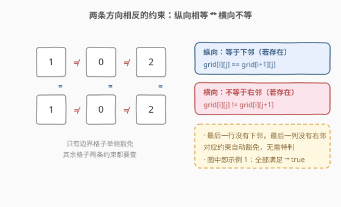
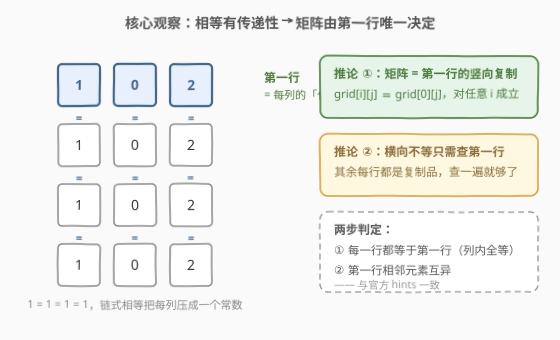
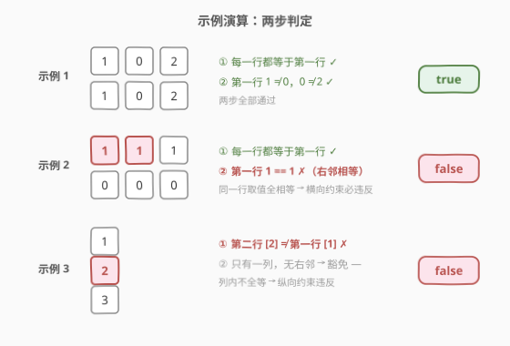

# LeetCode 判断矩阵是否满足条件 题解

## 1. 题目概述

- **标题 / 题号**：判断矩阵是否满足条件（#3142，easy）
- **链接**：https://leetcode.cn/problems/check-if-grid-satisfies-conditions/
- **难度**：简单
- **标签**：数组，矩阵

**题意**：给你一个大小为 $m \times n$ 的二维矩阵 `grid`。你需要判断每一个格子 `grid[i][j]` 是否满足：

- 如果它**下面**的格子存在，那么它需要**等于**下面的格子：$grid[i][j] = grid[i+1][j]$；
- 如果它**右边**的格子存在，那么它需要**不等于**右边的格子：$grid[i][j] \ne grid[i][j+1]$。

如果**所有**格子都满足以上条件，返回 `true`，否则返回 `false`。

**示例 1**：

```text
输入：grid = [[1,0,2],[1,0,2]]
输出：true
解释：每列上下相等（1=1、0=0、2=2），每行左右互异（1≠0、0≠2），全部满足。
```

**示例 2**：

```text
输入：grid = [[1,1,1],[0,0,0]]
输出：false
解释：同一行中的格子值都相等——第一行的 1 == 1 违反横向约束。
```

**示例 3**：

```text
输入：grid = [[1],[2],[3]]
输出：false
解释：同一列中的格子值不相等——1 ≠ 2 违反纵向约束。
```

**约束**：

- $1 \le m, n \le 10$
- $0 \le grid[i][j] \le 9$

> 💡 读题关键：两条约束**方向相反**——纵向要求相等、横向要求不等，方向记反整题全错（示例 2 和示例 3 分别是两条约束各自违反的样本）。另外约束带「若存在」的前提：最后一行没有下邻、最后一列没有右邻，对应约束自动豁免。

## 2. 解题思路

### 2.1 暴力思路：逐格检查两个邻居

最直接的做法照着题面翻译：双重遍历每个格子，存在下邻就查相等、存在右邻就查不等，任何一处违反立即返回 `false`。$O(mn)$，本题 $m, n \le 10$ 最多 100 格，稳过。

它已经是可行解了，真正冗余的地方在于：**横向不等的检查对每一行都做了一遍**——如果纵向相等成立，这些检查全部是重复劳动。能不能把两条约束解耦，每条只查必要次数？

### 2.2 核心观察：纵向相等有传递性，矩阵由第一行唯一决定



纵向「相等」约束沿列**链式传递**：

$$
grid[0][j] = grid[1][j] = \cdots = grid[m-1][j]
$$

即**每列内部全部相等**。由此得到两个推论：

1. **矩阵 = 第一行的竖向复制**：$grid[i][j] \equiv grid[0][j]$ 对任意 $i$ 成立，第一行是每列的「代表」；
2. **横向不等只需查第一行**：若每一行都是第一行的复制，则任意一行上「相邻不等」与第一行上的「相邻不等」完全等价——查一遍就够了。



于是整张矩阵的合法性归结为**两步判定**：

| 步骤 | 检查内容 | 等价命题 |
|------|----------|----------|
| ① | 每一行都等于第一行 | 每列内部全等（纵向约束） |
| ② | 第一行相邻元素互异 | 任意行相邻互异（横向约束） |

> ⚠️ 这正是官方 hints 的两句话：先「Check if each column has same value in each cell」，再「simply check the first cells in adjacent columns」。两步都是 $O(mn)$ 量级，但把「谁决定谁」想清楚后，代码从「每格查两个邻居」退化成「每行和第一行比一次 + 第一行内部比一遍」，逻辑更短，也直接通向 3122 的 DP 解法（见第 5 节）。

### 2.3 算法流程

1. **步骤①**：遍历 $i = 1 \dots m-1$，若第 $i$ 行与第一行不完全相同，返回 `false`；
2. **步骤②**：遍历 $j = 0 \dots n-2$，若 $grid[0][j] = grid[0][j+1]$，返回 `false`；
3. 两步全部通过，返回 `true`。

全程短路：任何一处违反即可定论，无需统计违反个数。单行矩阵（$m=1$）时步骤①自然跳过、只剩横向检查；单列矩阵（$n=1$）时步骤②自然跳过、只剩纵向检查——边界无需特判。

### 2.4 示例演算



| 示例 | 步骤① 行 = 第一行？ | 步骤② 首行相邻互异？ | 结果 |
|------|--------------------|--------------------|------|
| `[[1,0,2],[1,0,2]]` | ✓ 第二行就是第一行 | ✓ 1≠0，0≠2 | `true` |
| `[[1,1,1],[0,0,0]]` | ✓ 两行各自内部一致 | ✗ 第一行 1 == 1 | `false` |
| `[[1],[2],[3]]` | ✗ 第二行 [2] ≠ [1] | —（无右邻，豁免） | `false` |

注意示例 2 虽然步骤①通过（每行各自都是常数行），但第一行取值全等，横向约束必然违反——**两步缺一不可**，先①后②只是让②只查一行。

## 3. 参考代码

### C++（逐格直查：一次遍历 + 双条件短路）

```cpp
class Solution {
  public:
    bool satisfiesConditions(vector<vector<int>>& grid) {
        int m = grid.size(), n = grid[0].size();
        for (int i = 0; i < m; ++i) {
            for (int j = 0; j < n; ++j) {
                if (i + 1 < m && grid[i][j] != grid[i + 1][j]) return false;
                if (j + 1 < n && grid[i][j] == grid[i][j + 1]) return false;
            }
        }
        return true;
    }
};
```

> 💡 照题面直译的写法：每个格子查下邻（相等）和右邻（不等），边界由 `i + 1 < m` / `j + 1 < n` 守卫。简单直接，不易出错。

### Python（两步判定：行对齐第一行 + 首行相邻互异）

```python
class Solution:
    def satisfiesConditions(self, grid: List[List[int]]) -> bool:
        first = grid[0]
        # 步骤①：每一行都必须是第一行的复制（列内全等）
        if any(row != first for row in grid[1:]):
            return False
        # 步骤②：第一行相邻元素互异
        if any(first[j] == first[j + 1] for j in range(len(first) - 1)):
            return False
        return True
```

> 💡 Python 的列表支持原地逐元素比较，`row != first` 一句话完成「整行对齐第一行」的检查，把核心观察翻译成了字面意思。C++ 同样可以写 `grid[i] != grid[0]`（`vector` 重载了比较运算符）。

## 4. 复杂度分析

| 维度 | 复杂度 | 说明 |
|------|--------|------|
| 时间复杂度 | $O(mn)$ | 步骤①每行与第一行比较 $O(n)$、共 $m-1$ 行；步骤②第一行内部 $n-1$ 次比较 |
| 空间复杂度 | $O(1)$ | 只引用第一行，无额外数据结构 |

> 💡 本题 $m, n \le 10$，最多 100 格，任何 $O(mn)$ 写法都能秒过；复杂度讨论的意义在于骨架可迁移——矩阵放大到 $10^3 \times 10^3$ 依然是线性扫一遍。

## 5. 扩展：从「判定」到「最少操作次数」

把题面改成「每次操作可将任意格子改为任意非负整数，求让矩阵满足条件的最少操作数」——这正是同目录的 [3122. 使矩阵满足条件的最少操作次数](https://leetcode.cn/problems/minimum-number-of-operations-to-satisfy-conditions/)，连三条示例都和本题同源（示例 2 的答案是 3、示例 3 的答案是 2）。

两题共享同一个核心观察：**纵向相等有传递性，合法矩阵的形态由列值序列（等价地，第一行）唯一刻画**。区别只在：

- **本题（3142）**：判定版，只回答 yes/no——逐格核对即可；
- **3122**：计数版，横向互异让相邻列的终值**耦合**，需要「逐列 DP、状态记住上一列取了什么」求最少改动。

另一个镜像变体留作思考：若条件翻转成「纵向不等、横向相等」呢？此时**相等换到了横向**，传递性随之换边——行内相等把每行压成常数，矩阵由**第一列**决定，两步判定变成「每列等于第一列 + 第一列相邻互异」。骨架完全对称，哪一侧握有「相等」的传递性，哪一侧就能选出代表元。

## 6. 面试要点

1. **为什么横向不等只需检查第一行？**

   - 纵向相等链式传递 ⇒ 每列是常数 ⇒ 每一行都是第一行的复制。于是任意行上的相邻比较结果与第一行完全相同，查一遍即可。前提是步骤①先通过——①不过关时其余行根本不是复制，但那时已经返回 `false` 了。

2. **单行 / 单列矩阵需要特判吗？**

   - 不需要。$m=1$ 时没有纵向约束，步骤①的循环体不执行，只剩横向检查；$n=1$ 时没有横向约束，步骤②的循环体不执行。「若存在」的语义天然被空循环吸收。

3. **逐格直查和两步判定都是 $O(mn)$，为什么还要想清楚后者？**

   - 两步判定把两条约束**解耦**且各查最少次数，是思维上的最简形式；更重要的是它是 3122（最少操作版）DP 的入口——「矩阵形态由第一行/列值序列决定」这一观察在计数版里直接决定状态设计。

4. **短路返回为什么是安全的？**

   - 题目只要存在性判定：任何一处违反即答案为 `false`，不需要统计违反数量。若真要数「违反约束的格子数」反而要小心——一个格子可能同时违反两条约束，去重逻辑会复杂化，这是判定与计数版的一个分岔点。

5. **如果把「等于下邻」改成「小于下邻」（列内严格递增）还能只查第一行吗？**

   - 不能。严格递增没有「压平成常数」的效果，第一行不再能代表整列，逐格检查就是必要的。**传递性→代表元**的推理链只在「相等」这类等价关系下成立，这是本题观察的根基。

## 同类练习题

| # | 题目 | 与本题的关联 |
|---|------|-------------|
| 766 | [托普利茨矩阵](https://leetcode.cn/problems/toeplitz-matrix/) | 矩阵局部相邻关系检查的招牌题，每个元素只需和右下邻居比较，同款「局部判定免全局搜索」 |
| 2133 | [检查是否每一行每一列都包含全部整数](https://leetcode.cn/problems/check-if-every-row-and-column-contains-all-numbers/) | 行列各自独立计数判定的合法性检查，练习「约束解耦」 |
| 2319 | [判断矩阵是否是一个 X 矩阵](https://leetcode.cn/problems/check-if-matrix-is-x-matrix/) | 按位置规则（对角线/非对角线）分类讨论的矩阵判定，边界与下标练手 |
| 2482 | [行和列中一和零的差值](https://leetcode.cn/problems/difference-between-ones-and-zeros-in-row-and-column/) | 行列前缀统计 + 按位置查询，矩阵行列视角切换 |
| 3122 | [使矩阵满足条件的最少操作次数](https://leetcode.cn/problems/minimum-number-of-operations-to-satisfy-conditions/) | 同条件的计数升级版，本题两步判定的观察直接演化为逐列 DP（见第 5 节） |
