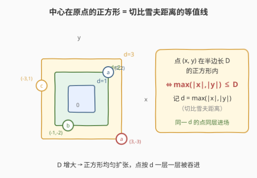
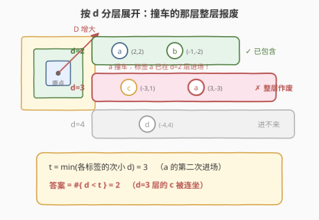
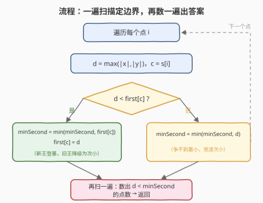
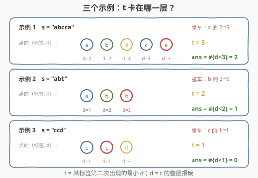

# LeetCode 正方形中的最多点数 题解

## 1. 题目概述

- **标题 / 题号**：正方形中的最多点数（#3143，medium）
- **链接**：https://leetcode.cn/problems/maximum-points-inside-the-square/
- **难度**：中等
- **标签**：数组，哈希表，字符串，排序，二分查找

**题意**：给你一个二维数组 `points` 和一个字符串 `s`：`points[i]` 表示第 $i$ 个点的坐标，`s[i]` 表示第 $i$ 个点的**标签**。

如果一个正方形满足以下全部条件，则称它是**合法**的：

1. 中心在原点 $(0, 0)$；
2. 所有边都平行于坐标轴；
3. 正方形内（含边界）**不**存在标签相同的两个点。

请返回合法正方形中可以包含的**最多**点数。

**注意**：点位于正方形的边上也算在正方形内；正方形的边长可以为零。

**示例 1**：

```text
输入：points = [[2,2],[-1,-2],[-4,4],[-3,1],[3,-3]], s = "abdca"
输出：2
解释：边长为 4 的正方形包含两个点 points[0] 和 points[1]。
```

**示例 2**：

```text
输入：points = [[1,1],[-2,-2],[-2,2]], s = "abb"
输出：1
解释：边长为 2 的正方形包含 1 个点 points[0]。
```

**示例 3**：

```text
输入：points = [[1,1],[-1,-1],[2,-2]], s = "ccd"
输出：0
解释：任何正方形都无法只包含 points[0] 和 points[1] 中的一个点，所以合法正方形中都不包含任何点。
```

**约束**：

- $1 \le s.length, points.length \le 10^5$
- $points[i].length = 2$
- $-10^9 \le points[i][0], points[i][1] \le 10^9$
- $s.length = points.length$
- `points` 中的点坐标互不相同
- `s` 只包含小写英文字母

> 💡 读题关键：正方形不是任意的——**中心锁死在原点、方向锁死为平行坐标轴**，唯一的自由度只剩边长。于是「在所有正方形中选最优」退化为「在所有边长中选最优」，这是全题的破局点。

## 2. 解题思路

### 2.1 暴力思路：枚举候选边长

既然正方形只由边长决定，不妨把每个点「刚好被包含」所需的边长作为候选值枚举：对每个候选边长，统计被包含的点并检查每个标签是否至多出现一次。$n$ 个候选值 × 每次 $O(n)$ 检查 = $O(n^2)$，在 $n = 10^5$ 下会超时。

另一个中间态是**二分**：随着边长增大，包含的点单调增多，「非法」也单调到来——一旦某个标签撞车，更大的边长只会更非法。合法性关于边长**单调**，可以二分出最大合法边长，复杂度 $O(n \log n)$。这正是官方标签里 `Binary Search` 的由来。

> 💡 但「知道单调」和「看穿结构」之间还差一步：撞车发生在哪一层，其实根本不用搜——每个标签自己会交代。

### 2.2 核心观察：切比雪夫距离分层 + 次小值卡边界



**观察一：包含判定是一维的。** 中心在原点、边平行坐标轴、半边长为 $D$ 的正方形，恰好是**切比雪夫度量**下的「球」：

$$
\text{点 } (x, y) \text{ 在正方形内（含边界）} \iff \max(|x|, |y|) \le D
$$

记 $d_i = \max(|x_i|, |y_i|)$（点到原点的**切比雪夫距离**），则边长 $2D$ 的正方形包含的点集为 $S(D) = \{\, i : d_i \le D \,\}$。

**观察二：包含点集是按 $d$ 排序的前缀。** $D$ 从 $0$ 连续增大，点按 $d$ 从小到大**一整层一整层**地进入正方形。所有可能的包含点集只有 $n + 1$ 种前缀形态，二维的几何问题被压成了「扩张到第几层」的一维问题。

**观察三：合法性由每个标签的「次小 $d$」卡死。** 对出现至少两次的标签 $c$，设它最小的两个 $d$ 值为 $first[c]$ 与 $second[c]$，则「标签 $c$ 在 $S(D)$ 中出现两次」$\iff D \ge second[c]$。于是：

$$
S(D) \text{ 合法} \iff D < t, \quad t := \min_c second[c]
$$

（只出现一次的标签 $second[c] = +\infty$，不构成约束；若所有标签都唯一，则 $t = +\infty$，边长可以放心开到最大，答案为 $n$。）

**答案**：把 $D$ 无限逼近 $t$ 而不越过，能吞下的恰好是 $d$ **严格小于** $t$ 的所有点：

$$
ans = \#\{\, i : d_i < t \,\}
$$



> ⚠️ 为什么是**严格小于**？$t$ 所在的层正是某标签**第二次**进场的地方——$D$ 一旦达到 $t$，该标签的两个点（$first \le second = t \le D$）就同时在正方形里了，非法。所以 $d = t$ 的整层全部出局，连同层里其他无辜的点也被**连坐**（示例 1 中 $d = 3$ 层的 `c` 点就是被同层的第二个 `a` 连坐的）。

### 2.3 算法流程



1. **第一遍扫描**每个点：计算 $d = \max(|x|, |y|)$，对标签 $c$ 维护 $first[c]$（该标签目前见过的最小 $d$）与全局变量 $minSecond$（所有标签次小 $d$ 的最小值）：
   - 若 $d < first[c]$：旧的最小值**降级**为次小候选，$minSecond \gets \min(minSecond, first[c])$，再刷新 $first[c] = d$；
   - 否则：$d \ge first[c]$，争不到最小，直接竞逐次小，$minSecond \gets \min(minSecond, d)$；
2. **第二遍扫描**：统计满足 $d < minSecond$ 的点数，即为答案。

标签只有 26 种小写字母，$first$ 用长度 26 的数组即可。若所有标签互不相同，$minSecond$ 保持 $+\infty$，全部点计入。

### 2.4 示例演算



以**示例 1** 为例，五个点的（标签，$d$）依次为 `(a,2) (b,2) (d,4) (c,3) (a,3)`：

| 步骤 | 内容 | 结果 |
|------|------|------|
| 计算 $d$ | $\max(\|x\|,\|y\|)$ 逐点求出 | `2, 2, 4, 3, 3` |
| 维护 $first$ | a→2, b→2, d→4, c→3 | 标签各自的最小层 |
| 撞车检测 | 第二个 `a` 的 $d=3 \ge first[a]=2$ | $minSecond = 3$ |
| 统计答案 | $d < 3$ 的点：`(a,2)`、`(b,2)` | **2** |

$d = 3$ 层的 `c` 点被同层第二个 `a` 连坐，$d = 4$ 层的 `d` 点则彻底进不来——这与示例输出完全一致。

## 3. 参考代码

### C++（两遍扫描，$O(n)$）

```cpp
class Solution {
  public:
    int maxPointsInsideSquare(vector<vector<int>>& points, string s) {
        const int INF = INT_MAX;
        vector<int> first(26, INF);   // 每个标签见过的最小 d
        int minSecond = INF;          // 所有标签「次小 d」的全局最小值

        for (int i = 0; i < (int)points.size(); ++i) {
            int d = max(abs(points[i][0]), abs(points[i][1]));
            int c = s[i] - 'a';
            if (d < first[c]) {
                minSecond = min(minSecond, first[c]);  // 旧最小值降级为次小候选
                first[c] = d;
            } else {
                minSecond = min(minSecond, d);         // 争不到最小，竞逐次小
            }
        }

        int ans = 0;
        for (auto& p : points) {
            if (max(abs(p[0]), abs(p[1])) < minSecond) ++ans;
        }
        return ans;
    }
};
```

> 💡 坐标上界 $10^9$，`abs` 后仍在 `int` 范围内（$|{-10^9}| = 10^9 < 2^{31} - 1$），无需升 `long long`。

### Python（字典版，逻辑同构）

```python
class Solution:
    def maxPointsInsideSquare(self, points: List[List[int]], s: str) -> int:
        INF = float('inf')
        first = {}            # 标签 -> 见过的最小 d
        min_second = INF      # 所有标签「次小 d」的全局最小值

        for (x, y), c in zip(points, s):
            d = max(abs(x), abs(y))
            f = first.get(c, INF)
            if d < f:
                min_second = min(min_second, f)   # 旧最小值降级
                first[c] = d
            else:
                min_second = min(min_second, d)   # 竞逐次小

        return sum(max(abs(x), abs(y)) < min_second for x, y in points)
```

### 排序逐层扩张（官方 hints 路线，$O(n \log n)$）

```python
class Solution:
    def maxPointsInsideSquare(self, points: List[List[int]], s: str) -> int:
        n = len(points)
        dist = [max(abs(x), abs(y)) for x, y in points]
        order = sorted(range(n), key=lambda i: dist[i])

        seen, ans, i = set(), 0, 0
        while i < n:
            j = i
            while j < n and dist[order[j]] == dist[order[i]]:
                j += 1
            layer = {s[k] for k in order[i:j]}      # 同一层的全部标签
            if layer & seen or len(layer) < j - i:  # 与外层撞车 / 层内自撞
                break
            seen |= layer
            ans += j - i
            i = j
        return ans
```

> ⚠️ 排序路线最大的坑：必须**整层整层**地加入。若逐点加入，同一层先来了 `a` 再来 `a'`，会在 `a'` 处停下，但同层先前计入的点是**多算**的。层内冲突时整层作废。而 `first/minSecond` 做法天然免疫：$t = second$ 时 $\#\{d < t\}$ 自动排除整个 $t$ 层。

## 4. 复杂度分析

| 维度 | 复杂度 | 说明 |
|------|--------|------|
| 时间复杂度 | $O(n)$ | 两遍线性扫描：第一遍维护 $first$ 与 $minSecond$，第二遍统计 $d < t$ 的点数 |
| 空间复杂度 | $O(1)$ | $first$ 数组仅 26 项（标签为小写字母）+ 常数个变量 |

排序逐层扩张路线为 $O(n \log n)$ 时间、$O(n)$ 空间；二分路线为 $O(n \log n)$。

> 💡 本题数据 $n \le 10^5$，三种写法都能过；复杂度讨论的意义在于：**次小值卡边界一步到位**，把「搜索最大合法边长」变成了「直接读出边界在哪」，是单调性问题里「看穿结构」压过「二分套路」的典型样本。

## 5. 扩展：正确性证明与变体

**正确性三行证明**：

1. 任何正方形的包含点集形如 $\{d_i \le D\}$；其中标签 $c$ 出现两次 $\iff D \ge second[c]$，故合法 $\iff D < t$；
2. 取 $D^\ast$ 介于 $\max\{d_i : d_i < t\}$ 与 $t$ 之间（点集有限，区间非空），则 $S(D^\ast) = \{d_i < t\}$ 且合法；
3. 任何 $D \ge t$ 都使取得 $t$ 的标签出现两次，非法。故 $\{d_i < t\}$ 已是最大合法包含集。$\blacksquare$

**变体思考**：

- **换成圆**（欧氏距离）：$d$ 改为 $\sqrt{x^2 + y^2}$，「前缀 + 次小卡界」的方法分毫不动——结论并不依赖 $d$ 是整数，只依赖点集有限、包含集随 $D$ 单调；
- **允许旋转正方形**：包含判定不再是一个 `max` 能表达的，一维化失效，问题本质变难——切比雪夫结构的根基正是「边平行于坐标轴」；
- **冲突约束放宽为「每标签最多 $k$ 个」**：改为维护每个标签**第 $k+1$ 小** $d$ 值的全局最小值即可，是本解的自然推广。

## 6. 面试要点

1. **为什么想到切比雪夫距离？**

   - 正方形三要素中两个被锁死（中心原点 + 平行坐标轴），只剩边长一个自由度。此时「在正方形内」$\iff \max(|x|,|y|) \le D$，正是切比雪夫距离不超过 $D$。把二维包含压成一维关键值 $d$，是本题的第一性观察。

2. **为什么答案是 $\#\{d < t\}$ 而不是 $\#\{d \le t\}$？**

   - $t$ 是某标签**第二次**进场的层：$D \ge t$ 时该标签两个点（$first \le second = t \le D$）都已进入，非法。$d = t$ 的整层必须排除——即使层内有其他标签的无辜点，也被同层冲突连坐（示例 1 的 `c` 点）。

3. **`first / minSecond` 的更新为什么正确？**

   - 每个标签真实的次小值只在两种情况下被「看见」：新点刷新最小时（旧最小降级为次小），或新点不小于当前最小时（它自己就是次小候选）。两种情况都只需与全局 $minSecond$ 取 `min`——因为我们只关心所有标签次小值的**最小值**，不必完整维护每个标签的次小表。

4. **坐标到 $10^9$，计算 $d$ 会溢出吗？**

   - `int` 上界约 $2.1 \times 10^9$，$|{-10^9}| = 10^9$，`abs` 与 `max` 均安全。但若坐标上界逼近 `INT_MIN`，`abs(INT_MIN)` 是未定义行为的经典坑，稳妥做法是先转 `long long` 再取绝对值。

5. **排序做法为什么必须整层处理？**

   - 层内同标签冲突时，$D$ 只要到达该层的 $d$，两个点**同时**进入，整层都不能要。逐点加入会把同层先加入的点错误计入。`first/minSecond` 做法通过「严格小于 $t$」天然规避了这一边界。

## 同类练习题

| # | 题目 | 与本题的关联 |
|---|------|-------------|
| 1266 | [访问所有点的最小时间](https://leetcode.cn/problems/minimum-time-visiting-all-points/) | 切比雪夫距离的招牌应用——斜走一格等于横竖各走一格，步数就是 $\max(\|dx\|, \|dy\|)$ |
| 3102 | [最小化曼哈顿距离](https://leetcode.cn/problems/minimize-manhattan-distances/) | 曼哈顿 ↔ 切比雪夫的旋转 $45°$ 转换，与本题同属「选对距离度量，问题自动降维」 |
| 1779 | [找到最近的有相同 X 或 Y 坐标的点](https://leetcode.cn/problems/find-nearest-point-that-has-the-same-x-or-y-coordinate/) | 按 $\|x\|$ / $\|y\|$ 分量比较的切比雪夫退化版，练坐标分量直觉 |
| 1647 | [字符频次唯一的最小删除次数](https://leetcode.cn/problems/minimum-deletions-to-make-character-frequencies-unique/) | 同样以「标签冲突」为核心，从计数判定换成贪心消冲突 |
| 1207 | [独一无二的出现次数](https://leetcode.cn/problems/unique-number-of-occurrences/) | 哈希判重的最小变体，适合作为本题的热身 |
