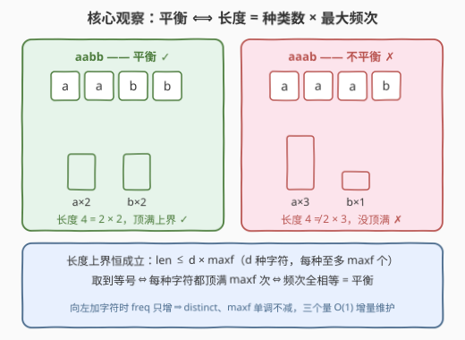
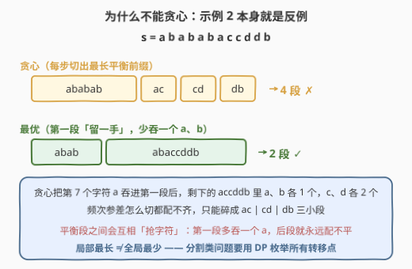
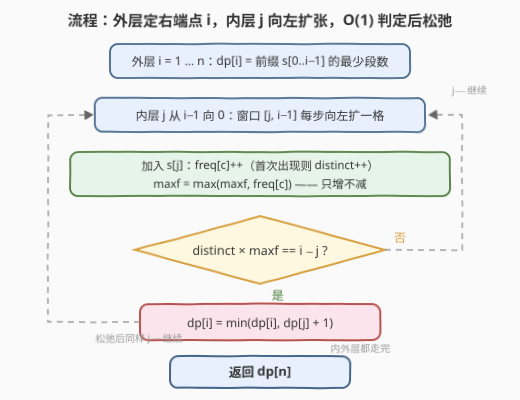
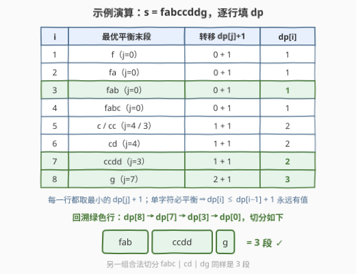

# 分割字符频率相等的最少子字符串

- **题目名称**：分割字符频率相等的最少子字符串
- **链接**：[3144. 分割字符频率相等的最少子字符串](https://leetcode.cn/problems/minimum-substring-partition-of-equal-character-frequency/)
- **难度**：中等
- **标签**：哈希表，字符串，动态规划，计数

## 1. 题目概述

给你一个字符串 `s`，需要将它分割成**一个或更多**个**平衡**子字符串。**平衡**字符串的定义：字符串中**所有字符出现的次数都相同**。

例如 `s = "ababcc"` 时，`("abab", "c", "c")`、`("ab", "abc", "c")` 和 `("ababcc")` 都是合法分割；而 `("a", "bab", "cc")`、`("aba", "bc", "c")` 和 `("ab", "abcc")` 不合法——不平衡的子字符串（如 `bab` 中 b 出现 2 次、a 出现 1 次）无法出现在分割里。

请返回 `s` **最少**能分割成多少个平衡子字符串。

**示例 1**：

```text
输入：s = "fabccddg"
输出：3
解释：可以分割成 ("fab", "ccdd", "g") 或 ("fabc", "cd", "dg")。
```

**示例 2**：

```text
输入：s = "abababaccddb"
输出：2
解释：可以分割成 ("abab", "abaccddb")。
```

**约束条件**：

- $1 \le s.length \le 1000$
- `s` 只包含小写英文字母

> 💡 读题关键：这是典型的「**最少分割段数**」问题——132 分割回文串 II、139 单词拆分的亲兄弟，只是「合法段」的定义从回文/字典词换成了「频次全相等」。分割问题的标准姿势是 DP：$dp[i]$ = 前缀最少段数，转移枚举最后一段。本题真正的考点是：**如何 O(1) 判定一段子串是否平衡**。

---

## 2. 解题思路

### 2.1 暴力思路：枚举分割点

最直接的想法是枚举所有分割方案：长度为 $n$ 的字符串有 $n-1$ 个潜在切口，共 $2^{n-1}$ 种方案，逐一检查每段是否平衡——指数级，$n = 1000$ 下完全不可行。

标准的改进是套上 DP 骨架：设 $dp[i]$ 为前缀 $s[0..i-1]$ 的最少段数，转移枚举最后一段的起点 $j$。但瓶颈立刻出现在**判定**上：对每个 $(j, i)$ 对重新数一遍频次需要 $O(i - j)$，总复杂度 $O(n^3) \approx 10^9$，超时。即便对每个 $(j,i)$ 维护频次表后扫描 26 个桶来判定，也要 $O(26\,n^2) \approx 2.6 \times 10^7$，勉强能过但不够优雅。

判定能不能做到**每个窗口 O(1)**？

### 2.2 核心观察：长度 = 种类数 × 最大频次



**观察一（代数判定）：子串平衡 $\iff$ 长度 $= d \times f$，其中 $d$ 为字符种类数、$f$ 为最大频次。**

设子串长度为 $len$，含 $d$ 种字符（频次非零），最大频次为 $f$。每种字符至多 $f$ 个，所以恒有上界：

$$
len \;\le\; d \times f
$$

（$d \le 26$ 保证了 $d \times f$ 是有限上界，但判定本身不依赖 26。）而「平衡」意味着**每种字符都恰好出现 $f$ 次**——即长度恰好**顶满**这个上界：

$$
\text{平衡} \iff len = d \times f
$$

两个方向都干净：频次全相等时显然 $len = d \cdot f$；反过来，$d$ 个落在 $[1, f]$ 内的正整数之和为 $d \cdot f$，则每个都必须顶到上界 $f$，频次全相等。于是判定只需一次乘法比较。

**观察二（增量维护）：固定右端点、向左扩张，三个统计量全部单调。**

对每个右端点 $i$，让 $j$ 从 $i-1$ 向 $0$ 移动——每步只**往窗口里加一个字符**：`freq[c]` 只增，`distinct` 只增，`maxf` 也只增（`maxf = max(maxf, freq[c])` 永远正确）。三个量全部 $O(1)$ 更新，配合观察一的判定，每个 $(j, i)$ 对摊还 $O(1)$。

> ⚠️ 方向不能反过来：若固定左端点向右扩张后需要「收缩」（删字符），`freq` 会减少，`maxf` 可能需要降级，$O(1)$ 增量维护就断了，只能 $O(26)$ 重扫或引入更复杂的结构。**扫描方向本身就是这道题的考点**。

**观察三（为什么必须 DP，不能贪心）：平衡段之间会「抢字符」。**



「每步切出最长的平衡前缀」看起来很美，但示例 2 就是反例：贪心切出 `ababab` 后，剩下的 `accddb`（a、b 各 1 个，c、d 各 2 个）频次参差、再也配不齐，只能碎成 `ac | cd | db` 共 4 段；而最优解第一段只切 `abab`，把多余的 a、b 留给第二段拼出 `abaccddb`，总共 2 段。**局部最长 ≠ 全局最少**。

**DP 定义与转移**：

$$
dp[i] = \text{前缀 } s[0..i-1] \text{ 的最少平衡段数}, \qquad dp[0] = 0
$$

$$
dp[i] = \min\{\, dp[j] + 1 \;:\; 0 \le j < i,\; s[j..i-1] \text{ 平衡} \,\}
$$

单字符必平衡（$d = f = 1, len = 1$），所以 $dp[i] \le dp[i-1] + 1$，`dp` 永远有值；答案即 $dp[n]$。

### 2.3 算法流程



1. 初始化 $dp[0] = 0$；外层 $i$ 从 $1$ 到 $n$：为当前右端点准备空的频次表（`distinct = maxf = 0`）；
2. 内层 $j$ 从 $i-1$ 向 $0$：加入 $s[j]$，增量更新 `freq / distinct / maxf`；
3. 若 `distinct × maxf == i − j`（窗口平衡）：松弛 $dp[i] \gets \min(dp[i],\; dp[j] + 1)$；
4. 全部走完后返回 $dp[n]$。

### 2.4 示例演算



以示例 1 `s = fabccddg` 为例，表格逐行给出每个 $dp[i]$ 的最优末段与转移。几个值得注意的瞬间：

- $i = 1 \sim 4$：`f`、`fa`、`fab`、`fabc` 各字符恰好出现一次，整段直接平衡，$dp = 1$；
- $i = 7$：`ccdd` 恰好平衡（$c^2 d^2$，$len = 4 = 2 \times 2$），$dp[7] = dp[3] + 1 = 2$；
- $i = 8$：所有更长的末段都不平衡，单字符 `g` 兜底，$dp[8] = dp[7] + 1 = 3$。

回溯 $dp[8] \to dp[7] \to dp[3] \to dp[0]$，切分即 `fab | ccdd | g`，共 3 段。

---

## 3. 参考代码

### C++（$O(n^2)$ 增量 DP）

```cpp
class Solution {
  public:
    int minimumSubstringsInPartition(string s) {
        int n = s.size();
        vector<int> dp(n + 1, INT_MAX);
        dp[0] = 0;                                 // 空前缀：0 段
        for (int i = 1; i <= n; ++i) {
            vector<int> freq(26, 0);               // 每个右端点重置频次表
            int distinct = 0, maxf = 0;
            for (int j = i - 1; j >= 0; --j) {     // 窗口 [j, i-1] 向左扩张
                int c = s[j] - 'a';
                if (++freq[c] == 1) ++distinct;    // 新字符进场
                maxf = max(maxf, freq[c]);         // 只增不减
                if (distinct * maxf == i - j)      // 长度顶满上界 ⇒ 平衡
                    dp[i] = min(dp[i], dp[j] + 1);
            }
        }
        return dp[n];
    }
};
```

### Python（逻辑同构）

```python
class Solution:
    def minimumSubstringsInPartition(self, s: str) -> int:
        n = len(s)
        dp = [inf] * (n + 1)
        dp[0] = 0
        for i in range(1, n + 1):
            freq = defaultdict(int)
            distinct = maxf = 0
            for j in range(i - 1, -1, -1):        # 窗口 [j, i-1] 向左扩张
                c = s[j]
                freq[c] += 1
                if freq[c] == 1:
                    distinct += 1
                maxf = max(maxf, freq[c])          # 只增不减
                if distinct * maxf == i - j:       # 长度顶满上界 ⇒ 平衡
                    dp[i] = min(dp[i], dp[j] + 1)
        return dp[n]
```

> 💡 实现细节：由于 $len \le distinct \times maxf$ 恒成立，判定写成 `distinct * maxf == i - j` 或 `<=` 完全等价；`freq` 表每个 $i$ 重置一次共 $O(26n)$，不影响整体复杂度。

---

## 4. 复杂度分析

| 维度 | 复杂度 | 说明 |
|------|--------|------|
| 时间复杂度 | $O(n^2)$ | 每个 $(j, i)$ 对摊还 $O(1)$：加字符一次哈希更新 + 一次乘法比较；$n = 1000$ 共约 $10^6$ 步 |
| 空间复杂度 | $O(n + \|\Sigma\|)$ | `dp` 数组 $O(n)$ + 频次表 $O(26)$ |

> 💡 对比暴力路线的演进：枚举分割方案 $2^{n-1}$ → DP + 逐对重数频次 $O(n^3)$ → 增量频次 + 每对扫 26 桶 $O(26n^2)$ → 乘法判定 $O(n^2)$。复杂度的每一次下降都来自对「平衡」结构的一层剥笋。

---

## 5. 扩展：正确性与变体

**正确性（归纳）**：任何合法分割的最后一段必形如 $s[j..n-1]$ 且平衡；按最后一段起点 $j$ 分类，最优值恰为 $\min_j (dp_{\text{opt}}[j] + 1)$ 的最小者，与转移方程一致。基础情形 $dp[0] = 0$ 平凡，归纳成立。

**变体思考**：

- **字母表更大**（含大写、数字）：`freq` 表开到 $|\Sigma|$ 即可，判定 $O(1)$ 不变——恒等式 $len = d \times f$ 不依赖字母表大小，只有空间随之增长；
- **求最多段数**：这是平凡问题——单字符必平衡，全切成单字符得 $n$ 段即最大。有意义的变体是「**恰好** $k$ 段是否可行」：把 `dp` 从最值改成布尔可达性（$dp[i][t]$ = 前 $i$ 个字符能否切成 $t$ 段），$O(n^2 k)$；
- **恒等式的另一面**：[1224. 最大相等频率](https://leetcode.cn/problems/maximum-equal-frequency/) 在线维护「删一个字符后频次全等」用的正是同一个 $len = d \times f$ 判定，属于同一恒等式在不同场景的复用。

---

## 6. 面试要点

1. **平衡判定为什么能 O(1)？**

   - $len \le d \times maxf$ 是恒成立的上界（$d$ 种字符、每种至多 $maxf$ 个）；长度取到等号 $\iff$ 每种字符都顶满 $maxf$ 次 $\iff$ 频次全相等。一次乘法比较即可，连 26 都没用到（26 只影响空间）。

2. **内层为什么从右往左扫？**

   - 固定右端点、$j$ 左移等价于只往窗口**加**字符：`freq` 只增，`distinct`、`maxf` 随之单调不减，三个量 $O(1)$ 增量维护。若方向反过来或需要删字符，`maxf` 可能下降，$O(1)$ 维护就断了。扫描方向的选择本身就是考点。

3. **贪心（每步切最长平衡前缀）为什么错？**

   - 平衡段之间会抢字符：示例 2 贪心得 `ababab | ac | cd | db` 共 4 段，最优 `abab | abaccddb` 仅 2 段。第一段少吞一个 a、b，后段才配得平——min 型分割问题里「当前最长」不保证全局最优，与 132 回文切割是同款教训。

4. **dp 会不会无解？C++ 用 INT_MAX 初始化有溢出风险吗？**

   - 不会无解：单字符必平衡，$dp[i] \le dp[i-1] + 1$ 归纳有界（上界 $n$）。溢出也无风险：转移只在窗口通过平衡判定后才发生，此时 $dp[j]$ 必为有限值，`INT_MAX` 从不参与加法。

5. **和 132 分割回文串 II 的异同？**

   - 同：min-partition DP 骨架 $dp[i] = \min(dp[j] + 1)$，转移都枚举最后一段。异：回文判定可中心扩展 $O(n^2)$ 预处理、甚至区间 DP 批量得到；而「平衡」依赖窗口内完整频次，**不能从子区间传递**（子串平衡推不出子子串、超串的平衡性），只能依附在 $(j, i)$ 逐对枚举上增量维护——判定方式决定了代码形态。

---

## 7. 同类练习题

- [132. 分割回文串 II](https://leetcode.cn/problems/palindrome-partitioning-ii/)：同款「最少分割段数」DP 母题，合法段从「平衡」换成「回文」，本仓库已有题解
- [139. 单词拆分](https://leetcode.cn/problems/word-break/)：分割 DP 的可行性版（$O(n^2)$ + 集合判定合法段），本仓库已有题解
- [1224. 最大相等频率](https://leetcode.cn/problems/maximum-equal-frequency/)：同一个「长度 = 种类数 × 最大频次」恒等式的在线应用，正反两面互相印证
- [1647. 字符频次唯一的最小删除次数](https://leetcode.cn/problems/minimum-deletions-to-make-character-frequencies-unique/)：频次计数 + 贪心消冲突，练「频次全表」的维护手感
- [3138. 同位字符串连接的最小长度](https://leetcode.cn/problems/minimum-length-of-anagram-concatenation/)：前缀计数 + 整除判定，与本题同属「频次结构」家族，本仓库已有题解
