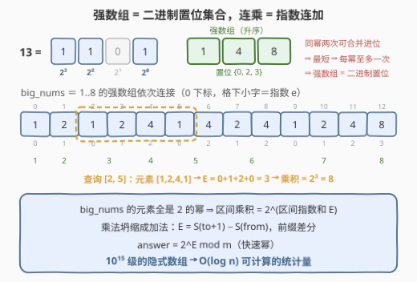
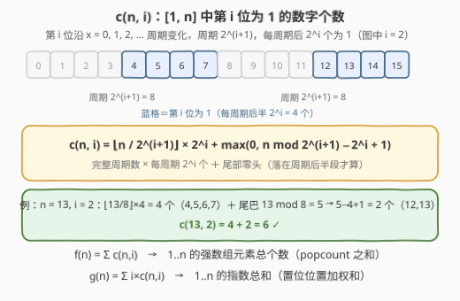
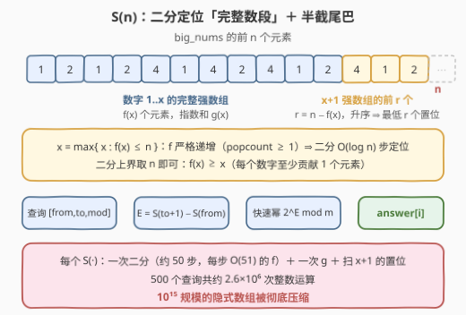
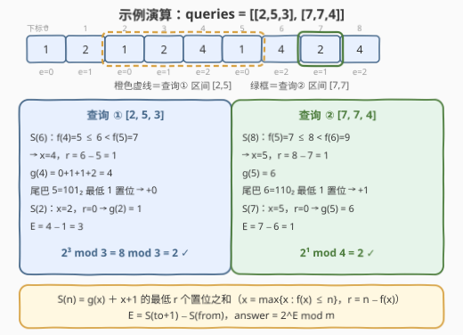

# LeetCode 大数组元素的乘积 题解

## 1. 题目概述

- **标题 / 题号**：大数组元素的乘积（#3145，hard）
- **链接**：https://leetcode.cn/problems/find-products-of-elements-of-big-array/
- **难度**：困难
- **标签**：位运算，数组，二分查找

**题意**：非负整数 $x$ 的**强数组**指的是满足「元素均为 2 的幂、元素总和为 $x$」的**最短**有序数组：

| $x$ | 二进制表示 | 强数组 |
|-----|-----------|--------|
| 1 | 0001 | $[1]$ |
| 8 | 1000 | $[8]$ |
| 10 | 1010 | $[2, 8]$ |
| 13 | 1101 | $[1, 4, 8]$ |
| 23 | 10111 | $[1, 2, 4, 16]$ |

把每个升序正整数 $1, 2, 3, \ldots$ 的强数组**依次连接**得到数组 `big_nums`，其开头部分为：

```text
[1, 2, 1, 2, 4, 1, 4, 2, 4, 1, 2, 4, 8, ...]
```

（$1 \to [1]$，$2 \to [2]$，$3 \to [1,2]$，$4 \to [4]$，$5 \to [1,4]$，……）

给定二维整数数组 `queries`，其中 `queries[i] = [from_i, to_i, mod_i]`，需要计算（`big_nums` 下标从 0 开始）：

$$\big(\text{big\_nums}[from_i] \times \text{big\_nums}[from_i + 1] \times \cdots \times \text{big\_nums}[to_i]\big) \bmod mod_i$$

返回数组 `answer`，其中 `answer[i]` 为第 $i$ 个查询的答案。

**示例 1**：

```text
输入：queries = [[1,3,7]]
输出：[4]
解释：big_nums[1..3] = [2,1,2]，乘积为 4，4 % 7 = 4。
```

**示例 2**：

```text
输入：queries = [[2,5,3],[7,7,4]]
输出：[2,2]
解释：big_nums[2..5] = [1,2,4,1]，乘积 8，8 % 3 = 2；big_nums[7] = 2，2 % 4 = 2。
```

**约束**：

- $1 \le queries.length \le 500$
- $queries[i] = [from_i, to_i, mod_i]$，$0 \le from_i \le to_i \le 10^{15}$
- $1 \le mod_i \le 10^5$

> 💡 读题关键：`big_nums` 是**隐式定义**的数组——下标高达 $10^{15}$，显式构造完全不可能，必须找到「压缩表示」。突破口藏在对「最短」二字的推敲里：同一幂出现两次即可合并进位（$2^i + 2^i = 2^{i+1}$），所以最短数组中每个幂至多出现一次——**强数组恰是 $x$ 的二进制置位集合**。此外每个元素都是 **2 的幂**，这让整道题落进位运算的框架。

## 2. 解题思路

### 2.1 暴力思路：显式展开

最直接的做法是从 $x = 1$ 开始逐个数拆二进制、展开强数组，直到覆盖下标 $to$，再对区间元素逐个连乘取模。

问题出在规模：$to \le 10^{15}$，区间长度本身就是 $10^{15}$ 级别，哪怕每个元素 $O(1)$ 处理也要 $10^{15}$ 步——远超任何时限。查询只有 500 个、每个查询只需要一个**乘积模值**，说明必须把「区间内容」压缩成可 $O(\log)$ 计算的统计量。

### 2.2 核心观察：乘积坍缩为「指数和」



**观察一（值域坍缩）：区间乘积必为 2 的整数次幂，乘法坍缩为指数加法。**

设区间内元素为 $2^{e_1}, 2^{e_2}, \ldots, 2^{e_k}$，则

$$\prod_{j} 2^{e_j} = 2^{e_1 + e_2 + \cdots + e_k}$$

于是「连乘取模」变成：先求区间**指数和** $E$，再算 $2^E \bmod m$。乘变加的意义在于：**加法才有前缀和结构**，区间和可差分为两个前缀：

$$E = S(to + 1) - S(from), \qquad S(n) = \text{big\_nums 前 } n \text{ 个元素的指数和}$$

剩下的问题只有一个：$O(\log)$ 算出 $S(n)$。

**观察二（隐式结构显式化）：前 $n$ 个元素 = 完整数段 + 半截尾巴。**

前 $n$ 个元素恰好由「数字 $1..x$ 的全部强数组」加「数字 $x+1$ 强数组的前缀」组成。定义

$$f(x) = \sum_{i=1}^{x} \operatorname{popcount}(i) \quad\text{（} 1..x \text{ 的强数组长度总和）}$$

$$g(x) = \sum_{i=1}^{x} \big(i \text{ 的二进制置位位置之和}\big) \quad\text{（} 1..x \text{ 的指数总和）}$$

（$i$ 的每个置位 $j$ 在 $g$ 中贡献 $j$，例如 $10 = 1010_2$ 的置位 $\{1, 3\}$ 贡献 $1 + 3 = 4$。）

由于每个 $i \ge 1$ 的 $\operatorname{popcount} \ge 1$，$f$ **严格递增**，可二分出**最大**的 $x$ 使 $f(x) \le n$。此时 $r = n - f(x) < \operatorname{popcount}(x+1)$，且强数组**升序**排列，故那 $r$ 个尾巴元素恰是 $x+1$ **最低的 $r$ 个置位**：

$$S(n) = g(x) + \sum_{\text{最低 } r \text{ 个置位的位置}} j$$

**观察三（$f$、$g$ 的 $O(\log n)$ 计算）：按位计数。**

两者都归结为一个原子问题：$c(n, i) = [1, n]$ 中第 $i$ 位为 1 的数字个数。第 $i$ 位的取值沿 $x = 0, 1, 2, \ldots$ 以 $2^{i+1}$ 为周期，每个周期**后** $2^i$ 个数为 1：



$$c(n, i) = \left\lfloor \frac{n}{2^{i+1}} \right\rfloor \cdot 2^i + \max\!\big(0,\; n \bmod 2^{i+1} - 2^i + 1\big)$$

$$f(n) = \sum_{i} c(n, i), \qquad g(n) = \sum_{i} i \cdot c(n, i)$$

$10^{15} < 2^{50}$，逐位枚举 $i = 0 \sim 50$ 即可，单次 $O(51)$。

### 2.3 算法流程：二分定位 + 前缀差分



1. 对每个查询 $[from, to, mod]$，计算指数和 $E = S(to + 1) - S(from)$；
2. $S(n)$ 内部：二分找最大 $x$ 使 $f(x) \le n$（上界取 $n$，因为 $f(x) \ge x$），得 $S(n) = g(x) + (x+1 \text{ 的最低 } r \text{ 个置位之和})$，其中 $r = n - f(x)$；
3. 快速幂计算 $2^E \bmod mod$，即为该查询答案。

### 2.4 示例演算



以示例 2 演算。第一个查询 $[2, 5, 3]$：

- $S(6)$：$f(4) = 5 \le 6 < f(5) = 7$，故 $x = 4$、$r = 1$；$g(4) = 0 + 1 + 1 + 2 = 4$；尾巴取 $5 = 101_2$ 的最低 1 个置位（第 0 位）$\to +0$；$S(6) = 4$；
- $S(2)$：$f(2) = 2 \le 2 < f(3) = 4$，故 $x = 2$、$r = 0$；$S(2) = g(2) = 1$；
- $E = 4 - 1 = 3$，$2^3 \bmod 3 = 8 \bmod 3 = 2$ ✓

第二个查询 $[7, 7, 4]$：$S(8) = g(5) + (6 = 110_2 \text{ 最低 1 个置位} = \text{第 1 位}) = 6 + 1 = 7$；$S(7) = g(5) = 6$；$E = 1$，$2^1 \bmod 4 = 2$ ✓

## 3. 参考代码

### C++（按位计数 + 二分 + 快速幂）

```cpp
class Solution {
    // c(n, i)：[1, n] 中第 i 位为 1 的数字个数（周期 2^(i+1)，后半 2^i 个为 1）
    static long long c(long long n, int i) {
        long long period = 1LL << (i + 1);
        long long cnt = (n / period) << i;               // 完整周期贡献
        long long rem = n % period - (1LL << i) + 1;     // 尾部零头
        return rem > 0 ? cnt + rem : cnt;
    }
    // f(x) = Σ popcount(i)：1..x 强数组总长度（元素个数）
    static long long f(long long n) {
        long long res = 0;
        for (int i = 0; i < 51; ++i) res += c(n, i);
        return res;
    }
    // S(n)：big_nums 前 n 个元素的指数和
    static long long s(long long n) {
        long long lo = 0, hi = n;
        while (lo < hi) {                       // 二分最大 x 使 f(x) ≤ n
            long long mid = lo + (hi - lo + 1) / 2;
            if (f(mid) <= n) lo = mid; else hi = mid - 1;
        }
        long long total = 0;
        for (int i = 0; i < 51; ++i) total += i * c(lo, i);  // g(x)：完整数段
        long long r = n - f(lo), y = lo + 1;                 // 尾巴 r 个元素
        for (int i = 0; i < 51 && r > 0; ++i)                // 最低 r 个置位
            if ((y >> i) & 1) { total += i; --r; }
        return total;
    }
  public:
    vector<int> findProductsOfElements(vector<vector<long long>>& queries) {
        vector<int> ans;
        ans.reserve(queries.size());
        for (auto& q : queries) {
            long long e = s(q[1] + 1) - s(q[0]);    // 区间指数和
            long long mod = q[2], res = 1, base = 2 % mod;
            while (e) {                             // 快速幂求 2^e mod m
                if (e & 1) res = res * base % mod;
                base = base * base % mod;
                e >>= 1;
            }
            ans.push_back(static_cast<int>(res % mod));  // 兜底 mod=1 / e=0
        }
        return ans;
    }
};
```

### Python（逻辑同构）

```python
class Solution:
    def findProductsOfElements(self, queries: List[List[int]]) -> List[int]:
        def f(n):                          # f(x) = Σ popcount(i)，i ∈ [1, x]
            res = 0
            for i in range(51):
                period = 1 << (i + 1)
                res += (n // period) << i           # 完整周期，每周期 2^i 个
                rem = n % period - (1 << i) + 1     # 尾部零头
                if rem > 0:
                    res += rem
            return res

        def g(n):                          # g(x) = Σ i·c(n,i)，指数总和
            res = 0
            for i in range(51):
                period = 1 << (i + 1)
                cnt = (n // period) << i
                rem = n % period - (1 << i) + 1
                if rem > 0:
                    cnt += rem
                res += i * cnt
            return res

        def s(n):                          # S(n) = 前 n 个元素的指数和
            lo, hi = 0, n
            while lo < hi:                 # 二分最大 x 使 f(x) ≤ n
                mid = (lo + hi + 1) >> 1
                if f(mid) <= n:
                    lo = mid
                else:
                    hi = mid - 1
            total, r, y = g(lo), n - f(lo), lo + 1
            for i in range(51):            # 尾巴：x+1 的最低 r 个置位
                if r == 0:
                    break
                if (y >> i) & 1:
                    total += i
                    r -= 1
            return total

        return [pow(2, s(q[1] + 1) - s(q[0]), q[2]) for q in queries]
```

> 💡 实现细节：二分循环里只调用 $f$（判定 $f(mid) \le n$），$g$ 只在定位完 $x$ 后算一次，避免无谓的重复求和；Python 的 `pow(2, e, mod)` 原生处理大指数与 `mod = 1`，C++ 快速幂最后补一次 `res % mod`，同时兜底 $e = 0$（此时结果为 $1 \bmod m$）与 $mod = 1$（恒为 0）两种边界。

## 4. 复杂度分析

| 维度 | 复杂度 | 说明 |
|------|--------|------|
| 时间复杂度 | $O(q \cdot B \cdot \log n)$，$B = 51$ | 每个查询 2 次 $S(\cdot)$，每次二分 $\log_2 10^{15} \approx 50$ 步、每步一次 $f$ 为 $O(B)$；总计约 $500 \times 2 \times 50 \times 51 \approx 2.6 \times 10^6$ 次整数运算 |
| 空间复杂度 | $O(1)$ | 只用常数个计数变量（不含输出数组） |

> 💡 从暴力到正解的演进：显式展开 $O(10^{15})$ → 「乘积 = 2 的指数和」把查询变成**区间和** → 前缀差分把区间和变成**两个前缀** → 「完整数段 + 半截尾巴」把前缀拆成 $g(x)$ 与最低 $r$ 个置位 → 按位计数 $c(n, i)$ 让 $f$、$g$ 都能 $O(\log n)$ 求出。每一层压缩都建立在前一层「结构被坍缩」之上。

## 5. 扩展：数值域检查与免二分写法

**数值域检查**：单个查询里 $E \le S(10^{15} + 1) \approx 2.2 \times 10^{16}$，$i \cdot c(n, i)$ 至多约 $2.5 \times 10^{16}$，均远小于 `long long` 上限（$\approx 9.2 \times 10^{18}$），C++ 无溢出风险；快速幂的指数移位也在 64 位内安全。Python 天然大整数，无需关心。

**免二分的数位下降**：二分并非唯一定位 $x$ 的方式。也可以从高位到低位**逐位确定** $x$ 的每一位（每固定一位，用 $c$ 式累计「已确定前缀下方的元素个数」，与 $n$ 比较决定该位取 0 还是 1），把 $S(n)$ 降到 $O(B^2)$ 且完全不开二分。本题 $B$ 极小，两种写法复杂度同阶，二分版更短、更不易写错。

**为什么 mod 很小不是重点**：$E$ 本身可以显式表示（$< 2^{63}$），所以直接快速幂即可；若强数组换成「3 的幂拆分」之类，乘积仍是同底幂、指数依然可加，但若连底数都各不相同，乘积就无法坍缩成加法，必须借助欧拉定理在模域内降幂——「所有元素同底」才是本题可解的本质。

## 6. 面试要点

1. **强数组为什么恰是二进制置位集合？**

   - 「最短」是关键：若同一幂 $2^i$ 出现两次，可合并为 $2^{i+1}$ 使数组更短；反之二进制拆分中各幂互不相同、元素个数恰为 $\operatorname{popcount}(x)$，达到下界。于是强数组与二进制一一对应，题目才得以纳入位运算框架。

2. **乘积为什么能转成指数和？前缀和差分的前提是什么？**

   - 所有元素都是 2 的幂，$2^{e_1} \cdots 2^{e_k} = 2^{\sum e_j}$，连乘坍缩为指数连加。加法可减，才能写成 $E = S(to+1) - S(from)$；乘法没有这种逆运算结构。这是「隐式数组的区间统计」的通用套路。

3. **$c(n, i)$ 的公式怎么推导？**

   - 第 $i$ 位沿 $0, 1, 2, \ldots$ 呈周期 $2^{i+1}$ 的方波，每个周期后 $2^i$ 个为 1。$[1, n]$ 含 $\lfloor n / 2^{i+1} \rfloor$ 个完整周期贡献 $\lfloor n / 2^{i+1} \rfloor \cdot 2^i$；余下 $n \bmod 2^{i+1}$ 个数里，只有落在周期后半段（超过 $2^i - 1$）的部分才是 1，零头为 $\max(0, n \bmod 2^{i+1} - 2^i + 1)$。

4. **二分在搜什么？单调性与上界来自哪里？**

   - 搜最大的 $x$ 使 $f(x) \le n$。$f$ 严格递增：$f(x) - f(x-1) = \operatorname{popcount}(x) \ge 1$；上界取 $n$ 是因为 $f(x) \ge x$（每个数至少贡献 1 个元素）。找到的 $x$ 保证尾巴 $r = n - f(x) < \operatorname{popcount}(x+1)$，最低置位永远够取。

5. **尾巴为什么取「最低 $r$ 个置位」而不是任意 $r$ 个？**

   - 强数组是**升序**的（题面「有序数组」+ 示例均升序），数字 $x+1$ 的强数组前 $r$ 个元素恰是其最小的 $r$ 个幂，即最低的 $r$ 个置位。顺序搞反，$S(n)$ 就会算错。

## 同类练习题

| # | 题目 | 与本题的关联 |
|---|------|-------------|
| 191 | [位 1 的个数](https://leetcode.cn/problems/number-of-1-bits/) | $\operatorname{popcount}$ 基础，本题 $f(x)$ 的砖块 |
| 233 | [数字 1 的个数](https://leetcode.cn/problems/number-of-digit-one/) | 「$[1, n]$ 中某数字出现次数」的周期分块计数母题，$c(n, i)$ 的十进制镜像 |
| 600 | [不含连续 1 的非负整数](https://leetcode.cn/problems/non-negative-integers-without-consecutive-ones/) | 按位统计 $[1, n]$ 的数位 DP 进阶，练「逐位拆计数」的手感 |
| 3133 | [数组最后一个元素的最小值](https://leetcode.cn/problems/minimum-array-end/) | 按位构造 + $\operatorname{popcount}$ 预算的同家族题，本仓库已有题解 |
| 50 | [Pow(x, n)](https://leetcode.cn/problems/powx-n/) | 快速幂母题，本题最后一步 $2^E \bmod m$ 的基石 |
