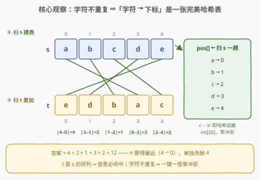
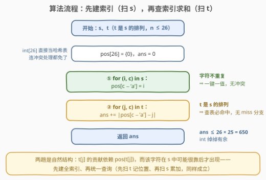
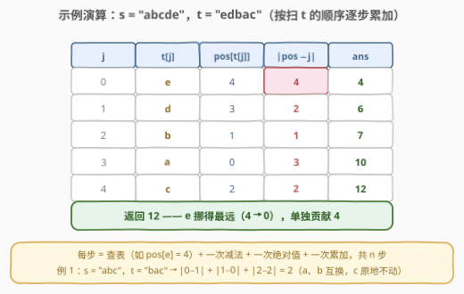

# 两个字符串的排列差

- **题目名称**：两个字符串的排列差
- **链接**：[3146. 两个字符串的排列差](https://leetcode.cn/problems/permutation-difference-between-two-strings/)
- **难度**：简单
- **标签**：哈希表、字符串

## 1. 题目概述

给你两个字符串 `s` 和 `t`，每个字符串中的字符都**不重复**，且 `t` 是 `s` 的一个**排列**。

**排列差** 定义为 `s` 和 `t` 中每个字符在两个字符串中**位置的绝对差值之和**。

返回 `s` 和 `t` 之间的 **排列差**。

**示例 1**：

```text
输入：s = "abc", t = "bac"
输出：2
解释：|0 − 1| + |1 − 0| + |2 − 2| = 1 + 1 + 0 = 2。
```

**示例 2**：

```text
输入：s = "abcde", t = "edbac"
输出：12
解释：|0 − 3| + |1 − 2| + |2 − 4| + |3 − 1| + |4 − 0| = 3 + 1 + 2 + 2 + 4 = 12。
```

**约束条件**：

- $1 \le \text{s.length} \le 26$
- 每个字符在 `s` 中**最多出现一次**
- `t` 是 `s` 的一个排列
- `s` 仅由小写英文字母组成

> 💡 读题关键：题目把三件「礼物」直接写进了约束——**字符不重复**（字符 → 下标是一对一映射）、**t 是 s 的排列**（两串等长、字符集相同）、**只有小写字母**（$c - \text{'a'}$ 就是完美哈希函数）。答案的定义式 $\text{ans} = \sum_c \left| \text{pos}_s(c) - \text{pos}_t(c) \right|$，翻译成代码后只剩一个问题：怎么高效拿到 $\text{pos}_s(c)$。

---

## 2. 解题思路

### 2.1 暴力思路

对 `t` 的每个下标 $j$，在 `s` 里从头**线性搜索**字符 $t_j$ 的下标 $i$（C++ 的 `s.find()`、Python 的 `s.index()`），累加 $|i - j|$。时间 $O(n^2)$——$n \le 26$ 时至多 676 次比较，事实上能过，但纯属浪费：「字符 → `s` 中的下标」这个函数在整个循环期间**恒定不变**，却在每一轮被重新计算。

优化的方向就是把重复计算变成**一次建表、多次查询**。

### 2.2 核心观察：字符不重复 ⇒「字符 → 下标」是一张完美哈希表



三个约束逐条兑换成代码性质：

1. **每个字符不重复** ⇒ `pos[c] = i` **一键一值**，建表没有冲突，也没有「多次出现取哪个」的歧义；
2. **t 是 s 的排列** ⇒ 扫 `t` 时每个字符**必然命中** `pos` 表，连「查不到」的分支都不用写；
3. **仅小写字母** ⇒ $c - \text{'a'} \in [0, 25]$，一张 `int[26]` 就是现成的哈希表——不用 `unordered_map`，不用哈希函数，不用冲突处理。

于是答案塌缩成一个查表求和：

$$\text{ans} = \sum_{j=0}^{n-1} \left| \text{pos}[t_j] - j \right|$$

> 💡 对照 [205. 同构字符串](https://leetcode.cn/problems/isomorphic-strings/)：那里必须**手动验证双向双射**（s→t 与 t→s 两张表都要核对），因为输入不保证任何映射性质；本题的「t 是 s 的排列」把双射**白送**了，一张单向表就够。识别「前提帮你免掉了多少防御性代码」，正是这类简单题真正的考点。

### 2.3 算法流程图



流程只有四步：

1. `pos[26]` 与 `ans` 清零；
2. **第一趟扫 `s`**：`pos[s[i] − 'a'] = i`；
3. **第二趟扫 `t`**：`ans += |pos[t[j] − 'a'] − j|`；
4. 返回 `ans`。

两趟的顺序也可以反过来（先扫 `t` 记位置、再扫 `s` 累加），和式不变——但「先建索引、再查索引」的结构是本质的：$t_j$ 的贡献依赖 $\text{pos}(t_j)$，而这个字符在 `s` 中可能很靠后才出现。

### 2.4 示例演算



以示例 2 `s = "abcde"`、`t = "edbac"` 为例，第二趟扫 `t` 逐字符演算：

| $j$ | $t_j$ | $\text{pos}[t_j]$ | $\lvert \text{pos} - j \rvert$ | `ans` 累加 |
|-----|-------|------------------|-------------------------------|-----------|
| 0 | `e` | 4 | 4 | 4 |
| 1 | `d` | 3 | 2 | 6 |
| 2 | `b` | 1 | 1 | 7 |
| 3 | `a` | 0 | 3 | 10 |
| 4 | `c` | 2 | 2 | **12** |

示例 1 `"abc"`/`"bac"` 则是「最小扰动」：`a`、`b` 相邻互换各贡献 1，`c` 原地不动贡献 0，答案 2。

---

## 3. 参考代码

### C++

```cpp
class Solution {
  public:
    int findPermutationDifference(string s, string t) {
        int pos[26] = {};                        // 字符 → 在 s 中的下标
        for (int i = 0; i < (int)s.size(); ++i)
            pos[s[i] - 'a'] = i;                 // 字符不重复：一键一值，无冲突
        int ans = 0;
        for (int j = 0; j < (int)t.size(); ++j)
            ans += abs(pos[t[j] - 'a'] - j);     // t 是 s 的排列：查表必命中
        return ans;
    }
};
```

### Python

```python
class Solution:
    def findPermutationDifference(self, s: str, t: str) -> int:
        pos = {c: i for i, c in enumerate(s)}
        return sum(abs(j - pos[c]) for j, c in enumerate(t))
```

> 💡 写法盘点：Python 用字典推导一趟建成 `pos`，`sum` + 生成器表达式跑第二趟，是最地道的形态。**不要**图省事写 `sum(abs(j - s.index(c)) for j, c in enumerate(t))`——`str.index` 是藏在循环里的 $O(n)$ 查找，整体退化成 $O(n^2)$；本题 $n \le 26$ 无感，换到长串上就是事故。C++ 里对应的坑是循环内 `s.find(t[j])`。

---

## 4. 复杂度分析

| 维度 | 复杂度 | 说明 |
|------|--------|------|
| 时间复杂度 | $O(n)$ | 两趟扫描，每步 $O(1)$；$n \le 26$，实际视作常数 |
| 空间复杂度 | $O(\lvert\Sigma\rvert)$ | 位置表 26 格，只由字符集大小决定，与 $n$ 无关 |
| 答案规模 | $\le 650$ | 至多 26 项 × 单项最大差 25，`int` 无溢出（紧界见第 5 节：338） |

---

## 5. 扩展：这把尺子有名字——Spearman footrule 距离

「每个元素在两个排列中位置的绝对差之和」在统计学里是老熟人：**Spearman footrule 距离**（足则距离），衡量两个**排名**的不一致程度。它的两个姊妹度量更常被引用：

- **Kendall $\tau$ 距离**：数两个排名中**顺序相反的元素对**（逆序对）个数——量「有多少对次序错了」；
- **平方版** $\sum (i - j)^2$：Spearman 秩相关系数的分子核心——量「错得多远」，并对远离加重惩罚。

三者由 **Diaconis–Graham 不等式**串起：$K \le F \le 2K$（$K$ 为逆序对数，$F$ 为 footrule）。本题的 footrule 正是「位置偏移幅度」的度量——示例 2 里 `e` 从位置 4 挪到 0，单项就贡献 4。这些度量是排名聚合（rank aggregation）、推荐系统列表比较的基石。

**上界有多紧**：一行不等式给出松界 $n \times (n-1) \le 26 \times 25 = 650$；紧界其实是 $\lfloor n^2/2 \rfloor$。证明思路很美：在排名的每个「切口」$k$（位置 $k$ 与 $k+1$ 之间）统计**跨过切口**的元素个数 $c_k$——从左跨到右与从右跨到左的人数必相等（两侧落点总量各自守恒），故 $c_k \le 2\min(k+1, n-k-1)$；而 $\sum_k c_k$ 恰好等于 $F$（每个元素贡献它跨过的切口数）。对 $n = 26$ 求和得 $338$，完全倒序 `zyx…a` 取到。有趣的是，示例 2 的 `edbac` 在 $n = 5$ 时恰好也取到上界 $\lfloor 25/2 \rfloor = 12$——最大化者并不只有倒序一个。

---

## 6. 面试要点

1. **为什么一张单向的 pos 表就够了，不需要双向映射？**

   - 「t 是 s 的排列」保证两串字符集相同、每个字符各出现一次，双射**由前提白送**；扫 `t` 查 `pos_s` 即可。对照 205 同构字符串：输入无任何保证，必须双向两张表核验双射。

2. **int[26] 和 unordered_map 怎么选？**

   - 键域是连续小区间 $[0, 26)$ 时数组就是完美哈希：无哈希计算、无冲突、缓存友好。字符集是任意 Unicode 时才需要真哈希表。「值域小 → 用数组」与计数排序、桶思想同源。

3. **如果去掉「t 是 s 的排列」这个前提，代码要改哪里？**

   - `pos` 初始化为 −1，查表判 miss（缺失字符按题意跳过或直接无解）；若进一步允许重复字符，「位置」不再唯一，需先和面试官澄清定义（首次出现？全部配对？）。这是考察对前提的敏感度。

4. **答案的最大可能值是多少？**

   - 松界 $26 \times 25 = 650$（项数 × 单项上界）；紧界 $\lfloor n^2/2 \rfloor$，$n = 26$ 时为 338，完全倒序取到。能主动给出紧界并讲出切口论证（见第 5 节）是明确加分项。

5. **Python 一行版 sum(abs(j − s.index(c)) …) 有什么坑？**

   - `str.index` 是循环内的隐式 $O(n)$ 扫描，整体 $O(n^2)$。先建 dict 再查是 $O(n)$。「能过」和「该写」之间的差距，就是这题在面试里真正的区分度。

---

## 7. 同类练习题

- [1. 两数之和](https://leetcode.cn/problems/two-sum/)（[站内题解](../0001-0100/1_两数之和.md)）：哈希「用 O(1) 查换掉线性找」的母题，与本题动机同源
- [205. 同构字符串](https://leetcode.cn/problems/isomorphic-strings/)：字符映射判双射的完整版——本题靠排列前提白拿双射，那里要双向两表手动验
- [219. 存在重复元素 II](https://leetcode.cn/problems/contains-duplicate-ii/)：哈希记「上次出现下标」，同为「字符 → 下标」表驱动的判定
- [3110. 字符串的分数](https://leetcode.cn/problems/score-of-string/)（[站内题解](3110_字符串的分数.md)）：同款 $\sum \lvert a - b \rvert$ 骨架，配对关系从「同位字符」换成「相邻字符」
- [3141. Maximum Hamming Distances](https://leetcode.cn/problems/maximum-hamming-distances/)（[站内题解](3141_最大汉明距离.md)）：距离度量家族姊妹篇——汉明距离数「错位数」，本题 footrule 量「偏移幅度」
