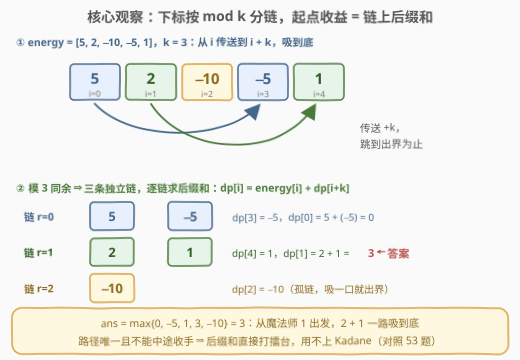
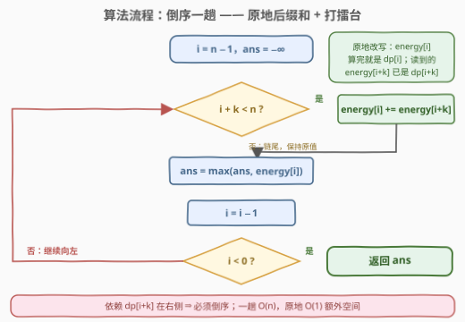
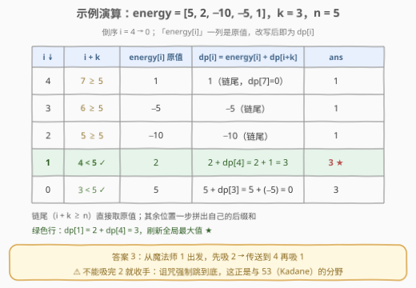

# 从魔法师身上吸取的最大能量

- **题目名称**：从魔法师身上吸取的最大能量
- **链接**：[3147. 从魔法师身上吸取的最大能量](https://leetcode.cn/problems/taking-maximum-energy-from-the-mystic-dungeon/)
- **难度**：中等
- **标签**：数组、动态规划、前缀和

## 1. 题目概述

$n$ 个魔法师站成一排，`energy[i]` 是第 $i$ 位身上的能量——**可正可负**，负数意味着他会反过来吸走你的能量。

你被施了诅咒：选择一个起点 $i$，吸取 `energy[i]` 后**立即被传送到** $i+k$ 处，再吸、再传送……直到 $i+k$ 超出序列末端为止。**过程中经过的所有能量都必须吸**——不能拒吸、不能中途退出。

问：你能获得的**最大**总能量是多少？

**示例 1**：

```text
输入：energy = [5, 2, -10, -5, 1], k = 3
输出：3
解释：从魔法师 1 出发，吸取 2 + 1 = 3。
```

**示例 2**：

```text
输入：energy = [-2, -3, -1], k = 2
输出：-1
解释：从魔法师 2 出发，吸取 -1。
```

**约束条件**：

- $1 \le \text{energy.length} \le 10^5$
- $-1000 \le \text{energy}[i] \le 1000$
- $1 \le k \le \text{energy.length} - 1$

> 💡 读题关键：抓三件事。① **起点是唯一自由度**——起点定了，路径（$i \to i+k \to i+2k \to \cdots$）就完全定了，没有任何中途选择；② **必须吸到底**——没有「提前收手」选项，这是与最大子段和问题的本质分野；③ **答案可以是负数**——全负时只能「亏得最少」，示例 2 就是明证，初始化打擂台时不能从 0 开始。

---

## 2. 解题思路

### 2.1 暴力思路

对每个起点 $i$，沿链 $i \to i+k \to i+2k \to \cdots$ 一路跳到底累加，最后取最大值。总跳数为

$$\sum_{i=0}^{n-1} \left\lceil \frac{n-i}{k} \right\rceil \approx \frac{n^2}{2k}$$

$k=1$ 时约 $\frac{n^2}{2} \approx 5 \times 10^9$（$n = 10^5$），必然超时。浪费点也很明显：从 $i$ 出发的收益与从 $i+k$ 出发的收益只差一步，却被整条链重算了一遍——典型的**重叠子问题**。

### 2.2 核心观察：模 k 同余分链 + 后缀和 DP



把「诅咒」翻译成结构语言，四步到位：

1. **分链**：跳跃规则 $i \to i+k$ 把下标按 **模 $k$ 同余**分成 $k$ 条互不相交的链：$r,\ r+k,\ r+2k,\ \cdots$。起点 $i$ 的整条路径都落在第 $i \bmod k$ 条链上，链与链之间毫无交集。
2. **无选择**：路径唯一且必须走完 ⇒ 从 $i$ 出发的收益就是链上**从 $i$ 开始的后缀和**，连「要不要继续」都不用讨论。
3. **递推**：定义 $dp[i]$ 为从 $i$ 出发的收益，则

$$dp[i] = \text{energy}[i] + dp[i+k], \qquad i+k \ge n \text{ 时 } dp[i+k] = 0$$

   依赖**全部在右侧** ⇒ 从右往左一趟即可算完。
4. **原地**：倒序遍历时，`energy[i+k]` 已被改写成 $dp[i+k]$，直接 `energy[i] += energy[i+k]`——连滚动数组都不需要，输入数组自己就是 dp 数组。

> ⚠️ **别顺手套 Kadane**：$dp[i]$ 里没有 $\max(0,\ \cdot)$ 那一项。对照 [53. 最大子数组和](../0001-0100/53_最大子数组和.md)——那里子串可以中途丢弃劣质前缀，这里诅咒强制吸到底，连提前跳车的门都没有。识别「问题**不是**最大子段和」比会写 Kadane 更重要。

### 2.3 算法流程图



流程只有一个主循环，从 $i = n-1$ 倒序走到 $0$：

1. 若 $i + k < n$：`energy[i] += energy[i+k]`（原地后缀和）；
2. 否则 `energy[i]` 保持原值（链尾，$dp[i+k] = 0$）；
3. `ans = max(ans, energy[i])` 打擂台；
4. `i` 左移一位；$i < 0$ 时返回 `ans`。

正确性锚点就一句：**依赖在右，遍历向左**——读到 `energy[i+k]` 时它必定已被更新为 $dp[i+k]$，正序遍历则会读到尚未加工的原值。

### 2.4 示例演算



以示例 1 `energy = [5, 2, -10, -5, 1]`、$k = 3$ 为例，倒序演算：

| $i$ | $i+k$ | energy[i] 原值 | $dp[i]$ | `ans` |
|-----|-------|---------------|---------|-------|
| 4 | 7 ≥ 5 越界 | 1 | 1 | 1 |
| 3 | 6 ≥ 5 越界 | −5 | −5 | 1 |
| 2 | 5 ≥ 5 越界 | −10 | −10 | 1 |
| 1 | 4 ✓ | 2 | 2 + dp[4] = 3 | **3** |
| 0 | 3 ✓ | 5 | 5 + dp[3] = 0 | 3 |

三条链的后缀和：链 $r=0$ 得 $\{0, -5\}$，链 $r=1$ 得 $\{3, 1\}$，链 $r=2$ 得 $\{-10\}$，全局最大 $3$。示例 2 全负时，三个单点「链尾」$-2,-3,-1$ 中取最优的 $-1$——印证了答案可以为负。

---

## 3. 参考代码

### C++

```cpp
class Solution {
  public:
    int maximumEnergy(vector<int>& energy, int k) {
        int n = energy.size(), ans = INT_MIN;
        for (int i = n - 1; i >= 0; --i) {
            if (i + k < n)
                energy[i] += energy[i + k];   // dp[i] = energy[i] + dp[i+k]
            ans = max(ans, energy[i]);        // energy[i] 此刻已是 dp[i]
        }
        return ans;
    }
};
```

### Python

```python
class Solution:
    def maximumEnergy(self, energy: List[int], k: int) -> int:
        n = len(energy)
        ans = float("-inf")
        for i in range(n - 1, -1, -1):
            if i + k < n:
                energy[i] += energy[i + k]    # dp[i] = energy[i] + dp[i+k]
            ans = max(ans, energy[i])
        return ans
```

> 💡 写法盘点：打擂台的 `ans` 必须初始化为 $-\infty$ 而非 0——全负数组时答案就是负数（示例 2）。若不介意两趟扫描，循环里只做累加、最后 `return *max_element(...)` / `max(energy)` 也完全等价，且省去初始化的心智负担。

---

## 4. 复杂度分析

| 维度 | 复杂度 | 说明 |
|------|--------|------|
| 时间复杂度 | $O(n)$ | 倒序一趟，每个下标 $O(1)$ |
| 空间复杂度 | $O(1)$ | 原地改写输入数组即 dp 数组；不改输入的写法见第 5 节 |
| 值域安全 | $\lvert dp \rvert \le 10^8$ | 链长至多 $\lceil n/k \rceil \le 10^5$，每项 $\le 1000$，$10^8 < 2^{31}-1$，`int` 不溢出 |

---

## 5. 扩展：规则微调一下会怎样

这道题是「骨架裸露」的 DP——把规则拧一拧，立刻变成别的经典题，非常适合面试追问：

- **允许中途收手**（跳到某处可以喊停）：$dp[i] = \text{energy}[i] + \max(0,\ dp[i+k])$——$\max(0,\cdot)$ 回来了！这就是**链上 Kadane**，53 题的步长 $k$ 版。一个 $\max$ 的有无，对应「能不能提前跳车」这一条规则。
- **步长改成 1..k 任选**（每步可跳 1 到 $k$ 格、必须到终点）：$dp[i] = \text{energy}[i] + \max_{1 \le j \le k} dp[i+j]$，滑动窗口取最大值需**单调队列**优化到 $O(n)$——正是 [1696. 跳跃游戏 VI](../1601-1700/1696_跳跃游戏VI.md)。
- **$k = 1$ 特例**：整条数组只有一条链，问题退化为「最大后缀和」$\max_i \sum_{j \ge i} \text{energy}[j]$。
- **不想破坏输入**：只留每条链最近一个后缀和，用 $O(k)$ 的数组 `suf[i % k] += energy[i]` 滚动即可——「按余数分桶」与桶排序、约瑟夫环编号是同一个思想。

---

## 6. 面试要点

1. **为什么不用 Kadane / 最大子段和？**

   - 路径由起点和 $k$ 完全决定，且必须吸到底，没有任何「丢弃劣质段」的决策点，$dp$ 里自然没有 $\max(0,\cdot)$。一旦规则改成允许中途收手，这个 $\max$ 立刻回来（见第 5 节）——能主动指出这条边界，说明真正读懂了模型。

2. **为什么必须倒序？原地更新为什么正确？**

   - $dp[i]$ 依赖 $dp[i+k]$（更靠右）。倒序保证处理 $i$ 时 `energy[i+k]` 已被改写为 $dp[i+k]$；正序则读到的是未加工原值。原地更新本质是「数组即滚动状态」，被读的永远是已算好的格子。

3. **`int` 会不会溢出？**

   - 一条链至多 $\lceil n/k \rceil \le 10^5$ 项，每项绝对值 $\le 1000$，$|dp| \le 10^8 < 2^{31}-1 \approx 2.1 \times 10^9$，安全。若面试官放宽值域（如 $10^9$），改用 `long long`——主动报出这个估算过程是加分项。

4. **不修改输入数组怎么做？**

   - 开 $O(n)$ 的 dp 数组直接抄递推；更进一步用 $O(k)$ 空间：`suf[i % k] += energy[i]` 滚动维护每条链当前后缀和（第 5 节末的写法），把「按余数分桶」的空间压到最小。

5. **暴力为什么超时、优化砍掉了什么？**

   - 暴力总跳数 $\approx \frac{n^2}{2k}$，$k=1$ 时约 $5\times10^9$。重复在于「从 $i$ 出发」与「从 $i+k$ 出发」的收益只差一步却被整链重算——后缀和递推把每格计算压到 $O(1)$，正是重叠子问题的标准处置。

---

## 7. 同类练习题

- [53. 最大子数组和](https://leetcode.cn/problems/maximum-subarray/)（[站内题解](../0001-0100/53_最大子数组和.md)）：Kadane 允许中途丢弃劣质前缀（$\max(0,\cdot)$），本题没有这个选项——对照着各写一遍最能体会差别
- [918. 环形子数组的最大和](https://leetcode.cn/problems/maximum-sum-circular-subarray/)（[站内题解](../0901-1000/918_最大环形子数组和.md)）：区间和家族的环形变体，`total − min` 与本题的后缀和递推同为「换个方向看累加」
- [1696. 跳跃游戏 VI](https://leetcode.cn/problems/jump-game-vi/)（[站内题解](../1601-1700/1696_跳跃游戏VI.md)）：同是「向右跳、必须到终点求最大得分」，但步长 1..k 可选 ⇒ 单调队列优化 DP，本题是其「步长固定」的简化版
- [724. 寻找数组的中心下标](https://leetcode.cn/problems/find-pivot-index/)（[站内题解](../0701-0800/724_寻找数组的中心下标.md)）：前缀和基本操作，与本题的后缀和互为镜像方向
