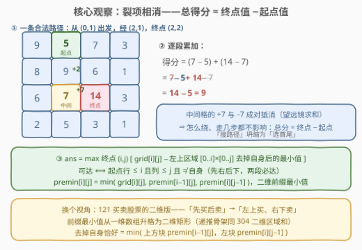
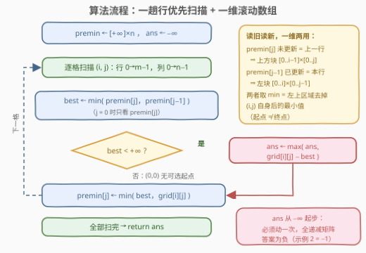
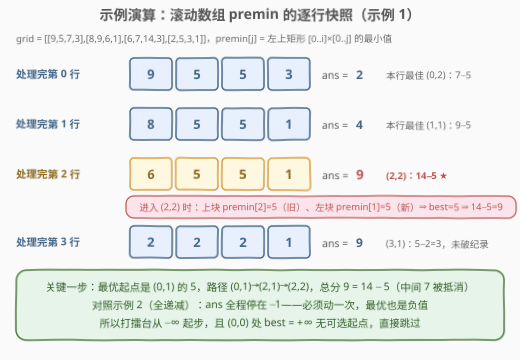

# LeetCode 矩阵中的最大得分 题解

## 1. 题目概述

- **标题 / 题号**：矩阵中的最大得分（#3148，medium）
- **链接**：https://leetcode.cn/problems/maximum-difference-score-in-a-grid/
- **难度**：中等
- **标签**：数组、动态规划、矩阵

**题意**：给一个由**正整数**组成、大小为 $m \times n$ 的矩阵 `grid`。每一步可以从某个格子移动到**正下方或正右侧**的任意格子（**不必相邻**，一步可以跨越多格）。从值 $c_1$ 的格子移动到值 $c_2$ 的格子，得分为 $c_2 - c_1$。

你可以从**任意**格子出发，但**必须至少移动一次**（原地不动不算）。返回能获得的最大总得分。

**示例 1**：

```text
输入：grid = [[9,5,7,3],[8,9,6,1],[6,7,14,3],[2,5,3,1]]
输出：9
解释：从 (0,1) 出发：(0,1)→(2,1) 得 7−5=2；(2,1)→(2,2) 得 14−7=7；总计 9。
```

**示例 2**：

```text
输入：grid = [[4,3,2],[3,2,1]]
输出：-1
解释：从 (0,0) 移动到 (0,1)，得 3−4=−1。全矩阵递减，亏得最少也是 −1。
```

**约束**：

- $2 \le m, n \le 1000$
- $4 \le m \cdot n \le 10^5$
- $1 \le grid[i][j] \le 10^5$

> 💡 读题抓三点：① 移动只向**下/右**（不必相邻）⇒ 任何合法路径都是一条「单调折线」；② 总得分是各段「到达值 − 出发值」的**累加**；③ **至少动一次**，且格子全是正数也不保证答案为正——示例 2 直接给出 −1，打擂台必须从 $-\infty$ 起步。

## 2. 解题思路

### 2.1 暴力思路

最朴素：DFS 枚举所有路径——每步可选「同列向下」或「同行向右」的任意格，路径数是指数级，直接放弃。

退一步：先接受「得分只看首尾」（下节证明），枚举所有（起点， 终点）对。可达性判定 $O(1)$：起点 $(x,y)$ 能到终点 $(i,j)$ ⟺ $x \le i$ 且 $y \le j$ 且 $(x,y) \ne (i,j)$。但点对共 $O((mn)^2) \approx 10^{10}$ 个（$mn = 10^5$），依然超时。浪费点在于：**对每个终点都重新扫了一遍它的整个左上区域找最小起点**——这正是可以一次性预处理掉的部分。

### 2.2 核心观察：裂项相消——得分只由首尾决定



一条路径 $c_0 \to c_1 \to \cdots \to c_k$ 的总得分为

$$\sum_{t=1}^{k} (c_t - c_{t-1}) = (c_1 - c_0) + (c_2 - c_1) + \cdots + (c_k - c_{k-1}) = c_k - c_0$$

**中间格子两两成对抵消**（望远镜求和 telescoping sum）。走一步还是一百步、怎么绕，都不影响总分——**只由起点值和终点值决定**。于是问题坍缩为：

$$\text{ans} = \max_{\text{终点 } (i,j)} \Big( grid[i][j] - \min_{\substack{0 \le x \le i,\ 0 \le y \le j \\ (x,y) \neq (i,j)}} grid[x][y] \Big)$$

三个配套事实：

1. **可达性**：起点 $(x,y)$ 能到达 $(i,j)$ ⟺ $x \le i$ 且 $y \le j$ 且 $(x,y) \neq (i,j)$——先在同一行向右滑到 $(x, j)$，再在同一列向下滑到 $(i, j)$，两段拼出合法路径（某一维相等就只走一段）。
2. **「去掉自身」的矩形最小值**：设 $premin[i][j]$ 为左上矩形 $[0..i] \times [0..j]$（**含自身**）的最小值，则去掉自身后的最小值恰好是 $\min(premin[i-1][j],\ premin[i][j-1])$——任何 $\ne (i,j)$ 的区域内格子，要么行号 $< i$（被上方块覆盖），要么行号 $= i$ 且列号 $< j$（被左块覆盖），不重不漏。
3. **递推**：$premin[i][j] = \min(grid[i][j],\ premin[i-1][j],\ premin[i][j-1])$——正是 [304. 二维区域和检索](../0301-0400/304_二维区域和检索%20-%20数组不可变.md) 那套「上、左两块合并」的矩形前缀骨架，把「求和」换成「取最小」。

> 💡 换个视角：这就是 [121. 买卖股票的最佳时机](../0101-0200/121_买卖股票的最佳时机.md) 的**二维版**——「先买后卖」变成「左上买、右下卖」，前缀最小值从一维数组升格为二维矩形。

### 2.3 算法流程图



逐行从上到下、行内从左到右扫一遍，用一维滚动数组 `premin[n]` 同时承担两个角色：

- 读 `premin[j]`（**尚未更新**）= 上一行版本 = $premin[i-1][j]$，即「上方块」的最小值；
- 读 `premin[j-1]`（**已更新**）= 本行版本 = $premin[i][j-1]$，即「左块」的最小值；
- 两者取 min 得 `best`，若 `best < +∞`（排除 $(0,0)$ 无可选起点），打擂台 `ans = max(ans, grid[i][j] − best)`；
- 最后写回 `premin[j] = min(best, grid[i][j])`。

正确性锚点就一句：**行内从左到右更新**，天然让「左」读新、「上」读旧——一个物理数组在同一时刻承载两代数据，$i=0$、$j=0$ 的边界由初始 $+\infty$ 自然兜底。

### 2.4 示例演算



以示例 1 为例，逐行给出 `premin` 快照与 `ans`：

| 处理完 | premin（滚动数组） | ans | 本行最佳 |
|--------|-------------------|-----|----------|
| 第 0 行 | [9, 5, 5, 3] | 2 | (0,2)：7 − 5 |
| 第 1 行 | [8, 5, 5, 1] | 4 | (1,1)：9 − 5 |
| 第 2 行 | [6, 5, 5, 1] | **9** | (2,2)：14 − 5 ← |
| 第 3 行 | [2, 2, 2, 1] | 9 | (3,1)：5 − 2 = 3，未破纪录 |

关键一步在 $(2,2)$：`best = min(上方块 5, 左块 5) = 5`，$14 - 5 = 9$——最优起点正是 $(0,1)$ 的 5，对应路径 $(0,1) \to (2,1) \to (2,2)$。示例 2 全矩阵递减，`ans` 全程停在 −1，印证「必须动一次 ⇒ 答案可为负」。

## 3. 参考代码

### C++

```cpp
class Solution {
  public:
    int maxScore(vector<vector<int>>& grid) {
        int m = grid.size(), n = grid[0].size();
        const int INF = INT_MAX;
        vector<int> premin(n, INF);      // 滚动数组：矩形 [0..i][0..j] 的最小值
        int ans = INT_MIN;
        for (int i = 0; i < m; ++i) {
            for (int j = 0; j < n; ++j) {
                int best = premin[j];    // 未更新 = 上一行：上方块 [0..i-1][0..j]
                if (j > 0) best = min(best, premin[j - 1]);  // 已更新 = 本行：左块 [0..i][0..j-1]
                if (best != INF)         // (0,0) 无可选起点，跳过
                    ans = max(ans, grid[i][j] - best);
                premin[j] = min(best, grid[i][j]);
            }
        }
        return ans;
    }
};
```

### Python

```python
from math import inf

class Solution:
    def maxScore(self, grid: List[List[int]]) -> int:
        m, n = len(grid), len(grid[0])
        premin = [inf] * n               # 滚动数组：矩形 [0..i][0..j] 的最小值
        ans = -inf
        for i in range(m):
            for j in range(n):
                best = premin[j]         # 未更新 = 上一行：上方块 [0..i-1][0..j]
                if j > 0:
                    best = min(best, premin[j - 1])  # 已更新 = 本行：左块 [0..i][0..j-1]
                if best < inf:           # (0,0) 无可选起点，跳过
                    ans = max(ans, grid[i][j] - best)
                premin[j] = min(best, grid[i][j])
        return ans
```

> 💡 若嫌一维滚动「读旧读新」绕，开完整二维 `premin` 表并把下标整体平移一格（第 0 行/列留 $+\infty$ 哨兵）是更不易写错的版本，代价 $O(mn)$ 空间。

## 4. 复杂度分析

| 维度 | 复杂度 | 说明 |
|------|--------|------|
| 时间复杂度 | $O(mn)$ | 每格 $O(1)$：一次取 min、一次打擂台、一次写回 |
| 空间复杂度 | $O(n)$ | 一维滚动数组；朴素二维表版本为 $O(mn)$ |
| 值域安全 | $\lvert ans \rvert < 10^5$ | $1 \le grid[i][j] \le 10^5$，任意两格之差的绝对值 $< 10^5$，`int` 无溢出 |

## 5. 扩展：把规则拧一拧

- **允许上下左右任意移动**：裂项相消对**任意游走**依然成立——每步得分都是 $c_{next} - c_{cur}$，链式抵消后总分仍 = 终点 − 起点。于是答案退化为全局最大值 − 全局最小值（两格不同即可，任意绕行可达）。规则放松反而把题「做没了」，这是检验是否真懂 telescoping 的试金石。
- **要求恰好走 $k$ 步**：得分仍是「终点 − 起点」；只要用中间格垫步构造出恰好 $k$ 段的单调路径，答案不变——步数约束是纸老虎。
- **要求输出具体路径**：给 `premin` 配一张同形状的 `argmin` 位置表，随递推一起维护，找到最优（起点， 终点）后中间随便垫一两个格子即可。
- **一维退化**：去掉行约束就是 [121. 买卖股票的最佳时机](../0101-0200/121_买卖股票的最佳时机.md)——$\max_j \big(price[j] - \min_{t<j} price[t]\big)$，本题即其二维推广。

## 6. 面试要点

1. **为什么中间格子全部抵消？**

   - 每步得分 $c_t - c_{t-1}$，相邻两步共享同一格：前一步的 $+c_t$ 恰好被后一步的 $-c_t$ 抵消，**望远镜求和**只剩 $c_k - c_0$。路径形状与长度统统无关，问题从「搜路径」坍缩为「选首尾」。

2. **为什么区域最小值要排除自身、又恰好等于 min(上方块, 左块)？**

   - 「至少移动一次」⇒ 起点 ≠ 终点。而任何 $\ne (i,j)$ 的区域内格子，行号 $< i$（落入上方块），或行号 $= i$ 且列号 $< j$（落入左块）——两块取 min 不重不漏，无需单独处理「挖洞」。

3. **答案为什么可能为负？初始化有什么坑？**

   - 全矩阵沿每个可达对都递减时（示例 2），必须动一次，最优也是负数。`ans` 必须初始化为 $-\infty$；从 0 初始化会把这些情形错报成 0。

4. **一维滚动数组为什么「左读新、上读旧」是对的？**

   - 行内从左到右处理：`premin[j-1]` 已被本行覆盖，等于 $premin[i][j-1]$；`premin[j]` 尚未覆盖，还是上一行的 $premin[i-1][j]$。一个物理数组在遍历的同一时刻承载两代数据，$j=0$ 与 $i=0$ 的边界由初始 $+\infty$ 兜底。

5. **暴力差多少、优化砍掉了什么？**

   - 枚举（起点, 终点）对为 $O((mn)^2) \approx 10^{10}$；二维前缀最小值把「对每个终点找最优起点」压到 $O(1)$——本质是 121 题一维前缀最小值打擂台在二维的推广，也是标准的「重复扫描前缀区域 ⇒ 前缀聚合预处理」套路。

## 同类练习题

| # | 题目 | 与本题的关联 |
|---|------|-------------|
| 121 | [买卖股票的最佳时机](https://leetcode.cn/problems/best-time-to-buy-and-sell-stock/)（[站内题解](../0101-0200/121_买卖股票的最佳时机.md)） | 一维原版「先买后卖」，同款前缀最小值打擂台，本题就是它的二维推广 |
| 304 | [二维区域和检索 - 数组不可变](https://leetcode.cn/problems/range-sum-query-2d-immutable/)（[站内题解](../0301-0400/304_二维区域和检索%20-%20数组不可变.md)） | 同用「左上矩形前缀 + 上、左两块合并」的递推骨架，聚合从求和换成取最小 |
| 64 | [最小路径和](https://leetcode.cn/problems/minimum-path-sum/)（[站内题解](../0001-0100/64_最小路径和.md)） | 同为只能向右/向下的网格 DP，但路径和逐格累加无法相消，对照最能体会 telescoping 的威力 |
| 363 | [矩形区域不超过 K 的最大数值和](https://leetcode.cn/problems/max-sum-of-rectangle-no-larger-than-k/)（[站内题解](../0301-0400/363_矩形区域不超过K的最大数值和.md)） | 矩形前缀聚合 + 行列压缩定界的进阶困难题 |
