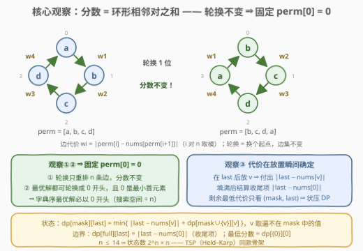
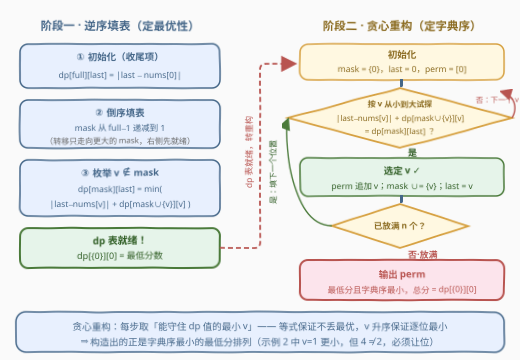

# LeetCode 找出分数最低的排列 题解

## 1. 题目概述

- **标题 / 题号**：找出分数最低的排列（#3149，hard）
- **链接**：https://leetcode.cn/problems/find-the-minimum-cost-array-permutation/
- **难度**：困难
- **标签**：位运算、数组、动态规划、状态压缩

**题意**：给你一个数组 `nums`，它是 $[0, 1, 2, \ldots, n-1]$ 的一个**排列**。对于任意 $[0, 1, 2, \ldots, n-1]$ 的排列 `perm`，其**分数**定义为：

$$score(perm) = \sum_{i=0}^{n-1} \big| perm[i] - nums[perm[(i+1) \bmod n]] \big|$$

即 $|perm[0] - nums[perm[1]]| + |perm[1] - nums[perm[2]]| + \cdots + |perm[n-1] - nums[perm[0]]|$。

返回具有**最低**分数的排列 `perm`。如果存在多个分数相等的排列，返回其中**字典序最小**的一个。

**示例 1**：

```text
输入：nums = [1,0,2]
输出：[0,1,2]
解释：分数为 |0 − nums[1]| + |1 − nums[2]| + |2 − nums[0]| = |0−0| + |1−2| + |2−1| = 2。
```

**示例 2**：

```text
输入：nums = [0,2,1]
输出：[0,2,1]
解释：分数为 |0 − nums[2]| + |2 − nums[1]| + |1 − nums[0]| = |0−1| + |2−2| + |1−0| = 2。
      注意 [0,1,2] 的分数是 |0−2| + |1−1| + |2−0| = 4，字典序虽小但分数更差。
```

**约束**：

- $2 \le n = nums.length \le 14$
- `nums` 是 $[0, 1, 2, \ldots, n-1]$ 的一个排列

> 💡 读题抓三点：① score 的 $n$ 个加项是**环形**相邻对——最后一项从 $perm[n-1]$ 绕回 $perm[0]$，这个「回绕」是全题的题眼；② 要输出**整个排列**而非分数，且同分必须取**字典序最小**；③ $n \le 14$——这个数字就是在眨眼睛提示 $O(2^n \cdot n^2)$ 的**状压 DP**（bitmask 甜区，与 TSP 的 Held–Karp 同款）。

## 2. 解题思路

### 2.1 暴力思路

枚举全部 $n!$ 个排列，各花 $O(n)$ 打一次分，按「分数最小、字典序最小」取最优。$n = 14$ 时 $14! \approx 8.7 \times 10^{11}$，直接爆炸。

浪费点在哪？两个排列前缀只要满足「**已放置的值集合相同** + **最后放的值相同**」，它们对后续位置的影响就完全一致——剩余部分的最低代价只由这两样决定，与之前的放置顺序无关。重复展开的搜索分支，正是 DP 要收割的**重叠子问题**。此外还埋着一个更大的金矿：score 的环形结构允许我们先钉死 $perm[0] = 0$（下节证明），搜索空间再除以 $n$。

### 2.2 核心观察：环形轮换不变 + TSP 状压 DP



三个观察层层递进：

**观察一：score 是轮换不变的。** score 的 $n$ 个加项恰好是环上 $n$ 条相邻边 $(perm[i],\ perm[(i+1) \bmod n])$ 的代价。把 `perm` 轮转 $k$ 位（如 $[a,b,c,d] \to [b,c,d,a]$）只是把这 $n$ 条边**换个起点重画一圈**，一条不多一条不少——求和不变。

**观察二：字典序最优解必然以 0 开头。** 任何最优排列都能轮换成 0 开头且分数不变；而 0 是 $n$ 个候选首元素中的最小值，任何非 0 开头的排列都字典序更大。⇒ **固定 $perm[0] = 0$**：既把搜索空间除以 $n$，又锁定了字典序论证的起点。

**观察三：从左往右放置，代价在放置瞬间确定。** 在第 $i$ 位放值 $v$、记前一个放的值为 $last$，则第 $i-1$ 项 $|perm[i-1] - nums[perm[i]]| = |last - nums[v]|$ **立刻可知**；全部填满后补上收尾项 $|perm[n-1] - nums[perm[0]]| = |last - nums[0]|$。于是「剩余部分的最低代价」只取决于 **(已放置的值集合 mask, 最近放置的值 last)**——教科书级的**无后效性**，状态设计与 TSP 完全同构：

$$dp[mask][last] = \min_{v \notin mask} \Big( |last - nums[v]| + dp[mask \cup \{v\}][v] \Big), \qquad dp[full][last] = |last - nums[0]|$$

其中 $dp[mask][last]$ 的语义是：已放置集合为 $mask$（含 $last$）时，**填完剩余位置并结算收尾项**的最小代价。最低分数即 $dp[\{0\}][0]$。

> 💡 对照 [526. 优美的排列](../0501-0600/526_优美的排列.md)：同为「mask 记已用」，那题只数方案数；本题 mask 之外还必须再挂一维 `last`——因为代价依赖**相邻关系**，只记集合不够。这正是 TSP 状态 $O(2^n \cdot n)$ 而非 $O(2^n)$ 的原因。

### 2.3 算法流程图



算法分两阶段，把「**最优性**」与「**字典序**」解耦：

- **阶段一（逆序填表）**：先填边界 $dp[full][last] = |last - nums[0]|$，再让 `mask` 从 $full-1$ 递减到 1 逐格填——转移只会走向**数值更大**的 mask（$mask \cup \{v\} > mask$），倒序扫描保证等号右边的表项总是先就绪。
- **阶段二（贪心重构）**：从 $(mask=\{0\},\ last=0)$ 出发，重复 $n-1$ 次：让 $v$ 从小到大试探，第一个满足 $|last - nums[v]| + dp[mask \cup \{v\}][v] = dp[mask][last]$ 的 $v$ 入选。

重构的正确性（归纳）：字典序比较逐位进行；在「总分恰为最优」的约束下，当前位取到**可行最小值**的任何方案都严格优于取更大值的方案，而「可行」= 剩余部分仍能取得 dp 给出的最小代价。示例 2 里 $v=1$ 虽然更小，一试 $|0-nums[1]| + dp[\{0,1\}][1] = 2+2 = 4 \ne 2$，立刻否决——**字典序让位于最优性**。

### 2.4 示例演算

![示例演算：nums=[0,2,1] 的 dp 表与贪心重构](../images/p3149_example_walkthrough.svg)

以示例 2（`nums = [0,2,1]`，$n=3$）为例。mask 用二进制书写，**bit v 置 1 表示值 v 已放置**（如 $101_2 = \{0,2\}$）：

| mask | last | 转移计算 | dp 值 |
|------|------|----------|-------|
| $111_2$（{0,1,2}） | 0 / 1 / 2 | 边界：收尾项 $\|last - nums[0]\| = \|last - 0\|$ | 0 / 1 / 2 |
| $011_2$（{0,1}） | 0 | $v{=}2$：$\|0{-}nums[2]\| + dp[111][2] = 1+2$ | 3 |
| $011_2$（{0,1}） | 1 | $v{=}2$：$\|1{-}nums[2]\| + dp[111][2] = 0+2$ | 2 |
| $101_2$（{0,2}） | 0 | $v{=}1$：$\|0{-}nums[1]\| + dp[111][1] = 2+1$ | 3 |
| $101_2$（{0,2}） | 2 | $v{=}1$：$\|2{-}nums[1]\| + dp[111][1] = 0+1$ | **1** |
| $001_2$（{0}） | 0 | $v{=}1$：$\|0{-}2\|+dp[011][1] = 4$；$v{=}2$：$\|0{-}1\|+dp[101][2] = \mathbf{2}$ | **2** |

最低分数 $dp[001][0] = 2$。重构从 $(001,\ 0)$ 出发、目标值 2：

1. 试 $v=1$（字典序更小）：$|0-nums[1]| + dp[011][1] = 2+2 = 4 \ne 2$ ✗ → 跳过；
2. 试 $v=2$：$|0-nums[2]| + dp[101][2] = 1+1 = 2$ ✓ → 选 2，$perm = [0,2]$；
3. 到 $(101,\ 2)$、目标值 1：试 $v=1$：$|2-nums[1]| + dp[111][1] = 0+1 = 1$ ✓ → 选 1，$perm = [0,2,1]$。

输出 $[0,2,1]$、总分 2，与示例一致。第 1 步的「否决」正是贪心重构的精髓：**先问能不能守住最优，再谈谁更小**。

## 3. 参考代码

### C++

```cpp
class Solution {
  public:
    vector<int> findPermutation(vector<int>& nums) {
        int n = nums.size();
        int full = (1 << n) - 1;
        const int INF = INT_MAX / 2;
        // dp[mask][last]：已放置的值集合为 mask（含 last）时，
        // 填完剩余位置并结算收尾项的最小代价
        vector<vector<int>> dp(1 << n, vector<int>(n, INF));
        for (int last = 0; last < n; ++last)
            dp[full][last] = abs(last - nums[0]);   // 收尾项 |perm[n-1] - nums[perm[0]]|
        for (int mask = full - 1; mask >= 1; --mask) {  // 转移走向更大的 mask，倒序填表
            for (int last = 0; last < n; ++last) {
                if (!((mask >> last) & 1)) continue;
                int best = INF;
                for (int v = 0; v < n; ++v) {
                    if ((mask >> v) & 1) continue;
                    best = min(best, abs(last - nums[v]) + dp[mask | (1 << v)][v]);
                }
                dp[mask][last] = best;
            }
        }
        // 正向贪心重构：每步取最小的、仍能守住最优总分的 v
        vector<int> perm = {0};
        int mask = 1, last = 0;
        for (int step = 1; step < n; ++step) {
            for (int v = 0; v < n; ++v) {           // v 从小到大，天然的字典序倾向
                if ((mask >> v) & 1) continue;
                if (abs(last - nums[v]) + dp[mask | (1 << v)][v] == dp[mask][last]) {
                    perm.push_back(v);
                    mask |= (1 << v);
                    last = v;
                    break;
                }
            }
        }
        return perm;
    }
};
```

### Python

```python
from math import inf

class Solution:
    def findPermutation(self, nums: List[int]) -> List[int]:
        n = len(nums)
        full = (1 << n) - 1
        # dp[mask][last]：已放置的值集合为 mask（含 last）时，
        # 填完剩余位置并结算收尾项的最小代价
        dp = [[inf] * n for _ in range(1 << n)]
        for last in range(n):
            dp[full][last] = abs(last - nums[0])    # 收尾项 |perm[n-1] - nums[perm[0]]|
        for mask in range(full - 1, 0, -1):         # 转移走向更大的 mask，倒序填表
            for last in range(n):
                if not (mask >> last) & 1:
                    continue
                best = inf
                for v in range(n):
                    if (mask >> v) & 1:
                        continue
                    cand = abs(last - nums[v]) + dp[mask | (1 << v)][v]
                    if cand < best:
                        best = cand
                dp[mask][last] = best
        # 正向贪心重构：每步取最小的、仍能守住最优总分的 v
        perm = [0]
        mask, last = 1, 0
        for _ in range(n - 1):
            for v in range(n):                      # v 从小到大，天然的字典序倾向
                if (mask >> v) & 1:
                    continue
                if abs(last - nums[v]) + dp[mask | (1 << v)][v] == dp[mask][last]:
                    perm.append(v)
                    mask |= 1 << v
                    last = v
                    break
        return perm
```

> 💡 表里其实连「不含 bit 0」的 mask 也一并算了（它们对应「不从 0 开头」的假想起点，永远没人读）——$n \le 14$ 时多花一倍时间无伤大雅，换来的是代码零特判。若追求极致，可只在 `mask & 1` 时填表。

## 4. 复杂度分析

| 维度 | 复杂度 | 说明 |
|------|--------|------|
| 时间复杂度 | $O(2^n \cdot n^2)$ | 状态 $2^n \cdot n$ 个、每个至多 $n$ 个后继；精确转移数为 $n(n-1)2^{n-2}$，$n=14$ 时约 $7.5 \times 10^5$ 次 |
| 空间复杂度 | $O(2^n \cdot n)$ | dp 表 $2^{14} \times 14 \approx 2.3 \times 10^5$ 个 `int`，约 0.9 MB |
| 值域安全 | 分数 $\le n(n-1) = 182$ | 每项绝对值 $\le n-1 = 13$、共 $n$ 项；`int` 极其富余 |

## 5. 扩展：把约束拧一拧

- **只问最低分数**：答案就是 $dp[\{0\}][0]$，阶段二整段可删——输出方案才需要重构，这是「求值」与「求方案」的分水岭。
- **tie-break 改成字典序最大**：轮换不变性依旧成立，但应改为固定 $perm[0] = n-1$（任何最优解都能轮换成最大元素开头），重构时 $v$ 从大到小试探——同一副骨架换个方向。
- **改成线性（非环形）分数**：去掉收尾项，边界改为 $dp[full][last] = 0$，其余不动——退化成「TSP 路径版」，对照可见环形结构只体现在那一个边界项上。
- **记忆化写法**：把递归 $dfs(mask, last)$ 用 `@lru_cache` 自顶向下写，更贴近 TSP 模板的直觉；逆序递推则免去递归开销，两者状态数一致。

## 6. 面试要点

1. **为什么敢固定 perm[0] = 0？**

   - score 的 $n$ 个加项是环形相邻对之和，轮换 `perm` 只会重排加项、不改总分；任何最优解都能轮换成 0 开头。而 0 是最小首元素，故字典序最小的最优解**必然**以 0 开头。这一步丢掉的不是解空间，是冗余——同时也解释了为什么答案永远从 0 开始。

2. **DP 状态为什么 (mask, last) 两维就够？**

   - 放置 $v$ 的新增代价只与 $v$ 和前一个值 $last$ 有关，更早的放置顺序对剩余代价毫无影响（无后效性）；当前位置由 $\mathrm{popcount}(mask)$ 隐式给出，无需单独一维。只记 mask 不记 last 会把相邻代价信息丢光——对照 526 题就能看清这一维的必要性。

3. **字典序最小怎么保证？为什么不能正向 DP 一遍同时比字典序？**

   - 两阶段：先反向（倒序填表）求出每个状态的「最小剩余代价」，再正向**贪心重构**——每步在守住 dp 值的前提下取最小 $v$。若在正向 DP 里边算边比字典序，需要比较整段后缀且前缀更小可能对应更差总分（示例 2：先选 1 总分 4、先选 2 总分 2），极易写错。

4. **和标准 TSP（Held–Karp）的异同？**

   - 同：mask 记已访问、last 记当前点、枚举下一个点转移，复杂度同阶 $O(2^n \cdot n^2)$。异：本题权函数是 $w(last, v) = |last - nums[v]|$ 的特殊结构，且**必须输出字典序最小的完整方案**——多出的「贪心重构」阶段才是本题相对 TSP 模板的增量考点。

5. **n = 2 的边界？**

   - $[1,0]$ 轮换后就是 $[0,1]$，答案恒为 $[0,1]$；DP 退化为一条转移、重构循环只走一步，代码无需特判。

## 同类练习题

| # | 题目 | 与本题的关联 |
|---|------|-------------|
| 526 | [优美的排列](https://leetcode.cn/problems/beautiful-arrangement/)（[站内题解](../0501-0600/526_优美的排列.md)） | 状压 DP 入门，同款「mask 记已用」，但只数方案数——对照体会 `last` 这一维何时可以省 |
| 847 | [访问所有节点的最短路径](https://leetcode.cn/problems/shortest-path-visiting-all-nodes/)（[站内题解](../0801-0900/847_访问所有节点的最短路径.md)） | mask 访问集 + BFS，「状态图上跑最短路」与「DP 填表」的同源练习 |
| 943 | [最短超级串](https://leetcode.cn/problems/find-the-shortest-superstring/) | 经典 TSP 状压 DP 困难题，转移代价换成字符串重叠长度，骨架与本题一致 |
| 996 | [正方形数组的数目](https://leetcode.cn/problems/number-of-squareful-arrays/) | 同为「排列 + 相邻约束」，回溯剪枝与状压 DP 双解对照 |
| 1879 | [两个数组最小的异或值之和](https://leetcode.cn/problems/minimum-xor-sum-of-two-arrays/)（[站内题解](../1801-1900/1879_两个数组最小的异或值之和.md)） | 指派型状压 DP，$n \le 14$ 同款甜区 |
