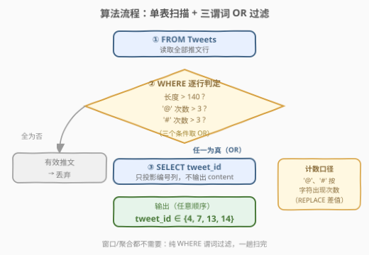
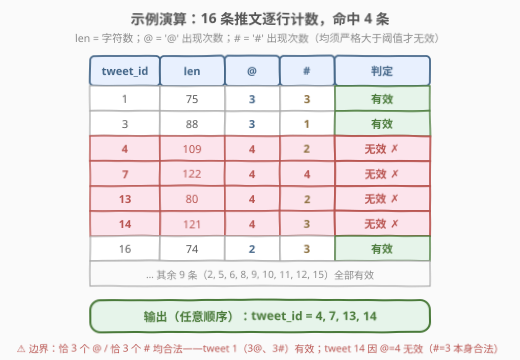

# LeetCode 无效的推文 II 题解

## 1. 题目概述

- **标题 / 题号**：无效的推文 II（#3150，easy）
- **链接**：https://leetcode.cn/problems/invalid-tweets-ii/
- **难度**：简单
- **标签**：数据库、SQL、`WHERE` 过滤、`CHAR_LENGTH`、`REPLACE` 差值计数、`REGEXP`、多谓词 OR、单表查询

> ⚠️ 本题为 LeetCode 付费题（Plus 会员专享），题意描述根据官方示例用例与外部资料重建，可能与官方题面有出入。

**题意**：给定 `Tweets`（推文）表，编写 SQL 查询，找出所有**无效推文**的编号（`tweet_id`）。一条推文满足以下**任意一条**即为无效：

1. 内容的字符数**严格大于** `140`；
2. `@`（提及，mention）出现的次数**严格大于** `3`；
3. `#`（话题标签，hashtag）出现的次数**严格大于** `3`。

以任意顺序返回结果。

**表结构**：

```text
Table: Tweets
+----------------+---------+
| Column Name    | Type    |
+----------------+---------+
| tweet_id       | int     |  ← 主键
| content        | varchar |
+----------------+---------+
```

在 SQL 中，`tweet_id` 是这个表的主键。`content` 由字母、数字、空格及 `'@'`、`'#'` 等字符构成。

**示例 1**（依据官方测试用例重建，`content` 过长处截断展示，`len/@/#` 为完整统计值）：

```text
输入：
Tweets 表:
+----------+--------------------------------------------------------------+-----+---+---+
| tweet_id | content                                                      | len | @ | # |
+----------+--------------------------------------------------------------+-----+---+---+
| 1        | What an amazing meal @MaxPower @AlexJones @JohnDoe #Learning |  75 | 3 | 3 |
|          | #Fitness #Love                                               |     |   |   |
| 2        | Learning something new every day @AnnaWilson #Learning #Foo |  62 | 1 | 2 |
| 3        | Never been happier about today's achievements @SaraJohnson  |  88 | 3 | 1 |
|          | @JohnDoe @AnnaWilson #Fashion                                |     |   |   |
| 4        | Traveling, exploring, and living my best life @JaneSmith    | 109 | 4 | 2 |
|          | @JohnDoe @ChrisAnderson @AlexJones #WorkLife #Travel        |     |   |   |
| 5        | Work hard, play hard, and cherish every moment @AlexJones   |  74 | 1 | 2 |
|          | #Fashion #Foodie                                             |     |   |   |
| 6        | Never been happier about today's achievements @ChrisAnderson|  79 | 1 | 2 |
|          | #Fashion #WorkLife                                           |     |   |   |
| 7        | So grateful for today's experiences @AnnaWilson @LisaTaylor | 122 | 4 | 4 |
|          | @ChrisAnderson @MikeBrown #Fashion #HappyDay #WorkLife #Nat |     |   |   |
| 8        | What an amazing meal @EmilyClark @AlexJones @MikeBrown #Fit |  63 | 3 | 1 |
| 9        | Learning something new every day @EmilyClark @AnnaWilson    |  74 | 3 | 1 |
|          | @MaxPower #Travel                                            |     |   |   |
| 10       | So grateful for today's experiences @ChrisAnderson #Nature  |  58 | 1 | 1 |
| 11       | So grateful for today's experiences @AlexJones #Art #WorkL  |  61 | 1 | 2 |
| 12       | Learning something new every day @JaneSmith @MikeBrown #Tra |  62 | 2 | 1 |
| 13       | What an amazing meal @EmilyClark @JohnDoe @LisaTaylor       |  80 | 4 | 2 |
|          | @MaxPower #Foodie #Fitness                                   |     |   |   |
| 14       | Work hard, play hard, and cherish every moment @LisaTaylor  | 121 | 4 | 3 |
|          | @SaraJohnson @MaxPower @ChrisAnderson #TechLife #Nature #M  |     |   |   |
| 15       | What a beautiful day it is @EmilyClark @MaxPower @SaraJohns |  70 | 3 | 1 |
| 16       | What a beautiful day it is @AnnaWilson @JaneSmith #Fashion  |  74 | 2 | 3 |
|          | #Love #TechLife                                              |     |   |   |
+----------+--------------------------------------------------------------+-----+---+---+

输出：
+----------+
| tweet_id |
+----------+
| 4        |
| 7        |
| 13       |
| 14       |
+----------+
```

**解释**：

| tweet_id | 无效原因 |
|----------|----------|
| 4 | `@` 出现 4 次 > 3（`#` 仅 2 次、长度 109 ≤ 140，但任一命中即无效） |
| 7 | `@` 出现 4 次 > 3，且 `#` 出现 4 次 > 3（双规则同时命中） |
| 13 | `@` 出现 4 次 > 3 |
| 14 | `@` 出现 4 次 > 3（注意其 `#` 恰为 3，本身合法，但仍因提及超限无效） |

其余推文三条规则均未命中。特别地，**tweet 1 恰有 3 个 `@` 和 3 个 `#`**——"严格大于"边界下它是有效推文。

**约束与注意**：

- `tweet_id` 是 `Tweets` 表的主键（非空、唯一）。
- 三个阈值全部是**严格大于**：恰好 140 个字符、恰好 3 个 `@`、恰好 3 个 `#` 都是**合法**推文。
- 三条规则之间是 **OR**（并集）关系——满足任一即无效。
- 结果可按任意顺序返回。

> 💡 本题是 [1683. 无效的推文](../1601-1700/1683_无效的推文.md) 的续作：1683 只有"长度 > 15"一条规则，一行 `CHAR_LENGTH` 就能解决；本题把长度阈值放宽到 140，并新增"统计 `@` / `#` 出现次数"两条规则——考点从「**度量字符串长度**」升级为「**统计某字符的出现次数**」。SQL 标准里没有 `COUNT_CHAR` 这样的内置函数，如何在纯 SQL 里数字符，正是本题的核心趣味。

## 2. 解题思路

### 2.1 暴力思路：应用层逐行计数

过程式直觉：把 `Tweets` 全量拉到应用层，在 Python/Java 中逐行统计：

```text
result = []
for row in Tweets:
    c = row.content
    if len(c) > 140 or c.count('@') > 3 or c.count('#') > 3:
        result.append(row.tweet_id)
```

逻辑正确，但**把"按内容过滤"这层数据库天然能做的工作甩给了应用层**——全量拉取 `content` 文本、网络往返、内存占用一样不少。更关键的是，它**回避了"如何在纯 SQL 中统计某字符出现次数"这一真正考点**（Python 有 `str.count`，SQL 没有现成的对应物）。

> ⚠️ 暴力思路的根本问题：**没有正面解决"SQL 如何数字符"**。与 1683 一样，能被数据库过滤的谓词就应下推到数据库（谓词下推原则）；本题只是把谓词从"算长度"换成了"数次数"，套路框架完全不变。

### 2.2 核心观察：REPLACE 差值计数 + 三谓词 OR


**问题拆解为三个子问题**：

1. **度量字符数**：`CHAR_LENGTH(content) > 140`——1683 已练过的套路，"推文字数"按**字符**而非字节计数。

2. **统计 `'@'` 出现次数**——SQL 没有内置的"数字符"函数，用经典的 **REPLACE 差值法**：

$$\text{cnt}_{@} = \text{CHAR\_LENGTH}(content) - \text{CHAR\_LENGTH}(\text{REPLACE}(content,\;'@',\;''))$$

   直观理解：`REPLACE(content, '@', '')` 把所有 `'@'` **删除**，长度随之缩短；删除前后长度**少了多少，就删掉了多少个 `'@'`**。以 tweet 7 为例：$122 - 118 = 4$ 个 `'@'`。

3. **统计 `'#'` 出现次数**：同法把替换目标换成 `'#'`。

三个谓词之间用 `OR` 连接——**任一命中即无效**（并集语义），正好对应题面"满足以下任意一条"。

> 💡 **REPLACE 差值法的普适性**：它对**任意字符串**的出现次数都适用（把 `'@'` 换成 `'ab'` 就数 `'ab'` 的出现次数），且只依赖 `CHAR_LENGTH` 与 `REPLACE` 两个几乎所有数据库都有的函数——是跨库最通用的计数 idiom。

> ⚠️ **多字节字符会不会数错**？不会。删除前后，`content` 里的中文/emoji 等多字节字符**原样保留**，对两个 `CHAR_LENGTH` 的贡献完全相同，做差恰好**抵消**——差值只由被删掉的 `'@'` 贡献（每个恰 1 字符）。同理，即使两处都改用 `LENGTH`（字节口径），`'@'` 是 1 字节 ASCII，差值依然等于出现次数。**唯一要避免的是两处口径混用**（一处 `LENGTH` 一处 `CHAR_LENGTH`）。

> ⚠️ **边界值全是"严格大于"**：恰好 140 个字符、恰好 3 个 `@`、恰好 3 个 `#` 均合法。官方示例里 tweet 1（`@`=3、`#`=3）有效、tweet 14（`#`=3 但 `@`=4）无效，正是为这个边界精心设计的样本——把 `>` 写成 `>=` 会把 tweet 1 误判为无效。

### 2.3 算法流程图



**逻辑执行步骤**：

| 步骤 | 子句 | 作用 | 本题对应 |
|------|------|------|----------|
| ① | `FROM Tweets` | 读取全部推文行 | 获取 `tweet_id` 与待判定的 `content` |
| ② | `WHERE <谓词1> OR <谓词2> OR <谓词3>` | 逐行求值三个谓词，任一为真即保留 | 长度 > 140 \| `'@'` 次数 > 3 \| `'#'` 次数 > 3 |
| ③ | `SELECT tweet_id` | 投影输出列 | 只返回 `tweet_id`，不返回 `content` |

> 💡 整个查询仍是**单表 + 纯 `WHERE` 过滤**的形状——没有 JOIN、没有 GROUP BY、没有窗口函数，与 1683 同一范式，只是谓词从 1 个变成 3 个、从"长度度量"变成"次数统计"。SQL 的逻辑执行顺序（`FROM → WHERE → ... → SELECT`）保证 `WHERE` 阶段 `content` 列尚未被投影掉，三个函数谓词都能正常引用它。

### 2.4 示例演算



对示例数据逐行计算三个统计量（`len` / `@` / `#`，摘取关键行）：

| tweet_id | len | @ | # | 长度 > 140 ? | @ > 3 ? | # > 3 ? | 判定 |
|----------|-----|---|---|--------------|---------|---------|------|
| 1 | 75 | **3** | **3** | 否 | 否（恰 3） | 否（恰 3） | 有效（边界样本） |
| 3 | 88 | 3 | 1 | 否 | 否 | 否 | 有效 |
| 4 | 109 | **4** | 2 | 否 | **是 ✗** | 否 | **无效** |
| 7 | 122 | **4** | **4** | 否 | **是 ✗** | **是 ✗** | **无效**（双命中） |
| 13 | 80 | **4** | 2 | 否 | **是 ✗** | 否 | **无效** |
| 14 | 121 | **4** | **3** | 否 | **是 ✗** | 否（恰 3） | **无效**（# 恰 3 本身合法） |
| 16 | 74 | 2 | **3** | 否 | 否 | 否（恰 3） | 有效 |
| 其余 | … | ≤3 | ≤3 | 否 | 否 | 否 | 有效 |

16 条推文中仅 4、7、13、14 命中任一规则 → 输出 `tweet_id = {4, 7, 13, 14}`，与示例一致。

> 💡 **三条边界对照**：tweet 1（`@`、`#` 双双恰 3）有效；tweet 14（`#` 恰 3 但 `@`=4）无效——**OR 语义下一个超限就出局**；tweet 16（`#` 恰 3、`@`=2）有效。官方数据把"恰好等于阈值"的样本铺得很密，就是为了考察 `>` 与 `>=` 的一字之差。

## 3. 参考代码

### SQL（解法 A：REPLACE 差值计数，推荐）

```sql
SELECT tweet_id
FROM Tweets
WHERE CHAR_LENGTH(content) > 140
   OR CHAR_LENGTH(content) - CHAR_LENGTH(REPLACE(content, '@', '')) > 3
   OR CHAR_LENGTH(content) - CHAR_LENGTH(REPLACE(content, '#', '')) > 3;
```

> 💡 **写法要点**：
> - **`CHAR_LENGTH(content) - CHAR_LENGTH(REPLACE(content, '@', ''))`**：删除前后长度差 = `'@'` 的出现次数。两个函数口径一致（都用字符数），多字节内容在差值中自动抵消。
> - **`> 3` 而非 `>= 3`**：恰好 3 个提及/话题标签是合法的，`@` 计数为 3 的 tweet 1 必须存活。
> - **三个谓词用 `OR` 连接**：对应"满足任意一条即无效"的并集语义。
> - ✓ **最推荐**：不依赖正则、不依赖私有函数，MySQL / PostgreSQL（`CHAR_LENGTH` + `REPLACE`）/ SQL Server（把 `CHAR_LENGTH` 换成 `LEN`）全平台可用。

### SQL（解法 B：REGEXP 正则表达"出现至少 4 次"）

```sql
SELECT tweet_id
FROM Tweets
WHERE CHAR_LENGTH(content) > 140
   OR content REGEXP '([^@]*@){4}'
   OR content REGEXP '([^#]*#){4}';
```

> 💡 **写法要点**：
> - **`'([^@]*@){4}'`** 读作「(任意非 `@` 字符 + 一个 `@`) 重复 4 次」——能匹配当且仅当 `'@'` **至少出现 4 次**，即次数 > 3。`{4}` 是正则量词，把"次数超过 3"表达得非常直白。
> - **为什么写成 `[^@]*@` 而不是 `.*@`**：`[^@]*` 明确"段内不含 `@`"，4 次迭代恰好消费 4 个 `@`，不依赖回溯也能一眼看出正确性；`.*@.*@.*@.*@` 同样正确但可读性差。
> - `REGEXP` 是 MySQL 方言（8.0 中也可写 `REGEXP_LIKE(content, '([^@]*@){4}')`）；PostgreSQL 用 `content ~ '([^@]*@){4}'`；SQL Server 经典版本无正则，只能用解法 A。
> - 三个谓词求值顺序上，正则与差值法同为逐行扫描，性能同量级；正则胜在表达"次数 ≥ k"非常直观。

### Python（pandas）

```python
import pandas as pd

def invalid_tweets_ii(tweets: pd.DataFrame) -> pd.DataFrame:
    content = tweets["content"]
    mask = (
        (content.str.len() > 140)
        | (content.str.count("@") > 3)
        | (content.str.count("#") > 3)
    )
    return tweets.loc[mask, ["tweet_id"]]
```

> 💡 **pandas 对照**：
> - **`str.count("@")`**：字符串访问器的计数方法，统计**正则意义上**的匹配次数（`'@'` 非正则元字符，即字符出现次数），对应 SQL 的 REPLACE 差值；`str.len()` 对应 `CHAR_LENGTH`（Python 3 的 `str` 按 Unicode 字符计数）。
> - **括号不可省**：Python 中 `|` 的优先级**高于**比较运算符，`a > 140 | b > 3` 会被解析成 `a > (140 | b) > 3` 而悄悄出错——每个比较都必须显式加括号，这是 pandas 布尔组合的头号大坑。
> - `tweets.loc[mask, ["tweet_id"]]` 一步完成"过滤行 + 投影列"，对应 `WHERE` + `SELECT tweet_id`。

## 4. 复杂度分析

| 维度 | 解法 A（REPLACE 差值） | 解法 B（REGEXP） | pandas |
|------|------------------------|------------------|--------|
| **时间** | $O(n \cdot L)$ | $O(n \cdot L)$ | $O(n \cdot L)$ |
| **空间** | $O(L)$（逐行中间串） | $O(L)$（正则状态） | $O(n \cdot L)$（全表入内存） |
| **跨数据库** | ✓ 通用（SQL Server 换 `LEN`） | ⚠ MySQL/PG 方言 | — |
| **可读性** | ✓ 差值法一眼可验 | ✓ `{4}` 直观表达次数 | ✓ 简洁 |
| **推荐度** | ✓ **首选** | ✓ 备选 | ✓ 验证用 |

> - $n$ = `Tweets` 行数，$L$ = `content` 平均长度。推文长度有现实上限（本题 140 阈值级），$L$ 可视为常数，故整体 $O(n)$。
> - **时间**：每个 `REPLACE` 需扫描整个字符串并生成一个 $O(L)$ 的中间串；三个谓词共约 6 次串扫描/行。解法 B 的 `'([^@]*@){4}'` 是无回溯风险的线性正则，量级相同。
> - **空间**：SQL 解法逐行求值，中间串不跨行累积；pandas 需把整个 DataFrame 载入内存。
> - **索引**：三个谓词全是**函数谓词**（非 SARGable），无法利用 `tweet_id` 以外的普通索引，必然全表扫描——与 1683 同理。若"无效推文筛查"是高频需求，可把三个统计量做成**生成列**并建索引，或直接在写入路径做校验（见 5.3）。

## 5. 扩展

### 5.1 各数据库"数字符出现次数"的写法对照

"统计某字符/子串出现次数"是 SQL 字符串处理的常客，各库姿势不同：

| 数据库 | 写法 | 备注 |
|--------|------|------|
| MySQL | `CHAR_LENGTH(content) - CHAR_LENGTH(REPLACE(content, '@', ''))` | 差值法，最通用 |
| MySQL 8.0+ | `REGEXP_LIKE(content, '([^@]*@){4}')` / `content REGEXP '...'` | 正则表达"至少 4 次" |
| PostgreSQL | `REGEXP_COUNT(content, '@')` / `(content ~ '([^@]*@){4}')` | 有原生计数函数 |
| SQL Server | `LEN(content) - LEN(REPLACE(content, '@', ''))` | 无正则（经典版），差值法是唯一解 |
| Oracle | `REGEXP_COUNT(content, '@')` | 原生计数函数 |
| pandas | `content.str.count('@')` | `str.count` 按正则计数 |

> 💡 **结论**：正则有 `REGEXP_COUNT` 的库（PG/Oracle）最省事；没有的库（MySQL/SQL Server）就用 **REPLACE 差值法**——它是唯一"走到哪都能用"的 idiom，面试现场写出来也最稳。

### 5.2 与 1683 的对照：单谓词 → 多谓词组合

| 维度 | 1683 无效的推文 | 3150 无效的推文 II |
|------|----------------|--------------------|
| 规则数 | 1 条（长度 > 15） | 3 条（长度 > 140 OR `'@'` > 3 OR `'#'` > 3） |
| 核心函数 | `CHAR_LENGTH` 单函数 | `CHAR_LENGTH` + `REPLACE` 差值组合 |
| 谓词连接词 | 无（单谓词） | `OR`（并集：任一命中即无效） |
| 边界 | 恰 15 字符有效 | 恰 140 字符 / 恰 3 个 `@` / 恰 3 个 `#` 均有效 |
| 考点 | 字符计数 vs 字节计数 | + **出现次数统计**（无内置函数时的 idiom） |

> 💡 一条隐含的出题脉络：1683 考"**长度**"（有现成函数），3150 考"**次数**"（没有现成函数）——后者逼你用函数组合"造"出一个计数器。这种"用基本函数拼出缺失能力"的思路，正是 SQL 面试区别人云亦云与真正熟练的试金石。

### 5.3 口径辨析与写入侧校验

- **数的是"字符"不是"提及的用户"**：题面口径是 `'@'` **字符出现次数**，不是 `@\w+` 匹配到的"有效提及数"。若按正则 `@\w+` 计数，`@` 后紧跟空格的"裸 @"（如 `hi @ tom`）会被漏数——本题不区分这种情形，只要 `@` 出现就计数。做题时**以题面口径为准**，不要自作主张"更严谨"。
- **真实产品的做法**：这类内容治理规则（长度、提及数、话题数）在工业界通常落在**写入路径**校验（应用层或 `CHECK` 约束/触发器），拒绝写入而非事后查询；本题"读时校验"是面向 `WHERE` 练习的教学抽象。若在 MySQL 8.0.16+ 想固化规则，可用 `CHECK (CHAR_LENGTH(content) <= 140)`——但注意 `CHECK` 里写 `REPLACE` 差值这类子查询外的函数虽合法，跨库兼容性各异，生产上更常见冗余计数列。

## 6. 面试要点

**Q1：`CHAR_LENGTH(content) − CHAR_LENGTH(REPLACE(content, '@', ''))` 为什么能数出 `'@'` 的出现次数？多字节字符会不会数错？**

> `REPLACE` 把所有 `'@'` 删成空串，删除前后长度差 = 被删字符数 × 单个该字符长度；`'@'` 是 1 字符，差值即出现次数。多字节字符（中文/emoji）删除前后**原样保留**，对两个 `CHAR_LENGTH` 的贡献相同，做差恰好抵消——所以差值不受影响。甚至两处统一改用 `LENGTH`（字节口径）结果也一样（`'@'` 恰为 1 字节）；**唯一错法是两处口径混用**。这个"构造不变量、让无关项在差值中消掉"的技巧值得主动在面试里点破。

**Q2：正则 `'([^@]*@){4}'` 如何表达"出现超过 3 次"？**

> 它读作「(若干非 `@` 字符 + 一个 `@`) 重复 4 次」：4 次迭代恰好消费 4 个 `@`，段间的非 `@` 字符由 `[^@]*` 吸收——能匹配当且仅当 `'@'` 至少出现 4 次，即次数 > 3。写成 `.*@.*@.*@.*@` 也正确但依赖回溯、可读性差；`[^@]*` 把每段边界写得明明白白。

**Q3：三个条件为什么用 `OR`？边界值如何把握？**

> 题面"满足**任意一条**即无效"是并集语义，谓词必须 `OR` 连接；写成 `AND` 就变成"三条全中才无效"，tweet 4/13/14（仅提及超限）会全部漏掉。边界全是**严格大于**：恰 140 字符、恰 3 个 `@`、恰 3 个 `#` 都合法——官方样本 tweet 1（3`@`、3`#`）有效、tweet 14（3`#`、4`@`）无效就是专门考这个。SQL 边界条件务必逐字对照题面"严格大于/大于等于"的措辞。

**Q4：本题的谓词能用索引吗？高频场景怎么优化？**

> 不能——`CHAR_LENGTH(...)`、`REPLACE(...)`、`REGEXP` 都是**函数谓词**（非 SARGable），普通 B+ 树索引按原始值排序，帮不上忙，必然全表扫描。优化方向：(1) 把 `mention_cnt` / `hashtag_cnt` / `content_len` 做成**生成列**并建索引，把函数谓词变成列比较；(2) 更彻底地把校验前移到**写入路径**（应用层或 `CHECK` 约束），拒绝非法推文入库，读取侧就无需过滤。

**Q5：SQL 里还有哪些"没有内置函数就自己拼"的经典 idiom？**

> 与 REPLACE 差值法同源的还有：**数子串出现次数**（同法把 `'@'` 换成目标子串）；**判断是否包含某子串**（`LOCATE/INSTR > 0` 或 `LIKE '%x%'`）；**删首尾空格的兼容写法**（老 SQL Server 的 `LTRIM(RTRIM(s))`）；**字符串反转**（SQL Server 无 `REVERSE` 之外方言时的循环拼法）。共同思想：**用基本函数的组合不变量"造"出缺失能力**——面试中主动展示这种构造意识，比背函数列表更能体现功力。

> 💡 **一句话总结**：3150 是 1683 的"计数版续作"——框架仍是单表 `WHERE` 过滤，新考点是 **SQL 没有数字符的内置函数**，用 `CHAR_LENGTH − CHAR_LENGTH(REPLACE(...))` 差值法现造一个计数器，三个谓词 `OR` 起来一趟扫完。口诀：「**删掉再量差多少，就有多少个**；**任一超限即无效，恰好等于都合法**」。

## 同类练习题

| # | 题目 | 与本题的关联 |
|---|------|-------------|
| 1683 | [无效的推文](https://leetcode.cn/problems/invalid-tweets/)（[题解](../1601-1700/1683_无效的推文.md)） | 本题前作——单谓词 `CHAR_LENGTH(content) > 15`，对照体会"长度度量"与"次数统计"的考点递进 |
| 595 | [大的国家](https://leetcode.cn/problems/big-countries/)（[题解](../0501-0600/595_大的国家.md)） | `WHERE` 多条件 **OR** 过滤入门——数值列直接比较（SARGable），与本题"三谓词 OR + 函数谓词（非 SARGable）"形成对照 |
| 1517 | [查找拥有有效邮箱的用户](https://leetcode.cn/problems/find-users-with-valid-e-mails/)（[题解](../1501-1600/1517_查找拥有有效邮箱的用户.md)） | 字符串列 `REGEXP` 模式匹配过滤——正则判定格式合法性，与本题解法 B 的 `'([^@]*@){4}'` 同属正则谓词家族 |
| 1527 | [患某种疾病的患者](https://leetcode.cn/problems/patients-with-a-condition/)（[题解](../1501-1600/1527_患某种疾病的患者.md)） | `LIKE '%DIAB1%'` 通配符过滤——与本题共享"字符串列做 `WHERE` 谓词"主题，一个考通配符、一个考字符计数 |
| 1667 | [修复表中的名字](https://leetcode.cn/problems/fix-names-in-a-table/) | 字符串函数组合（`CONCAT` + `UPPER` + `LOWER` + `SUBSTRING`）——同样考察"用基本函数拼出目标变换"，与 REPLACE 差值法互为照应 |
