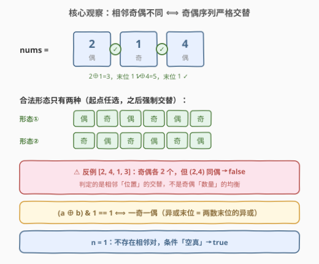
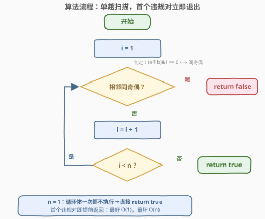

# 特殊数组 I

- **题目名称**：特殊数组 I
- **链接**：[3151. 特殊数组 I](https://leetcode.cn/problems/special-array-i/)
- **难度**：简单
- **标签**：数组、位运算

## 1. 题目概述

如果数组的**每一对相邻元素**都是两个**奇偶性不同**的数字，则认为该数组是一个 **特殊数组**。换句话说，每一对中的元素**必须**有一个是偶数，另一个是奇数。

给你一个整数数组 `nums`。如果 `nums` 是一个 **特殊数组**，返回 `true`，否则返回 `false`。

**示例 1**：

```text
输入：nums = [1]
输出：true
解释：只有一个元素，没有相邻对，所以答案为 true。
```

**示例 2**：

```text
输入：nums = [2,1,4]
输出：true
解释：只有两对相邻元素：(2,1) 和 (1,4)，它们都包含了奇偶性不同的数字，因此答案为 true。
```

**示例 3**：

```text
输入：nums = [4,3,1,6]
输出：false
解释：nums[1] = 3 和 nums[2] = 1 都是奇数。因此答案为 false。
```

**约束条件**：

- $1 \le nums.length \le 100$
- $1 \le nums[i] \le 100$

> 💡 读题关键：题目问的是**每一对相邻**元素的奇偶性是否不同——这是「位置关系」的判定，不是「数值统计」的判定。把每个数压缩成一个 bit（$nums_i \bmod 2$），问题立刻变成：**这个 0/1 序列是否严格交替**（$0101\ldots$ 或 $1010\ldots$）。另外 $n = 1$ 时不存在相邻对，答案恒为 `true`。

---

## 2. 解题思路

### 2.1 朴素思路：一趟扫描逐对检查

$n \le 100$，把 $n-1$ 个相邻对逐个检查一遍就是最直接的解法——而这其实也已经是最优解（每个相邻对至少要看一眼，$O(n)$ 不可再省）。真正要避免的是两类**想偏了**的暴力：

- **按数值分类**：统计奇数、偶数各多少个——完全跑偏，奇偶个数与「位置交替」无关（见 2.2 的反例）；
- **双重循环枚举所有对 $(i, j)$**：定义只约束**相邻**对，枚举全部数对是纯负优化。

> ⚠️ 这题的考点不在「优化」，而在**把判定条件写对**：`a % 2 == b % 2` 是「同奇偶」（违规），`!=` 才是「不同」（合法）。条件取反、循环边界、$n = 1$ 三处是仅有的翻车点。

### 2.2 核心观察：奇偶序列必须严格交替，$(a \oplus b) \,\&\, 1$ 一位定音



把每个元素压成一个奇偶 bit：$p_i = nums_i \bmod 2$（奇为 1，偶为 0）。「每对相邻奇偶不同」等价于：

$$p_i \ne p_{i-1}, \quad \forall\, i = 1 \ldots n-1$$

即 $p$ 是**严格交替序列**，全局只有两种合法形态：$0101\ldots$ 或 $1010\ldots$（起点选奇或选偶，之后强制交替）。单对判定有三个等价写法，任选其一：

| 判定式 | 含义 | 原理 |
|--------|------|------|
| `(a ^ b) & 1 == 1` | 一奇一偶 ✅ | 异或按位独立，**末位 = 两数末位的异或**；奇末位 1、偶末位 0，不同则异或末位为 1 |
| `(a + b) % 2 == 1` | 和为奇数 ✅ | 奇 + 偶 = 奇；奇 + 奇 / 偶 + 偶 = 偶 |
| `a % 2 != b % 2` | 奇偶 bit 不同 ✅ | 定义直译 |

三个式子完全等价，位运算版只动末位、最「廉价」。

> 💡 **为什么不能只数奇偶个数**：反例 `[2, 4, 1, 3]`——奇偶各 2 个「看起来很均衡」，但 $(2,4)$ 同为偶数，不特殊。判定对象是**相邻位置**的交替关系，位置信息一旦丢弃就再也找不回来。

还有一个把「交替」显式写出来的全局等价式：

$$nums_i \bmod 2 = (nums_0 + i) \bmod 2$$

即第 $i$ 个位置的奇偶由**起点的奇偶 + 下标**完全确定——整个序列只有 2 个自由度（起点选奇或选偶）。

### 2.3 算法流程图



流程四步：

1. 从 $i = 1$ 开始扫描；
2. 若 $(nums_i \oplus nums_{i-1}) \,\&\, 1 = 0$（相邻同奇偶），**立即** `return false`；
3. 否则 $i \gets i + 1$，回到步骤 2；
4. $n - 1$ 对全部合法，`return true`。

$n = 1$ 时循环体一次都不执行，自然落到步骤 4 返回 `true`——**空真**（vacuously truth）无需特判。

### 2.4 示例演算

![示例演算：[2,1,4] 全绿、[4,3,1,6] 提前退出、[1] 空真](../images/p3151_special_array_walkthrough.svg)

| 输入 | 相邻对轨迹 | 判定过程 | 结果 |
|------|-----------|---------|------|
| `[2,1,4]` | (2,1) → (1,4) | $2 \oplus 1 = 3$ 末位 1 ✓ → $1 \oplus 4 = 5$ 末位 1 ✓ | **true** |
| `[4,3,1,6]` | (4,3) → (3,1) | $4 \oplus 3 = 7$ 末位 1 ✓ → $3 \oplus 1 = 2$ 末位 0 ✗ | **false** |
| `[1]` | （无相邻对） | 循环体不执行 | **true** |

`[4,3,1,6]` 演示**提前退出**：违规发生在 $i = 2$（3 和 1 同奇），其后的 (1,6) 根本不会被检查；`[1]` 演示**空真**：没有相邻对，条件自动成立。

---

## 3. 参考代码

### C++

```cpp
class Solution {
  public:
    bool isArraySpecial(vector<int>& nums) {
        for (int i = 1; i < (int)nums.size(); i++) {
            if (((nums[i] ^ nums[i - 1]) & 1) == 0) {
                return false;   // 相邻同奇偶，提前退出
            }
        }
        return true;            // n == 1 时循环不执行，空真直接返回 true
    }
};
```

### Python

```python
class Solution:
    def isArraySpecial(self, nums: List[int]) -> bool:
        return all((a ^ b) & 1 for a, b in zip(nums, nums[1:]))
```

> 💡 写法盘点：`all()` 作用于空序列返回 `True`，恰好自动覆盖 $n = 1$ 的空真语义，无需特判（Python 3.10+ 可用 `itertools.pairwise(nums)` 替代 `zip(nums, nums[1:])`，省掉 $O(n)$ 切片）。C++ 想写得更短可用 `std::adjacent_find(nums.begin(), nums.end(), [](int a, int b) { return ((a ^ b) & 1) == 0; }) == nums.end()`——`adjacent_find` 找到首个满足谓词的相邻对即返回，等于标准库内置的提前退出。循环条件若写 `i < n - 1`，注意 `nums.size()` 是无符号类型、$n = 0$ 时 `n - 1` 会下溢（本题 $n \ge 1$ 踩不到，防御性写法是廉价的好习惯）。

---

## 4. 复杂度分析

| 维度 | 复杂度 | 说明 |
|------|--------|------|
| 时间复杂度 | $O(n)$ | 恰好检查 $n-1$ 个相邻对，每对一次异或 + 一次按位与；首个违规对提前退出，最好 $O(1)$ |
| 空间复杂度 | $O(1)$ | 仅下标与常数个临时变量；Python `nums[1:]` 切片为 $O(n)$，可换 `pairwise` 消除 |
| 单对判定 | $O(1)$ | 一次异或、一次与、一次比较，无取模无分支 |

---

## 5. 扩展

### 5.1 续作 3152. 特殊数组 II：从单次判定到区间查询

[3152. 特殊数组 II](https://leetcode.cn/problems/special-array-ii/)（中等）把「整个数组是否特殊」升级为「**多次询问某个子数组 $[from, to]$ 是否特殊**」。对每个询问逐对扫描的总代价是 $O(qn)$，$n, q$ 同阶时会超时。标准做法是**前缀和预处理违规对**：

- 定义 $d_i = [\,nums_i \text{ 与 } nums_{i-1} \text{ 同奇偶}\,]$（$d_0 = 0$），做前缀和 $S_i = \sum_{j \le i} d_j$；
- 子数组 $[l, r]$ 特殊 $\iff$ 区间 $(l, r]$ 内无违规对 $\iff S_r - S_l = 0$；
- 预处理 $O(n)$，每次询问 $O(1)$。

本题（3151）正是它 $q = 1$、$l = 0$、$r = n-1$ 的特例。「把逐对判定改造成前缀和，换来 $O(1)$ 区间查询」是把 3151 的思路推向 3152 的关键一步。

### 5.2 在线判定：数据流视角

如果元素是**一个一个到达**的（无法随机访问全数组），只需维护 1 bit 状态：记住上一个数的奇偶 $p$，新数 $x$ 到达时检查 $x \bmod 2 \ne p$ 是否成立，然后 $p \gets x \bmod 2$。判定每个新元素 $O(1)$ 时间、$O(1)$ 空间，天然适配流式数据——这也是「交替性只依赖相邻关系、无长程依赖」的直接体现。

---

## 6. 面试要点

1. **为什么统计奇数、偶数的个数不可行？**

   - 判定对象是**相邻位置**的奇偶交替，不是奇偶数量的均衡。反例 `[2,4,1,3]`：奇偶各 2 个，但 $(2,4)$ 同偶 → `false`。位置信息是本质，丢弃即不可判。

2. **`(a ^ b) & 1 == 1` 为什么等价于「一奇一偶」？**

   - 异或按位独立，末位结果是两数末位的异或。奇数二进制末位为 1、偶数为 0：一奇一偶 → 末位异或为 1；同奇同偶 → 为 0。等价写法还有 `(a + b) % 2 == 1`（和为奇 ⟺ 一奇一偶）。

3. **`n = 1` 为什么返回 `true`？需要特判吗？**

   - 不存在相邻对，条件「每一对相邻元素奇偶不同」**空真**（vacuously true）。`for i = 1 .. n-1` 循环体不执行，自然落到 `return true`；Python `all(空序列)` 同样返回 `True`——写法本身已覆盖，无需特判。

4. **提前退出有必要吗？最好/最坏复杂度各是多少？**

   - 首个违规对即返回：最好 $O(1)$（第一对就违规），最坏 $O(n)$（全部合法或违规在末尾）。对纯判定题渐进不变，但常数更优，也体现「短路求值」的意识。

5. **如果改成「每一对相邻元素奇偶相同才特殊」，怎么改？**

   - 判定谓词取反即可：`((a ^ b) & 1) == 1` 时违规。更一般的启示：交替性判定的全部逻辑浓缩在一个「相邻关系谓词」里，换谓词即换题，扫描骨架不变。

---

## 7. 同类练习题

- [3152. 特殊数组 II](https://leetcode.cn/problems/special-array-ii/)：本题的续作——多次区间查询版，用前缀和把逐对判定升级为 $O(1)$ 查询（见 5.1）
- [941. 有效的山脉数组](https://leetcode.cn/problems/valid-mountain-array/)：同样是相邻对关系（先严格增后严格减）的全局合法性判定，一趟扫描 + 提前退出
- [3105. 最长的严格递增或严格递减子数组](https://leetcode.cn/problems/longest-strictly-increasing-or-strictly-decreasing-subarray/)（[站内题解](3105_最长的严格递增或严格递减子数组.md)）：相邻对比较结果驱动的最长段维护，把「判定」升级为「统计」
- [3019. 按键变更的次数](https://leetcode.cn/problems/number-of-changing-keys/)（[站内题解](../3001-3100/3019_按键变更的次数.md)）：相邻对比较 + 计数的骨架，与本题同款的「只看相邻」视角
- [3423. 循环数组中相邻元素的最大差值](https://leetcode.cn/problems/maximum-difference-between-adjacent-elements-in-a-circular-array/)：相邻对扫描的环形版——首尾再补一对，聚合函数换成取最大
