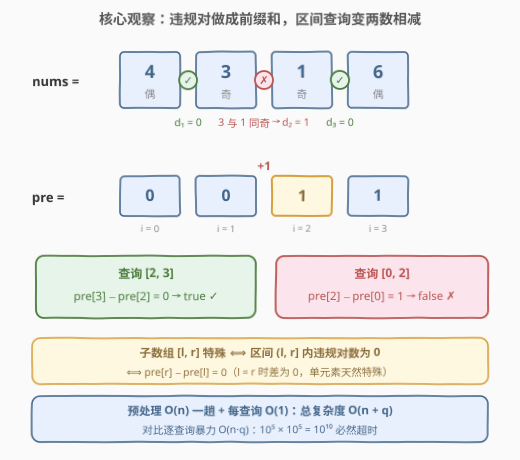
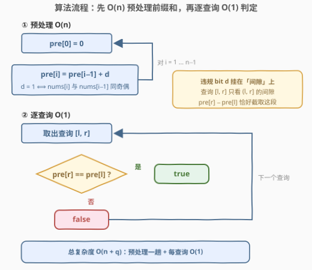
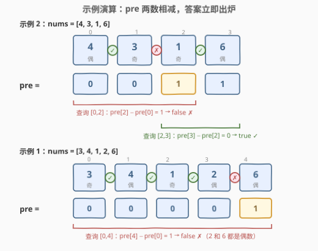

# LeetCode 特殊数组 II 题解

## 1. 题目概述

- **标题 / 题号**：特殊数组 II（#3152，medium）
- **链接**：https://leetcode.cn/problems/special-array-ii/
- **难度**：中等
- **标签**：数组、前缀和、二分查找

**题意**：如果数组的**每一对相邻元素**都是两个**奇偶性不同**的数字，则认为该数组是一个**特殊数组**。

给你一个整数数组 `nums` 和一个二维整数矩阵 `queries`，对于 `queries[i] = [from_i, to_i]`，请你检查**子数组** `nums[from_i..to_i]` 是不是一个**特殊数组**。

返回布尔数组 `answer`：如果 `nums[from_i..to_i]` 是特殊数组，则 `answer[i]` 为 `true`，否则为 `false`。

**示例 1**：

```text
输入：nums = [3,4,1,2,6], queries = [[0,4]]
输出：[false]
解释：子数组是 [3,4,1,2,6]。2 和 6 都是偶数。
```

**示例 2**：

```text
输入：nums = [4,3,1,6], queries = [[0,2],[2,3]]
输出：[false,true]
解释：
1. 子数组是 [4,3,1]。3 和 1 都是奇数，答案是 false。
2. 子数组是 [1,6]。只有一对 (1,6)，奇偶性不同，答案是 true。
```

**约束**：

- $1 \le nums.length \le 10^5$
- $1 \le nums[i] \le 10^5$
- $1 \le queries.length \le 10^5$
- $queries[i].length == 2$
- $0 \le queries[i][0] \le queries[i][1] \le nums.length - 1$

> 💡 读题关键：[3151. 特殊数组 I](https://leetcode.cn/problems/special-array-i/)（[站内题解](3151_特殊数组I.md)）问「**整个**数组特殊吗」，本题问「**q 个任意区间**各自特殊吗」。判定的原子单位仍然是**相邻对**，变的是查询规模——$n, q$ 同阶 $10^5$，任何「每次查询都重新扫一遍区间」的做法都会被总量卡死。出路只有一条：把判定信息**预处理**成每个查询 $O(1)$ 就能读取的结构。这正是本题标签里「前缀和」的用意。

## 2. 解题思路

### 2.1 暴力思路：逐查询扫描区间

3151 的解法直接套过来：对每个查询 $[l, r]$，从 $l+1$ 扫到 $r$，逐对检查 $(nums_{i-1} \oplus nums_i) \,\&\, 1$ 是否为 1，遇到同奇偶立即判 `false`。

单次查询最坏 $O(n)$，而 $q$ 次查询最坏都是全长区间：

$$O(n \cdot q) = 10^5 \times 10^5 = 10^{10}$$

每次循环体哪怕只要 1 纳秒也要跑 10 秒，实际一次奇偶判断 + 内存访问远不止 1 纳秒——**必然超时**。暴力的问题不在「判定错了」，而在「同样的信息被反复重算」：一个间隙是否违规是**静态事实**（`nums` 从不修改），第 $10^5$ 个查询还在重新检查第 1 个间隙。静态 + 区间反复查询 → 预处理出可复用结构。

### 2.2 核心观察：违规对前缀和，区间查询变两数相减



**第一步：判定信息只有 $n-1$ 个 bit。**「特殊性」的全部信息藏在 $n-1$ 个**间隙**里——第 $i$ 个间隙（元素 $i-1$ 与元素 $i$ 之间）要么合法（奇偶不同），要么违规（同奇偶）。把这个二值事实编码成违规位：

$$d_i = \begin{cases} 1, & nums_i \text{ 与 } nums_{i-1} \text{ 同奇偶（违规）} \\ 0, & \text{否则（合法）} \end{cases} \qquad (i = 1 \ldots n-1)$$

**第二步：子数组特殊 ⟺ 区间内违规位全 0。**子数组 $[l, r]$ 含有的间隙恰好是 $d_{l+1}, d_{l+2}, \ldots, d_r$（左端点 $l$ **左侧**的间隙与它无关），于是：

$$[l, r] \text{ 特殊} \iff \sum_{k=l+1}^{r} d_k = 0$$

**第三步：区间求和 → 前缀和。**令 $pre_i = \sum_{k=1}^{i} d_k$（$pre_0 = 0$），即**前 $i$ 个间隙中的违规总数**，则上述条件和式一刀截断：

$$[l, r] \text{ 特殊} \iff pre_r - pre_l = 0$$

每查询只需**两次下标访问 + 一次比较**。注意两个天然的边界性质：

- $l = r$（单元素查询）：差为 $0$，自动 `true`——「没有相邻对 ⟹ 空真」被前缀和免费送出，无需特判；
- 违规位挂在**间隙**上而非元素上，$pre_r - pre_l$ 恰好排除 $l$ 左侧的所有违规——若挂在元素上（比如「$i$ 与前一个同奇偶」记在 $i$ 头上），$pre_r - pre_l$ 的语义就得小心修正，这正是定义时最容易翻车的边界。

> 💡 一句话本质：**「区间内某事件计数为 0」的区间判定，等价于「前缀和两点相等」**。事件是什么（这里是「相邻同奇偶」）只影响预处理一行代码，骨架完全复用——见第 7 节的 2559（区间内元音字符串数）等题。

### 2.3 算法流程图



流程两阶段：

1. **预处理**（一趟）：$pre_0 = 0$；对 $i = 1 \ldots n-1$，$pre_i = pre_{i-1} + d_i$，其中 $d_i = 1$ 当且仅当 $nums_i$ 与 $nums_{i-1}$ 同奇偶；
2. **逐查询**：取出 $[l, r]$，$answer = (pre_r == pre_l)$，取下一个查询，直到处理完 $q$ 个。

单对奇偶判定沿用 3151 的结论：$(a \oplus b) \,\&\, 1 = 0 \iff$ 同奇偶。

### 2.4 示例演算



以示例 2 `nums = [4,3,1,6]` 演算（间隙违规位：$d_1=0,\ d_2=1,\ d_3=0$，$pre = [0,0,1,1]$）：

| 查询 | 计算式 | 违规间隙是否落入 $(l, r]$ | 结果 |
|------|--------|--------------------------|------|
| `[0,2]` | $pre_2 - pre_0 = 1 - 0 = 1$ | $d_2$（3 与 1 同奇）落入 | **false** |
| `[2,3]` | $pre_3 - pre_2 = 1 - 1 = 0$ | 无 | **true** |

再看示例 1 `nums = [3,4,1,2,6]`（唯一违规间隙在 2 和 6 之间，$pre = [0,0,0,0,1]$）：

| 查询 | 计算式 | 说明 | 结果 |
|------|--------|------|------|
| `[0,4]` | $pre_4 - pre_0 = 1 - 0 = 1$ | $d_4$（2 与 6 同偶）落入 | **false** |

**「+1 跳变」的位置就是违规间隙**：$pre$ 从某个位置起抬升 1 并保持——查询区间只要**跨过一次跳变**，两端差值就是 1，立即判 `false`；区间完全落在同一段平稳区间内则差为 0。这个画面也直接引出 5.1 的「段起点」视角。

## 3. 参考代码

### C++

```cpp
class Solution {
  public:
    vector<bool> isArraySpecial(vector<int>& nums, vector<vector<int>>& queries) {
        int n = nums.size();
        vector<int> pre(n, 0);   // pre[i]：前 i 个间隙中的违规对数，pre[0] = 0
        for (int i = 1; i < n; i++) {
            pre[i] = pre[i - 1] + (((nums[i] ^ nums[i - 1]) & 1) == 0);
        }

        vector<bool> ans;
        ans.reserve(queries.size());
        for (const auto& q : queries) {
            ans.push_back(pre[q[1]] == pre[q[0]]);   // 区间内违规数为 0 ⟺ 特殊
        }
        return ans;
    }
};
```

### Python

```python
class Solution:
    def isArraySpecial(self, nums: List[int], queries: List[List[int]]) -> List[bool]:
        pre = [0] * len(nums)
        for i in range(1, len(nums)):
            pre[i] = pre[i - 1] + ((nums[i] ^ nums[i - 1]) & 1 == 0)
        return [pre[r] == pre[l] for l, r in queries]
```

> 💡 **运算符优先级的语言差异（易踩坑）**：C++ 中 `==` 的优先级**高于** `&` 和 `^`，`a ^ b & 1 == 0` 会被解析成 `a ^ (b & (1 == 0))`——不报错但完全算错，所以 C++ 版必须带全套括号 `(((nums[i] ^ nums[i-1]) & 1) == 0)`；Python 恰好相反，位运算 `&` 优先级**高于**比较 `==`，`(nums[i] ^ nums[i-1]) & 1 == 0` 自然解析为 `((...) & 1) == 0`。同一行表达式在两种语言里语义不同，移植代码时务必核对。另外 Python 中 `pre[i-1] + True` 合法（`bool` 是 `int` 的子类），省去显式 `int()` 转换。

## 4. 复杂度分析

| 维度 | 复杂度 | 说明 |
|------|--------|------|
| 预处理时间 | $O(n)$ | 一趟扫描 $n-1$ 个间隙，每个一次异或 + 按位与 + 加法 |
| 查询时间 | $O(q)$ | 每个查询 $O(1)$：两次数组下标访问 + 一次比较 |
| 总时间 | $O(n + q)$ | 对比暴力 $O(n \cdot q)$：$10^5 + 10^5$ 对 $10^{10}$，快 5 个数量级 |
| 空间复杂度 | $O(n)$ | `pre` 数组；不计输出 `answer`（$O(q)$） |

## 5. 扩展

### 5.1 段起点法：把数组切成极长特殊段（对应官方 hint）

官方提示的另一个视角：**将数组切分成互不相交的连续极长特殊段**，查询 $[l, r]$ 特殊 ⟺ $l$ 与 $r$ **落在同一段**。实现上不需要真的把段存下来，只需对每个位置记录「我所在段的左端点」：

$$start_i = \begin{cases} i, & nums_i \text{ 与 } nums_{i-1} \text{ 同奇偶（新段从 } i \text{ 开始）} \\ start_{i-1}, & \text{否则（延续上一段）} \end{cases}$$

查询 $[l, r]$ 特殊 $\iff start_r \le l$（$r$ 所在段的最左元素不晚于 $l$，即 $l$ 也在这段里）。

```python
class Solution:
    def isArraySpecial(self, nums: List[int], queries: List[List[int]]) -> List[bool]:
        start = [0] * len(nums)
        for i in range(1, len(nums)):
            start[i] = i if (nums[i] ^ nums[i - 1]) & 1 == 0 else start[i - 1]
        return [start[r] <= l for l, r in queries]
```

与前缀和法的关系：**同一份信息的两种编码**——$pre$ 存「累计违规数」，$start$ 存「最近一次断点位置」，且 $start_r \le l \iff pre_r = pre_l \iff (l, r]$ 内无违规。复杂度同为 $O(n + q)$。

### 5.2 二分违规位置（对应标签 Binary Search）

第三个视角：把所有**违规间隙的下标**收集成有序数组 `bad`（`bad` 为空则一切查询恒 `true`）。违规间隙 $i$ 影响查询 $[l, r]$ 当且仅当 $l + 1 \le i \le r$，于是每个查询在 `bad` 中二分找第一个 $\ge l+1$ 的元素，看它是否 $\le r$：

```python
from bisect import bisect_left

class Solution:
    def isArraySpecial(self, nums: List[int], queries: List[List[int]]) -> List[bool]:
        bad = [i for i in range(1, len(nums))
               if (nums[i] ^ nums[i - 1]) & 1 == 0]
        ans = []
        for l, r in queries:
            j = bisect_left(bad, l + 1)          # 第一个可能落入 (l, r] 的违规间隙
            ans.append(j == len(bad) or bad[j] > r)
        return ans
```

三种做法对比：

| 做法 | 预处理 | 单查询 | 额外空间 | 适用场景 |
|------|--------|--------|----------|----------|
| 前缀和 | $O(n)$ | $O(1)$ | $O(n)$ | 通用默认解 |
| 段起点 | $O(n)$ | $O(1)$ | $O(n)$ | 与前缀和等价，语义更直观（同段判定） |
| 二分违规位 | $O(n)$ | $O(\log n)$ | $O(\text{违规数})$ | 违规稀疏时省内存；查询可接受 $\log$ 因子 |

## 6. 面试要点

1. **逐查询扫描为什么会超时？超在哪里？**

   - 单查询最坏 $O(n)$、共 $q$ 次，总量 $O(nq)$；本题 $n = q = 10^5$ 时是 $10^{10}$ 次基本操作。超的根源是**静态信息被重复计算**——`nums` 不变，间隙合法性算一次就够，暴力却让每个查询都从头再算。

2. **违规计数为什么挂在「间隙」上，而不是挂在「元素」上？**

   - 子数组 $[l, r]$ 恰好包含间隙 $d_{l+1} \ldots d_r$，$pre_r - pre_l$ 天然截取这一段且自动排除 $l$ 左侧的违规，$l = r$ 也自动为 0。若把违规记在元素 $i$ 头上（「$i$ 与前一个同奇偶」），做差时 $l$ 自身的违规位会多算进来，边界得写成 $pre_{r} - pre_{l}$ 再修正——定义选错，边界特判就没完没了。

3. **前缀和法与段起点法是什么关系？**

   - 同一信息的两种编码：$start_r \le l \iff (l, r]$ 内无违规 $\iff pre_r = pre_l$。`pre` 回答「到此累计几个违规」，`start` 回答「最近断点在哪」，都由一趟扫描维护，复杂度同为 $O(n + q)$。面试中能主动给出两种并说清等价性，是加分项。

4. **单元素查询（`from == to`）需要特判吗？**

   - 不需要。$pre_r - pre_l = 0$ 自动成立，语义上「没有相邻对 ⟹ 空真」。前缀和定义良好时边界情形往往被结构自动覆盖，这正是选对数据结构的红利。

5. **如果 `nums` 会动态修改（点更新 + 区间查询），怎么办？**

   - 前缀和不适配动态修改（改一个元素，其后所有前缀都要重算）。改用**树状数组 / 线段树**维护违规位 $d_i$：点更新时重算受影响的至多 2 个间隙位（$i-1$ 与 $i$），区间查询仍是 $O(\log n)$。套路与 307「区域和检索 - 可修改」完全一致：静态前缀和 → 动态树状数组。

## 同类练习题

| # | 题目 | 与本题的关联 |
|---|------|-------------|
| 3151 | [特殊数组 I](https://leetcode.cn/problems/special-array-i/)（[站内题解](3151_特殊数组I.md)） | 前置题，单次全数组判定；本题即它「$q = 1, l = 0, r = n-1$」特例的前缀和升级版 |
| 2559 | [统计范围内的元音字符串数](https://leetcode.cn/problems/count-vowel-strings-in-ranges/)（[站内题解](../2501-2600/2559_统计范围内的元音字符串数.md)） | 同款「0/1 标记前缀和 + 区间计数为 0 ⟺ 两点相等」模板，把「相邻同奇偶」换成「以元音开头结尾」 |
| 1310 | [子数组异或查询](https://leetcode.cn/problems/xor-queries-of-a-subarray/)（[站内题解](../1301-1400/1310_子数组异或查询.md)） | 前缀**异或**做区间查询——前缀和思想在「可逆运算」上的推广 |
| 303 | [区域和检索 - 数组不可变](https://leetcode.cn/problems/range-sum-query-immutable/)（[站内题解](../0301-0400/303_区域和检索 - 数组不可变.md)） | 前缀和区间查询的母题，把本题的 0/1 违规位换回普通数值即此题 |
| 2389 | [和有限的最长子数组](https://leetcode.cn/problems/longest-subsequence-with-limited-sum/) | 前缀和 + 二分的组合视角，对应本题标签里「二分查找」的另一条路线 |
