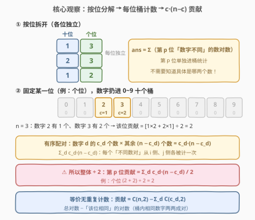
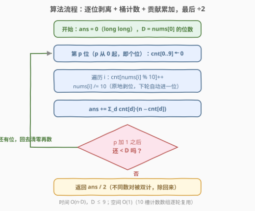

# 所有数对中数位差之和

- **题目名称**：所有数对中数位差之和
- **链接**：[3153. 所有数对中数位差之和](https://leetcode.cn/problems/sum-of-digit-differences-of-all-pairs/)
- **难度**：中等
- **标签**：数组、哈希表、数学、计数

## 1. 题目概述

给你一个数组 `nums`，它只包含**正**整数，所有正整数的数位长度都**相同**。

两个整数的**数位差**指的是两个整数**相同**位置上不同数字的数目。

请你返回 `nums` 中**所有**整数数对里，**数位差之和**。

**示例 1**：

```text
输入：nums = [13,23,12]
输出：4
解释：
- 13 和 23 的数位差为 1。
- 13 和 12 的数位差为 1。
- 23 和 12 的数位差为 2。
所以所有整数数对的数位差之和为 1 + 1 + 2 = 4。
```

**示例 2**：

```text
输入：nums = [10,10,10,10]
输出：0
解释：数组中所有整数都相同，所以所有整数数对的数位不同之和为 0。
```

**约束条件**：

- $2 \le nums.length \le 10^5$
- $1 \le nums[i] < 10^9$
- `nums` 中的整数都有相同的数位长度。

> 💡 读题关键：数位差是**逐位定义**的——两个数在第 $p$ 位上要么相同、要么不同，与其他位无关。这种「每位独立」的结构天然允许**按位分解**：把「所有数对的数位差之和」拆成「每一位上数位不同的数对个数」之和。另一处信号是 $n \le 10^5$：数对总数可达 $\binom{n}{2} \approx 5 \times 10^9$，**枚举数对必然超时**，必须从「数数对」换成「数数字」。

---

## 2. 解题思路

### 2.1 暴力思路：枚举所有数对，逐位比较

双重循环枚举所有数对 $(i, j)$，对每一对逐位剥离比较：

```python
for i in range(n):
    for j in range(i + 1, n):
        a, b = nums[i], nums[j]
        while a:
            ans += (a % 10) != (b % 10)
            a //= 10
            b //= 10
```

时间复杂度 $O(n^2 D)$（$D \le 9$ 为数位长度）。$n = 10^5$ 时数对约 $5 \times 10^9$ 个，远超时限——问题不在「比较太慢」，而在「**数对根本数不过来**」。出路是贡献法：不枚举数对，而是让每个数字**通过桶计数批量报告**自己参与了多少个不同数对。

### 2.2 核心观察：按位分解 + 桶计数，每位贡献 $\sum_d c_d \cdot (n - c_d) \,/\, 2$



**第一步：按位分解。** 总答案可以写成

$$\text{ans} = \sum_{p=0}^{D-1} \bigl(\text{第 } p \text{ 位上数字不同的数对个数}\bigr)$$

**第二步：单个位置上「桶计数」。** 固定第 $p$ 位，把 $n$ 个数字扔进 $0 \sim 9$ 十个桶，设数字 $d$ 出现 $c_d$ 次（$\sum_d c_d = n$）。那么：

- 数字为 $d$ 的 $c_d$ 个数，与其余 $n - c_d$ 个数在该位**必然不同**，形成有序配对 $c_d \cdot (n - c_d)$ 个；
- 对 $d$ 求和后，每个「该位不同的数对」恰好被计**两次**（一次从 $i$ 的数字侧、一次从 $j$ 的数字侧），故整体除以 2：

$$\text{第 } p \text{ 位的贡献} = \frac{1}{2}\sum_{d=0}^{9} c_d \,(n - c_d) \;=\; \binom{n}{2} - \sum_{d=0}^{9}\binom{c_d}{2}$$

右边的等价式更直观：**总对数减去「该位相同」的对数**——桶内相同数字两两成对 $\binom{c_d}{2}$ 个，天然无重复计数，连 $\div 2$ 都省了。

> 💡 二进制玩家应该眼熟：把「十进制数位」换成「二进制位」，这正是 [477. 汉明距离总和](https://leetcode.cn/problems/total-hamming-distance/)的按位贡献 $k \cdot (n-k)$（$k$ 为该位 1 的个数）。本题是它的十进制泛化版——但注意两个桶时 $k(n-k)$ 恰好每个不同数对计一次（见 5.1 的对比）。

### 2.3 算法流程图



流程五步（从**个位**开始逐位剥离：`x % 10` 取当前位、`x / 10` 剥掉当前位）：

1. 由 `nums[0]` 确定数位长度 $D$（所有数等长），初始化 `ans = 0`；
2. 对第 $p$ 位（$p = 0, 1, \ldots, D-1$）：`cnt[0..9]` 清零；
3. 遍历每个 `nums[i]`：`cnt[nums[i] % 10]++`，同时 `nums[i] /= 10` **原地剥位**；
4. 累加 `ans += Σ_d cnt[d] * (n - cnt[d])`；
5. 所有位处理完，返回 `ans / 2`。

> 💡 原地剥位的小技巧：处理第 $p$ 位时顺手把 `nums[i]` 除以 10，下一轮循环里 `% 10` 自动变成更高一位——无需预先转字符串，也无需幂运算。

### 2.4 示例演算

![示例演算：[13,23,12] 逐位桶计数求贡献](../images/p3153_example_walkthrough.svg)

以 `nums = [13, 23, 12]`（$n = 3$，$D = 2$）为例：

| 位置 | 剥出的数字 | 桶计数 | 贡献 $\sum c_d(n-c_d)/2$ | 验证 $\binom{n}{2} - \sum\binom{c_d}{2}$ |
|------|-----------|--------|--------------------------|------------------------------------------|
| 个位 | $3, 3, 2$ | $c_3 = 2,\ c_2 = 1$ | $(2 \times 1 + 1 \times 2) / 2 = 2$ | $3 - 1 - 0 = 2$ ✓ |
| 十位 | $1, 2, 1$ | $c_1 = 2,\ c_2 = 1$ | $(2 \times 1 + 1 \times 2) / 2 = 2$ | $3 - 1 - 0 = 2$ ✓ |

合计 $2 + 2 = 4$，与逐对计算（13↔23 差 1、13↔12 差 1、23↔12 差 2）一致。

示例 2 `[10,10,10,10]`：每位桶中只有一个非空桶（$c = n = 4$），贡献 $4 \times 0 / 2 = 0$，答案为 0。

---

## 3. 参考代码

### C++

```cpp
class Solution {
  public:
    long long sumDigitDifferences(vector<int>& nums) {
        long long n = nums.size();
        int D = to_string(nums[0]).size();      // 所有数等长，看一个即可
        long long ans = 0;
        for (int p = 0; p < D; p++) {
            long long cnt[10] = {};
            for (int& x : nums) {               // 原地剥位：本轮取个位，下一轮自动是十位
                cnt[x % 10]++;
                x /= 10;
            }
            for (int d = 0; d < 10; d++) {
                ans += cnt[d] * (n - cnt[d]);   // 先按「有序对」累加
            }
        }
        return ans / 2;                         // 每个不同数对被计两次，整体除 2
    }
};
```

### Python

```python
class Solution:
    def sumDigitDifferences(self, nums: List[int]) -> int:
        n = len(nums)
        ans = 0
        while nums[0]:                          # 所有数等长，nums[0] 剥完即全部剥完
            cnt = [0] * 10
            for i, x in enumerate(nums):
                cnt[x % 10] += 1
                nums[i] //= 10                  # 原地剥位
            ans += sum(c * (n - c) for c in cnt)
        return ans // 2
```

> 💡 两个工程细节：**① 溢出**——答案上界 $\binom{10^5}{2} \times 9 \approx 4.5 \times 10^{10}$，单项 $c_d(n-c_d)$ 最大可达 $2.5 \times 10^9$，都超 32 位整型，C++ 里 `ans`、`n`、`cnt` 都得用 `long long`（Python 天然大数无虞）；**② 免除 ÷2 的增量写法**——处理第 $i$ 个数（0 起）时，对其第 $p$ 位数字 $d$ 累加 $i - cnt[p][d]$（即前面已出现、该位与它不同的个数）再 `cnt[p][d]++`，每个无序数对恰好计一次，代价是要开 $D \times 10$ 的计数表，两种写法任选。

---

## 4. 复杂度分析

| 维度 | 复杂度 | 说明 |
|------|--------|------|
| 时间复杂度 | $O(nD)$，$D \le 9$ | 每个数每位被访问一次（取模 + 除法），等价 $O(n)$；桶大小恒为 10，每位额外 $O(10)$ |
| 空间复杂度 | $O(1)$ | 仅一个 10 槽计数数组逐轮复用；增量写法需 $O(10D)$，仍是常数 |
| 答案规模 | $\le 4.5 \times 10^{10}$ | 上界 $\binom{n}{2} \cdot D$，超 32 位整型，返回值必须 64 位 |

---

## 5. 扩展

### 5.1 二进制特例：477. 总汉明距离

[477. 总汉明距离](https://leetcode.cn/problems/total-hamming-distance/)（中等）（[站内题解](../0401-0500/477_总汉明距离.md)）是本题的**二进制版**：数位差换成汉明距离（不同 bit 的数目），桶从 10 个缩成 2 个。它按位贡献 $k(n-k)$（$k$ 为该位 1 的个数）却**不用除 2**——因为只有两个桶时，「跨桶配对」$k \cdot (n-k)$ 恰好把每个无序不同数对计一次（1 侧选一个、0 侧选一个，天然无序）；而本题十个桶，$\sum_d c_d(n-c_d)$ 会把每个数对从两侧各计一次，需要 $\div 2$（或直接用 $\binom{n}{2} - \sum_d \binom{c_d}{2}$ 规避）。二进制是十进制的退化特例，但**重复计数的口径不同**，套模板前要先想清楚。

### 5.2 若数位长度不同？

「所有数位长度相同」这个条件被去掉后，只需按最长长度对较短的数**左侧补前导零**——前导零同样进桶参与计数，公式不变。相应地，代码里依赖等长条件的写法要调整：`while nums[0]` 应改为 `while max(nums)`（C++ 里则是先求出最大数的位数），保证所有数同步剥完。

---

## 6. 面试要点

1. **为什么可以按位分解？**

   - 数位差逐位定义、各位独立，且对数对求和具有可加性：$\text{ans} = \sum_p$（第 $p$ 位不同的数对数）。把「每对的差」翻转成「每位的对数」（贡献法），是复杂度从 $O(n^2)$ 降到 $O(n)$ 的关键一步。

2. **$\sum_d c_d(n-c_d)$ 为什么要除以 2？有没有不除 2 的写法？**

   - 某位不同的数对 $(i, j)$：$d = d_i$ 时 $i$ 侧计一次，$d = d_j$ 时 $j$ 侧再计一次，共两次。免除 $\div 2$ 的写法有两个：$\binom{n}{2} - \sum_d \binom{c_d}{2}$（总数对减同位对），或增量法（处理第 $i$ 个数时加 $i - cnt[p][d]$）。

3. **溢出风险在哪里？**

   - 答案上界 $\binom{10^5}{2} \times 9 \approx 4.5 \times 10^{10}$，单项 $c_d(n-c_d)$ 可达 $2.5 \times 10^9$，均已超 `int`。C++ 中 `ans`、`n`、`cnt` 均应 `long long`（或至少在乘法前强制转换）。

4. **「所有数位长度相同」这个条件用在哪？去掉会怎样？**

   - 保证逐位剥离时所有数**同步耗尽**（`while nums[0]` / `to_string(nums[0]).size()` 才成立）。去掉后需按最长长度补前导零对齐、以 `max(nums)` 判停，计数公式本身不变。

5. **与 477 汉明距离总和的联系与区别？**

   - 同一套「按位贡献」骨架。区别在桶数：477 两个桶，跨桶配对 $k(n-k)$ 每个不同数对恰计一次、无需 $\div 2$；本题十个桶，$\sum_d c_d(n-c_d)$ 双计一次需 $\div 2$。套模板前必须核对计数口径。

---

## 7. 同类练习题

- [477. 汉明距离总和](https://leetcode.cn/problems/total-hamming-distance/)（[站内题解](../0401-0500/477_总汉明距离.md)）：本题的二进制版——按位贡献 $k(n-k)$，对比两个桶时为何无需 ÷2
- [1512. 好数对的数目](https://leetcode.cn/problems/number-of-good-pairs/)：桶计数数对的入门版，$\binom{c}{2}$ 数「相同对」，正是本文等价式的另一半
- [2006. 差的绝对值为 K 的数对数目](https://leetcode.cn/problems/count-number-of-pairs-with-absolute-difference-k/)：哈希计数替代 $O(n^2)$ 枚举数对的同款「换数对象」思想
- [2748. 美丽下标对的数目](https://leetcode.cn/problems/number-of-beautiful-pairs/)：数位分解（首位/末位）+ 数对计数，同属「数位 + 计数」家族
- [1010. 总持续时间可被 60 整除的歌曲](https://leetcode.cn/problems/pairs-of-songs-with-total-durations-divisible-by-60/)：按余数分桶后做跨桶两两配对计数，桶思想的另一种出题姿势
