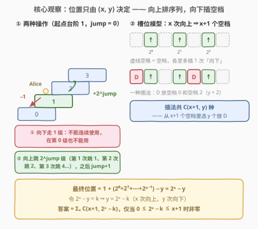
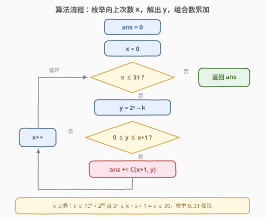
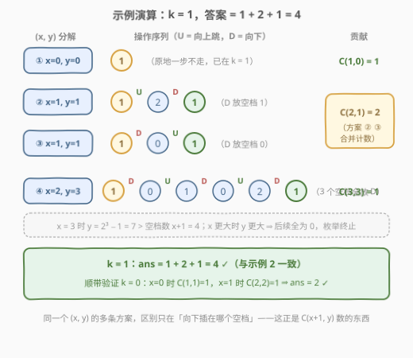

# LeetCode 到达第 K 级台阶的方案数 题解

## 1. 题目概述

- **标题 / 题号**：到达第 K 级台阶的方案数（#3154，hard）
- **链接**：https://leetcode.cn/problems/find-number-of-ways-to-reach-the-k-th-stair/
- **难度**：困难
- **标签**：数学、组合数学、动态规划、记忆化搜索

**题意**：给你一个**非负**整数 $k$。有一个无限长度的台阶，最低一层编号为 0。

Alice 有一个整数 `jump`，一开始值为 0。Alice **从台阶 1 开始**，可以使用**任意**次操作，目标是到达第 $k$ 级台阶。假设 Alice 位于台阶 $i$，一次**操作**中，Alice 可以：

- **操作①（向下）**：向下走一级到 $i-1$，但该操作**不能连续使用**；如果当前在台阶第 0 级，也不能使用。
- **操作②（向上）**：向上走到台阶 $i + 2^{jump}$ 处，然后 `jump` 变为 `jump + 1`。

请你返回 Alice 到达台阶 $k$ 处的**总方案数**。注意：Alice 可能到达台阶 $k$ 后，又通过一些操作重新回到台阶 $k$，这视为**不同**的方案。

**示例 1**：

```text
输入：k = 0
输出：2
解释：
- 方案 1：1 →（向下）0。
- 方案 2：1 →（向下）0 →（向上跳 2⁰=1 级）1 →（向下）0。
```

**示例 2**：

```text
输入：k = 1
输出：4
解释：
- 方案 1：起点就在 1，一步不走。
- 方案 2：1 →（向上跳 2⁰=1 级）2 →（向下）1。
- 方案 3：1 →（向下）0 →（向上跳 2⁰=1 级）1。
- 方案 4：1 → 0 → 1 → 0 →（向上跳 2¹=2 级）2 → 1。
```

**约束**：

- $0 \le k \le 10^9$

> 💡 读题关键：$k$ 的值域高达 $10^9$，任何「逐格 DP」都无从谈起——台阶位置本身不是好的状态。但操作② 的跳距是 $2^{jump}$ **指数增长**的：向上跳 30 次就已经跨过 $10^9$ 级，这说明**任何一条方案的操作总数都极少**（约 $\le 60$ 次）。突破口在「数操作次数」而不是「数台阶位置」。

## 2. 解题思路

### 2.1 暴力思路：DFS 搜索操作序列

最直接的想法是 DFS：状态包含**当前位置** `stair`、**当前跳力** `jump`、**上一步是否是向下**（防止连续向下）。从 $(1, 0)$ 出发，每步分叉「向下 / 向上」，走到 `stair == k` 就计数 +1——**但还不能停**，因为「到达后离开再回来」也算新方案，必须把所有「以 $k$ 结尾」的操作序列都数完。

朴素搜索有两个致命问题：

1. **位置无上界**：一直向上跳，`stair` 可以冲到 $2^{30}$ 以上，搜索树无限伸展；
2. **状态不重用**：不同路径会反复经过同一个 $(stair, jump, lastDown)$，重复展开。

救活它需要两个观察（完整代码见 5.1 的记忆化搜索）：**位置一旦超过 $k+1$ 就永远回不到 $k$**（向下配额不足，2.2 与 5.1 会证明），据此剪枝；再对 $(stair, jump, lastDown)$ 记忆化。这样状态数只剩 $O(\log^2 k)$，也能通过。但状态空间小成这样，恰恰说明**位置本身高度结构化**——不如把结构挖到底，直接闭式计数。

### 2.2 核心观察：位置 $= 2^x - y$，方案数 $= \binom{x+1}{y}$



**第一步：向上的总升高只由「向上次数」决定。** 操作② 的跳距是 $2^{jump}$，而 `jump` 从 0 起每用一次加一——所以**第 $j$ 次使用操作②（$j$ 从 0 数起）恰好跳 $2^j$ 级**，与向下操作怎么穿插毫无关系。若一条方案共用了 $x$ 次向上、$y$ 次向下，则总升高为

$$2^0 + 2^1 + \cdots + 2^{x-1} = 2^x - 1$$

从台阶 1 出发，**最终位置**（方案结束时所站的台阶）为

$$1 + (2^x - 1) - y = 2^x - y$$

> 💡 这一步是全题的题眼：向上跳距只依赖「这是第几次向上」，与向下的穿插位置**无关**。因此一条方案的全部信息被压缩成两个整数 $(x, y)$，$10^9$ 的位置值域瞬间坍缩成 $x \le 30$ 的小枚举。

**第二步：「不能连续向下」⟹ 槽位模型。** 把 $x$ 次向上排成一列，向下只能插在空档里：

- 空档共 $x + 1$ 个：第 1 次向上**之前** 1 个 + 每次向上**之后**各 1 个；
- 「不能连续」⟹ 每个空档**至多放 1 次**向下。

于是固定 $(x, y)$ 时，方案数就是从 $x+1$ 个空档中选出 $y$ 个放「向下」的组合数：

$$\binom{x+1}{y}$$

**第三步：合法性检查——会不会数进「在第 0 级向下」的非法方案？** 不会。设在第 $j$ 次向上之后的空档（$j \ge 1$）执行向下，此刻位置为 $2^j - m$（$m \le j$ 是此前已插的向下次数），则

$$2^j - m \;\ge\; 2^j - j \;\ge\; 1 \qquad (j \ge 1)$$

向下合法；而第一个空档（所有向上之前）位于起点台阶 1，向下到 0 也合法。因此 $\binom{x+1}{y}$ 种插法**全部合法**，一个不废。

**第四步：求和。** 令 $2^x - y = k$，解得 $y = 2^x - k$。答案为

$$\text{ans} = \sum_{x \ge 0} \binom{x+1}{\,2^x - k\,}$$

其中只有满足 $0 \le 2^x - k \le x + 1$ 的 $x$ 贡献非零项：

- $y \ge 0$：要求 $2^x \ge k$；
- $y \le x+1$：要求 $2^x \le k + x + 1$。

由 $k \le 10^9 < 2^{30}$，第二个不等式在 $x = 30$ 时必然失败（$2^{30} \approx 1.07 \times 10^9 > 10^9 + 31$），所以**枚举 $x = 0 \sim 31$ 绰绰有余**。

> ⚠️ 注意「方案」的口径：一条方案 = 一条**以位于 $k$ 结尾**的有限操作序列。中途经过 $k$ 不算（那是同一方案的中间态），「停在 $k$ → 离开 → 再回到 $k$」对应一条**更长**的序列、算另一条方案。$(x, y)$ 分解恰好枚举了所有长度的序列，与这个口径严丝合缝。

### 2.3 算法流程图



流程四步：

1. `ans = 0`，枚举向上次数 $x = 0, 1, 2, \ldots, 31$；
2. 解出向下次数 $y = 2^x - k$；
3. 若 $0 \le y \le x + 1$，累加 $\binom{x+1}{y}$；否则该项为 0，跳过；
4. 枚举结束，返回 `ans`。

> 💡 组合数 $\binom{x+1}{y}$ 中 $x + 1 \le 32$，用「边乘边除」的滚动公式即可（每步中间值恰为 $\binom{n}{i+1}$，整除必然成立），无需预处理阶乘表。

### 2.4 示例演算



以 $k = 1$ 为例，把 4 条方案按 $(x, y)$ 分解：

| $x$（向上次数） | $y = 2^x - k$ | 空档数 $x+1$ | 贡献 | 对应方案 |
|------|------|------|------|------|
| 0 | 0 | 1 | $\binom{1}{0} = 1$ | 原地停在 1 |
| 1 | 1 | 2 | $\binom{2}{1} = 2$ | D 放空档 0（D,U）；D 放空档 1（U,D） |
| 2 | 3 | 3 | $\binom{3}{3} = 1$ | D,U,D,U,D（三个空档全放 D） |
| 3 | $7 > 4$ | — | 0 | $y$ 超出空档数，枚举终止 |

合计 $1 + 2 + 1 = 4$ ✓。再验证 $k = 0$：$x=0$ 时 $y=1$，$\binom{1}{1}=1$；$x=1$ 时 $y=2$，$\binom{2}{2}=1$；合计 $2$ ✓。

> 💡 注意 $x=1, y=1$ 的两条方案正好对应示例 2 里的「方案 3（D,U）」和「方案 2（U,D）」——**同一个 $(x,y)$ 的不同方案，区别只在「向下插在哪个空档」**，这正是 $\binom{x+1}{y}$ 所数的东西。

## 3. 参考代码

### C++

```cpp
class Solution {
  public:
    int waysToReachStair(int k) {
        long long ans = 0;
        for (int x = 0; x <= 31; x++) {           // k ≤ 1e9 < 2^30，枚举到 31 绰绰有余
            long long y = (1LL << x) - k;         // 向下操作次数
            if (y < 0 || y > x + 1) continue;     // y 超出空档数范围 [0, x+1]，该项为 0
            ans += comb(x + 1, y);                // 从 x+1 个空档里选 y 个放「向下」
        }
        return ans;
    }
  private:
    long long comb(long long n, long long r) {    // n ≤ 32，边乘边除
        if (r < 0 || r > n) return 0;
        long long c = 1;
        for (long long i = 0; i < r; i++)
            c = c * (n - i) / (i + 1);            // 每步结果恰为 C(n, i+1)，整除必然成立
        return c;
    }
};
```

### Python

```python
class Solution:
    def waysToReachStair(self, k: int) -> int:
        from math import comb
        return sum(
            comb(x + 1, (1 << x) - k)             # y = 2^x − k
            for x in range(32)                    # k < 2^30，x ≤ 31 足够
            if 0 <= (1 << x) - k <= x + 1         # 空档数约束，不满足则该项为 0
        )
```

> 💡 生成器里的 `if` 条件不成立时直接跳过该项（贡献 0），无须额外分支。注意 `range(32)` 的上界是「保险值」——由 $2^x \le k + x + 1$ 可知实际有效 $x \le 30$。

## 4. 复杂度分析

| 维度 | 复杂度 | 说明 |
|------|--------|------|
| 时间复杂度 | $O(\log^2 k)$ | 枚举 $x$ 至多 32 个；每个组合数边乘边除 $O(x) \le 32$ 步 |
| 空间复杂度 | $O(1)$ | 只用常数个变量，无任何预处理表 |
| 答案规模 | $\le \binom{30}{15} \approx 1.55 \times 10^8$ | 单项最大值出现在 $x = 29$、$y = 15$（即 $k = 2^{29} - 15$）；`int` 恰好可容纳，C++ 用 `long long` 累加更稳 |

> 💡 答案为什么这么小？同时满足 $2^x \ge k$ 与 $2^x \le k + x + 1$ 的 $x$ 通常只有 0~2 个（$2^x$ 每加一就翻倍，而 $k + x + 1$ 只线性增长），所以求和里非零项极少——这正是「操作总数极少」读题信号在答案侧的回响。

## 5. 扩展

### 5.1 官方做法：记忆化搜索

不想推组合公式，也可以「DFS + 记忆化」过：状态 $(stair, jump, lastDown)$，`dfs` 返回**从该状态出发、以位于 $k$ 结尾的操作序列数**——进入状态时若 $stair = k$ 先计 1（就此收工是一种方案），再枚举两种操作继续延伸。

两个关键点：

1. **向上剪枝**：位置一旦 $\ge k + 2$ 就永远回不来。证明：设已用 $j$ 次向上、当前位置 $s = 2^j - m \ge k+2$；终点 $k = 2^x - y$（$x \ge j$），还需向下 $y - m$ 次而剩余空档至多 $x - j + 1$ 个，联立得 $2^x - 2^j \le x - j - 1$，对一切 $x \ge j$ 均不成立（左边非负且增长远快于右边），矛盾。所以 `stair + (1 << jump) > k + 1` 的向上分支直接剪掉。
2. **状态有限**：可达位置形如 $2^j - m$（$m \le j + 1$），每个 $j \le 30$ 至多 $j + 2$ 个位置，总状态 $O(\log^2 k)$，记忆化后总时间也是 $O(\log^2 k)$。

```python
from functools import cache

class Solution:
    def waysToReachStair(self, k: int) -> int:
        @cache
        def dfs(stair: int, jump: int, last_down: bool) -> int:
            res = stair == k                     # 就此停在 k，是一种方案
            if not last_down and stair > 0:       # 操作①：不能连续、不能在第 0 级
                res += dfs(stair - 1, jump, True)
            if stair + (1 << jump) <= k + 1:      # 操作②：超过 k+1 永远回不来，剪枝
                res += dfs(stair + (1 << jump), jump + 1, False)
            return res
        return dfs(1, 0, False)
```

对比：记忆化搜索好想好写、不依赖灵光一现的公式；组合解一步到位、$O(1)$ 空间。面试中先写记忆化保底、再优化成组合公式，是完整的加分路径。

### 5.2 如果去掉「不能连续向下」？

槽位模型立刻退化：$y$ 次向下不再受「每空档至多 1 个」的限制，可以任意堆叠进同一个空档，方案数从「普通组合」$\binom{x+1}{y}$ 变成「可重组合」（隔板法）$\binom{x+y}{y}$。「不能连续」这条约束的价值，正是把可重组合压成普通组合——这也从侧面解释了本题答案为何如此之小。

## 6. 面试要点

1. **为什么最终位置只由 $(x, y)$ 决定？**

   - 第 $j$ 次向上（0 起）跳 $2^j$ 级——跳距只依赖使用次序，与向下穿插位置无关 ⟹ 总升高 $= 2^x - 1$ 只数次数；位置 $= 1 + (2^x-1) - y = 2^x - y$。

2. **「不能连续向下」怎么转成组合数？**

   - 槽位模型：$x$ 次向上产生 $x+1$ 个空档（首个向上之前 + 每次向上之后），每个空档至多放 1 个向下 ⟹ $\binom{x+1}{y}$。

3. **需要排查「在第 0 级向下」的非法方案吗？**

   - 不用。空档 $j \ge 1$ 处位置 $\ge 2^j - j \ge 1$，向下合法；首个空档在台阶 1，向下到 0 也合法。$\binom{x+1}{y}$ 种插法全部有效。

4. **$x$ 枚举到哪为止？依据是什么？**

   - $0 \le y \le x+1$ ⟹ $k \le 2^x \le k + x + 1$；由 $k \le 10^9 < 2^{30}$ 得 $x \le 30$（$x=30$ 时 $2^{30} > 10^9 + 31$ 已必败），代码里枚举到 31 保险。

5. **记忆化搜索怎么写？剪枝的依据？**

   - 状态 $(stair, jump, lastDown)$，`stair == k` 先计 1 再继续延伸；向上分支需满足 `stair + 2^jump ≤ k+1`——位置 $\ge k+2$ 后向下配额（剩余空档数）永远不够拉回 $k$；可达状态 $O(\log^2 k)$。

## 同类练习题

| # | 题目 | 与本题的关联 |
|---|------|-------------|
| 2400 | [恰好移动 k 步到达某一位置的方法数目](https://leetcode.cn/problems/number-of-ways-to-reach-a-position-after-exactly-k-steps/) | 一维移动计数，同款「把路径分解成两个方向的步数、再乘一个组合数」 |
| 1269 | [停在原地的方案数](https://leetcode.cn/problems/number-of-ways-to-stay-in-the-same-place-after-some-steps/)（[站内题解](../1201-1300/1269_停在原地的方案数.md)） | 带「不能越界」限制的移动方案 DP 计数，可对照本文 5.1 的记忆化写法 |
| 62 | [不同路径](https://leetcode.cn/problems/unique-paths/)（[站内题解](../0001-0100/62_不同路径.md)） | 格路组合 $\binom{m+n-2}{m-1}$，组合计数的基本功 |
| 231 | [2 的幂](https://leetcode.cn/problems/power-of-two/)（[站内题解](../0201-0300/231_2的幂.md)） | 本题 $2^x$ 枚举与跳距指数增长背后的位运算基础 |
| 526 | [优美的排列](https://leetcode.cn/problems/beautiful-arrangement/)（[站内题解](../0501-0600/526_优美的排列.md)） | 另一道「位置约束下的排列计数」，感受计数 DP 与组合公式的分界线 |
