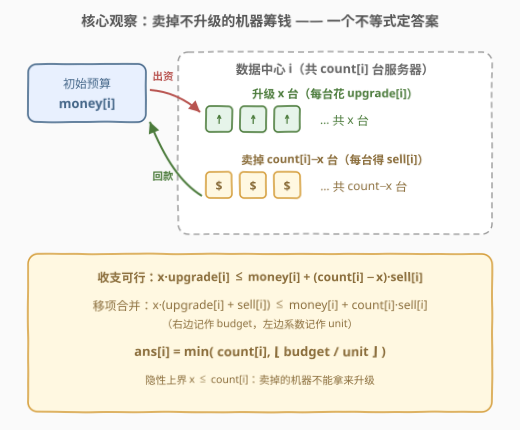
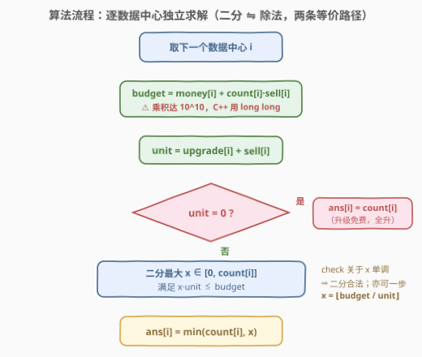
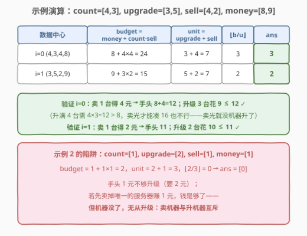

# 可升级服务器的最大数量

- **题目名称**：可升级服务器的最大数量
- **链接**：[3155. 可升级服务器的最大数量](https://leetcode.cn/problems/maximum-number-of-upgradable-servers/)
- **难度**：中等
- **标签**：数组、数学、二分查找

## 1. 题目概述

> ⚠️ 本题为 LeetCode 付费题，题意描述根据官方示例用例与 hints 重建，可能与官方题面有出入。

给你四个下标从 0 开始、长度均为 $n$ 的整数数组 `count`、`upgrade`、`sell` 和 `money`。

网络中有 $n$ 个**互相独立**的数据中心，第 $i$ 个数据中心有 `count[i]` 台服务器。对第 $i$ 个数据中心，你可以任意次执行下面两种操作：

- **升级**一台服务器，每台花费 `upgrade[i]` 元；
- **卖出**一台服务器，每台回收 `sell[i]` 元（卖掉的机器就没了，自然也不能再升级）。

第 $i$ 个数据中心有独立预算 `money[i]` 元——卖机所得只能留在本中心花，各中心互不流通。

返回长度为 $n$ 的数组 `ans`，其中 `ans[i]` 表示第 $i$ 个数据中心**最多能升级**的服务器数量。

**示例 1**：

```text
输入：count = [4,3], upgrade = [3,5], sell = [4,2], money = [8,9]
输出：[3,2]
解释：
- 中心 0：卖出 1 台得 4 元，手头 8+4=12 元；升级 3 台花费 9 元 ≤ 12，输出 3。
- 中心 1：卖出 1 台得 2 元，手头 9+2=11 元；升级 2 台花费 10 元 ≤ 11，输出 2。
```

**示例 2**：

```text
输入：count = [1], upgrade = [2], sell = [1], money = [1]
输出：[0]
解释：手头 1 元不够升级（需 2 元）；若先卖掉唯一的服务器赚 1 元，钱够了
但机器没了——无从升级。
```

**约束条件**（按题意与数据量级重建，具体以官方题面为准）：

- $n = \text{count.length} = \text{upgrade.length} = \text{sell.length} = \text{money.length}$
- $1 \le n \le 10^5$
- $1 \le \text{count}[i] \le 10^5$
- $0 \le \text{upgrade}[i],\ \text{sell}[i],\ \text{money}[i] \le 10^5$

> 💡 读题关键有两处：**① 各中心独立**——预算按中心隔离、卖机收入不跨中心流通，全局问题立刻退化为 $n$ 个互不相干的一元问题（官方 hint 也明示 "for each data center separately"）；**② 卖机与升机互斥**——能卖的是「不升级」的机器，于是「卖掉余下的筹钱」与「升级选中的机器」是同一决策的两面。判定题的判题函数签名为 `maxUpgrades(count, upgrade, sell, money)`。

---

## 2. 解题思路

### 2.1 暴力思路：枚举升级台数，逐个验证

对每个数据中心 $i$，从 $x = \text{count}[i]$ 往下枚举升级台数：卖出剩下的 $\text{count}[i]-x$ 台凑钱，检查 $x \cdot \text{upgrade}[i] \le \text{money}[i] + (\text{count}[i]-x)\cdot\text{sell}[i]$ 是否成立，取第一个可行的 $x$：

```python
for x in range(count[i], -1, -1):
    if x * upgrade[i] <= money[i] + (count[i] - x) * sell[i]:
        ans.append(x)
        break
```

单中心最坏 $O(\text{count}[i])$，总量级 $O(n \cdot C)$（$C = 10^5$）即 $10^{10}$ 步——超时。但注意验证式只与 $x$ 线性相关，**可行 $x$ 恰好构成区间 $[0, x^*]$**：$x$ 越小花费越少、可卖的机器越多，可行性单调不降。单调性在手，二分或直接解不等式都顺理成章。

### 2.2 核心观察：把「卖掉未升级的」折进预算，一个不等式出答案



对第 $i$ 个数据中心，设升级 $x$ 台。最优策略里**未升级的机器全卖掉**——卖机只增加预算、不损失任何已升级台数，多多益善。于是可行性就是一个收支不等式：

$$x \cdot \text{upgrade}[i] \;\le\; \text{money}[i] + (\text{count}[i] - x)\cdot \text{sell}[i]$$

把含 $x$ 的项移到一边，$x$ 的一次式对一次式：

$$x \cdot \underbrace{(\text{upgrade}[i] + \text{sell}[i])}_{\text{unit}} \;\le\; \underbrace{\text{money}[i] + \text{count}[i]\cdot \text{sell}[i]}_{\text{budget}}$$

右边与 $x$ 无关！于是最大可行台数直接解出：

$$\text{ans}[i] = \min\Bigl(\text{count}[i],\ \Bigl\lfloor \frac{\text{money}[i] + \text{count}[i]\cdot \text{sell}[i]}{\text{upgrade}[i] + \text{sell}[i]} \Bigr\rfloor \Bigr)$$

直观读法：**每多升级一台，除了直接花 `upgrade[i]` 元，还放弃了「卖它回收 `sell[i]` 元」的机会，真实单价是 `upgrade[i] + sell[i]`**；而家底除了 `money[i]`，还有「全部机器理论变现值」`count[i]·sell[i]`。家底除以真实单价，再封顶机器总数——一步除法收工。

> ⚠️ **两个边界**：**① 隐性上界 $x \le \text{count}[i]$**——分式可能给出超过机器总数的解（如 `upgrade=0` 时）；**② 分母为零**——当 `upgrade[i] = sell[i] = 0` 时升级免费且无变现价值，直接全升，`ans[i] = count[i]`，代码里要防御性分流，避免除零。

### 2.3 算法流程图



流程五步（对每个 $i$ 独立执行）：

1. 计算家底 $\text{budget} = \text{money}[i] + \text{count}[i] \cdot \text{sell}[i]$（⚠ 乘积达 $10^{10}$，C++ 必须 64 位）；
2. 计算真实单价 $\text{unit} = \text{upgrade}[i] + \text{sell}[i]$；
3. 若 $\text{unit} = 0$：免费升级，`ans[i] = count[i]`，跳到 5；
4. 求最大可行 $x$：官方 hint 推荐**二分** $x \in [0, \text{count}[i]]$，check 为 $x \cdot \text{unit} \le \text{budget}$；由于 check 关于 $x$ 单调，亦可一步 $x = \lfloor \text{budget} / \text{unit} \rfloor$；
5. `ans[i] = min(count[i], x)`，追加进答案数组。

> 💡 二分与除法完全等价——check 左边是 $x$ 的线性函数，「二分线性不等式的最大解」本来就是「解不等式」的暴力版。hint 给二分是把这题当二分答案练手，Math 标签则奖励看出 O(1) 公式的玩家。

### 2.4 示例演算



以示例 1 `count=[4,3], upgrade=[3,5], sell=[4,2], money=[8,9]` 逐格代入：

| 数据中心 | budget = money + count·sell | unit = upgrade + sell | $\lfloor$budget/unit$\rfloor$ | ans = min(count, ·) |
|----------|------------------------------|------------------------|-------------------------------|---------------------|
| $i=0$（4, 3, 4, 8） | $8 + 4 \times 4 = 24$ | $3 + 4 = 7$ | $3$ | $\min(4, 3) = 3$ |
| $i=1$（3, 5, 2, 9） | $9 + 3 \times 2 = 15$ | $5 + 2 = 7$ | $2$ | $\min(3, 2) = 2$ |

- **验证 $i=0$**：卖 1 台得 4 元，手头 $8+4=12$，升级 3 台花 $9 \le 12$ ✓；想升满 4 台需 $12 > 8$（卖光凑 16 元也不行——机器卖光就没得升了）。
- **验证 $i=1$**：卖 1 台得 2 元，手头 11，升级 2 台花 $10 \le 11$ ✓；升 3 台需 15，卖光也只有 $9$，不可行。

示例 2 的陷阱：`count=[1], upgrade=[2], sell=[1], money=[1]`，budget $= 1+1 = 2$，unit $= 3$，$\lfloor 2/3 \rfloor = 0$——手头不够升级；卖掉唯一的机器钱够了、机器却没了，答案 `[0]`。**「能卖钱」和「能升级」是互斥的两种归宿**，公式里的隐性上界 $x \le \text{count}[i]$ 正是挡住这种幻觉的。

---

## 3. 参考代码

### C++

```cpp
class Solution {
  public:
    // O(n) 公式版：解一次不等式，二分的「数学加速」形态
    vector<int> maxUpgrades(vector<int>& count, vector<int>& upgrade,
                            vector<int>& sell, vector<int>& money) {
        int n = count.size();
        vector<int> ans;
        ans.reserve(n);
        for (int i = 0; i < n; i++) {
            long long unit = (long long)upgrade[i] + sell[i];
            if (unit == 0) {                    // 免费升级且无变现：全升，防除零
                ans.push_back(count[i]);
                continue;
            }
            long long budget = (long long)money[i] + (long long)count[i] * sell[i];
            long long x = budget / unit;        // 最大可行台数（long long 防 10^10 溢出）
            ans.push_back((int)min((long long)count[i], x));
        }
        return ans;
    }
};
```

```cpp
class Solution {
  public:
    // O(n log C) 二分版：官方 hint 的写法，check 单调 ⇒ 二分最大可行 x
    vector<int> maxUpgrades(vector<int>& count, vector<int>& upgrade,
                            vector<int>& sell, vector<int>& money) {
        int n = count.size();
        vector<int> ans;
        ans.reserve(n);
        for (int i = 0; i < n; i++) {
            long long unit = (long long)upgrade[i] + sell[i];
            long long budget = (long long)money[i] + (long long)count[i] * sell[i];
            if (unit == 0) {
                ans.push_back(count[i]);
                continue;
            }
            int lo = 0, hi = count[i];
            while (lo < hi) {                   // 求满足 mid*unit <= budget 的最大 mid
                int mid = lo + (hi - lo + 1) / 2;
                if ((long long)mid * unit <= budget) lo = mid;
                else hi = mid - 1;
            }
            ans.push_back(lo);
        }
        return ans;
    }
};
```

### Python

```python
class Solution:
    def maxUpgrades(self, count: List[int], upgrade: List[int],
                    sell: List[int], money: List[int]) -> List[int]:
        ans = []
        for c, u, s, m in zip(count, upgrade, sell, money):
            unit = u + s
            if unit == 0:                       # 免费升级且无变现：全升，防除零
                ans.append(c)
                continue
            budget = m + c * s                  # Python 天然大数，无溢出之忧
            ans.append(min(c, budget // unit))
        return ans
```

> 💡 工程细节：**溢出**是本题唯一阴人的点——`count[i] * sell[i]` 可达 $10^5 \times 10^5 = 10^{10}$，C++ 中 `budget`、`unit` 及二分里的 `mid * unit` 都必须 `long long` 参与运算（`int` 上限约 $2.1 \times 10^9$）；返回值本身不超过 $\text{count}[i] \le 10^5$，用 `int` 收集即可。Python 无此烦恼。

---

## 4. 复杂度分析

| 维度 | 复杂度 | 说明 |
|------|--------|------|
| 时间复杂度（公式版） | $O(n)$ | 每个数据中心一次乘加一次除法 |
| 时间复杂度（二分版） | $O(n \log C)$ | $C = \max\,\text{count}[i] \le 10^5$，单中心二分 $\le 17$ 轮，check $O(1)$ |
| 空间复杂度 | $O(1)$ | 逐中心滚动计算，不算返回数组 |
| 中间量规模 | $\le 10^{10}$ | budget 上界 $10^5 + 10^5 \times 10^5$，超 32 位整型 |

---

## 5. 扩展

### 5.1 若卖机收入可以跨中心流通？

「各中心独立」是本题送分的前提。一旦放开成**全局钱包**（任何中心的卖机收入可补贴任何中心的升级），问题立刻从 $n$ 个一元不等式变成全局资源分配：卖给谁、补给谁相互耦合，贪心（按性价比排序）未必最优，更接近背包/匹配味道的组合优化。面试里被追问「放宽独立假设怎么办」时，先指出**复杂度从多项式跌向组合搜索**，再讨论小规模 DP 或流模型，比硬套公式更显功力。

### 5.2 从二分到公式：什么时候二分能「白嫖」成 O(1)？

二分答案的本质是**在单调布尔序列上找边界**。当 check(x) 恰好是 $x$ 的线性不等式（两边都是一次式），边界有闭式解——直接移项除法取整，如本题；当 check 是分段线性（等差/等比求和），往往也能解方程得 $O(1)$ 或 $O(\log)$，如 [1802. 有界数组中指定下标处的最大值](https://leetcode.cn/problems/maximum-value-at-a-given-index-in-a-bounded-array/)；只有 check 涉及排序、模拟等「黑盒」结构（如 [875. 爱吃香蕉的珂珂](https://leetcode.cn/problems/koko-eating-bananas/)的逐堆验证）时，二分才是不可替代的骨架。**先看 check 的代数结构，再决定写二分还是推公式**，是这类题的通用复盘姿势。

---

## 6. 面试要点

1. **为什么各数据中心可以独立求解？**

   - 预算 `money[i]` 按中心隔离、卖机收入不跨中心流通，中心之间没有任何共享状态；全局最优就是各中心局部最优的直接拼接（可加性）。官方 hint 也明示 "separately"。

2. **二分的 check 是什么？为什么单调？**

   - check(x)：$x \cdot (\text{upgrade}[i] + \text{sell}[i]) \le \text{money}[i] + \text{count}[i]\cdot\text{sell}[i]$。左边随 $x$ 线性递增、右边与 $x$ 无关，可行 $x$ 构成前缀区间 $[0, x^*]$，单调性成立，二分合法。

3. **怎么从二分退化到 O(1)？**

   - check 两边都是 $x$ 的一次式，直接移项：$x \le \text{budget} / \text{unit}$，向下取整再与 $\text{count}[i]$ 取 min。二分求「线性不等式的最大整数解」本来就是解不等式的通用暴力，代数结构简单时可白嫖成除法。

4. **溢出风险在哪里？**

   - `count[i] * sell[i]` 与 `mid * unit` 都可达 $10^{10}$ 量级，超 32 位整型；C++ 中相关变量必须 `long long`。返回值上界是 $\text{count}[i] \le 10^5$，`int` 足够。

5. **为什么最优解一定「卖掉所有不升级的机器」？unit = 0 怎么办？**

   - 卖机只增预算、不减已升级台数（能卖的只有不升级的机器），给定升级台数 $x$ 时卖得越多资金越宽裕，故最优策略下余机全卖。当 `upgrade[i] = sell[i] = 0` 时分母为零：升级免费，直接 `ans[i] = count[i]`。

---

## 7. 同类练习题

- [2141. 同时运行 N 台电脑的最长时间](https://leetcode.cn/problems/maximum-running-time-of-n-computers/)（[站内题解](../2101-2200/2141_同时运行N台电脑的最长时间.md)）：同款「资源池 + 线性不等式」——电池总能量除以 n 台的匀速消耗，二分与贪心双解法对照
- [2279. 装满石头的背包的最大数量](https://leetcode.cn/problems/maximum-bags-with-full-capacity-of-rocks/)（[站内题解](../2201-2300/2279_装满石头的背包的最大数量.md)）：有限资源最大化满足个数——按缺口排序的贪心版，对照本题的公式版
- [2226. 每个小孩最多能分到多少糖果](https://leetcode.cn/problems/maximum-candies-allocated-to-k-children/)（[站内题解](../2101-2200/2226_每个小孩最多能分到多少糖果.md)）：二分答案 + 「每堆取 min」计数验证，check 同为一个不等式
- [1802. 有界数组中指定下标处的最大值](https://leetcode.cn/problems/maximum-value-at-a-given-index-in-a-bounded-array/)（[站内题解](../1801-1900/1802_有界数组中指定下标处的最大值.md)）：二分 check 是等差数列求和，可解方程加速——「二分退化」的另一个样本
- [875. 爱吃香蕉的珂珂](https://leetcode.cn/problems/koko-eating-bananas/)（[站内题解](../0801-0900/875_爱吃香蕉的珂珂.md)）：二分答案母题——check 是逐堆取上界的「黑盒」，只能二分、无法公式化，体会本题为何能白嫖成 O(1)
