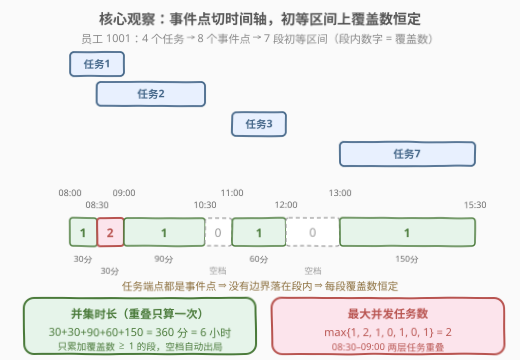
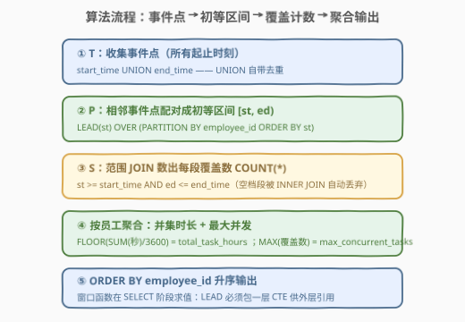
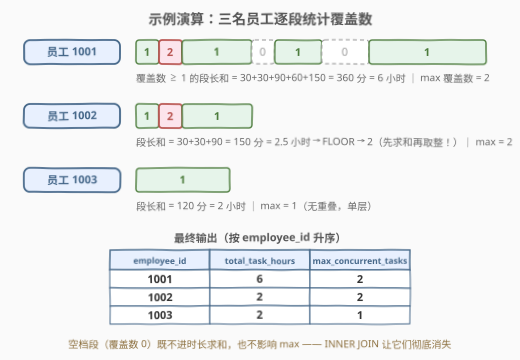

# 员工任务持续时间和并发任务

- **题目名称**：员工任务持续时间和并发任务
- **链接**：[3156. 员工任务持续时间和并发任务](https://leetcode.cn/problems/employee-task-duration-and-concurrent-tasks/)
- **难度**：困难
- **标签**：数据库、SQL、扫描线、区间离散化、窗口函数、`LEAD`、范围 JOIN、差分与前缀和、`FLOOR`

## 1. 题目概述

> ⚠️ 本题为 LeetCode 付费题（Plus 会员专享），题意描述根据官方示例用例与外部资料重建，可能与官方题面有出入。

给定 `Tasks`（任务）表，每行记录一个任务的归属员工与起止时间。同一员工的多个任务**可能重叠**——就像一边写代码一边挂着会议。编写 SQL 查询，对**每名员工**统计：

1. **任务总持续时间** `total_task_hours`：员工处于"至少一个任务中"的时长，即该员工所有任务区间的**并集**长度（**重叠部分只算一次**），最后**向下取整到整小时**；
2. **最大并发任务数** `max_concurrent_tasks`：任何时刻该员工**同时**进行中的任务数的最大值。

结果按 `employee_id` **升序**返回。

**表结构**：

```text
Table: Tasks
+---------------+----------+
| Column Name   | Type     |
+---------------+----------+
| task_id       | int      |
| employee_id   | int      |
| start_time    | datetime |
| end_time      | datetime |
+---------------+----------+
(task_id, employee_id) 是这张表的主键。
这张表的每一行包含任务标识、员工标识和每个任务的开始与结束时间。
```

**示例 1**：

```text
输入：
Tasks 表:
+---------+-------------+---------------------+---------------------+
| task_id | employee_id | start_time          | end_time            |
+---------+-------------+---------------------+---------------------+
| 1       | 1001        | 2023-05-01 08:00:00 | 2023-05-01 09:00:00 |
| 2       | 1001        | 2023-05-01 08:30:00 | 2023-05-01 10:30:00 |
| 3       | 1001        | 2023-05-01 11:00:00 | 2023-05-01 12:00:00 |
| 7       | 1001        | 2023-05-01 13:00:00 | 2023-05-01 15:30:00 |
| 4       | 1002        | 2023-05-01 09:00:00 | 2023-05-01 10:00:00 |
| 5       | 1002        | 2023-05-01 09:30:00 | 2023-05-01 11:30:00 |
| 6       | 1003        | 2023-05-01 14:00:00 | 2023-05-01 16:00:00 |
+---------+-------------+---------------------+---------------------+

输出：
+-------------+------------------+----------------------+
| employee_id | total_task_hours | max_concurrent_tasks |
+-------------+------------------+----------------------+
| 1001        | 6                | 2                    |
| 1002        | 2                | 2                    |
| 1003        | 2                | 1                    |
+-------------+------------------+----------------------+
```

**解释**：

| 员工 | 任务区间 | 并集时长 | 取整后 | 最大并发 |
|------|----------|----------|--------|----------|
| 1001 | [08:00,09:00]、[08:30,10:30]、[11:00,12:00]、[13:00,15:30] | 150+60+150 = 360 分 = 6 小时 | 6 | 2（08:30–09:00 任务 1、2 重叠） |
| 1002 | [09:00,10:00]、[09:30,11:30] | 150 分 = 2.5 小时 | **2**（向下取整） | 2（09:30–10:00） |
| 1003 | [14:00,16:00] | 120 分 = 2 小时 | 2 | 1 |

> 💡 两个易错点都被示例钉死了：① 1001 的总时长是 **6** 小时而不是 6.5 小时——四个任务时长简单相加是 60+120+60+150 = 390 分，但任务 1 与任务 2 重叠的 30 分**只算一次**，390 − 30 = 360；② 1002 的并集是 2.5 小时，输出却是 **2**——**先求并集总时长、再向下取整**，取整发生在聚合之后。

**约束与注意**：

- `(task_id, employee_id)` 为复合主键，每行满足 `start_time < end_time`。
- 同一员工的任务可以**重叠、端点相触或完全分离**；并发只在同一名员工内部统计，不同员工互不影响。
- 端点相触（A 的 `end_time` 等于 B 的 `start_time`）**不算并发**——并发要求时间段有公共部分。

> 💡 本题可视为「[56. 合并区间](../0001-0100/56_合并区间.md)（求并集长度）+ [2406. 将区间分为最少组数](https://leetcode.cn/problems/divide-intervals-into-minimum-number-of-groups/)（求最大重叠层数）」两道经典区间题的 **SQL 合体**，一次查询同时要这两个统计量。

---

## 2. 解题思路

### 2.1 暴力思路：连续时间轴上的两种笨办法

**笨办法一：甩给应用层**。把 `Tasks` 全量拉到 Python/Java，排序后跑一遍"合并区间 + 扫描线"，什么都能算出来。逻辑正确，但这道题的价值正在于**用 SQL 的集合语言表达区间运算**——把数据库能干的活儿搬出库，面试官不会买账。

**笨办法二：逐分钟（逐秒）采样**。用递归 CTE 在时间轴上生成"每个员工 × 每分钟"一行，再 JOIN 判断该分钟被几个任务覆盖，最后聚合。逻辑上可行，但时间轴是**连续**的：一年就是五十多万分钟，粒度还得细到秒（取整要求秒级精度），行数爆炸，彻底不可行。

> ⚠️ 两种笨办法的共同病根：**试图枚举连续时间轴**。区间问题的正解从来不是"遍历时间"，而是"遍历事件"——时间轴上真正发生变化的时刻，只有所有区间的**端点**。

### 2.2 核心观察：事件点离散化——初等区间上覆盖数恒定



把每名员工的所有 `start_time` / `end_time` 收集起来、去重排序，得到一组**事件点**；相邻事件点之间的时间段称为**初等区间**。以员工 1001 为例：8 个事件点把 08:00–15:30 切成 7 段初等区间。

**关键引理**：每个任务区间的端点都是事件点，所以**没有任何任务边界落在初等区间内部**——于是在每个初等区间上，"有几层任务覆盖"是**恒定不变**的。图中每段内的数字 1、2、1、0、1、0、1 正是这七段的覆盖数。

有了"每段覆盖数"这张表，两个统计量**一表两吃**：

$$\text{total\_task\_hours} = \left\lfloor \frac{\sum_{\text{覆盖数} \ge 1} \text{段长（秒）}}{3600} \right\rfloor, \qquad \text{max\_concurrent\_tasks} = \max\{\text{各段覆盖数}\}$$

- **并集时长**：只累加覆盖数 ≥ 1 的段——重叠段（覆盖数 2）也只贡献**一次**段长，"重叠只算一次"自动成立；覆盖数 0 的段是空档，天然不参与求和。
- **最大并发**：所有段覆盖数的最大值。

> 💡 这正是算法侧"扫描线 / 坐标离散化"在 SQL 里的化身：**把连续问题投影到事件点上**。覆盖数只在事件点处才可能变化，两个相邻事件点之间是常数，所以"任意时刻"的最大值必然在某个初等区间上取到——枚举事件点就够了，完备性有引理兜底。

> ⚠️ **端点相触为什么不算并发**：初等区间取**半开语义** $[\mathrm{st}, \mathrm{ed})$。任务 A 在 10:00 结束、任务 B 在 10:00 开始时，10:00 本身是事件点，它两侧的段一段只属于 A、一段只属于 B——任何一段的覆盖数都不会同时包含两者。**无需任何特判**，半开语义与"并发要求有公共部分"的题意精确对齐。

### 2.3 算法流程图



**逻辑执行步骤**：

| 步骤 | CTE | 作用 | 关键表达式 |
|------|-----|------|------------|
| ① 事件点 | `T` | 每名员工的所有起止时刻去重 | `start_time UNION end_time` |
| ② 初等区间 | `P` | 相邻事件点两两配对成段 $[\mathrm{st}, \mathrm{ed})$ | `LEAD(st) OVER (PARTITION BY employee_id ORDER BY st)` |
| ③ 覆盖计数 | `S` | 数每段被几个任务完整覆盖 | 范围 JOIN + `COUNT(*)` |
| ④ 聚合输出 | 主查询 | 每员工求并集时长与最大并发 | `FLOOR(SUM(秒)/3600)`、`MAX(concurrent_count)` |
| ⑤ 排序 | 主查询 | 按员工升序 | `ORDER BY employee_id` |

> ⚠️ 步骤③的两个细节：其一，覆盖判定用"**完整包含**"谓词（`st >= start_time AND ed <= end_time`）。由 2.2 的引理，初等区间与一个任务**要么不相交、要么被完整包含**；反过来写"有交集"（如 `st < end_time AND ed > start_time`）在端点相触时会误判——任务恰好在段首结束时"有交集"为真，但它并未覆盖该段。"完整包含"谓词天然是半开语义，稳。其二，用 **INNER JOIN**：空档段（覆盖数 0）连接不到任何任务，自动从结果里消失，连 `WHERE` 都省了。

### 2.4 示例演算



对三名员工逐一切段（覆盖数标在段内）：

**员工 1001**（事件点 08:00 / 08:30 / 09:00 / 10:30 / 11:00 / 12:00 / 13:00 / 15:30）：

| 初等区间 | [08:00,08:30) | [08:30,09:00) | [09:00,10:30) | [10:30,11:00) | [11:00,12:00) | [12:00,13:00) | [13:00,15:30) |
|----------|----|----|----|----|----|----|----|
| 段长（分） | 30 | 30 | 90 | 30 | 60 | 60 | 150 |
| 覆盖数 | 1 | **2** | 1 | 0 | 1 | 0 | 1 |

并集 = 30+30+90+60+150 = **360 分 = 6 小时**（两个空档共 90 分被 INNER JOIN 丢弃）；最大并发 = **2**。

**员工 1002**（事件点 09:00 / 09:30 / 10:00 / 11:30）：

| 初等区间 | [09:00,09:30) | [09:30,10:00) | [10:00,11:30) |
|----------|----|----|----|
| 段长（分） | 30 | 30 | 90 |
| 覆盖数 | 1 | **2** | 1 |

并集 = 150 分 = 2.5 小时 → `FLOOR` → **2**；最大并发 = **2**。

**员工 1003**（事件点 14:00 / 16:00）：唯一一段 [14:00,16:00) 覆盖数 1 → 120 分 = **2 小时**；最大并发 = **1**。

> 💡 1002 是"取整口径"的试金石：逐段取整会得到 $\lfloor 0.5 \rfloor + \lfloor 0.5 \rfloor + \lfloor 1.5 \rfloor = 1 \ne 2$；逐任务取整会得到 $\lfloor 1 \rfloor + \lfloor 2 \rfloor = 3 \ne 2$。只有"**先求并集总秒数、再除 3600、最后 `FLOOR`**"才能命中官方答案。

---

## 3. 参考代码

### SQL（解法 A：事件点 + LEAD + 范围 JOIN 计数）

```sql
WITH
    T AS (   -- ① 事件点：所有起止时刻（UNION 自带去重）
        SELECT employee_id, start_time AS st FROM Tasks
        UNION
        SELECT employee_id, end_time   AS st FROM Tasks
    ),
    P AS (   -- ② 相邻事件点配对成初等区间 [st, ed)
        SELECT employee_id, st,
               LEAD(st) OVER (PARTITION BY employee_id ORDER BY st) AS ed
        FROM T
    ),
    S AS (   -- ③ 数每段被几个任务完整覆盖（INNER JOIN 丢弃空档段）
        SELECT p.employee_id, p.st, p.ed,
               COUNT(*) AS concurrent_count
        FROM P p
        JOIN Tasks tk
          ON tk.employee_id = p.employee_id
         AND p.st >= tk.start_time
         AND p.ed <= tk.end_time
        GROUP BY p.employee_id, p.st, p.ed
    )
SELECT employee_id,
       FLOOR(SUM(TIMESTAMPDIFF(SECOND, st, ed)) / 3600) AS total_task_hours,
       MAX(concurrent_count)                            AS max_concurrent_tasks
FROM S
GROUP BY employee_id
ORDER BY employee_id;
```

> 💡 **写法要点**：
> - **`UNION` 而非 `UNION ALL`**：事件点必须去重——同一时刻出现多次会切出长度为 0 的段（虽然对求和无害，但会留脏行）。
> - **`LEAD(...) OVER (PARTITION BY employee_id ORDER BY st)`**：每名员工内部取"下一个事件点"；最后一段的 `ed` 为 `NULL`，JOIN 条件不成立自动出局，连 `WHERE ed IS NOT NULL` 都不用写。
> - **覆盖计数用"完整包含"谓词**：`st >= start_time AND ed <= end_time`——由 2.2 引理它与半开语义的"相交"等价，且端点相触不会误判。
> - **`FLOOR` 套在 `SUM` 外面**：先加总秒数再取整（见 2.4 中 1002 的反例）。
> - `TIMESTAMPDIFF(SECOND, a, b)` 按秒计差、天然支持跨天；`TIME_TO_SEC(TIMEDIFF(...))` 的 `TIMEDIFF` 有 838 小时上限，长时间跨度慎用。

### SQL（解法 B：±1 差分事件 + 窗口前缀和，免 JOIN 扫描线）

```sql
WITH
    E AS (   -- 起点 +1 / 终点 −1 的差分事件
        SELECT employee_id, start_time AS t,  1 AS delta FROM Tasks
        UNION ALL
        SELECT employee_id, end_time   AS t, -1 AS delta FROM Tasks
    ),
    Points AS (   -- 同一时刻的事件折叠成一个点
        SELECT employee_id, t, SUM(delta) AS delta
        FROM E
        GROUP BY employee_id, t
    ),
    Running AS (   -- 前缀和 = 每个点之后的并发数
        SELECT employee_id, t, delta,
               SUM(delta) OVER (PARTITION BY employee_id ORDER BY t
                                ROWS BETWEEN UNBOUNDED PRECEDING AND CURRENT ROW) AS cnt
        FROM Points
    ),
    Segs AS (   -- [t, next_t) 段上恒定的覆盖数
        SELECT employee_id, t, cnt,
               LEAD(t) OVER (PARTITION BY employee_id ORDER BY t) AS next_t
        FROM Running
    )
SELECT employee_id,
       FLOOR(SUM(TIMESTAMPDIFF(SECOND, t, next_t)) / 3600) AS total_task_hours,
       MAX(cnt)                                            AS max_concurrent_tasks
FROM Segs
WHERE next_t IS NOT NULL AND cnt > 0
GROUP BY employee_id
ORDER BY employee_id;
```

> 💡 **写法要点**：
> - 这是标准**差分扫描线**：起点 `+1`、终点 `−1`，任意时刻并发数 = 事件前缀和。同一时刻的多个事件先 `GROUP BY` 折叠成一个点，前缀和才表示"该时刻之后"的净并发数。
> - **`WHERE ... AND cnt > 0` 必不可少**：空档段 `cnt = 0`，若不过滤，其段长会被 `SUM` 误计入总时长——这是本解法最容易翻车的一步（对 `MAX` 倒无影响）。
> - 相比解法 A 完全没有 JOIN：排序 + 窗口一遍过，数据量大时更稳。

### Python（pandas）

```python
import pandas as pd

def employee_task_duration_and_concurrent_tasks(tasks: pd.DataFrame) -> pd.DataFrame:
    # ① 事件点（去重）
    events = (
        pd.concat(
            [
                tasks[["employee_id", "start_time"]].rename(columns={"start_time": "t"}),
                tasks[["employee_id", "end_time"]].rename(columns={"end_time": "t"}),
            ]
        )
        .drop_duplicates()
        .sort_values(["employee_id", "t"], ignore_index=True)
    )
    # ② 相邻事件点配对成初等区间
    events["ed"] = events.groupby("employee_id")["t"].shift(-1)
    events = events.dropna(subset=["ed"])
    # ③ 范围 JOIN 统计每段覆盖数（等价于 SQL 的 JOIN + GROUP BY）
    merged = events.merge(tasks, on="employee_id")
    seg = merged[(merged["t"] >= merged["start_time"]) & (merged["ed"] <= merged["end_time"])]
    cnt = (
        seg.groupby(["employee_id", "t", "ed"], as_index=False)
        .agg(concurrent_count=("task_id", "size"))
    )
    # ④ 按员工聚合：并集时长（向下取整）+ 最大并发
    seconds = (pd.to_datetime(cnt["ed"]) - pd.to_datetime(cnt["t"])).dt.total_seconds()
    stats = pd.DataFrame(
        {
            "employee_id": cnt["employee_id"],
            "seconds": seconds,
            "concurrent_count": cnt["concurrent_count"],
        }
    )
    return (
        stats.groupby("employee_id")
        .agg(
            total_task_hours=("seconds", lambda s: int(s.sum() // 3600)),
            max_concurrent_tasks=("concurrent_count", "max"),
        )
        .reset_index()
        .sort_values("employee_id", ignore_index=True)
    )
```

> 💡 **pandas 对照**：`.drop_duplicates()` 对应 SQL 的 `UNION`；`groupby().shift(-1)` 对应 `LEAD` 窗口——三个 CTE 与 SQL 一步一对应，可对照记忆。`dt.total_seconds()` 把 `Timedelta` 折成秒，对应 `TIMESTAMPDIFF(SECOND, ...)`；本题时长非负，`s.sum() // 3600` 的整除与 `FLOOR` 一致。`groupby(...).size()` 语义（每组行数）即"每段覆盖数"，对应解法 A 的 `COUNT(*)`。

---

## 4. 复杂度分析

设 $n$ 为任务行数、$m$ 为事件点数（$m \le 2n$）、$s$ 为初等区间数（$s \le m - 1$）。

| 维度 | 解法 A（LEAD + 范围 JOIN） | 解法 B（差分 + 前缀和） | pandas |
|------|---------------------------|------------------------|--------|
| **时间** | $O(n \log n + s \cdot n)$，排序 + 范围 JOIN 逐对匹配 | $O(n \log n)$，排序窗口一遍 | $O(n \log n + s \cdot n)$，merge 后逐行过滤 |
| **空间** | $O(m)$，CTE 中间表 | $O(m)$ | $O(s \cdot n)$，merge 结果入内存 |
| **风险点** | MySQL 范围 JOIN 无区间索引，大数据量退化 | 几乎无 | merge 行数膨胀 |
| **推荐度** | ✓ 直观易讲，讲解首选 | ✓ 工程上最稳 | ✓ 验证用 |

> - 两个 SQL 解法的"离散化 + 排序"都是 $O(n \log n)$，差别全在**数覆盖数**这一步：解法 A 靠范围 JOIN 逐对匹配（LeetCode 数据量下毫无压力，生产环境要小心），解法 B 靠前缀和一行不 JOIN。
> - 额外空间主要是事件点与初等区间两张中间表，$O(n)$ 量级；输出每员工一行。
> - 本题谓词均为函数/范围条件（非 SARGable），对 `Tasks` 全表扫描不可避免；若按 `employee_id` 分区/聚簇存储，可减少无谓的跨员工比较。

---

## 5. 扩展

### 5.1 取整口径：`FLOOR` 套在哪一层？

以员工 1002（并集 150 分）为例，三种写法对比：

| 写法 | 计算 | 结果 | 判定 |
|------|------|------|------|
| `FLOOR(SUM(sec)/3600)`（先求和再取整） | $\lfloor 2.5 \rfloor$ | 2 | ✓ 题目要求 |
| `SUM(FLOOR(sec/3600))`（逐段取整） | $0+0+1$ | 1 | ✗ |
| 逐任务取整（还叠加了没去重叠的错误） | $\lfloor 1 \rfloor + \lfloor 2 \rfloor$ | 3 | ✗✗ 双重错误 |

> 💡 题面"总时长**向下取整**到最近的**整小时**"修饰的是**总量**——先并集、再求和、最后取整，三步顺序不能乱。"聚合函数与标量函数谁包谁"是 SQL 面试的永恒考点，原则：**先按业务语义算出总量，再对总量做标量变换**。

### 5.2 同源定理：最少组数 = 最大并发

[2406. 将区间分为最少组数](https://leetcode.cn/problems/divide-intervals-into-minimum-number-of-groups/) 的答案是"区间分进若干组、组内互不相交的最少组数"，它恰好等于**最大同时重叠层数**——即本题的 `max_concurrent_tasks`；[732. 我的日程安排表 III](https://leetcode.cn/problems/my-calendar-iii/) 则是同一问题的在线版（边插入边询问最大 $k$ 重预订）。三题共享同一个差分扫描线内核：**起点 +1、终点 −1、前缀和取峰值**。SQL 侧的同族练习是付费题 [3262. 查找重叠的班次](https://leetcode.cn/problems/find-overlapping-shifts/) 与 [3268. 查找重叠的班次 II](https://leetcode.cn/problems/find-overlapping-shifts-ii/)（统计员工班次的重叠对数与重叠时长），思路完全同源。

### 5.3 各数据库的"时间差（秒）"写法对照

| 数据库 | 秒差写法 | 备注 |
|--------|----------|------|
| MySQL | `TIMESTAMPDIFF(SECOND, a, b)` | 参数顺序（单位, 早, 晚），支持跨天 |
| MySQL（避坑） | `TIME_TO_SEC(TIMEDIFF(b, a))` | `TIMEDIFF` 结果上限 838:59:59，超长跨度溢出 |
| PostgreSQL | `EXTRACT(EPOCH FROM (b − a))` | datetime 相减得 `interval` |
| SQL Server | `DATEDIFF(SECOND, a, b)` | 注意它按"秒边界穿越次数"计数 |
| Oracle | `(CAST(b AS DATE) − CAST(a AS DATE)) * 86400` | DATE 相减得天数 |

> ⚠️ SQL Server 的 `DATEDIFF(SECOND, ...)` 统计的是**秒边界被穿越的次数**（如 08:00:00.9 → 08:00:01.1 会得 1），若数据带毫秒需先截断；本题数据为整秒，无此烦恼。

---

## 6. 面试要点

**Q1：为什么不能直接 `SUM(end_time − start_time)`？"重叠只算一次"怎么落地？**

> 直接求和把重叠时间**重复计费**——1001 四个任务共 390 分，实际在岗只有 360 分。去重的落地方式就是把时间轴按事件点离散化：重叠段覆盖数为 2，但作为**一个初等区间只被累加一次**；并集 = 覆盖数 ≥ 1 的段长之和。等价做法是"合并区间"（56 题的排序合并），但初等区间法一箭双雕——最大并发数顺手就有。

**Q2：如何保证"任何时刻"的最大并发一定被枚举到？**

> 覆盖数只在事件点处才可能变化：起点 `+1`、终点 `−1`，两个相邻事件点之间是常数。所以最大并发必在某个初等区间上取得，枚举全部初等区间即完备。反过来，任何"按固定步长采样"（每分钟看一眼）的做法既不精确也不可行——**离散化的完备性来自事件点本身**，这是扫描线的根。

**Q3：任务 A 的终点等于任务 B 的起点，算并发 2 吗？解法里怎么处理？**

> 不算——并发要求时间段有公共部分，端点相触只是"接力"。相触点本身是事件点，它两侧的段一段只被 A 覆盖、一段只被 B 覆盖，任何一段的覆盖数都不同时包含两者：解法 A 的"完整包含"谓词天然是半开语义；解法 B 里相触点处 `delta` 合计 $-1+1=0$，前缀和纹丝不动。**两个解法都不需要任何特判**。

**Q4：`FLOOR` 应该套在 `SUM` 外面还是里面？官方示例是怎么把人钓上钩的？**

> 外面——`FLOOR(SUM(sec)/3600)`。题目取整的是**总量**：员工 1002 并集 150 分 = 2.5 小时，正确输出 2；逐段取整得 1，逐任务取整得 3（还叠加了没去重叠的错误）。原则一句话：**先按业务语义聚合出总量，再对总量做标量变换**。

**Q5：解法 A 的范围 JOIN 在生产环境有什么风险？怎么救？**

> MySQL 的 B+ 树索引对"区间包含"这类二维谓词（`st >= start AND ed <= end`）无能为力，最坏退化到 $O(s \cdot n)$ 的两两比对，任务表大时会拖垮查询。救法有三：① 换解法 B 的差分前缀和，纯排序 $O(n \log n)$；② PostgreSQL 用 `tstzrange` 等范围类型建 GiST 索引做区间排除；③ 把事件点物化成带 `±1` 标记的窄表（生成列 + 索引），让"数覆盖"变成可索引的排序聚合。

> 💡 **一句话总结**：本题把"区间并集 + 最大重叠"这对经典区间问题搬进 SQL——**起止时刻收成事件点、相邻点切成初等区间、数出每段覆盖数**：覆盖数 ≥ 1 的段长之和再取整就是总时长，覆盖数之冠就是最大并发。口诀：「**端点皆事件，切段数层数；一层以上算时长，层数之冠是并发**」。

---

## 7. 同类练习题

- [56. 合并区间](https://leetcode.cn/problems/merge-intervals/)（[题解](../0001-0100/56_合并区间.md)）：算法侧"区间并集"母题——本题 `total_task_hours` 就是合并后区间总长，对照"离散化"与"排序合并"两条路线
- [2406. 将区间分为最少组数](https://leetcode.cn/problems/divide-intervals-into-minimum-number-of-groups/)：最少组数 = 最大同时重叠数——与 `max_concurrent_tasks` 同一个定理，差分扫描线直接出答案
- [732. 我的日程安排表 III](https://leetcode.cn/problems/my-calendar-iii/)：在线版"最大 $k$ 重预订"——本题并发计数的动态维护版，差分思想的另一面
- [3262. 查找重叠的班次](https://leetcode.cn/problems/find-overlapping-shifts/)：同族付费 SQL 题（进阶 [3268. 查找重叠的班次 II](https://leetcode.cn/problems/find-overlapping-shifts-ii/)）——员工班次重叠对数/重叠时长统计，事件点套路原样复用
- [986. 区间列表的交集](https://leetcode.cn/problems/interval-list-intersections/)（[题解](../0901-1000/986_区间列表的交集.md)）：双指针取区间交集——与本题"初等区间分解"互为镜像：一个把时间轴拆开数层数，一个把区间两两合上取交集
