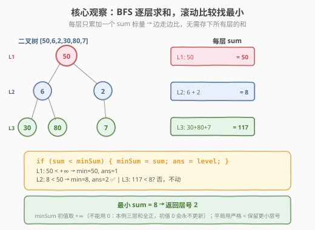
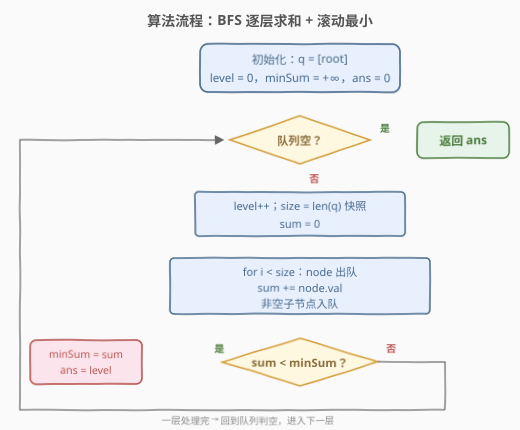
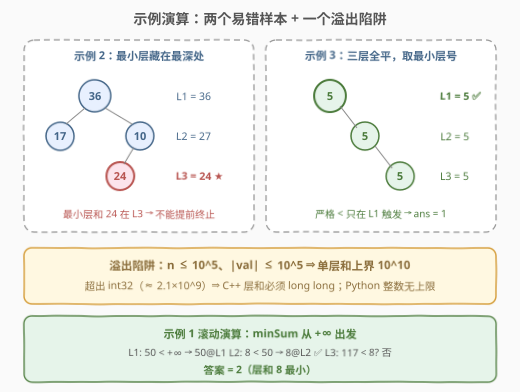

# LeetCode 找到具有最小和的树的层数 题解

## 1. 题目概述

- **标题 / 题号**：找到具有最小和的树的层数（#3157，medium）
- **链接**：https://leetcode.cn/problems/find-the-level-of-tree-with-minimum-sum/
- **难度**：中等
- **标签**：树、二叉树、广度优先搜索（BFS）、深度优先搜索（DFS）

> ⚠️ 本题为 LeetCode 付费题，题意描述根据官方示例用例与 hints 重建，可能与官方题面有出入。

**题意**：给你一棵二叉树的根节点 `root`。设根节点位于二叉树的**第 1 层**，根节点的子节点位于第 2 层，依此类推。返回节点值总和**最小**的那一层的层号 `x`；若有多层的总和相同，返回其中**最小**的层号 `x`。

**示例 1**：

```text
输入：root = [50,6,2,30,80,7]
          50
         /  \
        6    2
       / \  /
      30 80 7
输出：2
解释：第 1 层之和为 50，第 2 层之和为 6 + 2 = 8，第 3 层之和为 30 + 80 + 7 = 117，
层和 8 最小，出现在第 2 层。
```

**示例 2**：

```text
输入：root = [36,17,10,null,null,24]
          36
         /  \
        17   10
            /
           24
输出：3
解释：第 1 层之和为 36，第 2 层之和为 17 + 10 = 27，第 3 层之和为 24，
层和 24 最小，出现在第 3 层。
```

**示例 3**：

```text
输入：root = [5,null,5,null,5]
      5
       \
        5
         \
          5
输出：1
解释：第 1、2、3 层之和均为 5，平局取最小层号，返回 1。
```

**约束条件**（按题意与数据量级重建，具体以官方题面为准）：

- 树中节点数 $n$ 在 $[1, 10^5]$ 范围内
- $-10^5 \le \text{Node.val} \le 10^5$

> 💡 读题三个关键：**① 层号从 1 起，平局取最小层号**——官方 hint「The answer is the first minimum element of sum」明示取**首个**最小值；**② 节点值可正可负**——这决定了初值取 $+\infty$、必须扫完全树、不能被「深层和一定更大」的直觉忽悠；**③ 判题函数签名（按 1161 惯例重建）为 `minimumLevel(root)`**。本题与 [1161. 最大层内元素和](../1101-1200/1161_最大层内元素和.md) 是一组镜像题：max 换 min，其余骨架纹丝不动。

## 2. 解题思路

### 2.1 暴力思路：对每一层重新遍历整棵树

最朴素的写法：先求出树高 $H$，再对 $\ell = 1, \dots, H$ **逐层单独做一次完整遍历**，把 `depth == ℓ` 的节点值加起来，与全局最小比较。每个节点被访问 $H$ 次，总计 $O(n \cdot H)$：宽而浅的树 $H \approx \log n$ 尚可，**链状树 $H = n$ 直接退化成 $O(n^2) = 10^{10}$**——超时。

```text
for ℓ in 1..H:
    sum = 0
    dfs(root, 1)        # 重新遍历整树，累加 depth == ℓ 的节点
    维护最小层和
```

根因是「重复遍历」。退一步的半暴力：DFS/BFS **一遍**把每层和收进数组 `sums`（每节点只访问一次），最后线性扫描取首个最小值——$O(n)$ 能过，但两阶段、要存全部 $L$ 个层和，遍历与决策分离。还有最后一步优化空间：**层和算出来的那一刻就能比较**。

### 2.2 核心观察：BFS 天然按层分批，边走边比



「层」= 到根距离相同的等价类，而 BFS 队列恰好**一层一批**地扩展：复用 [102. 二叉树的层序遍历](../0101-0200/102_二叉树的层序遍历.md) 的 `while + for(size)` 骨架，每层把节点值累加成一个标量 `sum`，轮末与全局最小做一次比较——**边走边比**，全程只需 `minSum`、`ans` 两个标量，无需数组、无需二阶段。

与 1161 放在一起看，本题就是一次「左右翻转」：

| 维度 | 1161 最大层和 | 3157 最小层和 |
|------|--------------|--------------|
| 累计器初值 | $-\infty$（`INT_MIN`） | $+\infty$（`LLONG_MAX` / `inf`） |
| 更新判据 | 严格 `>` | 严格 `<` |
| 平局语义 | 取最小层号 | 取最小层号（不变） |
| 平局实现 | 相等不更新，天然保留更早的层 | 同左，判据方向翻转换成 `<` |
| 层和规模 | $n \le 10^4$，层和 $\le 5 \times 10^8$，`int` 勉强安全 | $n \le 10^5$，层和可达 $10^{10}$，**必须 64 位** |

**三个坑**（均由「值可负 + 取最小」衍生）：

| 坑 | 错误做法 | 后果 | 正确做法 |
|----|---------|------|---------|
| 初值 | `minSum = 0` | 示例 1 三层和 50/8/117 **全为正**，`sum < 0` 永假，`ans` 停在 0 | 初值 $+\infty$，保证第 1 层必更新 |
| 提前终止 | 某层和很小就停 | 节点值可负，层和随深度**毫无单调性**（示例 2 最小层恰是最深层） | 扫完全树 |
| 平局 | `<=` 更新 | 相等时换成更大层号，违反「取最小」 | 严格 `<` 才更新 |

> 💡 **一个漂亮的等价**：把所有节点值取负，3157 就变成 1161——「层和最小的层」恰是「层和取负后最大的层」，连平局语义都严丝合缝（取负不改变相等关系，1161 的严格 `>` 同样保留首个）。理论上把 1161 的代码逐节点取负就能交，但面试还是老实写 min 版，这个对称性留着做 sanity check 更香。

### 2.3 算法流程图



**完整步骤**：

1. **初始化**：队列 `q = [root]`，`level = 0`，`minSum = +∞`，`ans = 0`
2. **while 队列非空**：
   - `level++`（进入新一层）
   - `size = q.size()`（当前层节点数**快照**）
   - `sum = 0`
   - `for i < size`：`node` 出队，`sum += node.val`，非空子节点入队
   - **滚动比较**：`if sum < minSum: minSum = sum; ans = level`（严格 `<`，平局不更新）
3. 队列空时返回 `ans`

### 2.4 示例演算

以示例 1 的树 `[50,6,2,30,80,7]` 逐轮演算：

| 轮次 | level | 队列初始 | size | 出队 / 入队 | sum | 比较与更新 | minSum / ans |
|------|-------|---------|------|------------|-----|-----------|--------------|
| 1 | 1 | [50] | 1 | 出 50 → 入 6, 2 | 50 | `50 < +∞` ✅ | 50 / 1 |
| 2 | 2 | [6, 2] | 2 | 出 6 → 入 30, 80；出 2 → 入 7 | 8 | `8 < 50` ✅ | 8 / 2 |
| 3 | 3 | [30, 80, 7] | 3 | 全出 → ∅ | 117 | `117 < 8`? 否 | 8 / 2（不变） |
| 4 | — | [] | — | 队列空，结束 | — | — | — |

最终 `ans = 2`。



另两个样本各自踩一个坑：

- **示例 2**（`[36,17,10,null,null,24]`）：层和 36 → 27 → 24 **逐层递减**，最小层恰是最深层——即使第 2 层的 27 已经很小，也绝不能提前收工，负值节点随时可能把更深的层拉得更低。
- **示例 3**（`[5,null,5,null,5]`）：三层和全为 5，严格 `<` 只在第 1 层触发一次，`ans` 稳在 1——「平局取最小层号」的天然实现。

## 3. 参考代码

### C++

```cpp
class Solution {
  public:
    int minimumLevel(TreeNode* root) {
        queue<TreeNode*> q;
        q.push(root);

        long long minSum = LLONG_MAX;       // ⭐ +∞：层和可能全为正（不能用 0）
        int ans = 0;
        int level = 0;

        while (!q.empty()) {
            ++level;                        // 进入新一层
            int size = q.size();            // 当前层节点数快照
            long long sum = 0;              // ⭐ 单层和可达 10^10，64 位防溢出
            for (int i = 0; i < size; ++i) {
                TreeNode* node = q.front();
                q.pop();
                sum += node->val;
                if (node->left)  q.push(node->left);
                if (node->right) q.push(node->right);
            }
            if (sum < minSum) {             // ⭐ 严格 <：平局保留更小层号
                minSum = sum;
                ans = level;
            }
        }
        return ans;
    }
};
```

### Python

```python
from collections import deque
from math import inf
from typing import Optional


class Solution:
    def minimumLevel(self, root: Optional[TreeNode]) -> int:
        q = deque([root])

        min_sum = inf                       # ⭐ +∞：层和可能全为正（不能用 0）
        ans = 0
        level = 0

        while q:
            level += 1                      # 进入新一层
            size = len(q)                   # 当前层节点数快照
            total = 0
            for _ in range(size):
                node = q.popleft()
                total += node.val
                if node.left:
                    q.append(node.left)
                if node.right:
                    q.append(node.right)
            if total < min_sum:             # ⭐ 严格 <：平局保留更小层号
                min_sum = total
                ans = level
        return ans
```

> 💡 工程细节：**溢出**是 C++ 唯一阴人的点——$n \le 10^5$ 个节点、$|\text{val}| \le 10^5$，单层和上界 $10^{10}$，超 `int`（$\approx 2.1 \times 10^9$）；`minSum` 初值取 `LLONG_MAX` 后类型自然也是 `long long`，连带 `sum` 一起 64 位，返回值层号 $\le n$ 用 `int` 收即可。Python 整数无上限、`inf` 天然可比，无需操心。

## 4. 复杂度分析

| 维度 | 复杂度 | 说明 |
|------|--------|------|
| 时间复杂度 | $O(n)$ | 每个节点恰好入队/出队 1 次，累加与比较均为 $O(1)$ |
| 空间复杂度 | $O(n)$ | 队列最多存一层节点；满二叉树最宽层 $\approx n/2$ 个节点同时在队 |
| 对照：逐层重扫暴力 | $O(n \cdot H)$ | $H$ 为树高，链状树 $H = n$ 退化 $O(n^2)$ |
| 中间量规模 | $\le 10^{10}$ | 单层和上界 $n \cdot \max|\text{val}|$，超 32 位整型 |

## 5. 扩展：DFS 按层累加（官方 hint 路线）

官方 hint 给的正是 DFS：「Run a DFS on the tree and update an array `sum` where `sum[i]` is the sum for level i. The answer is the first minimum element of sum.」递归时带 `depth`，把 `node.val` 累加到 `sums[depth]`，最后取**首个**最小值：

```python
class Solution:
    def minimumLevel(self, root: Optional[TreeNode]) -> int:
        sums = []

        def dfs(node: Optional[TreeNode], depth: int) -> None:
            if not node:
                return
            if depth == len(sums):          # 首次到达新层，扩容
                sums.append(0)
            sums[depth] += node.val
            dfs(node.left, depth + 1)
            dfs(node.right, depth + 1)

        dfs(root, 0)
        ans, best = 0, inf
        for i, s in enumerate(sums):        # 首个最小值：严格 < 遍历
            if s < best:
                best, ans = s, i + 1        # i 从 0 起，层号从 1 起
        return ans
```

| 维度 | BFS（推荐） | DFS 按层累加 |
|------|------------|-------------|
| 空间 | $O(n)$（队列存一层） | $O(n)$（`sums` 存所有层 + 递归栈 $O(H)$） |
| 是否存全部层 | 否（滚动维护 `minSum`） | 是（累加完再取 argmin） |
| 平局处理 | 严格 `<` 天然取最小层 | 扫描时严格 `<` |
| 深树鲁棒性 | 队列迭代，无栈深问题 | ⚠️ 链状树深度 $10^5$，递归有爆栈风险 |

> ⚠️ **递归深度**是 DFS 路线的实战暗礁：$n = 10^5$ 的链状树深度即 $10^5$，Python 默认递归上限 1000 会直接 `RecursionError`（需 `sys.setrecursionlimit` 或改显式栈），C++ 默认栈深也临界。**数据量到 $10^5$ 时 BFS 是更稳的选择**——这也是本题与 1161（$n \le 10^4$）在工程层面的一个差异。想再省心，还可以用第 2.2 节的取负技巧直接复用 1161 的代码。

## 6. 面试要点

1. **`minSum` 初值为什么不能是 `0`？**

   - 层和可能全为正（如示例 1 的 50/8/117），若初值取 0，`sum < 0` 永远为假，`ans` 停在 0（错误层号）。正确做法：`LLONG_MAX`（C++）或 `inf`（Python），保证第 1 层必定更新。取负值也一样危险——初值 0 在「层和全正」时错、在「层和全负」时也可能取错层，$+\infty$ 才是无条件安全的哨兵。

2. **平局取最小层号，为什么严格 `<` 就够了？**

   - BFS 的 `level` 从 1 严格递增。后续层和**等于** `minSum` 时，`sum < minSum` 为假，不更新——`ans` 停留在更小的层号。若误用 `<=`，相同层和会换成更大层号，违反「取最小」。示例 3（三层全为 5，答案 1）就是专门检验这一点的样本。

3. **为什么不能在某层和很小时提前终止？**

   - 节点值可正可负，层和关于深度**没有任何单调性**：深层的节点可能更多（把和推高）也可能全是负值（把和拉低）。示例 2 的最小层恰是最深层，提前退出必错。与「正权图 BFS 最短路可以首达即停」形成对照——那种剪枝依赖的是非负权单调性，本题不具备。

4. **溢出风险在哪里？**

   - 单层节点数最多约 $\lceil n/2 \rceil = 5 \times 10^4$，每个 $|\text{val}| \le 10^5$，单层和上界 $5 \times 10^9$（全树和上界 $10^{10}$），远超 32 位 `int`。C++ 中 `minSum`、`sum` 必须 `long long`；返回值层号 $\le n \le 10^5$，`int` 足够。Python 无此烦恼。

5. **和 1161 什么关系？DFS 和 BFS 选哪个？**

   - 3157 是 1161 的镜像：max 换 min，初值 $-\infty$ 换 $+\infty$、严格 `>` 换严格 `<`，平局语义不变；也可全体取负直接复用 1161 代码。实现上 BFS 与 DFS 复杂度同为 $O(n)$，但 $n = 10^5$ 的链状树让递归 DFS 有爆栈风险（Python 默认递归上限 1000），BFS 队列迭代天然免疫，且能边走边比、不存层和数组——优先 BFS。

> 💡 **一句话总结**：3157 = 1161 左右翻转——`while + for(size)` 骨架纹丝不动，初值 $-\infty$ 换 $+\infty$、严格 `>` 换严格 `<`；层和上 64 位保险，扫完全树再交卷，平局让严格 `<` 替你保留最小层号。

## 同类练习题

| # | 题目 | 与本题的关联 |
|---|------|-------------|
| 1161 | [最大层内元素和](https://leetcode.cn/problems/maximum-level-sum-of-a-binary-tree/)（[站内题解](../1101-1200/1161_最大层内元素和.md)） | 本题的镜像母题——max→min 只需翻转初值与比较方向，平局语义同取最小层号 |
| 2583 | [二叉树中的第 K 大层和](https://leetcode.cn/problems/kth-largest-sum-in-a-binary-tree/)（[站内题解](../2501-2600/2583_二叉树中的第K大层和.md)） | 同 BFS 层和骨架，把「最值层」推广为「第 k 大层和」，官方相似题推荐 |
| 102 | [二叉树的层序遍历](https://leetcode.cn/problems/binary-tree-level-order-traversal/)（[站内题解](../0101-0200/102_二叉树的层序遍历.md)） | `while + for(size)` 层序骨架的母题，层聚合类问题的公共起点 |
| 1302 | [层数最深叶子节点的和](https://leetcode.cn/problems/deepest-leaves-sum/) | BFS 层聚合的另一种问法——只取最深层之和，练「滚动维护当前层」的手感 |
| 637 | [二叉树的层平均值](https://leetcode.cn/problems/average-of-levels-in-binary-tree/) | 同一套 BFS 模板每层求均值，体会「层内聚合函数」可随意替换 |
