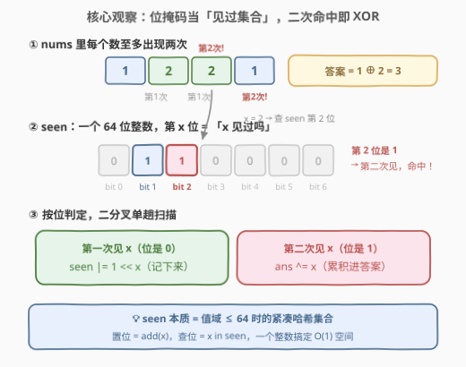
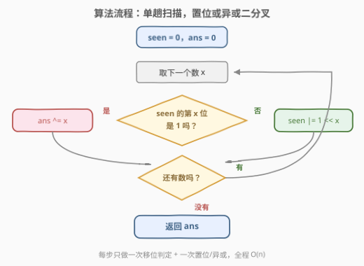

# 求出现两次数字的 XOR 值

- **题目名称**：求出现两次数字的 XOR 值
- **链接**：[3158. 求出现两次数字的 XOR 值](https://leetcode.cn/problems/find-the-xor-of-numbers-which-appear-twice/)
- **难度**：简单
- **标签**：位运算、数组、哈希表

## 1. 题目概述

给你一个数组 `nums`，数组中的数字**要么**出现一次，**要么**出现两次。

请你返回数组中所有出现两次数字的按位 XOR 值，如果没有数字出现过两次，返回 0。

**示例 1**：

```text
输入：nums = [1,2,1,3]
输出：1
解释：nums 中唯一出现过两次的数字是 1。
```

**示例 2**：

```text
输入：nums = [1,2,3]
输出：0
解释：nums 中没有数字出现两次。
```

**示例 3**：

```text
输入：nums = [1,2,2,1]
输出：3
解释：数字 1 和 2 出现过两次。1 XOR 2 == 3。
```

**约束条件**：

- $1 \le nums.length \le 50$
- $1 \le nums[i] \le 50$
- `nums` 中每个数字要么出现过一次，要么出现过两次。

> 💡 读题关键：两处约束信号直接决定解法形态——**① 值域 $1 \sim 50$**：不超过 64，意味着一个整数的位就能当「见过集合」用，位掩码即哈希表；**② 每个数至多出现两次**：只需区分「第一次见 / 第二次见」两个状态，无需维护完整计数，第二次见到即可直接 XOR 进答案。

---

## 2. 解题思路

### 2.1 暴力思路：数出现次数，再挑出出现两次的

最直接的做法是对每个数字 $x$ 扫一遍整个数组统计出现次数，次数为 2 就异或进答案：

```python
ans = 0
for x in nums:
    if nums.count(x) == 2:   # 每次都全量重扫
        ans ^= x
```

时间复杂度 $O(n^2)$，$n \le 50$ 完全能过。稍加改进是用**哈希表计数**（`Counter` / 数组 `cnt[51]`）一遍扫描统计频次，再异或所有频次为 2 的值，时间降到 $O(n)$，但要花 $O(D)$ 空间（$D$ 为值域大小）。

不过本题的两个约束（值域 $\le 50$、至多出现两次）允许我们把哈希表压成一个整数、把计数压成一次位判定。

### 2.2 核心观察：位掩码当「见过集合」，二次命中即 XOR



维护一个整数 `seen` 充当**见过集合**：`seen` 的第 $x$ 位为 1，表示数字 $x$ 之前已经出现过一次。一次扫描 `nums`，对每个 $x$ 判定 `seen` 的第 $x$ 位：

- **第 $x$ 位是 0（第一次见）**：执行 `seen |= 1 << x`，把 $x$ 记下来；
- **第 $x$ 位是 1（第二次见）**：执行 `ans ^= x`，把 $x$ 累积进答案。

![示例演算：nums=[1,2,2,1] 的掩码状态与答案累积](../images/p3158_example_walkthrough.svg)

两个支撑点：

1. **XOR 的基础性质**：$a \oplus a = 0$、$a \oplus 0 = a$，且异或满足交换律结合律——所以「出现两次的数」以**任意顺序**异或进 `ans` 结果都一样，一遍扫描即可；
2. **「至多两次」免清除**：因为每个数至多出现两次，第二次见到时直接 XOR 即可，之后 $x$ 不会再出现，**无需**把 `seen` 的第 $x$ 位清零（若题目允许出现三次以上，才需要额外的状态记录）。

> 💡 `seen` 本质上是一个**值域 $\le 64$ 时的紧凑哈希集合**：置位 = `add(x)`，查位 = `x in seen`。一行位运算替代整个 `HashSet`，空间 $O(1)$。

### 2.3 算法流程图



流程四步：

1. 初始化 `seen = 0`，`ans = 0`；
2. 取下一个数 $x$，判定 `seen >> x & 1`；
3. 为 1 → `ans ^= x`；为 0 → `seen |= 1 << x`；
4. 扫描结束，返回 `ans`。

### 2.4 示例演算

以 `nums = [1,2,2,1]` 为例：

| 步 | 读到 $x$ | `seen` 第 $x$ 位 | 动作 | `seen`（二进制，低位在右） | `ans` |
|----|----------|------------------|------|---------------------------|-------|
| 1 | 1 | 0（没见过） | `seen \|= 1 << 1` | `0b000010` | 0 |
| 2 | 2 | 0（没见过） | `seen \|= 1 << 2` | `0b000110` | 0 |
| 3 | 2 | **1（第二次见）** | `ans ^= 2` | `0b000110` | 2 |
| 4 | 1 | **1（第二次见）** | `ans ^= 1` | `0b000110` | **3** |

返回 $2 \oplus 1 = 3$，与「1 和 2 恰是出现两次的数」一致。示例 2 `[1,2,3]` 中任何位都只被置位一次，全程无命中，`ans` 保持 0。

---

## 3. 参考代码

### C++

```cpp
class Solution {
  public:
    int duplicateNumbersXOR(vector<int>& nums) {
        long long seen = 0;              // 64 位掩码当「见过集合」
        int ans = 0;
        for (int x : nums) {
            if (seen >> x & 1) ans ^= x; // 第二次见到 x，累积进答案
            else seen |= 1LL << x;       // 第一次见到 x，记下来
        }
        return ans;
    }
};
```

### Python

```python
class Solution:
    def duplicateNumbersXOR(self, nums: List[int]) -> int:
        seen = 0                          # 第 x 位 = 1 表示 x 见过一次
        ans = 0
        for x in nums:
            if seen >> x & 1:             # 第二次见：直接 XOR 进答案
                ans ^= x
            else:                         # 第一次见：置位记下
                seen |= 1 << x
        return ans
```

> ⚠️ **C++ 的溢出坑**：$x$ 最大 50，而 `int` 只有 32 位，`1 << x` 在 `x ≥ 31` 时是**未定义行为**（常见表现为移出符号位变负数）。必须写 `1LL << x`，并把 `seen` 声明为 `long long`（或 `uint64_t`）。Python 的整数任意精度，天然无此问题。

---

## 4. 复杂度分析

| 维度 | 复杂度 | 说明 |
|------|--------|------|
| 时间复杂度 | $O(n)$ | 单趟扫描，每个元素一次移位判定 + 一次置位或异或，均为 $O(1)$ |
| 空间复杂度 | $O(1)$ | 仅一个 64 位整数 `seen` 与答案变量，与 $n$、值域无关 |
| 对比暴力 | $O(n^2) \to O(n)$ | 哈希表计数同样 $O(n)$ 时间但需 $O(D)$ 空间；掩码把集合压进一个整数 |

---

## 5. 扩展

### 5.1 另一个位运算妙解：$\bigl(\bigoplus \text{全部}\bigr) \oplus \bigl(\bigoplus \text{去重}\bigr)$

利用 $a \oplus a = 0$ 的**自反性**，还有一条更「数学味」的路：设 $A$ 为所有元素依次异或，$B$ 为**去重后**的不同值依次异或，则答案 $= A \oplus B$。

- 出现**两次**的 $x$：在 $A$ 中 $x \oplus x$ 成对抵消不出现，在 $B$ 中保留一个 $x$ → 异或后留下 $x$；
- 出现**一次**的 $x$：在 $A$、$B$ 中各出现一个 → 恰好抵消为 0。

验证 `[1,2,1,3]`：$A = 1 \oplus 2 \oplus 1 \oplus 3 = 1$，$B = 1 \oplus 2 \oplus 3 = 0$，$A \oplus B = 1$ ✓。

```python
class Solution:
    def duplicateNumbersXOR(self, nums: List[int]) -> int:
        all_xor = uniq_xor = 0
        seen = set()
        for x in nums:
            all_xor ^= x
            if x not in seen:
                seen.add(x)
                uniq_xor ^= x
        return all_xor ^ uniq_xor
```

### 5.2 若值域超过 64？

掩码的前提是**值域不超过整数的位宽**。若 $nums[i]$ 可达 $10^9$，就把 `seen` 换成普通哈希集合 `set`：`x in seen` 则 `ans ^= x`，否则 `seen.add(x)`——逻辑完全同构，位掩码只是值域 $\le 64$ 时它的零开销替身。这也是判断「能否上掩码」的通用标准：**看值域宽度，不看数组长度**。

---

## 6. 面试要点

1. **为什么第二次见到直接 `ans ^= x` 就够，不用清位？**

   - 题目保证每个数**至多出现两次**，第二次即是最后一次，之后 $x$ 不会再被查询；若允许出现 3 次以上，需要区分「一次/两次/三次」多状态，单靠一个置位掩码不够。

2. **C++ 里 `1 << x` 有什么坑？**

   - $x \le 50 > 31$，超出 32 位 `int` 的表示范围，是未定义行为。必须 `1LL << x`（或 `(long long)1 << x`），且 `seen` 用 64 位类型承接。

3. **`seen >> x & 1` 和 `seen & (1 << x)` 有区别吗？**

   - 语义等价，都是取第 $x$ 位。前者右移避免单独构造掩码、写法更短；后者在 C++ 中同样要注意 `1LL`。两者都不会修改 `seen`。

4. **扩展 5.1 的 $A \oplus B$ 为什么成立？**

   - XOR 自反性 $x \oplus x = 0$：出现两次的数在 $A$ 中消掉、在 $B$ 中留一份，$A \oplus B$ 恰好筛出它们；出现一次的数两边各一份，互相抵消。

5. **与 136「只出现一次的数字」是什么关系？**

   - 同一条 $a \oplus a = 0$ 性质的两个方向：136 是「人人两次、唯一个体一次」，用全体异或直接抵消出孤元；本题是「挑出恰好出现两次的个体」，用掩码定位二次出现。136 的解法不能直接搬（出现两次的数全体异或会**互相抵消成 0**），必须借助集合状态区分一/二次。

---

## 7. 同类练习题

- [136. 只出现一次的数字](https://leetcode.cn/problems/single-number/)：XOR 自反性的镜像题——全体异或抵消出「出现一次」的孤元，与本题挑「出现两次」互为对照
- [260. 只出现一次的数字 III](https://leetcode.cn/problems/single-number-iii/)：两个孤元先用全体异或定位差异位、再分组异或，XOR 家族进阶
- [1486. 数组异或操作](https://leetcode.cn/problems/xor-operation-in-an-array/)（[站内题解](../1401-1500/1486_数组异或操作.md)）：纯 XOR 累积的入门热身，熟悉 $a \oplus a = 0$ 的手感
- [2425. 所有数对的异或和](https://leetcode.cn/problems/bitwise-xor-of-all-pairings/)（[站内题解](../2401-2500/2425_所有数对的异或和.md)）：按出现次数的奇偶性决定元素是否留在异或和中，同样考察成对消解
- [268. 丢失的数字](https://leetcode.cn/problems/missing-number/)：用 XOR 抵消在 $0 \sim n$ 中找出缺失的那一个，值域掩码思想也可解
