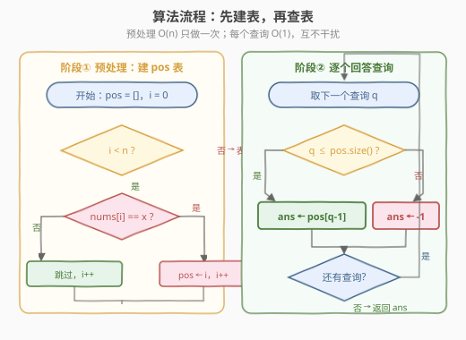
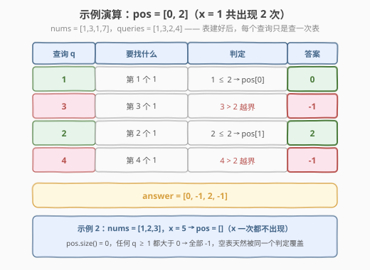

# 查询数组中元素的出现位置

- **题目名称**：查询数组中元素的出现位置
- **链接**：[3159. 查询数组中元素的出现位置](https://leetcode.cn/problems/find-occurrences-of-an-element-in-an-array/)
- **难度**：中等
- **标签**：数组、哈希表

## 1. 题目概述

给你一个整数数组 `nums`、一个整数数组 `queries` 和一个整数 `x`。

对于每个查询 `queries[i]`，你需要找到 `nums` 中**第 `queries[i]` 个 `x`** 的位置，并返回它的**下标**。如果数组中 `x` 的出现次数少于 `queries[i]`，该查询的答案为 `-1`。

请你返回一个整数数组 `answer`，包含所有查询的答案。

**示例 1**：

```text
输入：nums = [1,3,1,7], queries = [1,3,2,4], x = 1
输出：[0,-1,2,-1]
解释：
- 第 1 个查询，第一个 1 出现在下标 0 处。
- 第 2 个查询，nums 中只有两个 1，所以答案为 -1。
- 第 3 个查询，第二个 1 出现在下标 2 处。
- 第 4 个查询，nums 中只有两个 1，所以答案为 -1。
```

**示例 2**：

```text
输入：nums = [1,2,3], queries = [10], x = 5
输出：[-1]
解释：第 1 个查询，nums 中没有 5，所以答案为 -1。
```

**约束条件**：

- $1 \le \text{nums.length}, \text{queries.length} \le 10^5$
- $1 \le \text{queries[i]} \le 10^5$
- $1 \le \text{nums[i]}, x \le 10^4$

> 💡 读题三个关键：**① 查询的是「第几次出现」，不是「值为多少」**——`queries[i]` 是序数（1 起计），答案要的是**下标**；**② `x` 对整批查询固定不变**——这是本题能一次预处理、全体受益的前提；**③ `queries[i]` 的上限（$10^5$）与 `nums` 长度无关**——查询的「第 k 次」可以远超实际出现次数，越界判 `-1` 是必须显式处理的分支，不是可省略的边角。题目数据规模 $n, q \le 10^5$ 已经在明示：$O(n \cdot q)$ 的逐查询重扫过不了，需要**空间换时间**。

---

## 2. 解题思路

### 2.1 暴力思路：每个查询独立重扫一遍

最直觉的写法：对每个查询 `q`，从头扫描 `nums`，数 `x` 出现的次数，数到第 `q` 个就返回当前下标，扫到底还没数够就返回 `-1`：

```text
for q in queries:
    cnt = 0
    for i in 0..n-1:
        if nums[i] == x:
            cnt++
            if cnt == q: answer.append(i); break
    else:
        answer.append(-1)
```

单个查询最坏 $O(n)$，总计 $O(n \cdot q)$——$10^5 \times 10^5 = 10^{10}$，必然超时。

> ⚠️ 「数够就 break」的提前终止救不了它：构造 `nums = [1,1,...,1]`（全为 `x`）+ 所有查询都取大值的样例，几乎每次扫描都要走到底。根因不在「扫描太长」，而在「**重复扫描**」——$q$ 个查询在同一个 `nums` 里数同一个 `x`，每次却都从零开始。

退一步观察：查询之间真正共享的东西是什么？**`x` 的出现位置序列**。它是只读数据 `nums` 的派生品，算一次就够，算 $q$ 次纯属浪费。

### 2.2 核心观察：倒排下标表 pos——第 k 次出现就是 pos[k-1]

![核心概念：一遍扫描收集 x 的下标表，第 k 次出现 = pos[k-1]](../images/p3159_inverted_index_concept.svg)

把 `nums` 里所有**等于 `x`** 的下标按出现顺序收进一张表 `pos`（示例 1 中 `x = 1`，`pos = [0, 2]`），于是：

- **第 1 次**出现 → `pos[0]`，**第 2 次**出现 → `pos[1]`，**第 k 次**出现 → `pos[k-1]`——「第 k 次」是 1-based 序数，数组下标是 0-based，偏移 1 即可；
- `k > pos.size()`（问的次数超过实际出现次数）→ `-1`。

这张 `pos` 表正是**倒排索引（inverted index）的最小形态**：正向是「下标 → 值」，倒过来建「值 → 下标序列」。官方 hint「Compress the array nums and save all the occurrences」说的就是它——把散落在 `nums` 各处的 `x`「压缩」成一张紧凑位置表。因为 `pos` 按**扫描顺序**追加，天然按出现顺序有序，第 k 个元素就是第 k 次出现，无需任何排序。

与几个熟悉套路放在同一坐标系里看：

| 套路 | 预处理产物 | 单次查询 |
|------|-----------|---------|
| [303. 区域和检索](https://leetcode.cn/problems/range-sum-query-immutable/)（[站内题解](../0301-0400/303_区域和检索 - 数组不可变.md)） | 前缀和数组 | $O(1)$ 作差 |
| [398. 随机数索引](https://leetcode.cn/problems/random-pick-index/)（[站内题解](../0301-0400/398_随机数索引.md)） | 目标值下标表 | $O(1)$ 随机取 |
| **3159（本题）** | 目标值 `x` 的下标表 | $O(1)$ 按序取 |
| [2080. 区间内查询数字的频率](https://leetcode.cn/problems/range-frequency-queries/)（[站内题解](../2001-2100/2080_区间内查询数字的频率.md)） | 每个值的下标表 | $O(\log n)$ 二分 |

本质上都是同一句话：**多次查询共用一份只读数据 → 把查询要反复算的东西提前算好**。本题是这个家族里最_plain_的一员——连哈希表都用不上，因为 `x` 只有一个，一条数组足矣。

**两个坑**（都在「序数 → 下标」的转换与边界上）：

| 坑 | 错误做法 | 后果 | 正确做法 |
|----|---------|------|---------|
| 偏移 | 第 k 次取 `pos[k]` | 示例 1 的查询 1 返回 2（串到第二次），查询 2 越界 | 取 `pos[k-1]`，先判界再取值 |
| 判界 | 只写 `pos[q-1]` 靠异常兜底 | C++ 中 `vector` 越界是**未定义行为**（可能 RE 可能错答案），Python 抛 `IndexError` | `q <= pos.size()` 显式分支，超出返回 `-1` |

> 💡 **空表是特例吗？** 不是——`x` 一次都不出现时 `pos = []`，`q ≥ 1 > 0 = pos.size()` 恒成立，自动落入 `-1` 分支。示例 2 不需要任何额外代码，这正是「统一用越界判定收口」的好处。

### 2.3 算法流程图



**完整步骤**：

1. **预处理**：`pos = []`，从左到右扫 `nums`，`nums[i] == x` 就把 `i` 追加进 `pos`——每个元素只看一眼，$O(n)$；
2. **查询**：对每个 `q ∈ queries`：
   - 若 `q ≤ pos.size()`：答案为 `pos[q-1]`；
   - 否则：答案为 `-1`；
3. 返回 `answer`。

两阶段串行，预处理只做一次，每个查询 $O(1)$，互不干扰。

### 2.4 示例演算

以示例 1 逐查询演算（`pos = [0, 2]`，`x` 共出现 2 次）：

| 查询 q | 要找什么 | 判定 | 答案 |
|--------|---------|------|------|
| 1 | 第 1 个 1 | `1 ≤ 2` → `pos[0]` | 0 |
| 3 | 第 3 个 1 | `3 > 2` 越界 | -1 |
| 2 | 第 2 个 1 | `2 ≤ 2` → `pos[1]` | 2 |
| 4 | 第 4 个 1 | `4 > 2` 越界 | -1 |



四个查询一半命中一半越界，恰好把两条分支都练到；示例 2（`pos = []`）则验证空表被同一判定覆盖，全部返回 `-1`。

---

## 3. 参考代码

### C++

```cpp
class Solution {
  public:
    vector<int> occurrencesOfElement(vector<int>& nums, vector<int>& queries, int x) {
        vector<int> pos;                            // x 的出现下标表，按出现顺序有序
        for (int i = 0; i < (int)nums.size(); ++i) {
            if (nums[i] == x) {
                pos.push_back(i);
            }
        }

        vector<int> answer;
        answer.reserve(queries.size());
        for (int q : queries) {
            answer.push_back(q <= (int)pos.size() ? pos[q - 1] : -1);   // ⭐ 先判界，再取 pos[q-1]
        }
        return answer;
    }
};
```

### Python

```python
from typing import List


class Solution:
    def occurrencesOfElement(self, nums: List[int], queries: List[int], x: int) -> List[int]:
        pos = [i for i, v in enumerate(nums) if v == x]          # 一遍扫描建下标表
        return [pos[q - 1] if q <= len(pos) else -1 for q in queries]
```

> 💡 工程细节：C++ 里 `pos.size()` 是无符号 `size_t`，与 `int` 直接比较在 `q` 可能为负时是陷阱（本题 $q \ge 1$ 无碍，但 `(int)pos.size()` 的显式转换是防 muscle memory 的好习惯）；`answer.reserve(queries.size())` 省掉逐个 `push_back` 的扩容搬迁。Python 版是纯粹的「列表推导一行流」——条件表达式**先判界后取值**的顺序不能颠倒，`pos[q - 1]` 若放在 `if` 之前就成了先斩后奏。

---

## 4. 复杂度分析

| 维度 | 复杂度 | 说明 |
|------|--------|------|
| 时间复杂度 | $O(n + q)$ | 预处理扫一遍 `nums` 得 `pos`；每个查询 $O(1)$ 查表，共 $q$ 次 |
| 空间复杂度 | $O(n)$ | `pos` 至多存 $n$ 个下标（`x` 处处出现时最大）；不计返回值 |
| 对照：逐查询重扫暴力 | $O(n \cdot q)$ | $10^{10}$ 量级，超时；提前终止在「全为 x + 大查询」样例下失效 |
| 中间量规模 | $\le n \le 10^5$ | 下标与次数都在 `int` 范围内，无溢出风险 |

---

## 5. 扩展：从「单个 x」到「任意值、可修改」

**推广一：任意值的第 k 次出现查询。** 本题 `x` 固定，一条数组就够了；若查询形如 `(v, k)`——任意值 `v` 的第 `k` 次出现——只需把倒排做全，`unordered_map<int, vector<int>>` 为**每个值**建一张下标表：

```python
pos = defaultdict(list)
for i, v in enumerate(nums):
    pos[v].append(i)
# 查询 (v, k): pos[v][k-1] if k <= len(pos[v]) else -1
```

空间仍是 $O(n)$（所有表加起来恰好每个下标被存一次），这就是官方 hint「save all the occurrences of each element in separate arrays」的完整形态。[2080. 区间内查询数字的频率](https://leetcode.cn/problems/range-frequency-queries/)（[站内题解](../2001-2100/2080_区间内查询数字的频率.md)）再往前一步：查询带区间 `[left, right]` 时，在同一张倒排表上二分区间边界即可数出频次——`bisect_right(pos[v], right) - bisect_left(pos[v], left)`，单查询 $O(\log n)$。

**推广二：`nums` 允许点修改怎么办？** 倒排表是静态结构，修改会破坏它。两条路：

- **每值一个有序集合**（C++ `set<int>` / Java `TreeSet`）：修改 `nums[i]` 时在旧值的集合里 `erase(i)`、新值的集合里 `insert(i)`，各 $O(\log n)$；第 k 次出现用迭代器从 `begin()` 前进 $k-1$ 步，$O(k + \log n)$——查询变贵，换来了修改便宜；
- **值域树状数组**（本题值域 $\le 10^4$ 很小）：树状数组按值维护计数支持「第 k 小」式定位，把「第 k 次出现的下标」改造成「按值域上的名次查询」，修改与查询均 $O(\log V)$。

> 💡 什么场景用什么结构，只看两个变量的相对频率：**查询多、数据不动** → 预处理倒排（本题）；**查询与修改都频繁** → 平衡树/树状数组兜底。

---

## 6. 面试要点

1. **暴力为什么超时？提前终止为什么救不了？**

   - 逐查询重扫是 $O(n \cdot q)$，$n = q = 10^5$ 时 $10^{10}$ 次比较。break 只在「第 k 次出现靠前」时有效；构造全为 `x` 的数组配合大查询，每次扫描仍走满 $n$ 步。根本矛盾是 $q$ 个查询重复计算同一个派生量（`x` 的位置序列），出路是预处理而非剪枝。

2. **为什么不需要哈希表？官方 hint 却提到了哈希？**

   - 本题所有查询只关心一个固定的 `x`，一条 `pos` 数组就是它的完整倒排；哈希表是「任意值查询」才需要的外壳——`map[value] → pos 列表`。面试里答出「单值可退化成裸数组」恰恰说明看清了哈希在这里的职责边界（键的映射），而不是条件反射地套容器。

3. **`pos[q-1]` 的 off-by-one 和越界分别怎么防？**

   - 「第 k 次」是 1-based 序数，`pos` 下标 0-based，取 `pos[k-1]`；判界必须**先于**取值：`q <= pos.size()` 成立才取，否则 `-1`。C++ 中 `vector` 越界是未定义行为而非异常，不能靠「崩了再说」兜底；Python 虽会抛 `IndexError`，但列表推导里的条件表达式同样要求先判界。

4. **空表、`x` 不出现这类边界要单独写吗？**

   - 不用。`pos = []` 时 `pos.size() = 0`，任何 `q ≥ 1` 都满足 `q > 0`，自动走 `-1` 分支——示例 2 无需特判。把所有「查不到」的情形（出现次数不够 / 一次都不出现）统一收口到同一个越界判定，是这类查询题最干净的写法。

5. **如果查询改为「值 v 的第 k 次出现」或「nums 支持修改」，结构怎么演进？**

   - 任意值：`unordered_map<int, vector<int>>` 全量倒排，空间仍 $O(n)$，单查询 $O(1)$；带区间限制则升级为对 `pos[v]` 二分（2080 的做法）。支持点修改：静态数组换成每值一个有序集合（`erase/insert` 各 $O(\log n)$，第 k 名次用迭代器前进）或值域树状数组。一句话总结演进逻辑：**查询模式越花哨、数据越活跃，索引结构就要越动态**。

> 💡 **一句话总结**：多次查询共用只读数据 → 一遍扫描把 `x` 的出现下标压进 `pos` 表（倒排索引最小形态），第 k 次出现就是 `pos[k-1]`，`k` 超表长判 `-1`——$O(n + q)$ 时空双赢，空表与次数不足被同一个判定天然覆盖。

---

## 7. 同类练习题

- [2089. 找出数组排序后的目标下标](https://leetcode.cn/problems/find-target-indices-after-sorting-array/)（[站内题解](../2001-2100/2089_找出数组排序后的目标下标.md)）：收集目标值全部下标的最简版——「下标表」不带序数语义，练建表手感
- [398. 随机数索引](https://leetcode.cn/problems/random-pick-index/)（[站内题解](../0301-0400/398_随机数索引.md)）：同一张目标值下标表，取法从「第 k 个」换成「等概率随机一个」，另有蓄水池抽样的 $O(1)$ 空间进阶
- [2080. 区间内查询数字的频率](https://leetcode.cn/problems/range-frequency-queries/)（[站内题解](../2001-2100/2080_区间内查询数字的频率.md)）：全量倒排 + 有序下标表上二分，把「点查询」推广为「区间计数」
- [303. 区域和检索 - 数组不可变](https://leetcode.cn/problems/range-sum-query-immutable/)（[站内题解](../0301-0400/303_区域和检索 - 数组不可变.md)）：预处理换 $O(1)$ 查询思想的母题——前缀和是「累积量」的预处理，本题是「位置序列」的预处理
- [2942. 查找包含给定字符的单词](https://leetcode.cn/problems/find-words-containing-character/)（[站内题解](../2901-3000/2942_查找包含给定字符的单词.md)）：二维版的下标收集——收集「满足谓词的行号」，谓词从 `值 == x` 换成 `行内含字符 x`
