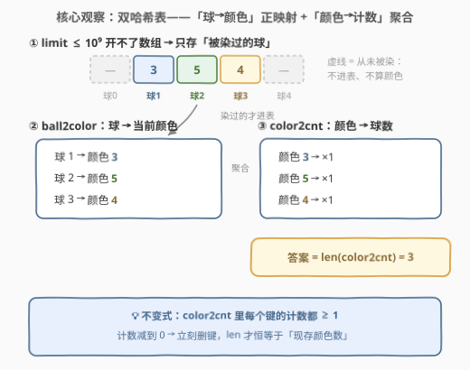
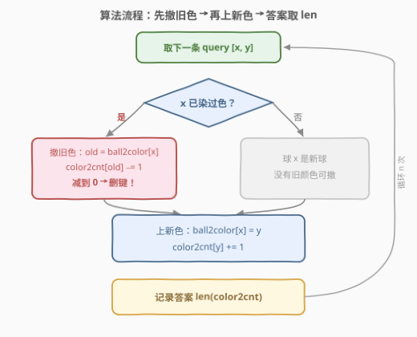
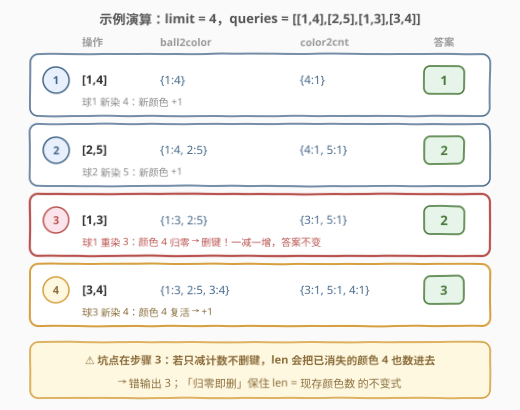

# 所有球里面不同颜色的数目

- **题目名称**：所有球里面不同颜色的数目
- **链接**：[3160. 所有球里面不同颜色的数目](https://leetcode.cn/problems/find-the-number-of-distinct-colors-among-the-balls/)
- **难度**：中等
- **标签**：数组、哈希表、模拟

## 1. 题目概述

给你一个整数 `limit` 和一个大小为 `n x 2` 的二维数组 `queries`。

共有 `limit + 1` 个球，每个球的编号为 `[0, limit]` 中一个**互不相同**的数字。一开始，所有球都没有颜色。`queries` 中每次操作的格式为 `[x, y]`，你需要将球 `x` 染上颜色 `y`。每次操作之后，你需要求出**所有球颜色**的数目。

请你返回一个长度为 `n` 的数组 `result`，其中 `result[i]` 是第 `i` 次操作以后颜色的数目。

**注意**，没有染色的球不算作一种颜色。

**示例 1**：

```text
输入：limit = 4, queries = [[1,4],[2,5],[1,3],[3,4]]
输出：[1,2,2,3]
解释：
- 操作 0 后，球 1 颜色为 4。
- 操作 1 后，球 1 颜色为 4，球 2 颜色为 5。
- 操作 2 后，球 1 颜色为 3，球 2 颜色为 5。   ← 球 1 被「重染」！
- 操作 3 后，球 1 颜色为 3，球 2 颜色为 5，球 3 颜色为 4。
```

**示例 2**：

```text
输入：limit = 4, queries = [[0,1],[1,2],[2,2],[3,4],[4,5]]
输出：[1,2,2,3,4]
解释：操作 2 后球 1 和球 2 同为颜色 2 —— 同色多球只算一种颜色。
```

**约束条件**：

- $1 \le limit \le 10^9$
- $1 \le n = queries.length \le 10^5$
- $queries[i].length = 2$
- $0 \le queries[i][0] \le limit$
- $1 \le queries[i][1] \le 10^9$

> 💡 读题关键：三处信号直接决定解法形态——**① $limit$ 高达 $10^9$**：开不了 `limit+1` 的数组当「球→颜色」表，必须用哈希表，且只存被染过的球；**② 每次操作后都要输出**：共 $n \le 10^5$ 个询问，若每次都全量重数一遍颜色是 $O(n^2)$ 必超时，必须**增量维护**；**③ 操作是「重染」而非「初染」**：同一个球会换颜色，旧颜色的计数要减、减到 0 该颜色要消失。

---

## 2. 解题思路

### 2.1 暴力思路：每次操作后全量重数

最直接的做法：维护「球→颜色」的映射，每次操作后扫描所有**被染过色的球**，把颜色收进集合，输出集合大小：

```python
for x, y in queries:
    ball2color[x] = y
    result.append(len(set(ball2color.values())))
```

单次操作 $O(i)$，总计 $O(n^2) = 10^{10}$，超时。问题出在：**每条操作后答案至多变化 ±1，我们却每次从头重算**。正确姿势是把「不同颜色数」变成随操作**增量更新**的量。

### 2.2 核心观察：双哈希表「正映射 + 反向计数」



维护两张互补的哈希表：

- **`ball2color`**：球编号 → 当前颜色。每个球只有一种当前颜色，天然一对一，重染直接覆盖；
- **`color2cnt`**：颜色 → 当前有多少个球是这个颜色（反向聚合）。

处理每条 `query = [x, y]` 只需三步（**先撤旧、再上新**）：

1. **撤旧**：若球 `x` 已有旧颜色 `old`，则 `color2cnt[old] -= 1`；**若减到 0，立刻删键**——该颜色已无任何球持有，从「现存颜色」中消失；
2. **上新**：`ball2color[x] = y`，`color2cnt[y] += 1`；
3. **作答**：`len(color2cnt)` 即不同颜色数，$O(1)$ 读出。

两个支撑点：

1. **「不同颜色数」= 计数 ≥ 1 的颜色种数**。只要保证 `color2cnt` 里每个键的计数都 ≥ 1（归零即删），`len(color2cnt)` 就恒等于答案——这是整个解法的不变式；
2. **重染同色免特判**：`old == y` 时先 −1 后 +1 恰好抵消，计数回到原值，「先撤后上」的顺序天然鲁棒。

> 💡 官方 hint 提示用「颜色 → 球集合」也能做（增删球、答案 = 非空集合数），但本题只关心「**有几个**球是这个颜色」而非「**是哪几个**球」——用计数替代集合是标准的减重手法（见 5.2）。

### 2.3 算法流程图



流程五步：

1. 取下一条 `query = [x, y]`；
2. 判定 `x` 是否已在 `ball2color` 中；
3. 在 → 撤旧色：计数减 1，归零删键；不在 → 跳过；
4. 上新色：写入正映射，新颜色计数加 1；
5. 记录 `len(color2cnt)`，循环处理下一条。

### 2.4 示例演算

以 `limit = 4, queries = [[1,4],[2,5],[1,3],[3,4]]` 为例：



| 步 | 操作 | ball2color | color2cnt | 答案 |
|----|--------|----------------------|-----------------------------|------|
| 1 | `[1,4]` | `{1:4}` | `{4:1}` | 1 |
| 2 | `[2,5]` | `{1:4, 2:5}` | `{4:1, 5:1}` | 2 |
| 3 | `[1,3]` | `{1:3, 2:5}` | `{3:1, 5:1}`（颜色 4 归零**删键**） | 2 |
| 4 | `[3,4]` | `{1:3, 2:5, 3:4}` | `{3:1, 5:1, 4:1}`（颜色 4 **复活**） | 3 |

两处看点都落在颜色 4 身上：

- **步骤 3**：球 1 从颜色 4 改染 3，颜色 4 计数 $1 \to 0$ 被删，颜色 3 新增——**一减一增，答案不变**。若此处不删键，`len` 会把已消失的颜色 4 也数进去，错输出 3；
- **步骤 4**：球 3 新染颜色 4，之前被删的键**重新插入**——删干净的表才经得起「复活」。

---

## 3. 参考代码

### C++

```cpp
class Solution {
  public:
    vector<int> queryResults(int limit, vector<vector<int>>& queries) {
        unordered_map<int, int> ball2color;   // 球编号 → 当前颜色
        unordered_map<int, int> color2cnt;    // 颜色 → 持有该颜色的球数
        vector<int> ans;
        ans.reserve(queries.size());
        for (const auto& q : queries) {
            int x = q[0], y = q[1];
            auto it = ball2color.find(x);
            if (it != ball2color.end()) {     // 已染过：先撤旧色
                int old = it->second;
                if (--color2cnt[old] == 0)    // 计数归零必须删键
                    color2cnt.erase(old);
            }
            ball2color[x] = y;                // 再上新色
            ++color2cnt[y];
            ans.push_back((int)color2cnt.size());
        }
        return ans;
    }
};
```

### Python

```python
class Solution:
    def queryResults(self, limit: int, queries: List[List[int]]) -> List[int]:
        ball2color = {}   # 球编号 → 当前颜色
        color2cnt = {}    # 颜色 → 持有该颜色的球数
        ans = []
        for x, y in queries:
            if x in ball2color:               # 已染过：先撤旧色
                old = ball2color[x]
                color2cnt[old] -= 1
                if color2cnt[old] == 0:       # 计数归零必须删键
                    del color2cnt[old]
            ball2color[x] = y                 # 再上新色
            color2cnt[y] = color2cnt.get(y, 0) + 1
            ans.append(len(color2cnt))
        return ans
```

> ⚠️ **`limit` 参数全程没用到**：球编号范围只用于约束输入合法，解法只依赖「被操作过的球」。这正是哈希表对 $10^9$ 值域的胜利——空间与值域无关，只与操作数 $n$ 有关。

---

## 4. 复杂度分析

| 维度 | 复杂度 | 说明 |
|------|--------|------|
| 时间复杂度 | $O(n)$ | 每条操作常数次哈希查改删，`size()` 为 $O(1)$ |
| 空间复杂度 | $O(n)$ | 至多 $n$ 个球被染色、$n$ 种颜色进表，与 $limit$ 无关 |
| 对比暴力 | $O(n^2) \to O(n)$ | 全量重数 → 增量维护「归零即删」的计数表 |

---

## 5. 扩展

### 5.1 同一套双表还能答什么？

- **「恰好出现一次的颜色数」**：在 `color2cnt` 之上再叠一层 `freq2kinds`（计数 → 该计数的颜色种数），每次增删颜色时同步搬桶，$O(1)$ 查询——[2671. 频率跟踪器](https://leetcode.cn/problems/frequency-tracker/) 就是这个三层结构；
- **「被染色过的球数」**：`len(ball2color)` 直接读出；
- **「出现次数最多的颜色」**：需要维护最值，单纯计数不够时上桶（按计数分桶，同 460 LFU 的频率桶）。

### 5.2 为什么用「颜色 → 计数」而不是「颜色 → 球集合」？

`unordered_map<int, unordered_set<int>>` 也能过：删球加球，答案 = 非空集合个数。但当查询只问「**有几个**」而不问「**是谁**」时，集合是超额维护——`int` 的加减替代集合的哈希增删，常数小一个量级。判断标准很简单：**看问题真正需要的查询，数据结构只为它服务**（对照 146 LRU 用双向链表只为 $O(1)$ 摘除节点）。

---

## 6. 面试要点

1. **为什么不能开数组 `color[limit+1]`？**

   - $limit \le 10^9$，数组要数 GB 内存。哈希表只存被操作过的球，至多 $n = 10^5$ 个键，空间与值域脱钩。

2. **计数减到 0 为什么必须删键？**

   - 答案 $= len(color2cnt)$ 依赖不变式「表中每个键计数 ≥ 1」。不删键的话，已消失的颜色会被一直数进去——示例 1 的操作 2 会错输出 3。不想删键也可改为单独维护变量 `distinct` 手动加减，但删键写法最简洁不易错。

3. **重染同一个球同一种颜色（`old == y`）会出错吗？**

   - 不会。「先撤后上」的顺序下，旧色 −1 与新色 +1 恰好抵消，计数与 `len` 均回到原值，无需任何特判。

4. **每条操作都调 `len(color2cnt)`，真的是 $O(1)$ 吗？**

   - 是。`unordered_map::size()` 与 `len(dict)` 都只读内部维护的元素计数器，不遍历桶。

5. **这题与 2671 频率跟踪器是什么关系？**

   - 同一「正向映射 + 反向频率」双表范式：本题是 球→颜色 + 颜色→计数；2671 是 值→频率 + 频率→个数，且要支持按频率查询，多一层桶。掌握本题后 2671 只是再加一层。

---

## 7. 同类练习题

- [2671. 频率跟踪器](https://leetcode.cn/problems/frequency-tracker/)（[站内题解](../2601-2700/2671_频率跟踪器.md)）：同款「正向映射 + 反向频率表」双表范式，增删时同步搬运
- [146. LRU 缓存](https://leetcode.cn/problems/lru-cache/)（[站内题解](../0101-0200/146_LRU缓存.md)）：哈希 + 双向链表实现 $O(1)$ 摘除，数据结构只为查询服务的典范
- [460. LFU 缓存](https://leetcode.cn/problems/lfu-cache/)（[站内题解](../0401-0500/460_LFU缓存.md)）：频率计数归零即删的桶式设计，与本题「删键时机」呼应
- [692. 前 K 个高频单词](https://leetcode.cn/problems/top-k-frequent-words/)（[站内题解](../0601-0700/692_前K个高频单词.md)）：频率表的消费端——Top-K 查询怎么接在计数表之后
- [219. 存在重复元素 II](https://leetcode.cn/problems/contains-duplicate-ii/)（[站内题解](../0201-0300/219_存在重复元素II.md)）：哈希表维护「最近出现位置」的另一类在线查询热身
