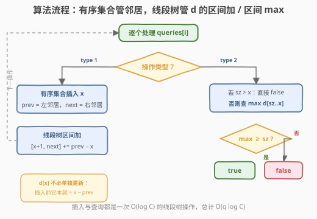
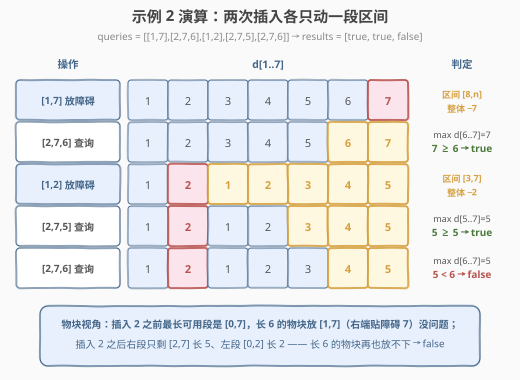

# LeetCode 物块放置查询 题解

## 1. 题目概述

- **标题 / 题号**：物块放置查询（#3161，hard）
- **链接**：https://leetcode.cn/problems/block-placement-queries/
- **难度**：困难
- **标签**：线段树、树状数组、数组、二分查找、有序集合

**题意**：有一条无限长的数轴，原点在 `0` 处，沿 x 轴**正**方向无限延伸。给你一个二维数组 `queries`，包含两种操作：

1. **操作类型 1**：`queries[i] = [1, x]`。在距离原点 `x` 处建一个障碍物。数据保证执行时位置 `x` 处**没有**任何障碍物。
2. **操作类型 2**：`queries[i] = [2, x, sz]`。判断在数轴范围 `[0, x]` 内是否可以放置一个长度为 `sz` 的物块，物块需要**完全**放置在 `[0, x]` 内。如果物块与任何障碍物重合则**不能**放置，但物块可以与障碍物**恰好接触**。查询相互独立——只是判断，并不真的放置。

返回 boolean 数组 `results`，第 `i` 个操作类型 2 能放置则为 `true`，否则为 `false`。

**示例 1**：

```text
输入：queries = [[1,2],[2,3,3],[2,3,1],[2,2,2]]
输出：[false,true,true]
解释：查询 0 在 x = 2 处放置障碍物。此后 [0,2] 段最长只能放长 2 的物块。
[2,3,3]：间隙 [2,3] 长 1，放不下长 3 → false；[2,3,1] 与 [2,2,2] 都放得下 → true。
```

**示例 2**：

```text
输入：queries = [[1,7],[2,7,6],[1,2],[2,7,5],[2,7,6]]
输出：[true,true,false]
解释：先放障碍 7，[0,7] 长 7 放得下 6；再放障碍 2，右段 [2,7] 只剩长 5：
放长 5 可以（占 [2,7]），放长 6 不行 → false。
```

**约束**：

- $1 \le \text{queries.length} \le 15 \times 10^4$
- $1 \le x, sz \le \min(5 \times 10^4,\ 3 \times \text{queries.length})$
- 输入保证操作 1 的 `x` 处不会有障碍物；至少有一个操作 2

> 💡 读题三个关键：**① 操作 2 只是查询、不真放置，且各查询相互独立**——不能把「上次放过的物块」记忆下来帮忙，每次判定都基于当前障碍集合；**② 「恰好接触」合法**——物块占 $[p, p+sz]$，只要求**开区间** $(p, p+sz)$ 内无障碍，两端点 $p$ 与 $p+sz$ 处都可以贴着障碍（或贴着原点 0）；**③ 值域与查询数同阶**——$x, sz \le \min(5\times10^4,\ 3q)$，障碍至多 $q$ 个，单次 $O(\log C)$ 的动态维护是出题人预留的复杂度甜区。

## 2. 解题思路

### 2.1 暴力思路：每个查询重算一遍最大间隙

最直觉的写法：操作 1 把 `x` 记进障碍集合；操作 2 把当前障碍排序，扫出所有间隙——`[0, 首障碍]`、相邻障碍之间、`[末障碍, x]`——只要存在一段长度 $\ge sz$ 且左端点 $+ sz \le x$ 的间隙就返回 `true`。

单次查询 $O(k \log k)$（$k$ 为当前障碍数），总计 $O(q^2 \log q)$——$q = 1.5\times10^5$ 时约 $10^{11}$，必然超时。

> ⚠️ 「维护一个有序障碍集合 + 每次只扫间隙」救不了它：障碍可以稠密到 $k = q$，每次查询仍要**遍历全部间隙**取最大值。根子在于「能放 $\Leftrightarrow$ 某个区间统计量 $\ge sz$」这个判定被反复地从零计算——需要的是一个能**动态维护区间最大值**的结构。

退一步想：查询真正反复用到的量是什么？是「以每个位置 $j$ 为右端点，往左最多能伸多远而不碰障碍」。把这个量在线维护好，查询就只剩一次区间最大值。

### 2.2 核心观察：d[j] = j − prev(j)，插入障碍 = 一次区间加

![核心概念：d[j] = j − prev(j) 表示以 j 为右端点的最长无障碍物块](../images/p3161_gap_d_concept.svg)

定义 $prev(j)$ 为**严格小于** $j$ 的最大障碍物位置；若左侧没有障碍物，取 $0$（原点是天然的「虚拟左墙」）。令

$$d[j] = j - prev(j)$$

它的几何含义：**以 $j$ 为右端点、内部不含障碍的物块最大长度**（右端贴到 $j$，左端最远伸到 $prev(j)$）。

**引理**：查询 $[2, x, sz]$ 的答案为 `true` $\Leftrightarrow$ $\max_{j \in [sz,\, x]} d[j] \ge sz$。

- **必要性**：若物块放在 $[p,\, p+sz] \subseteq [0, x]$，取 $j = p + sz \le x$。开区间 $(p, p+sz)$ 无障碍且 $j \ge sz$，故 $prev(j) \le p$，$d[j] = j - prev(j) \ge p + sz - p = sz$。
- **充分性**：若某 $j \in [sz, x]$ 满足 $d[j] \ge sz$，则 $prev(j) \le j - sz$。把物块放在 $[prev(j),\, prev(j)+sz]$：左端是障碍物或原点 0（接触合法），右端 $\le j \le x$，内部落在 $(prev(j),\, j]$ 内——这段本无障碍，放得下。

于是查询只需**区间最大值**。剩下的问题是：插入障碍物时 $d$ 如何变化？

![插入障碍 x：区间 (x, next] 上 d 整体减 (x − prev)](../images/p3161_insert_range_update.svg)

设新障碍落在间隙 $(p,\ n_2)$ 内（$p = prev(x)$，$n_2 = next(x)$ 为插入前的左右邻居）：

- $(p,\, x]$ 内的位置左侧邻居不变，$d$ **不动**——特别地 $d[x] = x - p$ 插入前后一致，无需单独更新；
- $(x,\, n_2]$ 内的位置，$prev$ 从 $p$ **统一换成** $x$，即 $d[j]$ 全部减少同一个数 $(x - p)$——注意**上界取到 $n_2$ 本身**：障碍 $n_2$ 自己的左邻居也变成了 $x$；若 $x$ 右侧没有障碍，则一直影响到坐标上界 $C$。

一段下标同时加减同一个常数，这正是**线段树的区间加**！搭配引理里的区间 $\max$ 查询，两种操作各只需 $O(\log C)$。障碍的左右邻居用**有序集合**维护（C++ `set` / Python `SortedList`），插入与定位均 $O(\log q)$。

> 💡 **为什么不用树状数组？** 树状数组擅长「单点加 + 前缀和/前缀 max」，而这里的更新是**区间加**、查询是**区间 max**，两者都不满足可减性/可拼接性，懒标记线段树才是对口的工具。**为什么不在平衡树里存间隙长度？** 查询带着「右端 $\le x$」的约束，最大间隙可能位于 $x$ 右侧，纯按长度排序会答错——必须按下标建线段树，让「位置 $\le x$」这个约束天然由区间边界表达。

**三个坑**（全在边界上）：

| 坑 | 错误做法 | 后果 | 正确做法 |
|----|---------|------|---------|
| 区间右端 | 更新 $(x,\ n_2)$ 漏掉 $n_2$ | $d[n_2]$ 虚大 → 把放不下的判成 `true`（假阳性） | 上界**含** $next(x)$，即更新 $[x+1,\ next(x)]$ |
| 左端哨兵 | $prev$ 无障碍时取「不存在」 | 首段的 $d$ 全错 | 有序集合初始放入哨兵 `0`，$prev$ 永远存在 |
| $sz > x$ | 直接查 $\max d[sz..x]$ | 空区间被当成 `true` | 先判 `sz <= x`，否则 `false`（题目不保证 $sz \le x$） |

### 2.3 算法流程图



**完整步骤**：

1. **初始化**：坐标上界 $C = \max(\text{所有 } x)$；线段树 build，叶子 $d[i] = i$（初始无障碍，一切以 0 为左墙）；有序集合 `obs = {0}` 放入哨兵；
2. **操作 `[1, x]`**：`obs` 插入 `x`，取 `prev`（左邻居）与 `next`（右邻居，无则取 $C$）；线段树对 $[x+1,\ \text{next}]$ 区间加 $(\text{prev} - x)$；
3. **操作 `[2, x, sz]`**：若 `sz > x` 直接 `false`；否则答案为 `query_max(sz, x) >= sz`。

每步插入/查询都是一次线段树操作，总计 $O(q \log C)$。

### 2.4 示例演算



以示例 2 走全流程（$C = 7$，初始 $d = [0,1,2,3,4,5,6,7]$）：

| 操作 | 线段树动作 | $d[1..7]$ | 判定 |
|------|-----------|-----------|------|
| `[1,7]` | 插入 7，$prev=0$，无右邻居 → $[8,7]$ 空，实际不动 $[1..7]$ | 1,2,3,4,5,6,**7** | — |
| `[2,7,6]` | 查 $\max d[6..7] = 7$ | 1,2,3,4,5,**6**,**7** | $7 \ge 6$ → **true** |
| `[1,2]` | 插入 2，$prev=0$，$next=7$ → $[3,7]$ 区间加 $-2$ | 1,**2**,1,2,3,4,**5** | — |
| `[2,7,5]` | 查 $\max d[5..7] = 5$ | 1,**2**,1,2,**3**,**4**,**5** | $5 \ge 5$ → **true** |
| `[2,7,6]` | 查 $\max d[6..7] = 5$ | 1,**2**,1,2,3,**4**,**5** | $5 < 6$ → **false** |

返回 `[true, true, false]`，与官方一致。注意第一次插入 `[1,7]` 时右邻居不存在，受影响区间 $[8, C]$ 为空——**首障碍插到最右侧时 $d[1..C]$ 本来就以 0 为墙，无需任何更新**，这与「$d[x]$ 插入前后不变」是同一件事的两面。

## 3. 参考代码

### C++

```cpp
class Solution {
    int n;
    vector<long long> mx, lz;                  // 区间加 + 区间 max 懒标记线段树

    void apply(int p, long long v) { mx[p] += v; lz[p] += v; }
    void push_up(int p) { mx[p] = max(mx[p << 1], mx[p << 1 | 1]); }
    void push_down(int p) {
        if (lz[p]) { apply(p << 1, lz[p]); apply(p << 1 | 1, lz[p]); lz[p] = 0; }
    }
    void build(int p, int l, int r) {          // 叶子 d[i] = i：初始一切以 0 为左墙
        if (l == r) { mx[p] = l; return; }
        int m = (l + r) >> 1;
        build(p << 1, l, m); build(p << 1 | 1, m + 1, r);
        push_up(p);
    }
    void add(int p, int l, int r, int ql, int qr, long long v) {
        if (ql <= l && r <= qr) { apply(p, v); return; }
        push_down(p);
        int m = (l + r) >> 1;
        if (ql <= m) add(p << 1, l, m, ql, qr, v);
        if (qr > m) add(p << 1 | 1, m + 1, r, ql, qr, v);
        push_up(p);
    }
    long long query(int p, int l, int r, int ql, int qr) {
        if (ql <= l && r <= qr) return mx[p];
        push_down(p);
        int m = (l + r) >> 1;
        long long res = LLONG_MIN;
        if (ql <= m) res = max(res, query(p << 1, l, m, ql, qr));
        if (qr > m) res = max(res, query(p << 1 | 1, m + 1, r, ql, qr));
        return res;
    }

  public:
    vector<bool> getResults(vector<vector<int>>& queries) {
        int n = 0;
        for (auto& q : queries) n = max(n, q[1]);        // 值域只开到 max(x) 即可
        this->n = n;
        mx.assign(4 * (n + 1), 0);
        lz.assign(4 * (n + 1), 0);
        build(1, 0, n);

        set<int> obs{{0}};                               // ⭐ 哨兵 0：保证 prev 永远存在
        vector<bool> ans;
        for (auto& q : queries) {
            int x = q[1];
            if (q[0] == 1) {
                auto it = obs.insert(x).first;
                int p = *prev(it);                       // 左邻居（含哨兵 0）
                auto nit = next(it);
                int r = (nit == obs.end()) ? n : *nit;   // 右邻居，无则到坐标上界
                if (x + 1 <= r) add(1, 0, n, x + 1, r, p - x);   // ⭐ 上界含 next 自己
            } else {
                int sz = q[2];
                ans.push_back(sz <= x && query(1, 0, n, sz, x) >= sz);  // ⭐ sz>x 先判 false
            }
        }
        return ans;
    }
};
```

### Python

```python
from sortedcontainers import SortedList


class Solution:
    def getResults(self, queries: List[List[int]]) -> List[bool]:
        n = max(q[1] for q in queries)          # 值域只开到 max(x)
        N = 1
        while N <= n:                           # 迭代线段树（zkw），叶子 N+i 对应 d[i]
            N <<= 1
        mx = [0] * (2 * N)
        tag = [0] * (2 * N)
        for i in range(n + 1):
            mx[N + i] = i                       # 初始 d[i] = i，一切以 0 为左墙
        for p in range(N - 1, 0, -1):
            mx[p] = max(mx[2 * p], mx[2 * p + 1])

        def update(l, r, v):                    # [l, r] 区间加 v
            if l > r:
                return
            l += N; r += N + 1
            l0, r0 = l, r - 1
            while l < r:
                if l & 1: mx[l] += v; tag[l] += v; l += 1
                if r & 1: r -= 1; mx[r] += v; tag[r] += v
                l >>= 1; r >>= 1
            x = l0 >> 1                         # 两侧边界自底向上重算 max
            while x:
                mx[x] = max(mx[2 * x], mx[2 * x + 1]) + tag[x]
                x >>= 1
            x = r0 >> 1
            while x:
                mx[x] = max(mx[2 * x], mx[2 * x + 1]) + tag[x]
                x >>= 1

        def query(l, r):                        # max d[l..r]
            if l > r:
                return -1
            l += N; r += N + 1
            for side in (l >> 1, (r - 1) >> 1): # 先 push down 两条边界路径
                stack = []
                x = side
                while x:
                    stack.append(x); x >>= 1
                for x in reversed(stack):
                    if tag[x]:
                        for c in (2 * x, 2 * x + 1):
                            tag[c] += tag[x]; mx[c] += tag[x]
                        tag[x] = 0
            res = -1
            while l < r:
                if l & 1: res = max(res, mx[l]); l += 1
                if r & 1: r -= 1; res = max(res, mx[r])
                l >>= 1; r >>= 1
            return res

        obs = SortedList([0])                   # ⭐ 哨兵 0
        ans = []
        for q in queries:
            x = q[1]
            if q[0] == 1:
                obs.add(x)
                i = obs.index(x)
                prev = obs[i - 1]
                nxt = obs[i + 1] if i + 1 < len(obs) else n
                update(x + 1, min(nxt, n), prev - x)    # ⭐ 上界含 next 自己
            else:
                sz = q[2]
                ans.append(sz <= x and query(sz, x) >= sz)  # ⭐ sz > x 先判 false
        return ans
```

> 💡 工程细节：C++ 的 `set` 初始写入 `{{0}}` 放哨兵，`prev(it)`/`next(it)` 拿邻居各 $O(\log q)$；Python 选迭代式 zkw 线段树而非递归——$q = 1.5 \times 10^5$ 时递归版约数百万次函数调用，迭代版省去调用开销更稳；`min(nxt, n)` 在本题坐标界内是冗余保险，真正不可省的是「`nxt` 不存在时取 `n`」。

## 4. 复杂度分析

| 维度 | 复杂度 | 说明 |
|------|--------|------|
| 时间复杂度 | $O(q \log C)$ | $C = \max(x) \le \min(5\times10^4,\ 3q)$；每个操作一次有序集合定位 $O(\log q)$ + 一次线段树操作 $O(\log C)$ |
| 空间复杂度 | $O(C)$ | 线段树 $4C$ 级别数组 + 有序集合 $O(q)$；$C \le 5\times10^4$ 可全量开辟，无需动态开点 |
| 对照：逐查询扫间隙暴力 | $O(q^2 \log q)$ | 障碍稠密时每次查询遍历全部间隙，$10^{11}$ 量级超时 |
| 中间量规模 | $\le 5\times10^4$ | $d[j] \le C < 2^{31}$，`long long` 属于防御性写法，`int` 亦不溢出 |

## 5. 扩展：三个变体与对应结构升级

**变体一：没有 `sortedcontainers` 怎么办（Python）？** 障碍集合的邻居查询可以离线「时间倒流」实现：先把**所有**操作 1 的坐标收集排序得到静态数组，倒序处理（插入变删除），用两个方向的**并查集**分别跳过已删除的坐标来找存活邻居——路径压缩后近似 $O(\alpha(q))$，整题退化成「数组 + 并查集 + 线段树」，零第三方依赖。核心洞察是：**在线插入的邻居查询，与离线删除的邻居查询，信息量等价**。

**变体二：值域大到不能开数组（如 $x \le 10^9$）怎么办？** 两条路——**离散化**（只有操作 1 的坐标与查询的 $x$、$x - sz$ 这些「关键点」可能成为边界，排序去重后压到 $O(q)$ 个）或**动态开点线段树**（按需建节点，空间 $O(q \log V)$）。注意离散化时 $d[j]$ 的语义要保持「区间内真实长度」，段长不再是 1。

**变体三：物块放置后**永久占位**（查询变修改）怎么办？** 物块本质上成了「自己搭的障碍」——同样 insert 进有序集合、同样区间加，算法框架完全不变；若物块可撤回，还需要线段树支持可持久化或离线倒序。这也是 [699. 掉落的方块](https://leetcode.cn/problems/falling-squares/)（[站内题解](../0601-0700/699_掉落的方块.md)）的考点：区间更新 + 查询历史最大高度的组合拳。

> 💡 **一句话总结**：把「能否放置」翻译成 $d[j] = j - prev(j)$ 的区间最大值，把「插入障碍」翻译成 $(x,\ next(x)]$ 上的一次区间加——**有序集合管邻居、懒标记线段树管 $d$**，两种操作全部压进 $O(\log)$。

## 6. 面试要点

1. **为什么定义 $d[j] = j - prev(j)$ 而不是直接维护「间隙长度」集合？**

   - 间隙集合（按长度排序的 multiset）回答的是「全局最大间隙」，但查询带**右端 $\le x$** 的约束——最大间隙可能整个落在 $x$ 右侧。$d[j]$ 把「间隙」按下标**摊平成数组**：「右端 $\le x$ 的最大可用长度」变成区间 $\max d[sz..x]$，位置约束由区间边界自然表达，这才是能与线段树对口的形态。

2. **插入障碍时，$d$ 的更新区间为什么是 $(x,\ next(x)]$ 而不是 $(x,\ next(x))$？**

   - $next(x)$ 处的障碍物自己的左邻居也换成了 $x$：$d[next] = next - x$ 必须被压低。漏掉它会让 $d[next]$ 停留在 $next - prev$ 的旧值（偏大），后续查询把放不下的物块误判成能放——**假阳性**，比假阴性更难在测试里暴露。同时注意 $d[x]$ 本身不用动：插入前它已经等于 $x - prev$。

3. **引理的两头分别怎么证？为什么查询区间是 $[sz,\ x]$ 而不是 $[0,\ x]$？**

   - 能放 $\Rightarrow$ 取物块右端 $j = p + sz$，开区间无障碍保证 $prev(j) \le p$，得 $d[j] \ge sz$；$\Leftarrow$ 由 $d[j] \ge sz$ 反解出落点 $[prev(j),\ prev(j)+sz]$。下界取 $sz$ 是因为 $d[j] \ge sz$ 蕴含 $j \ge sz$（$prev \ge 0$），$[0, sz)$ 内的 $d$ 值不可能 $\ge sz$，取不取不影响正确性，但语义上「右端点至少是 $sz$」更自洽；`sz > x` 时区间为空必须显式判 `false`。

4. **哨兵 0 起什么作用？去掉会怎样？**

   - 0 是「虚拟左墙」：首段 $[0, \text{首障碍}]$ 的可用长度正是靠 $prev = 0$ 表达的（$d[\text{首障碍}] = \text{首障碍}$）。去掉哨兵后首段的 $d$ 会按「左侧无障碍」错误处理，且每次取 $prev$ 都要判空分支——一个哨兵同时消掉两类特判，与 [42. 接雨水](https://leetcode.cn/problems/trapping-rain-water/)（[站内题解](../0001-0100/42_接雨水.md)）里「边界先入栈/入单调栈」是同一手法。

5. **这题的线段树为什么必须带懒标记？树状数组真不行吗？**

   - 更新是**区间加**（一段 $prev$ 同时换人），查询是**区间 max**——$\max$ 不可减、区间加无法拆成两个前缀操作，树状数组的「前缀性」假设双双失效。懒标记线段树把「标记可叠加（加法）+ 信息可合并（max）」两点用满：`apply` 时 `mx += v, lz += v`，`push_down` 时下传即可，是区间加/区间 max 的标准模板，值得当作手写件背熟。

## 同类练习题

| # | 题目 | 与本题的关联 |
|---|------|-------------|
| 699 | [掉落的方块](https://leetcode.cn/problems/falling-squares/)（[站内题解](../0601-0700/699_掉落的方块.md)） | 同为「物块 + 障碍」的区间世界——掉落方块叠高是区间更新 + 查询历史最大高度，练「计数/最值类懒标记」的另一种形态 |
| 715 | [Range 模块](https://leetcode.cn/problems/range-module/)（[站内题解](../0701-0800/715_Range模块.md)） | 区间跟踪的三件套操作（add/remove/query）全用线段树表达，理解「区间布尔状态如何上拉合并」 |
| 729 | [我的日程安排表 I](https://leetcode.cn/problems/my-calendar-i/)（[站内题解](../0701-0800/729_我的日程安排表I.md)） | 有序集合判区间重叠的入门版——本题「找 prev/next 邻居」的手感来源 |
| 352 | [将数据流变为多个不相交区间](https://leetcode.cn/problems/data-stream-as-disjoint-intervals/)（[站内题解](../0301-0400/352_将数据流变为多个不相交区间.md)） | 动态插入点 + 维护相邻区间合并，「新点落进哪个间隙」的邻居操作与本题如出一辙 |
| 307 | [区域和检索 - 数组可变](https://leetcode.cn/problems/range-sum-query-mutable/)（[站内题解](../0301-0400/307_区域和检索 - 数组可变.md)） | 带修改的区间查询母题——先会点更新 + 区间和，再升级到本题的区间加 + 区间 max |
