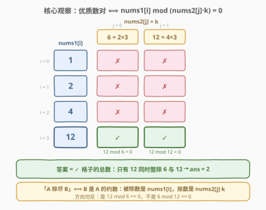
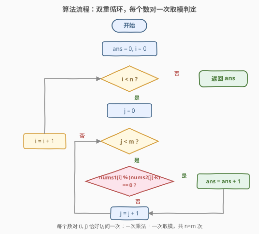
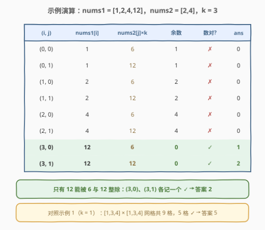

# 优质数对的总数 I

- **题目名称**：优质数对的总数 I
- **链接**：[3162. 优质数对的总数 I](https://leetcode.cn/problems/find-the-number-of-good-pairs-i/)
- **难度**：简单
- **标签**：数组、哈希表、枚举

## 1. 题目概述

给你两个整数数组 `nums1` 和 `nums2`，长度分别为 `n` 和 `m`。同时给你一个**正整数** `k`。

如果 `nums1[i]` 可以除尽 `nums2[j] * k`，则称数对 `(i, j)` 为 **优质数对**（`0 <= i <= n - 1`，`0 <= j <= m - 1`）。

返回**优质数对**的总数。

**示例 1**：

```text
输入：nums1 = [1,3,4], nums2 = [1,3,4], k = 1
输出：5
解释：5 个优质数对分别是 (0, 0), (1, 0), (1, 1), (2, 0) 和 (2, 2)。
```

**示例 2**：

```text
输入：nums1 = [1,2,4,12], nums2 = [2,4], k = 3
输出：2
解释：2 个优质数对分别是 (3, 0) 和 (3, 1)。
```

**约束条件**：

- $1 \le n, m \le 50$
- $1 \le nums_1[i], nums_2[j] \le 50$
- $1 \le k \le 50$

> 💡 读题关键：「`nums1[i]` 可以除尽 `nums2[j] * k`」即 $nums_2[j] \cdot k$ 是 $nums_1[i]$ 的**约数**，写成代码就是 `nums1[i] % (nums2[j] * k) == 0`——**被除数是 `nums1[i]`**，方向搞反整道题就全错。另外注意数对按**下标**计（值相同、下标不同算不同数对），且 $n \cdot m \le 2500$，规模极小。

---

## 2. 解题思路

### 2.1 暴力思路：双重循环逐对检查

$n, m \le 50$ 意味着数对总数 $n \cdot m \le 2500$，每个数对只需一次取模判定——双重循环 $O(nm)$ 就是本题的**预期解**（官方 hint 也直说 "The constraints are small. Check all pairs."）。

这是「**数据范围即算法提示**」的典型例子：乘积规模在 $10^4$ 以下时，先老老实实枚举，别急着优化。真正要想清楚的反而是判定条件本身：

- **方向**：是 `nums1[i] % (nums2[j] * k)`，不是 `nums2[j] * k % nums1[i]`；
- **乘 k 的位置**：`k` 乘在 `nums2[j]` 上、且在取模**之前**。若漏掉括号写成 `nums1[i] % nums2[j] * k`，由于 `%` 与 `*` 同优先级、从左向右结合，实际算的是 `(nums1[i] % nums2[j]) * k`，语义完全跑偏。

### 2.2 核心观察：数对网格——答案是「整除格子」的个数



把 $n \times m$ 个数对摆成一张**网格**：第 $i$ 行是 $nums_1[i]$，第 $j$ 列的「列头」是 $nums_2[j] \cdot k$，格子 $(i, j)$ 标 $\checkmark$ 当且仅当行值能被列头整除。于是：

$$ans = \sum_{i=0}^{n-1} \sum_{j=0}^{m-1} \Big[\, nums_1[i] \bmod \big(nums_2[j] \cdot k\big) = 0 \,\Big]$$

三个值得记住的性质：

- **格子彼此独立**：每个格子只依赖自己的行值与列头，没有「窗口」「单调性」之类的结构可利用——这正是暴力枚举正确、且没有优化空间的原因；
- **按行看**：同一行（固定 $nums_1[i]$）里，$\checkmark$ 的列头全都是 $nums_1[i]$ 的约数；按列看：同一列（固定 $j$）的 $\checkmark$ 个数 $= \#\{\, i : nums_2[j] \cdot k \mid nums_1[i] \,\}$；
- **计数可换向**：把内层求和搬到「频次表」上查约数（见第 5 节），复杂度能从 $O(nm)$ 降到 $O(n\sqrt{V} + m)$——本题用不上，但续作 3164 非它不可。

### 2.3 算法流程图



外层枚举 $i$、内层枚举 $j$，每个数对恰好访问一次、做一次乘法和一次取模；整除则 `ans` 加一，循环自然结束返回 `ans`——$n, m \ge 1$ 保证循环体至少执行一次，全程无任何特判分支。

### 2.4 示例演算



以示例 2（`nums1 = [1,2,4,12]`，`nums2 = [2,4]`，`k = 3`）为例，两列的列头分别是 $2 \times 3 = 6$ 与 $4 \times 3 = 12$：

- 前 6 个数对：$1, 2, 4$ 都比 6 小，对 6 和 12 取模余数就是自身（均非 0），全部 $\times$；
- $(3, 0)$：$12 \bmod 6 = 0$ ✓，`ans` 变为 1；
- $(3, 1)$：$12 \bmod 12 = 0$ ✓，`ans` 变为 2。

最终答案 2。示例 1（$k = 1$）中列头就是 $1, 3, 4$ 本身，$3 \times 3 = 9$ 个格子里 5 个 ✓，与官方解释一致。

---

## 3. 参考代码

### C++

```cpp
class Solution {
  public:
    int numberOfPairs(vector<int>& nums1, vector<int>& nums2, int k) {
        int ans = 0;
        for (int x : nums1) {
            for (int y : nums2) {
                if (x % (y * k) == 0) {   // 括号必须有：k 乘在 y 上
                    ans++;
                }
            }
        }
        return ans;
    }
};
```

### Python

```python
class Solution:
    def numberOfPairs(self, nums1: List[int], nums2: List[int], k: int) -> int:
        return sum(x % (y * k) == 0 for x in nums1 for y in nums2)
```

> 💡 两份代码是同一逻辑的直译。Python 版用生成器 + `sum` 把「计数」压成一行：布尔值 `True` 求和时按 1 计。若把 `%` 与 `*` 的优先级搞错（漏掉括号），示例 2 会错算出 0 而不是 2——跑一遍示例是排查这类笔误的最快手段。

---

## 4. 复杂度分析

| 维度 | 复杂度 | 说明 |
|------|--------|------|
| 时间复杂度 | $O(nm)$ | $n \cdot m \le 2500$，每个数对一次乘法 + 一次取模 |
| 空间复杂度 | $O(1)$ | 仅累计器与循环变量 |

---

## 5. 扩展：3164. 优质数对的总数 II——值域放大后的整除计数

[3164. 优质数对的总数 II](https://leetcode.cn/problems/find-the-number-of-good-pairs-ii/)（中等）与本题题面**完全相同**，只把数据范围放大：$n, m \le 10^5$，$1 \le nums_1[i], nums_2[j] \le 10^6$，$1 \le k \le 10^3$。此时 $O(nm)$ 高达 $10^{10}$，双重循环必然超时，必须换计数方向。

**关键改写**（把「乘积的整除」拆成两步）：

$$nums_2[j] \cdot k \mid nums_1[i] \iff k \mid nums_1[i] \;\text{且}\; nums_2[j] \,\Big|\, \frac{nums_1[i]}{k}$$

于是算法变为：

1. 用哈希表 `cnt` 统计 `nums2` 的**值频次**（值相同的多个元素合并成一次查询）；
2. 对每个 `x = nums1[i]`：若 `k` 不整除 `x` 直接跳过；否则令 $y = x / k$，**枚举 $y$ 的所有约数 $d$**（试到 $\sqrt{y}$ 即可），累加 `cnt[d]`。

```cpp
class Solution {
  public:
    long long numberOfPairs(vector<int>& nums1, vector<int>& nums2, int k) {
        unordered_map<int, int> cnt;
        for (int v : nums2) cnt[v]++;          // nums2 值频次表

        long long ans = 0;
        for (int x : nums1) {
            if (x % k) continue;               // k 必须整除 x
            int y = x / k;
            for (int d = 1; (long long)d * d <= y; d++) {
                if (y % d == 0) {
                    auto it = cnt.find(d);
                    if (it != cnt.end()) ans += it->second;
                    int d2 = y / d;            // 对称约数
                    if (d2 != d) {
                        auto it2 = cnt.find(d2);
                        if (it2 != cnt.end()) ans += it2->second;
                    }
                }
            }
        }
        return ans;
    }
};
```

复杂度 $O\big(n\sqrt{V/k} + m\big)$（$V \le 10^6$ 为值域上界），远优于 $O(nm)$。三个细节：

- **先除再枚举**：先判 $k \mid x$ 并把枚举对象缩成 $x/k$ 的约数，比直接枚举 $x$ 的约数再逐个判 $k \mid d$ 上界更小；
- **答案要用 `long long`**：数对总数上界 $n \cdot m = 10^{10}$，`int` 必然溢出——这几乎是所有「计数放大版」续作的共同考点；
- **对称约数去重**：$d$ 与 $y/d$ 相等（$y$ 为完全平方）时只计一次。

反向做法同样可行：对 `nums2` 的每个**去重值** $v$，枚举 $vk$ 的所有倍数 $vk, 2vk, 3vk, \ldots$（不超过 $\max(nums_1)$），累加 `nums1` 中这些倍数的频次。「枚举约数」与「枚举倍数」是整除计数的一对对偶方向，面试中能主动说出任一方向并分析复杂度即可。

---

## 6. 面试要点

1. **「A 可以除尽 B」到底是哪个方向？**

   - 「A 除尽 B」= B 是 A 的约数 = `A % B == 0`。本题即 `nums1[i] % (nums2[j] * k) == 0`，口诀：**除得尽的是被除数**。方向写反时跑一遍示例立刻现形（示例 2 会算出 0）。

2. **为什么本题双重循环就是正解，不需要哈希优化？**

   - $n \cdot m \le 2500$，总耗时微秒级。面试正确姿势是先报 $O(nm)$ 暴力，再主动补充「若范围放大可用频次表 + 枚举约数降到 $O(n\sqrt{V})$」——展示的是**范围敏感度**，而不是条件反射地堆哈希表。

3. **`x % y * k` 不加括号会怎样？**

   - `%` 与 `*` 同优先级、左结合，实际计算 `(x % y) * k`，语义完全跑偏（示例 2 会算出 0）。取模与乘法混用时**必须显式加括号**。

4. **数对是按值还是按下标计数的？**

   - 按下标。`(i, j)` 是下标对，值重复的元素各自参与计数。这也是 II 中频次表能「合并相同值、查表时乘回出现次数」的前提。

5. **如果面试官追问「两个数组放大到 $10^5$、值到 $10^6$」呢？**

   - 就是 3164：先判 $k \mid x$，再枚举 $y = x/k$ 的约数查 `nums2` 频次表（或对偶地枚举倍数），复杂度 $O(n\sqrt{V/k} + m)$，答案改用 `long long`。完整推导见第 5 节。

---

## 7. 同类练习题

- [3164. 优质数对的总数 II](https://leetcode.cn/problems/find-the-number-of-good-pairs-ii/)：本题续作，范围放大后必须用「频次表 + 枚举约数」的整除计数（见第 5 节）
- [1. 两数之和](https://leetcode.cn/problems/two-sum/)（[站内题解](../0001-0100/1_两数之和.md)）：「二元关系查找/计数 → 一元哈希表」的启蒙题，与第 5 节的计数换向思想同源
- [1995. 统计特殊四元组](https://leetcode.cn/problems/count-special-quadruplets/)：小约束下「暴力枚举 vs 哈希压掉一层循环」皆可的双解练习，同样考察范围敏感度
- [454. 四数相加 II](https://leetcode.cn/problems/4sum-ii/)（[站内题解](../0401-0500/454_四数相加 II.md)）：分组 + 哈希计数的成熟形态，把四重循环计数压成两组两重循环
