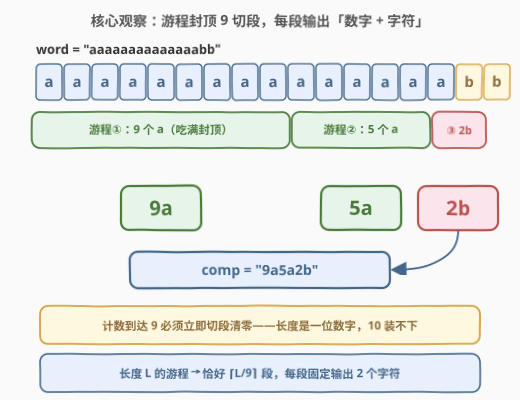
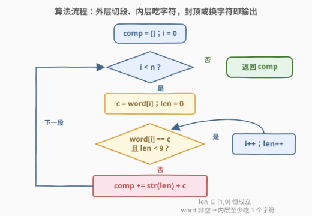
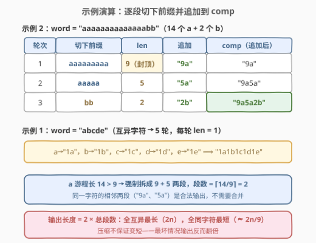

# 压缩字符串III

- **题目名称**：压缩字符串III
- **链接**：[3163. 压缩字符串III](https://leetcode.cn/problems/string-compression-iii/)
- **难度**：中等
- **标签**：字符串

## 1. 题目概述

给你一个字符串 `word`，请你使用以下算法进行压缩：

- 从空字符串 `comp` 开始。当 `word` **不为空**时，执行以下操作：
  - 移除 `word` 的**最长单字符前缀**——该前缀由单一字符 `c` 重复多次组成，且长度**最多为 9**；
  - 将前缀的长度和字符 `c` 追加到 `comp`。

返回字符串 `comp`。

**示例 1**：

```text
输入：word = "abcde"
输出："1a1b1c1d1e"
解释：初始时 comp = ""。进行 5 次操作，每次分别选择 "a"、"b"、"c"、"d"、"e" 作为前缀，
对每个前缀，将 "1" 和对应的字符追加到 comp。
```

**示例 2**：

```text
输入：word = "aaaaaaaaaaaaaabb"
输出："9a5a2b"
解释：进行 3 次操作，分别选择 "aaaaaaaaa"、"aaaaa"、"bb" 作为前缀，
依次追加 "9a"、"5a"、"2b"。
```

**约束条件**：

- $1 \le word.length \le 2 \times 10^5$
- `word` 仅由小写英文字母组成

> 💡 读题关键：这是**游程编码**（Run-Length Encoding, RLE）的「封顶变体」——每段长度**最多 9**，超过 9 的游程必须拆成多段。输出格式固定为「一位数字 + 字符」，段长恒为 2。14 个连续 `a` 不能写成 `"14a"`，只能拆成 `"9a" + "5a"`。

---

## 2. 解题思路

### 2.1 朴素思路：按题意切片模拟

题面本身就是一份操作说明书：反复「取最长同字符前缀（$\le 9$）→ 追加 `len + c` → 从 `word` 头上切掉」。直接照抄会遇到两个性能坑：

- 用 `word = word[k:]` 切片移除前缀——每次切片都要**拷贝剩余整个字符串**，最坏 $O(n^2)$；
- 用 `comp = comp + s` 直接拼接——同理每次拼接拷贝整个 `comp`。

修正方式都一样：**不要真的修改 `word`，只用下标 `i` 标记「虚拟剩余串」的开头**；`comp` 用可变缓冲（C++ `string` 尾插 / Python `list` + `join`）。每个字符只被读一次，总时间回到 $O(n)$。

> ⚠️ 别把「移除前缀」想复杂了——它只是游程推进的形象说法，没有任何场景需要真的动 `word`。

### 2.2 核心观察：计数到 9 或字符切换，立即清零输出



把扫描过程看成一个**计数器**的「吃—吐」循环：

- **吃**：当前字符与计数器记录的字符 `c` 相同、且计数 $< 9$ → 计数 +1，指针右移；
- **吐**（两种触发条件，任一满足立即触发）：
  1. **计数到达 9**——封顶强制切段。长度编码是一位数字，10 装不下（`"10a"` 长 3，按「数字+字符」成对解码立即错位，`'0'` 也不是合法字母）。段长恒为 2 正是这个格式**可无损往返解码**的关键；
  2. **字符切换**——经典 RLE 的游程结束。

于是 14 个连续 `a` 自然吐出 `"9a"`（吃到 9 封顶）和 `"5a"`（字符切到 `b`），与示例 2 完全一致。**同一字符的相邻两段是合法输出**——任何判重或合并逻辑都是多余的。

> 💡 **为什么「每次切最长」是对的？** 长度为 $L$ 的游程，每段至多 9，段数至少 $\lceil L/9 \rceil$；每段固定输出 2 个字符，贪心「先切满 9」恰好达到这个下界，任何切法都不会更短（详见 5.1）。

### 2.3 算法流程图



流程要点：

1. 外层 `while i < n`：每轮处理一个「段」；
2. 内层 `while`：同字符且 `len < 9` 就继续吃（`i++`、`len++`）；
3. 内层退出即输出 `str(len) + c`——`len ∈ [1, 9]` **恒成立**（`word` 非空保证内层至少吃 1 个），无需特判 0。

### 2.4 示例演算



| 输入 | 切段轨迹 | comp 变化 | 结果 |
|------|---------|----------|------|
| `"aaaaaaaaaaaaaabb"` | 9a → 5a → 2b | `""` → `"9a"` → `"9a5a"` → `"9a5a2b"` | **"9a5a2b"** |
| `"abcde"` | 1a → 1b → 1c → 1d → 1e | 5 次追加，每次 2 字符 | **"1a1b1c1d1e"** |

示例 2 展示「9 封顶拆段」：`a` 游程长 14 > 9，拆成 $9 + 5$ 两段，段数恰为 $\lceil 14/9 \rceil = 2$；示例 1 展示退化情形——全互异字符时压缩变「扩张」，输出长度 $2n$。

---

## 3. 参考代码

### C++

```cpp
class Solution {
  public:
    string compressedString(string word) {
        int n = word.size(), i = 0;
        string comp;
        comp.reserve(2 * n);                        // 输出长度上界 2n（全互异字符时取到）
        while (i < n) {
            char c = word[i];
            int len = 0;
            while (i < n && word[i] == c && len < 9) {  // 同字符且未满 9 → 继续吃
                i++, len++;
            }
            comp += char('0' + len);                // len ∈ [1,9]，一位数字直接拼
            comp += c;
        }
        return comp;
    }
};
```

### Python

```python
class Solution:
    def compressedString(self, word: str) -> str:
        comp = []
        i, n = 0, len(word)
        while i < n:
            c = word[i]
            j = i
            while j < n and word[j] == c and j - i < 9:  # 吃满 9 个或吃到游程尽头
                j += 1
            comp.append(str(j - i))
            comp.append(c)
            i = j
        return ''.join(comp)
```

> 💡 写法盘点：Python 还可用 `itertools.groupby` 先切出游程、再按 9 整除拆段（见下）；C++ 也可用「前驱字符 + 计数」单循环版（`cnt == 9 || c != prev` 即冲刷），与双指针版等价。**共同红线**：不要用 `comp = comp + s`（Python）逐次拼字符串，$n = 2 \times 10^5$ 时最坏 $O(n^2)$。

groupby 切游程版：

```python
from itertools import groupby

class Solution:
    def compressedString(self, word: str) -> str:
        parts = []
        for c, grp in groupby(word):
            L = sum(1 for _ in grp)               # 该游程总长
            parts += ['9', c] * (L // 9)          # 整 9 段
            if r := L % 9:                        # 余数段（可能没有）
                parts += [str(r), c]
        return ''.join(parts)
```

---

## 4. 复杂度分析

| 维度 | 复杂度 | 说明 |
|------|--------|------|
| 时间复杂度 | $O(n)$ | `i` 单调右移，每个字符恰好被读一次；缓冲尾插摊还 $O(1)$ |
| 空间复杂度 | $O(n)$ | 输出本身最长 $2n$；除输出外仅 `i / j / len / c` 等常数个变量，辅助空间 $O(1)$ |
| 输出规模 | $\le 2n$ | 最坏全互异字符：$n$ 段 × 每段 2 字符；`reserve(2n)` 一次分配避免中途扩容 |

---

## 5. 扩展

### 5.1 贪心最优性：段数下界 $\lceil L/9 \rceil$

设某游程长度为 $L$（同一字符连续出现 $L$ 次）。任何合法压缩中，覆盖它的每段长度 $\le 9$，故段数

$$k \ge \left\lceil \frac{L}{9} \right\rceil$$

贪心「先切满 9、再切余数」恰好用 $\lfloor L/9 \rfloor + [L \bmod 9 > 0] = \lceil L/9 \rceil$ 段，取到下界。又因**不同字符的段无法合并**（每段只装一种字符），各游程独立取最优即全局最优。输出总长为

$$2 \sum_i \left\lceil \frac{L_i}{9} \right\rceil, \quad \text{其中 } \sum_i L_i = n$$

顺带得到两个极端：全同字符（$L = n$）输出最短，约 $\frac{2n}{9}$；全互异（$n$ 个长 1 游程）输出最长 $2n$——**压缩不保证变短，最坏反而翻倍**。

### 5.2 压缩字符串家族纵览

| 题目 | 格式约束 | 核心考点 |
|------|---------|---------|
| [443. 压缩字符串](../0401-0500/443_压缩字符串.md) | 字符在前、计数可多位 | **原地**改写字符数组，双指针写回 |
| [1531. 压缩字符串 II](../1501-1600/1531_压缩字符串II.md) | 同 443，允许删 $\le k$ 个字符 | 区间 DP：删谁最划算 |
| **3163. 压缩字符串 III** | **计数前置、封顶 9** | 纯模拟：封顶强制拆段 + 输出缓冲 |

三题同源不同味：443 考**原地工程技巧**，1531 考 **DP 建模**，3163 考**读题细节**——「封顶 9」与「数字在前」这两个小改动，让干净模拟成为唯一合理考点。

---

## 6. 面试要点

1. **为什么计数到 9 必须立即输出，不能攒到字符切换一起算？**

   - 长度编码是**一位数字**。攒到 10 以上会输出 `"10a"` 这类串——按「数字+字符」成对解码时长度为奇数、立即错位，且 `'0'` 不是合法字母，编码直接损坏。封顶 9 保证每段**定长 2 字符**，无前缀歧义、可无损往返解码。

2. **为什么「每次切最长前缀（$\le 9$）」是最优策略？**

   - 输出长度 = $2 \times$ 总段数，与每段具体多长无关。长度 $L$ 的游程至少需要 $\lceil L/9 \rceil$ 段，贪心恰好取到；不同字符的段不能合并，各游程独立最优即全局最优（见 5.1）。

3. **为什么 Python 必须用 `list` + `''.join` 而不是 `comp += s`？**

   - 字符串不可变，`comp += s` 每次重建整个串，最坏 $O(n^2)$；`list.append` 摊还 $O(1)$，最后 `join` 一次 $O(n)$。C++ 的 `std::string` 尾插本身摊还 $O(1)$，`reserve(2n)` 再省掉扩容拷贝。

4. **输出的长度上界是多少？什么时候取到？**

   - $2n$，所有字符互异时取到（每段长度 1，输出 `1c` 两字符）；全同字符时最短，约 $2\lceil n/9 \rceil$。由此 `comp.reserve(2 * n)` 是安全的**精确**上界。

5. **本题和 443 原地压缩的本质区别是什么？**

   - 443 要求**原地**改写字符数组（返回有效长度），计数可能多位（如 `"12"`），写回位置与读位置错开，考双指针工程；3163 返回**新串**，计数封顶 9 保证定长段，考的是对「拆段」边界与输出缓冲的处理。

---

## 7. 同类练习题

- [443. 压缩字符串](https://leetcode.cn/problems/string-compression/)（[站内题解](../0401-0500/443_压缩字符串.md)）：本题的**原地版**——字符在前、计数可多位，双指针原地写回
- [1531. 压缩字符串 II](https://leetcode.cn/problems/string-compression-ii/)（[站内题解](../1501-1600/1531_压缩字符串II.md)）：本题的 **DP 硬核版**——允许删除至多 k 个字符，求最短压缩长度
- [1446. 连续字符](https://leetcode.cn/problems/consecutive-characters/)（[站内题解](../1401-1500/1446_连续字符.md)）：**游程检测基础题**——最长同字符游程，正是本题「吃」的那半边
- [38. 外观数列](https://leetcode.cn/problems/count-and-say/)（[站内题解](../0001-0100/38_外观数列.md)）：**RLE 生成器版**——「数数」递归套娃，本质仍是游程计数
