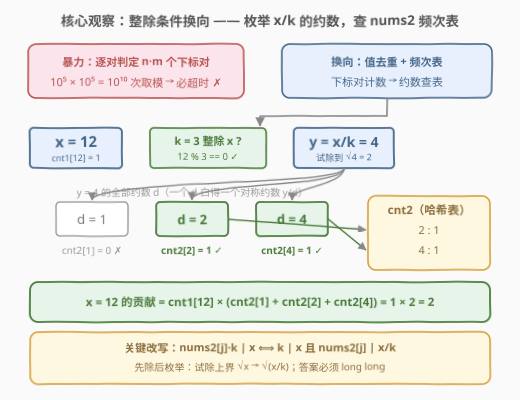
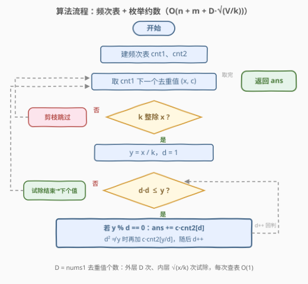
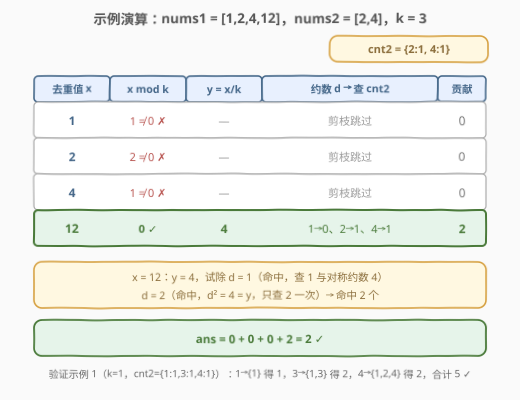
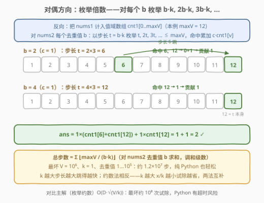

# 优质数对的总数 II

- **题目名称**：优质数对的总数 II
- **链接**：[3164. 优质数对的总数 II](https://leetcode.cn/problems/find-the-number-of-good-pairs-ii/)
- **难度**：中等
- **标签**：数组、哈希表、枚举、数论

## 1. 题目概述

给你两个整数数组 `nums1` 和 `nums2`，长度分别为 `n` 和 `m`。同时给你一个**正整数** `k`。

如果 `nums1[i]` 可以除尽 `nums2[j] * k`，则称数对 `(i, j)` 为 **优质数对**（`0 <= i <= n - 1`，`0 <= j <= m - 1`）。

返回**优质数对**的总数。

**示例 1**：

```text
输入：nums1 = [1,3,4], nums2 = [1,3,4], k = 1
输出：5
解释：5 个优质数对分别是 (0, 0), (1, 0), (1, 1), (2, 0) 和 (2, 2)。
```

**示例 2**：

```text
输入：nums1 = [1,2,4,12], nums2 = [2,4], k = 3
输出：2
解释：2 个优质数对分别是 (3, 0) 和 (3, 1)。
```

**约束条件**：

- $1 \le n, m \le 10^5$
- $1 \le nums_1[i], nums_2[j] \le 10^6$
- $1 \le k \le 10^3$

> 💡 读题关键：题面与前作 [3162. 优质数对的总数 I](https://leetcode.cn/problems/find-the-number-of-good-pairs-i/)（[站内题解](../3101-3200/3162_优质数对的总数I.md)）逐字相同，变的只有数据范围——而范围一变，解法天差地别：$n \cdot m$ 最高 $10^{10}$，前作的双重循环必超时；答案上界同样是 $10^{10}$，`int` 必然溢出。判定方向不变：`nums1[i] % (nums2[j] * k) == 0`，**被除数是 `nums1[i]`**，且 `k` 乘在 `nums2[j]` 上、取模之前。

---

## 2. 解题思路

### 2.1 暴力思路：为什么 $O(nm)$ 彻底失效

前作里 $n \cdot m \le 2500$，双重循环就是正解；本题 $n \cdot m$ 最高 $10^{10}$，按每秒 $10^8$ 次取模估算也要跑上百秒——**超时三个数量级**，枚举「下标对」这条路彻底堵死。

换个角度数一数还能枚举什么：**值域只有 $10^6$**，去重后 `nums1`、`nums2` 各至多 $10^5$ 个不同值，而一个数 $x$ 的约数个数至多几百个。把计数对象从「下标对」降维成「值对」，就是全部优化空间所在——**频次表折叠重复值，整除条件换向到约数上查表**。

### 2.2 核心观察：整除条件换向——枚举 $x/k$ 的约数，查 `nums2` 频次表



一切从这条等价改写出发（把「乘积的整除」拆成两步）：

$$nums_2[j] \cdot k \mid nums_1[i] \iff k \mid nums_1[i] \;\text{且}\; nums_2[j] \,\Big|\, \frac{nums_1[i]}{k}$$

- **正向**：$nums_2[j] \cdot k$ 本身是 $k$ 的倍数，它若整除 $x$，自然有 $k \mid x$；且商 $\dfrac{x}{nums_2[j] \cdot k} = \dfrac{x/k}{nums_2[j]}$ 是整数，即 $nums_2[j] \mid x/k$；
- **反向**：若 $x = k \cdot z$ 且 $z = nums_2[j] \cdot t$，则 $x = nums_2[j] \cdot k \cdot t$，整除成立。

于是「$x$ 与哪些 `nums2[j]` 配对」变成：**先过滤 $k \mid x$，再在 $x/k$ 的约数集合里数出 `nums2` 中等于这些约数的元素个数**。约数集合怎么来？从 $1$ 试除到 $\sqrt{x/k}$，每发现一个小约数 $d$，就白得一个对称大约数 $y/d$。

配上两张频次表，算法闭环：

$$ans = \sum_{\text{去重值 } x} cnt_1[x] \cdot \sum_{d \,\big|\, x/k} cnt_2[d]$$

其中 $cnt_1$、$cnt_2$ 分别是 `nums1`、`nums2` 的值频次表。四个要点：

- **先除后枚举**：枚举 $x/k$ 的约数，而不是枚举 $x$ 的约数再逐个判 $k \mid d$——试除上界从 $\sqrt{x}$ 缩到 $\sqrt{x/k}$（$k = 10^3$ 时约缩小 $31$ 倍），且 $k \nmid x$ 的值整支剪掉；
- **两个方向都去重**：`nums1` 按值去重后，重复值只做一次试除；`nums2` 折叠进频次表后，重复值只占一行；
- **去重只是省枚举，计数要乘回频次**：数对按下标计，值相同的下标各算一个数对，贡献是 $cnt_1[x] \cdot cnt_2[d]$ 的**乘法展开**；
- **答案用 `long long`**：上界 $n \cdot m = 10^{10} > 2^{31} - 1$——这几乎是所有「计数放大版」续作的共同考点。

### 2.3 算法流程图



外层遍历 $cnt_1$ 的去重值，$k \nmid x$ 直接剪枝回循环；内层从 $1$ 试除到 $\sqrt{x/k}$，每命中一个约数 $d$ 就查一次 $cnt_2$，对称约数 $y/d$ 与 $d$ 相等（$y$ 为完全平方数）时只计一次；内层试除耗尽后回到外层取下一个值，全部遍历完返回 `ans`。

### 2.4 示例演算



以示例 2（`nums1 = [1,2,4,12]`，`nums2 = [2,4]`，`k = 3`）为例，$cnt_2 = \{2{:}1,\ 4{:}1\}$，`nums1` 无重复值：

| 去重值 $x$ | $x \bmod k$ | $y = x/k$ | 约数查表 | 贡献 |
|------|------|------|------|------|
| 1 | $1 \ne 0$ ✗ | — | 剪枝跳过 | 0 |
| 2 | $2 \ne 0$ ✗ | — | 剪枝跳过 | 0 |
| 4 | $1 \ne 0$ ✗ | — | 剪枝跳过 | 0 |
| 12 | $0$ ✓ | $4$ | $cnt_2[1]{=}0$、$cnt_2[2]{=}1$、$cnt_2[4]{=}1$ | $1 \times 2 = 2$ |

- $x = 12$：$y = 4$，试除 $d = 1$（命中，查 $cnt_2[1]$ 与对称约数 $cnt_2[4]$）、$d = 2$（命中，$d^2 = y$，只查 $cnt_2[2]$ 一次）；
- 其余三个值被 $k \nmid x$ 剪掉，$ans = 2$，与示例一致。

再验示例 1（$k = 1$，$cnt_2 = \{1{:}1, 3{:}1, 4{:}1\}$）：$x=1$ 的约数 $\{1\}$ 贡献 $1$；$x=3$ 的约数 $\{1,3\}$ 贡献 $2$；$x=4$ 的约数 $\{1,2,4\}$ 贡献 $2$；合计 $1 + 2 + 2 = 5$ ✓。

---

## 3. 参考代码

### C++

```cpp
class Solution {
  public:
    long long numberOfPairs(vector<int>& nums1, vector<int>& nums2, int k) {
        unordered_map<int, int> cnt1, cnt2;
        for (int x : nums1) cnt1[x]++;                 // nums1 值频次（顺带去重）
        for (int y : nums2) cnt2[y]++;                 // nums2 值频次

        long long ans = 0;
        for (auto& [x, c] : cnt1) {                    // 只枚举去重后的值
            if (x % k) continue;                       // k ∤ x：与谁都配不成，整支剪掉
            int y = x / k;
            for (int d = 1; d * d <= y; d++) {
                if (y % d) continue;                   // d 不是 y 的约数
                auto it = cnt2.find(d);
                if (it != cnt2.end()) ans += 1LL * c * it->second;
                if (d * d == y) continue;              // 完全平方：对称约数只计一次
                it = cnt2.find(y / d);                 // 对称大约数 y/d
                if (it != cnt2.end()) ans += 1LL * c * it->second;
            }
        }
        return ans;
    }
};
```

### Python

```python
class Solution:
    def numberOfPairs(self, nums1: List[int], nums2: List[int], k: int) -> int:
        cnt2 = Counter(nums2)
        ans = 0
        for x, c in Counter(nums1).items():            # 去重后枚举
            if x % k:
                continue                               # k ∤ x，整支剪掉
            y = x // k
            d = 1
            while d * d <= y:
                if y % d == 0:
                    ans += c * cnt2[d]                 # Counter 查无此键返回 0
                    if d * d != y:
                        ans += c * cnt2[y // d]        # 对称约数（平方数只计一次）
                d += 1
        return ans
```

> 💡 两份代码同一逻辑。Python 的 `Counter` 下标访问不存在的键返回 `0`，省掉判空；C++ 的 `unordered_map` 必须先 `find` 再解引用。⚠️ 两处易错：`ans += 1LL * c * it->second` 的 `1LL` 必须在最前——`c` 与频次都是 `int`，先乘后转时中间结果已经溢出；纯 Python 最坏情形（去重后仍有大量接近 $10^6$ 的值且 $k=1$）约 $10^8$ 次循环有超时风险，实战建议换用第 5 节的倍数枚举写法。

---

## 4. 复杂度分析

| 维度 | 复杂度 | 说明 |
|------|--------|------|
| 时间复杂度 | $O\big(n + m + D\sqrt{V/k}\big)$ | $D$ 为 `nums1` 去重后的值个数（$D \le \min(n, V)$），$V \le 10^6$ 为值域上界；最坏 $O(n\sqrt{V}) \approx 10^8$ 次试除，C++ 可过、Python 有风险 |
| 空间复杂度 | $O(n + m)$ | 两张哈希频次表 |

---

## 5. 扩展：对偶方向——枚举倍数（调和级数）

整除计数有一对天然对偶的方向：**枚举约数**（对每个 $x$ 问「谁是它的约数」）与**枚举倍数**（对每个 $b$ 问「谁是它的倍数」）。把主解整个反过来写：

1. 把 `nums1` 计数到**值域数组** $cnt_1[\,]$（长度 $\max(nums_1) + 1$）；
2. 对 `nums2` 的每个去重值 $b$（频次 $c$）：令步长 $t = b \cdot k$，若 $t > \max(nums_1)$ 直接跳过；否则枚举 $t, 2t, 3t, \ldots$ 直到越过 $\max(nums_1)$，每步累加 $c \cdot cnt_1[v]$。



```cpp
class Solution {
  public:
    long long numberOfPairs(vector<int>& nums1, vector<int>& nums2, int k) {
        int maxV = *max_element(nums1.begin(), nums1.end());
        vector<int> cnt1(maxV + 1);
        for (int x : nums1) cnt1[x]++;                // nums1 值域频次数组

        unordered_map<int, int> cnt2;
        for (int y : nums2) cnt2[y]++;

        long long ans = 0;
        for (auto& [b, c] : cnt2) {                   // 只枚举去重后的 b
            long long t = 1LL * b * k;                // 步长 b·k（可达 10^9，防溢出）
            if (t > maxV) continue;                   // 最小倍数已越界
            for (long long v = t; v <= maxV; v += t)
                if (cnt1[v]) ans += 1LL * c * cnt1[v];
        }
        return ans;
    }
};
```

```python
class Solution:
    def numberOfPairs(self, nums1: List[int], nums2: List[int], k: int) -> int:
        max_v = max(nums1)
        cnt1 = [0] * (max_v + 1)
        for x in nums1:
            cnt1[x] += 1

        ans = 0
        for b, c in Counter(nums2).items():           # 只枚举去重后的 b
            t = b * k                                 # 步长
            if t > max_v:
                continue                              # 最小倍数已越界
            for v in range(t, max_v + 1, t):          # t, 2t, 3t, ...
                if cnt1[v]:
                    ans += c * cnt1[v]
        return ans
```

三法对比（$V = 10^6$ 为值域上界，$D$、$m'$ 分别为两数组去重后的值个数）：

| 解法 | 时间复杂度 | 最坏量级估算 |
|------|-----------|--------------|
| 暴力逐对 | $O(nm)$ | $10^{10}$ |
| 枚举约数（主解） | $O\big(n + m + D\sqrt{V/k}\big)$ | $\sim 10^8$ |
| 枚举倍数（本节） | $O\big(n + m + \sum_{b} \lfloor V/(bk) \rfloor\big)$ | $\sim 1.2 \times 10^7$ |

倍数法的总步数是**调和级数**：$\sum_{\text{去重 } b} \lfloor V/(b \cdot k) \rfloor \le \frac{V}{k}\big(1 + \ln m'\big)$——即便 $k = 1$、去重值恰为 $1 \sim 10^5$ 的最坏情形也只有约 $1.2 \times 10^7$ 步，且全是数组访问，**纯 Python 也能轻松通过**。另一个有趣的互补关系：$k$ 越大，倍数法步长越大、跳得越快；而约数法相反，$k$ 越大 $x/k$ 越小、试除越省。

> 💡 官方 hint 还提到第三条路：预处理**最小质因子表（SPF）**后，每个数分解质因数只需 $O(\log x)$，再由质因数幂次组合生成全部约数——把主解的 $\sqrt{V/k}$ 压到对数级，代价是 $O(V)$ 的预处理与实现复杂度，本题收益有限，了解思路即可。

---

## 6. 面试要点

1. **前作 3162 的双重循环搬过来为什么不行？**

   - $n \cdot m$ 从 $2500$ 涨到 $10^{10}$，超时三个数量级。正确姿势是主动指出「范围变了，计数对象要降维」：下标对 → 值对，用频次表折叠重复值。同时答案上界 $10^{10}$ 溢出 `int`，返回类型必须 `long long`。

2. **「先判 $k \mid x$、再枚举 $x/k$ 的约数」这个顺序有什么讲究？**

   - 一举两得：$k \nmid x$ 的值整支剪掉；幸存的值试除上界从 $\sqrt{x}$ 缩到 $\sqrt{x/k}$。反过来「枚举 $x$ 的约数再判 $k \mid d$」既不剪枝、上界还更大。

3. **为什么贡献是 $cnt_1[x] \cdot cnt_2[d]$，而不是查到就 +1？**

   - 数对按下标计数，值相同的元素各自参与配对。去重省的是「枚举次数」，计数必须按乘法原理把两个频次乘回来——漏乘是本题最常见 WA 点（示例 1 里 $x = 3$ 贡献 2 而不是 1）。

4. **枚举约数和枚举倍数，怎么选？**

   - 约数法 $O\big(D\sqrt{V/k}\big)$：不依赖 `nums1` 值域上限，值大而少时占优；倍数法 $\sum_b \lfloor V/(bk) \rfloor$ 调和级数：依赖值域 $V$ 但总量极小，Python 首选。二者是整除计数的标准对偶，面试能主动说出任一方向并算清复杂度即可加分。

5. **试除枚举约数有哪些实现细节？**

   - 循环条件写 `d * d <= y`，防 $d$ 越过 $\sqrt{y}$；命中 $d$ 后对称约数是 $y / d$；$d^2 = y$（完全平方）时只计一次；C++ 中间乘积要 `1LL * c * cnt` 防 `int` 溢出。

---

## 7. 同类练习题

- [3162. 优质数对的总数 I](https://leetcode.cn/problems/find-the-number-of-good-pairs-i/)（[站内题解](../3101-3200/3162_优质数对的总数I.md)）：前作，小范围暴力版；其第 5 节即本题解法预告
- [2507. 使用质因数之和替换后可以取到的最小值](https://leetcode.cn/problems/smallest-value-after-replacing-with-sum-of-prime-factors/)：循环做质因数分解替换的模拟题，与「枚举约数」同源的数论手感
- [2521. 数组乘积中的不同质因数数目](https://leetcode.cn/problems/distinct-prime-factors-of-product-of-array/)：逐元素质因数分解 + 集合去重，SPF 预处理的直接应用
- [1735. 生成乘积数组的方案数](https://leetcode.cn/problems/count-ways-to-make-array-with-product/)：把乘积拆成质因数指数后做组合计数，因数分解路线的困难题进阶
